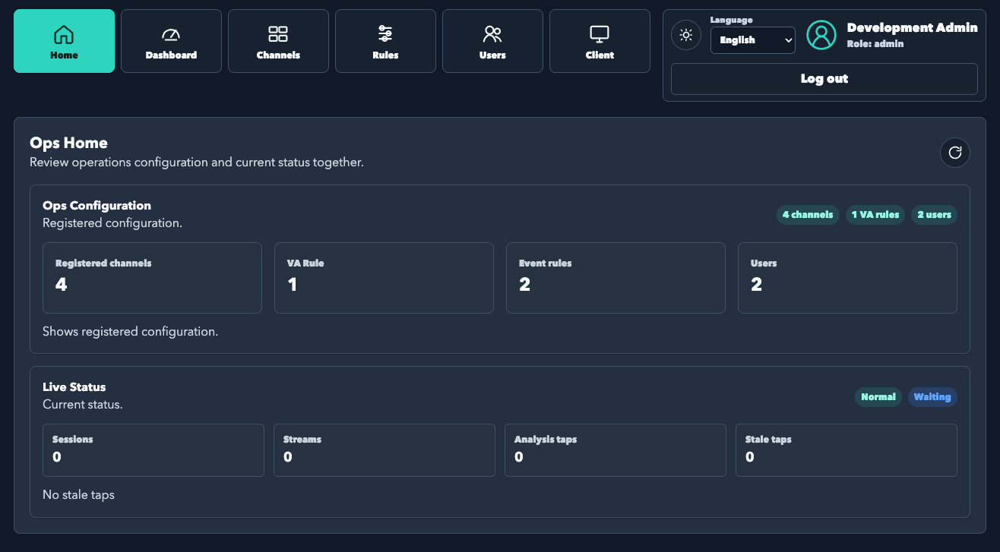
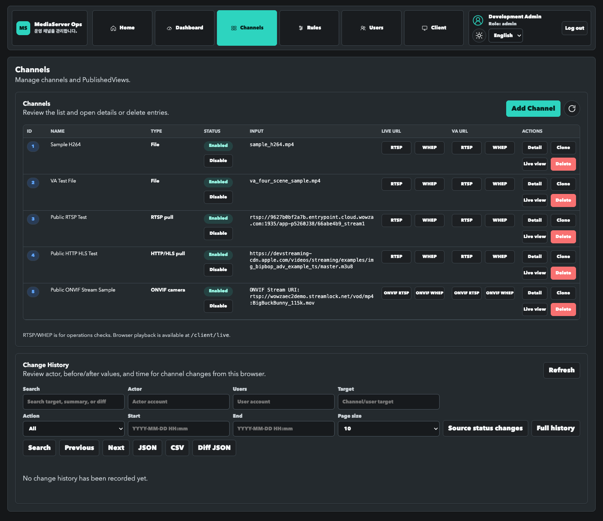
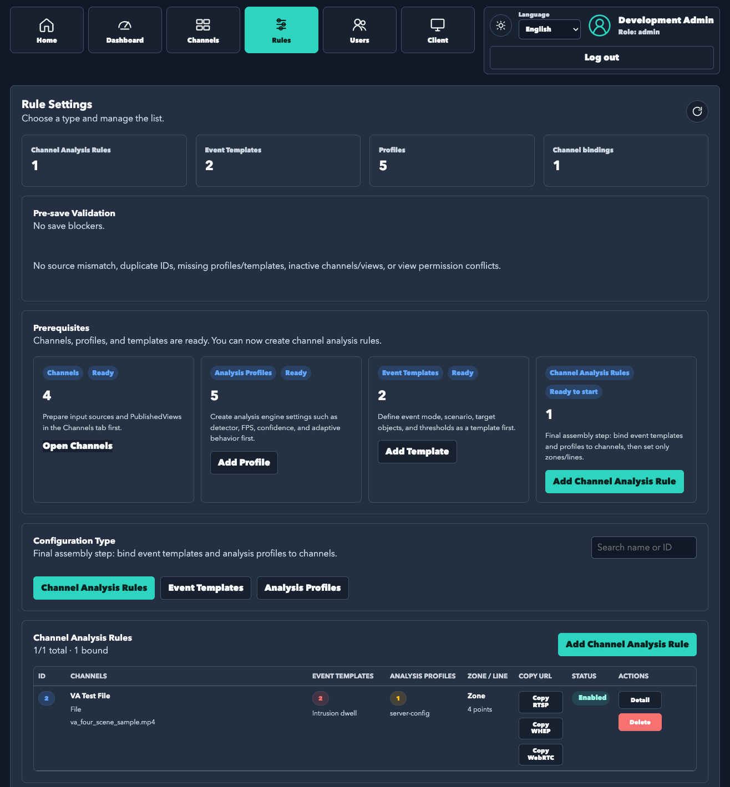
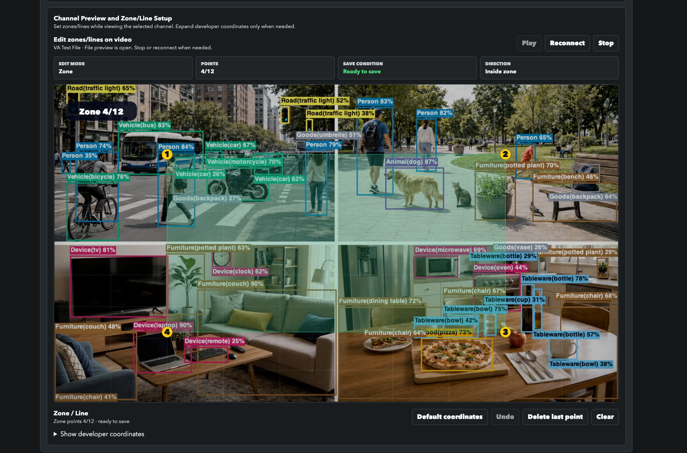
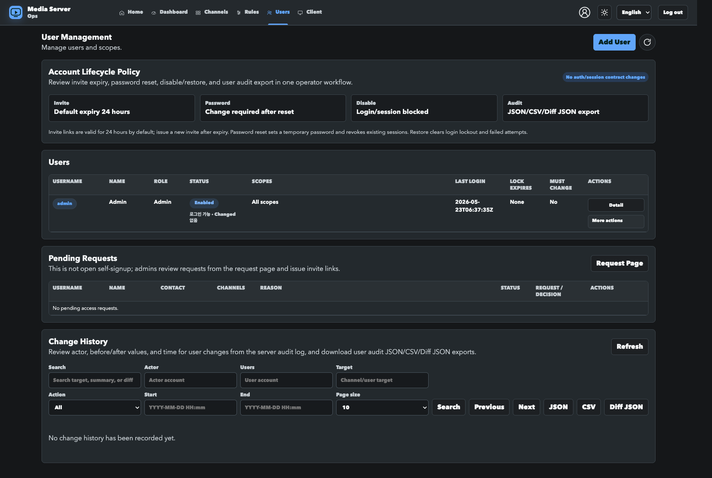
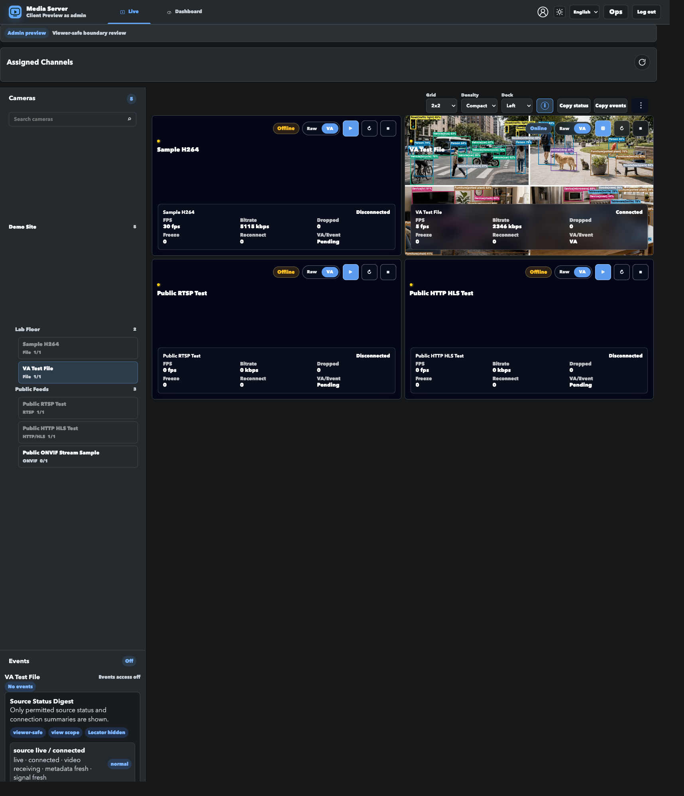

# Media Server

[](https://github.com/dhseo90/MediaServer/actions/workflows/preflight.yml)
[](https://github.com/dhseo90/MediaServer/actions/workflows/licensing-artifact-guardrails.yml)
[](https://github.com/dhseo90/MediaServer/releases/tag/v2.4.0)
[](https://github.com/dhseo90/MediaServer/releases/tag/v2.5.0)

Media Server is a C++17 RTSP/WebRTC live stream relay. It can add YOLO/ONNX
video analytics overlays and rule/scenario live events when analytics are enabled.

The current product boundary is **live source onboarding, live source health, and
live VA event quality**. Long-term recording, VMS/NVR, playback/search, and
runtime/model bundle distribution are outside the default release scope.

- Korean documentation: [README.md](README.md)
- Documentation index: [docs/README.md](docs/README.md)
- Latest published release: [v2.4.0](https://github.com/dhseo90/MediaServer/releases/tag/v2.4.0)
- Current release target: [v2.5.0](https://github.com/dhseo90/MediaServer/releases/tag/v2.5.0)
- Release baseline: `v2.5.0 Semantic Incident Memory`

## At a Glance

- **Streaming**: exposes file, RTSP pull, WHEP pull, WHIP publish, and HTTP/HLS
  sources through RTSP and WebRTC/WHEP outputs.
- **Video analytics**: supports `va=1` overlays, saved rules through
  `vaRule=<id>`, Rule/Profile/Scenario models, live Event POST, and runtime
  metadata. EventRecord, snapshot, and clip hooks are short event evidence
  helpers, not the central product message.
- **VLM review assist**: adds Ops-only review assistance for event explanations,
  false-positive hints, and suggestion candidates. VLM model/runtime bundles and
  real cloud provider calls are not part of the default release.
- **Product UI**: routes users to Ops or Client views based on account
  permissions. There is no Lab product screen; lab endpoints remain available
  for API and verification workflows.
  `v2.5.0` turns EventRecord, audit, source health, and alert dry-run data into
  searchable incident memory for `/ops/events` search, timelines, explainable
  briefs, and similar-incident lookup without expanding backend media paths,
  event schemas, or auth policy.
- **Auth and scopes**: supports first-admin setup, session login, role/scope,
  admin user management, and viewer invite/request approval.
- **Verification**: `./server.sh` provides UI/Auth smoke tests, VA replay checks,
  runtime state checks, backup/restore rehearsal, and RC gate artifact checks.
- **Distribution boundary**: the default public release contains source code and
  documentation. Binary, runtime, and model bundles are not published unless
  separate guardrails pass.

## Semantic Incident Memory

v2.5.0 keeps the v2.4.0 source-only/live-only baseline and VLM review-assist
default-off boundary while extending Operator Event Review into searchable
incident memory. YOLO/Rule/Scenario still create EventRecords; local text
projection and indexing connect EventRecord, audit, source health, and alert
dry-run evidence for search, timelines, similar incidents, viewer-safe digests,
and redacted evidence bundles while keeping the existing Event POST, WebRTC,
SSE/WS metadata schemas and media paths.

Model recommendation is based on both PC capability and privacy mode. The current
baseline is `Qwen/Qwen3-VL-8B-Instruct` for local standard hardware,
`Qwen/Qwen3-VL-4B-Instruct` as the low-spec fallback,
`Qwen/Qwen3-VL-30B-A3B-Instruct` as a high-tier evaluation candidate, and
`gemini-2.5-flash` as the explicit cloud opt-in fallback. Real model/runtime
installation, guaranteed cloud provider success, model/runtime bundle
distribution, and default-on promotion are outside the default release.

Details:

- Model selection: [docs/vlm-model-selection.md](docs/vlm-model-selection.md)
- PC-based recommendation engine: [docs/vlm-recommendation-engine.md](docs/vlm-recommendation-engine.md)
- Install/connection dry-run: [docs/vlm-install-connection-dry-run.md](docs/vlm-install-connection-dry-run.md)
- Ops review UI flow: [docs/vlm-ops-event-review-ui.md](docs/vlm-ops-event-review-ui.md)

## Runtime Requirements

| Area | Requirement |
| --- | --- |
| OS | macOS or Linux |
| Build | C++17, CMake 3.16+ |
| Media runtime | GStreamer 1.0, gst-rtsp-server, WebRTC-related GStreamer plugins |
| Optional AI | ONNX Runtime, YOLO ONNX model, label file |
| Helper tools | Node.js, Python 3, FFmpeg/ffprobe, curl |
| Defaults | RTSP route `dhseo`, file root `video/` |

## Quick Start

```bash
./server.sh install
./server.sh build
./server.sh start
./server.sh status
./server.sh urls
```

Open:

```text
http://127.0.0.1:8081/
```

Stop:

```bash
./server.sh stop
```

For foreground logs:

```bash
./server.sh foreground
```

If you only need the streaming path without AI:

```bash
MEDIA_SERVER_ENABLE_AI=0 ./server.sh build
```

The default auth mode is `MEDIA_SERVER_AUTH_MODE=auto`. If no users file or
`admin.passwordHash` exists, the first browser visit redirects to `/setup`.
There is no default production admin password.

## Sample and Asset Scope

Tracked `video/*.mp4` files and the allowlisted
`video/imports/va_tracking_event_1280x720_30fps_h264.mp4` are generated
verification fixtures. Customer media, operations evidence, YOLO model binaries,
FFmpeg/GStreamer runtime binaries, logs, and auth stores are not public
repository content.

See [docs/sample-fixture-provenance.md](docs/sample-fixture-provenance.md) for
fixture provenance and public-release decisions. English readers should start
from the consolidated [docs/en/README.md](docs/en/README.md).

## Documentation Guide

This README is the product overview. Detailed policies, verification history, and
release evidence live in dedicated docs.

- Full index: [docs/README.md](docs/README.md)
- Setup, build, and run: [docs/development-guide.md](docs/development-guide.md)
- Ops and Client UI: [docs/ui-guide.md](docs/ui-guide.md)
- RTSP/WebRTC/VA architecture:
  [docs/media-server-architecture.md](docs/media-server-architecture.md)
- Video analytics and scenarios: [docs/video-analysis.md](docs/video-analysis.md)
- Verification commands: [docs/stream-verification.md](docs/stream-verification.md)
- Release/version policy: [docs/release-policy.md](docs/release-policy.md),
  [docs/versioning-policy.md](docs/versioning-policy.md)
- Release roadmap/archive: [docs/development-backlog.md](docs/development-backlog.md)
- Release notes target: [v2.5.0](https://github.com/dhseo90/MediaServer/releases/tag/v2.5.0)
- Latest published release notes: [v2.4.0](https://github.com/dhseo90/MediaServer/releases/tag/v2.4.0)
- Active roadmap: `v2.5.0 Semantic Incident Memory` in
  [docs/development-backlog.md](docs/development-backlog.md)

## UI Preview

These images are documentation preview assets, not UI fulltest PASS evidence.
For the active `v2.5.0` docs baseline, QA-registry-heavy recaptures and
unapproved Chrome/CDP fallback captures are not used as representative assets.

**Ops Home**



**Ops Channels**



**Ops Rules**



**Rule Preview Editor**



**Ops Users**



**Client Live**



## Account Views

- First run, or an empty account store, opens the admin password setup view.
- `admin` and `operator` users see Ops screens for channels, rules, users, and diagnostics.
- `viewer` users see only assigned Client screens. Raw source URLs, internal diagnostic JSON, and rule/profile editors are not exposed.
- `integrator` is intended for scoped API integration rather than daily UI operation.

## Testing Summary

Broad default regression:

```bash
./server.sh test
```

For documentation or release metadata changes, start with the fast checks:

```bash
git diff --check
./server.sh verify-release-metadata
./server.sh verify-docs-links
```

After main/tag/GitHub Release publication, run
`./server.sh verify-release-metadata --published` to check GitHub Latest Release
and the remote tag.

Release-local baseline:

```bash
./server.sh test --full
```

See [docs/stream-verification.md](docs/stream-verification.md) for UI/Auth/VA,
longrun, and release gate commands. Do not put real customer URLs, credentials,
or operation media paths into docs or artifacts.

## Pipeline

```text
File / RTSP Pull / WHEP Pull / WHIP Publish / HTTP-HLS URI
        -> Media Server
        -> RTSP Output / WebRTC Output
        -> optional VA overlay / rule events / scenario events / runtime metadata
```

VA flow:

```text
YOLO Detection
  -> Direction-Based Tracker
  -> TrackStateManager
  -> SceneContextBuilder
  -> RuleEventEngine / ScenarioEngine
  -> EventManager
  -> Overlay / Runtime Metadata / Event POST / EventRecord
```
