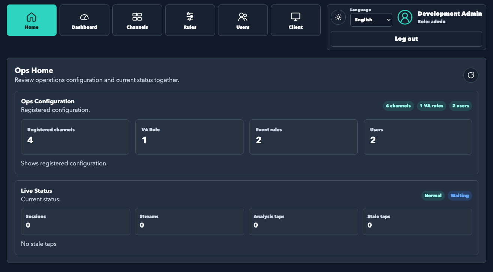
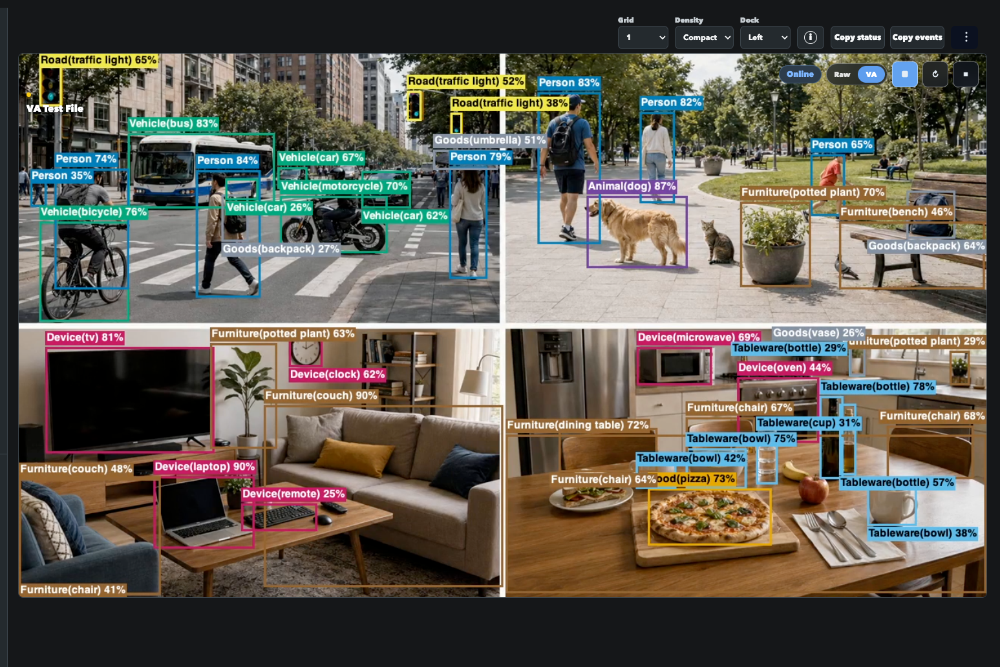

# Media Server

[](https://github.com/dhseo90/MediaServer/actions/workflows/preflight.yml)
[](https://github.com/dhseo90/MediaServer/actions/workflows/licensing-artifact-guardrails.yml)


A C++17 media server for macOS and Linux with RTSP/WebRTC relaying, YOLO/ONNX
video analytics, and continuous/event recording. Manage channels and analysis
rules in a browser, watch live streams, and review recorded video.

[한국어](README.md) · [Documentation](docs/en/README.md) ·
[Latest release](https://github.com/dhseo90/MediaServer/releases/latest) ·
[v4.1.0 release notes](docs/release-notes-v4.1.0.md)

## Features

- Streaming: relay file, RTSP, WHEP, WHIP, and HTTP/HLS inputs to RTSP and WebRTC/WHEP outputs.
- Analytics: object-detection overlays, saved rules and scenarios, event delivery, and analysis metadata.
- Recording: per-channel continuous and event-linked recording, capacity-bounded circular retention,
  event-priority timelines, and playback.
- Operations: manage channels, rules, users, and diagnostics in `/ops`;
  watch authorized live streams in `/client`.
- Event review: browse event records, incident timelines, and recordings in `/ops/events`.

Natural-language search across recordings is part of the
[future roadmap](docs/v410-v49-recording-search-roadmap.md), not the current feature set.
This is not a complete VMS/NVR or a guarantee of indefinite video retention.
The default distribution is source-only; AI models and media-runtime binaries are not included.

## Quick Start

Use macOS or Linux with a C++17 compiler, CMake 3.16+, and GStreamer 1.28+.
Video analytics also requires ONNX Runtime, a YOLO ONNX model, and labels.
See the [development guide](docs/development-guide.md) for platform dependencies and optional features.

```bash
./server.sh install
./server.sh build
./server.sh start
./server.sh status
./server.sh urls
```

Open `http://127.0.0.1:8080/` in your browser.
If you changed the port, use the address shown by `./server.sh urls`.
Authentication defaults to `auto`; on first run, set the administrator password at `/setup`.
There is no default administrator password.

Use `./server.sh stop` to stop the server or `./server.sh foreground` for foreground development.

## From Recording Setup to Playback

1. Enable recording: set `MEDIA_SERVER_RECORDING_ENABLED=1` for the server and enable
   recording on the operating channel. A disabled channel does not record.
   See [recording settings](docs/config-reference.md#recording-env) for storage location,
   capacity, and retention.
2. Check storage: the recording section of `/ops/events` shows channel activity,
   continuous/event usage, and storage-blocked status.
   The two retention budgets are separate; eligible older data is removed when limits are exceeded.
   Recording may be blocked if pin/hold protection prevents deletion or disk reserve is insufficient.
3. Browse the timeline: select a channel and time range.
   Event recordings take priority where overlap with the same source is confirmed.
   Partial or time-unconfirmed records remain distinct from complete recordings, and originals can be shown.
4. Play a recording: select an item, then use the play, pause, and seek controls.
   Playback starts at the beginning of the file. Selecting a time does not automatically seek,
   and the next file does not play automatically. The browser must support the video format.

See the [recording and playback guide](docs/ui-guide.md#녹화-조회와-재생-v410-s06) for
event integration and screen details, and the
[recording API](docs/config-reference.md#녹화-조회재생-api-v410-s06) for API and authorization rules.

## Roles

- `admin`: manages channels, rules, users, and diagnostics. User management is admin-only.
- `operator`: operates channels, rules, and diagnostics, but cannot access user management.
- `viewer`: uses assigned Client screens only. Source URLs and internal diagnostics are not exposed.
- `integrator`: uses APIs within the granted scope.

Recording queries and playback also enforce role and channel permissions.
See the [UI guide](docs/ui-guide.md) for screen and permission details.

## UI Preview

Ops Home



Client Live with video analytics



See the [UI guide](docs/ui-guide.md) for channel, rule, and user-management screens.

## Documentation and Development

Most detailed guides are maintained in Korean; start with the [English index](docs/en/README.md).

| Purpose | Guide |
| --- | --- |
| Install, build, run | [Development guide](docs/development-guide.md) |
| Operate and configure | [UI guide](docs/ui-guide.md), [Configuration reference](docs/config-reference.md) |
| Architecture and analytics | [Server architecture](docs/media-server-architecture.md), [Video analytics](docs/video-analysis.md) |
| Verify and contribute | [Verification commands](docs/stream-verification.md), [Contributing](CONTRIBUTING.md) |
| Future development | [Recording/search roadmap](docs/v410-v49-recording-search-roadmap.md), [Open work](docs/development-backlog.md) |
| All documentation | [Topic index](docs/README.md) |

Public sample videos are generated verification fixtures.
Do not add production/customer media or credentials to the repository.
See [sample provenance](docs/sample-fixture-provenance.md) for their origin and scope.

## License

Original code and documentation are licensed under [Apache License 2.0](LICENSE).
See [NOTICE](NOTICE) and [THIRD_PARTY_NOTICES.md](THIRD_PARTY_NOTICES.md) for separate
dependency/model terms and the [distribution policy](docs/distribution-policy.md) for packaging scope.
For security reports, follow [SECURITY.md](SECURITY.md).
