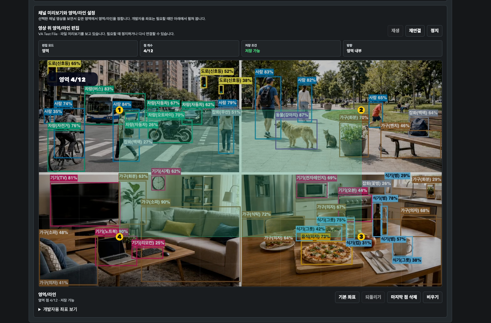

# Media Server

[](https://github.com/dhseo90/MediaServer/actions/workflows/preflight.yml)
[](https://github.com/dhseo90/MediaServer/actions/workflows/licensing-artifact-guardrails.yml)
[](https://github.com/dhseo90/MediaServer/releases/latest)

RTSP/WebRTC live stream을 중계하고, 선택적으로 YOLO/ONNX 기반 영상 분석
overlay와 Rule/Scenario live event를 붙이는 C++17 미디어 서버입니다.
현재 main 기준 제품 경계는 장기 녹화/VMS/NVR이 아니라 live source onboarding,
live source health, live VA event 품질입니다.

English documentation: [README.en.md](README.en.md), [docs/en/README.md](docs/en/README.md)

최신 source-only release: [v1.2.0](https://github.com/dhseo90/MediaServer/releases/tag/v1.2.0)
v1.2.1 patch roadmap과 후속 종료 판정은
[docs/development-backlog.md](docs/development-backlog.md)와
[docs/v1.2.1-follow-up-closure.md](docs/v1.2.1-follow-up-closure.md)에 분리해 기록합니다.
v1.3.0 roadmap 후보는 별도 버전별 roadmap 파일을 만들지 않고
[docs/development-backlog.md](docs/development-backlog.md)의 현재 로드맵 섹션에서 관리합니다.

## 한눈에 보기

- **스트리밍**: file, RTSP pull, WHEP pull, WHIP publish, HTTP/HLS source를 RTSP와 WebRTC/WHEP로 내보냅니다.
- **영상 분석**: `va=1` overlay, 저장 룰 `vaRule=<id>`, Rule/Profile/Scenario, live Event POST와 runtime metadata를 제공합니다.
  EventRecord와 snapshot/clip은 short event evidence 보조 기능이며 현재 중심 제품 메시지는 아닙니다.
- **제품 화면**: 같은 메인 주소에서 계정 권한에 따라 운영자 화면 또는 클라이언트 화면으로 이동합니다.
  `/lab` 화면 route는 닫고 검증/연동 API만 유지합니다.
- **계정/권한**: 최초 관리자 설정, session 로그인, role/scope, admin 사용자 관리, viewer invite/request 승인 흐름을 사용합니다.
- **검증**: UI/Auth smoke, VA replay, runtime state, 백업/복구 리허설, RC gate artifact 검증 명령을 `./server.sh`에서 제공합니다.
- **배포 경계**: source/doc 중심 공개가 기본이며, binary/runtime/model bundle은 별도 guardrail 통과 전까지 제공하지 않습니다.

## 실행 환경

| 구분 | 기준 |
| --- | --- |
| OS | macOS 또는 Linux |
| 언어/빌드 | C++17, CMake 3.16+ |
| 미디어 런타임 | GStreamer 1.0, gst-rtsp-server, WebRTC 관련 GStreamer plugin |
| 선택 AI | ONNX Runtime, YOLO ONNX model, label file |
| 보조 도구 | Node.js, Python 3, ffmpeg/ffprobe, curl |
| 기본 route/file root | RTSP route `dhseo`, file root `video/` |

정확한 설치 버전과 모델 hash는 [DEPENDENCY_SNAPSHOT.md](DEPENDENCY_SNAPSHOT.md)에 기록합니다.
release 또는 binary bundle 전에는 `./server.sh dependency-snapshot`으로 다시 생성합니다.
기본 binary bundle에는 FFmpeg/libav/x264/x265/GStreamer GPL-risk plugin 바이너리를 포함하지 않습니다.
배포 bundle은 `./server.sh verify-bundle-policy --bundle-dir <release_bundle_dir>`로 검사합니다.
CI나 공개 검증 환경에서 FFmpeg CLI 의존을 빼려면 `./server.sh test --basic --ffmpeg-free`를 사용합니다.

권장 준비 명령:

```bash
./server.sh install
./server.sh build
```

`./server.sh install`은 로컬 의존성, ONNX Runtime, YOLO 모델/라벨,
로컬 env 파일을 준비합니다. 패키지별 수동 설치 명령은
[docs/development-guide.md](docs/development-guide.md)의 요구 환경을 봅니다.
설치는 media runtime과 선택 AI asset을 준비하므로 가볍지 않습니다.
AI 없이 스트리밍 경로만 빌드하려면 다음처럼 실행합니다.

```bash
MEDIA_SERVER_ENABLE_AI=0 ./server.sh build
```

기본 인증 모드는 `MEDIA_SERVER_AUTH_MODE=auto`입니다.
users file 또는 `admin.passwordHash`가 없으면 첫 접속 시 `/setup`으로 이동해
관리자 비밀번호를 직접 설정합니다. 제품 기본 admin 비밀번호는 없습니다.

## 빠른 시작

```bash
./server.sh install
./server.sh build
./server.sh start
./server.sh status
./server.sh urls
```

종료:

```bash
./server.sh stop
```

개발 중 로그를 바로 보려면:

```bash
./server.sh foreground
```

설치/빌드/디버깅 상세는 [docs/development-guide.md](docs/development-guide.md)를 봅니다.

브라우저 접속:

```text
http://127.0.0.1:8081/
```

다른 포트로 실행한 경우에는 `./server.sh status`의 HTTP 주소를 사용합니다.

## Sample/Asset 범위

추적되는 `video/*.mp4`와 allowlist된 `video/imports/va_tracking_event_1280x720_30fps_h264.mp4`는
검증 재현을 위해 생성한 sample fixture입니다. 운영/고객 영상, evidence media, YOLO model binary,
FFmpeg/GStreamer runtime binary는 public repo 또는 기본 release asset에 포함하지 않습니다.
fixture별 공개 판단은 [docs/sample-fixture-provenance.md](docs/sample-fixture-provenance.md)에 기록합니다.

## 문서 로드맵

| 먼저 보고 싶은 것 | 문서 |
| --- | --- |
| 실행 환경, 설치, 빌드, foreground/background 실행 | [docs/development-guide.md](docs/development-guide.md) |
| 영어 문서 진입점 | [docs/en/README.md](docs/en/README.md) |
| Auth/Ops/Client 화면 구조와 사용 흐름 | [docs/ui-guide.md](docs/ui-guide.md) |
| RTSP/WebRTC pipeline, source/session, VA layer 배치 | [docs/media-server-architecture.md](docs/media-server-architecture.md) |
| YOLO, tracking, scenario, live event, short evidence 정책 | [docs/video-analysis.md](docs/video-analysis.md) |
| ONVIF live source 지원과 URL copy parity | [docs/onvif-live-source-support.md](docs/onvif-live-source-support.md) |
| Live source health/operator workflow 기준 | [docs/live-source-health.md](docs/live-source-health.md) |
| Event/WebRTC/SSE/WS metadata contract | [docs/live-event-metadata-contracts.md](docs/live-event-metadata-contracts.md) |
| Integrator contract artifact sample bundle | [docs/integrator-contract-artifact.md](docs/integrator-contract-artifact.md) |
| Scenario timeline/debug 필드 설계 | [docs/scenario-timeline-debug.md](docs/scenario-timeline-debug.md) |
| 현재 검증 기준과 실행 명령 | [docs/stream-verification.md](docs/stream-verification.md) |
| 배포 bundle, container image, third-party runtime 포함 정책 | [docs/distribution-policy.md](docs/distribution-policy.md) |
| release asset 범위와 RC 기준 | [docs/release-policy.md](docs/release-policy.md) |
| 버전 의미와 tag 기준 | [docs/versioning-policy.md](docs/versioning-policy.md) |
| public 전환 직전 최종 점검 | [docs/public-repo-final-review.md](docs/public-repo-final-review.md) |
| 운영 백업/복구 대상과 복구 후 검증 | [docs/ops-backup-recovery.md](docs/ops-backup-recovery.md) |
| Loitering/ZoneOccupancy 현장 시작 threshold | [docs/analysis-threshold-baselines.md](docs/analysis-threshold-baselines.md) |
| sample 영상/fixture 출처와 공개 기준 | [docs/sample-fixture-provenance.md](docs/sample-fixture-provenance.md) |
| 현재 제품 경계, v1.2.1 patch 후보, v1.3.0 roadmap 후보 | [docs/development-backlog.md](docs/development-backlog.md) |
| v1.2.1 후속 종료 판정과 수동 UI 검수 증적 | [docs/v1.2.1-follow-up-closure.md](docs/v1.2.1-follow-up-closure.md), [docs/manual-ui-v1.2.1-result.md](docs/manual-ui-v1.2.1-result.md) |
| YouTube import/source 실험 기능 | [docs/youtube-import.md](docs/youtube-import.md) |

## 대표 UI 미리보기

README에는 전체 흐름이 바로 읽히는 대표 제품 화면만 배치합니다.
개발 진단과 분석 편집 상세는 [docs/ui-guide.md](docs/ui-guide.md)에서 따로 다룹니다.

**Ops Home**


**운영 채널 관리**


**운영 룰 관리**


**룰 영상/영역 편집**



**운영 사용자 관리**


**클라이언트 라이브**


채널 화면에서는 아래 두 입력을 분리해 설명합니다.

- `외부 WHEP pull`: 외부 playback endpoint를 서버 pull source로 등록
- `Published WebRTC 소스`: 외부 URL이 아니라 내부 `/whip/publish`로 먼저 등록된 `sourceId` 연결

## 전체 Pipeline

```text
File / RTSP Pull / WHEP Pull / WHIP Publish / HTTP-HLS URI
        -> Media Server
        -> RTSP Output / WebRTC Output
        -> optional VA 오버레이 / 룰 이벤트 / 시나리오 이벤트 / 런타임 메타데이터
```

VA 내부 흐름:

```text
YOLO Detection
  -> Direction-Based Tracker
  -> TrackStateManager
  -> SceneContextBuilder
  -> RuleEventEngine / ScenarioEngine
  -> EventManager
  -> Overlay / Runtime Metadata / Event POST / EventRecord
```

## 계정별 화면

- 최초 실행 또는 계정 저장소가 비어 있으면 관리자 비밀번호 설정 화면으로 이동합니다.
- `admin`과 `operator`는 운영 화면에서 채널, 룰, 사용자, 대시보드 진단을 봅니다.
- `viewer`는 할당된 클라이언트 화면만 봅니다. 원본 source URL, 내부 진단 JSON, rule/profile editor는 노출하지 않습니다.
- `integrator`는 화면 사용보다 scoped API 연동을 기준으로 합니다.

세부 화면 구조와 권한 경계는 [docs/ui-guide.md](docs/ui-guide.md)에서 관리합니다.

## 테스트 요약

기본 회귀:

```bash
./server.sh test
```

`./server.sh test`, `./server.sh test --basic`,
`./server.sh test --full`, `./server.sh verify-predev --quick`는
기본 추가 RTSP/WebRTC source 영상과 codec matrix를 사용하므로 느립니다.
기본 테스트 환경에는 ONVIF/RTSP/WebRTC 원본 영상을 제공할 실물 장비가 없으므로,
장비 의존 검증은 공개 URL, 로컬 fixture/simulator, loopback publisher, no-device
suite 같은 대체 테스트로 수행하고 실장비 field smoke는 별도 후속으로 기록합니다.
개인 LAN IP, credential, 고객/운영 영상 URL은 문서와 artifact에 남기지 않습니다.

문서/UI/Auth/권한처럼 media pipeline 자체를 바꾸지 않은 변경에서는
위 명령을 기본으로 돌리지 않고, 아래 전용 smoke를 사용합니다.

문서/UI/Auth/권한 전용 빠른 검증:

```bash
./server.sh build
git diff --check -- README.md NOTICE THIRD_PARTY_NOTICES.md DEPENDENCY_SNAPSHOT.md .github config docs scripts src include
./server.sh verify-script-inventory
./server.sh verify-code-comments
./server.sh verify-docs-links
./server.sh verify-integrator-contract-artifact
./server.sh verify-docs-ui-assets
./server.sh verify-actions-security
./server.sh write-dependency-notice --check
./server.sh verify-public-repo-readiness --report /tmp/media_server_public_repo_readiness.md
./server.sh dependency-snapshot --stable --output /tmp/media_server_dependency_snapshot.md --no-linked-libs
./server.sh verify-bundle-policy --output /tmp/media_server_bundle_policy.md --json-output /tmp/media_server_bundle_policy.json
./server.sh source-offer-checklist --stable --bundle-policy-report /tmp/media_server_bundle_policy.json
./server.sh verify-auth-routes
./server.sh verify-ops-client-ui
./server.sh verify-ops-click-e2e
./server.sh verify-ops-tables-layout
./server.sh verify-rule-ui
./server.sh verify-ops-rules-roundtrip
./server.sh verify-analysis-state
```

`verify-auth-routes`는 격리 서버를 직접 띄웁니다.
`verify-ops-client-ui`, `verify-rule-ui`는 실행 중인 HTTP 서버에 붙는 UI smoke이고,
`verify-ops-click-e2e`, `verify-ops-tables-layout`, `verify-ops-rules-roundtrip`은
같은 서버에 붙는 실제 클릭/반응형 테이블/API round-trip smoke입니다.

UI만 확인할 때는 별도 터미널에서
`MEDIA_SERVER_AUTH_MODE=off ./server.sh foreground`로 서버를 띄운 뒤
필요하면 `--http-base`를 지정합니다.

로컬 풀 검증:

```bash
./server.sh test --full
```

`--full`은 release 전 로컬 기준선입니다. 기본 codec/VA 검증에 더해
Product UI smoke, 실제 클릭 E2E, 테이블 반응형 검증, Rule UI,
event POST schema/recovery smoke, redaction까지 함께 실행합니다.

기능 개발 전후 안정화 묶음:

```bash
./server.sh verify-predev --quick
```

VA replay/상태 검증:

```bash
./server.sh verify-analysis-state
./server.sh verify-va-replay
```

VA/Auth 주요 검증:

```bash
./server.sh verify-webrtc-va-metadata
./server.sh verify-va-runtime-console
./server.sh verify-auth-bootstrap
./server.sh verify-auth-users
./server.sh verify-auth-routes
./server.sh verify-ops-backup-restore-dry-run
./server.sh verify-ops-evidence-retention-cleanup
./server.sh verify-rc-release-gate
```

로컬 QA, 수동 smoke, 자동 auth smoke의 표준 테스트 계정 비밀번호는 `qweasd0-`로 통일합니다.
이 값은 테스트 재현성을 위한 규칙이며, 제품 기본 admin 비밀번호를 의미하지 않습니다.

현재 검증 기준과 장기 soak/부하 검증 분리 기준은 [docs/stream-verification.md](docs/stream-verification.md)에 정리되어 있습니다.

## 라이선스

기본 기준:

- 이 저장소의 원본 코드와 문서는 [Apache License 2.0](LICENSE)을 따릅니다.
- Third-party runtime, plugin, model, tool attribution은 [NOTICE](NOTICE)에 정리합니다.
- 자동 생성되는 상세 목록은 [THIRD_PARTY_NOTICES.md](THIRD_PARTY_NOTICES.md)를 확인합니다.
- 현재 개발 환경에서 감지한 버전과 linked library snapshot은 [DEPENDENCY_SNAPSHOT.md](DEPENDENCY_SNAPSHOT.md)를 확인합니다.

배포 전 확인:

- 배포 bundle과 container image 정책은 [docs/distribution-policy.md](docs/distribution-policy.md)를 확인합니다.
- 보안 제보와 기여 기준은 [SECURITY.md](SECURITY.md), [CONTRIBUTING.md](CONTRIBUTING.md)를 확인합니다.
