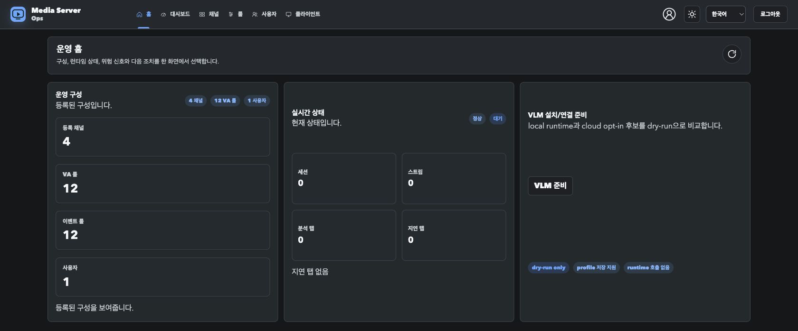
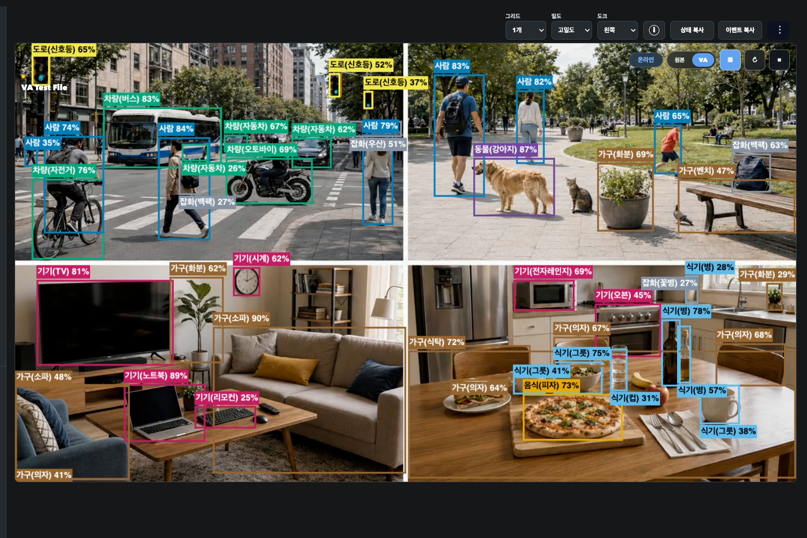

# Media Server

[](https://github.com/dhseo90/MediaServer/actions/workflows/preflight.yml)
[](https://github.com/dhseo90/MediaServer/actions/workflows/licensing-artifact-guardrails.yml)


RTSP/WebRTC 영상 중계, YOLO/ONNX 영상 분석, 상시·이벤트 녹화를 제공하는
macOS/Linux용 C++17 미디어 서버입니다. 브라우저에서 채널과 분석 룰을 관리하고,
라이브 영상과 저장된 녹화 영상을 확인할 수 있습니다.

[English](README.en.md) · [문서](docs/README.md) ·
[최신 릴리즈](https://github.com/dhseo90/MediaServer/releases/latest) ·
[v4.4.0 개발 변경 사항](docs/release-notes-v4.4.0.md)

현재 소스와 공개 목표는 v4.4.0이며 개발 구현·단기 검증을 마쳤고 릴리즈 검증이 남아 있습니다. 기록된 공개 버전은 v4.3.0입니다.
현재 공개 상태는 위 최신 릴리즈 링크에서 확인하세요.

## 주요 기능

- 영상 중계: 파일, RTSP, WHEP, WHIP, HTTP/HLS 입력을 RTSP와 WebRTC/WHEP로 제공합니다.
- 영상 분석: 객체 검출 오버레이, 저장 룰·시나리오, 이벤트 전송과 분석 메타데이터를 지원합니다.
- 녹화: 채널별 상시녹화와 이벤트 연동 녹화, 용량 제한에 따른 순환 보존,
  이벤트 우선 타임라인과 녹화 재생을 지원합니다.
- 구조화 검색: 카메라·시간·객체·track·event·zone·rule·behaviour로 녹화를 검색하고,
  파일 대응이 확인된 결과의 재생 위치로 이동합니다.
- 운영 화면: `/ops`에서 채널·룰·사용자·진단을 관리하고,
  `/client`에서 권한이 부여된 라이브 영상을 봅니다.
- 이벤트 조회: `/ops/events`에서 이벤트 기록·사건 타임라인과 녹화를 조회합니다.

한국어·영어 영상 유사도 검색은 로컬 SigLIP2 모델을 별도 준비해 활성화할 수 있습니다.
원본 연결이 확인된 대표 프레임과 이벤트 스냅샷을 검색하며, 점수는 사건 발생의 증거가 아닙니다.
지원 범위와 설정은 [설정 참조](docs/config-reference.md)에 있습니다.
현재 버전은 완성형 VMS/NVR이나 무기한 영상 보관을 보장하지 않습니다.
기본 배포는 소스만 제공하며 AI 모델·미디어 런타임 바이너리는 포함하지 않습니다.

## 빠른 시작

macOS 또는 Linux에서 C++17 컴파일러, CMake 3.16+, GStreamer 1.28+를 사용합니다.
영상 분석에는 ONNX Runtime과 YOLO ONNX 모델·라벨이 필요합니다.
플랫폼별 의존성·선택 기능은 [설치 및 개발 가이드](docs/development-guide.md)를 확인하세요.

```bash
./server.sh install
./server.sh build
./server.sh start
./server.sh status
./server.sh urls
```

브라우저에서 `http://127.0.0.1:8080/`에 접속합니다.
포트를 변경했다면 `./server.sh urls`에 표시된 주소를 사용하세요.
기본 인증 모드는 `auto`이며, 첫 실행 시 `/setup`에서 관리자 비밀번호를 설정합니다.
기본 관리자 비밀번호는 없습니다.

종료는 `./server.sh stop`, 개발 중 포그라운드 실행은 `./server.sh foreground`를 사용합니다.

## 녹화 설정부터 재생까지

1. 녹화 켜기: 서버에 `MEDIA_SERVER_RECORDING_ENABLED=1`을 설정하고,
   운영 채널의 녹화도 활성화합니다. 채널 자체가 비활성 상태이면 녹화하지 않습니다.
   저장 경로·용량·보존 기간은 [녹화 설정](docs/config-reference.md#recording-env)을 참고하세요.
2. 저장 상태 확인: `/ops/events`의 녹화 영역에서 채널별 녹화 상태,
   상시·이벤트 사용량과 저장 공간 차단 여부를 확인합니다.
   두 종류의 보존 용량은 분리되며, 한도를 넘으면 보호되지 않은 오래된 자료부터 정리합니다.
   pin/hold 등으로 삭제할 수 없거나 디스크 여유가 부족하면 저장이 차단될 수 있습니다.
3. 타임라인 조회: 채널과 시작·종료 시간을 선택합니다.
   같은 원본의 겹치는 구간이 확인되면 이벤트 녹화를 우선 보여 줍니다.
   부분 녹화나 시각 미확인 자료는 완전한 녹화와 구분하며 원본 보기도 제공합니다.
4. 영상 재생: 항목을 선택한 뒤 재생·일시정지·탐색 컨트롤을 사용합니다.
   재생은 파일 시작부터이며, 시간 선택에 따른 자동 탐색이나 다음 파일 자동 재생은 하지 않습니다.
   브라우저가 해당 영상 형식을 지원해야 합니다.

이벤트 연동과 화면별 상세 설명은 [녹화 조회·재생 가이드](docs/ui-guide.md#녹화-조회와-재생-v410-s06)를,
API와 권한은 [녹화 API](docs/config-reference.md#녹화-조회재생-api-v410-s06)를 참고하세요.

## 권한

- `admin`: 채널·룰·사용자·진단 관리. 사용자 관리는 admin 전용입니다.
- `operator`: 채널·룰·진단 운영. 사용자 관리 화면에는 접근하지 않습니다.
- `viewer`: 할당된 클라이언트 화면만 사용합니다. 원본 source URL과 내부 진단 자료는 노출하지 않습니다.
- `integrator`: 허용된 범위의 API 연동에 사용합니다.

녹화 조회와 재생에도 역할·채널 권한을 적용합니다.
자세한 화면과 권한은 [UI 가이드](docs/ui-guide.md)에서 확인할 수 있습니다.

## 화면 미리보기

운영 홈



클라이언트 라이브와 영상 분석 오버레이



채널·룰·사용자 화면은 [UI 가이드](docs/ui-guide.md)를 참고하세요.

## 문서와 개발

| 목적 | 안내 |
| --- | --- |
| 설치·빌드·실행 | [개발 가이드](docs/development-guide.md) |
| 운영·설정 | [UI 가이드](docs/ui-guide.md), [설정 참조](docs/config-reference.md) |
| 구조·분석 | [서버 구조](docs/media-server-architecture.md), [영상 분석](docs/video-analysis.md) |
| 검증·기여 | [검증 명령](docs/stream-verification.md), [기여 안내](CONTRIBUTING.md) |
| 향후 개발 | [녹화·검색 로드맵](docs/v410-v49-recording-search-roadmap.md), [미완료 작업](docs/development-backlog.md) |
| 전체 문서 | [분야별 색인](docs/README.md) |

저장소의 공개 샘플 영상은 검증용 생성 자료입니다.
운영·고객 영상이나 인증정보를 저장소에 추가하지 마세요.
샘플 출처는 [샘플 자료 안내](docs/sample-fixture-provenance.md)에 있습니다.

## 라이선스

원본 코드와 문서는 [Apache License 2.0](LICENSE)을 따릅니다.
외부 의존성·모델의 별도 조건은 [NOTICE](NOTICE)와 [THIRD_PARTY_NOTICES.md](THIRD_PARTY_NOTICES.md)를,
배포 범위는 [배포 정책](docs/distribution-policy.md)을 확인하세요.
보안 제보는 [SECURITY.md](SECURITY.md)를 따릅니다.
