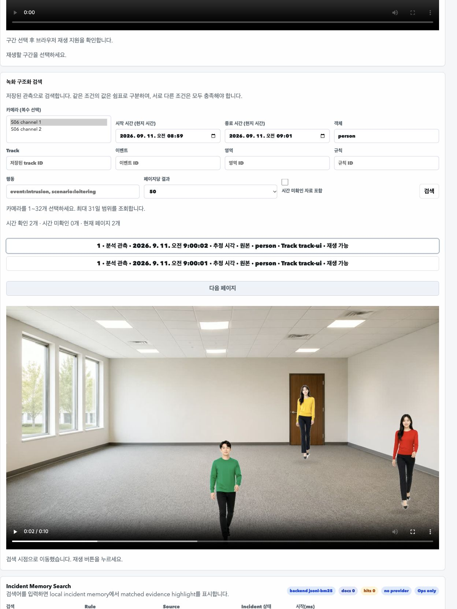

# v4.2.0 개발 실행 기록

## 범위와 현재 상태

- 사용자 목표: 1~10 순차 개발, 단기 검증, 분할 커밋, 마지막 브랜치 push와 종합보고.
- 제외: 릴리즈용 30분·120분·UI 풀테스트·predev. 미실행이며 PASS가 아니다.
- 기준: `v4.2.0`, source `5990bbcc`, 작업 시작 시 clean. source version은 `4.1.1`.
- 계약: [개발 설계](../../superpowers/specs/2026-10-03-v420-structured-search-design.md).
- 정의: [V420 기능 ID](../../project-feature-test-inventory.md#v420-구조화-검색).
- 현재: 1 계약·조사·사전 정의 완료(`a8098ff3`), 2 불변 read model·채널/ID 인덱스와 단기 검증 완료.
  3 카탈로그 adapter·증분 갱신·V2 mapping/삭제·generation 참조/재개방 연결을 단기 검증했다.
  4 필터 모델과 실제 이벤트 행동 근거 연결을 구현·단기 검증했다.
  5 불변 결과 snapshot/cursor를 구현·단기 검증했다.
  6 동일 원본 이벤트 우선과 실제 파일/파생 출력 후보 연결을 구현·단기 검증했다.
  7 원본·파생 파일 presentation seek와 실제 frame 대조를 구현·검증했다.
  8 검색·seek service와 HTTP 연결을 구현했다. application 13개 및 실제 HTTP 67개 검사가 통과했다.
  8 권한/hit 수명과 source/generation 회귀를 추가 확인했다.
  9 구조화 검색 UI 연결과 변경 영역 직접 조작·비동기 경계 검증을 마쳤다.
  10 최종 개발 회귀·문서·버전 정리를 마쳤다. 아래 완료 대조를 따르며,
  최종 커밋·원격 push 결과는 이 작업의 최종 보고에서 실제 Git 조회로 확인한다.

## 실행 결과

### 1 계약·조사·사전 정의

source: `5990bbcc` + 이 단계의 문서 변경. 환경: 프로젝트 macOS workspace, 2026-10-03.

- `git diff --check`: exit 0, 출력 없음.
- `node scripts/internal/verify_docs_links.mjs`: exit 0.
  `markdown files: 295; local links: 9222; local images: 14; local anchors: 358;
  indexed docs: 88; index coverage exclusions: 190; failures: 0`.
- 공식 자료 4개를 읽어 출처·채택 의미·제외를 개발 설계에 기록했다. 외부 코드 반입 없음.
- cleanup: 서버·포트·임시 fixture·별도 프로세스 생성 없음. 문서 외 제품 변경 없음.
- 제품 검증 미실행. 위 결과는 문서 정합만 입증한다.

### 2 read model 단기 검사

정의: V420-M01~03. 모델 생성/정렬/불변/거부 경계만 검사하며 실제 catalog adapter·API 검증은 후속 단계다.

```text
source: a8098ff3 + stage2 worktree; include/recording/recording_search_model.h sha256=2828e61c6eaed16b0cb85e186537a2c8f424d75b35e7ef9205745944f5f01bc2, src/recording/recording_search_model.cpp sha256=a7043b2c8211545cd0615cc74365a52bad334c127604a13539f49137f9f1a08b, scripts/internal/recording_search_model_smoke.cpp sha256=849f634c34b4df06f630a800c448cbd14a3be4d61a62a6b5c67917f58463958b
command: c++ -std=c++17 -Wall -Wextra -Werror -O2 -Iinclude src/recording/recording_search_model.cpp scripts/internal/recording_search_model_smoke.cpp -o /private/var/folders/k0/qhmr6zdx11q0_41wfx4dsd200000gn/T/media-server-v420-model-8rf_6qoa/model


exit: 0
command: /private/var/folders/k0/qhmr6zdx11q0_41wfx4dsd200000gn/T/media-server-v420-model-8rf_6qoa/model
[pass] M01 build
[pass] M01 known-desc/channel/id then unknown
[pass] M01 channel index and absent channel
[pass] M01 source immutable / normalized projection
[pass] M01 identity and unknown are preserved
[pass] M01 rebuild independent of input order
[pass] M02 duplicate cannot replace published model
[pass] M02 empty interval rejected atomically
[pass] M02 half-known interval rejected
[pass] M02 unlinked event fact rejected
[pass] M02 conflicting event facts rejected
[pass] M01 numeric track reuse does not merge sessions
[pass] M03 row limit overflow atomic
[pass] M03 row limit equality
[pass] M03 byte accounting baseline
[pass] M03 exact byte budget admitted
[pass] M03 one byte short rejected atomically
[pass] M02 invalid source rejected
[pass] M02 successful empty distinct from failed build
[pass] M01 retained immutable model survives replacements
[pass] M03 scale explicit endpoints
[scale] rows=1 accountedBytes=2249 elapsedUs=4
[pass] M03 scale explicit endpoints
[scale] rows=1000 accountedBytes=2100149 elapsedUs=411
[pass] M03 scale explicit endpoints
[scale] rows=10000 accountedBytes=21000149 elapsedUs=3747
[pass] M03 default 100001 rows rejected before projection
[search-model] pass=24 fail=0


exit: 0
cleanup: owned temporary compiler output removed=True; no server/port
```

최종 단계 2 판정은 아래 25개 assertion 실행과 구조 검사 보정·빌드 결과를 함께 따른다.

단계 2 구조 검사 최초 실패: `node scripts/internal/verify_v390_cmake_internal_target_separation.mjs`, exit 1.
신규 2개 source/header를 현행 graph에 분류했으나 현행 소비자 metadata의 hash/metrics 갱신이 누락됐다.
제품 C++ 검사 실패나 예상 TDD RED가 아니다. 다음 단계는 보류하고 같은 단계의 정확한 metadata를 보정한다.

```text
- PASS: composition executable and runtime static library are distinct
- PASS: production C++ sources have exact composition/runtime ownership
- PASS: runtime target owns optional source, compile definitions, includes, and external links
- FAIL: current graph and writer bind both actual CMake targets — current:hash; current:metrics
- PASS: target ownership and topology mutations fail closed
- summary: pass=4 fail=1
```

cleanup: 이 정적 검사는 서버·포트·임시 자료를 생성하지 않았다.

100,000행에서 바이트 한도가 먼저 적용되는 경계 assertion 추가 후 재검증:

```text
source: a8098ff3 + stage2 worktree; smoke sha256=b80086f30de5cffca08d68fbad9fec197fda6e24d455b6fbeaa5467e24c44776
command: c++ -std=c++17 -Wall -Wextra -Werror -O2 -Iinclude src/recording/recording_search_model.cpp scripts/internal/recording_search_model_smoke.cpp -o /private/var/folders/k0/qhmr6zdx11q0_41wfx4dsd200000gn/T/media-server-v420-model-dj66tuu6/model


exit: 0
command: /private/var/folders/k0/qhmr6zdx11q0_41wfx4dsd200000gn/T/media-server-v420-model-dj66tuu6/model
[pass] M01 build
[pass] M01 known-desc/channel/id then unknown
[pass] M01 channel index and absent channel
[pass] M01 source immutable / normalized projection
[pass] M01 identity and unknown are preserved
[pass] M01 rebuild independent of input order
[pass] M02 duplicate cannot replace published model
[pass] M02 empty interval rejected atomically
[pass] M02 half-known interval rejected
[pass] M02 unlinked event fact rejected
[pass] M02 conflicting event facts rejected
[pass] M01 numeric track reuse does not merge sessions
[pass] M03 row limit overflow atomic
[pass] M03 row limit equality
[pass] M03 byte accounting baseline
[pass] M03 exact byte budget admitted
[pass] M03 one byte short rejected atomically
[pass] M02 invalid source rejected
[pass] M02 successful empty distinct from failed build
[pass] M01 retained immutable model survives replacements
[pass] M03 scale explicit endpoints
[scale] rows=1 accountedBytes=2249 elapsedUs=2
[pass] M03 scale explicit endpoints
[scale] rows=1000 accountedBytes=2100149 elapsedUs=171
[pass] M03 scale explicit endpoints
[scale] rows=10000 accountedBytes=21000149 elapsedUs=1962
[pass] M03 default 100001 rows rejected before projection
[pass] M03 100000 valid rows still obey earlier 64MiB limit
[search-model] pass=25 fail=0


exit: 0
cleanup: owned temporary compiler output removed=True; no server/port
```

단계 2 구조 metadata 보정 후:

- `node scripts/internal/verify_v390_cmake_internal_target_separation.mjs`: exit 0, 5 PASS/0 FAIL.
  composition/runtime 분리, source 단일 소유, optional/compile/link 결속,
  실제 current graph 결속, target 변경 반례의 거부를 확인했다.
- `node scripts/internal/verify_v390_structure_stabilization_execution.mjs --graph-only`: exit 0,
  4 PASS/0 FAIL. 현행 정책, hash/metrics, 금지 연결/cycle 반례, 역사 completion 분리 확인.
- 최초 `current:hash; current:metrics` 실패는 신규 파일 2개를 반영한 현행 연결값 보정으로 해소했다.
  execution fixture는 `currentGraph`의 hash·파일 수 3개 값만 변경했다. 역사 실행·PASS/FAIL·
  completion snapshot·의존 허용 정책은 변경하지 않았다.
- `cmake --build build-gst-onnx --target media_server_runtime -j2`: exit 0.
  CMake configure/generate 성공, 실제 runtime C++ sources 컴파일 및 static library link 성공.
  마지막 출력: `[100%] Built target media_server_runtime`. 앱 실행·HTTP·실제 미디어 검사 아님.
- source: `a8098ff3` + 검색 모델 2파일·CMake 등록·소유 metadata 변경. native 원출력과 hash는 위 기록.
- cleanup: 실행 소유 native 임시 경로 2개 제거 확인, 서버·포트 생성 없음.
  기존 `build-gst-onnx`의 빌드 산출물은 재사용 build cache로 유지한다.
- 한계: 모델의 값/인덱스 검증이며 카탈로그 연결·필터·cursor·재생·제품 UI는 후속 3~9 대상이다.

### 3 증분 모델 갱신의 단기 검사

V420-L01/L02의 모델 변화분만 검사한다. 실제 catalog adapter·복구는 아직 미완료다.

```text
source: 397b2609 + stage3 delta worktree; include/recording/recording_search_model.h sha256=8aeedc3610c35c7499466f711f046d13fa97f17dee3bb2c8de4cc41018259a74, src/recording/recording_search_model.cpp sha256=1bb7f48b14c8a3079d661124cdd226a2fffedb6334b0ab9d65470d8861347e3c, scripts/internal/recording_search_model_smoke.cpp sha256=aa57d4550375d96b696b0f2416cb0b3144ac16fe218849cfe982d8e6d7c625da
command: c++ -std=c++17 -Wall -Wextra -Werror -O2 -Iinclude src/recording/recording_search_model.cpp scripts/internal/recording_search_model_smoke.cpp -o /private/var/folders/k0/qhmr6zdx11q0_41wfx4dsd200000gn/T/media-server-v420-delta-z4thmvto/model


exit: 0
command: /private/var/folders/k0/qhmr6zdx11q0_41wfx4dsd200000gn/T/media-server-v420-delta-z4thmvto/model
[pass] M01 build
[pass] M01 known-desc/channel/id then unknown
[pass] M01 channel index and absent channel
[pass] M01 source immutable / normalized projection
[pass] M01 identity and unknown are preserved
[pass] M01 rebuild independent of input order
[pass] M02 duplicate cannot replace published model
[pass] M02 empty interval rejected atomically
[pass] M02 half-known interval rejected
[pass] M02 unlinked event fact rejected
[pass] M02 conflicting event facts rejected
[pass] M01 numeric track reuse does not merge sessions
[pass] M03 row limit overflow atomic
[pass] M03 row limit equality
[pass] M03 byte accounting baseline
[pass] M03 exact byte budget admitted
[pass] M03 one byte short rejected atomically
[pass] M02 invalid source rejected
[pass] M02 successful empty distinct from failed build
[pass] M01 retained immutable model survives replacements
[pass] L01 delta adds/updates/deletes and reorders exact expected ids
[pass] L02 removal changes new snapshot without mutating held pages
[pass] L01 stale predecessor requires rebuild
[pass] L02 restarted source cannot apply old lineage
[pass] L02 upsert/delete same id rejected atomically
[pass] L01 empty delta advances only revision
[pass] M03 scale explicit endpoints
[scale] rows=1 accountedBytes=2249 elapsedUs=5
[pass] M03 scale explicit endpoints
[scale] rows=1000 accountedBytes=2100149 elapsedUs=268
[pass] M03 scale explicit endpoints
[scale] rows=10000 accountedBytes=21000149 elapsedUs=4677
[pass] M03 default 100001 rows rejected before projection
[pass] M03 100000 valid rows still obey earlier 64MiB limit
[search-model] pass=31 fail=0


exit: 0
cleanup: owned temporary compiler output removed=True; no server/port
```

- `cmake --build build-gst-onnx --target media_server_runtime -j2`: exit 0,
  변경된 `recording_search_model.cpp` 컴파일 및 runtime static library link 성공.
- 모델 31개 assertion PASS는 3단계 전체 완료가 아니다. 카탈로그 adapter의 source snapshot,
  revision 변화분 수집·재구축, 실제 저장소 삭제/손상·재개방과의 연결 검증이 남아 있다.
- 변경 소유 파일: 기존 검색 모델 header/source·native smoke·이 개발 기록.
  의존 방향·CMake source 목록·공개 API·원본 저장 계약 변경 없음.

### 3 카탈로그 어댑터 focused 첫 실행

source: e13868bb + stage3 worktree. 실제 runtime archive와 동일 CMake defines/include를 사용했다.

```text
command: c++ -std=c++17 -Wall -Wextra -Werror -O2 -DGST_USE_UNSTABLE_API=1 -DMEDIA_SERVER_ENABLE_RECORDING_GENERATION_BACKEND=1 -DMEDIA_SERVER_ENABLE_YOUTUBE_SOURCE=0 -DMEDIA_SERVER_USE_GSTREAMER=1 -DMEDIA_SERVER_USE_LIBSODIUM=1 -DMEDIA_SERVER_USE_ONNXRUNTIME=1 -DMEDIA_SERVER_USE_OPENSSL=1 -DMEDIA_SERVER_USE_PANGOCAIRO=1 -DMEDIA_SERVER_USE_SQLITE3=1 -I/Users/dhseo/Workspace/mediaServer/include -I/opt/homebrew/include/onnxruntime -isystem /opt/homebrew/Cellar/gstreamer/1.28.1/include/gstreamer-1.0 -isystem /opt/homebrew/Cellar/glib/2.86.4/include/gio-unix-2.0 -isystem /opt/homebrew/Cellar/orc/0.4.42/include/orc-0.4 -isystem /opt/homebrew/Cellar/glib/2.86.4/include -isystem /Library/Developer/CommandLineTools/SDKs/MacOSX26.sdk/usr/include/ffi -isystem /opt/homebrew/Cellar/glib/2.86.4/include/glib-2.0 -isystem /opt/homebrew/Cellar/glib/2.86.4/lib/glib-2.0/include -isystem /opt/homebrew/opt/gettext/include -isystem /opt/homebrew/Cellar/pcre2/10.47_1/include -isystem /opt/homebrew/Cellar/pango/1.57.0_2/include/pango-1.0 -isystem /opt/homebrew/Cellar/cairo/1.18.4/include/cairo -isystem /opt/homebrew/Cellar/libxext/1.3.7/include -isystem /opt/homebrew/Cellar/xorgproto/2025.1/include -isystem /opt/homebrew/Cellar/libxrender/0.9.12/include -isystem /opt/homebrew/Cellar/libx11/1.8.13/include -isystem /opt/homebrew/Cellar/libxcb/1.17.0/include -isystem /opt/homebrew/Cellar/libxau/1.0.12/include -isystem /opt/homebrew/Cellar/libxdmcp/1.1.5/include -isystem /opt/homebrew/Cellar/pixman/0.46.4/include/pixman-1 -isystem /opt/homebrew/Cellar/fribidi/1.0.16/include/fribidi -isystem /opt/homebrew/Cellar/libthai/0.1.30/include -isystem /opt/homebrew/Cellar/libdatrie/0.2.14/include -isystem /opt/homebrew/Cellar/fontconfig/2.17.1/include -isystem /opt/homebrew/Cellar/harfbuzz/13.1.1/include/harfbuzz -isystem /opt/homebrew/opt/freetype/include/freetype2 -isystem /opt/homebrew/opt/libpng/include/libpng16 -isystem /opt/homebrew/opt/graphite2/include -isystem /opt/homebrew/Cellar/libsodium/1.0.21/include -isystem /opt/homebrew/Cellar/openssl@3/3.6.2/include scripts/internal/recording_search_source_smoke.cpp /Users/dhseo/Workspace/mediaServer/build-gst-onnx/libmedia_server_runtime.a /Library/Developer/CommandLineTools/SDKs/MacOSX.sdk/usr/lib/libz.tbd /opt/homebrew/Cellar/gstreamer/1.28.1/lib/libgstrtspserver-1.0.dylib /opt/homebrew/Cellar/gstreamer/1.28.1/lib/libgstapp-1.0.dylib /opt/homebrew/Cellar/gstreamer/1.28.1/lib/libgstwebrtc-1.0.dylib /opt/homebrew/Cellar/gstreamer/1.28.1/lib/libgstsdp-1.0.dylib /opt/homebrew/Cellar/gstreamer/1.28.1/lib/libgstpbutils-1.0.dylib /opt/homebrew/Cellar/gstreamer/1.28.1/lib/libgstaudio-1.0.dylib /opt/homebrew/Cellar/gstreamer/1.28.1/lib/libgstvideo-1.0.dylib /opt/homebrew/Cellar/gstreamer/1.28.1/lib/libgstbase-1.0.dylib /opt/homebrew/Cellar/gstreamer/1.28.1/lib/libgstreamer-1.0.dylib /opt/homebrew/Cellar/pango/1.57.0_2/lib/libpangocairo-1.0.dylib /opt/homebrew/Cellar/pango/1.57.0_2/lib/libpango-1.0.dylib /opt/homebrew/Cellar/cairo/1.18.4/lib/libcairo.dylib /opt/homebrew/Cellar/harfbuzz/13.1.1/lib/libharfbuzz.dylib /opt/homebrew/Cellar/glib/2.86.4/lib/libgobject-2.0.dylib /opt/homebrew/Cellar/glib/2.86.4/lib/libglib-2.0.dylib /opt/homebrew/opt/gettext/lib/libintl.dylib /Library/Developer/CommandLineTools/SDKs/MacOSX.sdk/usr/lib/libsqlite3.tbd /opt/homebrew/Cellar/libsodium/1.0.21/lib/libsodium.dylib /opt/homebrew/Cellar/openssl@3/3.6.2/lib/libssl.dylib /opt/homebrew/Cellar/openssl@3/3.6.2/lib/libcrypto.dylib /opt/homebrew/lib/libonnxruntime.dylib -o /var/folders/k0/qhmr6zdx11q0_41wfx4dsd200000gn/T/media-server-v420-source-3uxrw9lg/source


exit: 0
command: /var/folders/k0/qhmr6zdx11q0_41wfx4dsd200000gn/T/media-server-v420-source-3uxrw9lg/source /var/folders/k0/qhmr6zdx11q0_41wfx4dsd200000gn/T/media-server-v420-source-3uxrw9lg/fixture
[pass] journal-open
[pass] closed-source-rejected
[pass] catalog-open
[pass] empty-source-success
[pass] invalid-channel-output-unchanged
[pass] finalize
[pass] unknown-observation-put
[pass] unknown-is-not-inferred
[pass] stored-locator-put
[pass] observation-delta-only
[pass] stored-locator-utc-and-pts
[pass] unchanged-model-reused
[pass] search-does-not-write-journal
[pass] capture-before-observation
[pass] observation-keeps-resolution-valid
[pass] new-model-held-snapshot-independent
[pass] capacity-failure-output-unchanged
[pass] scope-change-rebuild
[pass] history-gap-rebuild
[pass] structural-change-invalidates-captured-batch
[pass] corruption-new-state-old-snapshot-preserved
[pass] journal-reopen-rebuild
[pass] sqlite-reopen-rebuild
[pass] rebuild-does-not-write-journal
[search-source] pass=24 fail=0 error=


exit: 0
command: c++ -std=c++17 -Wall -Wextra -Werror -O2 -Iinclude src/recording/recording_search_model.cpp scripts/internal/recording_search_model_smoke.cpp -o /var/folders/k0/qhmr6zdx11q0_41wfx4dsd200000gn/T/media-server-v420-source-3uxrw9lg/model


exit: 0
command: /var/folders/k0/qhmr6zdx11q0_41wfx4dsd200000gn/T/media-server-v420-source-3uxrw9lg/model
[pass] M01 build
[pass] M01 known-desc/channel/id then unknown
[pass] M01 channel index and absent channel
[pass] M01 source immutable / normalized projection
[pass] M01 identity and unknown are preserved
[pass] M01 rebuild independent of input order
[pass] M02 duplicate cannot replace published model
[pass] M02 empty interval rejected atomically
[pass] M02 half-known interval rejected
[pass] M02 unlinked event fact rejected
[pass] M02 conflicting event facts rejected
[pass] M01 numeric track reuse does not merge sessions
[pass] M03 row limit overflow atomic
[pass] M03 row limit equality
[pass] M03 byte accounting baseline
[pass] M03 exact byte budget admitted
[pass] M03 one byte short rejected atomically
[pass] M02 invalid source rejected
[pass] M02 successful empty distinct from failed build
[pass] M01 retained immutable model survives replacements
[pass] L01 delta adds/updates/deletes and reorders exact expected ids
[pass] L02 removal changes new snapshot without mutating held pages
[pass] L01 stale predecessor requires rebuild
[pass] L02 restarted source cannot apply old lineage
[pass] L02 upsert/delete same id rejected atomically
[pass] L01 empty delta advances only revision
[pass] M03 scale explicit endpoints
[scale] rows=1 accountedBytes=2297 elapsedUs=8
[pass] M03 scale explicit endpoints
[scale] rows=1000 accountedBytes=2148149 elapsedUs=428
[pass] M03 scale explicit endpoints
[scale] rows=10000 accountedBytes=21480149 elapsedUs=3909
[pass] M03 default 100001 rows rejected before projection
[pass] M03 100000 valid rows still obey earlier 64MiB limit
[search-model] pass=31 fail=0


exit: 0
cleanup: owned temporary root removed=True; no server/port
```

- 첫 runtime 빌드는 exit 0이었으나 structured binding을 lambda에서 캡처하는 C++20 extension 경고 2개가 있었다. 일반 지역 참조로 변경한 뒤 `cmake --build build-gst-onnx --target media_server_runtime -j2` 재실행 exit 0, 경고 없이 성공했다.
- 카탈로그 통합 24/24, 모델 31/31 PASS. 원장 바이트 불변·소유 임시 파일 제거 확인. 서버/포트를 만들지 않았다.
- `node scripts/internal/verify_v390_structure_stabilization_execution.mjs --graph-only`: 4/4 PASS, exit 0.
- `node scripts/internal/verify_v390_cmake_internal_target_separation.mjs`: 5/5 PASS, exit 0.
- `node scripts/internal/verify_docs_links.mjs`: 295 Markdown, 9,222 링크, failures 0, exit 0.
- `git diff --check`: exit 0. 현행 소유 그래프와 execution의 currentGraph 연결만 갱신했다. 과거 완료 snapshot과 의존 정책은 유지했다.
- 3단계 전체는 미완료: generation 원본 참조, V2 mapping, 삭제/tombstone 통합 검사가 남아 있다. 실제 재생·API·UI·장시간 검사는 이번 실행 대상이 아니다.

현재 focused source SHA-256:

```text
include/recording/recording_catalog.h 6bfcb3c170dbd2e8f579cb6b0e16a3b66b6477ebb5f8fee158c5cc7df59611a9
src/recording/recording_catalog.cpp 03929f7c300a72e6380af54586888cef26cbf0ddbad7a8457dd31726fe9e5794
include/recording/recording_search_model.h 4e83f927c644a840de6718bf35f8b27a55c4dc1a7733cd62457cd714924ee47c
src/recording/recording_search_model.cpp a9f4f6451db7a025230536645c38a74d23e096a00d770e330cb1fb5ccdd051b3
include/recording/recording_search_source.h ea4bd724c5682b87a1e7fb020e7e9afe7eecbd885b06154ac7a04a6c4c5e603d
src/recording/recording_search_source.cpp 3b220854618f944cab4d5a26e29e72cfdaa4f24ca13b356ec6c6cf2d589d640c
include/recording/recording_search_reader.h 17bb5fd18f00872d8dcecb3366f4c2ef4f914c2f2926261a7e0a9c5cff983002
src/recording/recording_search_reader.cpp 764700b6c1a19deed48c363a8f3371fea67821118b2f23dec62c86ec7d438039
scripts/internal/recording_search_source_smoke.cpp dbdf92a4224f6552c46214886a6c452a253f6daa0d06a3043539cd67ba8b2233
```

### 3 V2 mapping과 삭제 focused 검사

source: 04c008b7 + 확장된 source smoke. CMake runtime ABI 동일.

```text
command: c++ -std=c++17 -Wall -Wextra -Werror -O2 -DGST_USE_UNSTABLE_API=1 -DMEDIA_SERVER_ENABLE_RECORDING_GENERATION_BACKEND=1 -DMEDIA_SERVER_ENABLE_YOUTUBE_SOURCE=0 -DMEDIA_SERVER_USE_GSTREAMER=1 -DMEDIA_SERVER_USE_LIBSODIUM=1 -DMEDIA_SERVER_USE_ONNXRUNTIME=1 -DMEDIA_SERVER_USE_OPENSSL=1 -DMEDIA_SERVER_USE_PANGOCAIRO=1 -DMEDIA_SERVER_USE_SQLITE3=1 -I/Users/dhseo/Workspace/mediaServer/include -I/opt/homebrew/include/onnxruntime -isystem /opt/homebrew/Cellar/gstreamer/1.28.1/include/gstreamer-1.0 -isystem /opt/homebrew/Cellar/glib/2.86.4/include/gio-unix-2.0 -isystem /opt/homebrew/Cellar/orc/0.4.42/include/orc-0.4 -isystem /opt/homebrew/Cellar/glib/2.86.4/include -isystem /Library/Developer/CommandLineTools/SDKs/MacOSX26.sdk/usr/include/ffi -isystem /opt/homebrew/Cellar/glib/2.86.4/include/glib-2.0 -isystem /opt/homebrew/Cellar/glib/2.86.4/lib/glib-2.0/include -isystem /opt/homebrew/opt/gettext/include -isystem /opt/homebrew/Cellar/pcre2/10.47_1/include -isystem /opt/homebrew/Cellar/pango/1.57.0_2/include/pango-1.0 -isystem /opt/homebrew/Cellar/cairo/1.18.4/include/cairo -isystem /opt/homebrew/Cellar/libxext/1.3.7/include -isystem /opt/homebrew/Cellar/xorgproto/2025.1/include -isystem /opt/homebrew/Cellar/libxrender/0.9.12/include -isystem /opt/homebrew/Cellar/libx11/1.8.13/include -isystem /opt/homebrew/Cellar/libxcb/1.17.0/include -isystem /opt/homebrew/Cellar/libxau/1.0.12/include -isystem /opt/homebrew/Cellar/libxdmcp/1.1.5/include -isystem /opt/homebrew/Cellar/pixman/0.46.4/include/pixman-1 -isystem /opt/homebrew/Cellar/fribidi/1.0.16/include/fribidi -isystem /opt/homebrew/Cellar/libthai/0.1.30/include -isystem /opt/homebrew/Cellar/libdatrie/0.2.14/include -isystem /opt/homebrew/Cellar/fontconfig/2.17.1/include -isystem /opt/homebrew/Cellar/harfbuzz/13.1.1/include/harfbuzz -isystem /opt/homebrew/opt/freetype/include/freetype2 -isystem /opt/homebrew/opt/libpng/include/libpng16 -isystem /opt/homebrew/opt/graphite2/include -isystem /opt/homebrew/Cellar/libsodium/1.0.21/include -isystem /opt/homebrew/Cellar/openssl@3/3.6.2/include scripts/internal/recording_search_source_smoke.cpp /Users/dhseo/Workspace/mediaServer/build-gst-onnx/libmedia_server_runtime.a /Library/Developer/CommandLineTools/SDKs/MacOSX.sdk/usr/lib/libz.tbd /opt/homebrew/Cellar/gstreamer/1.28.1/lib/libgstrtspserver-1.0.dylib /opt/homebrew/Cellar/gstreamer/1.28.1/lib/libgstapp-1.0.dylib /opt/homebrew/Cellar/gstreamer/1.28.1/lib/libgstwebrtc-1.0.dylib /opt/homebrew/Cellar/gstreamer/1.28.1/lib/libgstsdp-1.0.dylib /opt/homebrew/Cellar/gstreamer/1.28.1/lib/libgstpbutils-1.0.dylib /opt/homebrew/Cellar/gstreamer/1.28.1/lib/libgstaudio-1.0.dylib /opt/homebrew/Cellar/gstreamer/1.28.1/lib/libgstvideo-1.0.dylib /opt/homebrew/Cellar/gstreamer/1.28.1/lib/libgstbase-1.0.dylib /opt/homebrew/Cellar/gstreamer/1.28.1/lib/libgstreamer-1.0.dylib /opt/homebrew/Cellar/pango/1.57.0_2/lib/libpangocairo-1.0.dylib /opt/homebrew/Cellar/pango/1.57.0_2/lib/libpango-1.0.dylib /opt/homebrew/Cellar/cairo/1.18.4/lib/libcairo.dylib /opt/homebrew/Cellar/harfbuzz/13.1.1/lib/libharfbuzz.dylib /opt/homebrew/Cellar/glib/2.86.4/lib/libgobject-2.0.dylib /opt/homebrew/Cellar/glib/2.86.4/lib/libglib-2.0.dylib /opt/homebrew/opt/gettext/lib/libintl.dylib /Library/Developer/CommandLineTools/SDKs/MacOSX.sdk/usr/lib/libsqlite3.tbd /opt/homebrew/Cellar/libsodium/1.0.21/lib/libsodium.dylib /opt/homebrew/Cellar/openssl@3/3.6.2/lib/libssl.dylib /opt/homebrew/Cellar/openssl@3/3.6.2/lib/libcrypto.dylib /opt/homebrew/lib/libonnxruntime.dylib -o /var/folders/k0/qhmr6zdx11q0_41wfx4dsd200000gn/T/media-server-v420-v2-x4a6kplt/source


exit: 0
command: /var/folders/k0/qhmr6zdx11q0_41wfx4dsd200000gn/T/media-server-v420-v2-x4a6kplt/source /var/folders/k0/qhmr6zdx11q0_41wfx4dsd200000gn/T/media-server-v420-v2-x4a6kplt/fixture
[pass] journal-open
[pass] closed-source-rejected
[pass] catalog-open
[pass] empty-source-success
[pass] invalid-channel-output-unchanged
[pass] finalize
[pass] unknown-observation-put
[pass] unknown-is-not-inferred
[pass] stored-locator-put
[pass] observation-delta-only
[pass] stored-locator-utc-and-pts
[pass] unchanged-model-reused
[pass] search-does-not-write-journal
[pass] capture-before-observation
[pass] observation-keeps-resolution-valid
[pass] new-model-held-snapshot-independent
[pass] capacity-failure-output-unchanged
[pass] scope-change-rebuild
[pass] history-gap-rebuild
[pass] structural-change-invalidates-captured-batch
[pass] corruption-new-state-old-snapshot-preserved
[pass] journal-reopen-rebuild
[pass] sqlite-reopen-rebuild
[pass] rebuild-does-not-write-journal
[pass] v2-journal-fixture
[pass] v2-unknown-fixture
[pass] v2-source-open
[pass] v2-mappings-separate-clock-overlap-preserved
[pass] v2-unknown-retains-media-axis
[pass] v2-deletion-pending-refresh
[fail] v2-tombstone-removes-all-mappings-held-model-unchanged
[pass] v2-read-journal-unchanged
[pass] v2-source-open
[fail] v2-reopen-tombstone-no-resurrection
[pass] v2-read-journal-unchanged
[search-source] pass=33 fail=2 error=


exit: 1
cleanup: owned temporary root removed=True; no server/port
```

V2 최초 실패 원인 분리: 삭제 호출의 오류를 stderr로 보존한다. 기대값 변경 없음.

```text
command: c++ -std=c++17 -Wall -Wextra -Werror -O2 -DGST_USE_UNSTABLE_API=1 -DMEDIA_SERVER_ENABLE_RECORDING_GENERATION_BACKEND=1 -DMEDIA_SERVER_ENABLE_YOUTUBE_SOURCE=0 -DMEDIA_SERVER_USE_GSTREAMER=1 -DMEDIA_SERVER_USE_LIBSODIUM=1 -DMEDIA_SERVER_USE_ONNXRUNTIME=1 -DMEDIA_SERVER_USE_OPENSSL=1 -DMEDIA_SERVER_USE_PANGOCAIRO=1 -DMEDIA_SERVER_USE_SQLITE3=1 -I/Users/dhseo/Workspace/mediaServer/include -I/opt/homebrew/include/onnxruntime -isystem /opt/homebrew/Cellar/gstreamer/1.28.1/include/gstreamer-1.0 -isystem /opt/homebrew/Cellar/glib/2.86.4/include/gio-unix-2.0 -isystem /opt/homebrew/Cellar/orc/0.4.42/include/orc-0.4 -isystem /opt/homebrew/Cellar/glib/2.86.4/include -isystem /Library/Developer/CommandLineTools/SDKs/MacOSX26.sdk/usr/include/ffi -isystem /opt/homebrew/Cellar/glib/2.86.4/include/glib-2.0 -isystem /opt/homebrew/Cellar/glib/2.86.4/lib/glib-2.0/include -isystem /opt/homebrew/opt/gettext/include -isystem /opt/homebrew/Cellar/pcre2/10.47_1/include -isystem /opt/homebrew/Cellar/pango/1.57.0_2/include/pango-1.0 -isystem /opt/homebrew/Cellar/cairo/1.18.4/include/cairo -isystem /opt/homebrew/Cellar/libxext/1.3.7/include -isystem /opt/homebrew/Cellar/xorgproto/2025.1/include -isystem /opt/homebrew/Cellar/libxrender/0.9.12/include -isystem /opt/homebrew/Cellar/libx11/1.8.13/include -isystem /opt/homebrew/Cellar/libxcb/1.17.0/include -isystem /opt/homebrew/Cellar/libxau/1.0.12/include -isystem /opt/homebrew/Cellar/libxdmcp/1.1.5/include -isystem /opt/homebrew/Cellar/pixman/0.46.4/include/pixman-1 -isystem /opt/homebrew/Cellar/fribidi/1.0.16/include/fribidi -isystem /opt/homebrew/Cellar/libthai/0.1.30/include -isystem /opt/homebrew/Cellar/libdatrie/0.2.14/include -isystem /opt/homebrew/Cellar/fontconfig/2.17.1/include -isystem /opt/homebrew/Cellar/harfbuzz/13.1.1/include/harfbuzz -isystem /opt/homebrew/opt/freetype/include/freetype2 -isystem /opt/homebrew/opt/libpng/include/libpng16 -isystem /opt/homebrew/opt/graphite2/include -isystem /opt/homebrew/Cellar/libsodium/1.0.21/include -isystem /opt/homebrew/Cellar/openssl@3/3.6.2/include scripts/internal/recording_search_source_smoke.cpp /Users/dhseo/Workspace/mediaServer/build-gst-onnx/libmedia_server_runtime.a /Library/Developer/CommandLineTools/SDKs/MacOSX.sdk/usr/lib/libz.tbd /opt/homebrew/Cellar/gstreamer/1.28.1/lib/libgstrtspserver-1.0.dylib /opt/homebrew/Cellar/gstreamer/1.28.1/lib/libgstapp-1.0.dylib /opt/homebrew/Cellar/gstreamer/1.28.1/lib/libgstwebrtc-1.0.dylib /opt/homebrew/Cellar/gstreamer/1.28.1/lib/libgstsdp-1.0.dylib /opt/homebrew/Cellar/gstreamer/1.28.1/lib/libgstpbutils-1.0.dylib /opt/homebrew/Cellar/gstreamer/1.28.1/lib/libgstaudio-1.0.dylib /opt/homebrew/Cellar/gstreamer/1.28.1/lib/libgstvideo-1.0.dylib /opt/homebrew/Cellar/gstreamer/1.28.1/lib/libgstbase-1.0.dylib /opt/homebrew/Cellar/gstreamer/1.28.1/lib/libgstreamer-1.0.dylib /opt/homebrew/Cellar/pango/1.57.0_2/lib/libpangocairo-1.0.dylib /opt/homebrew/Cellar/pango/1.57.0_2/lib/libpango-1.0.dylib /opt/homebrew/Cellar/cairo/1.18.4/lib/libcairo.dylib /opt/homebrew/Cellar/harfbuzz/13.1.1/lib/libharfbuzz.dylib /opt/homebrew/Cellar/glib/2.86.4/lib/libgobject-2.0.dylib /opt/homebrew/Cellar/glib/2.86.4/lib/libglib-2.0.dylib /opt/homebrew/opt/gettext/lib/libintl.dylib /Library/Developer/CommandLineTools/SDKs/MacOSX.sdk/usr/lib/libsqlite3.tbd /opt/homebrew/Cellar/libsodium/1.0.21/lib/libsodium.dylib /opt/homebrew/Cellar/openssl@3/3.6.2/lib/libssl.dylib /opt/homebrew/Cellar/openssl@3/3.6.2/lib/libcrypto.dylib /opt/homebrew/lib/libonnxruntime.dylib -o /var/folders/k0/qhmr6zdx11q0_41wfx4dsd200000gn/T/media-server-v420-v2-diagnostic-4hsa_quh/source


exit: 0
command: /var/folders/k0/qhmr6zdx11q0_41wfx4dsd200000gn/T/media-server-v420-v2-diagnostic-4hsa_quh/source /var/folders/k0/qhmr6zdx11q0_41wfx4dsd200000gn/T/media-server-v420-v2-diagnostic-4hsa_quh/fixture
[pass] journal-open
[pass] closed-source-rejected
[pass] catalog-open
[pass] empty-source-success
[pass] invalid-channel-output-unchanged
[pass] finalize
[pass] unknown-observation-put
[pass] unknown-is-not-inferred
[pass] stored-locator-put
[pass] observation-delta-only
[pass] stored-locator-utc-and-pts
[pass] unchanged-model-reused
[pass] search-does-not-write-journal
[pass] capture-before-observation
[pass] observation-keeps-resolution-valid
[pass] new-model-held-snapshot-independent
[pass] capacity-failure-output-unchanged
[pass] scope-change-rebuild
[pass] history-gap-rebuild
[pass] structural-change-invalidates-captured-batch
[pass] corruption-new-state-old-snapshot-preserved
[pass] journal-reopen-rebuild
[pass] sqlite-reopen-rebuild
[pass] rebuild-does-not-write-journal
[pass] v2-journal-fixture
[pass] v2-unknown-fixture
[pass] v2-source-open
[pass] v2-mappings-separate-clock-overlap-preserved
[pass] v2-unknown-retains-media-axis
[pass] v2-deletion-pending-refresh
[fail] v2-tombstone-removes-all-mappings-held-model-unchanged
[pass] v2-read-journal-unchanged
[pass] v2-source-open
[fail] v2-reopen-tombstone-no-resurrection
[pass] v2-read-journal-unchanged
[search-source] pass=33 fail=2 error=

v2 deletion failure: V2 삭제 상위 경로 확인 실패

exit: 1
cleanup: owned temporary root removed=True; no server/port
```

삭제 실패의 직접 오류는 `V2 삭제 상위 경로 확인 실패`였다. macOS tempfile의 `/var` 별칭이 원본 삭제의 O_NOFOLLOW 상위 경로 검사에 거부됐다. 격리 fixture 루트를 `weakly_canonical`로 정규화한다. 제품 삭제 정책/판정은 변경하지 않는다. 이 오류는 예상 RED가 아니며 최초 33 PASS/2 FAIL을 유지한다.

V2 fixture 실제 경로 보정 후 재검증:

```text
command: c++ -std=c++17 -Wall -Wextra -Werror -O2 -DGST_USE_UNSTABLE_API=1 -DMEDIA_SERVER_ENABLE_RECORDING_GENERATION_BACKEND=1 -DMEDIA_SERVER_ENABLE_YOUTUBE_SOURCE=0 -DMEDIA_SERVER_USE_GSTREAMER=1 -DMEDIA_SERVER_USE_LIBSODIUM=1 -DMEDIA_SERVER_USE_ONNXRUNTIME=1 -DMEDIA_SERVER_USE_OPENSSL=1 -DMEDIA_SERVER_USE_PANGOCAIRO=1 -DMEDIA_SERVER_USE_SQLITE3=1 -I/Users/dhseo/Workspace/mediaServer/include -I/opt/homebrew/include/onnxruntime -isystem /opt/homebrew/Cellar/gstreamer/1.28.1/include/gstreamer-1.0 -isystem /opt/homebrew/Cellar/glib/2.86.4/include/gio-unix-2.0 -isystem /opt/homebrew/Cellar/orc/0.4.42/include/orc-0.4 -isystem /opt/homebrew/Cellar/glib/2.86.4/include -isystem /Library/Developer/CommandLineTools/SDKs/MacOSX26.sdk/usr/include/ffi -isystem /opt/homebrew/Cellar/glib/2.86.4/include/glib-2.0 -isystem /opt/homebrew/Cellar/glib/2.86.4/lib/glib-2.0/include -isystem /opt/homebrew/opt/gettext/include -isystem /opt/homebrew/Cellar/pcre2/10.47_1/include -isystem /opt/homebrew/Cellar/pango/1.57.0_2/include/pango-1.0 -isystem /opt/homebrew/Cellar/cairo/1.18.4/include/cairo -isystem /opt/homebrew/Cellar/libxext/1.3.7/include -isystem /opt/homebrew/Cellar/xorgproto/2025.1/include -isystem /opt/homebrew/Cellar/libxrender/0.9.12/include -isystem /opt/homebrew/Cellar/libx11/1.8.13/include -isystem /opt/homebrew/Cellar/libxcb/1.17.0/include -isystem /opt/homebrew/Cellar/libxau/1.0.12/include -isystem /opt/homebrew/Cellar/libxdmcp/1.1.5/include -isystem /opt/homebrew/Cellar/pixman/0.46.4/include/pixman-1 -isystem /opt/homebrew/Cellar/fribidi/1.0.16/include/fribidi -isystem /opt/homebrew/Cellar/libthai/0.1.30/include -isystem /opt/homebrew/Cellar/libdatrie/0.2.14/include -isystem /opt/homebrew/Cellar/fontconfig/2.17.1/include -isystem /opt/homebrew/Cellar/harfbuzz/13.1.1/include/harfbuzz -isystem /opt/homebrew/opt/freetype/include/freetype2 -isystem /opt/homebrew/opt/libpng/include/libpng16 -isystem /opt/homebrew/opt/graphite2/include -isystem /opt/homebrew/Cellar/libsodium/1.0.21/include -isystem /opt/homebrew/Cellar/openssl@3/3.6.2/include scripts/internal/recording_search_source_smoke.cpp /Users/dhseo/Workspace/mediaServer/build-gst-onnx/libmedia_server_runtime.a /Library/Developer/CommandLineTools/SDKs/MacOSX.sdk/usr/lib/libz.tbd /opt/homebrew/Cellar/gstreamer/1.28.1/lib/libgstrtspserver-1.0.dylib /opt/homebrew/Cellar/gstreamer/1.28.1/lib/libgstapp-1.0.dylib /opt/homebrew/Cellar/gstreamer/1.28.1/lib/libgstwebrtc-1.0.dylib /opt/homebrew/Cellar/gstreamer/1.28.1/lib/libgstsdp-1.0.dylib /opt/homebrew/Cellar/gstreamer/1.28.1/lib/libgstpbutils-1.0.dylib /opt/homebrew/Cellar/gstreamer/1.28.1/lib/libgstaudio-1.0.dylib /opt/homebrew/Cellar/gstreamer/1.28.1/lib/libgstvideo-1.0.dylib /opt/homebrew/Cellar/gstreamer/1.28.1/lib/libgstbase-1.0.dylib /opt/homebrew/Cellar/gstreamer/1.28.1/lib/libgstreamer-1.0.dylib /opt/homebrew/Cellar/pango/1.57.0_2/lib/libpangocairo-1.0.dylib /opt/homebrew/Cellar/pango/1.57.0_2/lib/libpango-1.0.dylib /opt/homebrew/Cellar/cairo/1.18.4/lib/libcairo.dylib /opt/homebrew/Cellar/harfbuzz/13.1.1/lib/libharfbuzz.dylib /opt/homebrew/Cellar/glib/2.86.4/lib/libgobject-2.0.dylib /opt/homebrew/Cellar/glib/2.86.4/lib/libglib-2.0.dylib /opt/homebrew/opt/gettext/lib/libintl.dylib /Library/Developer/CommandLineTools/SDKs/MacOSX.sdk/usr/lib/libsqlite3.tbd /opt/homebrew/Cellar/libsodium/1.0.21/lib/libsodium.dylib /opt/homebrew/Cellar/openssl@3/3.6.2/lib/libssl.dylib /opt/homebrew/Cellar/openssl@3/3.6.2/lib/libcrypto.dylib /opt/homebrew/lib/libonnxruntime.dylib -o /var/folders/k0/qhmr6zdx11q0_41wfx4dsd200000gn/T/media-server-v420-v2-fixed-6n01r0lt/source


exit: 0
command: /var/folders/k0/qhmr6zdx11q0_41wfx4dsd200000gn/T/media-server-v420-v2-fixed-6n01r0lt/source /var/folders/k0/qhmr6zdx11q0_41wfx4dsd200000gn/T/media-server-v420-v2-fixed-6n01r0lt/fixture
[pass] journal-open
[pass] closed-source-rejected
[pass] catalog-open
[pass] empty-source-success
[pass] invalid-channel-output-unchanged
[pass] finalize
[pass] unknown-observation-put
[pass] unknown-is-not-inferred
[pass] stored-locator-put
[pass] observation-delta-only
[pass] stored-locator-utc-and-pts
[pass] unchanged-model-reused
[pass] search-does-not-write-journal
[pass] capture-before-observation
[pass] observation-keeps-resolution-valid
[pass] new-model-held-snapshot-independent
[pass] capacity-failure-output-unchanged
[pass] scope-change-rebuild
[pass] history-gap-rebuild
[pass] structural-change-invalidates-captured-batch
[pass] corruption-new-state-old-snapshot-preserved
[pass] journal-reopen-rebuild
[pass] sqlite-reopen-rebuild
[pass] rebuild-does-not-write-journal
[pass] v2-journal-fixture
[pass] v2-unknown-fixture
[pass] v2-source-open
[pass] v2-mappings-separate-clock-overlap-preserved
[pass] v2-unknown-retains-media-axis
[pass] v2-deletion-pending-refresh
[pass] v2-tombstone-removes-all-mappings-held-model-unchanged
[pass] v2-read-journal-unchanged
[pass] v2-source-open
[pass] v2-reopen-tombstone-no-resurrection
[pass] v2-read-journal-unchanged
[search-source] pass=35 fail=0 error=


exit: 0
cleanup: owned temporary root removed=True; no server/port
```

### 3 generation 검색 연결 focused 검사

source: 04c008b7 + generation smoke. CMake runtime ABI 동일.

```text
command: c++ -std=c++17 -Wall -Wextra -Werror -O2 -DGST_USE_UNSTABLE_API=1 -DMEDIA_SERVER_ENABLE_RECORDING_GENERATION_BACKEND=1 -DMEDIA_SERVER_ENABLE_YOUTUBE_SOURCE=0 -DMEDIA_SERVER_USE_GSTREAMER=1 -DMEDIA_SERVER_USE_LIBSODIUM=1 -DMEDIA_SERVER_USE_ONNXRUNTIME=1 -DMEDIA_SERVER_USE_OPENSSL=1 -DMEDIA_SERVER_USE_PANGOCAIRO=1 -DMEDIA_SERVER_USE_SQLITE3=1 -I/Users/dhseo/Workspace/mediaServer/include -I/opt/homebrew/include/onnxruntime -isystem /opt/homebrew/Cellar/gstreamer/1.28.1/include/gstreamer-1.0 -isystem /opt/homebrew/Cellar/glib/2.86.4/include/gio-unix-2.0 -isystem /opt/homebrew/Cellar/orc/0.4.42/include/orc-0.4 -isystem /opt/homebrew/Cellar/glib/2.86.4/include -isystem /Library/Developer/CommandLineTools/SDKs/MacOSX26.sdk/usr/include/ffi -isystem /opt/homebrew/Cellar/glib/2.86.4/include/glib-2.0 -isystem /opt/homebrew/Cellar/glib/2.86.4/lib/glib-2.0/include -isystem /opt/homebrew/opt/gettext/include -isystem /opt/homebrew/Cellar/pcre2/10.47_1/include -isystem /opt/homebrew/Cellar/pango/1.57.0_2/include/pango-1.0 -isystem /opt/homebrew/Cellar/cairo/1.18.4/include/cairo -isystem /opt/homebrew/Cellar/libxext/1.3.7/include -isystem /opt/homebrew/Cellar/xorgproto/2025.1/include -isystem /opt/homebrew/Cellar/libxrender/0.9.12/include -isystem /opt/homebrew/Cellar/libx11/1.8.13/include -isystem /opt/homebrew/Cellar/libxcb/1.17.0/include -isystem /opt/homebrew/Cellar/libxau/1.0.12/include -isystem /opt/homebrew/Cellar/libxdmcp/1.1.5/include -isystem /opt/homebrew/Cellar/pixman/0.46.4/include/pixman-1 -isystem /opt/homebrew/Cellar/fribidi/1.0.16/include/fribidi -isystem /opt/homebrew/Cellar/libthai/0.1.30/include -isystem /opt/homebrew/Cellar/libdatrie/0.2.14/include -isystem /opt/homebrew/Cellar/fontconfig/2.17.1/include -isystem /opt/homebrew/Cellar/harfbuzz/13.1.1/include/harfbuzz -isystem /opt/homebrew/opt/freetype/include/freetype2 -isystem /opt/homebrew/opt/libpng/include/libpng16 -isystem /opt/homebrew/opt/graphite2/include -isystem /opt/homebrew/Cellar/libsodium/1.0.21/include -isystem /opt/homebrew/Cellar/openssl@3/3.6.2/include scripts/internal/recording_search_generation_smoke.cpp /Users/dhseo/Workspace/mediaServer/build-gst-onnx/libmedia_server_runtime.a /Library/Developer/CommandLineTools/SDKs/MacOSX.sdk/usr/lib/libz.tbd /opt/homebrew/Cellar/gstreamer/1.28.1/lib/libgstrtspserver-1.0.dylib /opt/homebrew/Cellar/gstreamer/1.28.1/lib/libgstapp-1.0.dylib /opt/homebrew/Cellar/gstreamer/1.28.1/lib/libgstwebrtc-1.0.dylib /opt/homebrew/Cellar/gstreamer/1.28.1/lib/libgstsdp-1.0.dylib /opt/homebrew/Cellar/gstreamer/1.28.1/lib/libgstpbutils-1.0.dylib /opt/homebrew/Cellar/gstreamer/1.28.1/lib/libgstaudio-1.0.dylib /opt/homebrew/Cellar/gstreamer/1.28.1/lib/libgstvideo-1.0.dylib /opt/homebrew/Cellar/gstreamer/1.28.1/lib/libgstbase-1.0.dylib /opt/homebrew/Cellar/gstreamer/1.28.1/lib/libgstreamer-1.0.dylib /opt/homebrew/Cellar/pango/1.57.0_2/lib/libpangocairo-1.0.dylib /opt/homebrew/Cellar/pango/1.57.0_2/lib/libpango-1.0.dylib /opt/homebrew/Cellar/cairo/1.18.4/lib/libcairo.dylib /opt/homebrew/Cellar/harfbuzz/13.1.1/lib/libharfbuzz.dylib /opt/homebrew/Cellar/glib/2.86.4/lib/libgobject-2.0.dylib /opt/homebrew/Cellar/glib/2.86.4/lib/libglib-2.0.dylib /opt/homebrew/opt/gettext/lib/libintl.dylib /Library/Developer/CommandLineTools/SDKs/MacOSX.sdk/usr/lib/libsqlite3.tbd /opt/homebrew/Cellar/libsodium/1.0.21/lib/libsodium.dylib /opt/homebrew/Cellar/openssl@3/3.6.2/lib/libssl.dylib /opt/homebrew/Cellar/openssl@3/3.6.2/lib/libcrypto.dylib /opt/homebrew/lib/libonnxruntime.dylib -o /var/folders/k0/qhmr6zdx11q0_41wfx4dsd200000gn/T/media-server-v420-generation-itt5on81/generation


exit: 0
command: /var/folders/k0/qhmr6zdx11q0_41wfx4dsd200000gn/T/media-server-v420-generation-itt5on81/generation /var/folders/k0/qhmr6zdx11q0_41wfx4dsd200000gn/T/media-server-v420-generation-itt5on81/fixture

fixture: B read-only admission 미설정

exit: 1
cleanup: owned temporary root removed=True; no server/port
```

Generation 최초 실행은 컴파일 exit 0 후 fixture Open에서 `B read-only admission 미설정`으로 exit 1이었다. 기존 generation fixture가 요구하는 명시적 1MiB 읽기 한도와 100개 row/shard admission을 ManagedOptions에 지정한다. 제품 기본 한도·검사를 변경하지 않는다.

Generation 명시 admission fixture 보정 후 재검증:

```text
command: c++ -std=c++17 -Wall -Wextra -Werror -O2 -DGST_USE_UNSTABLE_API=1 -DMEDIA_SERVER_ENABLE_RECORDING_GENERATION_BACKEND=1 -DMEDIA_SERVER_ENABLE_YOUTUBE_SOURCE=0 -DMEDIA_SERVER_USE_GSTREAMER=1 -DMEDIA_SERVER_USE_LIBSODIUM=1 -DMEDIA_SERVER_USE_ONNXRUNTIME=1 -DMEDIA_SERVER_USE_OPENSSL=1 -DMEDIA_SERVER_USE_PANGOCAIRO=1 -DMEDIA_SERVER_USE_SQLITE3=1 -I/Users/dhseo/Workspace/mediaServer/include -I/opt/homebrew/include/onnxruntime -isystem /opt/homebrew/Cellar/gstreamer/1.28.1/include/gstreamer-1.0 -isystem /opt/homebrew/Cellar/glib/2.86.4/include/gio-unix-2.0 -isystem /opt/homebrew/Cellar/orc/0.4.42/include/orc-0.4 -isystem /opt/homebrew/Cellar/glib/2.86.4/include -isystem /Library/Developer/CommandLineTools/SDKs/MacOSX26.sdk/usr/include/ffi -isystem /opt/homebrew/Cellar/glib/2.86.4/include/glib-2.0 -isystem /opt/homebrew/Cellar/glib/2.86.4/lib/glib-2.0/include -isystem /opt/homebrew/opt/gettext/include -isystem /opt/homebrew/Cellar/pcre2/10.47_1/include -isystem /opt/homebrew/Cellar/pango/1.57.0_2/include/pango-1.0 -isystem /opt/homebrew/Cellar/cairo/1.18.4/include/cairo -isystem /opt/homebrew/Cellar/libxext/1.3.7/include -isystem /opt/homebrew/Cellar/xorgproto/2025.1/include -isystem /opt/homebrew/Cellar/libxrender/0.9.12/include -isystem /opt/homebrew/Cellar/libx11/1.8.13/include -isystem /opt/homebrew/Cellar/libxcb/1.17.0/include -isystem /opt/homebrew/Cellar/libxau/1.0.12/include -isystem /opt/homebrew/Cellar/libxdmcp/1.1.5/include -isystem /opt/homebrew/Cellar/pixman/0.46.4/include/pixman-1 -isystem /opt/homebrew/Cellar/fribidi/1.0.16/include/fribidi -isystem /opt/homebrew/Cellar/libthai/0.1.30/include -isystem /opt/homebrew/Cellar/libdatrie/0.2.14/include -isystem /opt/homebrew/Cellar/fontconfig/2.17.1/include -isystem /opt/homebrew/Cellar/harfbuzz/13.1.1/include/harfbuzz -isystem /opt/homebrew/opt/freetype/include/freetype2 -isystem /opt/homebrew/opt/libpng/include/libpng16 -isystem /opt/homebrew/opt/graphite2/include -isystem /opt/homebrew/Cellar/libsodium/1.0.21/include -isystem /opt/homebrew/Cellar/openssl@3/3.6.2/include scripts/internal/recording_search_generation_smoke.cpp /Users/dhseo/Workspace/mediaServer/build-gst-onnx/libmedia_server_runtime.a /Library/Developer/CommandLineTools/SDKs/MacOSX.sdk/usr/lib/libz.tbd /opt/homebrew/Cellar/gstreamer/1.28.1/lib/libgstrtspserver-1.0.dylib /opt/homebrew/Cellar/gstreamer/1.28.1/lib/libgstapp-1.0.dylib /opt/homebrew/Cellar/gstreamer/1.28.1/lib/libgstwebrtc-1.0.dylib /opt/homebrew/Cellar/gstreamer/1.28.1/lib/libgstsdp-1.0.dylib /opt/homebrew/Cellar/gstreamer/1.28.1/lib/libgstpbutils-1.0.dylib /opt/homebrew/Cellar/gstreamer/1.28.1/lib/libgstaudio-1.0.dylib /opt/homebrew/Cellar/gstreamer/1.28.1/lib/libgstvideo-1.0.dylib /opt/homebrew/Cellar/gstreamer/1.28.1/lib/libgstbase-1.0.dylib /opt/homebrew/Cellar/gstreamer/1.28.1/lib/libgstreamer-1.0.dylib /opt/homebrew/Cellar/pango/1.57.0_2/lib/libpangocairo-1.0.dylib /opt/homebrew/Cellar/pango/1.57.0_2/lib/libpango-1.0.dylib /opt/homebrew/Cellar/cairo/1.18.4/lib/libcairo.dylib /opt/homebrew/Cellar/harfbuzz/13.1.1/lib/libharfbuzz.dylib /opt/homebrew/Cellar/glib/2.86.4/lib/libgobject-2.0.dylib /opt/homebrew/Cellar/glib/2.86.4/lib/libglib-2.0.dylib /opt/homebrew/opt/gettext/lib/libintl.dylib /Library/Developer/CommandLineTools/SDKs/MacOSX.sdk/usr/lib/libsqlite3.tbd /opt/homebrew/Cellar/libsodium/1.0.21/lib/libsodium.dylib /opt/homebrew/Cellar/openssl@3/3.6.2/lib/libssl.dylib /opt/homebrew/Cellar/openssl@3/3.6.2/lib/libcrypto.dylib /opt/homebrew/lib/libonnxruntime.dylib -o /var/folders/k0/qhmr6zdx11q0_41wfx4dsd200000gn/T/media-server-v420-generation-fixed-l2618nwn/generation


exit: 0
command: /var/folders/k0/qhmr6zdx11q0_41wfx4dsd200000gn/T/media-server-v420-generation-fixed-l2618nwn/generation /var/folders/k0/qhmr6zdx11q0_41wfx4dsd200000gn/T/media-server-v420-generation-fixed-l2618nwn/fixture

fixture: B 읽기 catalog 소유권/경로 거부

exit: 1
cleanup: owned temporary root removed=True; no server/port
```

두 번째 generation 준비 실패는 `B 읽기 catalog 소유권/경로 거부`였다. `AttachGenerationCatalog`의 직접 조건에서 SQLite 경로를 root/recording-catalog.sqlite3로 제한함을 확인했다. fixture의 catalog.sqlite3를 해당 고정 이름으로 고친다. 최초·두 번째 실패는 검사 전 준비 실패이며 제품 PASS가 아니다.

Generation 고정 경로 보정 후 재검증:

```text
command: c++ -std=c++17 -Wall -Wextra -Werror -O2 -DGST_USE_UNSTABLE_API=1 -DMEDIA_SERVER_ENABLE_RECORDING_GENERATION_BACKEND=1 -DMEDIA_SERVER_ENABLE_YOUTUBE_SOURCE=0 -DMEDIA_SERVER_USE_GSTREAMER=1 -DMEDIA_SERVER_USE_LIBSODIUM=1 -DMEDIA_SERVER_USE_ONNXRUNTIME=1 -DMEDIA_SERVER_USE_OPENSSL=1 -DMEDIA_SERVER_USE_PANGOCAIRO=1 -DMEDIA_SERVER_USE_SQLITE3=1 -I/Users/dhseo/Workspace/mediaServer/include -I/opt/homebrew/include/onnxruntime -isystem /opt/homebrew/Cellar/gstreamer/1.28.1/include/gstreamer-1.0 -isystem /opt/homebrew/Cellar/glib/2.86.4/include/gio-unix-2.0 -isystem /opt/homebrew/Cellar/orc/0.4.42/include/orc-0.4 -isystem /opt/homebrew/Cellar/glib/2.86.4/include -isystem /Library/Developer/CommandLineTools/SDKs/MacOSX26.sdk/usr/include/ffi -isystem /opt/homebrew/Cellar/glib/2.86.4/include/glib-2.0 -isystem /opt/homebrew/Cellar/glib/2.86.4/lib/glib-2.0/include -isystem /opt/homebrew/opt/gettext/include -isystem /opt/homebrew/Cellar/pcre2/10.47_1/include -isystem /opt/homebrew/Cellar/pango/1.57.0_2/include/pango-1.0 -isystem /opt/homebrew/Cellar/cairo/1.18.4/include/cairo -isystem /opt/homebrew/Cellar/libxext/1.3.7/include -isystem /opt/homebrew/Cellar/xorgproto/2025.1/include -isystem /opt/homebrew/Cellar/libxrender/0.9.12/include -isystem /opt/homebrew/Cellar/libx11/1.8.13/include -isystem /opt/homebrew/Cellar/libxcb/1.17.0/include -isystem /opt/homebrew/Cellar/libxau/1.0.12/include -isystem /opt/homebrew/Cellar/libxdmcp/1.1.5/include -isystem /opt/homebrew/Cellar/pixman/0.46.4/include/pixman-1 -isystem /opt/homebrew/Cellar/fribidi/1.0.16/include/fribidi -isystem /opt/homebrew/Cellar/libthai/0.1.30/include -isystem /opt/homebrew/Cellar/libdatrie/0.2.14/include -isystem /opt/homebrew/Cellar/fontconfig/2.17.1/include -isystem /opt/homebrew/Cellar/harfbuzz/13.1.1/include/harfbuzz -isystem /opt/homebrew/opt/freetype/include/freetype2 -isystem /opt/homebrew/opt/libpng/include/libpng16 -isystem /opt/homebrew/opt/graphite2/include -isystem /opt/homebrew/Cellar/libsodium/1.0.21/include -isystem /opt/homebrew/Cellar/openssl@3/3.6.2/include scripts/internal/recording_search_generation_smoke.cpp /Users/dhseo/Workspace/mediaServer/build-gst-onnx/libmedia_server_runtime.a /Library/Developer/CommandLineTools/SDKs/MacOSX.sdk/usr/lib/libz.tbd /opt/homebrew/Cellar/gstreamer/1.28.1/lib/libgstrtspserver-1.0.dylib /opt/homebrew/Cellar/gstreamer/1.28.1/lib/libgstapp-1.0.dylib /opt/homebrew/Cellar/gstreamer/1.28.1/lib/libgstwebrtc-1.0.dylib /opt/homebrew/Cellar/gstreamer/1.28.1/lib/libgstsdp-1.0.dylib /opt/homebrew/Cellar/gstreamer/1.28.1/lib/libgstpbutils-1.0.dylib /opt/homebrew/Cellar/gstreamer/1.28.1/lib/libgstaudio-1.0.dylib /opt/homebrew/Cellar/gstreamer/1.28.1/lib/libgstvideo-1.0.dylib /opt/homebrew/Cellar/gstreamer/1.28.1/lib/libgstbase-1.0.dylib /opt/homebrew/Cellar/gstreamer/1.28.1/lib/libgstreamer-1.0.dylib /opt/homebrew/Cellar/pango/1.57.0_2/lib/libpangocairo-1.0.dylib /opt/homebrew/Cellar/pango/1.57.0_2/lib/libpango-1.0.dylib /opt/homebrew/Cellar/cairo/1.18.4/lib/libcairo.dylib /opt/homebrew/Cellar/harfbuzz/13.1.1/lib/libharfbuzz.dylib /opt/homebrew/Cellar/glib/2.86.4/lib/libgobject-2.0.dylib /opt/homebrew/Cellar/glib/2.86.4/lib/libglib-2.0.dylib /opt/homebrew/opt/gettext/lib/libintl.dylib /Library/Developer/CommandLineTools/SDKs/MacOSX.sdk/usr/lib/libsqlite3.tbd /opt/homebrew/Cellar/libsodium/1.0.21/lib/libsodium.dylib /opt/homebrew/Cellar/openssl@3/3.6.2/lib/libssl.dylib /opt/homebrew/Cellar/openssl@3/3.6.2/lib/libcrypto.dylib /opt/homebrew/lib/libonnxruntime.dylib -o /var/folders/k0/qhmr6zdx11q0_41wfx4dsd200000gn/T/media-server-v420-generation-path-a64uv_s0/generation


exit: 0
command: /var/folders/k0/qhmr6zdx11q0_41wfx4dsd200000gn/T/media-server-v420-generation-path-a64uv_s0/generation /var/folders/k0/qhmr6zdx11q0_41wfx4dsd200000gn/T/media-server-v420-generation-path-a64uv_s0/fixture
[pass] generation-search-refresh
[pass] generation-original-sample-exact-utc
[pass] generation-missing-original-stays-unplaced
[pass] generation-search-journal-unchanged
[pass] generation-search-refresh
[pass] generation-original-sample-exact-utc
[pass] generation-missing-original-stays-unplaced
[pass] generation-search-journal-unchanged
[pass] generation-reopen-rebuild-preserves-held-model
[pass] generation-search-refresh
[pass] generation-original-sample-exact-utc
[pass] generation-missing-original-stays-unplaced
[pass] generation-search-journal-unchanged
[pass] generation-reopen-rebuild-preserves-held-model
[search-generation] pass=14 fail=0


exit: 0
cleanup: owned temporary root removed=True; no server/port
```

### 3 저장소 연결 판정

- 최종 source smoke 35 PASS/0 FAIL, generation smoke 14 PASS/0 FAIL. 실제 카탈로그의 V1/V2/참조 관측, 관측 delta/이력 초과 재구축, scope 변경, 상태 손상, V2 삭제/tombstone, SQLite 사용/미사용 재개방을 확인했다.
- V2의 최초 2 FAIL과 generation 준비 실패 2건은 위에 원출력/원인/재검증을 연결했다. 제품 저장/삭제 정책 변경 없이 fixture 경로와 필수 admission을 바로잡았다.
- 검색 read model/source 구현은 04c008b7 그대로이며 이번 변경은 통합 검증과 기록이다. 각 실행의 소유 임시 루트 제거를 확인했다. 서버/포트 없음.
- 원장 바이트 불변은 검색/재구축 호출 전후를 비교했다. SQLite 파생 cache는 기존 카탈로그가 관리한다.
- 실제 프레임 재생/이벤트 우선/필터/API/UI는 후속 4~9 검증 대상이다. 릴리즈 장시간·UI 풀테스트 미실행.

최종 검사 source SHA-256:

```text
scripts/internal/recording_search_source_smoke.cpp 60e4ddcd215efc4074fbf6cd0c976a34a48b09eb65f27cf005a333cec520913b
scripts/internal/recording_search_generation_smoke.cpp 322bf6595b89096636a59722d8e710adf0b2c83f94f55ad601b5987baea5fe1d
scripts/internal/recording_catalog_generation_projection_smoke.cpp 17362fbda3e98e52bc9587725e499b658ea9e73e124d251b3188563a7d53514d
```

- 최종 `git diff --check`: exit 0. `node scripts/internal/verify_docs_links.mjs`: 295 Markdown/9,222 links, failures 0, exit 0. 이번 변경은 검사 source와 기록뿐이므로 production build/소유 graph 재실행은 하지 않았다.

### 4 필터 모델 focused 검사

source: 524a383d + query/filter worktree.

```text
command: c++ -std=c++17 -Wall -Wextra -Werror -O2 -Iinclude src/recording/recording_search_model.cpp scripts/internal/recording_search_filter_smoke.cpp -o /var/folders/k0/qhmr6zdx11q0_41wfx4dsd200000gn/T/media-server-v420-filter-34bno5a1/filter


exit: 0
command: /var/folders/k0/qhmr6zdx11q0_41wfx4dsd200000gn/T/media-server-v420-filter-34bno5a1/filter
[pass] fixture-build
[pass] F01 camera-time returns intervals without analysis
[pass] F01 channel OR global stable order duplicate normalized
[pass] F02 F03 half-open UTC sampled person only
[pass] F03 object OR
[pass] F03 exact case no synonym
[pass] F04 F06 same-track observations never combine tags
[pass] F04 namespaces remain distinct hits
[pass] F06 F07 field AND list OR
[pass] F05 stored event reference exact
[pass] F08 event behaviour confirmed fact
[pass] F09 named scenario fact
[pass] F09 rule ID is not scenario name
[pass] F10 event behaviour require same event
[pass] F10 shared matching event
[pass] F08 missing event facts never inferred
[pass] F02 unknown separate after known
[pass] F02 separate counts
[pass] invalid query rejects atomically
[pass] invalid query rejects atomically
[pass] invalid query rejects atomically
[pass] invalid query rejects atomically
[pass] invalid query rejects atomically
[pass] invalid query rejects atomically
[pass] invalid query rejects atomically
[pass] invalid query rejects atomically
[pass] invalid query rejects atomically
[search-filter] pass=27 fail=0


exit: 0
command: c++ -std=c++17 -Wall -Wextra -Werror -O2 -Iinclude src/recording/recording_search_model.cpp scripts/internal/recording_search_model_smoke.cpp -o /var/folders/k0/qhmr6zdx11q0_41wfx4dsd200000gn/T/media-server-v420-filter-34bno5a1/model


exit: 0
command: /var/folders/k0/qhmr6zdx11q0_41wfx4dsd200000gn/T/media-server-v420-filter-34bno5a1/model
[pass] M01 build
[pass] M01 known-desc/channel/id then unknown
[pass] M01 channel index and absent channel
[pass] M01 source immutable / normalized projection
[pass] M01 identity and unknown are preserved
[pass] M01 rebuild independent of input order
[pass] M02 duplicate cannot replace published model
[pass] M02 empty interval rejected atomically
[pass] M02 half-known interval rejected
[pass] M02 unlinked event fact rejected
[pass] M02 conflicting event facts rejected
[pass] M01 numeric track reuse does not merge sessions
[pass] M03 row limit overflow atomic
[pass] M03 row limit equality
[pass] M03 byte accounting baseline
[pass] M03 exact byte budget admitted
[pass] M03 one byte short rejected atomically
[pass] M02 invalid source rejected
[pass] M02 successful empty distinct from failed build
[pass] M01 retained immutable model survives replacements
[pass] L01 delta adds/updates/deletes and reorders exact expected ids
[pass] L02 removal changes new snapshot without mutating held pages
[pass] L01 stale predecessor requires rebuild
[pass] L02 restarted source cannot apply old lineage
[pass] L02 upsert/delete same id rejected atomically
[pass] L01 empty delta advances only revision
[pass] M03 scale explicit endpoints
[scale] rows=1 accountedBytes=2297 elapsedUs=9
[pass] M03 scale explicit endpoints
[scale] rows=1000 accountedBytes=2148149 elapsedUs=499
[pass] M03 scale explicit endpoints
[scale] rows=10000 accountedBytes=21480149 elapsedUs=2990
[pass] M03 default 100001 rows rejected before projection
[pass] M03 100000 valid rows still obey earlier 64MiB limit
[search-model] pass=31 fail=0


exit: 0
cleanup: owned temporary root removed=True; no server/port
```

- 필터 모델 27 PASS/0 FAIL, 기존 모델 31 PASS/0 FAIL. `cmake --build build-gst-onnx --target media_server_runtime -j2`: exit 0, 실제 runtime library build 성공.
- `git diff --check`: exit 0. `node scripts/internal/verify_docs_links.mjs`: failures 0, exit 0.
- 필터 모델은 channel/time/object/track/event/zone/rule/behaviour 조건을 구현했다. 실제 이벤트 저장소에서 channel/track/epoch 연결을 확인하여 event_facts를 주입하는 어댑터는 미완료다. 따라서 4단계 전체 PASS가 아니다.
- 원본 파일 I/O, API, UI, 장시간 검사는 실행하지 않았다. 임시 compiler/binary 경로 제거 확인.

필터 검사 source SHA-256:

```text
include/recording/recording_search_model.h 9fabc91f99bc65ae89588f9148994d4706cd8224483c61ac4b74af1d107b6aeb
src/recording/recording_search_model.cpp 41d26ff74cb5054a91e97e72b496873cec5ec98bf62edeae5d2113a308beda15
scripts/internal/recording_search_filter_smoke.cpp 9459ea555762e7ac6a8e397b3783ad93eb78701dbd0d5ff37d83ee2cdea6ab52
```

### 4 실제 이벤트 행동 근거 연결 검사

source: 6377486c + typed event/query join worktree.

```text
command: c++ -std=c++17 -Wall -Wextra -Werror -O2 -DGST_USE_UNSTABLE_API=1 -DMEDIA_SERVER_ENABLE_RECORDING_GENERATION_BACKEND=1 -DMEDIA_SERVER_ENABLE_YOUTUBE_SOURCE=0 -DMEDIA_SERVER_USE_GSTREAMER=1 -DMEDIA_SERVER_USE_LIBSODIUM=1 -DMEDIA_SERVER_USE_ONNXRUNTIME=1 -DMEDIA_SERVER_USE_OPENSSL=1 -DMEDIA_SERVER_USE_PANGOCAIRO=1 -DMEDIA_SERVER_USE_SQLITE3=1 -I/Users/dhseo/Workspace/mediaServer/include -I/opt/homebrew/include/onnxruntime -isystem /opt/homebrew/Cellar/gstreamer/1.28.1/include/gstreamer-1.0 -isystem /opt/homebrew/Cellar/glib/2.86.4/include/gio-unix-2.0 -isystem /opt/homebrew/Cellar/orc/0.4.42/include/orc-0.4 -isystem /opt/homebrew/Cellar/glib/2.86.4/include -isystem /Library/Developer/CommandLineTools/SDKs/MacOSX26.sdk/usr/include/ffi -isystem /opt/homebrew/Cellar/glib/2.86.4/include/glib-2.0 -isystem /opt/homebrew/Cellar/glib/2.86.4/lib/glib-2.0/include -isystem /opt/homebrew/opt/gettext/include -isystem /opt/homebrew/Cellar/pcre2/10.47_1/include -isystem /opt/homebrew/Cellar/pango/1.57.0_2/include/pango-1.0 -isystem /opt/homebrew/Cellar/cairo/1.18.4/include/cairo -isystem /opt/homebrew/Cellar/libxext/1.3.7/include -isystem /opt/homebrew/Cellar/xorgproto/2025.1/include -isystem /opt/homebrew/Cellar/libxrender/0.9.12/include -isystem /opt/homebrew/Cellar/libx11/1.8.13/include -isystem /opt/homebrew/Cellar/libxcb/1.17.0/include -isystem /opt/homebrew/Cellar/libxau/1.0.12/include -isystem /opt/homebrew/Cellar/libxdmcp/1.1.5/include -isystem /opt/homebrew/Cellar/pixman/0.46.4/include/pixman-1 -isystem /opt/homebrew/Cellar/fribidi/1.0.16/include/fribidi -isystem /opt/homebrew/Cellar/libthai/0.1.30/include -isystem /opt/homebrew/Cellar/libdatrie/0.2.14/include -isystem /opt/homebrew/Cellar/fontconfig/2.17.1/include -isystem /opt/homebrew/Cellar/harfbuzz/13.1.1/include/harfbuzz -isystem /opt/homebrew/opt/freetype/include/freetype2 -isystem /opt/homebrew/opt/libpng/include/libpng16 -isystem /opt/homebrew/opt/graphite2/include -isystem /opt/homebrew/Cellar/libsodium/1.0.21/include -isystem /opt/homebrew/Cellar/openssl@3/3.6.2/include scripts/internal/recording_search_events_smoke.cpp /Users/dhseo/Workspace/mediaServer/build-gst-onnx/libmedia_server_runtime.a /Library/Developer/CommandLineTools/SDKs/MacOSX.sdk/usr/lib/libz.tbd /opt/homebrew/Cellar/gstreamer/1.28.1/lib/libgstrtspserver-1.0.dylib /opt/homebrew/Cellar/gstreamer/1.28.1/lib/libgstapp-1.0.dylib /opt/homebrew/Cellar/gstreamer/1.28.1/lib/libgstwebrtc-1.0.dylib /opt/homebrew/Cellar/gstreamer/1.28.1/lib/libgstsdp-1.0.dylib /opt/homebrew/Cellar/gstreamer/1.28.1/lib/libgstpbutils-1.0.dylib /opt/homebrew/Cellar/gstreamer/1.28.1/lib/libgstaudio-1.0.dylib /opt/homebrew/Cellar/gstreamer/1.28.1/lib/libgstvideo-1.0.dylib /opt/homebrew/Cellar/gstreamer/1.28.1/lib/libgstbase-1.0.dylib /opt/homebrew/Cellar/gstreamer/1.28.1/lib/libgstreamer-1.0.dylib /opt/homebrew/Cellar/pango/1.57.0_2/lib/libpangocairo-1.0.dylib /opt/homebrew/Cellar/pango/1.57.0_2/lib/libpango-1.0.dylib /opt/homebrew/Cellar/cairo/1.18.4/lib/libcairo.dylib /opt/homebrew/Cellar/harfbuzz/13.1.1/lib/libharfbuzz.dylib /opt/homebrew/Cellar/glib/2.86.4/lib/libgobject-2.0.dylib /opt/homebrew/Cellar/glib/2.86.4/lib/libglib-2.0.dylib /opt/homebrew/opt/gettext/lib/libintl.dylib /Library/Developer/CommandLineTools/SDKs/MacOSX.sdk/usr/lib/libsqlite3.tbd /opt/homebrew/Cellar/libsodium/1.0.21/lib/libsodium.dylib /opt/homebrew/Cellar/openssl@3/3.6.2/lib/libssl.dylib /opt/homebrew/Cellar/openssl@3/3.6.2/lib/libcrypto.dylib /opt/homebrew/lib/libonnxruntime.dylib -o /var/folders/k0/qhmr6zdx11q0_41wfx4dsd200000gn/T/media-server-v420-events-4nl8jw7t/events


exit: 0
command: /var/folders/k0/qhmr6zdx11q0_41wfx4dsd200000gn/T/media-server-v420-events-4nl8jw7t/events /var/folders/k0/qhmr6zdx11q0_41wfx4dsd200000gn/T/media-server-v420-events-4nl8jw7t/fixture
[pass] typed real event storage facts
[pass] legacy JSON query unchanged
[pass] event source model
[pass] join requires linked id channel track epoch
[pass] stored scenario reaches behaviour filter
[pass] new search refreshes events without catalog revision change
[pass] identical event rows deduplicated
[pass] conflicting event identity rejected atomically
[pass] corrupt scan is not successful empty
[pass] partial scan rejected atomically
[pass] empty event store clears facts no inference
[pass] event row cap rejects partial facts
[search-events] pass=12 fail=0 error=search-event-evidence-incomplete


exit: 0
cleanup: owned temporary root removed=True; no server/port
```

행 한도보다 먼저 적용되는 byte 한도 사례 추가 후 재검증:

```text
command: c++ -std=c++17 -Wall -Wextra -Werror -O2 -DGST_USE_UNSTABLE_API=1 -DMEDIA_SERVER_ENABLE_RECORDING_GENERATION_BACKEND=1 -DMEDIA_SERVER_ENABLE_YOUTUBE_SOURCE=0 -DMEDIA_SERVER_USE_GSTREAMER=1 -DMEDIA_SERVER_USE_LIBSODIUM=1 -DMEDIA_SERVER_USE_ONNXRUNTIME=1 -DMEDIA_SERVER_USE_OPENSSL=1 -DMEDIA_SERVER_USE_PANGOCAIRO=1 -DMEDIA_SERVER_USE_SQLITE3=1 -I/Users/dhseo/Workspace/mediaServer/include -I/opt/homebrew/include/onnxruntime -isystem /opt/homebrew/Cellar/gstreamer/1.28.1/include/gstreamer-1.0 -isystem /opt/homebrew/Cellar/glib/2.86.4/include/gio-unix-2.0 -isystem /opt/homebrew/Cellar/orc/0.4.42/include/orc-0.4 -isystem /opt/homebrew/Cellar/glib/2.86.4/include -isystem /Library/Developer/CommandLineTools/SDKs/MacOSX26.sdk/usr/include/ffi -isystem /opt/homebrew/Cellar/glib/2.86.4/include/glib-2.0 -isystem /opt/homebrew/Cellar/glib/2.86.4/lib/glib-2.0/include -isystem /opt/homebrew/opt/gettext/include -isystem /opt/homebrew/Cellar/pcre2/10.47_1/include -isystem /opt/homebrew/Cellar/pango/1.57.0_2/include/pango-1.0 -isystem /opt/homebrew/Cellar/cairo/1.18.4/include/cairo -isystem /opt/homebrew/Cellar/libxext/1.3.7/include -isystem /opt/homebrew/Cellar/xorgproto/2025.1/include -isystem /opt/homebrew/Cellar/libxrender/0.9.12/include -isystem /opt/homebrew/Cellar/libx11/1.8.13/include -isystem /opt/homebrew/Cellar/libxcb/1.17.0/include -isystem /opt/homebrew/Cellar/libxau/1.0.12/include -isystem /opt/homebrew/Cellar/libxdmcp/1.1.5/include -isystem /opt/homebrew/Cellar/pixman/0.46.4/include/pixman-1 -isystem /opt/homebrew/Cellar/fribidi/1.0.16/include/fribidi -isystem /opt/homebrew/Cellar/libthai/0.1.30/include -isystem /opt/homebrew/Cellar/libdatrie/0.2.14/include -isystem /opt/homebrew/Cellar/fontconfig/2.17.1/include -isystem /opt/homebrew/Cellar/harfbuzz/13.1.1/include/harfbuzz -isystem /opt/homebrew/opt/freetype/include/freetype2 -isystem /opt/homebrew/opt/libpng/include/libpng16 -isystem /opt/homebrew/opt/graphite2/include -isystem /opt/homebrew/Cellar/libsodium/1.0.21/include -isystem /opt/homebrew/Cellar/openssl@3/3.6.2/include scripts/internal/recording_search_events_smoke.cpp /Users/dhseo/Workspace/mediaServer/build-gst-onnx/libmedia_server_runtime.a /Library/Developer/CommandLineTools/SDKs/MacOSX.sdk/usr/lib/libz.tbd /opt/homebrew/Cellar/gstreamer/1.28.1/lib/libgstrtspserver-1.0.dylib /opt/homebrew/Cellar/gstreamer/1.28.1/lib/libgstapp-1.0.dylib /opt/homebrew/Cellar/gstreamer/1.28.1/lib/libgstwebrtc-1.0.dylib /opt/homebrew/Cellar/gstreamer/1.28.1/lib/libgstsdp-1.0.dylib /opt/homebrew/Cellar/gstreamer/1.28.1/lib/libgstpbutils-1.0.dylib /opt/homebrew/Cellar/gstreamer/1.28.1/lib/libgstaudio-1.0.dylib /opt/homebrew/Cellar/gstreamer/1.28.1/lib/libgstvideo-1.0.dylib /opt/homebrew/Cellar/gstreamer/1.28.1/lib/libgstbase-1.0.dylib /opt/homebrew/Cellar/gstreamer/1.28.1/lib/libgstreamer-1.0.dylib /opt/homebrew/Cellar/pango/1.57.0_2/lib/libpangocairo-1.0.dylib /opt/homebrew/Cellar/pango/1.57.0_2/lib/libpango-1.0.dylib /opt/homebrew/Cellar/cairo/1.18.4/lib/libcairo.dylib /opt/homebrew/Cellar/harfbuzz/13.1.1/lib/libharfbuzz.dylib /opt/homebrew/Cellar/glib/2.86.4/lib/libgobject-2.0.dylib /opt/homebrew/Cellar/glib/2.86.4/lib/libglib-2.0.dylib /opt/homebrew/opt/gettext/lib/libintl.dylib /Library/Developer/CommandLineTools/SDKs/MacOSX.sdk/usr/lib/libsqlite3.tbd /opt/homebrew/Cellar/libsodium/1.0.21/lib/libsodium.dylib /opt/homebrew/Cellar/openssl@3/3.6.2/lib/libssl.dylib /opt/homebrew/Cellar/openssl@3/3.6.2/lib/libcrypto.dylib /opt/homebrew/lib/libonnxruntime.dylib -o /var/folders/k0/qhmr6zdx11q0_41wfx4dsd200000gn/T/media-server-v420-event-budget-57m56_bc/events


exit: 0
command: /var/folders/k0/qhmr6zdx11q0_41wfx4dsd200000gn/T/media-server-v420-event-budget-57m56_bc/events /var/folders/k0/qhmr6zdx11q0_41wfx4dsd200000gn/T/media-server-v420-event-budget-57m56_bc/fixture
[pass] typed real event storage facts
[pass] legacy JSON query unchanged
[pass] event source model
[pass] join requires linked id channel track epoch
[pass] stored scenario reaches behaviour filter
[pass] new search refreshes events without catalog revision change
[pass] identical event rows deduplicated
[pass] conflicting event identity rejected atomically
[pass] corrupt scan is not successful empty
[pass] partial scan rejected atomically
[pass] empty event store clears facts no inference
[pass] event row cap rejects partial facts
[pass] event byte cap rejects before row cap
[search-events] pass=13 fail=0 error=search-event-evidence-incomplete


exit: 0
cleanup: owned temporary root removed=True; no server/port
```

### 4 필터·행동 근거 판정

- 모델 필터 27개와 기존 모델 31개는 이전 실행에서 PASS. 이번 actual EventRecord 연결은 최종 13 PASS/0 FAIL, native compile/실행 exit 0. row/byte 상한, 손상/부분 줄, 충돌은 기대된 오류 응답을 확인한 음성 검사다.
- `cmake --build build-gst-onnx --target media_server_runtime -j2`: exit 0. 이벤트 저장소·application DTO·검색 reader와 실제 소비자 rebuild 성공.
- `node scripts/internal/verify_v390_structure_stabilization_execution.mjs --graph-only`: 4 PASS/0 FAIL, exit 0. 기존 소유 방향/정책/graph 변경 없음.
- `node scripts/internal/verify_docs_links.mjs`: 295 Markdown/9,222 links, failures 0, exit 0. `git diff --check`: exit 0.
- Typed 읽기와 기존 JSON 읽기는 같은 parser/파일 조회 경계를 쓴다. 검색만 최소 사실 vector와 8MiB admission을 사용하고 기존 기본 응답은 그대로다. 이벤트 누락은 추정하지 않으며 읽기 불완전/충돌은 명시 실패다.
- `WithEventFacts`는 검색 요청별로 갱신하는 application 연결이다. 신규 HTTP endpoint에서 catalog refresh와 이어 호출하는 구성은 8단계에 남는다. 현재 제품 API/UI 완료를 의미하지 않는다.
- 임시 실행 디렉터리 제거, EventStorage 종료 확인. 서버/포트/외부 호출 없음. 릴리즈용 테스트 미실행.

최종 source SHA-256:

```text
include/analysis/event_storage.h 34c5fc9afeee40c51cd95f1c789348f51d0ee2af5dc6f649c3ae89af62edf7b4
src/analysis/event_storage.cpp 5e6816e393f1f0811be478ef5cbb031680e9a61f27dfe44c43e431ef08fc2bf7
include/ingress/event_storage_application_service.h 007adda557b6592eb52a0068d880371f385917204f0b8fb117564bbc4301a456
src/ingress/event_storage_application_service.cpp 56c8b1e099f95c0f1db228b3cb660447f3416d4fc968ad71fc539d99edc48cf5
include/recording/recording_search_reader.h 6aeeebae2525c520d39264294c442e279ffa7f80a94a261074ab9ef9cd2b74e6
src/recording/recording_search_reader.cpp ca66f4dd0ef5c83e6ebe07e47bd9ceb08489a92e500b4d87b3197caad46772b1
scripts/internal/recording_search_events_smoke.cpp bbbaa33eefe2abb40ad2046e8e66be268aeb83e368b5eb894b41327e74a486f3
```

### 5 snapshot/cursor focused 첫 검사

source: 47fd2113 + snapshot pool worktree.

```text
command: c++ -std=c++17 -Wall -Wextra -Werror -O2 -Iinclude -DMEDIA_SERVER_USE_OPENSSL=1 src/recording/recording_search_model.cpp src/recording/recording_search_snapshots.cpp scripts/internal/recording_search_cursor_smoke.cpp -I/opt/homebrew/Cellar/openssl@3/3.6.2/include -L/opt/homebrew/Cellar/openssl@3/3.6.2/lib -lssl -lcrypto -o /var/folders/k0/qhmr6zdx11q0_41wfx4dsd200000gn/T/media-server-v420-cursor-4e8kl0ca/cursor1


exit: 0
command: /var/folders/k0/qhmr6zdx11q0_41wfx4dsd200000gn/T/media-server-v420-cursor-4e8kl0ca/cursor1
[pass] fixture
[pass] first page stable ties and full counts
[pass] normalized equivalent query resumes
[pass] cursor replay idempotent
[pass] unknown last final page no cursor
[pass] other principal rejected atomically
[pass] scope change rejected
[pass] query change rejected
[pass] query change rejected
[pass] query change rejected
[pass] query change rejected
[pass] tampered MAC rejected
[pass] schema mismatch rejected
[pass] restart rejects prior server cursor
[pass] changed source fixture
[pass] new observation and removal do not mutate old membership
[pass] before expiry accepted
[pass] exact expiry rejected
[pass] snapshot count evicts oldest
[pass] byte limit failure output unchanged
[pass] empty successful page
[pass] expiry arithmetic overflow rejected
[search-cursor] pass=22 fail=0


exit: 0
command: c++ -std=c++17 -Wall -Wextra -Werror -O2 -Iinclude -DMEDIA_SERVER_USE_OPENSSL=0 src/recording/recording_search_model.cpp src/recording/recording_search_snapshots.cpp scripts/internal/recording_search_cursor_smoke.cpp -o /var/folders/k0/qhmr6zdx11q0_41wfx4dsd200000gn/T/media-server-v420-cursor-4e8kl0ca/cursor0


exit: 0
command: /var/folders/k0/qhmr6zdx11q0_41wfx4dsd200000gn/T/media-server-v420-cursor-4e8kl0ca/cursor0
[pass] fixture
[pass] missing crypto fails closed
[search-cursor] pass=2 fail=0


exit: 0
cleanup: owned temporary root removed=True; no server/port
```

합산 byte 축출과 admission 실패 시 기존 snapshot 보존 사례 추가 재검증:

```text
command: c++ -std=c++17 -Wall -Wextra -Werror -O2 -Iinclude -DMEDIA_SERVER_USE_OPENSSL=1 src/recording/recording_search_model.cpp src/recording/recording_search_snapshots.cpp scripts/internal/recording_search_cursor_smoke.cpp -I/opt/homebrew/Cellar/openssl@3/3.6.2/include -L/opt/homebrew/Cellar/openssl@3/3.6.2/lib -lssl -lcrypto -o /var/folders/k0/qhmr6zdx11q0_41wfx4dsd200000gn/T/media-server-v420-cursor-budget-uur8xy0b/cursor


exit: 0
command: /var/folders/k0/qhmr6zdx11q0_41wfx4dsd200000gn/T/media-server-v420-cursor-budget-uur8xy0b/cursor
[pass] fixture
[pass] first page stable ties and full counts
[pass] normalized equivalent query resumes
[pass] cursor replay idempotent
[pass] unknown last final page no cursor
[pass] other principal rejected atomically
[pass] scope change rejected
[pass] query change rejected
[pass] query change rejected
[pass] query change rejected
[pass] query change rejected
[pass] tampered MAC rejected
[pass] schema mismatch rejected
[pass] restart rejects prior server cursor
[pass] changed source fixture
[pass] new observation and removal do not mutate old membership
[pass] before expiry accepted
[pass] exact expiry rejected
[pass] snapshot count evicts oldest
[pass] aggregate byte budget evicts oldest
[pass] failed admission preserves existing snapshot
[pass] byte limit failure output unchanged
[pass] empty successful page
[pass] expiry arithmetic overflow rejected
[search-cursor] pass=24 fail=0


exit: 0
cleanup: owned temporary root removed=True; no server/port
```

### 5 snapshot/cursor 판정

- 최종 OpenSSL enabled focused 24 PASS/0 FAIL. OpenSSL disabled 분기는 첫 검사에서 2 PASS/0 FAIL로 서명 없는 cursor 발급 대신 명시 거부함을 확인했다. 신규 암호 라이브러리 설치 없음.
- SHA-256 정규화 질의 checksum과 principal/scope를 서버 snapshot에 보관하고, HMAC 인증 cursor는 schema·난수 snapshot ID·다음 위치에 결박한다. 서버 비밀키·보관 목록을 재시작 때 유지하지 않는다. checksum 자체를 권한 증명으로 쓰지 않는다.
- 5분 만료, 최대 8개/논리 합계 128MiB pool, FIFO 축출과 admission 원자 실패를 검사했다. 불변 모델 위치를 보관하므로 새 source의 삽입/삭제가 기존 페이지 멤버십과 건수를 바꾸지 않는다.
- 현재 사용자 권한과 원본 재생/삭제 상태를 매 요청에서 재검사하는 HTTP 구성은 8단계에 남는다. 현재 cursor 검사는 권한 시스템 전체 PASS가 아니다.
- `cmake --build build-gst-onnx --target media_server_runtime -j2`: exit 0, configure/generate/runtime build 성공.
- graph-only 4/4, CMake target separation 5/5, docs links failures 0, `git diff --check` exit 0. 현행 소유 graph와 execution currentGraph 연결만 갱신했다. 역사 완료 자료/정책은 유지했다.
- 각 native 실행의 임시 루트 제거 확인. 서버/포트/외부 호출 없음. 릴리즈용 검사 미실행.

최종 source SHA-256:

```text
include/recording/recording_search_snapshots.h d43d55334c609957e578142f0fbc4e15cdf8c677bc77d5254ef74692125ce2e7
src/recording/recording_search_snapshots.cpp b204640101448cf7b614fa579880df955c3a9e5fbbd4b394058c519e20b8913e
scripts/internal/recording_search_cursor_smoke.cpp 65b688cb5c4497337dcf6eb8fb06b00d602e60b7f9bac6edfb8d519ea8cc78f3
```

### 6 동일 원본 이벤트 우선 값 검사

source: 4680339f + precedence worktree.

```text
command: c++ -std=c++17 -Wall -Wextra -Werror -O2 -Iinclude src/recording/recording_search_precedence.cpp scripts/internal/recording_search_precedence_smoke.cpp -o /var/folders/k0/qhmr6zdx11q0_41wfx4dsd200000gn/T/media-server-v420-precedence-ss_gjfcw/precedence


exit: 0
command: /var/folders/k0/qhmr6zdx11q0_41wfx4dsd200000gn/T/media-server-v420-precedence-ss_gjfcw/precedence
[pass] partial event preserves both uncovered original ranges
[pass] overlapping events stable ID priority
[pass] candidate order and duplicate invariant
[pass] unproven foreign unhealthy event cannot replace original
[pass] unproven foreign unhealthy event cannot replace original
[pass] unproven foreign unhealthy event cannot replace original
[pass] unproven foreign unhealthy event cannot replace original
[pass] unproven foreign unhealthy event cannot replace original
[pass] unproven foreign unhealthy event cannot replace original
[pass] unproven foreign unhealthy event cannot replace original
[pass] unproven foreign unhealthy event cannot replace original
[pass] observation point inside event
[pass] exclusive event end keeps original
[pass] full event clipped to original
[pass] missing original identity never inferred
[pass] invalid candidate rejects atomically
[pass] candidate cap explicit failure
[search-precedence] pass=17 fail=0


exit: 0
cleanup: owned temporary root removed=True; no server/port
```

- 우선 선택 값 검사 17 PASS/0 FAIL, native compile/실행 exit 0. source/store/epoch/segment/timebase가 같은 확인된 구간만 이벤트로 대체하며 잔여 구간을 원본으로 유지한다.
- `cmake --build build-gst-onnx --target media_server_runtime -j2`: exit 0. graph-only 4/4, CMake target separation 5/5, docs links failures 0, diff check exit 0.
- 현행 소유 graph/currentGraph hash·metrics만 갱신했다. 과거 실행/완료 자료와 의존 정책은 그대로다.
- 6단계 전체는 미완료다. candidate의 playable/provenance_verified는 값 입력이며 이번 검사만으로 실제 파일이 건강하다고 주장하지 않는다. 후속 adapter는 기존 RecordingReadService::QueryTimeline이 제공하는 현재 재생 판정과 원본 media-ns coverage를 재사용할 수 있음을 소스로 확인했다. 새 저장 형식이나 원장 직접 해석을 추가하지 않는다.
- 임시 compiler/binary 루트 제거 확인. 서버/포트 없음. 제품 UI/실제 재생/릴리즈용 검사 미실행.

최종 source SHA-256:

```text
include/recording/recording_search_precedence.h 335e407ef1716afb796b64b1d45f93a248f4904555410c855627e96656b7d04b
src/recording/recording_search_precedence.cpp 3f2e363f4007ddc2b46239570341256bb30d92130fc74b3b4a9a80e4da8623fb
scripts/internal/recording_search_precedence_smoke.cpp fdde33fa5dc3701b3715a11b83c36706258ff79d59a6cdcbe51459457dd05779
```

### 6 실제 파일/파생 출력 연결 검사

source: a9739dae + read-service/search adapter worktree.

```text
command: c++ -std=c++17 -Wall -Wextra -Werror -O2 -DGST_USE_UNSTABLE_API=1 -DMEDIA_SERVER_ENABLE_RECORDING_GENERATION_BACKEND=1 -DMEDIA_SERVER_ENABLE_YOUTUBE_SOURCE=0 -DMEDIA_SERVER_USE_GSTREAMER=1 -DMEDIA_SERVER_USE_LIBSODIUM=1 -DMEDIA_SERVER_USE_ONNXRUNTIME=1 -DMEDIA_SERVER_USE_OPENSSL=1 -DMEDIA_SERVER_USE_PANGOCAIRO=1 -DMEDIA_SERVER_USE_SQLITE3=1 -I/Users/dhseo/Workspace/mediaServer/include -I/opt/homebrew/include/onnxruntime -isystem /opt/homebrew/Cellar/gstreamer/1.28.1/include/gstreamer-1.0 -isystem /opt/homebrew/Cellar/glib/2.86.4/include/gio-unix-2.0 -isystem /opt/homebrew/Cellar/orc/0.4.42/include/orc-0.4 -isystem /opt/homebrew/Cellar/glib/2.86.4/include -isystem /Library/Developer/CommandLineTools/SDKs/MacOSX26.sdk/usr/include/ffi -isystem /opt/homebrew/Cellar/glib/2.86.4/include/glib-2.0 -isystem /opt/homebrew/Cellar/glib/2.86.4/lib/glib-2.0/include -isystem /opt/homebrew/opt/gettext/include -isystem /opt/homebrew/Cellar/pcre2/10.47_1/include -isystem /opt/homebrew/Cellar/pango/1.57.0_2/include/pango-1.0 -isystem /opt/homebrew/Cellar/cairo/1.18.4/include/cairo -isystem /opt/homebrew/Cellar/libxext/1.3.7/include -isystem /opt/homebrew/Cellar/xorgproto/2025.1/include -isystem /opt/homebrew/Cellar/libxrender/0.9.12/include -isystem /opt/homebrew/Cellar/libx11/1.8.13/include -isystem /opt/homebrew/Cellar/libxcb/1.17.0/include -isystem /opt/homebrew/Cellar/libxau/1.0.12/include -isystem /opt/homebrew/Cellar/libxdmcp/1.1.5/include -isystem /opt/homebrew/Cellar/pixman/0.46.4/include/pixman-1 -isystem /opt/homebrew/Cellar/fribidi/1.0.16/include/fribidi -isystem /opt/homebrew/Cellar/libthai/0.1.30/include -isystem /opt/homebrew/Cellar/libdatrie/0.2.14/include -isystem /opt/homebrew/Cellar/fontconfig/2.17.1/include -isystem /opt/homebrew/Cellar/harfbuzz/13.1.1/include/harfbuzz -isystem /opt/homebrew/opt/freetype/include/freetype2 -isystem /opt/homebrew/opt/libpng/include/libpng16 -isystem /opt/homebrew/opt/graphite2/include -isystem /opt/homebrew/Cellar/libsodium/1.0.21/include -isystem /opt/homebrew/Cellar/openssl@3/3.6.2/include scripts/internal/recording_search_playback_smoke.cpp /Users/dhseo/Workspace/mediaServer/build-gst-onnx/libmedia_server_runtime.a /Library/Developer/CommandLineTools/SDKs/MacOSX.sdk/usr/lib/libz.tbd /opt/homebrew/Cellar/gstreamer/1.28.1/lib/libgstrtspserver-1.0.dylib /opt/homebrew/Cellar/gstreamer/1.28.1/lib/libgstapp-1.0.dylib /opt/homebrew/Cellar/gstreamer/1.28.1/lib/libgstwebrtc-1.0.dylib /opt/homebrew/Cellar/gstreamer/1.28.1/lib/libgstsdp-1.0.dylib /opt/homebrew/Cellar/gstreamer/1.28.1/lib/libgstpbutils-1.0.dylib /opt/homebrew/Cellar/gstreamer/1.28.1/lib/libgstaudio-1.0.dylib /opt/homebrew/Cellar/gstreamer/1.28.1/lib/libgstvideo-1.0.dylib /opt/homebrew/Cellar/gstreamer/1.28.1/lib/libgstbase-1.0.dylib /opt/homebrew/Cellar/gstreamer/1.28.1/lib/libgstreamer-1.0.dylib /opt/homebrew/Cellar/pango/1.57.0_2/lib/libpangocairo-1.0.dylib /opt/homebrew/Cellar/pango/1.57.0_2/lib/libpango-1.0.dylib /opt/homebrew/Cellar/cairo/1.18.4/lib/libcairo.dylib /opt/homebrew/Cellar/harfbuzz/13.1.1/lib/libharfbuzz.dylib /opt/homebrew/Cellar/glib/2.86.4/lib/libgobject-2.0.dylib /opt/homebrew/Cellar/glib/2.86.4/lib/libglib-2.0.dylib /opt/homebrew/opt/gettext/lib/libintl.dylib /Library/Developer/CommandLineTools/SDKs/MacOSX.sdk/usr/lib/libsqlite3.tbd /opt/homebrew/Cellar/libsodium/1.0.21/lib/libsodium.dylib /opt/homebrew/Cellar/openssl@3/3.6.2/lib/libssl.dylib /opt/homebrew/Cellar/openssl@3/3.6.2/lib/libcrypto.dylib /opt/homebrew/lib/libonnxruntime.dylib -o /var/folders/k0/qhmr6zdx11q0_41wfx4dsd200000gn/T/media-server-v420-playback-g5azk2ly/playback


exit: 0
command: /var/folders/k0/qhmr6zdx11q0_41wfx4dsd200000gn/T/media-server-v420-playback-g5azk2ly/playback /var/folders/k0/qhmr6zdx11q0_41wfx4dsd200000gn/T/media-server-v420-playback-g5azk2ly/fixture
[pass] intent cannot replace source
[pass] completed job invalidates prior source view
[pass] actual completed outputs yield playable proven candidates
[pass] actual original coverage retains uncovered source tail
[pass] missing event file cannot supersede source
[pass] restored file is revalidated on new lookup
[pass] legacy timeline page limit unchanged
[search-playback] pass=7 fail=0

[recording] file evidence unavailable: file evidence profile/bound 오류
[recording] file evidence unavailable: file evidence profile/bound 오류
[recording] file evidence unavailable: file evidence profile/bound 오류

exit: 0
cleanup: owned temporary root removed=True; no server/port
```

- 첫 graph-only 검사 exit 1: `current:include-edge; policy:stored-witness-drift:application-service-interfaces -> domain-and-registry-owners`, 3 PASS/1 FAIL. search reader가 precedence header를 include하면서 허용된 방향의 실제 witness가 바뀌었다. 기존 generator로 현행 graph/currentGraph 연결을 갱신하고 재검사한다. 의존 허용 정책은 변경하지 않는다.

### 6 실제 연결 판정

- 실제 30-frame fixture, GStreamer writer, DerivedJobService와 현재 reader를 사용한 focused 7 PASS/0 FAIL. native compile/실행 exit 0. 값 선택 17개는 이전 단계 PASS이며 이번 변경은 그 입력을 실제 reader에 연결한다.
- 검색 전용 전체 timeline 조회는 기존 projection/파일 확인 구현을 재사용한다. 공개 page의 1,000행 상한은 그대로이며 검색은 최대 100,000행과 기존 projection 메모리 한도 안에서 total과 반환 수가 같아야 성공한다. 후보 원본 구간은 media-ns이며 UTC로 동등성을 추정하지 않는다.
- 조회 앞뒤 catalog 구조 revision을 검사한다. job 완료 등 구조 변경 시 기존 source model을 새 상태로 위장하지 않고 재구축을 요구한다. 출력 부재는 후보에서 제외하고 새 조회에서 재검사한다.
- `cmake --build build-gst-onnx --target media_server_runtime -j2`: exit 0. graph 첫 witness drift 1 FAIL은 현행 witness/hash만 갱신한 재검사 4/4 PASS로 해소했다. docs links failures 0, diff check exit 0.
- stderr의 `[recording] file evidence unavailable: file evidence profile/bound 오류` 3건은 fixture 원본 생성 중 기존 GStreamerSegmentWriter의 선택적 file-evidence 생성 경고다. 이벤트 출력 건강도/coverage 검사는 통과했으나 원본의 정확한 파일 presentation mapping까지 검증한 것은 아니다. 이 경고를 숨기지 않고 7단계 원본 seek 검증의 확인 대상으로 유지한다.
- 사용자 응답에 우선 선택 결과를 결합하는 8단계 HTTP 구성은 아직 미완료다. 6단계 검사는 실제 UI/seek·제품 전체 완료가 아니다.
- 동기 job 종료 후 소유 임시 저장소/영상/binary 제거 확인. 서버/포트 없음. 장시간/릴리즈 검사 미실행.

최종 source SHA-256:

```text
include/recording/recording_read_service.h 7d7395342744daac6fcba202d9ea634c439a496a113e4fade211ecbab60d7135
src/recording/recording_read_service.cpp f60c07e1b4d4fef74ace7f41911806277685b0fec5412633045ec0eefdd9a979
include/recording/recording_search_reader.h c42039e786cf6d9026a09be9c014e05f1a4124922ee71bd4be70287cc8941bc6
src/recording/recording_search_reader.cpp b197fcdd1b6b4e95ba370a8ce1e02695b4781710dbac220811ee66325f3ed7e8
scripts/internal/recording_search_playback_smoke.cpp 40734e6ad7d8dfd40bb8fcc5ac3ad16597630bd7261bba56434d473af8a9a7a5
scripts/internal/recording_public_timeline_smoke.cpp bfedfc8c45df5f0b58ea855b3382d642039776d37e653a9641f18e1a51377d4b
scripts/internal/recording_media_test_fixture.h 404784ececbb74556fa2e32975f879e2632a96311bc7ed0e41bce069d167b8a6
```

### 7 원본 파일 seek focused 검사

source: 626bdee6 + source seek worktree.

```text
command: c++ -std=c++17 -Wall -Wextra -Werror -O2 -DGST_USE_UNSTABLE_API=1 -DMEDIA_SERVER_ENABLE_RECORDING_GENERATION_BACKEND=1 -DMEDIA_SERVER_ENABLE_YOUTUBE_SOURCE=0 -DMEDIA_SERVER_USE_GSTREAMER=1 -DMEDIA_SERVER_USE_LIBSODIUM=1 -DMEDIA_SERVER_USE_ONNXRUNTIME=1 -DMEDIA_SERVER_USE_OPENSSL=1 -DMEDIA_SERVER_USE_PANGOCAIRO=1 -DMEDIA_SERVER_USE_SQLITE3=1 -I/Users/dhseo/Workspace/mediaServer/include -I/opt/homebrew/include/onnxruntime -isystem /opt/homebrew/Cellar/gstreamer/1.28.1/include/gstreamer-1.0 -isystem /opt/homebrew/Cellar/glib/2.86.4/include/gio-unix-2.0 -isystem /opt/homebrew/Cellar/orc/0.4.42/include/orc-0.4 -isystem /opt/homebrew/Cellar/glib/2.86.4/include -isystem /Library/Developer/CommandLineTools/SDKs/MacOSX26.sdk/usr/include/ffi -isystem /opt/homebrew/Cellar/glib/2.86.4/include/glib-2.0 -isystem /opt/homebrew/Cellar/glib/2.86.4/lib/glib-2.0/include -isystem /opt/homebrew/opt/gettext/include -isystem /opt/homebrew/Cellar/pcre2/10.47_1/include -isystem /opt/homebrew/Cellar/pango/1.57.0_2/include/pango-1.0 -isystem /opt/homebrew/Cellar/cairo/1.18.4/include/cairo -isystem /opt/homebrew/Cellar/libxext/1.3.7/include -isystem /opt/homebrew/Cellar/xorgproto/2025.1/include -isystem /opt/homebrew/Cellar/libxrender/0.9.12/include -isystem /opt/homebrew/Cellar/libx11/1.8.13/include -isystem /opt/homebrew/Cellar/libxcb/1.17.0/include -isystem /opt/homebrew/Cellar/libxau/1.0.12/include -isystem /opt/homebrew/Cellar/libxdmcp/1.1.5/include -isystem /opt/homebrew/Cellar/pixman/0.46.4/include/pixman-1 -isystem /opt/homebrew/Cellar/fribidi/1.0.16/include/fribidi -isystem /opt/homebrew/Cellar/libthai/0.1.30/include -isystem /opt/homebrew/Cellar/libdatrie/0.2.14/include -isystem /opt/homebrew/Cellar/fontconfig/2.17.1/include -isystem /opt/homebrew/Cellar/harfbuzz/13.1.1/include/harfbuzz -isystem /opt/homebrew/opt/freetype/include/freetype2 -isystem /opt/homebrew/opt/libpng/include/libpng16 -isystem /opt/homebrew/opt/graphite2/include -isystem /opt/homebrew/Cellar/libsodium/1.0.21/include -isystem /opt/homebrew/Cellar/openssl@3/3.6.2/include scripts/internal/recording_search_seek_smoke.cpp /Users/dhseo/Workspace/mediaServer/build-gst-onnx/libmedia_server_runtime.a /Library/Developer/CommandLineTools/SDKs/MacOSX.sdk/usr/lib/libz.tbd /opt/homebrew/Cellar/gstreamer/1.28.1/lib/libgstrtspserver-1.0.dylib /opt/homebrew/Cellar/gstreamer/1.28.1/lib/libgstapp-1.0.dylib /opt/homebrew/Cellar/gstreamer/1.28.1/lib/libgstwebrtc-1.0.dylib /opt/homebrew/Cellar/gstreamer/1.28.1/lib/libgstsdp-1.0.dylib /opt/homebrew/Cellar/gstreamer/1.28.1/lib/libgstpbutils-1.0.dylib /opt/homebrew/Cellar/gstreamer/1.28.1/lib/libgstaudio-1.0.dylib /opt/homebrew/Cellar/gstreamer/1.28.1/lib/libgstvideo-1.0.dylib /opt/homebrew/Cellar/gstreamer/1.28.1/lib/libgstbase-1.0.dylib /opt/homebrew/Cellar/gstreamer/1.28.1/lib/libgstreamer-1.0.dylib /opt/homebrew/Cellar/pango/1.57.0_2/lib/libpangocairo-1.0.dylib /opt/homebrew/Cellar/pango/1.57.0_2/lib/libpango-1.0.dylib /opt/homebrew/Cellar/cairo/1.18.4/lib/libcairo.dylib /opt/homebrew/Cellar/harfbuzz/13.1.1/lib/libharfbuzz.dylib /opt/homebrew/Cellar/glib/2.86.4/lib/libgobject-2.0.dylib /opt/homebrew/Cellar/glib/2.86.4/lib/libglib-2.0.dylib /opt/homebrew/opt/gettext/lib/libintl.dylib /Library/Developer/CommandLineTools/SDKs/MacOSX.sdk/usr/lib/libsqlite3.tbd /opt/homebrew/Cellar/libsodium/1.0.21/lib/libsodium.dylib /opt/homebrew/Cellar/openssl@3/3.6.2/lib/libssl.dylib /opt/homebrew/Cellar/openssl@3/3.6.2/lib/libcrypto.dylib /opt/homebrew/lib/libonnxruntime.dylib -o /var/folders/k0/qhmr6zdx11q0_41wfx4dsd200000gn/T/media-server-v420-seek-i6rtiace/seek


exit: 0
command: /var/folders/k0/qhmr6zdx11q0_41wfx4dsd200000gn/T/media-server-v420-seek-i6rtiace/seek /var/folders/k0/qhmr6zdx11q0_41wfx4dsd200000gn/T/media-server-v420-seek-i6rtiace/fixture
[pass] 30fps source has native file proof
[pass] source PTS maps to file frame not UTC delta
[pass] actual seek returns independently decoded target frame
[pass] foreign channel rejected without output change
[pass] unrepresentable source time unavailable
[pass] outside source unavailable
[pass] missing file has no seek proof
[search-seek] pass=7 fail=0


exit: 0
cleanup: owned temporary root removed=True; no server/port
```

지원/미지원 mux fixture와 원본 MP4 header 진단:

```text
command: c++ -std=c++17 -Wall -Wextra -Werror -O2 -DGST_USE_UNSTABLE_API=1 -DMEDIA_SERVER_ENABLE_RECORDING_GENERATION_BACKEND=1 -DMEDIA_SERVER_ENABLE_YOUTUBE_SOURCE=0 -DMEDIA_SERVER_USE_GSTREAMER=1 -DMEDIA_SERVER_USE_LIBSODIUM=1 -DMEDIA_SERVER_USE_ONNXRUNTIME=1 -DMEDIA_SERVER_USE_OPENSSL=1 -DMEDIA_SERVER_USE_PANGOCAIRO=1 -DMEDIA_SERVER_USE_SQLITE3=1 -I/Users/dhseo/Workspace/mediaServer/include -I/opt/homebrew/include/onnxruntime -isystem /opt/homebrew/Cellar/gstreamer/1.28.1/include/gstreamer-1.0 -isystem /opt/homebrew/Cellar/glib/2.86.4/include/gio-unix-2.0 -isystem /opt/homebrew/Cellar/orc/0.4.42/include/orc-0.4 -isystem /opt/homebrew/Cellar/glib/2.86.4/include -isystem /Library/Developer/CommandLineTools/SDKs/MacOSX26.sdk/usr/include/ffi -isystem /opt/homebrew/Cellar/glib/2.86.4/include/glib-2.0 -isystem /opt/homebrew/Cellar/glib/2.86.4/lib/glib-2.0/include -isystem /opt/homebrew/opt/gettext/include -isystem /opt/homebrew/Cellar/pcre2/10.47_1/include -isystem /opt/homebrew/Cellar/pango/1.57.0_2/include/pango-1.0 -isystem /opt/homebrew/Cellar/cairo/1.18.4/include/cairo -isystem /opt/homebrew/Cellar/libxext/1.3.7/include -isystem /opt/homebrew/Cellar/xorgproto/2025.1/include -isystem /opt/homebrew/Cellar/libxrender/0.9.12/include -isystem /opt/homebrew/Cellar/libx11/1.8.13/include -isystem /opt/homebrew/Cellar/libxcb/1.17.0/include -isystem /opt/homebrew/Cellar/libxau/1.0.12/include -isystem /opt/homebrew/Cellar/libxdmcp/1.1.5/include -isystem /opt/homebrew/Cellar/pixman/0.46.4/include/pixman-1 -isystem /opt/homebrew/Cellar/fribidi/1.0.16/include/fribidi -isystem /opt/homebrew/Cellar/libthai/0.1.30/include -isystem /opt/homebrew/Cellar/libdatrie/0.2.14/include -isystem /opt/homebrew/Cellar/fontconfig/2.17.1/include -isystem /opt/homebrew/Cellar/harfbuzz/13.1.1/include/harfbuzz -isystem /opt/homebrew/opt/freetype/include/freetype2 -isystem /opt/homebrew/opt/libpng/include/libpng16 -isystem /opt/homebrew/opt/graphite2/include -isystem /opt/homebrew/Cellar/libsodium/1.0.21/include -isystem /opt/homebrew/Cellar/openssl@3/3.6.2/include scripts/internal/recording_search_seek_smoke.cpp /Users/dhseo/Workspace/mediaServer/build-gst-onnx/libmedia_server_runtime.a /Library/Developer/CommandLineTools/SDKs/MacOSX.sdk/usr/lib/libz.tbd /opt/homebrew/Cellar/gstreamer/1.28.1/lib/libgstrtspserver-1.0.dylib /opt/homebrew/Cellar/gstreamer/1.28.1/lib/libgstapp-1.0.dylib /opt/homebrew/Cellar/gstreamer/1.28.1/lib/libgstwebrtc-1.0.dylib /opt/homebrew/Cellar/gstreamer/1.28.1/lib/libgstsdp-1.0.dylib /opt/homebrew/Cellar/gstreamer/1.28.1/lib/libgstpbutils-1.0.dylib /opt/homebrew/Cellar/gstreamer/1.28.1/lib/libgstaudio-1.0.dylib /opt/homebrew/Cellar/gstreamer/1.28.1/lib/libgstvideo-1.0.dylib /opt/homebrew/Cellar/gstreamer/1.28.1/lib/libgstbase-1.0.dylib /opt/homebrew/Cellar/gstreamer/1.28.1/lib/libgstreamer-1.0.dylib /opt/homebrew/Cellar/pango/1.57.0_2/lib/libpangocairo-1.0.dylib /opt/homebrew/Cellar/pango/1.57.0_2/lib/libpango-1.0.dylib /opt/homebrew/Cellar/cairo/1.18.4/lib/libcairo.dylib /opt/homebrew/Cellar/harfbuzz/13.1.1/lib/libharfbuzz.dylib /opt/homebrew/Cellar/glib/2.86.4/lib/libgobject-2.0.dylib /opt/homebrew/Cellar/glib/2.86.4/lib/libglib-2.0.dylib /opt/homebrew/opt/gettext/lib/libintl.dylib /Library/Developer/CommandLineTools/SDKs/MacOSX.sdk/usr/lib/libsqlite3.tbd /opt/homebrew/Cellar/libsodium/1.0.21/lib/libsodium.dylib /opt/homebrew/Cellar/openssl@3/3.6.2/lib/libssl.dylib /opt/homebrew/Cellar/openssl@3/3.6.2/lib/libcrypto.dylib /opt/homebrew/lib/libonnxruntime.dylib -o /var/folders/k0/qhmr6zdx11q0_41wfx4dsd200000gn/T/media-server-v420-seek-profile-kce3yylf/seek


exit: 0
command: /var/folders/k0/qhmr6zdx11q0_41wfx4dsd200000gn/T/media-server-v420-seek-profile-kce3yylf/seek /var/folders/k0/qhmr6zdx11q0_41wfx4dsd200000gn/T/media-server-v420-seek-profile-kce3yylf/fixture
[pass] 30fps source has native file proof
[pass] source PTS maps to file frame not UTC delta
[pass] actual seek returns independently decoded target frame
[pass] foreign channel rejected without output change
[pass] unrepresentable source time unavailable
[pass] outside source unavailable
[pass] missing file has no seek proof
[pass] unsupported default mux profile gives explicit unavailable
[search-seek] pass=8 fail=0

[recording] file evidence unavailable: file evidence profile/bound 오류

exit: 0
MP4 timescales source/probe-channel/d90d7075-5589-4ec6-94cc-50193d278fa2.mp4: [('moov/mvhd', 3000), ('moov/trak/mdia/mdhd', 3000)]
MP4 timescales ten-fps/probe-channel/a3144d3c-4f23-4479-9793-a3b8ac53464b.mp4: [('moov/mvhd', 2000), ('moov/trak/mdia/mdhd', 1000)]
cleanup: owned temporary root removed=True; no server/port
```

- 첫 구조 검사 3 PASS/1 FAIL, exit 1: `src/recording/recording_search_reader.cpp -> include/recording/recording_presentation_interval.h`가 파일별 허용 경계를 넘었다. 직접 include를 제거하고 이미 검증된 native tick/시간축 값의 정수 교차곱으로 구간 비교한다. 소유 정책을 변경하지 않으며 영향받는 native seek 검사를 재실행한다.

소유 경계 수정 및 native 구간 내부 1ns 사례 추가 후 seek 재검증:

```text
command: c++ -std=c++17 -Wall -Wextra -Werror -O2 -DGST_USE_UNSTABLE_API=1 -DMEDIA_SERVER_ENABLE_RECORDING_GENERATION_BACKEND=1 -DMEDIA_SERVER_ENABLE_YOUTUBE_SOURCE=0 -DMEDIA_SERVER_USE_GSTREAMER=1 -DMEDIA_SERVER_USE_LIBSODIUM=1 -DMEDIA_SERVER_USE_ONNXRUNTIME=1 -DMEDIA_SERVER_USE_OPENSSL=1 -DMEDIA_SERVER_USE_PANGOCAIRO=1 -DMEDIA_SERVER_USE_SQLITE3=1 -I/Users/dhseo/Workspace/mediaServer/include -I/opt/homebrew/include/onnxruntime -isystem /opt/homebrew/Cellar/gstreamer/1.28.1/include/gstreamer-1.0 -isystem /opt/homebrew/Cellar/glib/2.86.4/include/gio-unix-2.0 -isystem /opt/homebrew/Cellar/orc/0.4.42/include/orc-0.4 -isystem /opt/homebrew/Cellar/glib/2.86.4/include -isystem /Library/Developer/CommandLineTools/SDKs/MacOSX26.sdk/usr/include/ffi -isystem /opt/homebrew/Cellar/glib/2.86.4/include/glib-2.0 -isystem /opt/homebrew/Cellar/glib/2.86.4/lib/glib-2.0/include -isystem /opt/homebrew/opt/gettext/include -isystem /opt/homebrew/Cellar/pcre2/10.47_1/include -isystem /opt/homebrew/Cellar/pango/1.57.0_2/include/pango-1.0 -isystem /opt/homebrew/Cellar/cairo/1.18.4/include/cairo -isystem /opt/homebrew/Cellar/libxext/1.3.7/include -isystem /opt/homebrew/Cellar/xorgproto/2025.1/include -isystem /opt/homebrew/Cellar/libxrender/0.9.12/include -isystem /opt/homebrew/Cellar/libx11/1.8.13/include -isystem /opt/homebrew/Cellar/libxcb/1.17.0/include -isystem /opt/homebrew/Cellar/libxau/1.0.12/include -isystem /opt/homebrew/Cellar/libxdmcp/1.1.5/include -isystem /opt/homebrew/Cellar/pixman/0.46.4/include/pixman-1 -isystem /opt/homebrew/Cellar/fribidi/1.0.16/include/fribidi -isystem /opt/homebrew/Cellar/libthai/0.1.30/include -isystem /opt/homebrew/Cellar/libdatrie/0.2.14/include -isystem /opt/homebrew/Cellar/fontconfig/2.17.1/include -isystem /opt/homebrew/Cellar/harfbuzz/13.1.1/include/harfbuzz -isystem /opt/homebrew/opt/freetype/include/freetype2 -isystem /opt/homebrew/opt/libpng/include/libpng16 -isystem /opt/homebrew/opt/graphite2/include -isystem /opt/homebrew/Cellar/libsodium/1.0.21/include -isystem /opt/homebrew/Cellar/openssl@3/3.6.2/include scripts/internal/recording_search_seek_smoke.cpp /Users/dhseo/Workspace/mediaServer/build-gst-onnx/libmedia_server_runtime.a /Library/Developer/CommandLineTools/SDKs/MacOSX.sdk/usr/lib/libz.tbd /opt/homebrew/Cellar/gstreamer/1.28.1/lib/libgstrtspserver-1.0.dylib /opt/homebrew/Cellar/gstreamer/1.28.1/lib/libgstapp-1.0.dylib /opt/homebrew/Cellar/gstreamer/1.28.1/lib/libgstwebrtc-1.0.dylib /opt/homebrew/Cellar/gstreamer/1.28.1/lib/libgstsdp-1.0.dylib /opt/homebrew/Cellar/gstreamer/1.28.1/lib/libgstpbutils-1.0.dylib /opt/homebrew/Cellar/gstreamer/1.28.1/lib/libgstaudio-1.0.dylib /opt/homebrew/Cellar/gstreamer/1.28.1/lib/libgstvideo-1.0.dylib /opt/homebrew/Cellar/gstreamer/1.28.1/lib/libgstbase-1.0.dylib /opt/homebrew/Cellar/gstreamer/1.28.1/lib/libgstreamer-1.0.dylib /opt/homebrew/Cellar/pango/1.57.0_2/lib/libpangocairo-1.0.dylib /opt/homebrew/Cellar/pango/1.57.0_2/lib/libpango-1.0.dylib /opt/homebrew/Cellar/cairo/1.18.4/lib/libcairo.dylib /opt/homebrew/Cellar/harfbuzz/13.1.1/lib/libharfbuzz.dylib /opt/homebrew/Cellar/glib/2.86.4/lib/libgobject-2.0.dylib /opt/homebrew/Cellar/glib/2.86.4/lib/libglib-2.0.dylib /opt/homebrew/opt/gettext/lib/libintl.dylib /Library/Developer/CommandLineTools/SDKs/MacOSX.sdk/usr/lib/libsqlite3.tbd /opt/homebrew/Cellar/libsodium/1.0.21/lib/libsodium.dylib /opt/homebrew/Cellar/openssl@3/3.6.2/lib/libssl.dylib /opt/homebrew/Cellar/openssl@3/3.6.2/lib/libcrypto.dylib /opt/homebrew/lib/libonnxruntime.dylib -o /var/folders/k0/qhmr6zdx11q0_41wfx4dsd200000gn/T/media-server-v420-seek-boundary-ommmeyvc/seek


exit: 0
command: /var/folders/k0/qhmr6zdx11q0_41wfx4dsd200000gn/T/media-server-v420-seek-boundary-ommmeyvc/seek /var/folders/k0/qhmr6zdx11q0_41wfx4dsd200000gn/T/media-server-v420-seek-boundary-ommmeyvc/fixture
[pass] 30fps source has native file proof
[pass] source PTS maps to file frame not UTC delta
[pass] actual seek returns independently decoded target frame
[pass] between-sample time uses exact native interval
[pass] foreign channel rejected without output change
[pass] unrepresentable source time unavailable
[pass] outside source unavailable
[pass] missing file has no seek proof
[pass] unsupported default mux profile gives explicit unavailable
[search-seek] pass=9 fail=0

[recording] file evidence unavailable: file evidence profile/bound 오류

exit: 0
cleanup: owned temporary root removed=True; no server/port
```

### 7 원본 seek 판정

- 최종 실제 source seek 9 PASS/0 FAIL. native compile/실행 exit 0. source PTS 원점 7초와 파일 시간 0초를 구분했고 실제 accurate seek frame hash가 독립 전체 디코딩의 6번째 frame과 일치했다.
- 10fps fixture 경고 원인은 원본 MP4 header로 확인했다: movie timescale 2000/track timescale 1000. 기존 file-evidence profile은 두 timescale의 동일성을 요구한다. 지원 30fps fixture는 3000/3000이며 증거 발급·seek가 통과했다. 기존 프로파일/저장 계약을 완화하거나 기본 mux를 바꾸지 않았다. 미지원 파일은 명시 seek-unavailable이다.
- 구조 첫 실패는 금지된 직접 include를 제거하고 검증된 native tick의 정수 비교로 수정했다. 이후 graph-only 4 PASS/0 FAIL, actual runtime rebuild exit 0, diff check exit 0. graph 재생성 후 최종 graph/역사 파일 diff는 없다.
- docs 링크 검사는 이번 변경 중 295 Markdown/9,222 links, failures 0이었다. 이후 기록은 기존 개발 결과 파일에만 추가했다.
- SourceSeek는 기존 fd/hold를 보유하는 동안 현재 파일 건강도와 file evidence를 검증한다. URL 재생 시 재검사는 8단계 기존 media 경로에 유지해야 한다.
- 파생 출력의 original→output presentation 변환, HTTP/UI 적용은 미완료다. GStreamer accurate seek 검사를 브라우저 UI 검증으로 보고하지 않는다.
- 모든 소유 임시 영상/저장소/binary와 디코더 pipeline 종료·제거 확인. 서버/포트 없음. 릴리즈용 검사 미실행.

최종 source SHA-256:

```text
include/recording/recording_search_reader.h 1659ee1564f01b913c77ad66394ed27067b5db7cd04f9e8f0e59c3d902392d12
src/recording/recording_search_reader.cpp 46065a9d1174f076d6344c26f3b6eebf9beeb50619f4401a97e299c85acfe117
scripts/internal/recording_search_seek_smoke.cpp aa9d120860043a994e41bb3843921bc0ff1d6c6c88d12680329f17d1f83c0b93
```

### 7 파생 출력 seek focused 검사

source: d70218a4 + derived seek worktree.

```text
command: c++ -std=c++17 -Wall -Wextra -Werror -O2 -DGST_USE_UNSTABLE_API=1 -DMEDIA_SERVER_ENABLE_RECORDING_GENERATION_BACKEND=1 -DMEDIA_SERVER_ENABLE_YOUTUBE_SOURCE=0 -DMEDIA_SERVER_USE_GSTREAMER=1 -DMEDIA_SERVER_USE_LIBSODIUM=1 -DMEDIA_SERVER_USE_ONNXRUNTIME=1 -DMEDIA_SERVER_USE_OPENSSL=1 -DMEDIA_SERVER_USE_PANGOCAIRO=1 -DMEDIA_SERVER_USE_SQLITE3=1 -I/Users/dhseo/Workspace/mediaServer/include -I/opt/homebrew/include/onnxruntime -isystem /opt/homebrew/Cellar/gstreamer/1.28.1/include/gstreamer-1.0 -isystem /opt/homebrew/Cellar/glib/2.86.4/include/gio-unix-2.0 -isystem /opt/homebrew/Cellar/orc/0.4.42/include/orc-0.4 -isystem /opt/homebrew/Cellar/glib/2.86.4/include -isystem /Library/Developer/CommandLineTools/SDKs/MacOSX26.sdk/usr/include/ffi -isystem /opt/homebrew/Cellar/glib/2.86.4/include/glib-2.0 -isystem /opt/homebrew/Cellar/glib/2.86.4/lib/glib-2.0/include -isystem /opt/homebrew/opt/gettext/include -isystem /opt/homebrew/Cellar/pcre2/10.47_1/include -isystem /opt/homebrew/Cellar/pango/1.57.0_2/include/pango-1.0 -isystem /opt/homebrew/Cellar/cairo/1.18.4/include/cairo -isystem /opt/homebrew/Cellar/libxext/1.3.7/include -isystem /opt/homebrew/Cellar/xorgproto/2025.1/include -isystem /opt/homebrew/Cellar/libxrender/0.9.12/include -isystem /opt/homebrew/Cellar/libx11/1.8.13/include -isystem /opt/homebrew/Cellar/libxcb/1.17.0/include -isystem /opt/homebrew/Cellar/libxau/1.0.12/include -isystem /opt/homebrew/Cellar/libxdmcp/1.1.5/include -isystem /opt/homebrew/Cellar/pixman/0.46.4/include/pixman-1 -isystem /opt/homebrew/Cellar/fribidi/1.0.16/include/fribidi -isystem /opt/homebrew/Cellar/libthai/0.1.30/include -isystem /opt/homebrew/Cellar/libdatrie/0.2.14/include -isystem /opt/homebrew/Cellar/fontconfig/2.17.1/include -isystem /opt/homebrew/Cellar/harfbuzz/13.1.1/include/harfbuzz -isystem /opt/homebrew/opt/freetype/include/freetype2 -isystem /opt/homebrew/opt/libpng/include/libpng16 -isystem /opt/homebrew/opt/graphite2/include -isystem /opt/homebrew/Cellar/libsodium/1.0.21/include -isystem /opt/homebrew/Cellar/openssl@3/3.6.2/include scripts/internal/recording_search_derived_seek_smoke.cpp /Users/dhseo/Workspace/mediaServer/build-gst-onnx/libmedia_server_runtime.a /Library/Developer/CommandLineTools/SDKs/MacOSX.sdk/usr/lib/libz.tbd /opt/homebrew/Cellar/gstreamer/1.28.1/lib/libgstrtspserver-1.0.dylib /opt/homebrew/Cellar/gstreamer/1.28.1/lib/libgstapp-1.0.dylib /opt/homebrew/Cellar/gstreamer/1.28.1/lib/libgstwebrtc-1.0.dylib /opt/homebrew/Cellar/gstreamer/1.28.1/lib/libgstsdp-1.0.dylib /opt/homebrew/Cellar/gstreamer/1.28.1/lib/libgstpbutils-1.0.dylib /opt/homebrew/Cellar/gstreamer/1.28.1/lib/libgstaudio-1.0.dylib /opt/homebrew/Cellar/gstreamer/1.28.1/lib/libgstvideo-1.0.dylib /opt/homebrew/Cellar/gstreamer/1.28.1/lib/libgstbase-1.0.dylib /opt/homebrew/Cellar/gstreamer/1.28.1/lib/libgstreamer-1.0.dylib /opt/homebrew/Cellar/pango/1.57.0_2/lib/libpangocairo-1.0.dylib /opt/homebrew/Cellar/pango/1.57.0_2/lib/libpango-1.0.dylib /opt/homebrew/Cellar/cairo/1.18.4/lib/libcairo.dylib /opt/homebrew/Cellar/harfbuzz/13.1.1/lib/libharfbuzz.dylib /opt/homebrew/Cellar/glib/2.86.4/lib/libgobject-2.0.dylib /opt/homebrew/Cellar/glib/2.86.4/lib/libglib-2.0.dylib /opt/homebrew/opt/gettext/lib/libintl.dylib /Library/Developer/CommandLineTools/SDKs/MacOSX.sdk/usr/lib/libsqlite3.tbd /opt/homebrew/Cellar/libsodium/1.0.21/lib/libsodium.dylib /opt/homebrew/Cellar/openssl@3/3.6.2/lib/libssl.dylib /opt/homebrew/Cellar/openssl@3/3.6.2/lib/libcrypto.dylib /opt/homebrew/lib/libonnxruntime.dylib -o /var/folders/k0/qhmr6zdx11q0_41wfx4dsd200000gn/T/media-server-v420-derived-seek-wqrql28t/seek


exit: 0
command: /var/folders/k0/qhmr6zdx11q0_41wfx4dsd200000gn/T/media-server-v420-derived-seek-wqrql28t/seek /var/folders/k0/qhmr6zdx11q0_41wfx4dsd200000gn/T/media-server-v420-derived-seek-wqrql28t/fixture
[pass] intent output seek unavailable
[pass] original AU maps to current output presentation
[pass] derived accurate seek matches independent original decoded frame
[pass] foreign channel rejects atomically
[pass] foreign original segment rejected
[pass] unbound output rejected
[pass] outside derived actual range rejected
[pass] missing output no seek proof
[pass] restored output revalidated
[search-derived-seek] pass=9 fail=0

[recording] file evidence unavailable: file evidence profile/bound 오류
[recording] file evidence unavailable: file evidence profile/bound 오류
[recording] file evidence unavailable: file evidence profile/bound 오류

exit: 0
cleanup: owned temporary root removed=True; no server/port
```

다른 GOP의 출력 사례 추가 및 job ID 전달 영향 선택 회귀:

```text
command: c++ -std=c++17 -Wall -Wextra -Werror -O2 -DGST_USE_UNSTABLE_API=1 -DMEDIA_SERVER_ENABLE_RECORDING_GENERATION_BACKEND=1 -DMEDIA_SERVER_ENABLE_YOUTUBE_SOURCE=0 -DMEDIA_SERVER_USE_GSTREAMER=1 -DMEDIA_SERVER_USE_LIBSODIUM=1 -DMEDIA_SERVER_USE_ONNXRUNTIME=1 -DMEDIA_SERVER_USE_OPENSSL=1 -DMEDIA_SERVER_USE_PANGOCAIRO=1 -DMEDIA_SERVER_USE_SQLITE3=1 -I/Users/dhseo/Workspace/mediaServer/include -I/opt/homebrew/include/onnxruntime -isystem /opt/homebrew/Cellar/gstreamer/1.28.1/include/gstreamer-1.0 -isystem /opt/homebrew/Cellar/glib/2.86.4/include/gio-unix-2.0 -isystem /opt/homebrew/Cellar/orc/0.4.42/include/orc-0.4 -isystem /opt/homebrew/Cellar/glib/2.86.4/include -isystem /Library/Developer/CommandLineTools/SDKs/MacOSX26.sdk/usr/include/ffi -isystem /opt/homebrew/Cellar/glib/2.86.4/include/glib-2.0 -isystem /opt/homebrew/Cellar/glib/2.86.4/lib/glib-2.0/include -isystem /opt/homebrew/opt/gettext/include -isystem /opt/homebrew/Cellar/pcre2/10.47_1/include -isystem /opt/homebrew/Cellar/pango/1.57.0_2/include/pango-1.0 -isystem /opt/homebrew/Cellar/cairo/1.18.4/include/cairo -isystem /opt/homebrew/Cellar/libxext/1.3.7/include -isystem /opt/homebrew/Cellar/xorgproto/2025.1/include -isystem /opt/homebrew/Cellar/libxrender/0.9.12/include -isystem /opt/homebrew/Cellar/libx11/1.8.13/include -isystem /opt/homebrew/Cellar/libxcb/1.17.0/include -isystem /opt/homebrew/Cellar/libxau/1.0.12/include -isystem /opt/homebrew/Cellar/libxdmcp/1.1.5/include -isystem /opt/homebrew/Cellar/pixman/0.46.4/include/pixman-1 -isystem /opt/homebrew/Cellar/fribidi/1.0.16/include/fribidi -isystem /opt/homebrew/Cellar/libthai/0.1.30/include -isystem /opt/homebrew/Cellar/libdatrie/0.2.14/include -isystem /opt/homebrew/Cellar/fontconfig/2.17.1/include -isystem /opt/homebrew/Cellar/harfbuzz/13.1.1/include/harfbuzz -isystem /opt/homebrew/opt/freetype/include/freetype2 -isystem /opt/homebrew/opt/libpng/include/libpng16 -isystem /opt/homebrew/opt/graphite2/include -isystem /opt/homebrew/Cellar/libsodium/1.0.21/include -isystem /opt/homebrew/Cellar/openssl@3/3.6.2/include scripts/internal/recording_search_derived_seek_smoke.cpp /Users/dhseo/Workspace/mediaServer/build-gst-onnx/libmedia_server_runtime.a /Library/Developer/CommandLineTools/SDKs/MacOSX.sdk/usr/lib/libz.tbd /opt/homebrew/Cellar/gstreamer/1.28.1/lib/libgstrtspserver-1.0.dylib /opt/homebrew/Cellar/gstreamer/1.28.1/lib/libgstapp-1.0.dylib /opt/homebrew/Cellar/gstreamer/1.28.1/lib/libgstwebrtc-1.0.dylib /opt/homebrew/Cellar/gstreamer/1.28.1/lib/libgstsdp-1.0.dylib /opt/homebrew/Cellar/gstreamer/1.28.1/lib/libgstpbutils-1.0.dylib /opt/homebrew/Cellar/gstreamer/1.28.1/lib/libgstaudio-1.0.dylib /opt/homebrew/Cellar/gstreamer/1.28.1/lib/libgstvideo-1.0.dylib /opt/homebrew/Cellar/gstreamer/1.28.1/lib/libgstbase-1.0.dylib /opt/homebrew/Cellar/gstreamer/1.28.1/lib/libgstreamer-1.0.dylib /opt/homebrew/Cellar/pango/1.57.0_2/lib/libpangocairo-1.0.dylib /opt/homebrew/Cellar/pango/1.57.0_2/lib/libpango-1.0.dylib /opt/homebrew/Cellar/cairo/1.18.4/lib/libcairo.dylib /opt/homebrew/Cellar/harfbuzz/13.1.1/lib/libharfbuzz.dylib /opt/homebrew/Cellar/glib/2.86.4/lib/libgobject-2.0.dylib /opt/homebrew/Cellar/glib/2.86.4/lib/libglib-2.0.dylib /opt/homebrew/opt/gettext/lib/libintl.dylib /Library/Developer/CommandLineTools/SDKs/MacOSX.sdk/usr/lib/libsqlite3.tbd /opt/homebrew/Cellar/libsodium/1.0.21/lib/libsodium.dylib /opt/homebrew/Cellar/openssl@3/3.6.2/lib/libssl.dylib /opt/homebrew/Cellar/openssl@3/3.6.2/lib/libcrypto.dylib /opt/homebrew/lib/libonnxruntime.dylib -o /var/folders/k0/qhmr6zdx11q0_41wfx4dsd200000gn/T/media-server-v420-derived-gop-s2hs_ilx/seek


exit: 0
command: /var/folders/k0/qhmr6zdx11q0_41wfx4dsd200000gn/T/media-server-v420-derived-gop-s2hs_ilx/seek /var/folders/k0/qhmr6zdx11q0_41wfx4dsd200000gn/T/media-server-v420-derived-gop-s2hs_ilx/fixture
[pass] intent output seek unavailable
[pass] original AU maps to current output presentation
[pass] derived accurate seek matches independent original decoded frame
[pass] different source GOP output has independent file origin
[pass] foreign channel rejects atomically
[pass] foreign original segment rejected
[pass] unbound output rejected
[pass] outside derived actual range rejected
[pass] missing output no seek proof
[pass] restored output revalidated
[search-derived-seek] pass=10 fail=0

[recording] file evidence unavailable: file evidence profile/bound 오류
[recording] file evidence unavailable: file evidence profile/bound 오류
[recording] file evidence unavailable: file evidence profile/bound 오류

exit: 0
command: c++ -std=c++17 -Wall -Wextra -Werror -O2 -Iinclude src/recording/recording_search_precedence.cpp scripts/internal/recording_search_precedence_smoke.cpp -o /var/folders/k0/qhmr6zdx11q0_41wfx4dsd200000gn/T/media-server-v420-derived-gop-s2hs_ilx/precedence


exit: 0
command: /var/folders/k0/qhmr6zdx11q0_41wfx4dsd200000gn/T/media-server-v420-derived-gop-s2hs_ilx/precedence
[pass] partial event preserves both uncovered original ranges
[pass] overlapping events stable ID priority
[pass] candidate order and duplicate invariant
[pass] unproven foreign unhealthy event cannot replace original
[pass] unproven foreign unhealthy event cannot replace original
[pass] unproven foreign unhealthy event cannot replace original
[pass] unproven foreign unhealthy event cannot replace original
[pass] unproven foreign unhealthy event cannot replace original
[pass] unproven foreign unhealthy event cannot replace original
[pass] unproven foreign unhealthy event cannot replace original
[pass] unproven foreign unhealthy event cannot replace original
[pass] observation point inside event
[pass] exclusive event end keeps original
[pass] full event clipped to original
[pass] missing original identity never inferred
[pass] invalid candidate rejects atomically
[pass] candidate cap explicit failure
[search-precedence] pass=17 fail=0


exit: 0
cleanup: owned temporary root removed=True; no server/port
```

### 7 파생 seek 판정

- 최종 actual derived seek 10 PASS/0 FAIL. 서로 다른 원본/GOP 출력의 accurate seek frame을 각각 독립 원본 디코딩 hash와 대조했다. 원본과 다른 파일 시작점을 가진 partial 파생에서도 한 frame duration 이내이며 hash가 일치했다.
- job 완료·원본 source/store/epoch·출력 binding을 확인하고 현재 보호된 FD의 SHA/VCL/PTS를 다시 확인한다. stream time은 기존 GStreamer demux 경계에서 얻는다. 요청 UTC/요청 range의 시작을 파일 offset으로 사용하지 않는다.
- `ResolveRecordingPresentationTime`은 기존 32MiB/4,096 AU 경계와 5초 단기 읽기 budget을 적용한다. 불명/변경/복수 대응은 명시 seek-unavailable로 전달한다. 원본 파일·원장·저장 provenance shape는 변경하지 않았다.
- 우선 선택 값 회귀 17 PASS/0 FAIL. 후보와 slice에 job ID를 전달해 HTTP 구성에서 동일 출처를 재검증할 수 있게 했다.
- actual runtime build exit 0, graph-only 4/4, docs links failures 0, diff check exit 0. 최종 graph/역사 fixture 변경 없음.
- stderr의 10fps file-evidence 경고는 앞서 직접 확인한 movie/track timescale 미지원 조건이다. 이 테스트는 기존 legacy remux의 저장 provenance와 현재 출력의 직접 재검증을 사용하여 원본 native evidence 없이도 파생 파일의 위치를 입증한다.
- 사용자 권한·URL·snapshot/seek 호출 결박과 브라우저 stale 선택 방지는 8~9단계에 남는다. GStreamer decode 결과를 실제 브라우저/UI PASS로 보고하지 않는다.
- 모든 소유 임시 영상·저장소·binary, demux/decoder pipeline 종료·제거 확인. 서버/포트/외부 호출 없음. 릴리즈 검사 미실행.

최종 source SHA-256:

```text
include/recording/recording_derived_remux.h d140f0dd0010d732fef472730582ed8841ecc4685eb90011dc1b1c65aa5c194a
src/recording/recording_derived_remux.cpp 05dfc56bbc69a2e882040681d6815eb52eab15349c3b0dd854c217df356f02c8
include/recording/recording_search_precedence.h a391f78508e2e0b4cf807accc7854ba56a540d83c6b34a4637518420f413519f
src/recording/recording_search_precedence.cpp efbedcd6bd89211f5618bab2a47acc868bf458f480920eb8fb699e92c4219b0d
include/recording/recording_search_reader.h 244190f397c5d03ce1c0d2b29c26b19671d4820d69f3da560815db8d2ebcf9b6
src/recording/recording_search_reader.cpp a05970f8cba8d2973780f9cdd230b96f6e163eb906b3486ef635d53d4d44164b
scripts/internal/recording_search_derived_seek_smoke.cpp 21ba2bff8317a71a679356cd70f8ef080b41ce55f0e966b549fff3d1934dbba3
```

### 8 application 통합 최초 검사

source: 8f575fb9 + stage8 worktree. runtime build exit 0. 서버·포트 없음.

```text
command: c++ -std=c++17 -Wall -Wextra -Werror -O2 -DGST_USE_UNSTABLE_API=1 -DMEDIA_SERVER_ENABLE_RECORDING_GENERATION_BACKEND=1 -DMEDIA_SERVER_ENABLE_YOUTUBE_SOURCE=0 -DMEDIA_SERVER_USE_GSTREAMER=1 -DMEDIA_SERVER_USE_LIBSODIUM=1 -DMEDIA_SERVER_USE_ONNXRUNTIME=1 -DMEDIA_SERVER_USE_OPENSSL=1 -DMEDIA_SERVER_USE_PANGOCAIRO=1 -DMEDIA_SERVER_USE_SQLITE3=1 -I/Users/dhseo/Workspace/mediaServer/include -I/opt/homebrew/include/onnxruntime -isystem /opt/homebrew/Cellar/gstreamer/1.28.1/include/gstreamer-1.0 -isystem /opt/homebrew/Cellar/glib/2.86.4/include/gio-unix-2.0 -isystem /opt/homebrew/Cellar/orc/0.4.42/include/orc-0.4 -isystem /opt/homebrew/Cellar/glib/2.86.4/include -isystem /Library/Developer/CommandLineTools/SDKs/MacOSX26.sdk/usr/include/ffi -isystem /opt/homebrew/Cellar/glib/2.86.4/include/glib-2.0 -isystem /opt/homebrew/Cellar/glib/2.86.4/lib/glib-2.0/include -isystem /opt/homebrew/opt/gettext/include -isystem /opt/homebrew/Cellar/pcre2/10.47_1/include -isystem /opt/homebrew/Cellar/pango/1.57.0_2/include/pango-1.0 -isystem /opt/homebrew/Cellar/cairo/1.18.4/include/cairo -isystem /opt/homebrew/Cellar/libxext/1.3.7/include -isystem /opt/homebrew/Cellar/xorgproto/2025.1/include -isystem /opt/homebrew/Cellar/libxrender/0.9.12/include -isystem /opt/homebrew/Cellar/libx11/1.8.13/include -isystem /opt/homebrew/Cellar/libxcb/1.17.0/include -isystem /opt/homebrew/Cellar/libxau/1.0.12/include -isystem /opt/homebrew/Cellar/libxdmcp/1.1.5/include -isystem /opt/homebrew/Cellar/pixman/0.46.4/include/pixman-1 -isystem /opt/homebrew/Cellar/fribidi/1.0.16/include/fribidi -isystem /opt/homebrew/Cellar/libthai/0.1.30/include -isystem /opt/homebrew/Cellar/libdatrie/0.2.14/include -isystem /opt/homebrew/Cellar/fontconfig/2.17.1/include -isystem /opt/homebrew/Cellar/harfbuzz/13.1.1/include/harfbuzz -isystem /opt/homebrew/opt/freetype/include/freetype2 -isystem /opt/homebrew/opt/libpng/include/libpng16 -isystem /opt/homebrew/opt/graphite2/include -isystem /opt/homebrew/Cellar/libsodium/1.0.21/include -isystem /opt/homebrew/Cellar/openssl@3/3.6.2/include scripts/internal/recording_search_application_smoke.cpp /Users/dhseo/Workspace/mediaServer/build-gst-onnx/libmedia_server_runtime.a /Library/Developer/CommandLineTools/SDKs/MacOSX.sdk/usr/lib/libz.tbd /opt/homebrew/Cellar/gstreamer/1.28.1/lib/libgstrtspserver-1.0.dylib /opt/homebrew/Cellar/gstreamer/1.28.1/lib/libgstapp-1.0.dylib /opt/homebrew/Cellar/gstreamer/1.28.1/lib/libgstwebrtc-1.0.dylib /opt/homebrew/Cellar/gstreamer/1.28.1/lib/libgstsdp-1.0.dylib /opt/homebrew/Cellar/gstreamer/1.28.1/lib/libgstpbutils-1.0.dylib /opt/homebrew/Cellar/gstreamer/1.28.1/lib/libgstaudio-1.0.dylib /opt/homebrew/Cellar/gstreamer/1.28.1/lib/libgstvideo-1.0.dylib /opt/homebrew/Cellar/gstreamer/1.28.1/lib/libgstbase-1.0.dylib /opt/homebrew/Cellar/gstreamer/1.28.1/lib/libgstreamer-1.0.dylib /opt/homebrew/Cellar/pango/1.57.0_2/lib/libpangocairo-1.0.dylib /opt/homebrew/Cellar/pango/1.57.0_2/lib/libpango-1.0.dylib /opt/homebrew/Cellar/cairo/1.18.4/lib/libcairo.dylib /opt/homebrew/Cellar/harfbuzz/13.1.1/lib/libharfbuzz.dylib /opt/homebrew/Cellar/glib/2.86.4/lib/libgobject-2.0.dylib /opt/homebrew/Cellar/glib/2.86.4/lib/libglib-2.0.dylib /opt/homebrew/opt/gettext/lib/libintl.dylib /Library/Developer/CommandLineTools/SDKs/MacOSX.sdk/usr/lib/libsqlite3.tbd /opt/homebrew/Cellar/libsodium/1.0.21/lib/libsodium.dylib /opt/homebrew/Cellar/openssl@3/3.6.2/lib/libssl.dylib /opt/homebrew/Cellar/openssl@3/3.6.2/lib/libcrypto.dylib /opt/homebrew/lib/libonnxruntime.dylib -o /private/var/folders/k0/qhmr6zdx11q0_41wfx4dsd200000gn/T/media-server-v420-application-zqhr2ckn/check


exit: 0
command: /private/var/folders/k0/qhmr6zdx11q0_41wfx4dsd200000gn/T/media-server-v420-application-zqhr2ckn/check /private/var/folders/k0/qhmr6zdx11q0_41wfx4dsd200000gn/T/media-server-v420-application-zqhr2ckn/fixture
[pass] pages preserve exact unique membership and count
[pass] cursor rejects other principal
[pass] cursor rejects changed scope
[pass] cursor rejects changed query
[pass] empty explicit cursor rejected
[pass] unknown field rejected
[pass] mixed unauthorized channels rejected
[pass] zero page limit rejected
[pass] nonmember hit rejected
[pass] partial event preserves uncovered original results
[pass] preferred event resolves current file presentation target
[pass] missing event file falls back to healthy original
[pass] public result excludes internal paths and storage identity
[search-application] pass=13 fail=0

[recording] file evidence unavailable: file evidence profile/bound 오류
[recording] file evidence unavailable: file evidence profile/bound 오류
[recording] file evidence unavailable: file evidence profile/bound 오류

exit: 0
cleanup: owned temporary root removed=True
```

### 8 모델 확장 영향 회귀

```text
command: c++ -std=c++17 -Wall -Wextra -Werror -O2 -Iinclude src/recording/recording_search_model.cpp scripts/internal/recording_search_model_smoke.cpp -o /private/var/folders/k0/qhmr6zdx11q0_41wfx4dsd200000gn/T/media-server-v420-model-regression-jrzenywl/model


exit: 0
command: /private/var/folders/k0/qhmr6zdx11q0_41wfx4dsd200000gn/T/media-server-v420-model-regression-jrzenywl/model
[pass] M01 build
[pass] M01 known-desc/channel/id then unknown
[pass] M01 channel index and absent channel
[pass] M01 source immutable / normalized projection
[pass] M01 identity and unknown are preserved
[pass] M01 rebuild independent of input order
[pass] M02 duplicate cannot replace published model
[pass] M02 empty interval rejected atomically
[pass] M02 half-known interval rejected
[pass] M02 unlinked event fact rejected
[pass] M02 conflicting event facts rejected
[pass] M01 numeric track reuse does not merge sessions
[pass] M03 row limit overflow atomic
[pass] M03 row limit equality
[pass] M03 byte accounting baseline
[pass] M03 exact byte budget admitted
[pass] M03 one byte short rejected atomically
[pass] M02 invalid source rejected
[pass] M02 successful empty distinct from failed build
[pass] M01 retained immutable model survives replacements
[pass] L01 delta adds/updates/deletes and reorders exact expected ids
[pass] L02 removal changes new snapshot without mutating held pages
[pass] L01 stale predecessor requires rebuild
[pass] L02 restarted source cannot apply old lineage
[pass] L02 upsert/delete same id rejected atomically
[pass] L01 empty delta advances only revision
[pass] M03 scale explicit endpoints
[scale] rows=1 accountedBytes=3169 elapsedUs=6
[pass] M03 scale explicit endpoints
[scale] rows=1000 accountedBytes=3020149 elapsedUs=329
[pass] M03 scale explicit endpoints
[scale] rows=10000 accountedBytes=30200149 elapsedUs=4541
[pass] M03 default 100001 rows rejected before projection
[pass] M03 100000 valid rows still obey earlier 64MiB limit
[search-model] pass=31 fail=0


exit: 0
command: c++ -std=c++17 -Wall -Wextra -Werror -O2 -Iinclude src/recording/recording_search_model.cpp scripts/internal/recording_search_filter_smoke.cpp -o /private/var/folders/k0/qhmr6zdx11q0_41wfx4dsd200000gn/T/media-server-v420-model-regression-jrzenywl/filter


exit: 0
command: /private/var/folders/k0/qhmr6zdx11q0_41wfx4dsd200000gn/T/media-server-v420-model-regression-jrzenywl/filter
[pass] fixture-build
[pass] F01 camera-time returns intervals without analysis
[pass] F01 channel OR global stable order duplicate normalized
[pass] F02 F03 half-open UTC sampled person only
[pass] F03 object OR
[pass] F03 exact case no synonym
[pass] F04 F06 same-track observations never combine tags
[pass] F04 namespaces remain distinct hits
[pass] F06 F07 field AND list OR
[pass] F05 stored event reference exact
[pass] F08 event behaviour confirmed fact
[pass] F09 named scenario fact
[pass] F09 rule ID is not scenario name
[pass] F10 event behaviour require same event
[pass] F10 shared matching event
[pass] F08 missing event facts never inferred
[pass] F02 unknown separate after known
[pass] F02 separate counts
[pass] invalid query rejects atomically
[pass] invalid query rejects atomically
[pass] invalid query rejects atomically
[pass] invalid query rejects atomically
[pass] invalid query rejects atomically
[pass] invalid query rejects atomically
[pass] invalid query rejects atomically
[pass] invalid query rejects atomically
[pass] invalid query rejects atomically
[search-filter] pass=27 fail=0


exit: 0
command: c++ -std=c++17 -Wall -Wextra -Werror -O2 -Iinclude src/recording/recording_search_model.cpp src/recording/recording_search_snapshots.cpp scripts/internal/recording_search_cursor_smoke.cpp -DMEDIA_SERVER_USE_OPENSSL=1 -I/opt/homebrew/Cellar/openssl@3/3.6.2/include -L/opt/homebrew/Cellar/openssl@3/3.6.2/lib -lssl -lcrypto -o /private/var/folders/k0/qhmr6zdx11q0_41wfx4dsd200000gn/T/media-server-v420-model-regression-jrzenywl/cursor


exit: 0
command: /private/var/folders/k0/qhmr6zdx11q0_41wfx4dsd200000gn/T/media-server-v420-model-regression-jrzenywl/cursor
[pass] fixture
[pass] first page stable ties and full counts
[pass] normalized equivalent query resumes
[pass] cursor replay idempotent
[pass] unknown last final page no cursor
[pass] other principal rejected atomically
[pass] scope change rejected
[pass] query change rejected
[pass] query change rejected
[pass] query change rejected
[pass] query change rejected
[pass] tampered MAC rejected
[pass] schema mismatch rejected
[pass] restart rejects prior server cursor
[pass] changed source fixture
[pass] new observation and removal do not mutate old membership
[pass] before expiry accepted
[pass] exact expiry rejected
[pass] snapshot count evicts oldest
[pass] aggregate byte budget evicts oldest
[fail] failed admission preserves existing snapshot
[pass] byte limit failure output unchanged
[pass] empty successful page
[pass] expiry arithmetic overflow rejected
[search-cursor] pass=23 fail=1


exit: 1
cleanup: owned temporary root removed=True
```

8단계 cursor 영향 회귀 최초 실패: 23 PASS/1 FAIL, exit 1.
`failed admission preserves existing snapshot`의 단일 큰 문자열 fixture가 확장된 SearchDocument의
기본 비용으로 계산한 기존 pool budget보다 작아졌다. 모델 31/31·필터 27/27은 통과했다.
다음 단계는 보류하고 fixture에 유효한 큰 zone 값들을 더해 실제 초과 입력을 만들며,
기존 pool 한도는 그대로 유지하고 초과 사전조건을 독립 assertion으로 확인한다.
이는 예상 RED가 아니며 제품 용량 판정 완화도 아니다.

### 8 cursor 초과 fixture 수정 재검증

```text
command: c++ -std=c++17 -Wall -Wextra -Werror -O2 -Iinclude -DMEDIA_SERVER_USE_OPENSSL=1 src/recording/recording_search_model.cpp src/recording/recording_search_snapshots.cpp scripts/internal/recording_search_cursor_smoke.cpp -I/opt/homebrew/Cellar/openssl@3/3.6.2/include -L/opt/homebrew/Cellar/openssl@3/3.6.2/lib -lssl -lcrypto -o /private/var/folders/k0/qhmr6zdx11q0_41wfx4dsd200000gn/T/media-server-v420-cursor-retest-wk4a62n3/check


exit: 0
command: /private/var/folders/k0/qhmr6zdx11q0_41wfx4dsd200000gn/T/media-server-v420-cursor-retest-wk4a62n3/check
[pass] fixture
[pass] first page stable ties and full counts
[pass] normalized equivalent query resumes
[pass] cursor replay idempotent
[pass] unknown last final page no cursor
[pass] other principal rejected atomically
[pass] scope change rejected
[pass] query change rejected
[pass] query change rejected
[pass] query change rejected
[pass] query change rejected
[pass] tampered MAC rejected
[pass] schema mismatch rejected
[pass] restart rejects prior server cursor
[pass] changed source fixture
[pass] new observation and removal do not mutate old membership
[pass] before expiry accepted
[pass] exact expiry rejected
[pass] snapshot count evicts oldest
[pass] aggregate byte budget evicts oldest
[pass] oversized fixture exceeds unchanged pool budget
[pass] failed admission preserves existing snapshot
[pass] byte limit failure output unchanged
[pass] empty successful page
[pass] expiry arithmetic overflow rejected
[search-cursor] pass=25 fail=0


exit: 0
cleanup: owned temporary root removed=True
```

### 8 HTTP 최초 실행: 환경 거부

command: `node scripts/internal/verify_v410_recording_ui_contract.mjs --http-auth`
exit: 1. loopback listen EPERM으로 서버 시작 전 실패. 제품 HTTP 결과 없음.

```text
[recording] file evidence unavailable: file evidence profile/bound 오류
[recording] file evidence unavailable: file evidence profile/bound 오류
[recording] file evidence unavailable: file evidence profile/bound 오류
[pass] D3D-01 actual managed 원본과 jobComplete2출력·physical 검증
[cleanup] path=/private/var/folders/k0/qhmr6zdx11q0_41wfx4dsd200000gn/T/media-server-http-seed.h5I5R8 bytes=9883832 removed=true
[elapsed] seconds=1 source=bash-SECONDS
[seed-subcheck] PASS D3D-01 generated2출력 manifest/containment/hash
[cleanup] PASS {"root":"/private/var/folders/k0/qhmr6zdx11q0_41wfx4dsd200000gn/T/media-server-v410-s06-HV93dS","rootBeforeBytes":830665,"rootBeforeEntries":29,"rootSymlinksNotFollowed":0,"rootAbsent":true,"process":{"pid":null,"exitCode":null,"signalCode":null,"graceful":true,"notStarted":true},"ports":[],"attempted":3,"failureCount":0,"cleanupElapsedMs":3,"verifierElapsedMs":1631}
[V410-S06 verifier] FAIL: listen EPERM: operation not permitted 127.0.0.1
```

### 8 HTTP 재실행

command: `node scripts/internal/verify_v410_recording_ui_contract.mjs --http-auth`
exit: 0. loopback 권한으로 동일 검사 재실행.

```text
[recording] file evidence unavailable: file evidence profile/bound 오류
[recording] file evidence unavailable: file evidence profile/bound 오류
[recording] file evidence unavailable: file evidence profile/bound 오류
[pass] D3D-01 actual managed 원본과 jobComplete2출력·physical 검증
[cleanup] path=/private/var/folders/k0/qhmr6zdx11q0_41wfx4dsd200000gn/T/media-server-http-seed.nCfdiw bytes=9883832 removed=true
[elapsed] seconds=1 source=bash-SECONDS
[seed-subcheck] PASS D3D-01 generated2출력 manifest/containment/hash
[auth-subcheck] PASS I12~I16 principal 0 route 0 expected=200 actual=200
[auth-subcheck] PASS I02 principal 0 허용 채널만 status 반환
[auth-subcheck] PASS I01 principal 0 실제 비녹화 상태
[auth-subcheck] PASS S07-http-observations-global
[auth-subcheck] PASS I02/I17 principal 0 route 0 민감 field 비노출
[auth-subcheck] PASS I12~I16 principal 0 route 1 expected=200 actual=200
[auth-subcheck] PASS I02/I17 principal 0 route 1 민감 field 비노출
[auth-subcheck] PASS I12~I16 principal 0 route 2 expected=200 actual=200
[auth-subcheck] PASS I12~I16 principal 1 route 0 expected=200 actual=200
[auth-subcheck] PASS I02 principal 1 허용 채널만 status 반환
[auth-subcheck] PASS I01 principal 1 실제 비녹화 상태
[auth-subcheck] PASS S07-http-observations-limited principal 1
[auth-subcheck] PASS I02/I17 principal 1 route 0 민감 field 비노출
[auth-subcheck] PASS I12~I16 principal 1 route 1 expected=200 actual=200
[auth-subcheck] PASS I02/I17 principal 1 route 1 민감 field 비노출
[auth-subcheck] PASS I12~I16 principal 1 route 2 expected=200 actual=200
[auth-subcheck] PASS I12~I16 principal 2 route 0 expected=403 actual=403
[auth-subcheck] PASS I02/I17 principal 2 route 0 민감 field 비노출
[auth-subcheck] PASS I12~I16 principal 2 route 1 expected=403 actual=403
[auth-subcheck] PASS I02/I17 principal 2 route 1 민감 field 비노출
[auth-subcheck] PASS I12~I16 principal 2 route 2 expected=403 actual=403
[auth-subcheck] PASS I12~I16 principal 3 route 0 expected=200 actual=200
[auth-subcheck] PASS I02 principal 3 허용 채널만 status 반환
[auth-subcheck] PASS I01 principal 3 실제 비녹화 상태
[auth-subcheck] PASS S07-http-observations-limited principal 3
[auth-subcheck] PASS I02/I17 principal 3 route 0 민감 field 비노출
[auth-subcheck] PASS I12~I16 principal 3 route 1 expected=403 actual=403
[auth-subcheck] PASS I02/I17 principal 3 route 1 민감 field 비노출
[auth-subcheck] PASS I12~I16 principal 3 route 2 expected=404 actual=404
[auth-subcheck] PASS I12~I16 principal 4 route 0 expected=403 actual=403
[auth-subcheck] PASS I02/I17 principal 4 route 0 민감 field 비노출
[auth-subcheck] PASS I12~I16 principal 4 route 1 expected=403 actual=403
[auth-subcheck] PASS I02/I17 principal 4 route 1 민감 field 비노출
[auth-subcheck] PASS I12~I16 principal 4 route 2 expected=403 actual=403
[auth-subcheck] PASS I15 미인증 API expected=401 actual=401
[auth-subcheck] PASS I15 미인증 API expected=401 actual=401
[auth-subcheck] PASS I15 미인증 API expected=401 actual=401
[auth-subcheck] PASS I16 operator의 다른 채널 조회 거부
[auth-subcheck] PASS I34 viewer 녹화 화면 거부 status=403
[auth-subcheck] PASS I17 인증 fixture plaintext 저장 없음
[auth-subcheck] PASS V420-A01 search role/scope principal 0
[auth-subcheck] PASS V420-A02 sanitized search response
[auth-subcheck] PASS V420-A02 search no-store
[auth-subcheck] PASS V420-A01 search role/scope principal 1
[auth-subcheck] PASS V420-A02 sanitized search response
[auth-subcheck] PASS V420-A02 search no-store
[auth-subcheck] PASS V420-A01 search role/scope principal 2
[auth-subcheck] PASS V420-A02 sanitized search response
[auth-subcheck] PASS V420-A01 search role/scope principal 3
[auth-subcheck] PASS V420-A02 sanitized search response
[auth-subcheck] PASS V420-A01 search role/scope principal 4
[auth-subcheck] PASS V420-A02 sanitized search response
[auth-subcheck] PASS V420-A01 anonymous denied
[auth-subcheck] PASS V420-A01 mixed channel request denied
[auth-subcheck] PASS V420-C01 first page and cursor
[auth-subcheck] PASS V420-C02 cross-user cursor denied
[auth-subcheck] PASS V420-C01 stable HTTP snapshot
[auth-subcheck] PASS V420-C01 no duplicate hit
[auth-subcheck] PASS V420-C01 stable HTTP snapshot
[auth-subcheck] PASS V420-C01 no duplicate hit
[auth-subcheck] PASS V420-C01 stable HTTP snapshot
[auth-subcheck] PASS V420-C01 no duplicate hit
[auth-subcheck] PASS V420-C01 exact total membership
[auth-subcheck] PASS V420-P03 authenticated hit playback URL
[auth-subcheck] PASS V420-P03 selected media uses existing protected range route
[auth-subcheck] PASS V420-P03 snapshot nonmember denied
[auth-subcheck] PASS V420-F10 empty cursor rejected
[S06 HTTP AUTH] checks=67 fail=0 actualUiActions=NOT_RUN
[cleanup] PASS {"root":"/private/var/folders/k0/qhmr6zdx11q0_41wfx4dsd200000gn/T/media-server-v410-s06-SFlbet","rootBeforeBytes":2667982,"rootBeforeEntries":321,"rootSymlinksNotFollowed":277,"rootAbsent":true,"process":{"pid":62898,"exitCode":0,"signalCode":null,"graceful":true},"ports":[{"kind":"rtsp","port":60245,"closed":true,"evidence":"ECONNREFUSED"},{"kind":"http","port":60246,"closed":true,"evidence":"ECONNREFUSED"}],"attempted":6,"failureCount":0,"cleanupElapsedMs":156,"verifierElapsedMs":5629}
```

### 8 통합 변경 중간 판정

- runtime 및 `cmake --build build-gst-onnx --target media_server -j2`: exit 0.
- application 실제 media 13/13; 모델 31/31; 필터 27/27; cursor 최초 23/24 후 fixture 원인 수정 재실행 25/25.
- 실제 HTTP 인증/검색/기존 media 회귀 67/67. 초기 sandbox listen EPERM과 재실행을 위에 분리 보존했다.
- 구조 graph-only 4/4, CMake separation 5/5, docs 295파일/9222링크 failures 0,
  harness 단위 5 cases/40 checks, `git diff --check` exit 0.
- 검색 상태는 승인된 첫 요청에서 지연 생성하여 기존 서비스 생성 경로가 검색 crypto 초기화를 요구하지 않는다.
  검색/seek는 현재 role/scope guard 아래 연결하며 scope 목록을 정렬·중복 제거해 cursor에 결박한다.
- 원본/파생 playback 선택을 불변 페이지 전에 반영하고 media 상태는 각 요청에서 다시 검사한다.
  검색 read model의 추가 identity와 media end 값은 공개 JSON에 내보내지 않는다.
- application/HMAC/HTTP 검사를 실제 UI 검증으로 보고하지 않는다. integrator 직접 HTTP 거부,
  snapshot hit 선택의 만료/권한 변경 경계 추가 확인과 source/generation 영향 검증을 다음에 마친 뒤 UI로 진행한다.
- 모든 실행 소유 임시 저장소·binary 제거, 서버 정상 종료와 loopback 두 포트 폐쇄 확인.
  릴리즈 장시간/predev/UI 풀테스트 미실행. 최종 push 미수행.

### 8 권한·hit 수명과 source 영향 회귀

```text
command: c++ -std=c++17 -Wall -Wextra -Werror -O2 -DGST_USE_UNSTABLE_API=1 -DMEDIA_SERVER_ENABLE_RECORDING_GENERATION_BACKEND=1 -DMEDIA_SERVER_ENABLE_YOUTUBE_SOURCE=0 -DMEDIA_SERVER_USE_GSTREAMER=1 -DMEDIA_SERVER_USE_LIBSODIUM=1 -DMEDIA_SERVER_USE_ONNXRUNTIME=1 -DMEDIA_SERVER_USE_OPENSSL=1 -DMEDIA_SERVER_USE_PANGOCAIRO=1 -DMEDIA_SERVER_USE_SQLITE3=1 -I/Users/dhseo/Workspace/mediaServer/include -I/opt/homebrew/include/onnxruntime -isystem /opt/homebrew/Cellar/gstreamer/1.28.1/include/gstreamer-1.0 -isystem /opt/homebrew/Cellar/glib/2.86.4/include/gio-unix-2.0 -isystem /opt/homebrew/Cellar/orc/0.4.42/include/orc-0.4 -isystem /opt/homebrew/Cellar/glib/2.86.4/include -isystem /Library/Developer/CommandLineTools/SDKs/MacOSX26.sdk/usr/include/ffi -isystem /opt/homebrew/Cellar/glib/2.86.4/include/glib-2.0 -isystem /opt/homebrew/Cellar/glib/2.86.4/lib/glib-2.0/include -isystem /opt/homebrew/opt/gettext/include -isystem /opt/homebrew/Cellar/pcre2/10.47_1/include -isystem /opt/homebrew/Cellar/pango/1.57.0_2/include/pango-1.0 -isystem /opt/homebrew/Cellar/cairo/1.18.4/include/cairo -isystem /opt/homebrew/Cellar/libxext/1.3.7/include -isystem /opt/homebrew/Cellar/xorgproto/2025.1/include -isystem /opt/homebrew/Cellar/libxrender/0.9.12/include -isystem /opt/homebrew/Cellar/libx11/1.8.13/include -isystem /opt/homebrew/Cellar/libxcb/1.17.0/include -isystem /opt/homebrew/Cellar/libxau/1.0.12/include -isystem /opt/homebrew/Cellar/libxdmcp/1.1.5/include -isystem /opt/homebrew/Cellar/pixman/0.46.4/include/pixman-1 -isystem /opt/homebrew/Cellar/fribidi/1.0.16/include/fribidi -isystem /opt/homebrew/Cellar/libthai/0.1.30/include -isystem /opt/homebrew/Cellar/libdatrie/0.2.14/include -isystem /opt/homebrew/Cellar/fontconfig/2.17.1/include -isystem /opt/homebrew/Cellar/harfbuzz/13.1.1/include/harfbuzz -isystem /opt/homebrew/opt/freetype/include/freetype2 -isystem /opt/homebrew/opt/libpng/include/libpng16 -isystem /opt/homebrew/opt/graphite2/include -isystem /opt/homebrew/Cellar/libsodium/1.0.21/include -isystem /opt/homebrew/Cellar/openssl@3/3.6.2/include scripts/internal/recording_search_cursor_smoke.cpp /Users/dhseo/Workspace/mediaServer/build-gst-onnx/libmedia_server_runtime.a /Library/Developer/CommandLineTools/SDKs/MacOSX.sdk/usr/lib/libz.tbd /opt/homebrew/Cellar/gstreamer/1.28.1/lib/libgstrtspserver-1.0.dylib /opt/homebrew/Cellar/gstreamer/1.28.1/lib/libgstapp-1.0.dylib /opt/homebrew/Cellar/gstreamer/1.28.1/lib/libgstwebrtc-1.0.dylib /opt/homebrew/Cellar/gstreamer/1.28.1/lib/libgstsdp-1.0.dylib /opt/homebrew/Cellar/gstreamer/1.28.1/lib/libgstpbutils-1.0.dylib /opt/homebrew/Cellar/gstreamer/1.28.1/lib/libgstaudio-1.0.dylib /opt/homebrew/Cellar/gstreamer/1.28.1/lib/libgstvideo-1.0.dylib /opt/homebrew/Cellar/gstreamer/1.28.1/lib/libgstbase-1.0.dylib /opt/homebrew/Cellar/gstreamer/1.28.1/lib/libgstreamer-1.0.dylib /opt/homebrew/Cellar/pango/1.57.0_2/lib/libpangocairo-1.0.dylib /opt/homebrew/Cellar/pango/1.57.0_2/lib/libpango-1.0.dylib /opt/homebrew/Cellar/cairo/1.18.4/lib/libcairo.dylib /opt/homebrew/Cellar/harfbuzz/13.1.1/lib/libharfbuzz.dylib /opt/homebrew/Cellar/glib/2.86.4/lib/libgobject-2.0.dylib /opt/homebrew/Cellar/glib/2.86.4/lib/libglib-2.0.dylib /opt/homebrew/opt/gettext/lib/libintl.dylib /Library/Developer/CommandLineTools/SDKs/MacOSX.sdk/usr/lib/libsqlite3.tbd /opt/homebrew/Cellar/libsodium/1.0.21/lib/libsodium.dylib /opt/homebrew/Cellar/openssl@3/3.6.2/lib/libssl.dylib /opt/homebrew/Cellar/openssl@3/3.6.2/lib/libcrypto.dylib /opt/homebrew/lib/libonnxruntime.dylib -o /private/var/folders/k0/qhmr6zdx11q0_41wfx4dsd200000gn/T/media-server-v420-boundaries-bi3tvna5/cursor


exit: 0
command: /private/var/folders/k0/qhmr6zdx11q0_41wfx4dsd200000gn/T/media-server-v420-boundaries-bi3tvna5/cursor /private/var/folders/k0/qhmr6zdx11q0_41wfx4dsd200000gn/T/media-server-v420-boundaries-bi3tvna5/cursor-fixture
[pass] fixture
[pass] first page stable ties and full counts
[pass] member on later page resolves
[pass] hit other principal rejects atomically
[pass] hit changed scope rejected
[pass] model member outside query cannot seek
[pass] hit exact expiry boundary
[pass] cursor fixture renewed after hit expiry
[pass] normalized equivalent query resumes
[pass] cursor replay idempotent
[pass] unknown last final page no cursor
[pass] other principal rejected atomically
[pass] scope change rejected
[pass] query change rejected
[pass] query change rejected
[pass] query change rejected
[pass] query change rejected
[pass] tampered MAC rejected
[pass] schema mismatch rejected
[pass] restart rejects prior server cursor
[pass] changed source fixture
[pass] new observation and removal do not mutate old membership
[pass] before expiry accepted
[pass] exact expiry rejected
[pass] snapshot count evicts oldest
[pass] aggregate byte budget evicts oldest
[pass] oversized fixture exceeds unchanged pool budget
[pass] failed admission preserves existing snapshot
[pass] byte limit failure output unchanged
[pass] empty successful page
[pass] expiry arithmetic overflow rejected
[search-cursor] pass=31 fail=0


exit: 0
command: c++ -std=c++17 -Wall -Wextra -Werror -O2 -DGST_USE_UNSTABLE_API=1 -DMEDIA_SERVER_ENABLE_RECORDING_GENERATION_BACKEND=1 -DMEDIA_SERVER_ENABLE_YOUTUBE_SOURCE=0 -DMEDIA_SERVER_USE_GSTREAMER=1 -DMEDIA_SERVER_USE_LIBSODIUM=1 -DMEDIA_SERVER_USE_ONNXRUNTIME=1 -DMEDIA_SERVER_USE_OPENSSL=1 -DMEDIA_SERVER_USE_PANGOCAIRO=1 -DMEDIA_SERVER_USE_SQLITE3=1 -I/Users/dhseo/Workspace/mediaServer/include -I/opt/homebrew/include/onnxruntime -isystem /opt/homebrew/Cellar/gstreamer/1.28.1/include/gstreamer-1.0 -isystem /opt/homebrew/Cellar/glib/2.86.4/include/gio-unix-2.0 -isystem /opt/homebrew/Cellar/orc/0.4.42/include/orc-0.4 -isystem /opt/homebrew/Cellar/glib/2.86.4/include -isystem /Library/Developer/CommandLineTools/SDKs/MacOSX26.sdk/usr/include/ffi -isystem /opt/homebrew/Cellar/glib/2.86.4/include/glib-2.0 -isystem /opt/homebrew/Cellar/glib/2.86.4/lib/glib-2.0/include -isystem /opt/homebrew/opt/gettext/include -isystem /opt/homebrew/Cellar/pcre2/10.47_1/include -isystem /opt/homebrew/Cellar/pango/1.57.0_2/include/pango-1.0 -isystem /opt/homebrew/Cellar/cairo/1.18.4/include/cairo -isystem /opt/homebrew/Cellar/libxext/1.3.7/include -isystem /opt/homebrew/Cellar/xorgproto/2025.1/include -isystem /opt/homebrew/Cellar/libxrender/0.9.12/include -isystem /opt/homebrew/Cellar/libx11/1.8.13/include -isystem /opt/homebrew/Cellar/libxcb/1.17.0/include -isystem /opt/homebrew/Cellar/libxau/1.0.12/include -isystem /opt/homebrew/Cellar/libxdmcp/1.1.5/include -isystem /opt/homebrew/Cellar/pixman/0.46.4/include/pixman-1 -isystem /opt/homebrew/Cellar/fribidi/1.0.16/include/fribidi -isystem /opt/homebrew/Cellar/libthai/0.1.30/include -isystem /opt/homebrew/Cellar/libdatrie/0.2.14/include -isystem /opt/homebrew/Cellar/fontconfig/2.17.1/include -isystem /opt/homebrew/Cellar/harfbuzz/13.1.1/include/harfbuzz -isystem /opt/homebrew/opt/freetype/include/freetype2 -isystem /opt/homebrew/opt/libpng/include/libpng16 -isystem /opt/homebrew/opt/graphite2/include -isystem /opt/homebrew/Cellar/libsodium/1.0.21/include -isystem /opt/homebrew/Cellar/openssl@3/3.6.2/include scripts/internal/recording_search_source_smoke.cpp /Users/dhseo/Workspace/mediaServer/build-gst-onnx/libmedia_server_runtime.a /Library/Developer/CommandLineTools/SDKs/MacOSX.sdk/usr/lib/libz.tbd /opt/homebrew/Cellar/gstreamer/1.28.1/lib/libgstrtspserver-1.0.dylib /opt/homebrew/Cellar/gstreamer/1.28.1/lib/libgstapp-1.0.dylib /opt/homebrew/Cellar/gstreamer/1.28.1/lib/libgstwebrtc-1.0.dylib /opt/homebrew/Cellar/gstreamer/1.28.1/lib/libgstsdp-1.0.dylib /opt/homebrew/Cellar/gstreamer/1.28.1/lib/libgstpbutils-1.0.dylib /opt/homebrew/Cellar/gstreamer/1.28.1/lib/libgstaudio-1.0.dylib /opt/homebrew/Cellar/gstreamer/1.28.1/lib/libgstvideo-1.0.dylib /opt/homebrew/Cellar/gstreamer/1.28.1/lib/libgstbase-1.0.dylib /opt/homebrew/Cellar/gstreamer/1.28.1/lib/libgstreamer-1.0.dylib /opt/homebrew/Cellar/pango/1.57.0_2/lib/libpangocairo-1.0.dylib /opt/homebrew/Cellar/pango/1.57.0_2/lib/libpango-1.0.dylib /opt/homebrew/Cellar/cairo/1.18.4/lib/libcairo.dylib /opt/homebrew/Cellar/harfbuzz/13.1.1/lib/libharfbuzz.dylib /opt/homebrew/Cellar/glib/2.86.4/lib/libgobject-2.0.dylib /opt/homebrew/Cellar/glib/2.86.4/lib/libglib-2.0.dylib /opt/homebrew/opt/gettext/lib/libintl.dylib /Library/Developer/CommandLineTools/SDKs/MacOSX.sdk/usr/lib/libsqlite3.tbd /opt/homebrew/Cellar/libsodium/1.0.21/lib/libsodium.dylib /opt/homebrew/Cellar/openssl@3/3.6.2/lib/libssl.dylib /opt/homebrew/Cellar/openssl@3/3.6.2/lib/libcrypto.dylib /opt/homebrew/lib/libonnxruntime.dylib -o /private/var/folders/k0/qhmr6zdx11q0_41wfx4dsd200000gn/T/media-server-v420-boundaries-bi3tvna5/source


exit: 0
command: /private/var/folders/k0/qhmr6zdx11q0_41wfx4dsd200000gn/T/media-server-v420-boundaries-bi3tvna5/source /private/var/folders/k0/qhmr6zdx11q0_41wfx4dsd200000gn/T/media-server-v420-boundaries-bi3tvna5/source-fixture
[pass] journal-open
[pass] closed-source-rejected
[pass] catalog-open
[pass] empty-source-success
[pass] invalid-channel-output-unchanged
[pass] finalize
[pass] unknown-observation-put
[pass] unknown-is-not-inferred
[pass] stored-locator-put
[pass] observation-delta-only
[pass] stored-locator-utc-and-pts
[pass] unchanged-model-reused
[pass] search-does-not-write-journal
[pass] capture-before-observation
[pass] observation-keeps-resolution-valid
[pass] new-model-held-snapshot-independent
[pass] capacity-failure-output-unchanged
[pass] scope-change-rebuild
[pass] history-gap-rebuild
[pass] structural-change-invalidates-captured-batch
[pass] corruption-new-state-old-snapshot-preserved
[pass] journal-reopen-rebuild
[pass] sqlite-reopen-rebuild
[pass] rebuild-does-not-write-journal
[pass] v2-journal-fixture
[pass] v2-unknown-fixture
[pass] v2-source-open
[pass] v2-mappings-separate-clock-overlap-preserved
[pass] v2-unknown-retains-media-axis
[pass] v2-deletion-pending-refresh
[pass] v2-tombstone-removes-all-mappings-held-model-unchanged
[pass] v2-read-journal-unchanged
[pass] v2-source-open
[pass] v2-reopen-tombstone-no-resurrection
[pass] v2-read-journal-unchanged
[search-source] pass=35 fail=0 error=


exit: 0
command: c++ -std=c++17 -Wall -Wextra -Werror -O2 -DGST_USE_UNSTABLE_API=1 -DMEDIA_SERVER_ENABLE_RECORDING_GENERATION_BACKEND=1 -DMEDIA_SERVER_ENABLE_YOUTUBE_SOURCE=0 -DMEDIA_SERVER_USE_GSTREAMER=1 -DMEDIA_SERVER_USE_LIBSODIUM=1 -DMEDIA_SERVER_USE_ONNXRUNTIME=1 -DMEDIA_SERVER_USE_OPENSSL=1 -DMEDIA_SERVER_USE_PANGOCAIRO=1 -DMEDIA_SERVER_USE_SQLITE3=1 -I/Users/dhseo/Workspace/mediaServer/include -I/opt/homebrew/include/onnxruntime -isystem /opt/homebrew/Cellar/gstreamer/1.28.1/include/gstreamer-1.0 -isystem /opt/homebrew/Cellar/glib/2.86.4/include/gio-unix-2.0 -isystem /opt/homebrew/Cellar/orc/0.4.42/include/orc-0.4 -isystem /opt/homebrew/Cellar/glib/2.86.4/include -isystem /Library/Developer/CommandLineTools/SDKs/MacOSX26.sdk/usr/include/ffi -isystem /opt/homebrew/Cellar/glib/2.86.4/include/glib-2.0 -isystem /opt/homebrew/Cellar/glib/2.86.4/lib/glib-2.0/include -isystem /opt/homebrew/opt/gettext/include -isystem /opt/homebrew/Cellar/pcre2/10.47_1/include -isystem /opt/homebrew/Cellar/pango/1.57.0_2/include/pango-1.0 -isystem /opt/homebrew/Cellar/cairo/1.18.4/include/cairo -isystem /opt/homebrew/Cellar/libxext/1.3.7/include -isystem /opt/homebrew/Cellar/xorgproto/2025.1/include -isystem /opt/homebrew/Cellar/libxrender/0.9.12/include -isystem /opt/homebrew/Cellar/libx11/1.8.13/include -isystem /opt/homebrew/Cellar/libxcb/1.17.0/include -isystem /opt/homebrew/Cellar/libxau/1.0.12/include -isystem /opt/homebrew/Cellar/libxdmcp/1.1.5/include -isystem /opt/homebrew/Cellar/pixman/0.46.4/include/pixman-1 -isystem /opt/homebrew/Cellar/fribidi/1.0.16/include/fribidi -isystem /opt/homebrew/Cellar/libthai/0.1.30/include -isystem /opt/homebrew/Cellar/libdatrie/0.2.14/include -isystem /opt/homebrew/Cellar/fontconfig/2.17.1/include -isystem /opt/homebrew/Cellar/harfbuzz/13.1.1/include/harfbuzz -isystem /opt/homebrew/opt/freetype/include/freetype2 -isystem /opt/homebrew/opt/libpng/include/libpng16 -isystem /opt/homebrew/opt/graphite2/include -isystem /opt/homebrew/Cellar/libsodium/1.0.21/include -isystem /opt/homebrew/Cellar/openssl@3/3.6.2/include scripts/internal/recording_search_generation_smoke.cpp /Users/dhseo/Workspace/mediaServer/build-gst-onnx/libmedia_server_runtime.a /Library/Developer/CommandLineTools/SDKs/MacOSX.sdk/usr/lib/libz.tbd /opt/homebrew/Cellar/gstreamer/1.28.1/lib/libgstrtspserver-1.0.dylib /opt/homebrew/Cellar/gstreamer/1.28.1/lib/libgstapp-1.0.dylib /opt/homebrew/Cellar/gstreamer/1.28.1/lib/libgstwebrtc-1.0.dylib /opt/homebrew/Cellar/gstreamer/1.28.1/lib/libgstsdp-1.0.dylib /opt/homebrew/Cellar/gstreamer/1.28.1/lib/libgstpbutils-1.0.dylib /opt/homebrew/Cellar/gstreamer/1.28.1/lib/libgstaudio-1.0.dylib /opt/homebrew/Cellar/gstreamer/1.28.1/lib/libgstvideo-1.0.dylib /opt/homebrew/Cellar/gstreamer/1.28.1/lib/libgstbase-1.0.dylib /opt/homebrew/Cellar/gstreamer/1.28.1/lib/libgstreamer-1.0.dylib /opt/homebrew/Cellar/pango/1.57.0_2/lib/libpangocairo-1.0.dylib /opt/homebrew/Cellar/pango/1.57.0_2/lib/libpango-1.0.dylib /opt/homebrew/Cellar/cairo/1.18.4/lib/libcairo.dylib /opt/homebrew/Cellar/harfbuzz/13.1.1/lib/libharfbuzz.dylib /opt/homebrew/Cellar/glib/2.86.4/lib/libgobject-2.0.dylib /opt/homebrew/Cellar/glib/2.86.4/lib/libglib-2.0.dylib /opt/homebrew/opt/gettext/lib/libintl.dylib /Library/Developer/CommandLineTools/SDKs/MacOSX.sdk/usr/lib/libsqlite3.tbd /opt/homebrew/Cellar/libsodium/1.0.21/lib/libsodium.dylib /opt/homebrew/Cellar/openssl@3/3.6.2/lib/libssl.dylib /opt/homebrew/Cellar/openssl@3/3.6.2/lib/libcrypto.dylib /opt/homebrew/lib/libonnxruntime.dylib -o /private/var/folders/k0/qhmr6zdx11q0_41wfx4dsd200000gn/T/media-server-v420-boundaries-bi3tvna5/generation


exit: 0
command: /private/var/folders/k0/qhmr6zdx11q0_41wfx4dsd200000gn/T/media-server-v420-boundaries-bi3tvna5/generation /private/var/folders/k0/qhmr6zdx11q0_41wfx4dsd200000gn/T/media-server-v420-boundaries-bi3tvna5/generation-fixture
[pass] generation-search-refresh
[pass] generation-original-sample-exact-utc
[pass] generation-missing-original-stays-unplaced
[pass] generation-search-journal-unchanged
[pass] generation-search-refresh
[pass] generation-original-sample-exact-utc
[pass] generation-missing-original-stays-unplaced
[pass] generation-search-journal-unchanged
[pass] generation-reopen-rebuild-preserves-held-model
[pass] generation-search-refresh
[pass] generation-original-sample-exact-utc
[pass] generation-missing-original-stays-unplaced
[pass] generation-search-journal-unchanged
[pass] generation-reopen-rebuild-preserves-held-model
[search-generation] pass=14 fail=0


exit: 0
cleanup: owned temporary root removed=True
```

### 8 integrator 최초 fixture 실패

command: `node scripts/internal/verify_v410_recording_ui_contract.mjs --http-auth`
exit 1. integrator 계정에 ops/source scope를 지정한 fixture 생성이 거부됐다.
`ScopeAllowedForRole`은 integrator에게 event/metadata만 허용한다. 기존 인증 계약을 유지하고
정상 허용 scope 계정으로 실제 검색 거부를 확인하도록 fixture를 수정한다.

```text
[recording] file evidence unavailable: file evidence profile/bound 오류
[recording] file evidence unavailable: file evidence profile/bound 오류
[recording] file evidence unavailable: file evidence profile/bound 오류
[pass] D3D-01 actual managed 원본과 jobComplete2출력·physical 검증
[cleanup] path=/private/var/folders/k0/qhmr6zdx11q0_41wfx4dsd200000gn/T/media-server-http-seed.ptAM71 bytes=9883832 removed=true
[elapsed] seconds=1 source=bash-SECONDS
[seed-subcheck] PASS D3D-01 generated2출력 manifest/containment/hash
[auth-subcheck] PASS I12~I16 principal 0 route 0 expected=200 actual=200
[auth-subcheck] PASS I02 principal 0 허용 채널만 status 반환
[auth-subcheck] PASS I01 principal 0 실제 비녹화 상태
[auth-subcheck] PASS S07-http-observations-global
[auth-subcheck] PASS I02/I17 principal 0 route 0 민감 field 비노출
[auth-subcheck] PASS I12~I16 principal 0 route 1 expected=200 actual=200
[auth-subcheck] PASS I02/I17 principal 0 route 1 민감 field 비노출
[auth-subcheck] PASS I12~I16 principal 0 route 2 expected=200 actual=200
[auth-subcheck] PASS I12~I16 principal 1 route 0 expected=200 actual=200
[auth-subcheck] PASS I02 principal 1 허용 채널만 status 반환
[auth-subcheck] PASS I01 principal 1 실제 비녹화 상태
[auth-subcheck] PASS S07-http-observations-limited principal 1
[auth-subcheck] PASS I02/I17 principal 1 route 0 민감 field 비노출
[auth-subcheck] PASS I12~I16 principal 1 route 1 expected=200 actual=200
[auth-subcheck] PASS I02/I17 principal 1 route 1 민감 field 비노출
[auth-subcheck] PASS I12~I16 principal 1 route 2 expected=200 actual=200
[auth-subcheck] PASS I12~I16 principal 2 route 0 expected=403 actual=403
[auth-subcheck] PASS I02/I17 principal 2 route 0 민감 field 비노출
[auth-subcheck] PASS I12~I16 principal 2 route 1 expected=403 actual=403
[auth-subcheck] PASS I02/I17 principal 2 route 1 민감 field 비노출
[auth-subcheck] PASS I12~I16 principal 2 route 2 expected=403 actual=403
[auth-subcheck] PASS I12~I16 principal 3 route 0 expected=200 actual=200
[auth-subcheck] PASS I02 principal 3 허용 채널만 status 반환
[auth-subcheck] PASS I01 principal 3 실제 비녹화 상태
[auth-subcheck] PASS S07-http-observations-limited principal 3
[auth-subcheck] PASS I02/I17 principal 3 route 0 민감 field 비노출
[auth-subcheck] PASS I12~I16 principal 3 route 1 expected=403 actual=403
[auth-subcheck] PASS I02/I17 principal 3 route 1 민감 field 비노출
[auth-subcheck] PASS I12~I16 principal 3 route 2 expected=404 actual=404
[auth-subcheck] PASS I12~I16 principal 4 route 0 expected=403 actual=403
[auth-subcheck] PASS I02/I17 principal 4 route 0 민감 field 비노출
[auth-subcheck] PASS I12~I16 principal 4 route 1 expected=403 actual=403
[auth-subcheck] PASS I02/I17 principal 4 route 1 민감 field 비노출
[auth-subcheck] PASS I12~I16 principal 4 route 2 expected=403 actual=403
[auth-subcheck] PASS I15 미인증 API expected=401 actual=401
[auth-subcheck] PASS I15 미인증 API expected=401 actual=401
[auth-subcheck] PASS I15 미인증 API expected=401 actual=401
[auth-subcheck] PASS I16 operator의 다른 채널 조회 거부
[auth-subcheck] PASS I34 viewer 녹화 화면 거부 status=403
[auth-subcheck] PASS I17 인증 fixture plaintext 저장 없음
[auth-subcheck] PASS V420-A01 search role/scope principal 0
[auth-subcheck] PASS V420-A02 sanitized search response
[auth-subcheck] PASS V420-A02 search no-store
[auth-subcheck] PASS V420-A01 search role/scope principal 1
[auth-subcheck] PASS V420-A02 sanitized search response
[auth-subcheck] PASS V420-A02 search no-store
[auth-subcheck] PASS V420-A01 search role/scope principal 2
[auth-subcheck] PASS V420-A02 sanitized search response
[auth-subcheck] PASS V420-A01 search role/scope principal 3
[auth-subcheck] PASS V420-A02 sanitized search response
[auth-subcheck] PASS V420-A01 search role/scope principal 4
[auth-subcheck] PASS V420-A02 sanitized search response
[auth-subcheck] PASS V420-A01 anonymous denied
[auth-subcheck] PASS V420-A01 mixed channel request denied
[auth-subcheck] PASS V420-C01 first page and cursor
[auth-subcheck] PASS V420-C02 cross-user cursor denied
[auth-subcheck] PASS V420-C01 stable HTTP snapshot
[auth-subcheck] PASS V420-C01 no duplicate hit
[auth-subcheck] PASS V420-C01 stable HTTP snapshot
[auth-subcheck] PASS V420-C01 no duplicate hit
[auth-subcheck] PASS V420-C01 stable HTTP snapshot
[auth-subcheck] PASS V420-C01 no duplicate hit
[auth-subcheck] PASS V420-C01 exact total membership
[auth-subcheck] PASS V420-P03 authenticated hit playback URL
[auth-subcheck] PASS V420-P03 selected media uses existing protected range route
[auth-subcheck] PASS V420-P03 snapshot nonmember denied
[cleanup] PASS {"root":"/private/var/folders/k0/qhmr6zdx11q0_41wfx4dsd200000gn/T/media-server-v410-s06-v11zxv","rootBeforeBytes":2667982,"rootBeforeEntries":321,"rootSymlinksNotFollowed":277,"rootAbsent":true,"process":{"pid":63157,"exitCode":0,"signalCode":null,"graceful":true},"ports":[{"kind":"rtsp","port":60375,"closed":true,"evidence":"ECONNREFUSED"},{"kind":"http","port":60376,"closed":true,"evidence":"ECONNREFUSED"}],"attempted":6,"failureCount":0,"cleanupElapsedMs":255,"verifierElapsedMs":3819}
[V410-S06 verifier] FAIL: V420-A01 integrator fixture created
```

### 8 경계 검사 최종 판정

- cursor/hit 31/31, source 35/35, generation 14/14. 실제 runtime ABI compile/실행 exit 0.
- integrator fixture의 잘못된 scope를 현행 허용 scope로 고쳤고 실제 HTTP 71/71, exit 0.
- 다음은 9 UI이다. 실제 UI/최종 개발 통합 검증/push 미완료.

```text
[recording] file evidence unavailable: file evidence profile/bound 오류
[recording] file evidence unavailable: file evidence profile/bound 오류
[recording] file evidence unavailable: file evidence profile/bound 오류
[pass] D3D-01 actual managed 원본과 jobComplete2출력·physical 검증
[cleanup] path=/private/var/folders/k0/qhmr6zdx11q0_41wfx4dsd200000gn/T/media-server-http-seed.2325U4 bytes=9883832 removed=true
[elapsed] seconds=2 source=bash-SECONDS
[seed-subcheck] PASS D3D-01 generated2출력 manifest/containment/hash
[auth-subcheck] PASS I12~I16 principal 0 route 0 expected=200 actual=200
[auth-subcheck] PASS I02 principal 0 허용 채널만 status 반환
[auth-subcheck] PASS I01 principal 0 실제 비녹화 상태
[auth-subcheck] PASS S07-http-observations-global
[auth-subcheck] PASS I02/I17 principal 0 route 0 민감 field 비노출
[auth-subcheck] PASS I12~I16 principal 0 route 1 expected=200 actual=200
[auth-subcheck] PASS I02/I17 principal 0 route 1 민감 field 비노출
[auth-subcheck] PASS I12~I16 principal 0 route 2 expected=200 actual=200
[auth-subcheck] PASS I12~I16 principal 1 route 0 expected=200 actual=200
[auth-subcheck] PASS I02 principal 1 허용 채널만 status 반환
[auth-subcheck] PASS I01 principal 1 실제 비녹화 상태
[auth-subcheck] PASS S07-http-observations-limited principal 1
[auth-subcheck] PASS I02/I17 principal 1 route 0 민감 field 비노출
[auth-subcheck] PASS I12~I16 principal 1 route 1 expected=200 actual=200
[auth-subcheck] PASS I02/I17 principal 1 route 1 민감 field 비노출
[auth-subcheck] PASS I12~I16 principal 1 route 2 expected=200 actual=200
[auth-subcheck] PASS I12~I16 principal 2 route 0 expected=403 actual=403
[auth-subcheck] PASS I02/I17 principal 2 route 0 민감 field 비노출
[auth-subcheck] PASS I12~I16 principal 2 route 1 expected=403 actual=403
[auth-subcheck] PASS I02/I17 principal 2 route 1 민감 field 비노출
[auth-subcheck] PASS I12~I16 principal 2 route 2 expected=403 actual=403
[auth-subcheck] PASS I12~I16 principal 3 route 0 expected=200 actual=200
[auth-subcheck] PASS I02 principal 3 허용 채널만 status 반환
[auth-subcheck] PASS I01 principal 3 실제 비녹화 상태
[auth-subcheck] PASS S07-http-observations-limited principal 3
[auth-subcheck] PASS I02/I17 principal 3 route 0 민감 field 비노출
[auth-subcheck] PASS I12~I16 principal 3 route 1 expected=403 actual=403
[auth-subcheck] PASS I02/I17 principal 3 route 1 민감 field 비노출
[auth-subcheck] PASS I12~I16 principal 3 route 2 expected=404 actual=404
[auth-subcheck] PASS I12~I16 principal 4 route 0 expected=403 actual=403
[auth-subcheck] PASS I02/I17 principal 4 route 0 민감 field 비노출
[auth-subcheck] PASS I12~I16 principal 4 route 1 expected=403 actual=403
[auth-subcheck] PASS I02/I17 principal 4 route 1 민감 field 비노출
[auth-subcheck] PASS I12~I16 principal 4 route 2 expected=403 actual=403
[auth-subcheck] PASS I15 미인증 API expected=401 actual=401
[auth-subcheck] PASS I15 미인증 API expected=401 actual=401
[auth-subcheck] PASS I15 미인증 API expected=401 actual=401
[auth-subcheck] PASS I16 operator의 다른 채널 조회 거부
[auth-subcheck] PASS I34 viewer 녹화 화면 거부 status=403
[auth-subcheck] PASS I17 인증 fixture plaintext 저장 없음
[auth-subcheck] PASS V420-A01 search role/scope principal 0
[auth-subcheck] PASS V420-A02 sanitized search response
[auth-subcheck] PASS V420-A02 search no-store
[auth-subcheck] PASS V420-A01 search role/scope principal 1
[auth-subcheck] PASS V420-A02 sanitized search response
[auth-subcheck] PASS V420-A02 search no-store
[auth-subcheck] PASS V420-A01 search role/scope principal 2
[auth-subcheck] PASS V420-A02 sanitized search response
[auth-subcheck] PASS V420-A01 search role/scope principal 3
[auth-subcheck] PASS V420-A02 sanitized search response
[auth-subcheck] PASS V420-A01 search role/scope principal 4
[auth-subcheck] PASS V420-A02 sanitized search response
[auth-subcheck] PASS V420-A01 anonymous denied
[auth-subcheck] PASS V420-A01 mixed channel request denied
[auth-subcheck] PASS V420-C01 first page and cursor
[auth-subcheck] PASS V420-C02 cross-user cursor denied
[auth-subcheck] PASS V420-C01 stable HTTP snapshot
[auth-subcheck] PASS V420-C01 no duplicate hit
[auth-subcheck] PASS V420-C01 stable HTTP snapshot
[auth-subcheck] PASS V420-C01 no duplicate hit
[auth-subcheck] PASS V420-C01 stable HTTP snapshot
[auth-subcheck] PASS V420-C01 no duplicate hit
[auth-subcheck] PASS V420-C01 exact total membership
[auth-subcheck] PASS V420-P03 authenticated hit playback URL
[auth-subcheck] PASS V420-P03 selected media uses existing protected range route
[auth-subcheck] PASS V420-P03 snapshot nonmember denied
[auth-subcheck] PASS V420-A01 integrator fixture created
[auth-subcheck] PASS V420-A01 integrator fixture login
[auth-subcheck] PASS V420-A01 integrator search access denied
[auth-subcheck] PASS V420-A01 integrator search access denied
[auth-subcheck] PASS V420-F10 empty cursor rejected
[S06 HTTP AUTH] checks=71 fail=0 actualUiActions=NOT_RUN
[cleanup] PASS {"root":"/private/var/folders/k0/qhmr6zdx11q0_41wfx4dsd200000gn/T/media-server-v410-s06-gqTaF8","rootBeforeBytes":2668742,"rootBeforeEntries":321,"rootSymlinksNotFollowed":277,"rootAbsent":true,"process":{"pid":63312,"exitCode":0,"signalCode":null,"graceful":true},"ports":[{"kind":"rtsp","port":60463,"closed":true,"evidence":"ECONNREFUSED"},{"kind":"http","port":60464,"closed":true,"evidence":"ECONNREFUSED"}],"attempted":6,"failureCount":0,"cleanupElapsedMs":135,"verifierElapsedMs":3808}
```

### 9 UI 최초 직접 검증과 발견 사항

source: 02ac4de7 + UI worktree. `cmake --build build-gst-onnx --target media_server -j2` exit 0.
실행: `node scripts/internal/verify_v410_recording_ui_contract.mjs --ui-direct --ui-anchor-utc-ms 1789084800000 --ui-seek-fixture`.
격리 auth off 개발 fixture, CUA 내장 브라우저에서 실제 DOM 조작. 실제 HTTP auth 결과를 대신하지 않는다.

- 2026-09-11 현지 08:59~10:00 검색: known 108, 첫 페이지 20, 다음 페이지 20과 ID 교집합 0.
- person 필터 빈 결과 표시. 시간 미확인 포함 시 unknown 35 별도 표시. 역전 시간은 입력 오류.
- 이벤트 우선 결과 선택 후 video readyState 4/duration 1/currentTime 0, Space 재생 후 paused false/time 0.009162.
- 빠른 이벤트→원본 선택은 최종 원본 선택과 seek-unavailable 안내를 유지했다.
- 1440x1000 light/dark 폼과 390x844 light/dark 폼 직접 screenshot 확인. 모바일 section width358,
  input/select/button/video의 가로 화면 이탈 목록은 빈 배열이었다. 전체 페이지 축소 캡처를 사용하지 않았다.
- 실패: 객체 입력 변경 후 다른 필드 클릭에도 기존 영상 src와 결과가 남았다. 기대는 즉시 무효화다.
  `change`만 감시한 흐름에 `input`도 연결하여 입력 즉시 request/selection generation을 갱신한다.
  다음 단계는 보류하고 해당 UI 동작을 재검증한다. 실제 지연 응답 순서 반전의 강제 재현은 아직 미실행이다.
- 전체 릴리즈 UI PASS가 아니며 원본 seek/frame 오차는 앞선 native 증거와 구분한다.

### 9 입력 무효화 수정 직접 재검증

같은 명령으로 새 소유 fixture와 재빌드 서버를 실행했다. CUA 내장 브라우저에서
동일 시간 검색→이벤트 우선 선택→객체 person 입력을 수행했다.
관측: 선택 직후 media URL 있음, 입력 직후 `src=null`, `rows=0`,
상태 `조건이 변경됐습니다. 검색 버튼을 눌러 다시 조회하세요.`. 최초 결함 해소 확인.
두 UI 실행 모두 stdin 종료 후 서버 exit0, 임시 root 부재와 HTTP/RTSP 포트 폐쇄 확인.
첫 실행 verifierElapsedMs232986, 재검증 소요는 아래 도구 관측값을 따르며 모델 실행시간이 아니다.
viewport override reset 및 두 임시 브라우저 tab 닫음.
UI 전체 완료 판정 전 강제로 뒤바뀐 비동기 응답의 경계 검사와 변경 영역 최종 점검이 남는다.

### 9 변경 영역 판정

- 기존 타임라인/원본 보기를 보존한 별도 구조화 검색 영역을 같은 Ops events 페이지에 연결했다.
  카메라 다중 선택·8종 조건·페이지·시간 미확인 구분·서버 결정 이벤트 우선·snapshot seek를 소비한다.
- 최초 입력 변경 결함을 수정하고 브라우저에서 src null/rows0과 재검색 안내를 직접 확인했다.
- `node --test scripts/internal/recording_search_ui_state.test.mjs`: exit0, tests3/pass3/fail0.
  검색 응답 순서 반전, seek 응답 순서 반전, 입력 후 늦은 metadata, 만료 상태를 실제 제품 script로 검사했다.
- 재검증 cleanup: server pid63966 exit0, root 부재, RTSP60852/HTTP60853 closed=true,
  proxy 포함 cleanup failureCount0, verifierElapsedMs81094. 소요는 해당 harness 관측값이다.
- 두 실행은 변경 기능 단기 UI 확인이며 릴리즈 UI 풀테스트/임의 codec·장치 정확도 검증은 아니다.
- 다음은 10 기존 golden 호환·검색 병행 영향·최종 문서/버전·누적 diff·push이다.

9단계 구조 검사 최초 exit1: graph-only pass2/fail2. product_ui_page_scripts.cpp의
`debt:line-count-drift`와 그에 따른 current source binding 실패. 새 UI 줄 수를 현행 graph에
반영하지 않은 metadata 불일치다. 다음 단계 보류 후 기존 generator로 현행 값만 갱신한다.
문서 링크는 295파일/9222링크 failures0, diff check exit0.

9단계 구조 metadata 갱신 후 graph-only 4/4, diff check exit0. 과거 graph/소비자 계약 변경 없음.

### 10 최종 개발 단기 회귀

source: eb221f73 + stage10 worktree.

```text
golden unchanged: 8 files; baseline 5990bbcc; SHA256 aggregate 6141eb02996dfad034b79db90e25459484953172b08390c3c7f533d01779d205
command: bash scripts/internal/verify_v410_recording_contracts.sh
[verify] build v4.1.0 recording contract smoke: /tmp/media_server_v410_recording_contracts-64511
[pass] opaque ID 허용
[pass] 빈 opaque ID 거부
[pass] path opaque ID 거부
[pass] SQLite rowid 형태 opaque ID 거부
[pass] 반개구간 겹침
[pass] 맞닿은 반개구간 비겹침
[pass] 빈 반개구간 거부
[pass] fixture를 끝까지 읽음: /Users/dhseo/Workspace/mediaServer/test/fixtures/recording/v1/segments.jsonl
[pass] fixture가 비어 있지 않음: /Users/dhseo/Workspace/mediaServer/test/fixtures/recording/v1/segments.jsonl
[pass] V1 segment golden row count
[pass] unknown optional field를 포함한 segment parse:
[pass] segment provenance semantic
[pass] segment UTC/end PTS semantic
[pass] segment media/checksum semantic
[pass] segment lifecycle/retention semantic
[pass] unknown optional field 뒤 known ID 보존
[pass] PTS/timebase exact 보존
[pass] public JSON에 filesystem path 비노출
[pass] segment canonical 재parse
[pass] PTS/timebase round-trip
[pass] unknown lifecycle를 호환 parse
[pass] unknown lifecycle를 Unknown으로 보존
[pass] unknown lifecycle 비재생
[pass] fixture를 끝까지 읽음: /Users/dhseo/Workspace/mediaServer/test/fixtures/recording/v1/segments.jsonl
[pass] fixture가 비어 있지 않음: /Users/dhseo/Workspace/mediaServer/test/fixtures/recording/v1/segments.jsonl
[pass] segments.jsonl parse[0]:
[pass] segments.jsonl additive optional known semantic parity[0]
[pass] V1 schema probe anchor
[pass] segments.jsonl changed schema rejected
[pass] required ID probe anchor
[pass] segments.jsonl missing required ID rejected
[pass] segments.jsonl canonical parse[0]:
[pass] segments.jsonl canonical parity[0]
[pass] segments.jsonl parse[1]:
[pass] segments.jsonl additive optional known semantic parity[1]
[pass] V1 schema probe anchor
[pass] segments.jsonl changed schema rejected
[pass] required ID probe anchor
[pass] segments.jsonl missing required ID rejected
[pass] segments.jsonl canonical parse[1]:
[pass] segments.jsonl canonical parity[1]
[pass] fixture를 끝까지 읽음: /Users/dhseo/Workspace/mediaServer/test/fixtures/recording/v1/event-links.jsonl
[pass] fixture가 비어 있지 않음: /Users/dhseo/Workspace/mediaServer/test/fixtures/recording/v1/event-links.jsonl
[pass] event-links.jsonl parse[0]:
[pass] event-links.jsonl additive optional known semantic parity[0]
[pass] V1 schema probe anchor
[pass] event-links.jsonl changed schema rejected
[pass] required ID probe anchor
[pass] event-links.jsonl missing required ID rejected
[pass] event-links.jsonl canonical parse[0]:
[pass] event-links.jsonl canonical parity[0]
[pass] fixture를 끝까지 읽음: /Users/dhseo/Workspace/mediaServer/test/fixtures/recording/v1/observations.jsonl
[pass] fixture가 비어 있지 않음: /Users/dhseo/Workspace/mediaServer/test/fixtures/recording/v1/observations.jsonl
[pass] observations.jsonl parse[0]:
[pass] observations.jsonl additive optional known semantic parity[0]
[pass] V1 schema probe anchor
[pass] observations.jsonl changed schema rejected
[pass] required ID probe anchor
[pass] observations.jsonl missing required ID rejected
[pass] observations.jsonl canonical parse[0]:
[pass] observations.jsonl canonical parity[0]
[pass] fixture를 끝까지 읽음: /Users/dhseo/Workspace/mediaServer/test/fixtures/recording/v1/tombstones.jsonl
[pass] fixture가 비어 있지 않음: /Users/dhseo/Workspace/mediaServer/test/fixtures/recording/v1/tombstones.jsonl
[pass] tombstones.jsonl parse[0]:
[pass] tombstones.jsonl additive optional known semantic parity[0]
[pass] V1 schema probe anchor
[pass] tombstones.jsonl changed schema rejected
[pass] required ID probe anchor
[pass] tombstones.jsonl missing required ID rejected
[pass] tombstones.jsonl canonical parse[0]:
[pass] tombstones.jsonl canonical parity[0]
[pass] fixture를 끝까지 읽음: /Users/dhseo/Workspace/mediaServer/test/fixtures/recording/v1/event-links.jsonl
[pass] fixture가 비어 있지 않음: /Users/dhseo/Workspace/mediaServer/test/fixtures/recording/v1/event-links.jsonl
[pass] link ID/provenance semantic
[pass] link requested range/status semantic
[pass] link overlap/missing semantic
[pass] link fallback/time semantic
[pass] fixture를 끝까지 읽음: /Users/dhseo/Workspace/mediaServer/test/fixtures/recording/v1/observations.jsonl
[pass] fixture가 비어 있지 않음: /Users/dhseo/Workspace/mediaServer/test/fixtures/recording/v1/observations.jsonl
[pass] observation ID/provenance semantic
[pass] observation exact locator semantic
[pass] observation detection semantic
[pass] observation association/time semantic
[pass] fixture를 끝까지 읽음: /Users/dhseo/Workspace/mediaServer/test/fixtures/recording/v1/tombstones.jsonl
[pass] fixture가 비어 있지 않음: /Users/dhseo/Workspace/mediaServer/test/fixtures/recording/v1/tombstones.jsonl
[pass] tombstone ID/provenance semantic
[pass] tombstone range/checksum/legacy retention semantic
[pass] tombstone segment ID 재사용 거부
[pass] 새 segment ID 허용
[pass] S10-M01 V2 accepts adjacent media and backward overlapping UTC mappings
[pass] S10-M01 literal parser preserves exact int64 above double precision
[pass] S10-M01 serializer matches independent canonical literal
[pass] S10-M02 unknown final media endpoint and null UTC roundtrip
[pass] S10-M02 actual UTC zero remains known
[pass] S10-M03 empty mappings rejected
[pass] S10-M03 initial media gap rejected
[pass] S10-M03 interior media gap rejected
[pass] S10-M03 media overlap rejected
[pass] S10-M03 final media gap rejected
[pass] S10-M03 duplicate mapping ID rejected
[pass] S10-M03 reversed mapping media rejected
[pass] S10-M03 reversed segment media rejected
[pass] S10-M03 nonfinal unknown media end rejected
[pass] S10-M03 known missing UTC endpoint rejected
[pass] S10-M03 negative uncertainty rejected
[pass] S10-M03 nonincreasing known UTC rejected
[pass] S10-M03 unknown with UTC value rejected
[pass] S10-M03 unknown without reason rejected
[pass] S10-M03 estimated without reason rejected
[pass] S10-M04 reason byte limit rejected
[pass] S10-M04 exact 256 unique adjacent mappings accepted
[pass] S10-M04 mapping count limit rejected
[pass] S10-M04 exact 256 byte estimated reason accepted
[pass] S10-M02 bounded unknown mapping preserves media endpoint
[pass] S10-M04 exact JSON size limit accepted
[pass] S10-M04 nonpositive order rejected
[pass] S10-M04 nonpositive timebase rejected
[pass] S10-M04 invalid opaque ID rejected
[pass] S10-M04 nonfinalized lifecycle rejected
[pass] S10-M04 invalid physical integrity rejected
[pass] S10-M04 V2 unknown retention rejected
[pass] S10-M04 oversized physical string rejected by validator and serializer
[pass] S10-M04 parser rejects and preserves output schema
[pass] S10-M04 parser rejects and preserves output unknown-key
[pass] S10-M04 parser rejects and preserves output duplicate-key
[pass] S10-M04 parser rejects and preserves output integer-overflow
[pass] S10-M04 parser rejects and preserves output fraction
[pass] S10-M04 parser rejects and preserves output wrong-type
[pass] S10-M04 parser rejects and preserves output timebase-overflow
[pass] S10-M04 parser rejects and preserves output mapping-schema
[pass] S10-M04 parser rejects and preserves output provenance
[pass] S10-M04 parser rejects and preserves output unknown-retention
[pass] S10-M04 parser rejects and preserves output mapping-key
[pass] S10-M04 parser rejects and preserves output json-cap
[pass] S10-M04 parser null output rejected
[verify-v410-recording-contracts] pass=135 fail=0
[cleanup] path=/tmp/media_server_v410_recording_contracts-64511 bytes=734040 removed=true


exit: 0
command: bash scripts/internal/verify_recording_public_timeline.sh
[pass] D3B-01 actual V2 원본·문자열 UTC·독립 unplaced 응답
[pass] D3B-14 mismatch/nonintegral mapping은 unplaced
[pass] D3B-14 mismatch/nonintegral mapping은 unplaced
[pass] D3B-02 문법/범위 오류400
[pass] D3B-02 문법/범위 오류400
[pass] D3B-02 문법/범위 오류400
[pass] D3B-02 문법/범위 오류400
[pass] D3B-02 문법/범위 오류400
[pass] D3B-02 문법/범위 오류400
[pass] D3B-02 권한 거부403
[pass] LP25-T01 omitted/mapping exact JSON identity
[pass] LP25-T06 invalid unplacedUnit 400
[pass] LP25-T06 authorize before invalid unit
[pass] LP25-T06 invalid unplacedUnit 400
[pass] LP25-T06 authorize before invalid unit
[pass] LP25-T06 invalid unplacedUnit 400
[pass] LP25-T06 authorize before invalid unit
[pass] D3B-13 Intent placeholder no file/null time
[pass] D3B-13 accepted/no-job 상태 보존
[pass] D3B-05 Ready 출력 시간과 재생불가 분리
[pass] D3B-05 Committed 출력 시간과 재생불가 분리
[pass] D3B-05 실제 검증된 파생2출력 시간/파일 독립
[pass] D3B-07 같은 UTC 다른 segment/epoch는 원본 숨김 없음
[pass] D3B-13 출력 생성 뒤 job placeholder 없음
[pass] D3B-07 page 밖 이벤트도 원본 전체 충족 판정
[pass] D3B-06 일부 중첩 원본은 보존
[pass] D3B-04 재조회 stable itemId/order
[pass] D3B-12 요청축/문자열/공개 whitelist
[pass] D3B-08 동일 size 변조 출력은 비재생
[pass] D3B-08 파일 누락 Complete와 재생불가/숨김 분리
[pass] D3B-08 실제 tombstone 출력 deleted 보존
[pass] D3B-09 source tombstone 뒤 durable UTC 투영
[pass] D3B-05 partial 요청 실제 출력 jobComplete
[pass] D3B-14 actual 출력 mismatch mapping은 unplaced·partial 파일 제공 분리
[pass] D3B-13 Failed placeholder no file/null time
[pass] LP25-T04 failed placeholder unchanged without group members
[pass] D3B-03/04 UTC0와 same-file 다중 mapping 독립 ID
[pass] D3B-03 int64 최대 UTC ns 문자열 정밀도
[pass] D3B-11 관련 없는 known4352 누적은 짧은 질의 허용
[pass] D3B-11 실제 관련4352 상한 명시 실패
[pass] D3B-02/11 관련 상한503
[pass] D3B-10/11 unknown4354 count와 bounded 첫 페이지
[pass] D3B-10 known/unplaced 독립 동일 offset 페이지
[pass] LP25-T08 4352 unknown mappings become 17 files plus 2 invalid files
[pass] LP25-T02 file group stable opaque IDs null UTC and all member identities
[pass] LP25-T03 invalid fractional mapping provenance uncertainty and source PTS retained
[pass] LP25-T08 file-unit page boundaries exact and stable including empty last page
[pass] LP25-T08 known 4096 cap unchanged in file mode
[pass] D3B-11 offset+limit overflow 명시 실패
[pass] D3B-11 전체 unknown deep-copy 없이35074 첫 페이지 허용
[pass] D3B-11 deep offset64MiB workspace 초과는 결과 없이 명시 실패
[pass] LP25-T03 nonadjacent unknown members preserve gap and outer file range
[pass] LP25-T03 null end PTS remains null and fixed writer reason is preserved
[pass] LP25-T04 mixed known rows exact and distinct files never coalesce
[pass] LP25-T03 group public whitelist excludes raw source store epoch and paths
[pass] LP25-T04 intent placeholder unchanged alongside file groups
[pass] LP25-T05 full two output file groups preserve request playback and members
[pass] LP25-T07 corrupt output remains grouped and not playable
[pass] LP25-T07 tombstone output preserves group provenance and cannot play
[pass] LP25-T07 reopen exact group IDs member provenance and deleted state
[pass] LP25-T04 intent placeholder unchanged alongside file groups
[pass] LP25-T05 partial two output file groups preserve request playback and members
[pass] LP25-T07 corrupt output remains grouped and not playable
[pass] LP25-T07 tombstone output preserves group provenance and cannot play
[pass] LP25-T07 reopen exact group IDs member provenance and deleted state
[pass] LP25-T08 file-unit accumulated workspace cap rejects without partial response
[summary] pass=66 fail=0
[cleanup] path=/private/var/folders/k0/qhmr6zdx11q0_41wfx4dsd200000gn/T/media-server-public-timeline.TP9j0I bytes=51257000 removed=true
[elapsed] seconds=14 source=bash-SECONDS

[recording] file evidence unavailable: file evidence profile/bound 오류
[recording] file evidence unavailable: file evidence profile/bound 오류
[recording] file evidence unavailable: file evidence profile/bound 오류
[recording] file evidence unavailable: file evidence profile/bound 오류
[recording] file evidence unavailable: file evidence profile/bound 오류
[recording] file evidence unavailable: file evidence profile/bound 오류
[recording] file evidence unavailable: file evidence profile/bound 오류
[recording] file evidence unavailable: file evidence profile/bound 오류
[recording] file evidence unavailable: file evidence profile/bound 오류
[recording] file evidence unavailable: file evidence profile/bound 오류
[recording] file evidence unavailable: file evidence profile/bound 오류
[recording] file evidence unavailable: file evidence profile/bound 오류
[recording] file evidence unavailable: file evidence profile/bound 오류
[recording] file evidence unavailable: file evidence profile/bound 오류
[recording] file evidence unavailable: file evidence profile/bound 오류
[recording] file evidence unavailable: file evidence profile/bound 오류
[recording] file evidence unavailable: file evidence profile/bound 오류

exit: 0
command: bash scripts/internal/verify_recording_public_media.sh
[pass] D3A-05 미완료 출력 거부
[pass] D3A-05 미완료 출력 거부
[pass] D3A-05 미완료 출력 거부
[pass] D3A-05 미완료 출력 거부
[pass] D3A-02 요청 충족 상태 구분
[pass] S11-I30-R03 실제 검증된 Event MP4 출력 제공
[pass] D3A-03 권한/다른 채널 거부
[pass] D3A-01 application V2 채널 권한 후 제공
[pass] D3A-06 제공 중 삭제 거부
[pass] D3A-06 fd 해제 후 hold0
[pass] S11-I30-R03 실제 검증된 Event MP4 출력 제공
[pass] D3A-03 권한/다른 채널 거부
[pass] D3A-01 application V2 채널 권한 후 제공
[pass] D3A-06 제공 중 삭제 거부
[pass] D3A-06 fd 해제 후 hold0
[pass] D3A-04 실제 파일 있는 manual Event 거부
[pass] D3A-07 immutable metadata 다른 결박 거부
[pass] D3A-08 원본 보존 삭제 완료
[pass] D3A-08 원본 보존 삭제 완료
[pass] D3A-08 원본 삭제 뒤 검증된 출력 제공
[pass] D3A-07 실제 파일 크기 변조 거부·hold0
[pass] D3A-07 동일 크기 파일 내용 변조 거부·hold0
[pass] D3A-06 hold 해제 후 삭제 전이·새 제공 거부
[pass] D3A-05 미완료 출력 거부
[pass] D3A-05 미완료 출력 거부
[pass] D3A-05 미완료 출력 거부
[pass] D3A-05 미완료 출력 거부
[pass] D3A-02 요청 충족 상태 구분
[pass] S11-I30-R03 partial MP4 출력 제공
[pass] D3A-03 권한/다른 채널 거부
[pass] D3A-01 application V2 채널 권한 후 제공
[pass] D3A-06 제공 중 삭제 거부
[pass] D3A-06 fd 해제 후 hold0
[pass] S11-I30-R03 partial MP4 출력 제공
[pass] D3A-03 권한/다른 채널 거부
[pass] D3A-01 application V2 채널 권한 후 제공
[pass] D3A-06 제공 중 삭제 거부
[pass] D3A-06 fd 해제 후 hold0
[pass] D3A-04 실제 파일 있는 manual Event 거부
[pass] D3A-07 immutable metadata 다른 결박 거부
[pass] D3A-08 원본 보존 삭제 완료
[pass] D3A-08 원본 보존 삭제 완료
[pass] D3A-08 원본 삭제 뒤 검증된 출력 제공
[pass] D3A-07 실제 파일 크기 변조 거부·hold0
[pass] D3A-07 동일 크기 파일 내용 변조 거부·hold0
[pass] D3A-06 hold 해제 후 삭제 전이·새 제공 거부
[summary] pass=46 fail=0
[cleanup] path=/private/var/folders/k0/qhmr6zdx11q0_41wfx4dsd200000gn/T/media-server-public-media.cI4ddW bytes=12398720 removed=true
[elapsed] seconds=3 source=bash-SECONDS

[recording] file evidence unavailable: file evidence profile/bound 오류
[recording] file evidence unavailable: file evidence profile/bound 오류
[recording] file evidence unavailable: file evidence profile/bound 오류
[recording] file evidence unavailable: file evidence profile/bound 오류
[recording] file evidence unavailable: file evidence profile/bound 오류
[recording] file evidence unavailable: file evidence profile/bound 오류

exit: 0
command: c++ -std=c++17 -Wall -Wextra -Werror -O2 -DGST_USE_UNSTABLE_API=1 -DMEDIA_SERVER_ENABLE_RECORDING_GENERATION_BACKEND=1 -DMEDIA_SERVER_ENABLE_YOUTUBE_SOURCE=0 -DMEDIA_SERVER_USE_GSTREAMER=1 -DMEDIA_SERVER_USE_LIBSODIUM=1 -DMEDIA_SERVER_USE_ONNXRUNTIME=1 -DMEDIA_SERVER_USE_OPENSSL=1 -DMEDIA_SERVER_USE_PANGOCAIRO=1 -DMEDIA_SERVER_USE_SQLITE3=1 -I/Users/dhseo/Workspace/mediaServer/include -I/opt/homebrew/include/onnxruntime -isystem /opt/homebrew/Cellar/gstreamer/1.28.1/include/gstreamer-1.0 -isystem /opt/homebrew/Cellar/glib/2.86.4/include/gio-unix-2.0 -isystem /opt/homebrew/Cellar/orc/0.4.42/include/orc-0.4 -isystem /opt/homebrew/Cellar/glib/2.86.4/include -isystem /Library/Developer/CommandLineTools/SDKs/MacOSX26.sdk/usr/include/ffi -isystem /opt/homebrew/Cellar/glib/2.86.4/include/glib-2.0 -isystem /opt/homebrew/Cellar/glib/2.86.4/lib/glib-2.0/include -isystem /opt/homebrew/opt/gettext/include -isystem /opt/homebrew/Cellar/pcre2/10.47_1/include -isystem /opt/homebrew/Cellar/pango/1.57.0_2/include/pango-1.0 -isystem /opt/homebrew/Cellar/cairo/1.18.4/include/cairo -isystem /opt/homebrew/Cellar/libxext/1.3.7/include -isystem /opt/homebrew/Cellar/xorgproto/2025.1/include -isystem /opt/homebrew/Cellar/libxrender/0.9.12/include -isystem /opt/homebrew/Cellar/libx11/1.8.13/include -isystem /opt/homebrew/Cellar/libxcb/1.17.0/include -isystem /opt/homebrew/Cellar/libxau/1.0.12/include -isystem /opt/homebrew/Cellar/libxdmcp/1.1.5/include -isystem /opt/homebrew/Cellar/pixman/0.46.4/include/pixman-1 -isystem /opt/homebrew/Cellar/fribidi/1.0.16/include/fribidi -isystem /opt/homebrew/Cellar/libthai/0.1.30/include -isystem /opt/homebrew/Cellar/libdatrie/0.2.14/include -isystem /opt/homebrew/Cellar/fontconfig/2.17.1/include -isystem /opt/homebrew/Cellar/harfbuzz/13.1.1/include/harfbuzz -isystem /opt/homebrew/opt/freetype/include/freetype2 -isystem /opt/homebrew/opt/libpng/include/libpng16 -isystem /opt/homebrew/opt/graphite2/include -isystem /opt/homebrew/Cellar/libsodium/1.0.21/include -isystem /opt/homebrew/Cellar/openssl@3/3.6.2/include scripts/internal/recording_search_concurrent_smoke.cpp /Users/dhseo/Workspace/mediaServer/build-gst-onnx/libmedia_server_runtime.a /Library/Developer/CommandLineTools/SDKs/MacOSX.sdk/usr/lib/libz.tbd /opt/homebrew/Cellar/gstreamer/1.28.1/lib/libgstrtspserver-1.0.dylib /opt/homebrew/Cellar/gstreamer/1.28.1/lib/libgstapp-1.0.dylib /opt/homebrew/Cellar/gstreamer/1.28.1/lib/libgstwebrtc-1.0.dylib /opt/homebrew/Cellar/gstreamer/1.28.1/lib/libgstsdp-1.0.dylib /opt/homebrew/Cellar/gstreamer/1.28.1/lib/libgstpbutils-1.0.dylib /opt/homebrew/Cellar/gstreamer/1.28.1/lib/libgstaudio-1.0.dylib /opt/homebrew/Cellar/gstreamer/1.28.1/lib/libgstvideo-1.0.dylib /opt/homebrew/Cellar/gstreamer/1.28.1/lib/libgstbase-1.0.dylib /opt/homebrew/Cellar/gstreamer/1.28.1/lib/libgstreamer-1.0.dylib /opt/homebrew/Cellar/pango/1.57.0_2/lib/libpangocairo-1.0.dylib /opt/homebrew/Cellar/pango/1.57.0_2/lib/libpango-1.0.dylib /opt/homebrew/Cellar/cairo/1.18.4/lib/libcairo.dylib /opt/homebrew/Cellar/harfbuzz/13.1.1/lib/libharfbuzz.dylib /opt/homebrew/Cellar/glib/2.86.4/lib/libgobject-2.0.dylib /opt/homebrew/Cellar/glib/2.86.4/lib/libglib-2.0.dylib /opt/homebrew/opt/gettext/lib/libintl.dylib /Library/Developer/CommandLineTools/SDKs/MacOSX.sdk/usr/lib/libsqlite3.tbd /opt/homebrew/Cellar/libsodium/1.0.21/lib/libsodium.dylib /opt/homebrew/Cellar/openssl@3/3.6.2/lib/libssl.dylib /opt/homebrew/Cellar/openssl@3/3.6.2/lib/libcrypto.dylib /opt/homebrew/lib/libonnxruntime.dylib -o /private/var/folders/k0/qhmr6zdx11q0_41wfx4dsd200000gn/T/media-server-v420-final-short-w_dcfvuv/concurrent


exit: 0
command: /private/var/folders/k0/qhmr6zdx11q0_41wfx4dsd200000gn/T/media-server-v420-final-short-w_dcfvuv/concurrent /private/var/folders/k0/qhmr6zdx11q0_41wfx4dsd200000gn/T/media-server-v420-final-short-w_dcfvuv/fixture
[pass] recording packets advance while search requests execute
[pass] post-finalize search exposes three actual source seconds
[pass] writer finalizes all three GOP segments
[pass] all finalized files remain healthy after concurrent reads
[concurrent] searches=60 ready=59 transientUnavailable=1 packets=90
[search-concurrent] pass=4 fail=0


exit: 0
cleanup: owned temporary root removed=True
```

10단계 로컬 metadata 3/3, 문서 링크 296파일/9229링크 failures0.
최초 diff check exit2는 위 테스트 원출력의 줄 끝 공백 11곳이었다. 출력 의미를 유지하며 줄 끝
공백만 제거했다. 위 Markdown은 stdout/stderr의 의미 기록이며 원출력과 같은 바이트라고 하지 않는다.

### 10 golden 현행 검색 연결

```text
command: c++ -std=c++17 -Wall -Wextra -Werror -O2 -DGST_USE_UNSTABLE_API=1 -DMEDIA_SERVER_ENABLE_RECORDING_GENERATION_BACKEND=1 -DMEDIA_SERVER_ENABLE_YOUTUBE_SOURCE=0 -DMEDIA_SERVER_USE_GSTREAMER=1 -DMEDIA_SERVER_USE_LIBSODIUM=1 -DMEDIA_SERVER_USE_ONNXRUNTIME=1 -DMEDIA_SERVER_USE_OPENSSL=1 -DMEDIA_SERVER_USE_PANGOCAIRO=1 -DMEDIA_SERVER_USE_SQLITE3=1 -I/Users/dhseo/Workspace/mediaServer/include -I/opt/homebrew/include/onnxruntime -isystem /opt/homebrew/Cellar/gstreamer/1.28.1/include/gstreamer-1.0 -isystem /opt/homebrew/Cellar/glib/2.86.4/include/gio-unix-2.0 -isystem /opt/homebrew/Cellar/orc/0.4.42/include/orc-0.4 -isystem /opt/homebrew/Cellar/glib/2.86.4/include -isystem /Library/Developer/CommandLineTools/SDKs/MacOSX26.sdk/usr/include/ffi -isystem /opt/homebrew/Cellar/glib/2.86.4/include/glib-2.0 -isystem /opt/homebrew/Cellar/glib/2.86.4/lib/glib-2.0/include -isystem /opt/homebrew/opt/gettext/include -isystem /opt/homebrew/Cellar/pcre2/10.47_1/include -isystem /opt/homebrew/Cellar/pango/1.57.0_2/include/pango-1.0 -isystem /opt/homebrew/Cellar/cairo/1.18.4/include/cairo -isystem /opt/homebrew/Cellar/libxext/1.3.7/include -isystem /opt/homebrew/Cellar/xorgproto/2025.1/include -isystem /opt/homebrew/Cellar/libxrender/0.9.12/include -isystem /opt/homebrew/Cellar/libx11/1.8.13/include -isystem /opt/homebrew/Cellar/libxcb/1.17.0/include -isystem /opt/homebrew/Cellar/libxau/1.0.12/include -isystem /opt/homebrew/Cellar/libxdmcp/1.1.5/include -isystem /opt/homebrew/Cellar/pixman/0.46.4/include/pixman-1 -isystem /opt/homebrew/Cellar/fribidi/1.0.16/include/fribidi -isystem /opt/homebrew/Cellar/libthai/0.1.30/include -isystem /opt/homebrew/Cellar/libdatrie/0.2.14/include -isystem /opt/homebrew/Cellar/fontconfig/2.17.1/include -isystem /opt/homebrew/Cellar/harfbuzz/13.1.1/include/harfbuzz -isystem /opt/homebrew/opt/freetype/include/freetype2 -isystem /opt/homebrew/opt/libpng/include/libpng16 -isystem /opt/homebrew/opt/graphite2/include -isystem /opt/homebrew/Cellar/libsodium/1.0.21/include -isystem /opt/homebrew/Cellar/openssl@3/3.6.2/include scripts/internal/recording_search_compatibility_smoke.cpp /Users/dhseo/Workspace/mediaServer/build-gst-onnx/libmedia_server_runtime.a /Library/Developer/CommandLineTools/SDKs/MacOSX.sdk/usr/lib/libz.tbd /opt/homebrew/Cellar/gstreamer/1.28.1/lib/libgstrtspserver-1.0.dylib /opt/homebrew/Cellar/gstreamer/1.28.1/lib/libgstapp-1.0.dylib /opt/homebrew/Cellar/gstreamer/1.28.1/lib/libgstwebrtc-1.0.dylib /opt/homebrew/Cellar/gstreamer/1.28.1/lib/libgstsdp-1.0.dylib /opt/homebrew/Cellar/gstreamer/1.28.1/lib/libgstpbutils-1.0.dylib /opt/homebrew/Cellar/gstreamer/1.28.1/lib/libgstaudio-1.0.dylib /opt/homebrew/Cellar/gstreamer/1.28.1/lib/libgstvideo-1.0.dylib /opt/homebrew/Cellar/gstreamer/1.28.1/lib/libgstbase-1.0.dylib /opt/homebrew/Cellar/gstreamer/1.28.1/lib/libgstreamer-1.0.dylib /opt/homebrew/Cellar/pango/1.57.0_2/lib/libpangocairo-1.0.dylib /opt/homebrew/Cellar/pango/1.57.0_2/lib/libpango-1.0.dylib /opt/homebrew/Cellar/cairo/1.18.4/lib/libcairo.dylib /opt/homebrew/Cellar/harfbuzz/13.1.1/lib/libharfbuzz.dylib /opt/homebrew/Cellar/glib/2.86.4/lib/libgobject-2.0.dylib /opt/homebrew/Cellar/glib/2.86.4/lib/libglib-2.0.dylib /opt/homebrew/opt/gettext/lib/libintl.dylib /Library/Developer/CommandLineTools/SDKs/MacOSX.sdk/usr/lib/libsqlite3.tbd /opt/homebrew/Cellar/libsodium/1.0.21/lib/libsodium.dylib /opt/homebrew/Cellar/openssl@3/3.6.2/lib/libssl.dylib /opt/homebrew/Cellar/openssl@3/3.6.2/lib/libcrypto.dylib /opt/homebrew/lib/libonnxruntime.dylib -o /private/var/folders/k0/qhmr6zdx11q0_41wfx4dsd200000gn/T/media-server-v420-golden-3npxabz7/check


exit: 0
command: /private/var/folders/k0/qhmr6zdx11q0_41wfx4dsd200000gn/T/media-server-v420-golden-3npxabz7/check /private/var/folders/k0/qhmr6zdx11q0_41wfx4dsd200000gn/T/media-server-v420-golden-3npxabz7/store test/fixtures/recording/v1
[search-compatibility] pass=0 fail=1

media path가 recording root 밖이거나 파일이 없음

exit: 1
cleanup: owned temporary root removed=True
```

10단계 golden 연결 최초 exit1/pass0/fail1: FinalizeSegment의 기존 경로 존재 검사에서
fixture 준비 실패. golden 바이트·메타데이터는 유지하고 소유 임시 빈 파일을 경로에 만들며,
크기/미디어가 맞지 않아 재생은 반드시 거부됨을 확인한다. 제품 admission을 완화하지 않는다.

### 10 golden 경로 준비 수정 재검증

```text
command: c++ -std=c++17 -Wall -Wextra -Werror -O2 -DGST_USE_UNSTABLE_API=1 -DMEDIA_SERVER_ENABLE_RECORDING_GENERATION_BACKEND=1 -DMEDIA_SERVER_ENABLE_YOUTUBE_SOURCE=0 -DMEDIA_SERVER_USE_GSTREAMER=1 -DMEDIA_SERVER_USE_LIBSODIUM=1 -DMEDIA_SERVER_USE_ONNXRUNTIME=1 -DMEDIA_SERVER_USE_OPENSSL=1 -DMEDIA_SERVER_USE_PANGOCAIRO=1 -DMEDIA_SERVER_USE_SQLITE3=1 -I/Users/dhseo/Workspace/mediaServer/include -I/opt/homebrew/include/onnxruntime -isystem /opt/homebrew/Cellar/gstreamer/1.28.1/include/gstreamer-1.0 -isystem /opt/homebrew/Cellar/glib/2.86.4/include/gio-unix-2.0 -isystem /opt/homebrew/Cellar/orc/0.4.42/include/orc-0.4 -isystem /opt/homebrew/Cellar/glib/2.86.4/include -isystem /Library/Developer/CommandLineTools/SDKs/MacOSX26.sdk/usr/include/ffi -isystem /opt/homebrew/Cellar/glib/2.86.4/include/glib-2.0 -isystem /opt/homebrew/Cellar/glib/2.86.4/lib/glib-2.0/include -isystem /opt/homebrew/opt/gettext/include -isystem /opt/homebrew/Cellar/pcre2/10.47_1/include -isystem /opt/homebrew/Cellar/pango/1.57.0_2/include/pango-1.0 -isystem /opt/homebrew/Cellar/cairo/1.18.4/include/cairo -isystem /opt/homebrew/Cellar/libxext/1.3.7/include -isystem /opt/homebrew/Cellar/xorgproto/2025.1/include -isystem /opt/homebrew/Cellar/libxrender/0.9.12/include -isystem /opt/homebrew/Cellar/libx11/1.8.13/include -isystem /opt/homebrew/Cellar/libxcb/1.17.0/include -isystem /opt/homebrew/Cellar/libxau/1.0.12/include -isystem /opt/homebrew/Cellar/libxdmcp/1.1.5/include -isystem /opt/homebrew/Cellar/pixman/0.46.4/include/pixman-1 -isystem /opt/homebrew/Cellar/fribidi/1.0.16/include/fribidi -isystem /opt/homebrew/Cellar/libthai/0.1.30/include -isystem /opt/homebrew/Cellar/libdatrie/0.2.14/include -isystem /opt/homebrew/Cellar/fontconfig/2.17.1/include -isystem /opt/homebrew/Cellar/harfbuzz/13.1.1/include/harfbuzz -isystem /opt/homebrew/opt/freetype/include/freetype2 -isystem /opt/homebrew/opt/libpng/include/libpng16 -isystem /opt/homebrew/opt/graphite2/include -isystem /opt/homebrew/Cellar/libsodium/1.0.21/include -isystem /opt/homebrew/Cellar/openssl@3/3.6.2/include scripts/internal/recording_search_compatibility_smoke.cpp /Users/dhseo/Workspace/mediaServer/build-gst-onnx/libmedia_server_runtime.a /Library/Developer/CommandLineTools/SDKs/MacOSX.sdk/usr/lib/libz.tbd /opt/homebrew/Cellar/gstreamer/1.28.1/lib/libgstrtspserver-1.0.dylib /opt/homebrew/Cellar/gstreamer/1.28.1/lib/libgstapp-1.0.dylib /opt/homebrew/Cellar/gstreamer/1.28.1/lib/libgstwebrtc-1.0.dylib /opt/homebrew/Cellar/gstreamer/1.28.1/lib/libgstsdp-1.0.dylib /opt/homebrew/Cellar/gstreamer/1.28.1/lib/libgstpbutils-1.0.dylib /opt/homebrew/Cellar/gstreamer/1.28.1/lib/libgstaudio-1.0.dylib /opt/homebrew/Cellar/gstreamer/1.28.1/lib/libgstvideo-1.0.dylib /opt/homebrew/Cellar/gstreamer/1.28.1/lib/libgstbase-1.0.dylib /opt/homebrew/Cellar/gstreamer/1.28.1/lib/libgstreamer-1.0.dylib /opt/homebrew/Cellar/pango/1.57.0_2/lib/libpangocairo-1.0.dylib /opt/homebrew/Cellar/pango/1.57.0_2/lib/libpango-1.0.dylib /opt/homebrew/Cellar/cairo/1.18.4/lib/libcairo.dylib /opt/homebrew/Cellar/harfbuzz/13.1.1/lib/libharfbuzz.dylib /opt/homebrew/Cellar/glib/2.86.4/lib/libgobject-2.0.dylib /opt/homebrew/Cellar/glib/2.86.4/lib/libglib-2.0.dylib /opt/homebrew/opt/gettext/lib/libintl.dylib /Library/Developer/CommandLineTools/SDKs/MacOSX.sdk/usr/lib/libsqlite3.tbd /opt/homebrew/Cellar/libsodium/1.0.21/lib/libsodium.dylib /opt/homebrew/Cellar/openssl@3/3.6.2/lib/libssl.dylib /opt/homebrew/Cellar/openssl@3/3.6.2/lib/libcrypto.dylib /opt/homebrew/lib/libonnxruntime.dylib -o /private/var/folders/k0/qhmr6zdx11q0_41wfx4dsd200000gn/T/media-server-v420-golden-retest-tdnw1nte/check


exit: 0
command: /private/var/folders/k0/qhmr6zdx11q0_41wfx4dsd200000gn/T/media-server-v420-golden-retest-tdnw1nte/check /private/var/folders/k0/qhmr6zdx11q0_41wfx4dsd200000gn/T/media-server-v420-golden-retest-tdnw1nte/store test/fixtures/recording/v1
[pass] golden two recording intervals preserved
[pass] golden same-observation filter conjunction
[pass] golden exact identity UTC PTS and timebase
[pass] golden observation excludes exact query end
[pass] metadata fixture never invents physical playback
[search-compatibility] pass=5 fail=0


exit: 0
cleanup: owned temporary root removed=True
```

### 10 개발 완료 대조

| 단계 | 직접 근거·판정 |
| --- | --- |
| 1 계약 | 개발 설계와 V420 기능 정의, 조사 출처·비범위 확정 |
| 2 모델 | 모델 31개, 1/1000/10000행·100000/100001행과 논리 byte 경계 검증 |
| 3 입력/수명 | source35·generation14, 증분·삭제·재개방·원장 불변 |
| 4 필터 | 필터27·실제 이벤트13, 동일 관측/동일 이벤트 AND와 근거 부족 거부 |
| 5 페이지 | cursor/hit31, 사용자/scope/질의·변조·만료·축출·불변 membership |
| 6 우선 선택 | 선택17·실제 후보7·application13, 동일 원본 partial 잔여와 현재 파일 fallback |
| 7 위치 | 원본9·파생10, 독립 디코딩 frame hash와 실제 seek 대조; 미지원 명시 |
| 8 API | 실제 HTTP71, admin/operator/anonymous/viewer/integrator/scope·media Range |
| 9 UI | 브라우저 직접 검색·페이지·재생·390/1440 light/dark, 입력 무효화 재검증, 비동기3 |
| 10 호환/마감 | 기존 계약135·timeline66·media46·golden 검색5·검색 병행4, 전체 build와 문서/버전 정합 |

숫자는 각 suite의 최종 판정이며 서로 다른 실행을 합산해 단일 실행이라고 보고하지 않는다.
기존 실패와 수정·재검증은 위에 보존했다. golden 원본 바이트는 baseline5990bbcc와 동일하다.
검색 병행은 90packet 동안 60요청 중 ready59/미준비1, 종료 후 결과3/건강한 파일3이다.
동시 갱신 중 미준비를 성공 응답으로 숨기지 않았다.

누적 diff에서 core/source worker·GStreamer writer·runtime composition·기존 recording fixture의
변경은 없다. 새 검색 호출은 Ops HTTP/application/read 경계에 있고 callback에서 검색 정렬·파일
검사를 수행하지 않는다. catalog 변경은 bounded 변화 통지와 revision 무효화이며 원본 저장 형식,
순서·UTC·pin/hold·retention 판정을 바꾸지 않는다. 기존 public timeline/media 회귀로 소비 경계도 확인했다.

VERSION/CMake/releaseTarget은 4.2.0으로 일치하고 README 양언어·색인·API/UI·backlog/roadmap을
현행 기능에 맞췄다. 과거 published tag/URL/observedAt은 그대로 유지했다.
로컬 metadata3/3, docs296파일/9229링크 failures0, graph4/4, diff check0이다.

실행 환경은 macOS arm64이며 Linux 실제 실행·외부 장치/provider 검증을 주장하지 않는다.
모든 소유 fixture/binary·서버·포트·브라우저 정리를 확인했다. 테스트 준비와 실제 제품 검증을 구분했다.
30분·120분·릴리즈 UI 풀테스트·predev는 사용자 제외로 미실행이며 PASS가 아니다.
PR/병합/태그/GitHub Release는 수행하지 않는다. 개발 산출물의 완성과 릴리즈 가능 판정은 별개다.

최종 영문 색인 연결 후 docs296파일/9230링크 failures0, metadata3/3, diff check0.
origin/v4.2.0 fetch 성공. 공개 상태를 조회하거나 published metadata를 변경하지 않았다.


## 2026-10-03 세 후속 항목 개발 보완

행동 근거 누락, 비동기 seek 완료, 실제 application 비용을 하나의 승인 범위로 보완했다.
기존 1~10단계 전체 재실행이나 릴리즈 검증은 수행하지 않았다. 시작 시 실제 AGENTS를 읽고
작업 트리/index가 깨끗함을 확인했다. 로컬과 실제 origin/v4.2.0은 모두 리뷰 기준
`92cf5845c6c2f84fa05f6271348e810bfa5152ed`였다. 최초 sandbox DNS 실패 뒤 승인된
네트워크 경계에서 `git ls-remote origin refs/heads/v4.2.0`으로 확인했다.

### 변경과 자체 검토

- Query는 다른 조건에 맞는 관측에 한해, 알려진 행동 일치가 없고 필요한 연결 이벤트가 빠지면
  `search-event-evidence-incomplete`로 원자 실패한다. 알려진 일치·충분한 불일치·event와
  behaviour의 동일 이벤트 조건을 구분한다. reader는 질의 후보의 사실만 읽고 잘못된
  channel/track/epoch 또는 알려진 epoch에 대한 이벤트 epoch 부재를 연결하지 않는다.
  실제 생산자(`analysis_observation_projector.cpp:59`, `event_recording_bridge.cpp:334`)의
  `track-<정수>` 규칙도 대조해 연결했다. 기존 숫자 문자열 모델도 호환한다.
- application은 필요한 근거 부족을 정제된 503 error 한 필드로 반환한다. 권한 검사는 먼저
  수행하고 불완전 최초 검색은 snapshot/건수를 게시하지 않는다. cursor는 보관 멤버십을 유지한다.
- UI는 현재 선택의 미디어 요소와 요청 세대를 결속한다. 같은 URL을 재선택해도 이전 요소의
  metadata/seeked/error는 적용되지 않는다. currentTime 대입은 탐색 중이며, seeked가 관측되고
  현재 데이터·위치·seeking/error 조건이 맞아야 완료다. seeked 뒤 데이터가 준비되는 순서도
  검사했다. 현재 위치와 같은 target은 현재 데이터로 판정한다. 오차는 응답 frame duration이다.
- Refresh의 연속한 동일 원본 표본(channel/source/generation/order/track/ordinal/PTS) 확인을
  한 요청의 단일 entry로 공유한다. 요청 간 캐시는 없으며 source revision 재검증과 현재
  media 검사는 유지한다. WithPlayback은 질의에 맞는 모든 관측에 우선 선택한 다음 페이지를
  나눈다. 녹화 검색의 partial 분할·다른 원본·원본 잔여와 출력 대체 순서는 유지한다.
- 메인 자체 검토다. 독립 승인으로 표시하지 않는다. 저장/복구/ID/시간/retention/FD hold 구현,
  Auth/Role/Scope, snapshot TTL/개수/논리 byte 한도는 변경하지 않았다. 검색 snapshot은 lease가 아니다.

### 직접 검증과 실패 연결

수정 전 이벤트 fixture의 예상 RED는 필요한 누락이 정상 빈 결과로 합쳐지는 2개 assertion이었다.
실제 결과는 pass16/fail2/exit1이었다. UI 예상 RED는 currentTime 직후 탐색 중이어야 한다는
assertion이며 실제 완료 문구로 pass3/fail1이었다. 수정 후 이벤트30·필터27·모델31·cursor34·
source35·generation14·우선 선택17·실제 후보7·원본 seek9·파생 seek10·application13·
동시 진행6, 기존 media46·timeline66이 각각 pass/fail0이다. UI VM 최종10개 통과.
원본/파생 seek는 기존 독립 decode frame hash 검사를 그대로 실행했다.

실제 인증 HTTP는 최종77개 통과했다. 최초 추가 확인된 행동 match assertion은 fixture가
EventStorage를 비활성화한 상태라 실패했다. 격리 --http-auth에서만 활성화하여 재검증했다.
누락503/no snapshot, 확인된 일치·불일치, 무관한 관측 제외, behaviour 없음, 권한 선행/비노출,
기존 역할·cursor·media Range를 확인했다. fixture의 일반 self-test 경로에도 events 디렉터리를
준비하고 쓰기 성공을 확인하는 마지막 준비 보완 뒤 seed 자체검사가 통과했다.

규모 fixture 최초 준비는 숫자 track ID의 저장 계약 위반으로 실패했다. first/last PTS 확인으로는
해소되지 않았고 개별 contract 진단에서 opaque ID의 숫자 금지 원인을 관측했다. 실제 생산자의
track-prefix를 사용한 뒤 준비됐다. 초기 출력의 actualMp4Files=3은 원본 catalog 목록만 센
잘못된 라벨이었다. 최종 비교는 원본3+Complete job 출력2=실제 파일5개로 정정했다.
최초 실행의 마지막 cursor는 큰 snapshot 4개 생성 뒤 byte admission 축출로 410이었다.
한도를 바꾸지 않고 cursor를 불변 새 검색 다음으로 이동해 비용과 축출을 구분했다.

구조 검사는 UI 줄 수 변경 때문에 처음 2/4였다. 기존 생성기에 `--bind-current-graph`를 추가해
현행 측정 hash/metrics만 연결했다. 역사 승인/완료 값 및 나머지 원장 바이트는 보존했다.
격리 도구검사 준비 중 completion 파일 누락, 존재하지 않는 include의 무효 반례를 수정했다.
실제 금지 include 반례에서 binding 검증만으로는 final policy를 확인하지 못하는 점을 발견하여
쓰기 전에 final thresholds/금지 파일 의존성/정책 binding을 확인하도록 보완했다.
쓰기 위치 수가 1개라는 기존 정적 기대도 실제 두 쓰기 범위와 역사 보존 조건으로 갱신했다.
최종 실제 생성/역사 보존/금지 include 거부1, graph4, CMake분리5 모두 통과했다.
기존 검색 fixture의 영문 주석3개를 번역했고 comment 검사 failures0이다. 제품 코드는 바뀌지 않았다.

### 실제 브라우저 범위

`node scripts/internal/verify_v410_recording_ui_contract.mjs --ui-direct --ui-anchor-utc-ms 1789084800000 --ui-seek-fixture`
두 차례 준비 후 CUA/IAB에서 변경된 검색 화면만 직접 조작했다. 준비 도구의 actualUiPass=false는
자동 UI 판정 없음이라는 의미이며 아래 직접 관측을 대신하지 않는다. 인증은 별도 HTTP77에서 확인했다.
브라우저 검색 조건은 channel1, 현지 2026-09-11 08:59~09:01, object=person이다.
원본 관측2개를 검색해 같은 파일의 2초→1초를 순차 선택했다. 첫 실행에서는 탐색 중을 직접
관측한 뒤 완료, 두 시점 모두 readyState4/currentTime2 또는1이었다. 파생 이벤트 우선 파일은
readyState4/currentTime0/duration1에서 완료했다. 행동 scenario:Arrival은 근거 부족 문구,
car는 정상 빈 결과 문구였다. 임의 sleep/timeout으로 성공시키지 않았다.

마지막 seeked→loadeddata 순서 보완 후 제품을 다시 빌드하고 같은 원본2초/1초·파생0초·
행동 근거 부족을 최종 소스로 재확인했다. screenshot은 최종 빌드의 원본2초 완료다.
정확한 표시 frame의 동일성을 브라우저 seeked로 증명했다고 주장하지 않는다.
전체 UI·반응형·테마 재실행이 아니며 기존 레이아웃/권한 계약의 무관한 과거 증거는 재사용했다.



### 실제 application 비용

환경: macOS arm64, Apple clang21, 기존 GStreamer1.28.1 runtime. 실제 application Search,
Refresh, 필요한 EventFacts, WithPlayback/QuerySearchTimeline/우선 선택, Query/snapshot/페이지,
현재 media 확인·JSON 응답까지 포함한다. HTTP/브라우저 왕복은 이 표에 포함하지 않는다.
측정은 단기 단일 표본이며 임의 합격선·장기 RSS 안정성을 주장하지 않는다.

필터: probe-channel, UTC ms [1789200000000,1789200003000), object=person, limit1.
100개마다 person이므로 관측1/1000/10000개에서 기대 총수1/10/100, 추가 후2/11/101이다.
실제 파일은 원본3+파생2=5개, 새 원본 확정 뒤6개다. 우선 후보는2개, 행동 원장은1개다.
기본 표는 행동 필터가 없어 EventFacts를 읽지 않는다. 아래 별도 행동 표는 같은 fixture에서
scenario:Arrival까지 지정해 실제 EventFacts 경로를 포함한다.

모델 행 수는6/1005/10005, logical bytes는24070/3390910/37446910이다. 이는 논리 비용이며 RSS가 아니다.
불변 source는 rebuild=false/upserts0, 관측 추가는 false/1, 새 원본 확정은 true/8·1007·10007이다.
관측 수를 실제 파일 수로 표시하지 않는다. 실제 파일 확인 횟수 전용 counter는 기존 경로에 없어
횟수를 추정 보고하지 않는다. 코드 대조로 반복 ResolveConsumerReference 호출 제거를 확인했고,
아래 직접 시간과 독립 결과로 효과를 확인했다. 한 요청의 확인 재사용은 현재 상태의 영구 캐시가 아니다.

| 관측 수 | 최초 전→후 ms | 불변 새 검색 전→후 | 관측 추가 전→후 | 원본 확정 전→후 | cursor 전→후 |
| --- | --- | --- | --- | --- | --- |
| 1 | 40.23→40.34 | 30.83→31.42 | 39.09→40.89 | 41.79→40.83 | 단일 hit, 해당 없음 |
| 1000 | 2208.88→60.20 | 43.67→31.94 | 55.22→44.01 | 2212.22→60.07 | 20.12→19.36 |
| 10000 | 21576.70→266.58 | 138.69→33.73 | 187.10→81.48 | 22233.00→264.59 | 20.10→19.30 |

최종 행동 경로 ms: 1행 43.18/32.45/43.55/41.44/cursor해당없음,
1000행 63.75/35.16/47.27/63.65/19.39,
10000행 298.90/65.86/114.57/303.31/19.59 (최초/불변/추가/확정/cursor 순).
매 조건에서 반환 ID·총수·event-priority를 독립 기대값으로 검사했다.
준비 비용은 최종 object 실행에서 대략 0.16/1.4/13.6초이며 원장 삽입·실제 파일 생성 비용을
요청 시간과 분리했다. 구체 값과 모든 반환 ID는 아래 출력에 보존했다.

비교 전 소스는 리뷰 HEAD의 model/reader/application과 해당 두 header를 격리 경로에 읽어
컴파일했다. 최초 보조 비교는 이 3개 소스에도 -O2가 붙어 있었으므로 최종 전후 표에는 쓰지 않았다.
최종 비교는 현재 CMake CXX_FLAGS=-std=c++17(최적화 옵션 없음)과 동일하게 이 3개 object를
별도 컴파일하고, 공통 fixture만 -O2로 컴파일했다. 저장소 작업 파일을 되돌리지 않았다.
비교 중 일부 다른 단기 검증의 host 부하가 있었으므로 소수 ms 차이나 일반 성능 보장은 주장하지 않는다.

동시 진행은 별도 실제 writer fixture에 미배치 관측10000개를 두고 검색2요청과90packet을
병행했다. main 검색16/ready16/미준비0, 경쟁 검색149.403ms, main 최대156.632ms,
검색 호출 구간 안 packet 증가8회, 종료 후3파일 건강도 통과. 공유 application mutex의
직렬화는 남아 있고 경쟁 요청의 대기와 순수 처리 시간을 분리 계측하지 않았다. 이 결과는
writer 전진의 직접 근거이며 대규모 파일 수·장기 동시 운용 보증이나 잠금 지연 없음의 증거가 아니다.
다양한 원본이 교차하면 단일 entry 재사용 효과는 줄어든다. 2개 이벤트 후보로 N×E 최악 비용을
확정하지 않았고 새 DB/대규모 잠금 재설계는 하지 않았다.

### 테스트 대상과 재사용

개발 시작 기준 `92cf5845c6c2f84fa05f6271348e810bfa5152ed` 위 미커밋 변경 상태에서 검사했다.
백엔드 코드 커밋 `812c784da92235738ae35ae397259d6d64aff82d`, UI/연결 코드 커밋 `7578d43b29e3523aaaa0f2a88e95c03f77b073ed`이다.
최종 제품 diff SHA256 `8258b206a6059dcbf9421bd5c37e7f37ffe74af117e35ef9e135fc0988a35b4a` (git diff --binary 92cf5845 -- src include).
제품 source는 아래 hash와 코드 커밋 바이트를 대조한다. native/HTTP 실행 뒤 제품 backend 변경은 없으며 UI 마지막 변경은 VM·빌드·실제 브라우저로 다시 확인했다.
HTTP seed의 마지막 디렉터리 준비 보완은 별도 seed 자체검사, 주석 번역은 comment 검사로 확인했다. 최종 HEAD에서 모든 검사를 새로 실행했다고 주장하지 않는다.
기존 저장/복구·전체 acceptance·장시간·전체 UI는 재실행하지 않았다. 30분/120분/predev/릴리즈 UI 풀테스트, Linux 실행, PR/병합/tag/Release는 이번 범위에서 미실행이다.

```text
46fb23d23535bef08f316df8d2883f20bf772f701b1794901e30c1c5906a5efb  include/recording/recording_search_model.h
6a4d8ceda1a7e440d509c8bab6c7747736bc208257d756a8be077141ac8b44d7  include/recording/recording_search_reader.h
8be5cd5bbbc7db0c4ef92a36fa79cd0a23d1e50a80e978f7f322207d28679407  src/ingress/product_ui_page_scripts.cpp
e09ec254769ac5f93ce23f8a77e1f3c211cfc75581d60ca9d6e7a598da0eb2b8  src/ingress/recording_search_application_service.cpp
38dedb7729bb2feedb299e087b3ebf1560307bcc53d50c33b361261f5cc5374b  src/recording/recording_search_model.cpp
43792bf93424ab38f5eda5a2bc0bfbfcde9606d042372720b8e3f00edfeca65b  src/recording/recording_search_reader.cpp
```

### 원출력과 정리

아래 native 로그는 실제 command/compile·실행 exit/source hash/최초 실패/cleanup을 보존한다.
동일한 환경·준비 메시지의 반복은 서로 다른 실행이며 마지막 PASS로 앞 실패를 덮지 않는다.

<details>
<summary>native 전체 실행</summary>

```text
source /Users/dhseo/Workspace/mediaServer/scripts/internal/recording_search_events_smoke.cpp sha256 8625da2902bfd35599f05bc7e2eace3ebdf7c55c6fe2128739448312fd50baeb
command: c++ -std=c++17 -Wall -Wextra -Werror -O2 -DGST_USE_UNSTABLE_API=1 -DMEDIA_SERVER_ENABLE_RECORDING_GENERATION_BACKEND=1 -DMEDIA_SERVER_ENABLE_YOUTUBE_SOURCE=0 -DMEDIA_SERVER_USE_GSTREAMER=1 -DMEDIA_SERVER_USE_LIBSODIUM=1 -DMEDIA_SERVER_USE_ONNXRUNTIME=1 -DMEDIA_SERVER_USE_OPENSSL=1 -DMEDIA_SERVER_USE_PANGOCAIRO=1 -DMEDIA_SERVER_USE_SQLITE3=1 -I/Users/dhseo/Workspace/mediaServer/include -I/opt/homebrew/include/onnxruntime -isystem /opt/homebrew/Cellar/gstreamer/1.28.1/include/gstreamer-1.0 -isystem /opt/homebrew/Cellar/glib/2.86.4/include/gio-unix-2.0 -isystem /opt/homebrew/Cellar/orc/0.4.42/include/orc-0.4 -isystem /opt/homebrew/Cellar/glib/2.86.4/include -isystem /Library/Developer/CommandLineTools/SDKs/MacOSX26.sdk/usr/include/ffi -isystem /opt/homebrew/Cellar/glib/2.86.4/include/glib-2.0 -isystem /opt/homebrew/Cellar/glib/2.86.4/lib/glib-2.0/include -isystem /opt/homebrew/opt/gettext/include -isystem /opt/homebrew/Cellar/pcre2/10.47_1/include -isystem /opt/homebrew/Cellar/pango/1.57.0_2/include/pango-1.0 -isystem /opt/homebrew/Cellar/cairo/1.18.4/include/cairo -isystem /opt/homebrew/Cellar/libxext/1.3.7/include -isystem /opt/homebrew/Cellar/xorgproto/2025.1/include -isystem /opt/homebrew/Cellar/libxrender/0.9.12/include -isystem /opt/homebrew/Cellar/libx11/1.8.13/include -isystem /opt/homebrew/Cellar/libxcb/1.17.0/include -isystem /opt/homebrew/Cellar/libxau/1.0.12/include -isystem /opt/homebrew/Cellar/libxdmcp/1.1.5/include -isystem /opt/homebrew/Cellar/pixman/0.46.4/include/pixman-1 -isystem /opt/homebrew/Cellar/fribidi/1.0.16/include/fribidi -isystem /opt/homebrew/Cellar/libthai/0.1.30/include -isystem /opt/homebrew/Cellar/libdatrie/0.2.14/include -isystem /opt/homebrew/Cellar/fontconfig/2.17.1/include -isystem /opt/homebrew/Cellar/harfbuzz/13.1.1/include/harfbuzz -isystem /opt/homebrew/opt/freetype/include/freetype2 -isystem /opt/homebrew/opt/libpng/include/libpng16 -isystem /opt/homebrew/opt/graphite2/include -isystem /opt/homebrew/Cellar/libsodium/1.0.21/include -isystem /opt/homebrew/Cellar/openssl@3/3.6.2/include /Users/dhseo/Workspace/mediaServer/scripts/internal/recording_search_events_smoke.cpp /Users/dhseo/Workspace/mediaServer/build-gst-onnx/libmedia_server_runtime.a /Library/Developer/CommandLineTools/SDKs/MacOSX.sdk/usr/lib/libz.tbd /opt/homebrew/Cellar/gstreamer/1.28.1/lib/libgstrtspserver-1.0.dylib /opt/homebrew/Cellar/gstreamer/1.28.1/lib/libgstapp-1.0.dylib /opt/homebrew/Cellar/gstreamer/1.28.1/lib/libgstwebrtc-1.0.dylib /opt/homebrew/Cellar/gstreamer/1.28.1/lib/libgstsdp-1.0.dylib /opt/homebrew/Cellar/gstreamer/1.28.1/lib/libgstpbutils-1.0.dylib /opt/homebrew/Cellar/gstreamer/1.28.1/lib/libgstaudio-1.0.dylib /opt/homebrew/Cellar/gstreamer/1.28.1/lib/libgstvideo-1.0.dylib /opt/homebrew/Cellar/gstreamer/1.28.1/lib/libgstbase-1.0.dylib /opt/homebrew/Cellar/gstreamer/1.28.1/lib/libgstreamer-1.0.dylib /opt/homebrew/Cellar/pango/1.57.0_2/lib/libpangocairo-1.0.dylib /opt/homebrew/Cellar/pango/1.57.0_2/lib/libpango-1.0.dylib /opt/homebrew/Cellar/cairo/1.18.4/lib/libcairo.dylib /opt/homebrew/Cellar/harfbuzz/13.1.1/lib/libharfbuzz.dylib /opt/homebrew/Cellar/glib/2.86.4/lib/libgobject-2.0.dylib /opt/homebrew/Cellar/glib/2.86.4/lib/libglib-2.0.dylib /opt/homebrew/opt/gettext/lib/libintl.dylib /Library/Developer/CommandLineTools/SDKs/MacOSX.sdk/usr/lib/libsqlite3.tbd /opt/homebrew/Cellar/libsodium/1.0.21/lib/libsodium.dylib /opt/homebrew/Cellar/openssl@3/3.6.2/lib/libssl.dylib /opt/homebrew/Cellar/openssl@3/3.6.2/lib/libcrypto.dylib /opt/homebrew/lib/libonnxruntime.dylib -o /private/var/folders/k0/qhmr6zdx11q0_41wfx4dsd200000gn/T/v420-followup-e0vjvhhj/recording_search_events_smoke

exit: 0
command: /private/var/folders/k0/qhmr6zdx11q0_41wfx4dsd200000gn/T/v420-followup-e0vjvhhj/recording_search_events_smoke /private/var/folders/k0/qhmr6zdx11q0_41wfx4dsd200000gn/T/v420-followup-e0vjvhhj/recording_search_events_smoke-data
[pass] typed real event storage facts
[pass] legacy JSON query unchanged
[pass] event source model
[pass] join requires linked id channel track epoch
[pass] stored scenario reaches behaviour filter
[fail] missing relevant evidence is incomplete, not definitive empty; output unchanged
[pass] known same-event nonmatch ignores unrelated missing references
[fail] another event match cannot fill selected event evidence
[pass] unrelated object missing evidence is irrelevant
[pass] no behaviour needs no event evidence
[pass] new search refreshes events without catalog revision change
[pass] identical event rows deduplicated
[pass] conflicting event identity rejected atomically
[pass] corrupt scan is not successful empty
[pass] partial scan rejected atomically
[pass] empty event store clears facts no inference
[pass] event row cap rejects partial facts
[pass] event byte cap rejects before row cap
[search-events] pass=16 fail=2 error=search-event-evidence-incomplete

exit: 1
cleanup owned temporary root removed=True
source /Users/dhseo/Workspace/mediaServer/scripts/internal/recording_search_cost_smoke.cpp sha256 53a750df3575fafdb00aa73c3c51e7ad75f2e94bc14951c098c550c3ff09ee91
command: c++ -std=c++17 -Wall -Wextra -Werror -O2 -DGST_USE_UNSTABLE_API=1 -DMEDIA_SERVER_ENABLE_RECORDING_GENERATION_BACKEND=1 -DMEDIA_SERVER_ENABLE_YOUTUBE_SOURCE=0 -DMEDIA_SERVER_USE_GSTREAMER=1 -DMEDIA_SERVER_USE_LIBSODIUM=1 -DMEDIA_SERVER_USE_ONNXRUNTIME=1 -DMEDIA_SERVER_USE_OPENSSL=1 -DMEDIA_SERVER_USE_PANGOCAIRO=1 -DMEDIA_SERVER_USE_SQLITE3=1 -I/Users/dhseo/Workspace/mediaServer/include -I/opt/homebrew/include/onnxruntime -isystem /opt/homebrew/Cellar/gstreamer/1.28.1/include/gstreamer-1.0 -isystem /opt/homebrew/Cellar/glib/2.86.4/include/gio-unix-2.0 -isystem /opt/homebrew/Cellar/orc/0.4.42/include/orc-0.4 -isystem /opt/homebrew/Cellar/glib/2.86.4/include -isystem /Library/Developer/CommandLineTools/SDKs/MacOSX26.sdk/usr/include/ffi -isystem /opt/homebrew/Cellar/glib/2.86.4/include/glib-2.0 -isystem /opt/homebrew/Cellar/glib/2.86.4/lib/glib-2.0/include -isystem /opt/homebrew/opt/gettext/include -isystem /opt/homebrew/Cellar/pcre2/10.47_1/include -isystem /opt/homebrew/Cellar/pango/1.57.0_2/include/pango-1.0 -isystem /opt/homebrew/Cellar/cairo/1.18.4/include/cairo -isystem /opt/homebrew/Cellar/libxext/1.3.7/include -isystem /opt/homebrew/Cellar/xorgproto/2025.1/include -isystem /opt/homebrew/Cellar/libxrender/0.9.12/include -isystem /opt/homebrew/Cellar/libx11/1.8.13/include -isystem /opt/homebrew/Cellar/libxcb/1.17.0/include -isystem /opt/homebrew/Cellar/libxau/1.0.12/include -isystem /opt/homebrew/Cellar/libxdmcp/1.1.5/include -isystem /opt/homebrew/Cellar/pixman/0.46.4/include/pixman-1 -isystem /opt/homebrew/Cellar/fribidi/1.0.16/include/fribidi -isystem /opt/homebrew/Cellar/libthai/0.1.30/include -isystem /opt/homebrew/Cellar/libdatrie/0.2.14/include -isystem /opt/homebrew/Cellar/fontconfig/2.17.1/include -isystem /opt/homebrew/Cellar/harfbuzz/13.1.1/include/harfbuzz -isystem /opt/homebrew/opt/freetype/include/freetype2 -isystem /opt/homebrew/opt/libpng/include/libpng16 -isystem /opt/homebrew/opt/graphite2/include -isystem /opt/homebrew/Cellar/libsodium/1.0.21/include -isystem /opt/homebrew/Cellar/openssl@3/3.6.2/include /Users/dhseo/Workspace/mediaServer/scripts/internal/recording_search_cost_smoke.cpp /Users/dhseo/Workspace/mediaServer/build-gst-onnx/libmedia_server_runtime.a /Library/Developer/CommandLineTools/SDKs/MacOSX.sdk/usr/lib/libz.tbd /opt/homebrew/Cellar/gstreamer/1.28.1/lib/libgstrtspserver-1.0.dylib /opt/homebrew/Cellar/gstreamer/1.28.1/lib/libgstapp-1.0.dylib /opt/homebrew/Cellar/gstreamer/1.28.1/lib/libgstwebrtc-1.0.dylib /opt/homebrew/Cellar/gstreamer/1.28.1/lib/libgstsdp-1.0.dylib /opt/homebrew/Cellar/gstreamer/1.28.1/lib/libgstpbutils-1.0.dylib /opt/homebrew/Cellar/gstreamer/1.28.1/lib/libgstaudio-1.0.dylib /opt/homebrew/Cellar/gstreamer/1.28.1/lib/libgstvideo-1.0.dylib /opt/homebrew/Cellar/gstreamer/1.28.1/lib/libgstbase-1.0.dylib /opt/homebrew/Cellar/gstreamer/1.28.1/lib/libgstreamer-1.0.dylib /opt/homebrew/Cellar/pango/1.57.0_2/lib/libpangocairo-1.0.dylib /opt/homebrew/Cellar/pango/1.57.0_2/lib/libpango-1.0.dylib /opt/homebrew/Cellar/cairo/1.18.4/lib/libcairo.dylib /opt/homebrew/Cellar/harfbuzz/13.1.1/lib/libharfbuzz.dylib /opt/homebrew/Cellar/glib/2.86.4/lib/libgobject-2.0.dylib /opt/homebrew/Cellar/glib/2.86.4/lib/libglib-2.0.dylib /opt/homebrew/opt/gettext/lib/libintl.dylib /Library/Developer/CommandLineTools/SDKs/MacOSX.sdk/usr/lib/libsqlite3.tbd /opt/homebrew/Cellar/libsodium/1.0.21/lib/libsodium.dylib /opt/homebrew/Cellar/openssl@3/3.6.2/lib/libssl.dylib /opt/homebrew/Cellar/openssl@3/3.6.2/lib/libcrypto.dylib /opt/homebrew/lib/libonnxruntime.dylib -o /private/var/folders/k0/qhmr6zdx11q0_41wfx4dsd200000gn/T/v420-followup-x_yzzu61/recording_search_cost_smoke

exit: 0
command: /private/var/folders/k0/qhmr6zdx11q0_41wfx4dsd200000gn/T/v420-followup-x_yzzu61/recording_search_cost_smoke /private/var/folders/k0/qhmr6zdx11q0_41wfx4dsd200000gn/T/v420-followup-x_yzzu61/recording_search_cost_smoke-data
[recording] file evidence unavailable: file evidence profile/bound 오류
[recording] file evidence unavailable: file evidence profile/bound 오류
[recording] file evidence unavailable: file evidence profile/bound 오류
referenced observation identity/metadata 오류

exit: 1
cleanup owned temporary root removed=True
source /Users/dhseo/Workspace/mediaServer/scripts/internal/recording_search_cost_smoke.cpp sha256 47fd99fa812c0a8cd302b50213b7dad7d2791a0a27ecaedf70452d80f54f6f20
command: c++ -std=c++17 -Wall -Wextra -Werror -O2 -DGST_USE_UNSTABLE_API=1 -DMEDIA_SERVER_ENABLE_RECORDING_GENERATION_BACKEND=1 -DMEDIA_SERVER_ENABLE_YOUTUBE_SOURCE=0 -DMEDIA_SERVER_USE_GSTREAMER=1 -DMEDIA_SERVER_USE_LIBSODIUM=1 -DMEDIA_SERVER_USE_ONNXRUNTIME=1 -DMEDIA_SERVER_USE_OPENSSL=1 -DMEDIA_SERVER_USE_PANGOCAIRO=1 -DMEDIA_SERVER_USE_SQLITE3=1 -I/Users/dhseo/Workspace/mediaServer/include -I/opt/homebrew/include/onnxruntime -isystem /opt/homebrew/Cellar/gstreamer/1.28.1/include/gstreamer-1.0 -isystem /opt/homebrew/Cellar/glib/2.86.4/include/gio-unix-2.0 -isystem /opt/homebrew/Cellar/orc/0.4.42/include/orc-0.4 -isystem /opt/homebrew/Cellar/glib/2.86.4/include -isystem /Library/Developer/CommandLineTools/SDKs/MacOSX26.sdk/usr/include/ffi -isystem /opt/homebrew/Cellar/glib/2.86.4/include/glib-2.0 -isystem /opt/homebrew/Cellar/glib/2.86.4/lib/glib-2.0/include -isystem /opt/homebrew/opt/gettext/include -isystem /opt/homebrew/Cellar/pcre2/10.47_1/include -isystem /opt/homebrew/Cellar/pango/1.57.0_2/include/pango-1.0 -isystem /opt/homebrew/Cellar/cairo/1.18.4/include/cairo -isystem /opt/homebrew/Cellar/libxext/1.3.7/include -isystem /opt/homebrew/Cellar/xorgproto/2025.1/include -isystem /opt/homebrew/Cellar/libxrender/0.9.12/include -isystem /opt/homebrew/Cellar/libx11/1.8.13/include -isystem /opt/homebrew/Cellar/libxcb/1.17.0/include -isystem /opt/homebrew/Cellar/libxau/1.0.12/include -isystem /opt/homebrew/Cellar/libxdmcp/1.1.5/include -isystem /opt/homebrew/Cellar/pixman/0.46.4/include/pixman-1 -isystem /opt/homebrew/Cellar/fribidi/1.0.16/include/fribidi -isystem /opt/homebrew/Cellar/libthai/0.1.30/include -isystem /opt/homebrew/Cellar/libdatrie/0.2.14/include -isystem /opt/homebrew/Cellar/fontconfig/2.17.1/include -isystem /opt/homebrew/Cellar/harfbuzz/13.1.1/include/harfbuzz -isystem /opt/homebrew/opt/freetype/include/freetype2 -isystem /opt/homebrew/opt/libpng/include/libpng16 -isystem /opt/homebrew/opt/graphite2/include -isystem /opt/homebrew/Cellar/libsodium/1.0.21/include -isystem /opt/homebrew/Cellar/openssl@3/3.6.2/include /Users/dhseo/Workspace/mediaServer/scripts/internal/recording_search_cost_smoke.cpp /Users/dhseo/Workspace/mediaServer/build-gst-onnx/libmedia_server_runtime.a /Library/Developer/CommandLineTools/SDKs/MacOSX.sdk/usr/lib/libz.tbd /opt/homebrew/Cellar/gstreamer/1.28.1/lib/libgstrtspserver-1.0.dylib /opt/homebrew/Cellar/gstreamer/1.28.1/lib/libgstapp-1.0.dylib /opt/homebrew/Cellar/gstreamer/1.28.1/lib/libgstwebrtc-1.0.dylib /opt/homebrew/Cellar/gstreamer/1.28.1/lib/libgstsdp-1.0.dylib /opt/homebrew/Cellar/gstreamer/1.28.1/lib/libgstpbutils-1.0.dylib /opt/homebrew/Cellar/gstreamer/1.28.1/lib/libgstaudio-1.0.dylib /opt/homebrew/Cellar/gstreamer/1.28.1/lib/libgstvideo-1.0.dylib /opt/homebrew/Cellar/gstreamer/1.28.1/lib/libgstbase-1.0.dylib /opt/homebrew/Cellar/gstreamer/1.28.1/lib/libgstreamer-1.0.dylib /opt/homebrew/Cellar/pango/1.57.0_2/lib/libpangocairo-1.0.dylib /opt/homebrew/Cellar/pango/1.57.0_2/lib/libpango-1.0.dylib /opt/homebrew/Cellar/cairo/1.18.4/lib/libcairo.dylib /opt/homebrew/Cellar/harfbuzz/13.1.1/lib/libharfbuzz.dylib /opt/homebrew/Cellar/glib/2.86.4/lib/libgobject-2.0.dylib /opt/homebrew/Cellar/glib/2.86.4/lib/libglib-2.0.dylib /opt/homebrew/opt/gettext/lib/libintl.dylib /Library/Developer/CommandLineTools/SDKs/MacOSX.sdk/usr/lib/libsqlite3.tbd /opt/homebrew/Cellar/libsodium/1.0.21/lib/libsodium.dylib /opt/homebrew/Cellar/openssl@3/3.6.2/lib/libssl.dylib /opt/homebrew/Cellar/openssl@3/3.6.2/lib/libcrypto.dylib /opt/homebrew/lib/libonnxruntime.dylib -o /private/var/folders/k0/qhmr6zdx11q0_41wfx4dsd200000gn/T/v420-followup-oa701mnv/recording_search_cost_smoke

exit: 0
command: /private/var/folders/k0/qhmr6zdx11q0_41wfx4dsd200000gn/T/v420-followup-oa701mnv/recording_search_cost_smoke /private/var/folders/k0/qhmr6zdx11q0_41wfx4dsd200000gn/T/v420-followup-oa701mnv/recording_search_cost_smoke-data
[recording] file evidence unavailable: file evidence profile/bound 오류
[recording] file evidence unavailable: file evidence profile/bound 오류
[recording] file evidence unavailable: file evidence profile/bound 오류
referenced observation identity/metadata 오류

exit: 1
cleanup owned temporary root removed=True
source /Users/dhseo/Workspace/mediaServer/scripts/internal/recording_search_cost_smoke.cpp sha256 094c2f6392295b8e0722805129d7d6f1bd1267ffa1cf0ddc90b189b38fcbc51a
command: c++ -std=c++17 -Wall -Wextra -Werror -O2 -DGST_USE_UNSTABLE_API=1 -DMEDIA_SERVER_ENABLE_RECORDING_GENERATION_BACKEND=1 -DMEDIA_SERVER_ENABLE_YOUTUBE_SOURCE=0 -DMEDIA_SERVER_USE_GSTREAMER=1 -DMEDIA_SERVER_USE_LIBSODIUM=1 -DMEDIA_SERVER_USE_ONNXRUNTIME=1 -DMEDIA_SERVER_USE_OPENSSL=1 -DMEDIA_SERVER_USE_PANGOCAIRO=1 -DMEDIA_SERVER_USE_SQLITE3=1 -I/Users/dhseo/Workspace/mediaServer/include -I/opt/homebrew/include/onnxruntime -isystem /opt/homebrew/Cellar/gstreamer/1.28.1/include/gstreamer-1.0 -isystem /opt/homebrew/Cellar/glib/2.86.4/include/gio-unix-2.0 -isystem /opt/homebrew/Cellar/orc/0.4.42/include/orc-0.4 -isystem /opt/homebrew/Cellar/glib/2.86.4/include -isystem /Library/Developer/CommandLineTools/SDKs/MacOSX26.sdk/usr/include/ffi -isystem /opt/homebrew/Cellar/glib/2.86.4/include/glib-2.0 -isystem /opt/homebrew/Cellar/glib/2.86.4/lib/glib-2.0/include -isystem /opt/homebrew/opt/gettext/include -isystem /opt/homebrew/Cellar/pcre2/10.47_1/include -isystem /opt/homebrew/Cellar/pango/1.57.0_2/include/pango-1.0 -isystem /opt/homebrew/Cellar/cairo/1.18.4/include/cairo -isystem /opt/homebrew/Cellar/libxext/1.3.7/include -isystem /opt/homebrew/Cellar/xorgproto/2025.1/include -isystem /opt/homebrew/Cellar/libxrender/0.9.12/include -isystem /opt/homebrew/Cellar/libx11/1.8.13/include -isystem /opt/homebrew/Cellar/libxcb/1.17.0/include -isystem /opt/homebrew/Cellar/libxau/1.0.12/include -isystem /opt/homebrew/Cellar/libxdmcp/1.1.5/include -isystem /opt/homebrew/Cellar/pixman/0.46.4/include/pixman-1 -isystem /opt/homebrew/Cellar/fribidi/1.0.16/include/fribidi -isystem /opt/homebrew/Cellar/libthai/0.1.30/include -isystem /opt/homebrew/Cellar/libdatrie/0.2.14/include -isystem /opt/homebrew/Cellar/fontconfig/2.17.1/include -isystem /opt/homebrew/Cellar/harfbuzz/13.1.1/include/harfbuzz -isystem /opt/homebrew/opt/freetype/include/freetype2 -isystem /opt/homebrew/opt/libpng/include/libpng16 -isystem /opt/homebrew/opt/graphite2/include -isystem /opt/homebrew/Cellar/libsodium/1.0.21/include -isystem /opt/homebrew/Cellar/openssl@3/3.6.2/include /Users/dhseo/Workspace/mediaServer/scripts/internal/recording_search_cost_smoke.cpp /Users/dhseo/Workspace/mediaServer/build-gst-onnx/libmedia_server_runtime.a /Library/Developer/CommandLineTools/SDKs/MacOSX.sdk/usr/lib/libz.tbd /opt/homebrew/Cellar/gstreamer/1.28.1/lib/libgstrtspserver-1.0.dylib /opt/homebrew/Cellar/gstreamer/1.28.1/lib/libgstapp-1.0.dylib /opt/homebrew/Cellar/gstreamer/1.28.1/lib/libgstwebrtc-1.0.dylib /opt/homebrew/Cellar/gstreamer/1.28.1/lib/libgstsdp-1.0.dylib /opt/homebrew/Cellar/gstreamer/1.28.1/lib/libgstpbutils-1.0.dylib /opt/homebrew/Cellar/gstreamer/1.28.1/lib/libgstaudio-1.0.dylib /opt/homebrew/Cellar/gstreamer/1.28.1/lib/libgstvideo-1.0.dylib /opt/homebrew/Cellar/gstreamer/1.28.1/lib/libgstbase-1.0.dylib /opt/homebrew/Cellar/gstreamer/1.28.1/lib/libgstreamer-1.0.dylib /opt/homebrew/Cellar/pango/1.57.0_2/lib/libpangocairo-1.0.dylib /opt/homebrew/Cellar/pango/1.57.0_2/lib/libpango-1.0.dylib /opt/homebrew/Cellar/cairo/1.18.4/lib/libcairo.dylib /opt/homebrew/Cellar/harfbuzz/13.1.1/lib/libharfbuzz.dylib /opt/homebrew/Cellar/glib/2.86.4/lib/libgobject-2.0.dylib /opt/homebrew/Cellar/glib/2.86.4/lib/libglib-2.0.dylib /opt/homebrew/opt/gettext/lib/libintl.dylib /Library/Developer/CommandLineTools/SDKs/MacOSX.sdk/usr/lib/libsqlite3.tbd /opt/homebrew/Cellar/libsodium/1.0.21/lib/libsodium.dylib /opt/homebrew/Cellar/openssl@3/3.6.2/lib/libssl.dylib /opt/homebrew/Cellar/openssl@3/3.6.2/lib/libcrypto.dylib /opt/homebrew/lib/libonnxruntime.dylib -o /private/var/folders/k0/qhmr6zdx11q0_41wfx4dsd200000gn/T/v420-followup-bi63j5h9/recording_search_cost_smoke

exit: 0
command: /private/var/folders/k0/qhmr6zdx11q0_41wfx4dsd200000gn/T/v420-followup-bi63j5h9/recording_search_cost_smoke /private/var/folders/k0/qhmr6zdx11q0_41wfx4dsd200000gn/T/v420-followup-bi63j5h9/recording_search_cost_smoke-data
[recording] file evidence unavailable: file evidence profile/bound 오류
[recording] file evidence unavailable: file evidence profile/bound 오류
[recording] file evidence unavailable: file evidence profile/bound 오류
cost-fixture-contract:opaque ID는 SQLite rowid 형태일 수 없음

exit: 1
cleanup owned temporary root removed=True
source /Users/dhseo/Workspace/mediaServer/scripts/internal/recording_search_cost_smoke.cpp sha256 9d591c7d48cdcafc68b2f5465fa7cf78899700786cd85e16c87c7b0b09e12189
command: c++ -std=c++17 -Wall -Wextra -Werror -O2 -DGST_USE_UNSTABLE_API=1 -DMEDIA_SERVER_ENABLE_RECORDING_GENERATION_BACKEND=1 -DMEDIA_SERVER_ENABLE_YOUTUBE_SOURCE=0 -DMEDIA_SERVER_USE_GSTREAMER=1 -DMEDIA_SERVER_USE_LIBSODIUM=1 -DMEDIA_SERVER_USE_ONNXRUNTIME=1 -DMEDIA_SERVER_USE_OPENSSL=1 -DMEDIA_SERVER_USE_PANGOCAIRO=1 -DMEDIA_SERVER_USE_SQLITE3=1 -I/Users/dhseo/Workspace/mediaServer/include -I/opt/homebrew/include/onnxruntime -isystem /opt/homebrew/Cellar/gstreamer/1.28.1/include/gstreamer-1.0 -isystem /opt/homebrew/Cellar/glib/2.86.4/include/gio-unix-2.0 -isystem /opt/homebrew/Cellar/orc/0.4.42/include/orc-0.4 -isystem /opt/homebrew/Cellar/glib/2.86.4/include -isystem /Library/Developer/CommandLineTools/SDKs/MacOSX26.sdk/usr/include/ffi -isystem /opt/homebrew/Cellar/glib/2.86.4/include/glib-2.0 -isystem /opt/homebrew/Cellar/glib/2.86.4/lib/glib-2.0/include -isystem /opt/homebrew/opt/gettext/include -isystem /opt/homebrew/Cellar/pcre2/10.47_1/include -isystem /opt/homebrew/Cellar/pango/1.57.0_2/include/pango-1.0 -isystem /opt/homebrew/Cellar/cairo/1.18.4/include/cairo -isystem /opt/homebrew/Cellar/libxext/1.3.7/include -isystem /opt/homebrew/Cellar/xorgproto/2025.1/include -isystem /opt/homebrew/Cellar/libxrender/0.9.12/include -isystem /opt/homebrew/Cellar/libx11/1.8.13/include -isystem /opt/homebrew/Cellar/libxcb/1.17.0/include -isystem /opt/homebrew/Cellar/libxau/1.0.12/include -isystem /opt/homebrew/Cellar/libxdmcp/1.1.5/include -isystem /opt/homebrew/Cellar/pixman/0.46.4/include/pixman-1 -isystem /opt/homebrew/Cellar/fribidi/1.0.16/include/fribidi -isystem /opt/homebrew/Cellar/libthai/0.1.30/include -isystem /opt/homebrew/Cellar/libdatrie/0.2.14/include -isystem /opt/homebrew/Cellar/fontconfig/2.17.1/include -isystem /opt/homebrew/Cellar/harfbuzz/13.1.1/include/harfbuzz -isystem /opt/homebrew/opt/freetype/include/freetype2 -isystem /opt/homebrew/opt/libpng/include/libpng16 -isystem /opt/homebrew/opt/graphite2/include -isystem /opt/homebrew/Cellar/libsodium/1.0.21/include -isystem /opt/homebrew/Cellar/openssl@3/3.6.2/include /Users/dhseo/Workspace/mediaServer/scripts/internal/recording_search_cost_smoke.cpp /Users/dhseo/Workspace/mediaServer/build-gst-onnx/libmedia_server_runtime.a /Library/Developer/CommandLineTools/SDKs/MacOSX.sdk/usr/lib/libz.tbd /opt/homebrew/Cellar/gstreamer/1.28.1/lib/libgstrtspserver-1.0.dylib /opt/homebrew/Cellar/gstreamer/1.28.1/lib/libgstapp-1.0.dylib /opt/homebrew/Cellar/gstreamer/1.28.1/lib/libgstwebrtc-1.0.dylib /opt/homebrew/Cellar/gstreamer/1.28.1/lib/libgstsdp-1.0.dylib /opt/homebrew/Cellar/gstreamer/1.28.1/lib/libgstpbutils-1.0.dylib /opt/homebrew/Cellar/gstreamer/1.28.1/lib/libgstaudio-1.0.dylib /opt/homebrew/Cellar/gstreamer/1.28.1/lib/libgstvideo-1.0.dylib /opt/homebrew/Cellar/gstreamer/1.28.1/lib/libgstbase-1.0.dylib /opt/homebrew/Cellar/gstreamer/1.28.1/lib/libgstreamer-1.0.dylib /opt/homebrew/Cellar/pango/1.57.0_2/lib/libpangocairo-1.0.dylib /opt/homebrew/Cellar/pango/1.57.0_2/lib/libpango-1.0.dylib /opt/homebrew/Cellar/cairo/1.18.4/lib/libcairo.dylib /opt/homebrew/Cellar/harfbuzz/13.1.1/lib/libharfbuzz.dylib /opt/homebrew/Cellar/glib/2.86.4/lib/libgobject-2.0.dylib /opt/homebrew/Cellar/glib/2.86.4/lib/libglib-2.0.dylib /opt/homebrew/opt/gettext/lib/libintl.dylib /Library/Developer/CommandLineTools/SDKs/MacOSX.sdk/usr/lib/libsqlite3.tbd /opt/homebrew/Cellar/libsodium/1.0.21/lib/libsodium.dylib /opt/homebrew/Cellar/openssl@3/3.6.2/lib/libssl.dylib /opt/homebrew/Cellar/openssl@3/3.6.2/lib/libcrypto.dylib /opt/homebrew/lib/libonnxruntime.dylib -o /private/var/folders/k0/qhmr6zdx11q0_41wfx4dsd200000gn/T/v420-followup-7wpexdml/recording_search_cost_smoke

exit: 0
command: /private/var/folders/k0/qhmr6zdx11q0_41wfx4dsd200000gn/T/v420-followup-7wpexdml/recording_search_cost_smoke /private/var/folders/k0/qhmr6zdx11q0_41wfx4dsd200000gn/T/v420-followup-7wpexdml/recording_search_cost_smoke-data
[recording] file evidence unavailable: file evidence profile/bound 오류
[recording] file evidence unavailable: file evidence profile/bound 오류
[recording] file evidence unavailable: file evidence profile/bound 오류
[cost-prep] observations=1 ms=162.025 actualMp4Files=3 eventFacts=1
[cost] observations=1 phase=first ms=40.3766 expectedTotal=1 returned=1 expectedId=or:6:cost-0 actualId=or:6:cost-0 equality=true
[cost] observations=1 phase=unchanged ms=31.1317 expectedTotal=1 returned=1 expectedId=or:6:cost-0 actualId=or:6:cost-0 equality=true
[cost-source] phase=unchanged rebuild=0 upserts=0 modelRows=6 logicalBytes=24070 playbackCandidates=2 queryCandidates=1
[cost-source] phase=append rebuild=0 upserts=1 modelRows=6 logicalBytes=24070 playbackCandidates=2 queryCandidates=2
[cost] observations=1 phase=append ms=39.108 expectedTotal=2 returned=1 expectedId=or:6:cost-0 actualId=or:6:cost-0 equality=true
[cost-source] phase=finalize rebuild=1 upserts=8 modelRows=6 logicalBytes=24070 playbackCandidates=2 queryCandidates=2
[cost] observations=1 phase=finalize ms=42.3177 expectedTotal=2 returned=1 expectedId=or:6:cost-0 actualId=or:6:cost-0 equality=true
[cost] observations=1 phase=cursor not-applicable=single-hit
[recording] file evidence unavailable: file evidence profile/bound 오류
[recording] file evidence unavailable: file evidence profile/bound 오류
[recording] file evidence unavailable: file evidence profile/bound 오류
[cost-prep] observations=1000 ms=1350.98 actualMp4Files=3 eventFacts=1
[cost] observations=1000 phase=first ms=2137.06 expectedTotal=10 returned=1 expectedId=or:6:cost-0 actualId=or:6:cost-0 equality=true
[cost] observations=1000 phase=unchanged ms=41.5798 expectedTotal=10 returned=1 expectedId=or:6:cost-0 actualId=or:6:cost-0 equality=true
[cost-source] phase=unchanged rebuild=0 upserts=0 modelRows=1005 logicalBytes=3390910 playbackCandidates=2 queryCandidates=10
[cost-source] phase=append rebuild=0 upserts=1 modelRows=1005 logicalBytes=3390910 playbackCandidates=2 queryCandidates=11
[cost] observations=1000 phase=append ms=54.4967 expectedTotal=11 returned=1 expectedId=or:11:cost-100000 actualId=or:11:cost-100000 equality=true
[cost-source] phase=finalize rebuild=1 upserts=1007 modelRows=1005 logicalBytes=3390910 playbackCandidates=2 queryCandidates=11
[cost] observations=1000 phase=finalize ms=2151.29 expectedTotal=11 returned=1 expectedId=or:11:cost-100000 actualId=or:11:cost-100000 equality=true
[cost] observations=1000 phase=cursor ms=19.7837 expectedTotal=10 returned=1 expectedId=or:8:cost-100 actualId=or:8:cost-100 equality=true
[recording] file evidence unavailable: file evidence profile/bound 오류
[recording] file evidence unavailable: file evidence profile/bound 오류
[recording] file evidence unavailable: file evidence profile/bound 오류
[cost-prep] observations=10000 ms=12633.5 actualMp4Files=3 eventFacts=1
[cost] observations=10000 phase=first ms=21357.4 expectedTotal=100 returned=1 expectedId=or:6:cost-0 actualId=or:6:cost-0 equality=true
[cost] observations=10000 phase=unchanged ms=135.638 expectedTotal=100 returned=1 expectedId=or:6:cost-0 actualId=or:6:cost-0 equality=true
[cost-source] phase=unchanged rebuild=0 upserts=0 modelRows=10005 logicalBytes=37446910 playbackCandidates=2 queryCandidates=100
[cost-source] phase=append rebuild=0 upserts=1 modelRows=10005 logicalBytes=37446910 playbackCandidates=2 queryCandidates=101
[cost] observations=10000 phase=append ms=181.504 expectedTotal=101 returned=1 expectedId=or:12:cost-1000000 actualId=or:12:cost-1000000 equality=true
[cost-source] phase=finalize rebuild=1 upserts=10007 modelRows=10005 logicalBytes=37446910 playbackCandidates=2 queryCandidates=101
[cost] observations=10000 phase=finalize ms=22111.6 expectedTotal=101 returned=1 expectedId=or:12:cost-1000000 actualId=or:12:cost-1000000 equality=true
{"error":"search-snapshot-expired"}

exit: 1
cleanup owned temporary root removed=True
source /Users/dhseo/Workspace/mediaServer/scripts/internal/recording_search_cost_smoke.cpp sha256 3e9b0be439350dd859bf31a0f0682fed18e042e3fbd557f09267e4d31b708de0
command: c++ -std=c++17 -Wall -Wextra -Werror -O2 -I/private/var/folders/k0/qhmr6zdx11q0_41wfx4dsd200000gn/T/v420-followup-vyehm6p0/include -DGST_USE_UNSTABLE_API=1 -DMEDIA_SERVER_ENABLE_RECORDING_GENERATION_BACKEND=1 -DMEDIA_SERVER_ENABLE_YOUTUBE_SOURCE=0 -DMEDIA_SERVER_USE_GSTREAMER=1 -DMEDIA_SERVER_USE_LIBSODIUM=1 -DMEDIA_SERVER_USE_ONNXRUNTIME=1 -DMEDIA_SERVER_USE_OPENSSL=1 -DMEDIA_SERVER_USE_PANGOCAIRO=1 -DMEDIA_SERVER_USE_SQLITE3=1 -I/Users/dhseo/Workspace/mediaServer/include -I/opt/homebrew/include/onnxruntime -isystem /opt/homebrew/Cellar/gstreamer/1.28.1/include/gstreamer-1.0 -isystem /opt/homebrew/Cellar/glib/2.86.4/include/gio-unix-2.0 -isystem /opt/homebrew/Cellar/orc/0.4.42/include/orc-0.4 -isystem /opt/homebrew/Cellar/glib/2.86.4/include -isystem /Library/Developer/CommandLineTools/SDKs/MacOSX26.sdk/usr/include/ffi -isystem /opt/homebrew/Cellar/glib/2.86.4/include/glib-2.0 -isystem /opt/homebrew/Cellar/glib/2.86.4/lib/glib-2.0/include -isystem /opt/homebrew/opt/gettext/include -isystem /opt/homebrew/Cellar/pcre2/10.47_1/include -isystem /opt/homebrew/Cellar/pango/1.57.0_2/include/pango-1.0 -isystem /opt/homebrew/Cellar/cairo/1.18.4/include/cairo -isystem /opt/homebrew/Cellar/libxext/1.3.7/include -isystem /opt/homebrew/Cellar/xorgproto/2025.1/include -isystem /opt/homebrew/Cellar/libxrender/0.9.12/include -isystem /opt/homebrew/Cellar/libx11/1.8.13/include -isystem /opt/homebrew/Cellar/libxcb/1.17.0/include -isystem /opt/homebrew/Cellar/libxau/1.0.12/include -isystem /opt/homebrew/Cellar/libxdmcp/1.1.5/include -isystem /opt/homebrew/Cellar/pixman/0.46.4/include/pixman-1 -isystem /opt/homebrew/Cellar/fribidi/1.0.16/include/fribidi -isystem /opt/homebrew/Cellar/libthai/0.1.30/include -isystem /opt/homebrew/Cellar/libdatrie/0.2.14/include -isystem /opt/homebrew/Cellar/fontconfig/2.17.1/include -isystem /opt/homebrew/Cellar/harfbuzz/13.1.1/include/harfbuzz -isystem /opt/homebrew/opt/freetype/include/freetype2 -isystem /opt/homebrew/opt/libpng/include/libpng16 -isystem /opt/homebrew/opt/graphite2/include -isystem /opt/homebrew/Cellar/libsodium/1.0.21/include -isystem /opt/homebrew/Cellar/openssl@3/3.6.2/include /Users/dhseo/Workspace/mediaServer/scripts/internal/recording_search_cost_smoke.cpp /private/var/folders/k0/qhmr6zdx11q0_41wfx4dsd200000gn/T/v420-followup-vyehm6p0/src/recording/recording_search_model.cpp /private/var/folders/k0/qhmr6zdx11q0_41wfx4dsd200000gn/T/v420-followup-vyehm6p0/src/recording/recording_search_reader.cpp /private/var/folders/k0/qhmr6zdx11q0_41wfx4dsd200000gn/T/v420-followup-vyehm6p0/src/ingress/recording_search_application_service.cpp /Users/dhseo/Workspace/mediaServer/build-gst-onnx/libmedia_server_runtime.a /Library/Developer/CommandLineTools/SDKs/MacOSX.sdk/usr/lib/libz.tbd /opt/homebrew/Cellar/gstreamer/1.28.1/lib/libgstrtspserver-1.0.dylib /opt/homebrew/Cellar/gstreamer/1.28.1/lib/libgstapp-1.0.dylib /opt/homebrew/Cellar/gstreamer/1.28.1/lib/libgstwebrtc-1.0.dylib /opt/homebrew/Cellar/gstreamer/1.28.1/lib/libgstsdp-1.0.dylib /opt/homebrew/Cellar/gstreamer/1.28.1/lib/libgstpbutils-1.0.dylib /opt/homebrew/Cellar/gstreamer/1.28.1/lib/libgstaudio-1.0.dylib /opt/homebrew/Cellar/gstreamer/1.28.1/lib/libgstvideo-1.0.dylib /opt/homebrew/Cellar/gstreamer/1.28.1/lib/libgstbase-1.0.dylib /opt/homebrew/Cellar/gstreamer/1.28.1/lib/libgstreamer-1.0.dylib /opt/homebrew/Cellar/pango/1.57.0_2/lib/libpangocairo-1.0.dylib /opt/homebrew/Cellar/pango/1.57.0_2/lib/libpango-1.0.dylib /opt/homebrew/Cellar/cairo/1.18.4/lib/libcairo.dylib /opt/homebrew/Cellar/harfbuzz/13.1.1/lib/libharfbuzz.dylib /opt/homebrew/Cellar/glib/2.86.4/lib/libgobject-2.0.dylib /opt/homebrew/Cellar/glib/2.86.4/lib/libglib-2.0.dylib /opt/homebrew/opt/gettext/lib/libintl.dylib /Library/Developer/CommandLineTools/SDKs/MacOSX.sdk/usr/lib/libsqlite3.tbd /opt/homebrew/Cellar/libsodium/1.0.21/lib/libsodium.dylib /opt/homebrew/Cellar/openssl@3/3.6.2/lib/libssl.dylib /opt/homebrew/Cellar/openssl@3/3.6.2/lib/libcrypto.dylib /opt/homebrew/lib/libonnxruntime.dylib -o /private/var/folders/k0/qhmr6zdx11q0_41wfx4dsd200000gn/T/v420-followup-vyehm6p0/recording_search_cost_smoke

exit: 0
command: /private/var/folders/k0/qhmr6zdx11q0_41wfx4dsd200000gn/T/v420-followup-vyehm6p0/recording_search_cost_smoke /private/var/folders/k0/qhmr6zdx11q0_41wfx4dsd200000gn/T/v420-followup-vyehm6p0/recording_search_cost_smoke-data
[recording] file evidence unavailable: file evidence profile/bound 오류
[recording] file evidence unavailable: file evidence profile/bound 오류
[recording] file evidence unavailable: file evidence profile/bound 오류
[cost-prep] observations=1 ms=163.326 actualMp4Files=5 eventFacts=1 unusedByObjectQuery=1
[cost] observations=1 phase=first ms=38.855 expectedTotal=1 returned=1 expectedId=or:6:cost-0 actualId=or:6:cost-0 equality=true
[cost] observations=1 phase=unchanged ms=30.3563 expectedTotal=1 returned=1 expectedId=or:6:cost-0 actualId=or:6:cost-0 equality=true
[cost] observations=1 phase=cursor not-applicable=single-hit
[cost-source] phase=unchanged rebuild=0 upserts=0 modelRows=6 logicalBytes=24070 playbackCandidates=2 queryCandidates=1
[cost-source] phase=append rebuild=0 upserts=1 modelRows=6 logicalBytes=24070 playbackCandidates=2 queryCandidates=2
[cost] observations=1 phase=append ms=38.3498 expectedTotal=2 returned=1 expectedId=or:6:cost-0 actualId=or:6:cost-0 equality=true
[cost-source] phase=finalize rebuild=1 upserts=8 modelRows=6 logicalBytes=24070 playbackCandidates=2 queryCandidates=2
[cost] observations=1 phase=finalize ms=42.374 expectedTotal=2 returned=1 expectedId=or:6:cost-0 actualId=or:6:cost-0 equality=true
[recording] file evidence unavailable: file evidence profile/bound 오류
[recording] file evidence unavailable: file evidence profile/bound 오류
[recording] file evidence unavailable: file evidence profile/bound 오류
[cost-prep] observations=1000 ms=1396.41 actualMp4Files=5 eventFacts=1 unusedByObjectQuery=1
[cost] observations=1000 phase=first ms=2126.02 expectedTotal=10 returned=1 expectedId=or:6:cost-0 actualId=or:6:cost-0 equality=true
[cost] observations=1000 phase=unchanged ms=33.0155 expectedTotal=10 returned=1 expectedId=or:6:cost-0 actualId=or:6:cost-0 equality=true
[cost] observations=1000 phase=cursor ms=18.8854 expectedTotal=10 returned=1 expectedId=or:8:cost-100 actualId=or:8:cost-100 equality=true
[cost-source] phase=unchanged rebuild=0 upserts=0 modelRows=1005 logicalBytes=3390910 playbackCandidates=2 queryCandidates=10
[cost-source] phase=append rebuild=0 upserts=1 modelRows=1005 logicalBytes=3390910 playbackCandidates=2 queryCandidates=11
[cost] observations=1000 phase=append ms=42.5653 expectedTotal=11 returned=1 expectedId=or:11:cost-100000 actualId=or:11:cost-100000 equality=true
[cost-source] phase=finalize rebuild=1 upserts=1007 modelRows=1005 logicalBytes=3390910 playbackCandidates=2 queryCandidates=11
[cost] observations=1000 phase=finalize ms=2126.41 expectedTotal=11 returned=1 expectedId=or:11:cost-100000 actualId=or:11:cost-100000 equality=true
[recording] file evidence unavailable: file evidence profile/bound 오류
[recording] file evidence unavailable: file evidence profile/bound 오류
[recording] file evidence unavailable: file evidence profile/bound 오류
[cost-prep] observations=10000 ms=12635.1 actualMp4Files=5 eventFacts=1 unusedByObjectQuery=1
[cost] observations=10000 phase=first ms=21091.9 expectedTotal=100 returned=1 expectedId=or:6:cost-0 actualId=or:6:cost-0 equality=true
[cost] observations=10000 phase=unchanged ms=54.4245 expectedTotal=100 returned=1 expectedId=or:6:cost-0 actualId=or:6:cost-0 equality=true
[cost] observations=10000 phase=cursor ms=18.7118 expectedTotal=100 returned=1 expectedId=or:8:cost-100 actualId=or:8:cost-100 equality=true
[cost-source] phase=unchanged rebuild=0 upserts=0 modelRows=10005 logicalBytes=37446910 playbackCandidates=2 queryCandidates=100
[cost-source] phase=append rebuild=0 upserts=1 modelRows=10005 logicalBytes=37446910 playbackCandidates=2 queryCandidates=101
[cost] observations=10000 phase=append ms=69.683 expectedTotal=101 returned=1 expectedId=or:12:cost-1000000 actualId=or:12:cost-1000000 equality=true
[cost-source] phase=finalize rebuild=1 upserts=10007 modelRows=10005 logicalBytes=37446910 playbackCandidates=2 queryCandidates=101
[cost] observations=10000 phase=finalize ms=20980.1 expectedTotal=101 returned=1 expectedId=or:12:cost-1000000 actualId=or:12:cost-1000000 equality=true
[search-cost] pass

exit: 0
cleanup owned temporary root removed=True
source /Users/dhseo/Workspace/mediaServer/scripts/internal/recording_search_events_smoke.cpp sha256 2184f9e613450835ff7a33a1f4b92aa3154a9a67a4cb64037f0d2a5bde329f61
command: c++ -std=c++17 -Wall -Wextra -Werror -O2 -DGST_USE_UNSTABLE_API=1 -DMEDIA_SERVER_ENABLE_RECORDING_GENERATION_BACKEND=1 -DMEDIA_SERVER_ENABLE_YOUTUBE_SOURCE=0 -DMEDIA_SERVER_USE_GSTREAMER=1 -DMEDIA_SERVER_USE_LIBSODIUM=1 -DMEDIA_SERVER_USE_ONNXRUNTIME=1 -DMEDIA_SERVER_USE_OPENSSL=1 -DMEDIA_SERVER_USE_PANGOCAIRO=1 -DMEDIA_SERVER_USE_SQLITE3=1 -I/Users/dhseo/Workspace/mediaServer/include -I/opt/homebrew/include/onnxruntime -isystem /opt/homebrew/Cellar/gstreamer/1.28.1/include/gstreamer-1.0 -isystem /opt/homebrew/Cellar/glib/2.86.4/include/gio-unix-2.0 -isystem /opt/homebrew/Cellar/orc/0.4.42/include/orc-0.4 -isystem /opt/homebrew/Cellar/glib/2.86.4/include -isystem /Library/Developer/CommandLineTools/SDKs/MacOSX26.sdk/usr/include/ffi -isystem /opt/homebrew/Cellar/glib/2.86.4/include/glib-2.0 -isystem /opt/homebrew/Cellar/glib/2.86.4/lib/glib-2.0/include -isystem /opt/homebrew/opt/gettext/include -isystem /opt/homebrew/Cellar/pcre2/10.47_1/include -isystem /opt/homebrew/Cellar/pango/1.57.0_2/include/pango-1.0 -isystem /opt/homebrew/Cellar/cairo/1.18.4/include/cairo -isystem /opt/homebrew/Cellar/libxext/1.3.7/include -isystem /opt/homebrew/Cellar/xorgproto/2025.1/include -isystem /opt/homebrew/Cellar/libxrender/0.9.12/include -isystem /opt/homebrew/Cellar/libx11/1.8.13/include -isystem /opt/homebrew/Cellar/libxcb/1.17.0/include -isystem /opt/homebrew/Cellar/libxau/1.0.12/include -isystem /opt/homebrew/Cellar/libxdmcp/1.1.5/include -isystem /opt/homebrew/Cellar/pixman/0.46.4/include/pixman-1 -isystem /opt/homebrew/Cellar/fribidi/1.0.16/include/fribidi -isystem /opt/homebrew/Cellar/libthai/0.1.30/include -isystem /opt/homebrew/Cellar/libdatrie/0.2.14/include -isystem /opt/homebrew/Cellar/fontconfig/2.17.1/include -isystem /opt/homebrew/Cellar/harfbuzz/13.1.1/include/harfbuzz -isystem /opt/homebrew/opt/freetype/include/freetype2 -isystem /opt/homebrew/opt/libpng/include/libpng16 -isystem /opt/homebrew/opt/graphite2/include -isystem /opt/homebrew/Cellar/libsodium/1.0.21/include -isystem /opt/homebrew/Cellar/openssl@3/3.6.2/include /Users/dhseo/Workspace/mediaServer/scripts/internal/recording_search_events_smoke.cpp /Users/dhseo/Workspace/mediaServer/build-gst-onnx/libmedia_server_runtime.a /Library/Developer/CommandLineTools/SDKs/MacOSX.sdk/usr/lib/libz.tbd /opt/homebrew/Cellar/gstreamer/1.28.1/lib/libgstrtspserver-1.0.dylib /opt/homebrew/Cellar/gstreamer/1.28.1/lib/libgstapp-1.0.dylib /opt/homebrew/Cellar/gstreamer/1.28.1/lib/libgstwebrtc-1.0.dylib /opt/homebrew/Cellar/gstreamer/1.28.1/lib/libgstsdp-1.0.dylib /opt/homebrew/Cellar/gstreamer/1.28.1/lib/libgstpbutils-1.0.dylib /opt/homebrew/Cellar/gstreamer/1.28.1/lib/libgstaudio-1.0.dylib /opt/homebrew/Cellar/gstreamer/1.28.1/lib/libgstvideo-1.0.dylib /opt/homebrew/Cellar/gstreamer/1.28.1/lib/libgstbase-1.0.dylib /opt/homebrew/Cellar/gstreamer/1.28.1/lib/libgstreamer-1.0.dylib /opt/homebrew/Cellar/pango/1.57.0_2/lib/libpangocairo-1.0.dylib /opt/homebrew/Cellar/pango/1.57.0_2/lib/libpango-1.0.dylib /opt/homebrew/Cellar/cairo/1.18.4/lib/libcairo.dylib /opt/homebrew/Cellar/harfbuzz/13.1.1/lib/libharfbuzz.dylib /opt/homebrew/Cellar/glib/2.86.4/lib/libgobject-2.0.dylib /opt/homebrew/Cellar/glib/2.86.4/lib/libglib-2.0.dylib /opt/homebrew/opt/gettext/lib/libintl.dylib /Library/Developer/CommandLineTools/SDKs/MacOSX.sdk/usr/lib/libsqlite3.tbd /opt/homebrew/Cellar/libsodium/1.0.21/lib/libsodium.dylib /opt/homebrew/Cellar/openssl@3/3.6.2/lib/libssl.dylib /opt/homebrew/Cellar/openssl@3/3.6.2/lib/libcrypto.dylib /opt/homebrew/lib/libonnxruntime.dylib -o /private/var/folders/k0/qhmr6zdx11q0_41wfx4dsd200000gn/T/v420-followup-f34yzxon/recording_search_events_smoke

exit: 0
command: /private/var/folders/k0/qhmr6zdx11q0_41wfx4dsd200000gn/T/v420-followup-f34yzxon/recording_search_events_smoke /private/var/folders/k0/qhmr6zdx11q0_41wfx4dsd200000gn/T/v420-followup-f34yzxon/recording_search_events_smoke-data
[pass] typed real event storage facts
[pass] legacy JSON query unchanged
[pass] event source model
[pass] join requires linked id channel track epoch
[pass] stored scenario reaches behaviour filter
[pass] missing relevant evidence is incomplete, not definitive empty; output unchanged
[pass] known same-event nonmatch ignores unrelated missing references
[pass] another event match cannot fill selected event evidence
[pass] unrelated object missing evidence is irrelevant
[pass] no behaviour needs no event evidence
[pass] unproven linked identity is incomplete
[pass] unproven linked identity is incomplete
[pass] unproven linked identity is incomplete
[pass] unproven linked identity is incomplete
[pass] excluded candidate missing evidence does not fail query
[pass] excluded candidate missing evidence does not fail query
[pass] excluded candidate missing evidence does not fail query
[pass] excluded candidate missing evidence does not fail query
[pass] excluded candidate missing evidence does not fail query
[pass] missing event epoch cannot prove observation epoch
[pass] query-aware evidence read excludes unrelated observations
[pass] new search refreshes events without catalog revision change
[pass] identical event rows deduplicated
[pass] conflicting event identity rejected atomically
[pass] corrupt scan is not successful empty
[pass] partial scan rejected atomically
[pass] empty event store clears facts no inference
[pass] event row cap rejects partial facts
[pass] event byte cap rejects before row cap
[search-events] pass=29 fail=0 error=search-event-evidence-incomplete

exit: 0
source /Users/dhseo/Workspace/mediaServer/scripts/internal/recording_search_filter_smoke.cpp sha256 226b7e4b2deb22e3fd054ead4d47d390c90feca941ae5c51cda70d9226b31bc6
command: c++ -std=c++17 -Wall -Wextra -Werror -O2 -DGST_USE_UNSTABLE_API=1 -DMEDIA_SERVER_ENABLE_RECORDING_GENERATION_BACKEND=1 -DMEDIA_SERVER_ENABLE_YOUTUBE_SOURCE=0 -DMEDIA_SERVER_USE_GSTREAMER=1 -DMEDIA_SERVER_USE_LIBSODIUM=1 -DMEDIA_SERVER_USE_ONNXRUNTIME=1 -DMEDIA_SERVER_USE_OPENSSL=1 -DMEDIA_SERVER_USE_PANGOCAIRO=1 -DMEDIA_SERVER_USE_SQLITE3=1 -I/Users/dhseo/Workspace/mediaServer/include -I/opt/homebrew/include/onnxruntime -isystem /opt/homebrew/Cellar/gstreamer/1.28.1/include/gstreamer-1.0 -isystem /opt/homebrew/Cellar/glib/2.86.4/include/gio-unix-2.0 -isystem /opt/homebrew/Cellar/orc/0.4.42/include/orc-0.4 -isystem /opt/homebrew/Cellar/glib/2.86.4/include -isystem /Library/Developer/CommandLineTools/SDKs/MacOSX26.sdk/usr/include/ffi -isystem /opt/homebrew/Cellar/glib/2.86.4/include/glib-2.0 -isystem /opt/homebrew/Cellar/glib/2.86.4/lib/glib-2.0/include -isystem /opt/homebrew/opt/gettext/include -isystem /opt/homebrew/Cellar/pcre2/10.47_1/include -isystem /opt/homebrew/Cellar/pango/1.57.0_2/include/pango-1.0 -isystem /opt/homebrew/Cellar/cairo/1.18.4/include/cairo -isystem /opt/homebrew/Cellar/libxext/1.3.7/include -isystem /opt/homebrew/Cellar/xorgproto/2025.1/include -isystem /opt/homebrew/Cellar/libxrender/0.9.12/include -isystem /opt/homebrew/Cellar/libx11/1.8.13/include -isystem /opt/homebrew/Cellar/libxcb/1.17.0/include -isystem /opt/homebrew/Cellar/libxau/1.0.12/include -isystem /opt/homebrew/Cellar/libxdmcp/1.1.5/include -isystem /opt/homebrew/Cellar/pixman/0.46.4/include/pixman-1 -isystem /opt/homebrew/Cellar/fribidi/1.0.16/include/fribidi -isystem /opt/homebrew/Cellar/libthai/0.1.30/include -isystem /opt/homebrew/Cellar/libdatrie/0.2.14/include -isystem /opt/homebrew/Cellar/fontconfig/2.17.1/include -isystem /opt/homebrew/Cellar/harfbuzz/13.1.1/include/harfbuzz -isystem /opt/homebrew/opt/freetype/include/freetype2 -isystem /opt/homebrew/opt/libpng/include/libpng16 -isystem /opt/homebrew/opt/graphite2/include -isystem /opt/homebrew/Cellar/libsodium/1.0.21/include -isystem /opt/homebrew/Cellar/openssl@3/3.6.2/include /Users/dhseo/Workspace/mediaServer/scripts/internal/recording_search_filter_smoke.cpp /Users/dhseo/Workspace/mediaServer/build-gst-onnx/libmedia_server_runtime.a /Library/Developer/CommandLineTools/SDKs/MacOSX.sdk/usr/lib/libz.tbd /opt/homebrew/Cellar/gstreamer/1.28.1/lib/libgstrtspserver-1.0.dylib /opt/homebrew/Cellar/gstreamer/1.28.1/lib/libgstapp-1.0.dylib /opt/homebrew/Cellar/gstreamer/1.28.1/lib/libgstwebrtc-1.0.dylib /opt/homebrew/Cellar/gstreamer/1.28.1/lib/libgstsdp-1.0.dylib /opt/homebrew/Cellar/gstreamer/1.28.1/lib/libgstpbutils-1.0.dylib /opt/homebrew/Cellar/gstreamer/1.28.1/lib/libgstaudio-1.0.dylib /opt/homebrew/Cellar/gstreamer/1.28.1/lib/libgstvideo-1.0.dylib /opt/homebrew/Cellar/gstreamer/1.28.1/lib/libgstbase-1.0.dylib /opt/homebrew/Cellar/gstreamer/1.28.1/lib/libgstreamer-1.0.dylib /opt/homebrew/Cellar/pango/1.57.0_2/lib/libpangocairo-1.0.dylib /opt/homebrew/Cellar/pango/1.57.0_2/lib/libpango-1.0.dylib /opt/homebrew/Cellar/cairo/1.18.4/lib/libcairo.dylib /opt/homebrew/Cellar/harfbuzz/13.1.1/lib/libharfbuzz.dylib /opt/homebrew/Cellar/glib/2.86.4/lib/libgobject-2.0.dylib /opt/homebrew/Cellar/glib/2.86.4/lib/libglib-2.0.dylib /opt/homebrew/opt/gettext/lib/libintl.dylib /Library/Developer/CommandLineTools/SDKs/MacOSX.sdk/usr/lib/libsqlite3.tbd /opt/homebrew/Cellar/libsodium/1.0.21/lib/libsodium.dylib /opt/homebrew/Cellar/openssl@3/3.6.2/lib/libssl.dylib /opt/homebrew/Cellar/openssl@3/3.6.2/lib/libcrypto.dylib /opt/homebrew/lib/libonnxruntime.dylib -o /private/var/folders/k0/qhmr6zdx11q0_41wfx4dsd200000gn/T/v420-followup-f34yzxon/recording_search_filter_smoke

exit: 0
command: /private/var/folders/k0/qhmr6zdx11q0_41wfx4dsd200000gn/T/v420-followup-f34yzxon/recording_search_filter_smoke /private/var/folders/k0/qhmr6zdx11q0_41wfx4dsd200000gn/T/v420-followup-f34yzxon/recording_search_filter_smoke-data
[pass] fixture-build
[pass] F01 camera-time returns intervals without analysis
[pass] F01 channel OR global stable order duplicate normalized
[pass] F02 F03 half-open UTC sampled person only
[pass] F03 object OR
[pass] F03 exact case no synonym
[pass] F04 F06 same-track observations never combine tags
[pass] F04 namespaces remain distinct hits
[pass] F06 F07 field AND list OR
[pass] F05 stored event reference exact
[pass] F08 event behaviour confirmed fact
[pass] F09 named scenario fact
[pass] F09 rule ID is not scenario name
[pass] F10 event behaviour require same event
[pass] F10 shared matching event
[pass] F08 missing event facts are incomplete
[pass] F02 unknown separate after known
[pass] F02 separate counts
[pass] invalid query rejects atomically
[pass] invalid query rejects atomically
[pass] invalid query rejects atomically
[pass] invalid query rejects atomically
[pass] invalid query rejects atomically
[pass] invalid query rejects atomically
[pass] invalid query rejects atomically
[pass] invalid query rejects atomically
[pass] invalid query rejects atomically
[search-filter] pass=27 fail=0

exit: 0
source /Users/dhseo/Workspace/mediaServer/scripts/internal/recording_search_application_smoke.cpp sha256 4bacbfe5648b9ed5697ed7d0ca993ab0e9a191461604f16442d9327bbc5b5165
command: c++ -std=c++17 -Wall -Wextra -Werror -O2 -DGST_USE_UNSTABLE_API=1 -DMEDIA_SERVER_ENABLE_RECORDING_GENERATION_BACKEND=1 -DMEDIA_SERVER_ENABLE_YOUTUBE_SOURCE=0 -DMEDIA_SERVER_USE_GSTREAMER=1 -DMEDIA_SERVER_USE_LIBSODIUM=1 -DMEDIA_SERVER_USE_ONNXRUNTIME=1 -DMEDIA_SERVER_USE_OPENSSL=1 -DMEDIA_SERVER_USE_PANGOCAIRO=1 -DMEDIA_SERVER_USE_SQLITE3=1 -I/Users/dhseo/Workspace/mediaServer/include -I/opt/homebrew/include/onnxruntime -isystem /opt/homebrew/Cellar/gstreamer/1.28.1/include/gstreamer-1.0 -isystem /opt/homebrew/Cellar/glib/2.86.4/include/gio-unix-2.0 -isystem /opt/homebrew/Cellar/orc/0.4.42/include/orc-0.4 -isystem /opt/homebrew/Cellar/glib/2.86.4/include -isystem /Library/Developer/CommandLineTools/SDKs/MacOSX26.sdk/usr/include/ffi -isystem /opt/homebrew/Cellar/glib/2.86.4/include/glib-2.0 -isystem /opt/homebrew/Cellar/glib/2.86.4/lib/glib-2.0/include -isystem /opt/homebrew/opt/gettext/include -isystem /opt/homebrew/Cellar/pcre2/10.47_1/include -isystem /opt/homebrew/Cellar/pango/1.57.0_2/include/pango-1.0 -isystem /opt/homebrew/Cellar/cairo/1.18.4/include/cairo -isystem /opt/homebrew/Cellar/libxext/1.3.7/include -isystem /opt/homebrew/Cellar/xorgproto/2025.1/include -isystem /opt/homebrew/Cellar/libxrender/0.9.12/include -isystem /opt/homebrew/Cellar/libx11/1.8.13/include -isystem /opt/homebrew/Cellar/libxcb/1.17.0/include -isystem /opt/homebrew/Cellar/libxau/1.0.12/include -isystem /opt/homebrew/Cellar/libxdmcp/1.1.5/include -isystem /opt/homebrew/Cellar/pixman/0.46.4/include/pixman-1 -isystem /opt/homebrew/Cellar/fribidi/1.0.16/include/fribidi -isystem /opt/homebrew/Cellar/libthai/0.1.30/include -isystem /opt/homebrew/Cellar/libdatrie/0.2.14/include -isystem /opt/homebrew/Cellar/fontconfig/2.17.1/include -isystem /opt/homebrew/Cellar/harfbuzz/13.1.1/include/harfbuzz -isystem /opt/homebrew/opt/freetype/include/freetype2 -isystem /opt/homebrew/opt/libpng/include/libpng16 -isystem /opt/homebrew/opt/graphite2/include -isystem /opt/homebrew/Cellar/libsodium/1.0.21/include -isystem /opt/homebrew/Cellar/openssl@3/3.6.2/include /Users/dhseo/Workspace/mediaServer/scripts/internal/recording_search_application_smoke.cpp /Users/dhseo/Workspace/mediaServer/build-gst-onnx/libmedia_server_runtime.a /Library/Developer/CommandLineTools/SDKs/MacOSX.sdk/usr/lib/libz.tbd /opt/homebrew/Cellar/gstreamer/1.28.1/lib/libgstrtspserver-1.0.dylib /opt/homebrew/Cellar/gstreamer/1.28.1/lib/libgstapp-1.0.dylib /opt/homebrew/Cellar/gstreamer/1.28.1/lib/libgstwebrtc-1.0.dylib /opt/homebrew/Cellar/gstreamer/1.28.1/lib/libgstsdp-1.0.dylib /opt/homebrew/Cellar/gstreamer/1.28.1/lib/libgstpbutils-1.0.dylib /opt/homebrew/Cellar/gstreamer/1.28.1/lib/libgstaudio-1.0.dylib /opt/homebrew/Cellar/gstreamer/1.28.1/lib/libgstvideo-1.0.dylib /opt/homebrew/Cellar/gstreamer/1.28.1/lib/libgstbase-1.0.dylib /opt/homebrew/Cellar/gstreamer/1.28.1/lib/libgstreamer-1.0.dylib /opt/homebrew/Cellar/pango/1.57.0_2/lib/libpangocairo-1.0.dylib /opt/homebrew/Cellar/pango/1.57.0_2/lib/libpango-1.0.dylib /opt/homebrew/Cellar/cairo/1.18.4/lib/libcairo.dylib /opt/homebrew/Cellar/harfbuzz/13.1.1/lib/libharfbuzz.dylib /opt/homebrew/Cellar/glib/2.86.4/lib/libgobject-2.0.dylib /opt/homebrew/Cellar/glib/2.86.4/lib/libglib-2.0.dylib /opt/homebrew/opt/gettext/lib/libintl.dylib /Library/Developer/CommandLineTools/SDKs/MacOSX.sdk/usr/lib/libsqlite3.tbd /opt/homebrew/Cellar/libsodium/1.0.21/lib/libsodium.dylib /opt/homebrew/Cellar/openssl@3/3.6.2/lib/libssl.dylib /opt/homebrew/Cellar/openssl@3/3.6.2/lib/libcrypto.dylib /opt/homebrew/lib/libonnxruntime.dylib -o /private/var/folders/k0/qhmr6zdx11q0_41wfx4dsd200000gn/T/v420-followup-f34yzxon/recording_search_application_smoke

exit: 0
command: /private/var/folders/k0/qhmr6zdx11q0_41wfx4dsd200000gn/T/v420-followup-f34yzxon/recording_search_application_smoke /private/var/folders/k0/qhmr6zdx11q0_41wfx4dsd200000gn/T/v420-followup-f34yzxon/recording_search_application_smoke-data
[recording] file evidence unavailable: file evidence profile/bound 오류
[recording] file evidence unavailable: file evidence profile/bound 오류
[recording] file evidence unavailable: file evidence profile/bound 오류
[pass] pages preserve exact unique membership and count
[pass] cursor rejects other principal
[pass] cursor rejects changed scope
[pass] cursor rejects changed query
[pass] empty explicit cursor rejected
[pass] unknown field rejected
[pass] mixed unauthorized channels rejected
[pass] zero page limit rejected
[pass] nonmember hit rejected
[pass] partial event preserves uncovered original results
[pass] preferred event resolves current file presentation target
[pass] missing event file falls back to healthy original
[pass] public result excludes internal paths and storage identity
[search-application] pass=13 fail=0

exit: 0
cleanup owned temporary root removed=True
source /Users/dhseo/Workspace/mediaServer/scripts/internal/recording_search_cost_smoke.cpp sha256 3e9b0be439350dd859bf31a0f0682fed18e042e3fbd557f09267e4d31b708de0
command: c++ -std=c++17 -Wall -Wextra -Werror -O2 -DGST_USE_UNSTABLE_API=1 -DMEDIA_SERVER_ENABLE_RECORDING_GENERATION_BACKEND=1 -DMEDIA_SERVER_ENABLE_YOUTUBE_SOURCE=0 -DMEDIA_SERVER_USE_GSTREAMER=1 -DMEDIA_SERVER_USE_LIBSODIUM=1 -DMEDIA_SERVER_USE_ONNXRUNTIME=1 -DMEDIA_SERVER_USE_OPENSSL=1 -DMEDIA_SERVER_USE_PANGOCAIRO=1 -DMEDIA_SERVER_USE_SQLITE3=1 -I/Users/dhseo/Workspace/mediaServer/include -I/opt/homebrew/include/onnxruntime -isystem /opt/homebrew/Cellar/gstreamer/1.28.1/include/gstreamer-1.0 -isystem /opt/homebrew/Cellar/glib/2.86.4/include/gio-unix-2.0 -isystem /opt/homebrew/Cellar/orc/0.4.42/include/orc-0.4 -isystem /opt/homebrew/Cellar/glib/2.86.4/include -isystem /Library/Developer/CommandLineTools/SDKs/MacOSX26.sdk/usr/include/ffi -isystem /opt/homebrew/Cellar/glib/2.86.4/include/glib-2.0 -isystem /opt/homebrew/Cellar/glib/2.86.4/lib/glib-2.0/include -isystem /opt/homebrew/opt/gettext/include -isystem /opt/homebrew/Cellar/pcre2/10.47_1/include -isystem /opt/homebrew/Cellar/pango/1.57.0_2/include/pango-1.0 -isystem /opt/homebrew/Cellar/cairo/1.18.4/include/cairo -isystem /opt/homebrew/Cellar/libxext/1.3.7/include -isystem /opt/homebrew/Cellar/xorgproto/2025.1/include -isystem /opt/homebrew/Cellar/libxrender/0.9.12/include -isystem /opt/homebrew/Cellar/libx11/1.8.13/include -isystem /opt/homebrew/Cellar/libxcb/1.17.0/include -isystem /opt/homebrew/Cellar/libxau/1.0.12/include -isystem /opt/homebrew/Cellar/libxdmcp/1.1.5/include -isystem /opt/homebrew/Cellar/pixman/0.46.4/include/pixman-1 -isystem /opt/homebrew/Cellar/fribidi/1.0.16/include/fribidi -isystem /opt/homebrew/Cellar/libthai/0.1.30/include -isystem /opt/homebrew/Cellar/libdatrie/0.2.14/include -isystem /opt/homebrew/Cellar/fontconfig/2.17.1/include -isystem /opt/homebrew/Cellar/harfbuzz/13.1.1/include/harfbuzz -isystem /opt/homebrew/opt/freetype/include/freetype2 -isystem /opt/homebrew/opt/libpng/include/libpng16 -isystem /opt/homebrew/opt/graphite2/include -isystem /opt/homebrew/Cellar/libsodium/1.0.21/include -isystem /opt/homebrew/Cellar/openssl@3/3.6.2/include /Users/dhseo/Workspace/mediaServer/scripts/internal/recording_search_cost_smoke.cpp /Users/dhseo/Workspace/mediaServer/build-gst-onnx/libmedia_server_runtime.a /Library/Developer/CommandLineTools/SDKs/MacOSX.sdk/usr/lib/libz.tbd /opt/homebrew/Cellar/gstreamer/1.28.1/lib/libgstrtspserver-1.0.dylib /opt/homebrew/Cellar/gstreamer/1.28.1/lib/libgstapp-1.0.dylib /opt/homebrew/Cellar/gstreamer/1.28.1/lib/libgstwebrtc-1.0.dylib /opt/homebrew/Cellar/gstreamer/1.28.1/lib/libgstsdp-1.0.dylib /opt/homebrew/Cellar/gstreamer/1.28.1/lib/libgstpbutils-1.0.dylib /opt/homebrew/Cellar/gstreamer/1.28.1/lib/libgstaudio-1.0.dylib /opt/homebrew/Cellar/gstreamer/1.28.1/lib/libgstvideo-1.0.dylib /opt/homebrew/Cellar/gstreamer/1.28.1/lib/libgstbase-1.0.dylib /opt/homebrew/Cellar/gstreamer/1.28.1/lib/libgstreamer-1.0.dylib /opt/homebrew/Cellar/pango/1.57.0_2/lib/libpangocairo-1.0.dylib /opt/homebrew/Cellar/pango/1.57.0_2/lib/libpango-1.0.dylib /opt/homebrew/Cellar/cairo/1.18.4/lib/libcairo.dylib /opt/homebrew/Cellar/harfbuzz/13.1.1/lib/libharfbuzz.dylib /opt/homebrew/Cellar/glib/2.86.4/lib/libgobject-2.0.dylib /opt/homebrew/Cellar/glib/2.86.4/lib/libglib-2.0.dylib /opt/homebrew/opt/gettext/lib/libintl.dylib /Library/Developer/CommandLineTools/SDKs/MacOSX.sdk/usr/lib/libsqlite3.tbd /opt/homebrew/Cellar/libsodium/1.0.21/lib/libsodium.dylib /opt/homebrew/Cellar/openssl@3/3.6.2/lib/libssl.dylib /opt/homebrew/Cellar/openssl@3/3.6.2/lib/libcrypto.dylib /opt/homebrew/lib/libonnxruntime.dylib -o /private/var/folders/k0/qhmr6zdx11q0_41wfx4dsd200000gn/T/v420-followup-p1pviux9/recording_search_cost_smoke

exit: 0
command: /private/var/folders/k0/qhmr6zdx11q0_41wfx4dsd200000gn/T/v420-followup-p1pviux9/recording_search_cost_smoke /private/var/folders/k0/qhmr6zdx11q0_41wfx4dsd200000gn/T/v420-followup-p1pviux9/recording_search_cost_smoke-data
[recording] file evidence unavailable: file evidence profile/bound 오류
[recording] file evidence unavailable: file evidence profile/bound 오류
[recording] file evidence unavailable: file evidence profile/bound 오류
[cost-prep] observations=1 ms=166.688 actualMp4Files=5 eventFacts=1 unusedByObjectQuery=1
[cost] observations=1 phase=first ms=40.5565 expectedTotal=1 returned=1 expectedId=or:6:cost-0 actualId=or:6:cost-0 equality=true
[cost] observations=1 phase=unchanged ms=31.5374 expectedTotal=1 returned=1 expectedId=or:6:cost-0 actualId=or:6:cost-0 equality=true
[cost] observations=1 phase=cursor not-applicable=single-hit
[cost-source] phase=unchanged rebuild=0 upserts=0 modelRows=6 logicalBytes=24070 playbackCandidates=2 queryCandidates=1
[cost-source] phase=append rebuild=0 upserts=1 modelRows=6 logicalBytes=24070 playbackCandidates=2 queryCandidates=2
[cost] observations=1 phase=append ms=40.2106 expectedTotal=2 returned=1 expectedId=or:6:cost-0 actualId=or:6:cost-0 equality=true
[cost-source] phase=finalize rebuild=1 upserts=8 modelRows=6 logicalBytes=24070 playbackCandidates=2 queryCandidates=2
[cost] observations=1 phase=finalize ms=41.3571 expectedTotal=2 returned=1 expectedId=or:6:cost-0 actualId=or:6:cost-0 equality=true
[recording] file evidence unavailable: file evidence profile/bound 오류
[recording] file evidence unavailable: file evidence profile/bound 오류
[recording] file evidence unavailable: file evidence profile/bound 오류
[cost-prep] observations=1000 ms=1387.74 actualMp4Files=5 eventFacts=1 unusedByObjectQuery=1
[cost] observations=1000 phase=first ms=59.8492 expectedTotal=10 returned=1 expectedId=or:6:cost-0 actualId=or:6:cost-0 equality=true
[cost] observations=1000 phase=unchanged ms=31.7713 expectedTotal=10 returned=1 expectedId=or:6:cost-0 actualId=or:6:cost-0 equality=true
[cost] observations=1000 phase=cursor ms=19.4043 expectedTotal=10 returned=1 expectedId=or:8:cost-100 actualId=or:8:cost-100 equality=true
[cost-source] phase=unchanged rebuild=0 upserts=0 modelRows=1005 logicalBytes=3390910 playbackCandidates=2 queryCandidates=10
[cost-source] phase=append rebuild=0 upserts=1 modelRows=1005 logicalBytes=3390910 playbackCandidates=2 queryCandidates=11
[cost] observations=1000 phase=append ms=44.0163 expectedTotal=11 returned=1 expectedId=or:11:cost-100000 actualId=or:11:cost-100000 equality=true
[cost-source] phase=finalize rebuild=1 upserts=1007 modelRows=1005 logicalBytes=3390910 playbackCandidates=2 queryCandidates=11
[cost] observations=1000 phase=finalize ms=59.9293 expectedTotal=11 returned=1 expectedId=or:11:cost-100000 actualId=or:11:cost-100000 equality=true
[recording] file evidence unavailable: file evidence profile/bound 오류
[recording] file evidence unavailable: file evidence profile/bound 오류
[recording] file evidence unavailable: file evidence profile/bound 오류
[cost-prep] observations=10000 ms=12816.9 actualMp4Files=5 eventFacts=1 unusedByObjectQuery=1
[cost] observations=10000 phase=first ms=266.859 expectedTotal=100 returned=1 expectedId=or:6:cost-0 actualId=or:6:cost-0 equality=true
[cost] observations=10000 phase=unchanged ms=34.2286 expectedTotal=100 returned=1 expectedId=or:6:cost-0 actualId=or:6:cost-0 equality=true
[cost] observations=10000 phase=cursor ms=19.6516 expectedTotal=100 returned=1 expectedId=or:8:cost-100 actualId=or:8:cost-100 equality=true
[cost-source] phase=unchanged rebuild=0 upserts=0 modelRows=10005 logicalBytes=37446910 playbackCandidates=2 queryCandidates=100
[cost-source] phase=append rebuild=0 upserts=1 modelRows=10005 logicalBytes=37446910 playbackCandidates=2 queryCandidates=101
[cost] observations=10000 phase=append ms=81.7808 expectedTotal=101 returned=1 expectedId=or:12:cost-1000000 actualId=or:12:cost-1000000 equality=true
[cost-source] phase=finalize rebuild=1 upserts=10007 modelRows=10005 logicalBytes=37446910 playbackCandidates=2 queryCandidates=101
[cost] observations=10000 phase=finalize ms=264.515 expectedTotal=101 returned=1 expectedId=or:12:cost-1000000 actualId=or:12:cost-1000000 equality=true
[search-cost] pass

exit: 0
cleanup owned temporary root removed=True
command: c++ -std=c++17 -I/private/var/folders/k0/qhmr6zdx11q0_41wfx4dsd200000gn/T/v420-followup-wrw0y1f3/include -DGST_USE_UNSTABLE_API=1 -DMEDIA_SERVER_ENABLE_RECORDING_GENERATION_BACKEND=1 -DMEDIA_SERVER_ENABLE_YOUTUBE_SOURCE=0 -DMEDIA_SERVER_USE_GSTREAMER=1 -DMEDIA_SERVER_USE_LIBSODIUM=1 -DMEDIA_SERVER_USE_ONNXRUNTIME=1 -DMEDIA_SERVER_USE_OPENSSL=1 -DMEDIA_SERVER_USE_PANGOCAIRO=1 -DMEDIA_SERVER_USE_SQLITE3=1 -I/Users/dhseo/Workspace/mediaServer/include -I/opt/homebrew/include/onnxruntime -isystem /opt/homebrew/Cellar/gstreamer/1.28.1/include/gstreamer-1.0 -isystem /opt/homebrew/Cellar/glib/2.86.4/include/gio-unix-2.0 -isystem /opt/homebrew/Cellar/orc/0.4.42/include/orc-0.4 -isystem /opt/homebrew/Cellar/glib/2.86.4/include -isystem /Library/Developer/CommandLineTools/SDKs/MacOSX26.sdk/usr/include/ffi -isystem /opt/homebrew/Cellar/glib/2.86.4/include/glib-2.0 -isystem /opt/homebrew/Cellar/glib/2.86.4/lib/glib-2.0/include -isystem /opt/homebrew/opt/gettext/include -isystem /opt/homebrew/Cellar/pcre2/10.47_1/include -isystem /opt/homebrew/Cellar/pango/1.57.0_2/include/pango-1.0 -isystem /opt/homebrew/Cellar/cairo/1.18.4/include/cairo -isystem /opt/homebrew/Cellar/libxext/1.3.7/include -isystem /opt/homebrew/Cellar/xorgproto/2025.1/include -isystem /opt/homebrew/Cellar/libxrender/0.9.12/include -isystem /opt/homebrew/Cellar/libx11/1.8.13/include -isystem /opt/homebrew/Cellar/libxcb/1.17.0/include -isystem /opt/homebrew/Cellar/libxau/1.0.12/include -isystem /opt/homebrew/Cellar/libxdmcp/1.1.5/include -isystem /opt/homebrew/Cellar/pixman/0.46.4/include/pixman-1 -isystem /opt/homebrew/Cellar/fribidi/1.0.16/include/fribidi -isystem /opt/homebrew/Cellar/libthai/0.1.30/include -isystem /opt/homebrew/Cellar/libdatrie/0.2.14/include -isystem /opt/homebrew/Cellar/fontconfig/2.17.1/include -isystem /opt/homebrew/Cellar/harfbuzz/13.1.1/include/harfbuzz -isystem /opt/homebrew/opt/freetype/include/freetype2 -isystem /opt/homebrew/opt/libpng/include/libpng16 -isystem /opt/homebrew/opt/graphite2/include -isystem /opt/homebrew/Cellar/libsodium/1.0.21/include -isystem /opt/homebrew/Cellar/openssl@3/3.6.2/include -c /private/var/folders/k0/qhmr6zdx11q0_41wfx4dsd200000gn/T/v420-followup-wrw0y1f3/src/recording/recording_search_model.cpp -o /private/var/folders/k0/qhmr6zdx11q0_41wfx4dsd200000gn/T/v420-followup-wrw0y1f3/src/recording/recording_search_model.cpp.o

exit: 0
command: c++ -std=c++17 -I/private/var/folders/k0/qhmr6zdx11q0_41wfx4dsd200000gn/T/v420-followup-wrw0y1f3/include -DGST_USE_UNSTABLE_API=1 -DMEDIA_SERVER_ENABLE_RECORDING_GENERATION_BACKEND=1 -DMEDIA_SERVER_ENABLE_YOUTUBE_SOURCE=0 -DMEDIA_SERVER_USE_GSTREAMER=1 -DMEDIA_SERVER_USE_LIBSODIUM=1 -DMEDIA_SERVER_USE_ONNXRUNTIME=1 -DMEDIA_SERVER_USE_OPENSSL=1 -DMEDIA_SERVER_USE_PANGOCAIRO=1 -DMEDIA_SERVER_USE_SQLITE3=1 -I/Users/dhseo/Workspace/mediaServer/include -I/opt/homebrew/include/onnxruntime -isystem /opt/homebrew/Cellar/gstreamer/1.28.1/include/gstreamer-1.0 -isystem /opt/homebrew/Cellar/glib/2.86.4/include/gio-unix-2.0 -isystem /opt/homebrew/Cellar/orc/0.4.42/include/orc-0.4 -isystem /opt/homebrew/Cellar/glib/2.86.4/include -isystem /Library/Developer/CommandLineTools/SDKs/MacOSX26.sdk/usr/include/ffi -isystem /opt/homebrew/Cellar/glib/2.86.4/include/glib-2.0 -isystem /opt/homebrew/Cellar/glib/2.86.4/lib/glib-2.0/include -isystem /opt/homebrew/opt/gettext/include -isystem /opt/homebrew/Cellar/pcre2/10.47_1/include -isystem /opt/homebrew/Cellar/pango/1.57.0_2/include/pango-1.0 -isystem /opt/homebrew/Cellar/cairo/1.18.4/include/cairo -isystem /opt/homebrew/Cellar/libxext/1.3.7/include -isystem /opt/homebrew/Cellar/xorgproto/2025.1/include -isystem /opt/homebrew/Cellar/libxrender/0.9.12/include -isystem /opt/homebrew/Cellar/libx11/1.8.13/include -isystem /opt/homebrew/Cellar/libxcb/1.17.0/include -isystem /opt/homebrew/Cellar/libxau/1.0.12/include -isystem /opt/homebrew/Cellar/libxdmcp/1.1.5/include -isystem /opt/homebrew/Cellar/pixman/0.46.4/include/pixman-1 -isystem /opt/homebrew/Cellar/fribidi/1.0.16/include/fribidi -isystem /opt/homebrew/Cellar/libthai/0.1.30/include -isystem /opt/homebrew/Cellar/libdatrie/0.2.14/include -isystem /opt/homebrew/Cellar/fontconfig/2.17.1/include -isystem /opt/homebrew/Cellar/harfbuzz/13.1.1/include/harfbuzz -isystem /opt/homebrew/opt/freetype/include/freetype2 -isystem /opt/homebrew/opt/libpng/include/libpng16 -isystem /opt/homebrew/opt/graphite2/include -isystem /opt/homebrew/Cellar/libsodium/1.0.21/include -isystem /opt/homebrew/Cellar/openssl@3/3.6.2/include -c /private/var/folders/k0/qhmr6zdx11q0_41wfx4dsd200000gn/T/v420-followup-wrw0y1f3/src/recording/recording_search_reader.cpp -o /private/var/folders/k0/qhmr6zdx11q0_41wfx4dsd200000gn/T/v420-followup-wrw0y1f3/src/recording/recording_search_reader.cpp.o

exit: 0
command: c++ -std=c++17 -I/private/var/folders/k0/qhmr6zdx11q0_41wfx4dsd200000gn/T/v420-followup-wrw0y1f3/include -DGST_USE_UNSTABLE_API=1 -DMEDIA_SERVER_ENABLE_RECORDING_GENERATION_BACKEND=1 -DMEDIA_SERVER_ENABLE_YOUTUBE_SOURCE=0 -DMEDIA_SERVER_USE_GSTREAMER=1 -DMEDIA_SERVER_USE_LIBSODIUM=1 -DMEDIA_SERVER_USE_ONNXRUNTIME=1 -DMEDIA_SERVER_USE_OPENSSL=1 -DMEDIA_SERVER_USE_PANGOCAIRO=1 -DMEDIA_SERVER_USE_SQLITE3=1 -I/Users/dhseo/Workspace/mediaServer/include -I/opt/homebrew/include/onnxruntime -isystem /opt/homebrew/Cellar/gstreamer/1.28.1/include/gstreamer-1.0 -isystem /opt/homebrew/Cellar/glib/2.86.4/include/gio-unix-2.0 -isystem /opt/homebrew/Cellar/orc/0.4.42/include/orc-0.4 -isystem /opt/homebrew/Cellar/glib/2.86.4/include -isystem /Library/Developer/CommandLineTools/SDKs/MacOSX26.sdk/usr/include/ffi -isystem /opt/homebrew/Cellar/glib/2.86.4/include/glib-2.0 -isystem /opt/homebrew/Cellar/glib/2.86.4/lib/glib-2.0/include -isystem /opt/homebrew/opt/gettext/include -isystem /opt/homebrew/Cellar/pcre2/10.47_1/include -isystem /opt/homebrew/Cellar/pango/1.57.0_2/include/pango-1.0 -isystem /opt/homebrew/Cellar/cairo/1.18.4/include/cairo -isystem /opt/homebrew/Cellar/libxext/1.3.7/include -isystem /opt/homebrew/Cellar/xorgproto/2025.1/include -isystem /opt/homebrew/Cellar/libxrender/0.9.12/include -isystem /opt/homebrew/Cellar/libx11/1.8.13/include -isystem /opt/homebrew/Cellar/libxcb/1.17.0/include -isystem /opt/homebrew/Cellar/libxau/1.0.12/include -isystem /opt/homebrew/Cellar/libxdmcp/1.1.5/include -isystem /opt/homebrew/Cellar/pixman/0.46.4/include/pixman-1 -isystem /opt/homebrew/Cellar/fribidi/1.0.16/include/fribidi -isystem /opt/homebrew/Cellar/libthai/0.1.30/include -isystem /opt/homebrew/Cellar/libdatrie/0.2.14/include -isystem /opt/homebrew/Cellar/fontconfig/2.17.1/include -isystem /opt/homebrew/Cellar/harfbuzz/13.1.1/include/harfbuzz -isystem /opt/homebrew/opt/freetype/include/freetype2 -isystem /opt/homebrew/opt/libpng/include/libpng16 -isystem /opt/homebrew/opt/graphite2/include -isystem /opt/homebrew/Cellar/libsodium/1.0.21/include -isystem /opt/homebrew/Cellar/openssl@3/3.6.2/include -c /private/var/folders/k0/qhmr6zdx11q0_41wfx4dsd200000gn/T/v420-followup-wrw0y1f3/src/ingress/recording_search_application_service.cpp -o /private/var/folders/k0/qhmr6zdx11q0_41wfx4dsd200000gn/T/v420-followup-wrw0y1f3/src/ingress/recording_search_application_service.cpp.o

exit: 0
source /Users/dhseo/Workspace/mediaServer/scripts/internal/recording_search_cost_smoke.cpp sha256 3e9b0be439350dd859bf31a0f0682fed18e042e3fbd557f09267e4d31b708de0
command: c++ -std=c++17 -Wall -Wextra -Werror -O2 -I/private/var/folders/k0/qhmr6zdx11q0_41wfx4dsd200000gn/T/v420-followup-wrw0y1f3/include -DGST_USE_UNSTABLE_API=1 -DMEDIA_SERVER_ENABLE_RECORDING_GENERATION_BACKEND=1 -DMEDIA_SERVER_ENABLE_YOUTUBE_SOURCE=0 -DMEDIA_SERVER_USE_GSTREAMER=1 -DMEDIA_SERVER_USE_LIBSODIUM=1 -DMEDIA_SERVER_USE_ONNXRUNTIME=1 -DMEDIA_SERVER_USE_OPENSSL=1 -DMEDIA_SERVER_USE_PANGOCAIRO=1 -DMEDIA_SERVER_USE_SQLITE3=1 -I/Users/dhseo/Workspace/mediaServer/include -I/opt/homebrew/include/onnxruntime -isystem /opt/homebrew/Cellar/gstreamer/1.28.1/include/gstreamer-1.0 -isystem /opt/homebrew/Cellar/glib/2.86.4/include/gio-unix-2.0 -isystem /opt/homebrew/Cellar/orc/0.4.42/include/orc-0.4 -isystem /opt/homebrew/Cellar/glib/2.86.4/include -isystem /Library/Developer/CommandLineTools/SDKs/MacOSX26.sdk/usr/include/ffi -isystem /opt/homebrew/Cellar/glib/2.86.4/include/glib-2.0 -isystem /opt/homebrew/Cellar/glib/2.86.4/lib/glib-2.0/include -isystem /opt/homebrew/opt/gettext/include -isystem /opt/homebrew/Cellar/pcre2/10.47_1/include -isystem /opt/homebrew/Cellar/pango/1.57.0_2/include/pango-1.0 -isystem /opt/homebrew/Cellar/cairo/1.18.4/include/cairo -isystem /opt/homebrew/Cellar/libxext/1.3.7/include -isystem /opt/homebrew/Cellar/xorgproto/2025.1/include -isystem /opt/homebrew/Cellar/libxrender/0.9.12/include -isystem /opt/homebrew/Cellar/libx11/1.8.13/include -isystem /opt/homebrew/Cellar/libxcb/1.17.0/include -isystem /opt/homebrew/Cellar/libxau/1.0.12/include -isystem /opt/homebrew/Cellar/libxdmcp/1.1.5/include -isystem /opt/homebrew/Cellar/pixman/0.46.4/include/pixman-1 -isystem /opt/homebrew/Cellar/fribidi/1.0.16/include/fribidi -isystem /opt/homebrew/Cellar/libthai/0.1.30/include -isystem /opt/homebrew/Cellar/libdatrie/0.2.14/include -isystem /opt/homebrew/Cellar/fontconfig/2.17.1/include -isystem /opt/homebrew/Cellar/harfbuzz/13.1.1/include/harfbuzz -isystem /opt/homebrew/opt/freetype/include/freetype2 -isystem /opt/homebrew/opt/libpng/include/libpng16 -isystem /opt/homebrew/opt/graphite2/include -isystem /opt/homebrew/Cellar/libsodium/1.0.21/include -isystem /opt/homebrew/Cellar/openssl@3/3.6.2/include /Users/dhseo/Workspace/mediaServer/scripts/internal/recording_search_cost_smoke.cpp /private/var/folders/k0/qhmr6zdx11q0_41wfx4dsd200000gn/T/v420-followup-wrw0y1f3/src/recording/recording_search_model.cpp.o /private/var/folders/k0/qhmr6zdx11q0_41wfx4dsd200000gn/T/v420-followup-wrw0y1f3/src/recording/recording_search_reader.cpp.o /private/var/folders/k0/qhmr6zdx11q0_41wfx4dsd200000gn/T/v420-followup-wrw0y1f3/src/ingress/recording_search_application_service.cpp.o /Users/dhseo/Workspace/mediaServer/build-gst-onnx/libmedia_server_runtime.a /Library/Developer/CommandLineTools/SDKs/MacOSX.sdk/usr/lib/libz.tbd /opt/homebrew/Cellar/gstreamer/1.28.1/lib/libgstrtspserver-1.0.dylib /opt/homebrew/Cellar/gstreamer/1.28.1/lib/libgstapp-1.0.dylib /opt/homebrew/Cellar/gstreamer/1.28.1/lib/libgstwebrtc-1.0.dylib /opt/homebrew/Cellar/gstreamer/1.28.1/lib/libgstsdp-1.0.dylib /opt/homebrew/Cellar/gstreamer/1.28.1/lib/libgstpbutils-1.0.dylib /opt/homebrew/Cellar/gstreamer/1.28.1/lib/libgstaudio-1.0.dylib /opt/homebrew/Cellar/gstreamer/1.28.1/lib/libgstvideo-1.0.dylib /opt/homebrew/Cellar/gstreamer/1.28.1/lib/libgstbase-1.0.dylib /opt/homebrew/Cellar/gstreamer/1.28.1/lib/libgstreamer-1.0.dylib /opt/homebrew/Cellar/pango/1.57.0_2/lib/libpangocairo-1.0.dylib /opt/homebrew/Cellar/pango/1.57.0_2/lib/libpango-1.0.dylib /opt/homebrew/Cellar/cairo/1.18.4/lib/libcairo.dylib /opt/homebrew/Cellar/harfbuzz/13.1.1/lib/libharfbuzz.dylib /opt/homebrew/Cellar/glib/2.86.4/lib/libgobject-2.0.dylib /opt/homebrew/Cellar/glib/2.86.4/lib/libglib-2.0.dylib /opt/homebrew/opt/gettext/lib/libintl.dylib /Library/Developer/CommandLineTools/SDKs/MacOSX.sdk/usr/lib/libsqlite3.tbd /opt/homebrew/Cellar/libsodium/1.0.21/lib/libsodium.dylib /opt/homebrew/Cellar/openssl@3/3.6.2/lib/libssl.dylib /opt/homebrew/Cellar/openssl@3/3.6.2/lib/libcrypto.dylib /opt/homebrew/lib/libonnxruntime.dylib -o /private/var/folders/k0/qhmr6zdx11q0_41wfx4dsd200000gn/T/v420-followup-wrw0y1f3/recording_search_cost_smoke

exit: 0
source /Users/dhseo/Workspace/mediaServer/scripts/internal/recording_search_model_smoke.cpp sha256 aa57d4550375d96b696b0f2416cb0b3144ac16fe218849cfe982d8e6d7c625da
command: c++ -std=c++17 -Wall -Wextra -Werror -O2 -DGST_USE_UNSTABLE_API=1 -DMEDIA_SERVER_ENABLE_RECORDING_GENERATION_BACKEND=1 -DMEDIA_SERVER_ENABLE_YOUTUBE_SOURCE=0 -DMEDIA_SERVER_USE_GSTREAMER=1 -DMEDIA_SERVER_USE_LIBSODIUM=1 -DMEDIA_SERVER_USE_ONNXRUNTIME=1 -DMEDIA_SERVER_USE_OPENSSL=1 -DMEDIA_SERVER_USE_PANGOCAIRO=1 -DMEDIA_SERVER_USE_SQLITE3=1 -I/Users/dhseo/Workspace/mediaServer/include -I/opt/homebrew/include/onnxruntime -isystem /opt/homebrew/Cellar/gstreamer/1.28.1/include/gstreamer-1.0 -isystem /opt/homebrew/Cellar/glib/2.86.4/include/gio-unix-2.0 -isystem /opt/homebrew/Cellar/orc/0.4.42/include/orc-0.4 -isystem /opt/homebrew/Cellar/glib/2.86.4/include -isystem /Library/Developer/CommandLineTools/SDKs/MacOSX26.sdk/usr/include/ffi -isystem /opt/homebrew/Cellar/glib/2.86.4/include/glib-2.0 -isystem /opt/homebrew/Cellar/glib/2.86.4/lib/glib-2.0/include -isystem /opt/homebrew/opt/gettext/include -isystem /opt/homebrew/Cellar/pcre2/10.47_1/include -isystem /opt/homebrew/Cellar/pango/1.57.0_2/include/pango-1.0 -isystem /opt/homebrew/Cellar/cairo/1.18.4/include/cairo -isystem /opt/homebrew/Cellar/libxext/1.3.7/include -isystem /opt/homebrew/Cellar/xorgproto/2025.1/include -isystem /opt/homebrew/Cellar/libxrender/0.9.12/include -isystem /opt/homebrew/Cellar/libx11/1.8.13/include -isystem /opt/homebrew/Cellar/libxcb/1.17.0/include -isystem /opt/homebrew/Cellar/libxau/1.0.12/include -isystem /opt/homebrew/Cellar/libxdmcp/1.1.5/include -isystem /opt/homebrew/Cellar/pixman/0.46.4/include/pixman-1 -isystem /opt/homebrew/Cellar/fribidi/1.0.16/include/fribidi -isystem /opt/homebrew/Cellar/libthai/0.1.30/include -isystem /opt/homebrew/Cellar/libdatrie/0.2.14/include -isystem /opt/homebrew/Cellar/fontconfig/2.17.1/include -isystem /opt/homebrew/Cellar/harfbuzz/13.1.1/include/harfbuzz -isystem /opt/homebrew/opt/freetype/include/freetype2 -isystem /opt/homebrew/opt/libpng/include/libpng16 -isystem /opt/homebrew/opt/graphite2/include -isystem /opt/homebrew/Cellar/libsodium/1.0.21/include -isystem /opt/homebrew/Cellar/openssl@3/3.6.2/include /Users/dhseo/Workspace/mediaServer/scripts/internal/recording_search_model_smoke.cpp /Users/dhseo/Workspace/mediaServer/build-gst-onnx/libmedia_server_runtime.a /Library/Developer/CommandLineTools/SDKs/MacOSX.sdk/usr/lib/libz.tbd /opt/homebrew/Cellar/gstreamer/1.28.1/lib/libgstrtspserver-1.0.dylib /opt/homebrew/Cellar/gstreamer/1.28.1/lib/libgstapp-1.0.dylib /opt/homebrew/Cellar/gstreamer/1.28.1/lib/libgstwebrtc-1.0.dylib /opt/homebrew/Cellar/gstreamer/1.28.1/lib/libgstsdp-1.0.dylib /opt/homebrew/Cellar/gstreamer/1.28.1/lib/libgstpbutils-1.0.dylib /opt/homebrew/Cellar/gstreamer/1.28.1/lib/libgstaudio-1.0.dylib /opt/homebrew/Cellar/gstreamer/1.28.1/lib/libgstvideo-1.0.dylib /opt/homebrew/Cellar/gstreamer/1.28.1/lib/libgstbase-1.0.dylib /opt/homebrew/Cellar/gstreamer/1.28.1/lib/libgstreamer-1.0.dylib /opt/homebrew/Cellar/pango/1.57.0_2/lib/libpangocairo-1.0.dylib /opt/homebrew/Cellar/pango/1.57.0_2/lib/libpango-1.0.dylib /opt/homebrew/Cellar/cairo/1.18.4/lib/libcairo.dylib /opt/homebrew/Cellar/harfbuzz/13.1.1/lib/libharfbuzz.dylib /opt/homebrew/Cellar/glib/2.86.4/lib/libgobject-2.0.dylib /opt/homebrew/Cellar/glib/2.86.4/lib/libglib-2.0.dylib /opt/homebrew/opt/gettext/lib/libintl.dylib /Library/Developer/CommandLineTools/SDKs/MacOSX.sdk/usr/lib/libsqlite3.tbd /opt/homebrew/Cellar/libsodium/1.0.21/lib/libsodium.dylib /opt/homebrew/Cellar/openssl@3/3.6.2/lib/libssl.dylib /opt/homebrew/Cellar/openssl@3/3.6.2/lib/libcrypto.dylib /opt/homebrew/lib/libonnxruntime.dylib -o /private/var/folders/k0/qhmr6zdx11q0_41wfx4dsd200000gn/T/v420-followup-njkab55z/recording_search_model_smoke

exit: 0
command: /private/var/folders/k0/qhmr6zdx11q0_41wfx4dsd200000gn/T/v420-followup-njkab55z/recording_search_model_smoke /private/var/folders/k0/qhmr6zdx11q0_41wfx4dsd200000gn/T/v420-followup-njkab55z/recording_search_model_smoke-data
[pass] M01 build
[pass] M01 known-desc/channel/id then unknown
[pass] M01 channel index and absent channel
[pass] M01 source immutable / normalized projection
[pass] M01 identity and unknown are preserved
[pass] M01 rebuild independent of input order
[pass] M02 duplicate cannot replace published model
[pass] M02 empty interval rejected atomically
[pass] M02 half-known interval rejected
[pass] M02 unlinked event fact rejected
[pass] M02 conflicting event facts rejected
[pass] M01 numeric track reuse does not merge sessions
[pass] M03 row limit overflow atomic
[pass] M03 row limit equality
[pass] M03 byte accounting baseline
[pass] M03 exact byte budget admitted
[pass] M03 one byte short rejected atomically
[pass] M02 invalid source rejected
[pass] M02 successful empty distinct from failed build
[pass] M01 retained immutable model survives replacements
[pass] L01 delta adds/updates/deletes and reorders exact expected ids
[pass] L02 removal changes new snapshot without mutating held pages
[pass] L01 stale predecessor requires rebuild
[pass] L02 restarted source cannot apply old lineage
[pass] L02 upsert/delete same id rejected atomically
[pass] L01 empty delta advances only revision
[pass] M03 scale explicit endpoints
[scale] rows=1 accountedBytes=3169 elapsedUs=3
[pass] M03 scale explicit endpoints
[scale] rows=1000 accountedBytes=3020149 elapsedUs=2085
[pass] M03 scale explicit endpoints
[scale] rows=10000 accountedBytes=30200149 elapsedUs=20857
[pass] M03 default 100001 rows rejected before projection
[pass] M03 100000 valid rows still obey earlier 64MiB limit
[search-model] pass=31 fail=0

exit: 0
source /Users/dhseo/Workspace/mediaServer/scripts/internal/recording_search_filter_smoke.cpp sha256 226b7e4b2deb22e3fd054ead4d47d390c90feca941ae5c51cda70d9226b31bc6
command: c++ -std=c++17 -Wall -Wextra -Werror -O2 -DGST_USE_UNSTABLE_API=1 -DMEDIA_SERVER_ENABLE_RECORDING_GENERATION_BACKEND=1 -DMEDIA_SERVER_ENABLE_YOUTUBE_SOURCE=0 -DMEDIA_SERVER_USE_GSTREAMER=1 -DMEDIA_SERVER_USE_LIBSODIUM=1 -DMEDIA_SERVER_USE_ONNXRUNTIME=1 -DMEDIA_SERVER_USE_OPENSSL=1 -DMEDIA_SERVER_USE_PANGOCAIRO=1 -DMEDIA_SERVER_USE_SQLITE3=1 -I/Users/dhseo/Workspace/mediaServer/include -I/opt/homebrew/include/onnxruntime -isystem /opt/homebrew/Cellar/gstreamer/1.28.1/include/gstreamer-1.0 -isystem /opt/homebrew/Cellar/glib/2.86.4/include/gio-unix-2.0 -isystem /opt/homebrew/Cellar/orc/0.4.42/include/orc-0.4 -isystem /opt/homebrew/Cellar/glib/2.86.4/include -isystem /Library/Developer/CommandLineTools/SDKs/MacOSX26.sdk/usr/include/ffi -isystem /opt/homebrew/Cellar/glib/2.86.4/include/glib-2.0 -isystem /opt/homebrew/Cellar/glib/2.86.4/lib/glib-2.0/include -isystem /opt/homebrew/opt/gettext/include -isystem /opt/homebrew/Cellar/pcre2/10.47_1/include -isystem /opt/homebrew/Cellar/pango/1.57.0_2/include/pango-1.0 -isystem /opt/homebrew/Cellar/cairo/1.18.4/include/cairo -isystem /opt/homebrew/Cellar/libxext/1.3.7/include -isystem /opt/homebrew/Cellar/xorgproto/2025.1/include -isystem /opt/homebrew/Cellar/libxrender/0.9.12/include -isystem /opt/homebrew/Cellar/libx11/1.8.13/include -isystem /opt/homebrew/Cellar/libxcb/1.17.0/include -isystem /opt/homebrew/Cellar/libxau/1.0.12/include -isystem /opt/homebrew/Cellar/libxdmcp/1.1.5/include -isystem /opt/homebrew/Cellar/pixman/0.46.4/include/pixman-1 -isystem /opt/homebrew/Cellar/fribidi/1.0.16/include/fribidi -isystem /opt/homebrew/Cellar/libthai/0.1.30/include -isystem /opt/homebrew/Cellar/libdatrie/0.2.14/include -isystem /opt/homebrew/Cellar/fontconfig/2.17.1/include -isystem /opt/homebrew/Cellar/harfbuzz/13.1.1/include/harfbuzz -isystem /opt/homebrew/opt/freetype/include/freetype2 -isystem /opt/homebrew/opt/libpng/include/libpng16 -isystem /opt/homebrew/opt/graphite2/include -isystem /opt/homebrew/Cellar/libsodium/1.0.21/include -isystem /opt/homebrew/Cellar/openssl@3/3.6.2/include /Users/dhseo/Workspace/mediaServer/scripts/internal/recording_search_filter_smoke.cpp /Users/dhseo/Workspace/mediaServer/build-gst-onnx/libmedia_server_runtime.a /Library/Developer/CommandLineTools/SDKs/MacOSX.sdk/usr/lib/libz.tbd /opt/homebrew/Cellar/gstreamer/1.28.1/lib/libgstrtspserver-1.0.dylib /opt/homebrew/Cellar/gstreamer/1.28.1/lib/libgstapp-1.0.dylib /opt/homebrew/Cellar/gstreamer/1.28.1/lib/libgstwebrtc-1.0.dylib /opt/homebrew/Cellar/gstreamer/1.28.1/lib/libgstsdp-1.0.dylib /opt/homebrew/Cellar/gstreamer/1.28.1/lib/libgstpbutils-1.0.dylib /opt/homebrew/Cellar/gstreamer/1.28.1/lib/libgstaudio-1.0.dylib /opt/homebrew/Cellar/gstreamer/1.28.1/lib/libgstvideo-1.0.dylib /opt/homebrew/Cellar/gstreamer/1.28.1/lib/libgstbase-1.0.dylib /opt/homebrew/Cellar/gstreamer/1.28.1/lib/libgstreamer-1.0.dylib /opt/homebrew/Cellar/pango/1.57.0_2/lib/libpangocairo-1.0.dylib /opt/homebrew/Cellar/pango/1.57.0_2/lib/libpango-1.0.dylib /opt/homebrew/Cellar/cairo/1.18.4/lib/libcairo.dylib /opt/homebrew/Cellar/harfbuzz/13.1.1/lib/libharfbuzz.dylib /opt/homebrew/Cellar/glib/2.86.4/lib/libgobject-2.0.dylib /opt/homebrew/Cellar/glib/2.86.4/lib/libglib-2.0.dylib /opt/homebrew/opt/gettext/lib/libintl.dylib /Library/Developer/CommandLineTools/SDKs/MacOSX.sdk/usr/lib/libsqlite3.tbd /opt/homebrew/Cellar/libsodium/1.0.21/lib/libsodium.dylib /opt/homebrew/Cellar/openssl@3/3.6.2/lib/libssl.dylib /opt/homebrew/Cellar/openssl@3/3.6.2/lib/libcrypto.dylib /opt/homebrew/lib/libonnxruntime.dylib -o /private/var/folders/k0/qhmr6zdx11q0_41wfx4dsd200000gn/T/v420-followup-njkab55z/recording_search_filter_smoke

exit: 0
command: /private/var/folders/k0/qhmr6zdx11q0_41wfx4dsd200000gn/T/v420-followup-njkab55z/recording_search_filter_smoke /private/var/folders/k0/qhmr6zdx11q0_41wfx4dsd200000gn/T/v420-followup-njkab55z/recording_search_filter_smoke-data
[pass] fixture-build
[pass] F01 camera-time returns intervals without analysis
[pass] F01 channel OR global stable order duplicate normalized
[pass] F02 F03 half-open UTC sampled person only
[pass] F03 object OR
[pass] F03 exact case no synonym
[pass] F04 F06 same-track observations never combine tags
[pass] F04 namespaces remain distinct hits
[pass] F06 F07 field AND list OR
[pass] F05 stored event reference exact
[pass] F08 event behaviour confirmed fact
[pass] F09 named scenario fact
[pass] F09 rule ID is not scenario name
[pass] F10 event behaviour require same event
[pass] F10 shared matching event
[pass] F08 missing event facts are incomplete
[pass] F02 unknown separate after known
[pass] F02 separate counts
[pass] invalid query rejects atomically
[pass] invalid query rejects atomically
[pass] invalid query rejects atomically
[pass] invalid query rejects atomically
[pass] invalid query rejects atomically
[pass] invalid query rejects atomically
[pass] invalid query rejects atomically
[pass] invalid query rejects atomically
[pass] invalid query rejects atomically
[search-filter] pass=27 fail=0

exit: 0
source /Users/dhseo/Workspace/mediaServer/scripts/internal/recording_search_events_smoke.cpp sha256 a9b5ef47b9778b387d3a560503173d8ca751d479c99a3f9f573b1ca2e7a2bea0
command: c++ -std=c++17 -Wall -Wextra -Werror -O2 -DGST_USE_UNSTABLE_API=1 -DMEDIA_SERVER_ENABLE_RECORDING_GENERATION_BACKEND=1 -DMEDIA_SERVER_ENABLE_YOUTUBE_SOURCE=0 -DMEDIA_SERVER_USE_GSTREAMER=1 -DMEDIA_SERVER_USE_LIBSODIUM=1 -DMEDIA_SERVER_USE_ONNXRUNTIME=1 -DMEDIA_SERVER_USE_OPENSSL=1 -DMEDIA_SERVER_USE_PANGOCAIRO=1 -DMEDIA_SERVER_USE_SQLITE3=1 -I/Users/dhseo/Workspace/mediaServer/include -I/opt/homebrew/include/onnxruntime -isystem /opt/homebrew/Cellar/gstreamer/1.28.1/include/gstreamer-1.0 -isystem /opt/homebrew/Cellar/glib/2.86.4/include/gio-unix-2.0 -isystem /opt/homebrew/Cellar/orc/0.4.42/include/orc-0.4 -isystem /opt/homebrew/Cellar/glib/2.86.4/include -isystem /Library/Developer/CommandLineTools/SDKs/MacOSX26.sdk/usr/include/ffi -isystem /opt/homebrew/Cellar/glib/2.86.4/include/glib-2.0 -isystem /opt/homebrew/Cellar/glib/2.86.4/lib/glib-2.0/include -isystem /opt/homebrew/opt/gettext/include -isystem /opt/homebrew/Cellar/pcre2/10.47_1/include -isystem /opt/homebrew/Cellar/pango/1.57.0_2/include/pango-1.0 -isystem /opt/homebrew/Cellar/cairo/1.18.4/include/cairo -isystem /opt/homebrew/Cellar/libxext/1.3.7/include -isystem /opt/homebrew/Cellar/xorgproto/2025.1/include -isystem /opt/homebrew/Cellar/libxrender/0.9.12/include -isystem /opt/homebrew/Cellar/libx11/1.8.13/include -isystem /opt/homebrew/Cellar/libxcb/1.17.0/include -isystem /opt/homebrew/Cellar/libxau/1.0.12/include -isystem /opt/homebrew/Cellar/libxdmcp/1.1.5/include -isystem /opt/homebrew/Cellar/pixman/0.46.4/include/pixman-1 -isystem /opt/homebrew/Cellar/fribidi/1.0.16/include/fribidi -isystem /opt/homebrew/Cellar/libthai/0.1.30/include -isystem /opt/homebrew/Cellar/libdatrie/0.2.14/include -isystem /opt/homebrew/Cellar/fontconfig/2.17.1/include -isystem /opt/homebrew/Cellar/harfbuzz/13.1.1/include/harfbuzz -isystem /opt/homebrew/opt/freetype/include/freetype2 -isystem /opt/homebrew/opt/libpng/include/libpng16 -isystem /opt/homebrew/opt/graphite2/include -isystem /opt/homebrew/Cellar/libsodium/1.0.21/include -isystem /opt/homebrew/Cellar/openssl@3/3.6.2/include /Users/dhseo/Workspace/mediaServer/scripts/internal/recording_search_events_smoke.cpp /Users/dhseo/Workspace/mediaServer/build-gst-onnx/libmedia_server_runtime.a /Library/Developer/CommandLineTools/SDKs/MacOSX.sdk/usr/lib/libz.tbd /opt/homebrew/Cellar/gstreamer/1.28.1/lib/libgstrtspserver-1.0.dylib /opt/homebrew/Cellar/gstreamer/1.28.1/lib/libgstapp-1.0.dylib /opt/homebrew/Cellar/gstreamer/1.28.1/lib/libgstwebrtc-1.0.dylib /opt/homebrew/Cellar/gstreamer/1.28.1/lib/libgstsdp-1.0.dylib /opt/homebrew/Cellar/gstreamer/1.28.1/lib/libgstpbutils-1.0.dylib /opt/homebrew/Cellar/gstreamer/1.28.1/lib/libgstaudio-1.0.dylib /opt/homebrew/Cellar/gstreamer/1.28.1/lib/libgstvideo-1.0.dylib /opt/homebrew/Cellar/gstreamer/1.28.1/lib/libgstbase-1.0.dylib /opt/homebrew/Cellar/gstreamer/1.28.1/lib/libgstreamer-1.0.dylib /opt/homebrew/Cellar/pango/1.57.0_2/lib/libpangocairo-1.0.dylib /opt/homebrew/Cellar/pango/1.57.0_2/lib/libpango-1.0.dylib /opt/homebrew/Cellar/cairo/1.18.4/lib/libcairo.dylib /opt/homebrew/Cellar/harfbuzz/13.1.1/lib/libharfbuzz.dylib /opt/homebrew/Cellar/glib/2.86.4/lib/libgobject-2.0.dylib /opt/homebrew/Cellar/glib/2.86.4/lib/libglib-2.0.dylib /opt/homebrew/opt/gettext/lib/libintl.dylib /Library/Developer/CommandLineTools/SDKs/MacOSX.sdk/usr/lib/libsqlite3.tbd /opt/homebrew/Cellar/libsodium/1.0.21/lib/libsodium.dylib /opt/homebrew/Cellar/openssl@3/3.6.2/lib/libssl.dylib /opt/homebrew/Cellar/openssl@3/3.6.2/lib/libcrypto.dylib /opt/homebrew/lib/libonnxruntime.dylib -o /private/var/folders/k0/qhmr6zdx11q0_41wfx4dsd200000gn/T/v420-followup-njkab55z/recording_search_events_smoke

exit: 0
command: /private/var/folders/k0/qhmr6zdx11q0_41wfx4dsd200000gn/T/v420-followup-njkab55z/recording_search_events_smoke /private/var/folders/k0/qhmr6zdx11q0_41wfx4dsd200000gn/T/v420-followup-njkab55z/recording_search_events_smoke-data
[pass] typed real event storage facts
[pass] legacy JSON query unchanged
[pass] event source model
[pass] join requires linked id channel track epoch
[pass] stored scenario reaches behaviour filter
[pass] producer track-prefix preserves confirmed event identity
[pass] missing relevant evidence is incomplete, not definitive empty; output unchanged
[pass] known same-event nonmatch ignores unrelated missing references
[pass] another event match cannot fill selected event evidence
[pass] unrelated object missing evidence is irrelevant
[pass] no behaviour needs no event evidence
[pass] unproven linked identity is incomplete
[pass] unproven linked identity is incomplete
[pass] unproven linked identity is incomplete
[pass] unproven linked identity is incomplete
[pass] excluded candidate missing evidence does not fail query
[pass] excluded candidate missing evidence does not fail query
[pass] excluded candidate missing evidence does not fail query
[pass] excluded candidate missing evidence does not fail query
[pass] excluded candidate missing evidence does not fail query
[pass] missing event epoch cannot prove observation epoch
[pass] query-aware evidence read excludes unrelated observations
[pass] new search refreshes events without catalog revision change
[pass] identical event rows deduplicated
[pass] conflicting event identity rejected atomically
[pass] corrupt scan is not successful empty
[pass] partial scan rejected atomically
[pass] empty event store clears facts no inference
[pass] event row cap rejects partial facts
[pass] event byte cap rejects before row cap
[search-events] pass=30 fail=0 error=search-event-evidence-incomplete

exit: 0
source /Users/dhseo/Workspace/mediaServer/scripts/internal/recording_search_cursor_smoke.cpp sha256 589ecd52a97242c2358b3f1faef1e7eb4f316664afaf59056ce5954b2bc978ac
command: c++ -std=c++17 -Wall -Wextra -Werror -O2 -DGST_USE_UNSTABLE_API=1 -DMEDIA_SERVER_ENABLE_RECORDING_GENERATION_BACKEND=1 -DMEDIA_SERVER_ENABLE_YOUTUBE_SOURCE=0 -DMEDIA_SERVER_USE_GSTREAMER=1 -DMEDIA_SERVER_USE_LIBSODIUM=1 -DMEDIA_SERVER_USE_ONNXRUNTIME=1 -DMEDIA_SERVER_USE_OPENSSL=1 -DMEDIA_SERVER_USE_PANGOCAIRO=1 -DMEDIA_SERVER_USE_SQLITE3=1 -I/Users/dhseo/Workspace/mediaServer/include -I/opt/homebrew/include/onnxruntime -isystem /opt/homebrew/Cellar/gstreamer/1.28.1/include/gstreamer-1.0 -isystem /opt/homebrew/Cellar/glib/2.86.4/include/gio-unix-2.0 -isystem /opt/homebrew/Cellar/orc/0.4.42/include/orc-0.4 -isystem /opt/homebrew/Cellar/glib/2.86.4/include -isystem /Library/Developer/CommandLineTools/SDKs/MacOSX26.sdk/usr/include/ffi -isystem /opt/homebrew/Cellar/glib/2.86.4/include/glib-2.0 -isystem /opt/homebrew/Cellar/glib/2.86.4/lib/glib-2.0/include -isystem /opt/homebrew/opt/gettext/include -isystem /opt/homebrew/Cellar/pcre2/10.47_1/include -isystem /opt/homebrew/Cellar/pango/1.57.0_2/include/pango-1.0 -isystem /opt/homebrew/Cellar/cairo/1.18.4/include/cairo -isystem /opt/homebrew/Cellar/libxext/1.3.7/include -isystem /opt/homebrew/Cellar/xorgproto/2025.1/include -isystem /opt/homebrew/Cellar/libxrender/0.9.12/include -isystem /opt/homebrew/Cellar/libx11/1.8.13/include -isystem /opt/homebrew/Cellar/libxcb/1.17.0/include -isystem /opt/homebrew/Cellar/libxau/1.0.12/include -isystem /opt/homebrew/Cellar/libxdmcp/1.1.5/include -isystem /opt/homebrew/Cellar/pixman/0.46.4/include/pixman-1 -isystem /opt/homebrew/Cellar/fribidi/1.0.16/include/fribidi -isystem /opt/homebrew/Cellar/libthai/0.1.30/include -isystem /opt/homebrew/Cellar/libdatrie/0.2.14/include -isystem /opt/homebrew/Cellar/fontconfig/2.17.1/include -isystem /opt/homebrew/Cellar/harfbuzz/13.1.1/include/harfbuzz -isystem /opt/homebrew/opt/freetype/include/freetype2 -isystem /opt/homebrew/opt/libpng/include/libpng16 -isystem /opt/homebrew/opt/graphite2/include -isystem /opt/homebrew/Cellar/libsodium/1.0.21/include -isystem /opt/homebrew/Cellar/openssl@3/3.6.2/include /Users/dhseo/Workspace/mediaServer/scripts/internal/recording_search_cursor_smoke.cpp /Users/dhseo/Workspace/mediaServer/build-gst-onnx/libmedia_server_runtime.a /Library/Developer/CommandLineTools/SDKs/MacOSX.sdk/usr/lib/libz.tbd /opt/homebrew/Cellar/gstreamer/1.28.1/lib/libgstrtspserver-1.0.dylib /opt/homebrew/Cellar/gstreamer/1.28.1/lib/libgstapp-1.0.dylib /opt/homebrew/Cellar/gstreamer/1.28.1/lib/libgstwebrtc-1.0.dylib /opt/homebrew/Cellar/gstreamer/1.28.1/lib/libgstsdp-1.0.dylib /opt/homebrew/Cellar/gstreamer/1.28.1/lib/libgstpbutils-1.0.dylib /opt/homebrew/Cellar/gstreamer/1.28.1/lib/libgstaudio-1.0.dylib /opt/homebrew/Cellar/gstreamer/1.28.1/lib/libgstvideo-1.0.dylib /opt/homebrew/Cellar/gstreamer/1.28.1/lib/libgstbase-1.0.dylib /opt/homebrew/Cellar/gstreamer/1.28.1/lib/libgstreamer-1.0.dylib /opt/homebrew/Cellar/pango/1.57.0_2/lib/libpangocairo-1.0.dylib /opt/homebrew/Cellar/pango/1.57.0_2/lib/libpango-1.0.dylib /opt/homebrew/Cellar/cairo/1.18.4/lib/libcairo.dylib /opt/homebrew/Cellar/harfbuzz/13.1.1/lib/libharfbuzz.dylib /opt/homebrew/Cellar/glib/2.86.4/lib/libgobject-2.0.dylib /opt/homebrew/Cellar/glib/2.86.4/lib/libglib-2.0.dylib /opt/homebrew/opt/gettext/lib/libintl.dylib /Library/Developer/CommandLineTools/SDKs/MacOSX.sdk/usr/lib/libsqlite3.tbd /opt/homebrew/Cellar/libsodium/1.0.21/lib/libsodium.dylib /opt/homebrew/Cellar/openssl@3/3.6.2/lib/libssl.dylib /opt/homebrew/Cellar/openssl@3/3.6.2/lib/libcrypto.dylib /opt/homebrew/lib/libonnxruntime.dylib -o /private/var/folders/k0/qhmr6zdx11q0_41wfx4dsd200000gn/T/v420-followup-njkab55z/recording_search_cursor_smoke

exit: 0
command: /private/var/folders/k0/qhmr6zdx11q0_41wfx4dsd200000gn/T/v420-followup-njkab55z/recording_search_cursor_smoke /private/var/folders/k0/qhmr6zdx11q0_41wfx4dsd200000gn/T/v420-followup-njkab55z/recording_search_cursor_smoke-data
[pass] fixture
[pass] first page stable ties and full counts
[pass] incomplete fixture
[pass] incomplete first search publishes no snapshot
[pass] incomplete attempt does not replace existing cursor snapshot
[pass] member on later page resolves
[pass] hit other principal rejects atomically
[pass] hit changed scope rejected
[pass] model member outside query cannot seek
[pass] hit exact expiry boundary
[pass] cursor fixture renewed after hit expiry
[pass] normalized equivalent query resumes
[pass] cursor replay idempotent
[pass] unknown last final page no cursor
[pass] other principal rejected atomically
[pass] scope change rejected
[pass] query change rejected
[pass] query change rejected
[pass] query change rejected
[pass] query change rejected
[pass] tampered MAC rejected
[pass] schema mismatch rejected
[pass] restart rejects prior server cursor
[pass] changed source fixture
[pass] new observation and removal do not mutate old membership
[pass] before expiry accepted
[pass] exact expiry rejected
[pass] snapshot count evicts oldest
[pass] aggregate byte budget evicts oldest
[pass] oversized fixture exceeds unchanged pool budget
[pass] failed admission preserves existing snapshot
[pass] byte limit failure output unchanged
[pass] empty successful page
[pass] expiry arithmetic overflow rejected
[search-cursor] pass=34 fail=0

exit: 0
source /Users/dhseo/Workspace/mediaServer/scripts/internal/recording_search_source_smoke.cpp sha256 60e4ddcd215efc4074fbf6cd0c976a34a48b09eb65f27cf005a333cec520913b
command: c++ -std=c++17 -Wall -Wextra -Werror -O2 -DGST_USE_UNSTABLE_API=1 -DMEDIA_SERVER_ENABLE_RECORDING_GENERATION_BACKEND=1 -DMEDIA_SERVER_ENABLE_YOUTUBE_SOURCE=0 -DMEDIA_SERVER_USE_GSTREAMER=1 -DMEDIA_SERVER_USE_LIBSODIUM=1 -DMEDIA_SERVER_USE_ONNXRUNTIME=1 -DMEDIA_SERVER_USE_OPENSSL=1 -DMEDIA_SERVER_USE_PANGOCAIRO=1 -DMEDIA_SERVER_USE_SQLITE3=1 -I/Users/dhseo/Workspace/mediaServer/include -I/opt/homebrew/include/onnxruntime -isystem /opt/homebrew/Cellar/gstreamer/1.28.1/include/gstreamer-1.0 -isystem /opt/homebrew/Cellar/glib/2.86.4/include/gio-unix-2.0 -isystem /opt/homebrew/Cellar/orc/0.4.42/include/orc-0.4 -isystem /opt/homebrew/Cellar/glib/2.86.4/include -isystem /Library/Developer/CommandLineTools/SDKs/MacOSX26.sdk/usr/include/ffi -isystem /opt/homebrew/Cellar/glib/2.86.4/include/glib-2.0 -isystem /opt/homebrew/Cellar/glib/2.86.4/lib/glib-2.0/include -isystem /opt/homebrew/opt/gettext/include -isystem /opt/homebrew/Cellar/pcre2/10.47_1/include -isystem /opt/homebrew/Cellar/pango/1.57.0_2/include/pango-1.0 -isystem /opt/homebrew/Cellar/cairo/1.18.4/include/cairo -isystem /opt/homebrew/Cellar/libxext/1.3.7/include -isystem /opt/homebrew/Cellar/xorgproto/2025.1/include -isystem /opt/homebrew/Cellar/libxrender/0.9.12/include -isystem /opt/homebrew/Cellar/libx11/1.8.13/include -isystem /opt/homebrew/Cellar/libxcb/1.17.0/include -isystem /opt/homebrew/Cellar/libxau/1.0.12/include -isystem /opt/homebrew/Cellar/libxdmcp/1.1.5/include -isystem /opt/homebrew/Cellar/pixman/0.46.4/include/pixman-1 -isystem /opt/homebrew/Cellar/fribidi/1.0.16/include/fribidi -isystem /opt/homebrew/Cellar/libthai/0.1.30/include -isystem /opt/homebrew/Cellar/libdatrie/0.2.14/include -isystem /opt/homebrew/Cellar/fontconfig/2.17.1/include -isystem /opt/homebrew/Cellar/harfbuzz/13.1.1/include/harfbuzz -isystem /opt/homebrew/opt/freetype/include/freetype2 -isystem /opt/homebrew/opt/libpng/include/libpng16 -isystem /opt/homebrew/opt/graphite2/include -isystem /opt/homebrew/Cellar/libsodium/1.0.21/include -isystem /opt/homebrew/Cellar/openssl@3/3.6.2/include /Users/dhseo/Workspace/mediaServer/scripts/internal/recording_search_source_smoke.cpp /Users/dhseo/Workspace/mediaServer/build-gst-onnx/libmedia_server_runtime.a /Library/Developer/CommandLineTools/SDKs/MacOSX.sdk/usr/lib/libz.tbd /opt/homebrew/Cellar/gstreamer/1.28.1/lib/libgstrtspserver-1.0.dylib /opt/homebrew/Cellar/gstreamer/1.28.1/lib/libgstapp-1.0.dylib /opt/homebrew/Cellar/gstreamer/1.28.1/lib/libgstwebrtc-1.0.dylib /opt/homebrew/Cellar/gstreamer/1.28.1/lib/libgstsdp-1.0.dylib /opt/homebrew/Cellar/gstreamer/1.28.1/lib/libgstpbutils-1.0.dylib /opt/homebrew/Cellar/gstreamer/1.28.1/lib/libgstaudio-1.0.dylib /opt/homebrew/Cellar/gstreamer/1.28.1/lib/libgstvideo-1.0.dylib /opt/homebrew/Cellar/gstreamer/1.28.1/lib/libgstbase-1.0.dylib /opt/homebrew/Cellar/gstreamer/1.28.1/lib/libgstreamer-1.0.dylib /opt/homebrew/Cellar/pango/1.57.0_2/lib/libpangocairo-1.0.dylib /opt/homebrew/Cellar/pango/1.57.0_2/lib/libpango-1.0.dylib /opt/homebrew/Cellar/cairo/1.18.4/lib/libcairo.dylib /opt/homebrew/Cellar/harfbuzz/13.1.1/lib/libharfbuzz.dylib /opt/homebrew/Cellar/glib/2.86.4/lib/libgobject-2.0.dylib /opt/homebrew/Cellar/glib/2.86.4/lib/libglib-2.0.dylib /opt/homebrew/opt/gettext/lib/libintl.dylib /Library/Developer/CommandLineTools/SDKs/MacOSX.sdk/usr/lib/libsqlite3.tbd /opt/homebrew/Cellar/libsodium/1.0.21/lib/libsodium.dylib /opt/homebrew/Cellar/openssl@3/3.6.2/lib/libssl.dylib /opt/homebrew/Cellar/openssl@3/3.6.2/lib/libcrypto.dylib /opt/homebrew/lib/libonnxruntime.dylib -o /private/var/folders/k0/qhmr6zdx11q0_41wfx4dsd200000gn/T/v420-followup-njkab55z/recording_search_source_smoke

exit: 0
command: /private/var/folders/k0/qhmr6zdx11q0_41wfx4dsd200000gn/T/v420-followup-njkab55z/recording_search_source_smoke /private/var/folders/k0/qhmr6zdx11q0_41wfx4dsd200000gn/T/v420-followup-njkab55z/recording_search_source_smoke-data
[pass] journal-open
[pass] closed-source-rejected
[pass] catalog-open
[pass] empty-source-success
[pass] invalid-channel-output-unchanged
[pass] finalize
[pass] unknown-observation-put
[pass] unknown-is-not-inferred
[pass] stored-locator-put
[pass] observation-delta-only
[pass] stored-locator-utc-and-pts
[pass] unchanged-model-reused
[pass] search-does-not-write-journal
[pass] capture-before-observation
[pass] observation-keeps-resolution-valid
[pass] new-model-held-snapshot-independent
[pass] capacity-failure-output-unchanged
[pass] scope-change-rebuild
[pass] history-gap-rebuild
[pass] structural-change-invalidates-captured-batch
[pass] corruption-new-state-old-snapshot-preserved
[pass] journal-reopen-rebuild
[pass] sqlite-reopen-rebuild
[pass] rebuild-does-not-write-journal
[pass] v2-journal-fixture
[pass] v2-unknown-fixture
[pass] v2-source-open
[pass] v2-mappings-separate-clock-overlap-preserved
[pass] v2-unknown-retains-media-axis
[pass] v2-deletion-pending-refresh
[pass] v2-tombstone-removes-all-mappings-held-model-unchanged
[pass] v2-read-journal-unchanged
[pass] v2-source-open
[pass] v2-reopen-tombstone-no-resurrection
[pass] v2-read-journal-unchanged
[search-source] pass=35 fail=0 error=

exit: 0
source /Users/dhseo/Workspace/mediaServer/scripts/internal/recording_search_generation_smoke.cpp sha256 322bf6595b89096636a59722d8e710adf0b2c83f94f55ad601b5987baea5fe1d
command: c++ -std=c++17 -Wall -Wextra -Werror -O2 -DGST_USE_UNSTABLE_API=1 -DMEDIA_SERVER_ENABLE_RECORDING_GENERATION_BACKEND=1 -DMEDIA_SERVER_ENABLE_YOUTUBE_SOURCE=0 -DMEDIA_SERVER_USE_GSTREAMER=1 -DMEDIA_SERVER_USE_LIBSODIUM=1 -DMEDIA_SERVER_USE_ONNXRUNTIME=1 -DMEDIA_SERVER_USE_OPENSSL=1 -DMEDIA_SERVER_USE_PANGOCAIRO=1 -DMEDIA_SERVER_USE_SQLITE3=1 -I/Users/dhseo/Workspace/mediaServer/include -I/opt/homebrew/include/onnxruntime -isystem /opt/homebrew/Cellar/gstreamer/1.28.1/include/gstreamer-1.0 -isystem /opt/homebrew/Cellar/glib/2.86.4/include/gio-unix-2.0 -isystem /opt/homebrew/Cellar/orc/0.4.42/include/orc-0.4 -isystem /opt/homebrew/Cellar/glib/2.86.4/include -isystem /Library/Developer/CommandLineTools/SDKs/MacOSX26.sdk/usr/include/ffi -isystem /opt/homebrew/Cellar/glib/2.86.4/include/glib-2.0 -isystem /opt/homebrew/Cellar/glib/2.86.4/lib/glib-2.0/include -isystem /opt/homebrew/opt/gettext/include -isystem /opt/homebrew/Cellar/pcre2/10.47_1/include -isystem /opt/homebrew/Cellar/pango/1.57.0_2/include/pango-1.0 -isystem /opt/homebrew/Cellar/cairo/1.18.4/include/cairo -isystem /opt/homebrew/Cellar/libxext/1.3.7/include -isystem /opt/homebrew/Cellar/xorgproto/2025.1/include -isystem /opt/homebrew/Cellar/libxrender/0.9.12/include -isystem /opt/homebrew/Cellar/libx11/1.8.13/include -isystem /opt/homebrew/Cellar/libxcb/1.17.0/include -isystem /opt/homebrew/Cellar/libxau/1.0.12/include -isystem /opt/homebrew/Cellar/libxdmcp/1.1.5/include -isystem /opt/homebrew/Cellar/pixman/0.46.4/include/pixman-1 -isystem /opt/homebrew/Cellar/fribidi/1.0.16/include/fribidi -isystem /opt/homebrew/Cellar/libthai/0.1.30/include -isystem /opt/homebrew/Cellar/libdatrie/0.2.14/include -isystem /opt/homebrew/Cellar/fontconfig/2.17.1/include -isystem /opt/homebrew/Cellar/harfbuzz/13.1.1/include/harfbuzz -isystem /opt/homebrew/opt/freetype/include/freetype2 -isystem /opt/homebrew/opt/libpng/include/libpng16 -isystem /opt/homebrew/opt/graphite2/include -isystem /opt/homebrew/Cellar/libsodium/1.0.21/include -isystem /opt/homebrew/Cellar/openssl@3/3.6.2/include /Users/dhseo/Workspace/mediaServer/scripts/internal/recording_search_generation_smoke.cpp /Users/dhseo/Workspace/mediaServer/build-gst-onnx/libmedia_server_runtime.a /Library/Developer/CommandLineTools/SDKs/MacOSX.sdk/usr/lib/libz.tbd /opt/homebrew/Cellar/gstreamer/1.28.1/lib/libgstrtspserver-1.0.dylib /opt/homebrew/Cellar/gstreamer/1.28.1/lib/libgstapp-1.0.dylib /opt/homebrew/Cellar/gstreamer/1.28.1/lib/libgstwebrtc-1.0.dylib /opt/homebrew/Cellar/gstreamer/1.28.1/lib/libgstsdp-1.0.dylib /opt/homebrew/Cellar/gstreamer/1.28.1/lib/libgstpbutils-1.0.dylib /opt/homebrew/Cellar/gstreamer/1.28.1/lib/libgstaudio-1.0.dylib /opt/homebrew/Cellar/gstreamer/1.28.1/lib/libgstvideo-1.0.dylib /opt/homebrew/Cellar/gstreamer/1.28.1/lib/libgstbase-1.0.dylib /opt/homebrew/Cellar/gstreamer/1.28.1/lib/libgstreamer-1.0.dylib /opt/homebrew/Cellar/pango/1.57.0_2/lib/libpangocairo-1.0.dylib /opt/homebrew/Cellar/pango/1.57.0_2/lib/libpango-1.0.dylib /opt/homebrew/Cellar/cairo/1.18.4/lib/libcairo.dylib /opt/homebrew/Cellar/harfbuzz/13.1.1/lib/libharfbuzz.dylib /opt/homebrew/Cellar/glib/2.86.4/lib/libgobject-2.0.dylib /opt/homebrew/Cellar/glib/2.86.4/lib/libglib-2.0.dylib /opt/homebrew/opt/gettext/lib/libintl.dylib /Library/Developer/CommandLineTools/SDKs/MacOSX.sdk/usr/lib/libsqlite3.tbd /opt/homebrew/Cellar/libsodium/1.0.21/lib/libsodium.dylib /opt/homebrew/Cellar/openssl@3/3.6.2/lib/libssl.dylib /opt/homebrew/Cellar/openssl@3/3.6.2/lib/libcrypto.dylib /opt/homebrew/lib/libonnxruntime.dylib -o /private/var/folders/k0/qhmr6zdx11q0_41wfx4dsd200000gn/T/v420-followup-njkab55z/recording_search_generation_smoke

exit: 0
command: /private/var/folders/k0/qhmr6zdx11q0_41wfx4dsd200000gn/T/v420-followup-njkab55z/recording_search_generation_smoke /private/var/folders/k0/qhmr6zdx11q0_41wfx4dsd200000gn/T/v420-followup-njkab55z/recording_search_generation_smoke-data
[pass] generation-search-refresh
[pass] generation-original-sample-exact-utc
[pass] generation-missing-original-stays-unplaced
[pass] generation-search-journal-unchanged
[pass] generation-search-refresh
[pass] generation-original-sample-exact-utc
[pass] generation-missing-original-stays-unplaced
[pass] generation-search-journal-unchanged
[pass] generation-reopen-rebuild-preserves-held-model
[pass] generation-search-refresh
[pass] generation-original-sample-exact-utc
[pass] generation-missing-original-stays-unplaced
[pass] generation-search-journal-unchanged
[pass] generation-reopen-rebuild-preserves-held-model
[search-generation] pass=14 fail=0

exit: 0
source /Users/dhseo/Workspace/mediaServer/scripts/internal/recording_search_precedence_smoke.cpp sha256 fdde33fa5dc3701b3715a11b83c36706258ff79d59a6cdcbe51459457dd05779
command: c++ -std=c++17 -Wall -Wextra -Werror -O2 -DGST_USE_UNSTABLE_API=1 -DMEDIA_SERVER_ENABLE_RECORDING_GENERATION_BACKEND=1 -DMEDIA_SERVER_ENABLE_YOUTUBE_SOURCE=0 -DMEDIA_SERVER_USE_GSTREAMER=1 -DMEDIA_SERVER_USE_LIBSODIUM=1 -DMEDIA_SERVER_USE_ONNXRUNTIME=1 -DMEDIA_SERVER_USE_OPENSSL=1 -DMEDIA_SERVER_USE_PANGOCAIRO=1 -DMEDIA_SERVER_USE_SQLITE3=1 -I/Users/dhseo/Workspace/mediaServer/include -I/opt/homebrew/include/onnxruntime -isystem /opt/homebrew/Cellar/gstreamer/1.28.1/include/gstreamer-1.0 -isystem /opt/homebrew/Cellar/glib/2.86.4/include/gio-unix-2.0 -isystem /opt/homebrew/Cellar/orc/0.4.42/include/orc-0.4 -isystem /opt/homebrew/Cellar/glib/2.86.4/include -isystem /Library/Developer/CommandLineTools/SDKs/MacOSX26.sdk/usr/include/ffi -isystem /opt/homebrew/Cellar/glib/2.86.4/include/glib-2.0 -isystem /opt/homebrew/Cellar/glib/2.86.4/lib/glib-2.0/include -isystem /opt/homebrew/opt/gettext/include -isystem /opt/homebrew/Cellar/pcre2/10.47_1/include -isystem /opt/homebrew/Cellar/pango/1.57.0_2/include/pango-1.0 -isystem /opt/homebrew/Cellar/cairo/1.18.4/include/cairo -isystem /opt/homebrew/Cellar/libxext/1.3.7/include -isystem /opt/homebrew/Cellar/xorgproto/2025.1/include -isystem /opt/homebrew/Cellar/libxrender/0.9.12/include -isystem /opt/homebrew/Cellar/libx11/1.8.13/include -isystem /opt/homebrew/Cellar/libxcb/1.17.0/include -isystem /opt/homebrew/Cellar/libxau/1.0.12/include -isystem /opt/homebrew/Cellar/libxdmcp/1.1.5/include -isystem /opt/homebrew/Cellar/pixman/0.46.4/include/pixman-1 -isystem /opt/homebrew/Cellar/fribidi/1.0.16/include/fribidi -isystem /opt/homebrew/Cellar/libthai/0.1.30/include -isystem /opt/homebrew/Cellar/libdatrie/0.2.14/include -isystem /opt/homebrew/Cellar/fontconfig/2.17.1/include -isystem /opt/homebrew/Cellar/harfbuzz/13.1.1/include/harfbuzz -isystem /opt/homebrew/opt/freetype/include/freetype2 -isystem /opt/homebrew/opt/libpng/include/libpng16 -isystem /opt/homebrew/opt/graphite2/include -isystem /opt/homebrew/Cellar/libsodium/1.0.21/include -isystem /opt/homebrew/Cellar/openssl@3/3.6.2/include /Users/dhseo/Workspace/mediaServer/scripts/internal/recording_search_precedence_smoke.cpp /Users/dhseo/Workspace/mediaServer/build-gst-onnx/libmedia_server_runtime.a /Library/Developer/CommandLineTools/SDKs/MacOSX.sdk/usr/lib/libz.tbd /opt/homebrew/Cellar/gstreamer/1.28.1/lib/libgstrtspserver-1.0.dylib /opt/homebrew/Cellar/gstreamer/1.28.1/lib/libgstapp-1.0.dylib /opt/homebrew/Cellar/gstreamer/1.28.1/lib/libgstwebrtc-1.0.dylib /opt/homebrew/Cellar/gstreamer/1.28.1/lib/libgstsdp-1.0.dylib /opt/homebrew/Cellar/gstreamer/1.28.1/lib/libgstpbutils-1.0.dylib /opt/homebrew/Cellar/gstreamer/1.28.1/lib/libgstaudio-1.0.dylib /opt/homebrew/Cellar/gstreamer/1.28.1/lib/libgstvideo-1.0.dylib /opt/homebrew/Cellar/gstreamer/1.28.1/lib/libgstbase-1.0.dylib /opt/homebrew/Cellar/gstreamer/1.28.1/lib/libgstreamer-1.0.dylib /opt/homebrew/Cellar/pango/1.57.0_2/lib/libpangocairo-1.0.dylib /opt/homebrew/Cellar/pango/1.57.0_2/lib/libpango-1.0.dylib /opt/homebrew/Cellar/cairo/1.18.4/lib/libcairo.dylib /opt/homebrew/Cellar/harfbuzz/13.1.1/lib/libharfbuzz.dylib /opt/homebrew/Cellar/glib/2.86.4/lib/libgobject-2.0.dylib /opt/homebrew/Cellar/glib/2.86.4/lib/libglib-2.0.dylib /opt/homebrew/opt/gettext/lib/libintl.dylib /Library/Developer/CommandLineTools/SDKs/MacOSX.sdk/usr/lib/libsqlite3.tbd /opt/homebrew/Cellar/libsodium/1.0.21/lib/libsodium.dylib /opt/homebrew/Cellar/openssl@3/3.6.2/lib/libssl.dylib /opt/homebrew/Cellar/openssl@3/3.6.2/lib/libcrypto.dylib /opt/homebrew/lib/libonnxruntime.dylib -o /private/var/folders/k0/qhmr6zdx11q0_41wfx4dsd200000gn/T/v420-followup-njkab55z/recording_search_precedence_smoke

exit: 0
command: /private/var/folders/k0/qhmr6zdx11q0_41wfx4dsd200000gn/T/v420-followup-njkab55z/recording_search_precedence_smoke /private/var/folders/k0/qhmr6zdx11q0_41wfx4dsd200000gn/T/v420-followup-njkab55z/recording_search_precedence_smoke-data
[pass] partial event preserves both uncovered original ranges
[pass] overlapping events stable ID priority
[pass] candidate order and duplicate invariant
[pass] unproven foreign unhealthy event cannot replace original
[pass] unproven foreign unhealthy event cannot replace original
[pass] unproven foreign unhealthy event cannot replace original
[pass] unproven foreign unhealthy event cannot replace original
[pass] unproven foreign unhealthy event cannot replace original
[pass] unproven foreign unhealthy event cannot replace original
[pass] unproven foreign unhealthy event cannot replace original
[pass] unproven foreign unhealthy event cannot replace original
[pass] observation point inside event
[pass] exclusive event end keeps original
[pass] full event clipped to original
[pass] missing original identity never inferred
[pass] invalid candidate rejects atomically
[pass] candidate cap explicit failure
[search-precedence] pass=17 fail=0

exit: 0
source /Users/dhseo/Workspace/mediaServer/scripts/internal/recording_search_playback_smoke.cpp sha256 40734e6ad7d8dfd40bb8fcc5ac3ad16597630bd7261bba56434d473af8a9a7a5
command: c++ -std=c++17 -Wall -Wextra -Werror -O2 -DGST_USE_UNSTABLE_API=1 -DMEDIA_SERVER_ENABLE_RECORDING_GENERATION_BACKEND=1 -DMEDIA_SERVER_ENABLE_YOUTUBE_SOURCE=0 -DMEDIA_SERVER_USE_GSTREAMER=1 -DMEDIA_SERVER_USE_LIBSODIUM=1 -DMEDIA_SERVER_USE_ONNXRUNTIME=1 -DMEDIA_SERVER_USE_OPENSSL=1 -DMEDIA_SERVER_USE_PANGOCAIRO=1 -DMEDIA_SERVER_USE_SQLITE3=1 -I/Users/dhseo/Workspace/mediaServer/include -I/opt/homebrew/include/onnxruntime -isystem /opt/homebrew/Cellar/gstreamer/1.28.1/include/gstreamer-1.0 -isystem /opt/homebrew/Cellar/glib/2.86.4/include/gio-unix-2.0 -isystem /opt/homebrew/Cellar/orc/0.4.42/include/orc-0.4 -isystem /opt/homebrew/Cellar/glib/2.86.4/include -isystem /Library/Developer/CommandLineTools/SDKs/MacOSX26.sdk/usr/include/ffi -isystem /opt/homebrew/Cellar/glib/2.86.4/include/glib-2.0 -isystem /opt/homebrew/Cellar/glib/2.86.4/lib/glib-2.0/include -isystem /opt/homebrew/opt/gettext/include -isystem /opt/homebrew/Cellar/pcre2/10.47_1/include -isystem /opt/homebrew/Cellar/pango/1.57.0_2/include/pango-1.0 -isystem /opt/homebrew/Cellar/cairo/1.18.4/include/cairo -isystem /opt/homebrew/Cellar/libxext/1.3.7/include -isystem /opt/homebrew/Cellar/xorgproto/2025.1/include -isystem /opt/homebrew/Cellar/libxrender/0.9.12/include -isystem /opt/homebrew/Cellar/libx11/1.8.13/include -isystem /opt/homebrew/Cellar/libxcb/1.17.0/include -isystem /opt/homebrew/Cellar/libxau/1.0.12/include -isystem /opt/homebrew/Cellar/libxdmcp/1.1.5/include -isystem /opt/homebrew/Cellar/pixman/0.46.4/include/pixman-1 -isystem /opt/homebrew/Cellar/fribidi/1.0.16/include/fribidi -isystem /opt/homebrew/Cellar/libthai/0.1.30/include -isystem /opt/homebrew/Cellar/libdatrie/0.2.14/include -isystem /opt/homebrew/Cellar/fontconfig/2.17.1/include -isystem /opt/homebrew/Cellar/harfbuzz/13.1.1/include/harfbuzz -isystem /opt/homebrew/opt/freetype/include/freetype2 -isystem /opt/homebrew/opt/libpng/include/libpng16 -isystem /opt/homebrew/opt/graphite2/include -isystem /opt/homebrew/Cellar/libsodium/1.0.21/include -isystem /opt/homebrew/Cellar/openssl@3/3.6.2/include /Users/dhseo/Workspace/mediaServer/scripts/internal/recording_search_playback_smoke.cpp /Users/dhseo/Workspace/mediaServer/build-gst-onnx/libmedia_server_runtime.a /Library/Developer/CommandLineTools/SDKs/MacOSX.sdk/usr/lib/libz.tbd /opt/homebrew/Cellar/gstreamer/1.28.1/lib/libgstrtspserver-1.0.dylib /opt/homebrew/Cellar/gstreamer/1.28.1/lib/libgstapp-1.0.dylib /opt/homebrew/Cellar/gstreamer/1.28.1/lib/libgstwebrtc-1.0.dylib /opt/homebrew/Cellar/gstreamer/1.28.1/lib/libgstsdp-1.0.dylib /opt/homebrew/Cellar/gstreamer/1.28.1/lib/libgstpbutils-1.0.dylib /opt/homebrew/Cellar/gstreamer/1.28.1/lib/libgstaudio-1.0.dylib /opt/homebrew/Cellar/gstreamer/1.28.1/lib/libgstvideo-1.0.dylib /opt/homebrew/Cellar/gstreamer/1.28.1/lib/libgstbase-1.0.dylib /opt/homebrew/Cellar/gstreamer/1.28.1/lib/libgstreamer-1.0.dylib /opt/homebrew/Cellar/pango/1.57.0_2/lib/libpangocairo-1.0.dylib /opt/homebrew/Cellar/pango/1.57.0_2/lib/libpango-1.0.dylib /opt/homebrew/Cellar/cairo/1.18.4/lib/libcairo.dylib /opt/homebrew/Cellar/harfbuzz/13.1.1/lib/libharfbuzz.dylib /opt/homebrew/Cellar/glib/2.86.4/lib/libgobject-2.0.dylib /opt/homebrew/Cellar/glib/2.86.4/lib/libglib-2.0.dylib /opt/homebrew/opt/gettext/lib/libintl.dylib /Library/Developer/CommandLineTools/SDKs/MacOSX.sdk/usr/lib/libsqlite3.tbd /opt/homebrew/Cellar/libsodium/1.0.21/lib/libsodium.dylib /opt/homebrew/Cellar/openssl@3/3.6.2/lib/libssl.dylib /opt/homebrew/Cellar/openssl@3/3.6.2/lib/libcrypto.dylib /opt/homebrew/lib/libonnxruntime.dylib -o /private/var/folders/k0/qhmr6zdx11q0_41wfx4dsd200000gn/T/v420-followup-njkab55z/recording_search_playback_smoke

exit: 0
command: /private/var/folders/k0/qhmr6zdx11q0_41wfx4dsd200000gn/T/v420-followup-njkab55z/recording_search_playback_smoke /private/var/folders/k0/qhmr6zdx11q0_41wfx4dsd200000gn/T/v420-followup-njkab55z/recording_search_playback_smoke-data
[recording] file evidence unavailable: file evidence profile/bound 오류
[recording] file evidence unavailable: file evidence profile/bound 오류
[recording] file evidence unavailable: file evidence profile/bound 오류
[pass] intent cannot replace source
[pass] completed job invalidates prior source view
[pass] actual completed outputs yield playable proven candidates
[pass] actual original coverage retains uncovered source tail
[pass] missing event file cannot supersede source
[pass] restored file is revalidated on new lookup
[pass] legacy timeline page limit unchanged
[search-playback] pass=7 fail=0

exit: 0
source /Users/dhseo/Workspace/mediaServer/scripts/internal/recording_search_seek_smoke.cpp sha256 aa9d120860043a994e41bb3843921bc0ff1d6c6c88d12680329f17d1f83c0b93
command: c++ -std=c++17 -Wall -Wextra -Werror -O2 -DGST_USE_UNSTABLE_API=1 -DMEDIA_SERVER_ENABLE_RECORDING_GENERATION_BACKEND=1 -DMEDIA_SERVER_ENABLE_YOUTUBE_SOURCE=0 -DMEDIA_SERVER_USE_GSTREAMER=1 -DMEDIA_SERVER_USE_LIBSODIUM=1 -DMEDIA_SERVER_USE_ONNXRUNTIME=1 -DMEDIA_SERVER_USE_OPENSSL=1 -DMEDIA_SERVER_USE_PANGOCAIRO=1 -DMEDIA_SERVER_USE_SQLITE3=1 -I/Users/dhseo/Workspace/mediaServer/include -I/opt/homebrew/include/onnxruntime -isystem /opt/homebrew/Cellar/gstreamer/1.28.1/include/gstreamer-1.0 -isystem /opt/homebrew/Cellar/glib/2.86.4/include/gio-unix-2.0 -isystem /opt/homebrew/Cellar/orc/0.4.42/include/orc-0.4 -isystem /opt/homebrew/Cellar/glib/2.86.4/include -isystem /Library/Developer/CommandLineTools/SDKs/MacOSX26.sdk/usr/include/ffi -isystem /opt/homebrew/Cellar/glib/2.86.4/include/glib-2.0 -isystem /opt/homebrew/Cellar/glib/2.86.4/lib/glib-2.0/include -isystem /opt/homebrew/opt/gettext/include -isystem /opt/homebrew/Cellar/pcre2/10.47_1/include -isystem /opt/homebrew/Cellar/pango/1.57.0_2/include/pango-1.0 -isystem /opt/homebrew/Cellar/cairo/1.18.4/include/cairo -isystem /opt/homebrew/Cellar/libxext/1.3.7/include -isystem /opt/homebrew/Cellar/xorgproto/2025.1/include -isystem /opt/homebrew/Cellar/libxrender/0.9.12/include -isystem /opt/homebrew/Cellar/libx11/1.8.13/include -isystem /opt/homebrew/Cellar/libxcb/1.17.0/include -isystem /opt/homebrew/Cellar/libxau/1.0.12/include -isystem /opt/homebrew/Cellar/libxdmcp/1.1.5/include -isystem /opt/homebrew/Cellar/pixman/0.46.4/include/pixman-1 -isystem /opt/homebrew/Cellar/fribidi/1.0.16/include/fribidi -isystem /opt/homebrew/Cellar/libthai/0.1.30/include -isystem /opt/homebrew/Cellar/libdatrie/0.2.14/include -isystem /opt/homebrew/Cellar/fontconfig/2.17.1/include -isystem /opt/homebrew/Cellar/harfbuzz/13.1.1/include/harfbuzz -isystem /opt/homebrew/opt/freetype/include/freetype2 -isystem /opt/homebrew/opt/libpng/include/libpng16 -isystem /opt/homebrew/opt/graphite2/include -isystem /opt/homebrew/Cellar/libsodium/1.0.21/include -isystem /opt/homebrew/Cellar/openssl@3/3.6.2/include /Users/dhseo/Workspace/mediaServer/scripts/internal/recording_search_seek_smoke.cpp /Users/dhseo/Workspace/mediaServer/build-gst-onnx/libmedia_server_runtime.a /Library/Developer/CommandLineTools/SDKs/MacOSX.sdk/usr/lib/libz.tbd /opt/homebrew/Cellar/gstreamer/1.28.1/lib/libgstrtspserver-1.0.dylib /opt/homebrew/Cellar/gstreamer/1.28.1/lib/libgstapp-1.0.dylib /opt/homebrew/Cellar/gstreamer/1.28.1/lib/libgstwebrtc-1.0.dylib /opt/homebrew/Cellar/gstreamer/1.28.1/lib/libgstsdp-1.0.dylib /opt/homebrew/Cellar/gstreamer/1.28.1/lib/libgstpbutils-1.0.dylib /opt/homebrew/Cellar/gstreamer/1.28.1/lib/libgstaudio-1.0.dylib /opt/homebrew/Cellar/gstreamer/1.28.1/lib/libgstvideo-1.0.dylib /opt/homebrew/Cellar/gstreamer/1.28.1/lib/libgstbase-1.0.dylib /opt/homebrew/Cellar/gstreamer/1.28.1/lib/libgstreamer-1.0.dylib /opt/homebrew/Cellar/pango/1.57.0_2/lib/libpangocairo-1.0.dylib /opt/homebrew/Cellar/pango/1.57.0_2/lib/libpango-1.0.dylib /opt/homebrew/Cellar/cairo/1.18.4/lib/libcairo.dylib /opt/homebrew/Cellar/harfbuzz/13.1.1/lib/libharfbuzz.dylib /opt/homebrew/Cellar/glib/2.86.4/lib/libgobject-2.0.dylib /opt/homebrew/Cellar/glib/2.86.4/lib/libglib-2.0.dylib /opt/homebrew/opt/gettext/lib/libintl.dylib /Library/Developer/CommandLineTools/SDKs/MacOSX.sdk/usr/lib/libsqlite3.tbd /opt/homebrew/Cellar/libsodium/1.0.21/lib/libsodium.dylib /opt/homebrew/Cellar/openssl@3/3.6.2/lib/libssl.dylib /opt/homebrew/Cellar/openssl@3/3.6.2/lib/libcrypto.dylib /opt/homebrew/lib/libonnxruntime.dylib -o /private/var/folders/k0/qhmr6zdx11q0_41wfx4dsd200000gn/T/v420-followup-njkab55z/recording_search_seek_smoke

exit: 0
command: /private/var/folders/k0/qhmr6zdx11q0_41wfx4dsd200000gn/T/v420-followup-njkab55z/recording_search_seek_smoke /private/var/folders/k0/qhmr6zdx11q0_41wfx4dsd200000gn/T/v420-followup-njkab55z/recording_search_seek_smoke-data
[pass] 30fps source has native file proof
[pass] source PTS maps to file frame not UTC delta
[pass] actual seek returns independently decoded target frame
[pass] between-sample time uses exact native interval
[pass] foreign channel rejected without output change
[pass] unrepresentable source time unavailable
[pass] outside source unavailable
[pass] missing file has no seek proof
[recording] file evidence unavailable: file evidence profile/bound 오류
[pass] unsupported default mux profile gives explicit unavailable
[search-seek] pass=9 fail=0

exit: 0
source /Users/dhseo/Workspace/mediaServer/scripts/internal/recording_search_derived_seek_smoke.cpp sha256 21ba2bff8317a71a679356cd70f8ef080b41ce55f0e966b549fff3d1934dbba3
command: c++ -std=c++17 -Wall -Wextra -Werror -O2 -DGST_USE_UNSTABLE_API=1 -DMEDIA_SERVER_ENABLE_RECORDING_GENERATION_BACKEND=1 -DMEDIA_SERVER_ENABLE_YOUTUBE_SOURCE=0 -DMEDIA_SERVER_USE_GSTREAMER=1 -DMEDIA_SERVER_USE_LIBSODIUM=1 -DMEDIA_SERVER_USE_ONNXRUNTIME=1 -DMEDIA_SERVER_USE_OPENSSL=1 -DMEDIA_SERVER_USE_PANGOCAIRO=1 -DMEDIA_SERVER_USE_SQLITE3=1 -I/Users/dhseo/Workspace/mediaServer/include -I/opt/homebrew/include/onnxruntime -isystem /opt/homebrew/Cellar/gstreamer/1.28.1/include/gstreamer-1.0 -isystem /opt/homebrew/Cellar/glib/2.86.4/include/gio-unix-2.0 -isystem /opt/homebrew/Cellar/orc/0.4.42/include/orc-0.4 -isystem /opt/homebrew/Cellar/glib/2.86.4/include -isystem /Library/Developer/CommandLineTools/SDKs/MacOSX26.sdk/usr/include/ffi -isystem /opt/homebrew/Cellar/glib/2.86.4/include/glib-2.0 -isystem /opt/homebrew/Cellar/glib/2.86.4/lib/glib-2.0/include -isystem /opt/homebrew/opt/gettext/include -isystem /opt/homebrew/Cellar/pcre2/10.47_1/include -isystem /opt/homebrew/Cellar/pango/1.57.0_2/include/pango-1.0 -isystem /opt/homebrew/Cellar/cairo/1.18.4/include/cairo -isystem /opt/homebrew/Cellar/libxext/1.3.7/include -isystem /opt/homebrew/Cellar/xorgproto/2025.1/include -isystem /opt/homebrew/Cellar/libxrender/0.9.12/include -isystem /opt/homebrew/Cellar/libx11/1.8.13/include -isystem /opt/homebrew/Cellar/libxcb/1.17.0/include -isystem /opt/homebrew/Cellar/libxau/1.0.12/include -isystem /opt/homebrew/Cellar/libxdmcp/1.1.5/include -isystem /opt/homebrew/Cellar/pixman/0.46.4/include/pixman-1 -isystem /opt/homebrew/Cellar/fribidi/1.0.16/include/fribidi -isystem /opt/homebrew/Cellar/libthai/0.1.30/include -isystem /opt/homebrew/Cellar/libdatrie/0.2.14/include -isystem /opt/homebrew/Cellar/fontconfig/2.17.1/include -isystem /opt/homebrew/Cellar/harfbuzz/13.1.1/include/harfbuzz -isystem /opt/homebrew/opt/freetype/include/freetype2 -isystem /opt/homebrew/opt/libpng/include/libpng16 -isystem /opt/homebrew/opt/graphite2/include -isystem /opt/homebrew/Cellar/libsodium/1.0.21/include -isystem /opt/homebrew/Cellar/openssl@3/3.6.2/include /Users/dhseo/Workspace/mediaServer/scripts/internal/recording_search_derived_seek_smoke.cpp /Users/dhseo/Workspace/mediaServer/build-gst-onnx/libmedia_server_runtime.a /Library/Developer/CommandLineTools/SDKs/MacOSX.sdk/usr/lib/libz.tbd /opt/homebrew/Cellar/gstreamer/1.28.1/lib/libgstrtspserver-1.0.dylib /opt/homebrew/Cellar/gstreamer/1.28.1/lib/libgstapp-1.0.dylib /opt/homebrew/Cellar/gstreamer/1.28.1/lib/libgstwebrtc-1.0.dylib /opt/homebrew/Cellar/gstreamer/1.28.1/lib/libgstsdp-1.0.dylib /opt/homebrew/Cellar/gstreamer/1.28.1/lib/libgstpbutils-1.0.dylib /opt/homebrew/Cellar/gstreamer/1.28.1/lib/libgstaudio-1.0.dylib /opt/homebrew/Cellar/gstreamer/1.28.1/lib/libgstvideo-1.0.dylib /opt/homebrew/Cellar/gstreamer/1.28.1/lib/libgstbase-1.0.dylib /opt/homebrew/Cellar/gstreamer/1.28.1/lib/libgstreamer-1.0.dylib /opt/homebrew/Cellar/pango/1.57.0_2/lib/libpangocairo-1.0.dylib /opt/homebrew/Cellar/pango/1.57.0_2/lib/libpango-1.0.dylib /opt/homebrew/Cellar/cairo/1.18.4/lib/libcairo.dylib /opt/homebrew/Cellar/harfbuzz/13.1.1/lib/libharfbuzz.dylib /opt/homebrew/Cellar/glib/2.86.4/lib/libgobject-2.0.dylib /opt/homebrew/Cellar/glib/2.86.4/lib/libglib-2.0.dylib /opt/homebrew/opt/gettext/lib/libintl.dylib /Library/Developer/CommandLineTools/SDKs/MacOSX.sdk/usr/lib/libsqlite3.tbd /opt/homebrew/Cellar/libsodium/1.0.21/lib/libsodium.dylib /opt/homebrew/Cellar/openssl@3/3.6.2/lib/libssl.dylib /opt/homebrew/Cellar/openssl@3/3.6.2/lib/libcrypto.dylib /opt/homebrew/lib/libonnxruntime.dylib -o /private/var/folders/k0/qhmr6zdx11q0_41wfx4dsd200000gn/T/v420-followup-njkab55z/recording_search_derived_seek_smoke

exit: 0
command: /private/var/folders/k0/qhmr6zdx11q0_41wfx4dsd200000gn/T/v420-followup-njkab55z/recording_search_derived_seek_smoke /private/var/folders/k0/qhmr6zdx11q0_41wfx4dsd200000gn/T/v420-followup-njkab55z/recording_search_derived_seek_smoke-data
[recording] file evidence unavailable: file evidence profile/bound 오류
[recording] file evidence unavailable: file evidence profile/bound 오류
[recording] file evidence unavailable: file evidence profile/bound 오류
[pass] intent output seek unavailable
[pass] original AU maps to current output presentation
[pass] derived accurate seek matches independent original decoded frame
[pass] different source GOP output has independent file origin
[pass] foreign channel rejects atomically
[pass] foreign original segment rejected
[pass] unbound output rejected
[pass] outside derived actual range rejected
[pass] missing output no seek proof
[pass] restored output revalidated
[search-derived-seek] pass=10 fail=0

exit: 0
source /Users/dhseo/Workspace/mediaServer/scripts/internal/recording_search_application_smoke.cpp sha256 4bacbfe5648b9ed5697ed7d0ca993ab0e9a191461604f16442d9327bbc5b5165
command: c++ -std=c++17 -Wall -Wextra -Werror -O2 -DGST_USE_UNSTABLE_API=1 -DMEDIA_SERVER_ENABLE_RECORDING_GENERATION_BACKEND=1 -DMEDIA_SERVER_ENABLE_YOUTUBE_SOURCE=0 -DMEDIA_SERVER_USE_GSTREAMER=1 -DMEDIA_SERVER_USE_LIBSODIUM=1 -DMEDIA_SERVER_USE_ONNXRUNTIME=1 -DMEDIA_SERVER_USE_OPENSSL=1 -DMEDIA_SERVER_USE_PANGOCAIRO=1 -DMEDIA_SERVER_USE_SQLITE3=1 -I/Users/dhseo/Workspace/mediaServer/include -I/opt/homebrew/include/onnxruntime -isystem /opt/homebrew/Cellar/gstreamer/1.28.1/include/gstreamer-1.0 -isystem /opt/homebrew/Cellar/glib/2.86.4/include/gio-unix-2.0 -isystem /opt/homebrew/Cellar/orc/0.4.42/include/orc-0.4 -isystem /opt/homebrew/Cellar/glib/2.86.4/include -isystem /Library/Developer/CommandLineTools/SDKs/MacOSX26.sdk/usr/include/ffi -isystem /opt/homebrew/Cellar/glib/2.86.4/include/glib-2.0 -isystem /opt/homebrew/Cellar/glib/2.86.4/lib/glib-2.0/include -isystem /opt/homebrew/opt/gettext/include -isystem /opt/homebrew/Cellar/pcre2/10.47_1/include -isystem /opt/homebrew/Cellar/pango/1.57.0_2/include/pango-1.0 -isystem /opt/homebrew/Cellar/cairo/1.18.4/include/cairo -isystem /opt/homebrew/Cellar/libxext/1.3.7/include -isystem /opt/homebrew/Cellar/xorgproto/2025.1/include -isystem /opt/homebrew/Cellar/libxrender/0.9.12/include -isystem /opt/homebrew/Cellar/libx11/1.8.13/include -isystem /opt/homebrew/Cellar/libxcb/1.17.0/include -isystem /opt/homebrew/Cellar/libxau/1.0.12/include -isystem /opt/homebrew/Cellar/libxdmcp/1.1.5/include -isystem /opt/homebrew/Cellar/pixman/0.46.4/include/pixman-1 -isystem /opt/homebrew/Cellar/fribidi/1.0.16/include/fribidi -isystem /opt/homebrew/Cellar/libthai/0.1.30/include -isystem /opt/homebrew/Cellar/libdatrie/0.2.14/include -isystem /opt/homebrew/Cellar/fontconfig/2.17.1/include -isystem /opt/homebrew/Cellar/harfbuzz/13.1.1/include/harfbuzz -isystem /opt/homebrew/opt/freetype/include/freetype2 -isystem /opt/homebrew/opt/libpng/include/libpng16 -isystem /opt/homebrew/opt/graphite2/include -isystem /opt/homebrew/Cellar/libsodium/1.0.21/include -isystem /opt/homebrew/Cellar/openssl@3/3.6.2/include /Users/dhseo/Workspace/mediaServer/scripts/internal/recording_search_application_smoke.cpp /Users/dhseo/Workspace/mediaServer/build-gst-onnx/libmedia_server_runtime.a /Library/Developer/CommandLineTools/SDKs/MacOSX.sdk/usr/lib/libz.tbd /opt/homebrew/Cellar/gstreamer/1.28.1/lib/libgstrtspserver-1.0.dylib /opt/homebrew/Cellar/gstreamer/1.28.1/lib/libgstapp-1.0.dylib /opt/homebrew/Cellar/gstreamer/1.28.1/lib/libgstwebrtc-1.0.dylib /opt/homebrew/Cellar/gstreamer/1.28.1/lib/libgstsdp-1.0.dylib /opt/homebrew/Cellar/gstreamer/1.28.1/lib/libgstpbutils-1.0.dylib /opt/homebrew/Cellar/gstreamer/1.28.1/lib/libgstaudio-1.0.dylib /opt/homebrew/Cellar/gstreamer/1.28.1/lib/libgstvideo-1.0.dylib /opt/homebrew/Cellar/gstreamer/1.28.1/lib/libgstbase-1.0.dylib /opt/homebrew/Cellar/gstreamer/1.28.1/lib/libgstreamer-1.0.dylib /opt/homebrew/Cellar/pango/1.57.0_2/lib/libpangocairo-1.0.dylib /opt/homebrew/Cellar/pango/1.57.0_2/lib/libpango-1.0.dylib /opt/homebrew/Cellar/cairo/1.18.4/lib/libcairo.dylib /opt/homebrew/Cellar/harfbuzz/13.1.1/lib/libharfbuzz.dylib /opt/homebrew/Cellar/glib/2.86.4/lib/libgobject-2.0.dylib /opt/homebrew/Cellar/glib/2.86.4/lib/libglib-2.0.dylib /opt/homebrew/opt/gettext/lib/libintl.dylib /Library/Developer/CommandLineTools/SDKs/MacOSX.sdk/usr/lib/libsqlite3.tbd /opt/homebrew/Cellar/libsodium/1.0.21/lib/libsodium.dylib /opt/homebrew/Cellar/openssl@3/3.6.2/lib/libssl.dylib /opt/homebrew/Cellar/openssl@3/3.6.2/lib/libcrypto.dylib /opt/homebrew/lib/libonnxruntime.dylib -o /private/var/folders/k0/qhmr6zdx11q0_41wfx4dsd200000gn/T/v420-followup-njkab55z/recording_search_application_smoke

exit: 0
command: /private/var/folders/k0/qhmr6zdx11q0_41wfx4dsd200000gn/T/v420-followup-njkab55z/recording_search_application_smoke /private/var/folders/k0/qhmr6zdx11q0_41wfx4dsd200000gn/T/v420-followup-njkab55z/recording_search_application_smoke-data
[recording] file evidence unavailable: file evidence profile/bound 오류
[recording] file evidence unavailable: file evidence profile/bound 오류
[recording] file evidence unavailable: file evidence profile/bound 오류
[pass] pages preserve exact unique membership and count
[pass] cursor rejects other principal
[pass] cursor rejects changed scope
[pass] cursor rejects changed query
[pass] empty explicit cursor rejected
[pass] unknown field rejected
[pass] mixed unauthorized channels rejected
[pass] zero page limit rejected
[pass] nonmember hit rejected
[pass] partial event preserves uncovered original results
[pass] preferred event resolves current file presentation target
[pass] missing event file falls back to healthy original
[pass] public result excludes internal paths and storage identity
[search-application] pass=13 fail=0

exit: 0
source /Users/dhseo/Workspace/mediaServer/scripts/internal/recording_search_concurrent_smoke.cpp sha256 cba48275d78a7ab624e079e01549c189b4c1f3f9df313a85c68870e79ac7c5a2
command: c++ -std=c++17 -Wall -Wextra -Werror -O2 -DGST_USE_UNSTABLE_API=1 -DMEDIA_SERVER_ENABLE_RECORDING_GENERATION_BACKEND=1 -DMEDIA_SERVER_ENABLE_YOUTUBE_SOURCE=0 -DMEDIA_SERVER_USE_GSTREAMER=1 -DMEDIA_SERVER_USE_LIBSODIUM=1 -DMEDIA_SERVER_USE_ONNXRUNTIME=1 -DMEDIA_SERVER_USE_OPENSSL=1 -DMEDIA_SERVER_USE_PANGOCAIRO=1 -DMEDIA_SERVER_USE_SQLITE3=1 -I/Users/dhseo/Workspace/mediaServer/include -I/opt/homebrew/include/onnxruntime -isystem /opt/homebrew/Cellar/gstreamer/1.28.1/include/gstreamer-1.0 -isystem /opt/homebrew/Cellar/glib/2.86.4/include/gio-unix-2.0 -isystem /opt/homebrew/Cellar/orc/0.4.42/include/orc-0.4 -isystem /opt/homebrew/Cellar/glib/2.86.4/include -isystem /Library/Developer/CommandLineTools/SDKs/MacOSX26.sdk/usr/include/ffi -isystem /opt/homebrew/Cellar/glib/2.86.4/include/glib-2.0 -isystem /opt/homebrew/Cellar/glib/2.86.4/lib/glib-2.0/include -isystem /opt/homebrew/opt/gettext/include -isystem /opt/homebrew/Cellar/pcre2/10.47_1/include -isystem /opt/homebrew/Cellar/pango/1.57.0_2/include/pango-1.0 -isystem /opt/homebrew/Cellar/cairo/1.18.4/include/cairo -isystem /opt/homebrew/Cellar/libxext/1.3.7/include -isystem /opt/homebrew/Cellar/xorgproto/2025.1/include -isystem /opt/homebrew/Cellar/libxrender/0.9.12/include -isystem /opt/homebrew/Cellar/libx11/1.8.13/include -isystem /opt/homebrew/Cellar/libxcb/1.17.0/include -isystem /opt/homebrew/Cellar/libxau/1.0.12/include -isystem /opt/homebrew/Cellar/libxdmcp/1.1.5/include -isystem /opt/homebrew/Cellar/pixman/0.46.4/include/pixman-1 -isystem /opt/homebrew/Cellar/fribidi/1.0.16/include/fribidi -isystem /opt/homebrew/Cellar/libthai/0.1.30/include -isystem /opt/homebrew/Cellar/libdatrie/0.2.14/include -isystem /opt/homebrew/Cellar/fontconfig/2.17.1/include -isystem /opt/homebrew/Cellar/harfbuzz/13.1.1/include/harfbuzz -isystem /opt/homebrew/opt/freetype/include/freetype2 -isystem /opt/homebrew/opt/libpng/include/libpng16 -isystem /opt/homebrew/opt/graphite2/include -isystem /opt/homebrew/Cellar/libsodium/1.0.21/include -isystem /opt/homebrew/Cellar/openssl@3/3.6.2/include /Users/dhseo/Workspace/mediaServer/scripts/internal/recording_search_concurrent_smoke.cpp /Users/dhseo/Workspace/mediaServer/build-gst-onnx/libmedia_server_runtime.a /Library/Developer/CommandLineTools/SDKs/MacOSX.sdk/usr/lib/libz.tbd /opt/homebrew/Cellar/gstreamer/1.28.1/lib/libgstrtspserver-1.0.dylib /opt/homebrew/Cellar/gstreamer/1.28.1/lib/libgstapp-1.0.dylib /opt/homebrew/Cellar/gstreamer/1.28.1/lib/libgstwebrtc-1.0.dylib /opt/homebrew/Cellar/gstreamer/1.28.1/lib/libgstsdp-1.0.dylib /opt/homebrew/Cellar/gstreamer/1.28.1/lib/libgstpbutils-1.0.dylib /opt/homebrew/Cellar/gstreamer/1.28.1/lib/libgstaudio-1.0.dylib /opt/homebrew/Cellar/gstreamer/1.28.1/lib/libgstvideo-1.0.dylib /opt/homebrew/Cellar/gstreamer/1.28.1/lib/libgstbase-1.0.dylib /opt/homebrew/Cellar/gstreamer/1.28.1/lib/libgstreamer-1.0.dylib /opt/homebrew/Cellar/pango/1.57.0_2/lib/libpangocairo-1.0.dylib /opt/homebrew/Cellar/pango/1.57.0_2/lib/libpango-1.0.dylib /opt/homebrew/Cellar/cairo/1.18.4/lib/libcairo.dylib /opt/homebrew/Cellar/harfbuzz/13.1.1/lib/libharfbuzz.dylib /opt/homebrew/Cellar/glib/2.86.4/lib/libgobject-2.0.dylib /opt/homebrew/Cellar/glib/2.86.4/lib/libglib-2.0.dylib /opt/homebrew/opt/gettext/lib/libintl.dylib /Library/Developer/CommandLineTools/SDKs/MacOSX.sdk/usr/lib/libsqlite3.tbd /opt/homebrew/Cellar/libsodium/1.0.21/lib/libsodium.dylib /opt/homebrew/Cellar/openssl@3/3.6.2/lib/libssl.dylib /opt/homebrew/Cellar/openssl@3/3.6.2/lib/libcrypto.dylib /opt/homebrew/lib/libonnxruntime.dylib -o /private/var/folders/k0/qhmr6zdx11q0_41wfx4dsd200000gn/T/v420-followup-njkab55z/recording_search_concurrent_smoke

exit: 0
command: /private/var/folders/k0/qhmr6zdx11q0_41wfx4dsd200000gn/T/v420-followup-njkab55z/recording_search_concurrent_smoke /private/var/folders/k0/qhmr6zdx11q0_41wfx4dsd200000gn/T/v420-followup-njkab55z/recording_search_concurrent_smoke-data
[pass] competing search finishes under existing application serialization
[pass] writer packet advances inside measured search interval
[pass] recording packets advance while search requests execute
[pass] post-finalize search exposes three actual source seconds
[pass] writer finalizes all three GOP segments
[pass] all finalized files remain healthy after concurrent reads
[concurrent] searches=16 ready=16 transientUnavailable=0 observations=10000 competingMs=149.403 maxSearchMs=156.632 progressingSearches=8 packets=90
[search-concurrent] pass=6 fail=0

exit: 0
cleanup owned temporary root removed=True
command: /private/var/folders/k0/qhmr6zdx11q0_41wfx4dsd200000gn/T/v420-followup-wrw0y1f3/recording_search_cost_smoke /private/var/folders/k0/qhmr6zdx11q0_41wfx4dsd200000gn/T/v420-followup-wrw0y1f3/recording_search_cost_smoke-data
[recording] file evidence unavailable: file evidence profile/bound 오류
[recording] file evidence unavailable: file evidence profile/bound 오류
[recording] file evidence unavailable: file evidence profile/bound 오류
[cost-prep] observations=1 ms=162.162 actualMp4Files=5 eventFacts=1 unusedByObjectQuery=1
[cost] observations=1 phase=first ms=40.2314 expectedTotal=1 returned=1 expectedId=or:6:cost-0 actualId=or:6:cost-0 equality=true
[cost] observations=1 phase=unchanged ms=30.8255 expectedTotal=1 returned=1 expectedId=or:6:cost-0 actualId=or:6:cost-0 equality=true
[cost] observations=1 phase=cursor not-applicable=single-hit
[cost-source] phase=unchanged rebuild=0 upserts=0 modelRows=6 logicalBytes=24070 playbackCandidates=2 queryCandidates=1
[cost-source] phase=append rebuild=0 upserts=1 modelRows=6 logicalBytes=24070 playbackCandidates=2 queryCandidates=2
[cost] observations=1 phase=append ms=39.0866 expectedTotal=2 returned=1 expectedId=or:6:cost-0 actualId=or:6:cost-0 equality=true
[cost-source] phase=finalize rebuild=1 upserts=8 modelRows=6 logicalBytes=24070 playbackCandidates=2 queryCandidates=2
[cost] observations=1 phase=finalize ms=41.7949 expectedTotal=2 returned=1 expectedId=or:6:cost-0 actualId=or:6:cost-0 equality=true
[recording] file evidence unavailable: file evidence profile/bound 오류
[recording] file evidence unavailable: file evidence profile/bound 오류
[recording] file evidence unavailable: file evidence profile/bound 오류
[cost-prep] observations=1000 ms=1353.49 actualMp4Files=5 eventFacts=1 unusedByObjectQuery=1
[cost] observations=1000 phase=first ms=2208.88 expectedTotal=10 returned=1 expectedId=or:6:cost-0 actualId=or:6:cost-0 equality=true
[cost] observations=1000 phase=unchanged ms=43.668 expectedTotal=10 returned=1 expectedId=or:6:cost-0 actualId=or:6:cost-0 equality=true
[cost] observations=1000 phase=cursor ms=20.124 expectedTotal=10 returned=1 expectedId=or:8:cost-100 actualId=or:8:cost-100 equality=true
[cost-source] phase=unchanged rebuild=0 upserts=0 modelRows=1005 logicalBytes=3390910 playbackCandidates=2 queryCandidates=10
[cost-source] phase=append rebuild=0 upserts=1 modelRows=1005 logicalBytes=3390910 playbackCandidates=2 queryCandidates=11
[cost] observations=1000 phase=append ms=55.2249 expectedTotal=11 returned=1 expectedId=or:11:cost-100000 actualId=or:11:cost-100000 equality=true
[cost-source] phase=finalize rebuild=1 upserts=1007 modelRows=1005 logicalBytes=3390910 playbackCandidates=2 queryCandidates=11
[cost] observations=1000 phase=finalize ms=2212.22 expectedTotal=11 returned=1 expectedId=or:11:cost-100000 actualId=or:11:cost-100000 equality=true
[recording] file evidence unavailable: file evidence profile/bound 오류
[recording] file evidence unavailable: file evidence profile/bound 오류
[recording] file evidence unavailable: file evidence profile/bound 오류
[cost-prep] observations=10000 ms=12712 actualMp4Files=5 eventFacts=1 unusedByObjectQuery=1
[cost] observations=10000 phase=first ms=21576.7 expectedTotal=100 returned=1 expectedId=or:6:cost-0 actualId=or:6:cost-0 equality=true
[cost] observations=10000 phase=unchanged ms=138.688 expectedTotal=100 returned=1 expectedId=or:6:cost-0 actualId=or:6:cost-0 equality=true
[cost] observations=10000 phase=cursor ms=20.1045 expectedTotal=100 returned=1 expectedId=or:8:cost-100 actualId=or:8:cost-100 equality=true
[cost-source] phase=unchanged rebuild=0 upserts=0 modelRows=10005 logicalBytes=37446910 playbackCandidates=2 queryCandidates=100
[cost-source] phase=append rebuild=0 upserts=1 modelRows=10005 logicalBytes=37446910 playbackCandidates=2 queryCandidates=101
[cost] observations=10000 phase=append ms=187.097 expectedTotal=101 returned=1 expectedId=or:12:cost-1000000 actualId=or:12:cost-1000000 equality=true
[cost-source] phase=finalize rebuild=1 upserts=10007 modelRows=10005 logicalBytes=37446910 playbackCandidates=2 queryCandidates=101
[cost] observations=10000 phase=finalize ms=22233 expectedTotal=101 returned=1 expectedId=or:12:cost-1000000 actualId=or:12:cost-1000000 equality=true
[search-cost] pass

exit: 0
cleanup owned temporary root removed=True
source /Users/dhseo/Workspace/mediaServer/scripts/internal/recording_search_cost_smoke.cpp sha256 2cadaecf3a258e6a2043e4afc9f441f14da969716fe63d9d2526f8dd6c50e061
command: c++ -std=c++17 -Wall -Wextra -Werror -O2 -DGST_USE_UNSTABLE_API=1 -DMEDIA_SERVER_ENABLE_RECORDING_GENERATION_BACKEND=1 -DMEDIA_SERVER_ENABLE_YOUTUBE_SOURCE=0 -DMEDIA_SERVER_USE_GSTREAMER=1 -DMEDIA_SERVER_USE_LIBSODIUM=1 -DMEDIA_SERVER_USE_ONNXRUNTIME=1 -DMEDIA_SERVER_USE_OPENSSL=1 -DMEDIA_SERVER_USE_PANGOCAIRO=1 -DMEDIA_SERVER_USE_SQLITE3=1 -I/Users/dhseo/Workspace/mediaServer/include -I/opt/homebrew/include/onnxruntime -isystem /opt/homebrew/Cellar/gstreamer/1.28.1/include/gstreamer-1.0 -isystem /opt/homebrew/Cellar/glib/2.86.4/include/gio-unix-2.0 -isystem /opt/homebrew/Cellar/orc/0.4.42/include/orc-0.4 -isystem /opt/homebrew/Cellar/glib/2.86.4/include -isystem /Library/Developer/CommandLineTools/SDKs/MacOSX26.sdk/usr/include/ffi -isystem /opt/homebrew/Cellar/glib/2.86.4/include/glib-2.0 -isystem /opt/homebrew/Cellar/glib/2.86.4/lib/glib-2.0/include -isystem /opt/homebrew/opt/gettext/include -isystem /opt/homebrew/Cellar/pcre2/10.47_1/include -isystem /opt/homebrew/Cellar/pango/1.57.0_2/include/pango-1.0 -isystem /opt/homebrew/Cellar/cairo/1.18.4/include/cairo -isystem /opt/homebrew/Cellar/libxext/1.3.7/include -isystem /opt/homebrew/Cellar/xorgproto/2025.1/include -isystem /opt/homebrew/Cellar/libxrender/0.9.12/include -isystem /opt/homebrew/Cellar/libx11/1.8.13/include -isystem /opt/homebrew/Cellar/libxcb/1.17.0/include -isystem /opt/homebrew/Cellar/libxau/1.0.12/include -isystem /opt/homebrew/Cellar/libxdmcp/1.1.5/include -isystem /opt/homebrew/Cellar/pixman/0.46.4/include/pixman-1 -isystem /opt/homebrew/Cellar/fribidi/1.0.16/include/fribidi -isystem /opt/homebrew/Cellar/libthai/0.1.30/include -isystem /opt/homebrew/Cellar/libdatrie/0.2.14/include -isystem /opt/homebrew/Cellar/fontconfig/2.17.1/include -isystem /opt/homebrew/Cellar/harfbuzz/13.1.1/include/harfbuzz -isystem /opt/homebrew/opt/freetype/include/freetype2 -isystem /opt/homebrew/opt/libpng/include/libpng16 -isystem /opt/homebrew/opt/graphite2/include -isystem /opt/homebrew/Cellar/libsodium/1.0.21/include -isystem /opt/homebrew/Cellar/openssl@3/3.6.2/include /Users/dhseo/Workspace/mediaServer/scripts/internal/recording_search_cost_smoke.cpp /Users/dhseo/Workspace/mediaServer/build-gst-onnx/libmedia_server_runtime.a /Library/Developer/CommandLineTools/SDKs/MacOSX.sdk/usr/lib/libz.tbd /opt/homebrew/Cellar/gstreamer/1.28.1/lib/libgstrtspserver-1.0.dylib /opt/homebrew/Cellar/gstreamer/1.28.1/lib/libgstapp-1.0.dylib /opt/homebrew/Cellar/gstreamer/1.28.1/lib/libgstwebrtc-1.0.dylib /opt/homebrew/Cellar/gstreamer/1.28.1/lib/libgstsdp-1.0.dylib /opt/homebrew/Cellar/gstreamer/1.28.1/lib/libgstpbutils-1.0.dylib /opt/homebrew/Cellar/gstreamer/1.28.1/lib/libgstaudio-1.0.dylib /opt/homebrew/Cellar/gstreamer/1.28.1/lib/libgstvideo-1.0.dylib /opt/homebrew/Cellar/gstreamer/1.28.1/lib/libgstbase-1.0.dylib /opt/homebrew/Cellar/gstreamer/1.28.1/lib/libgstreamer-1.0.dylib /opt/homebrew/Cellar/pango/1.57.0_2/lib/libpangocairo-1.0.dylib /opt/homebrew/Cellar/pango/1.57.0_2/lib/libpango-1.0.dylib /opt/homebrew/Cellar/cairo/1.18.4/lib/libcairo.dylib /opt/homebrew/Cellar/harfbuzz/13.1.1/lib/libharfbuzz.dylib /opt/homebrew/Cellar/glib/2.86.4/lib/libgobject-2.0.dylib /opt/homebrew/Cellar/glib/2.86.4/lib/libglib-2.0.dylib /opt/homebrew/opt/gettext/lib/libintl.dylib /Library/Developer/CommandLineTools/SDKs/MacOSX.sdk/usr/lib/libsqlite3.tbd /opt/homebrew/Cellar/libsodium/1.0.21/lib/libsodium.dylib /opt/homebrew/Cellar/openssl@3/3.6.2/lib/libssl.dylib /opt/homebrew/Cellar/openssl@3/3.6.2/lib/libcrypto.dylib /opt/homebrew/lib/libonnxruntime.dylib -o /private/var/folders/k0/qhmr6zdx11q0_41wfx4dsd200000gn/T/v420-followup-_aasfi3g/recording_search_cost_smoke

exit: 0
command: /private/var/folders/k0/qhmr6zdx11q0_41wfx4dsd200000gn/T/v420-followup-_aasfi3g/recording_search_cost_smoke /private/var/folders/k0/qhmr6zdx11q0_41wfx4dsd200000gn/T/v420-followup-_aasfi3g/recording_search_cost_smoke-data
[recording] file evidence unavailable: file evidence profile/bound 오류
[recording] file evidence unavailable: file evidence profile/bound 오류
[recording] file evidence unavailable: file evidence profile/bound 오류
[cost-filter] object=person limit=1 behaviour=none
[cost-prep] observations=1 ms=169.021 actualMp4Files=5 eventFacts=1
[cost] observations=1 phase=first ms=40.3385 expectedTotal=1 returned=1 expectedId=or:6:cost-0 actualId=or:6:cost-0 equality=true
[cost] observations=1 phase=unchanged ms=31.4237 expectedTotal=1 returned=1 expectedId=or:6:cost-0 actualId=or:6:cost-0 equality=true
[cost] observations=1 phase=cursor not-applicable=single-hit
[cost-source] phase=unchanged rebuild=0 upserts=0 modelRows=6 logicalBytes=24070 playbackCandidates=2 queryCandidates=1
[cost-source] phase=append rebuild=0 upserts=1 modelRows=6 logicalBytes=24070 playbackCandidates=2 queryCandidates=2
[cost] observations=1 phase=append ms=40.8907 expectedTotal=2 returned=1 expectedId=or:6:cost-0 actualId=or:6:cost-0 equality=true
[cost-source] phase=finalize rebuild=1 upserts=8 modelRows=6 logicalBytes=24070 playbackCandidates=2 queryCandidates=2
[cost] observations=1 phase=finalize ms=40.8311 expectedTotal=2 returned=1 expectedId=or:6:cost-0 actualId=or:6:cost-0 equality=true
[recording] file evidence unavailable: file evidence profile/bound 오류
[recording] file evidence unavailable: file evidence profile/bound 오류
[recording] file evidence unavailable: file evidence profile/bound 오류
[cost-filter] object=person limit=1 behaviour=none
[cost-prep] observations=1000 ms=1385.4 actualMp4Files=5 eventFacts=1
[cost] observations=1000 phase=first ms=60.2046 expectedTotal=10 returned=1 expectedId=or:6:cost-0 actualId=or:6:cost-0 equality=true
[cost] observations=1000 phase=unchanged ms=31.9388 expectedTotal=10 returned=1 expectedId=or:6:cost-0 actualId=or:6:cost-0 equality=true
[cost] observations=1000 phase=cursor ms=19.3571 expectedTotal=10 returned=1 expectedId=or:8:cost-100 actualId=or:8:cost-100 equality=true
[cost-source] phase=unchanged rebuild=0 upserts=0 modelRows=1005 logicalBytes=3390910 playbackCandidates=2 queryCandidates=10
[cost-source] phase=append rebuild=0 upserts=1 modelRows=1005 logicalBytes=3390910 playbackCandidates=2 queryCandidates=11
[cost] observations=1000 phase=append ms=44.0062 expectedTotal=11 returned=1 expectedId=or:11:cost-100000 actualId=or:11:cost-100000 equality=true
[cost-source] phase=finalize rebuild=1 upserts=1007 modelRows=1005 logicalBytes=3390910 playbackCandidates=2 queryCandidates=11
[cost] observations=1000 phase=finalize ms=60.0747 expectedTotal=11 returned=1 expectedId=or:11:cost-100000 actualId=or:11:cost-100000 equality=true
[recording] file evidence unavailable: file evidence profile/bound 오류
[recording] file evidence unavailable: file evidence profile/bound 오류
[recording] file evidence unavailable: file evidence profile/bound 오류
[cost-filter] object=person limit=1 behaviour=none
[cost-prep] observations=10000 ms=13626.1 actualMp4Files=5 eventFacts=1
[cost] observations=10000 phase=first ms=266.584 expectedTotal=100 returned=1 expectedId=or:6:cost-0 actualId=or:6:cost-0 equality=true
[cost] observations=10000 phase=unchanged ms=33.728 expectedTotal=100 returned=1 expectedId=or:6:cost-0 actualId=or:6:cost-0 equality=true
[cost] observations=10000 phase=cursor ms=19.3013 expectedTotal=100 returned=1 expectedId=or:8:cost-100 actualId=or:8:cost-100 equality=true
[cost-source] phase=unchanged rebuild=0 upserts=0 modelRows=10005 logicalBytes=37446910 playbackCandidates=2 queryCandidates=100
[cost-source] phase=append rebuild=0 upserts=1 modelRows=10005 logicalBytes=37446910 playbackCandidates=2 queryCandidates=101
[cost] observations=10000 phase=append ms=81.4845 expectedTotal=101 returned=1 expectedId=or:12:cost-1000000 actualId=or:12:cost-1000000 equality=true
[cost-source] phase=finalize rebuild=1 upserts=10007 modelRows=10005 logicalBytes=37446910 playbackCandidates=2 queryCandidates=101
[cost] observations=10000 phase=finalize ms=264.588 expectedTotal=101 returned=1 expectedId=or:12:cost-1000000 actualId=or:12:cost-1000000 equality=true
[search-cost] pass

exit: 0
cleanup owned temporary root removed=True
source /Users/dhseo/Workspace/mediaServer/scripts/internal/recording_search_cost_smoke.cpp sha256 2cadaecf3a258e6a2043e4afc9f441f14da969716fe63d9d2526f8dd6c50e061
command: c++ -std=c++17 -Wall -Wextra -Werror -O2 -DGST_USE_UNSTABLE_API=1 -DMEDIA_SERVER_ENABLE_RECORDING_GENERATION_BACKEND=1 -DMEDIA_SERVER_ENABLE_YOUTUBE_SOURCE=0 -DMEDIA_SERVER_USE_GSTREAMER=1 -DMEDIA_SERVER_USE_LIBSODIUM=1 -DMEDIA_SERVER_USE_ONNXRUNTIME=1 -DMEDIA_SERVER_USE_OPENSSL=1 -DMEDIA_SERVER_USE_PANGOCAIRO=1 -DMEDIA_SERVER_USE_SQLITE3=1 -I/Users/dhseo/Workspace/mediaServer/include -I/opt/homebrew/include/onnxruntime -isystem /opt/homebrew/Cellar/gstreamer/1.28.1/include/gstreamer-1.0 -isystem /opt/homebrew/Cellar/glib/2.86.4/include/gio-unix-2.0 -isystem /opt/homebrew/Cellar/orc/0.4.42/include/orc-0.4 -isystem /opt/homebrew/Cellar/glib/2.86.4/include -isystem /Library/Developer/CommandLineTools/SDKs/MacOSX26.sdk/usr/include/ffi -isystem /opt/homebrew/Cellar/glib/2.86.4/include/glib-2.0 -isystem /opt/homebrew/Cellar/glib/2.86.4/lib/glib-2.0/include -isystem /opt/homebrew/opt/gettext/include -isystem /opt/homebrew/Cellar/pcre2/10.47_1/include -isystem /opt/homebrew/Cellar/pango/1.57.0_2/include/pango-1.0 -isystem /opt/homebrew/Cellar/cairo/1.18.4/include/cairo -isystem /opt/homebrew/Cellar/libxext/1.3.7/include -isystem /opt/homebrew/Cellar/xorgproto/2025.1/include -isystem /opt/homebrew/Cellar/libxrender/0.9.12/include -isystem /opt/homebrew/Cellar/libx11/1.8.13/include -isystem /opt/homebrew/Cellar/libxcb/1.17.0/include -isystem /opt/homebrew/Cellar/libxau/1.0.12/include -isystem /opt/homebrew/Cellar/libxdmcp/1.1.5/include -isystem /opt/homebrew/Cellar/pixman/0.46.4/include/pixman-1 -isystem /opt/homebrew/Cellar/fribidi/1.0.16/include/fribidi -isystem /opt/homebrew/Cellar/libthai/0.1.30/include -isystem /opt/homebrew/Cellar/libdatrie/0.2.14/include -isystem /opt/homebrew/Cellar/fontconfig/2.17.1/include -isystem /opt/homebrew/Cellar/harfbuzz/13.1.1/include/harfbuzz -isystem /opt/homebrew/opt/freetype/include/freetype2 -isystem /opt/homebrew/opt/libpng/include/libpng16 -isystem /opt/homebrew/opt/graphite2/include -isystem /opt/homebrew/Cellar/libsodium/1.0.21/include -isystem /opt/homebrew/Cellar/openssl@3/3.6.2/include /Users/dhseo/Workspace/mediaServer/scripts/internal/recording_search_cost_smoke.cpp /Users/dhseo/Workspace/mediaServer/build-gst-onnx/libmedia_server_runtime.a /Library/Developer/CommandLineTools/SDKs/MacOSX.sdk/usr/lib/libz.tbd /opt/homebrew/Cellar/gstreamer/1.28.1/lib/libgstrtspserver-1.0.dylib /opt/homebrew/Cellar/gstreamer/1.28.1/lib/libgstapp-1.0.dylib /opt/homebrew/Cellar/gstreamer/1.28.1/lib/libgstwebrtc-1.0.dylib /opt/homebrew/Cellar/gstreamer/1.28.1/lib/libgstsdp-1.0.dylib /opt/homebrew/Cellar/gstreamer/1.28.1/lib/libgstpbutils-1.0.dylib /opt/homebrew/Cellar/gstreamer/1.28.1/lib/libgstaudio-1.0.dylib /opt/homebrew/Cellar/gstreamer/1.28.1/lib/libgstvideo-1.0.dylib /opt/homebrew/Cellar/gstreamer/1.28.1/lib/libgstbase-1.0.dylib /opt/homebrew/Cellar/gstreamer/1.28.1/lib/libgstreamer-1.0.dylib /opt/homebrew/Cellar/pango/1.57.0_2/lib/libpangocairo-1.0.dylib /opt/homebrew/Cellar/pango/1.57.0_2/lib/libpango-1.0.dylib /opt/homebrew/Cellar/cairo/1.18.4/lib/libcairo.dylib /opt/homebrew/Cellar/harfbuzz/13.1.1/lib/libharfbuzz.dylib /opt/homebrew/Cellar/glib/2.86.4/lib/libgobject-2.0.dylib /opt/homebrew/Cellar/glib/2.86.4/lib/libglib-2.0.dylib /opt/homebrew/opt/gettext/lib/libintl.dylib /Library/Developer/CommandLineTools/SDKs/MacOSX.sdk/usr/lib/libsqlite3.tbd /opt/homebrew/Cellar/libsodium/1.0.21/lib/libsodium.dylib /opt/homebrew/Cellar/openssl@3/3.6.2/lib/libssl.dylib /opt/homebrew/Cellar/openssl@3/3.6.2/lib/libcrypto.dylib /opt/homebrew/lib/libonnxruntime.dylib -o /private/var/folders/k0/qhmr6zdx11q0_41wfx4dsd200000gn/T/v420-followup-dirpm8qd/recording_search_cost_smoke

exit: 0
command: /private/var/folders/k0/qhmr6zdx11q0_41wfx4dsd200000gn/T/v420-followup-dirpm8qd/recording_search_cost_smoke /private/var/folders/k0/qhmr6zdx11q0_41wfx4dsd200000gn/T/v420-followup-dirpm8qd/recording_search_cost_smoke-data
[recording] file evidence unavailable: file evidence profile/bound 오류
[recording] file evidence unavailable: file evidence profile/bound 오류
[recording] file evidence unavailable: file evidence profile/bound 오류
[cost-filter] object=person limit=1 behaviour=scenario:Arrival
[cost-prep] observations=1 ms=193.866 actualMp4Files=5 eventFacts=1
[cost] observations=1 phase=first ms=43.1829 expectedTotal=1 returned=1 expectedId=or:6:cost-0 actualId=or:6:cost-0 equality=true
[cost] observations=1 phase=unchanged ms=32.4541 expectedTotal=1 returned=1 expectedId=or:6:cost-0 actualId=or:6:cost-0 equality=true
[cost] observations=1 phase=cursor not-applicable=single-hit
[cost-source] phase=unchanged rebuild=0 upserts=0 modelRows=6 logicalBytes=24070 playbackCandidates=2 queryCandidates=1
[cost-source] phase=append rebuild=0 upserts=1 modelRows=6 logicalBytes=24070 playbackCandidates=2 queryCandidates=2
[cost] observations=1 phase=append ms=43.5498 expectedTotal=2 returned=1 expectedId=or:6:cost-0 actualId=or:6:cost-0 equality=true
[cost-source] phase=finalize rebuild=1 upserts=8 modelRows=6 logicalBytes=24070 playbackCandidates=2 queryCandidates=2
[cost] observations=1 phase=finalize ms=41.4411 expectedTotal=2 returned=1 expectedId=or:6:cost-0 actualId=or:6:cost-0 equality=true
[recording] file evidence unavailable: file evidence profile/bound 오류
[recording] file evidence unavailable: file evidence profile/bound 오류
[recording] file evidence unavailable: file evidence profile/bound 오류
[cost-filter] object=person limit=1 behaviour=scenario:Arrival
[cost-prep] observations=1000 ms=1434.01 actualMp4Files=5 eventFacts=1
[cost] observations=1000 phase=first ms=63.7482 expectedTotal=10 returned=1 expectedId=or:6:cost-0 actualId=or:6:cost-0 equality=true
[cost] observations=1000 phase=unchanged ms=35.1618 expectedTotal=10 returned=1 expectedId=or:6:cost-0 actualId=or:6:cost-0 equality=true
[cost] observations=1000 phase=cursor ms=19.393 expectedTotal=10 returned=1 expectedId=or:8:cost-100 actualId=or:8:cost-100 equality=true
[cost-source] phase=unchanged rebuild=0 upserts=0 modelRows=1005 logicalBytes=3390910 playbackCandidates=2 queryCandidates=10
[cost-source] phase=append rebuild=0 upserts=1 modelRows=1005 logicalBytes=3390910 playbackCandidates=2 queryCandidates=11
[cost] observations=1000 phase=append ms=47.2678 expectedTotal=11 returned=1 expectedId=or:11:cost-100000 actualId=or:11:cost-100000 equality=true
[cost-source] phase=finalize rebuild=1 upserts=1007 modelRows=1005 logicalBytes=3390910 playbackCandidates=2 queryCandidates=11
[cost] observations=1000 phase=finalize ms=63.6507 expectedTotal=11 returned=1 expectedId=or:11:cost-100000 actualId=or:11:cost-100000 equality=true
[recording] file evidence unavailable: file evidence profile/bound 오류
[recording] file evidence unavailable: file evidence profile/bound 오류
[recording] file evidence unavailable: file evidence profile/bound 오류
[cost-filter] object=person limit=1 behaviour=scenario:Arrival
[cost-prep] observations=10000 ms=12850.8 actualMp4Files=5 eventFacts=1
[cost] observations=10000 phase=first ms=298.901 expectedTotal=100 returned=1 expectedId=or:6:cost-0 actualId=or:6:cost-0 equality=true
[cost] observations=10000 phase=unchanged ms=65.8585 expectedTotal=100 returned=1 expectedId=or:6:cost-0 actualId=or:6:cost-0 equality=true
[cost] observations=10000 phase=cursor ms=19.5947 expectedTotal=100 returned=1 expectedId=or:8:cost-100 actualId=or:8:cost-100 equality=true
[cost-source] phase=unchanged rebuild=0 upserts=0 modelRows=10005 logicalBytes=37446910 playbackCandidates=2 queryCandidates=100
[cost-source] phase=append rebuild=0 upserts=1 modelRows=10005 logicalBytes=37446910 playbackCandidates=2 queryCandidates=101
[cost] observations=10000 phase=append ms=114.572 expectedTotal=101 returned=1 expectedId=or:12:cost-1000000 actualId=or:12:cost-1000000 equality=true
[cost-source] phase=finalize rebuild=1 upserts=10007 modelRows=10005 logicalBytes=37446910 playbackCandidates=2 queryCandidates=101
[cost] observations=10000 phase=finalize ms=303.314 expectedTotal=101 returned=1 expectedId=or:12:cost-1000000 actualId=or:12:cost-1000000 equality=true
[search-cost] pass

exit: 0
cleanup owned temporary root removed=True
source /Users/dhseo/Workspace/mediaServer/scripts/internal/recording_public_media_smoke.cpp sha256 4ff31ef333b754364007d7488f1597440f9b78f7e4040dce5a74a4ecc72ba241
command: c++ -std=c++17 -Wall -Wextra -Werror -O2 -DGST_USE_UNSTABLE_API=1 -DMEDIA_SERVER_ENABLE_RECORDING_GENERATION_BACKEND=1 -DMEDIA_SERVER_ENABLE_YOUTUBE_SOURCE=0 -DMEDIA_SERVER_USE_GSTREAMER=1 -DMEDIA_SERVER_USE_LIBSODIUM=1 -DMEDIA_SERVER_USE_ONNXRUNTIME=1 -DMEDIA_SERVER_USE_OPENSSL=1 -DMEDIA_SERVER_USE_PANGOCAIRO=1 -DMEDIA_SERVER_USE_SQLITE3=1 -I/Users/dhseo/Workspace/mediaServer/include -I/opt/homebrew/include/onnxruntime -isystem /opt/homebrew/Cellar/gstreamer/1.28.1/include/gstreamer-1.0 -isystem /opt/homebrew/Cellar/glib/2.86.4/include/gio-unix-2.0 -isystem /opt/homebrew/Cellar/orc/0.4.42/include/orc-0.4 -isystem /opt/homebrew/Cellar/glib/2.86.4/include -isystem /Library/Developer/CommandLineTools/SDKs/MacOSX26.sdk/usr/include/ffi -isystem /opt/homebrew/Cellar/glib/2.86.4/include/glib-2.0 -isystem /opt/homebrew/Cellar/glib/2.86.4/lib/glib-2.0/include -isystem /opt/homebrew/opt/gettext/include -isystem /opt/homebrew/Cellar/pcre2/10.47_1/include -isystem /opt/homebrew/Cellar/pango/1.57.0_2/include/pango-1.0 -isystem /opt/homebrew/Cellar/cairo/1.18.4/include/cairo -isystem /opt/homebrew/Cellar/libxext/1.3.7/include -isystem /opt/homebrew/Cellar/xorgproto/2025.1/include -isystem /opt/homebrew/Cellar/libxrender/0.9.12/include -isystem /opt/homebrew/Cellar/libx11/1.8.13/include -isystem /opt/homebrew/Cellar/libxcb/1.17.0/include -isystem /opt/homebrew/Cellar/libxau/1.0.12/include -isystem /opt/homebrew/Cellar/libxdmcp/1.1.5/include -isystem /opt/homebrew/Cellar/pixman/0.46.4/include/pixman-1 -isystem /opt/homebrew/Cellar/fribidi/1.0.16/include/fribidi -isystem /opt/homebrew/Cellar/libthai/0.1.30/include -isystem /opt/homebrew/Cellar/libdatrie/0.2.14/include -isystem /opt/homebrew/Cellar/fontconfig/2.17.1/include -isystem /opt/homebrew/Cellar/harfbuzz/13.1.1/include/harfbuzz -isystem /opt/homebrew/opt/freetype/include/freetype2 -isystem /opt/homebrew/opt/libpng/include/libpng16 -isystem /opt/homebrew/opt/graphite2/include -isystem /opt/homebrew/Cellar/libsodium/1.0.21/include -isystem /opt/homebrew/Cellar/openssl@3/3.6.2/include /Users/dhseo/Workspace/mediaServer/scripts/internal/recording_public_media_smoke.cpp /Users/dhseo/Workspace/mediaServer/build-gst-onnx/libmedia_server_runtime.a /Library/Developer/CommandLineTools/SDKs/MacOSX.sdk/usr/lib/libz.tbd /opt/homebrew/Cellar/gstreamer/1.28.1/lib/libgstrtspserver-1.0.dylib /opt/homebrew/Cellar/gstreamer/1.28.1/lib/libgstapp-1.0.dylib /opt/homebrew/Cellar/gstreamer/1.28.1/lib/libgstwebrtc-1.0.dylib /opt/homebrew/Cellar/gstreamer/1.28.1/lib/libgstsdp-1.0.dylib /opt/homebrew/Cellar/gstreamer/1.28.1/lib/libgstpbutils-1.0.dylib /opt/homebrew/Cellar/gstreamer/1.28.1/lib/libgstaudio-1.0.dylib /opt/homebrew/Cellar/gstreamer/1.28.1/lib/libgstvideo-1.0.dylib /opt/homebrew/Cellar/gstreamer/1.28.1/lib/libgstbase-1.0.dylib /opt/homebrew/Cellar/gstreamer/1.28.1/lib/libgstreamer-1.0.dylib /opt/homebrew/Cellar/pango/1.57.0_2/lib/libpangocairo-1.0.dylib /opt/homebrew/Cellar/pango/1.57.0_2/lib/libpango-1.0.dylib /opt/homebrew/Cellar/cairo/1.18.4/lib/libcairo.dylib /opt/homebrew/Cellar/harfbuzz/13.1.1/lib/libharfbuzz.dylib /opt/homebrew/Cellar/glib/2.86.4/lib/libgobject-2.0.dylib /opt/homebrew/Cellar/glib/2.86.4/lib/libglib-2.0.dylib /opt/homebrew/opt/gettext/lib/libintl.dylib /Library/Developer/CommandLineTools/SDKs/MacOSX.sdk/usr/lib/libsqlite3.tbd /opt/homebrew/Cellar/libsodium/1.0.21/lib/libsodium.dylib /opt/homebrew/Cellar/openssl@3/3.6.2/lib/libssl.dylib /opt/homebrew/Cellar/openssl@3/3.6.2/lib/libcrypto.dylib /opt/homebrew/lib/libonnxruntime.dylib -o /private/var/folders/k0/qhmr6zdx11q0_41wfx4dsd200000gn/T/v420-followup-42b0g6mw/recording_public_media_smoke

exit: 0
command: /private/var/folders/k0/qhmr6zdx11q0_41wfx4dsd200000gn/T/v420-followup-42b0g6mw/recording_public_media_smoke /private/var/folders/k0/qhmr6zdx11q0_41wfx4dsd200000gn/T/v420-followup-42b0g6mw/recording_public_media_smoke-data
[recording] file evidence unavailable: file evidence profile/bound 오류
[recording] file evidence unavailable: file evidence profile/bound 오류
[recording] file evidence unavailable: file evidence profile/bound 오류
[pass] D3A-05 미완료 출력 거부
[pass] D3A-05 미완료 출력 거부
[pass] D3A-05 미완료 출력 거부
[pass] D3A-05 미완료 출력 거부
[pass] D3A-02 요청 충족 상태 구분
[pass] S11-I30-R03 실제 검증된 Event MP4 출력 제공
[pass] D3A-03 권한/다른 채널 거부
[pass] D3A-01 application V2 채널 권한 후 제공
[pass] D3A-06 제공 중 삭제 거부
[pass] D3A-06 fd 해제 후 hold0
[pass] S11-I30-R03 실제 검증된 Event MP4 출력 제공
[pass] D3A-03 권한/다른 채널 거부
[pass] D3A-01 application V2 채널 권한 후 제공
[pass] D3A-06 제공 중 삭제 거부
[pass] D3A-06 fd 해제 후 hold0
[pass] D3A-04 실제 파일 있는 manual Event 거부
[pass] D3A-07 immutable metadata 다른 결박 거부
[pass] D3A-08 원본 보존 삭제 완료
[pass] D3A-08 원본 보존 삭제 완료
[pass] D3A-08 원본 삭제 뒤 검증된 출력 제공
[pass] D3A-07 실제 파일 크기 변조 거부·hold0
[pass] D3A-07 동일 크기 파일 내용 변조 거부·hold0
[pass] D3A-06 hold 해제 후 삭제 전이·새 제공 거부
[recording] file evidence unavailable: file evidence profile/bound 오류
[recording] file evidence unavailable: file evidence profile/bound 오류
[recording] file evidence unavailable: file evidence profile/bound 오류
[pass] D3A-05 미완료 출력 거부
[pass] D3A-05 미완료 출력 거부
[pass] D3A-05 미완료 출력 거부
[pass] D3A-05 미완료 출력 거부
[pass] D3A-02 요청 충족 상태 구분
[pass] S11-I30-R03 partial MP4 출력 제공
[pass] D3A-03 권한/다른 채널 거부
[pass] D3A-01 application V2 채널 권한 후 제공
[pass] D3A-06 제공 중 삭제 거부
[pass] D3A-06 fd 해제 후 hold0
[pass] S11-I30-R03 partial MP4 출력 제공
[pass] D3A-03 권한/다른 채널 거부
[pass] D3A-01 application V2 채널 권한 후 제공
[pass] D3A-06 제공 중 삭제 거부
[pass] D3A-06 fd 해제 후 hold0
[pass] D3A-04 실제 파일 있는 manual Event 거부
[pass] D3A-07 immutable metadata 다른 결박 거부
[pass] D3A-08 원본 보존 삭제 완료
[pass] D3A-08 원본 보존 삭제 완료
[pass] D3A-08 원본 삭제 뒤 검증된 출력 제공
[pass] D3A-07 실제 파일 크기 변조 거부·hold0
[pass] D3A-07 동일 크기 파일 내용 변조 거부·hold0
[pass] D3A-06 hold 해제 후 삭제 전이·새 제공 거부
[summary] pass=46 fail=0

exit: 0
source /Users/dhseo/Workspace/mediaServer/scripts/internal/recording_public_timeline_smoke.cpp sha256 bfedfc8c45df5f0b58ea855b3382d642039776d37e653a9641f18e1a51377d4b
command: c++ -std=c++17 -Wall -Wextra -Werror -O2 -DGST_USE_UNSTABLE_API=1 -DMEDIA_SERVER_ENABLE_RECORDING_GENERATION_BACKEND=1 -DMEDIA_SERVER_ENABLE_YOUTUBE_SOURCE=0 -DMEDIA_SERVER_USE_GSTREAMER=1 -DMEDIA_SERVER_USE_LIBSODIUM=1 -DMEDIA_SERVER_USE_ONNXRUNTIME=1 -DMEDIA_SERVER_USE_OPENSSL=1 -DMEDIA_SERVER_USE_PANGOCAIRO=1 -DMEDIA_SERVER_USE_SQLITE3=1 -I/Users/dhseo/Workspace/mediaServer/include -I/opt/homebrew/include/onnxruntime -isystem /opt/homebrew/Cellar/gstreamer/1.28.1/include/gstreamer-1.0 -isystem /opt/homebrew/Cellar/glib/2.86.4/include/gio-unix-2.0 -isystem /opt/homebrew/Cellar/orc/0.4.42/include/orc-0.4 -isystem /opt/homebrew/Cellar/glib/2.86.4/include -isystem /Library/Developer/CommandLineTools/SDKs/MacOSX26.sdk/usr/include/ffi -isystem /opt/homebrew/Cellar/glib/2.86.4/include/glib-2.0 -isystem /opt/homebrew/Cellar/glib/2.86.4/lib/glib-2.0/include -isystem /opt/homebrew/opt/gettext/include -isystem /opt/homebrew/Cellar/pcre2/10.47_1/include -isystem /opt/homebrew/Cellar/pango/1.57.0_2/include/pango-1.0 -isystem /opt/homebrew/Cellar/cairo/1.18.4/include/cairo -isystem /opt/homebrew/Cellar/libxext/1.3.7/include -isystem /opt/homebrew/Cellar/xorgproto/2025.1/include -isystem /opt/homebrew/Cellar/libxrender/0.9.12/include -isystem /opt/homebrew/Cellar/libx11/1.8.13/include -isystem /opt/homebrew/Cellar/libxcb/1.17.0/include -isystem /opt/homebrew/Cellar/libxau/1.0.12/include -isystem /opt/homebrew/Cellar/libxdmcp/1.1.5/include -isystem /opt/homebrew/Cellar/pixman/0.46.4/include/pixman-1 -isystem /opt/homebrew/Cellar/fribidi/1.0.16/include/fribidi -isystem /opt/homebrew/Cellar/libthai/0.1.30/include -isystem /opt/homebrew/Cellar/libdatrie/0.2.14/include -isystem /opt/homebrew/Cellar/fontconfig/2.17.1/include -isystem /opt/homebrew/Cellar/harfbuzz/13.1.1/include/harfbuzz -isystem /opt/homebrew/opt/freetype/include/freetype2 -isystem /opt/homebrew/opt/libpng/include/libpng16 -isystem /opt/homebrew/opt/graphite2/include -isystem /opt/homebrew/Cellar/libsodium/1.0.21/include -isystem /opt/homebrew/Cellar/openssl@3/3.6.2/include /Users/dhseo/Workspace/mediaServer/scripts/internal/recording_public_timeline_smoke.cpp /Users/dhseo/Workspace/mediaServer/build-gst-onnx/libmedia_server_runtime.a /Library/Developer/CommandLineTools/SDKs/MacOSX.sdk/usr/lib/libz.tbd /opt/homebrew/Cellar/gstreamer/1.28.1/lib/libgstrtspserver-1.0.dylib /opt/homebrew/Cellar/gstreamer/1.28.1/lib/libgstapp-1.0.dylib /opt/homebrew/Cellar/gstreamer/1.28.1/lib/libgstwebrtc-1.0.dylib /opt/homebrew/Cellar/gstreamer/1.28.1/lib/libgstsdp-1.0.dylib /opt/homebrew/Cellar/gstreamer/1.28.1/lib/libgstpbutils-1.0.dylib /opt/homebrew/Cellar/gstreamer/1.28.1/lib/libgstaudio-1.0.dylib /opt/homebrew/Cellar/gstreamer/1.28.1/lib/libgstvideo-1.0.dylib /opt/homebrew/Cellar/gstreamer/1.28.1/lib/libgstbase-1.0.dylib /opt/homebrew/Cellar/gstreamer/1.28.1/lib/libgstreamer-1.0.dylib /opt/homebrew/Cellar/pango/1.57.0_2/lib/libpangocairo-1.0.dylib /opt/homebrew/Cellar/pango/1.57.0_2/lib/libpango-1.0.dylib /opt/homebrew/Cellar/cairo/1.18.4/lib/libcairo.dylib /opt/homebrew/Cellar/harfbuzz/13.1.1/lib/libharfbuzz.dylib /opt/homebrew/Cellar/glib/2.86.4/lib/libgobject-2.0.dylib /opt/homebrew/Cellar/glib/2.86.4/lib/libglib-2.0.dylib /opt/homebrew/opt/gettext/lib/libintl.dylib /Library/Developer/CommandLineTools/SDKs/MacOSX.sdk/usr/lib/libsqlite3.tbd /opt/homebrew/Cellar/libsodium/1.0.21/lib/libsodium.dylib /opt/homebrew/Cellar/openssl@3/3.6.2/lib/libssl.dylib /opt/homebrew/Cellar/openssl@3/3.6.2/lib/libcrypto.dylib /opt/homebrew/lib/libonnxruntime.dylib -o /private/var/folders/k0/qhmr6zdx11q0_41wfx4dsd200000gn/T/v420-followup-42b0g6mw/recording_public_timeline_smoke

exit: 0
command: /private/var/folders/k0/qhmr6zdx11q0_41wfx4dsd200000gn/T/v420-followup-42b0g6mw/recording_public_timeline_smoke /private/var/folders/k0/qhmr6zdx11q0_41wfx4dsd200000gn/T/v420-followup-42b0g6mw/recording_public_timeline_smoke-data
[recording] file evidence unavailable: file evidence profile/bound 오류
[recording] file evidence unavailable: file evidence profile/bound 오류
[pass] D3B-01 actual V2 원본·문자열 UTC·독립 unplaced 응답
[pass] D3B-14 mismatch/nonintegral mapping은 unplaced
[pass] D3B-14 mismatch/nonintegral mapping은 unplaced
[pass] D3B-02 문법/범위 오류400
[pass] D3B-02 문법/범위 오류400
[pass] D3B-02 문법/범위 오류400
[pass] D3B-02 문법/범위 오류400
[pass] D3B-02 문법/범위 오류400
[pass] D3B-02 문법/범위 오류400
[pass] D3B-02 권한 거부403
[pass] LP25-T01 omitted/mapping exact JSON identity
[pass] LP25-T06 invalid unplacedUnit 400
[pass] LP25-T06 authorize before invalid unit
[pass] LP25-T06 invalid unplacedUnit 400
[pass] LP25-T06 authorize before invalid unit
[pass] LP25-T06 invalid unplacedUnit 400
[pass] LP25-T06 authorize before invalid unit
[recording] file evidence unavailable: file evidence profile/bound 오류
[recording] file evidence unavailable: file evidence profile/bound 오류
[recording] file evidence unavailable: file evidence profile/bound 오류
[pass] D3B-13 Intent placeholder no file/null time
[pass] D3B-13 accepted/no-job 상태 보존
[pass] D3B-05 Ready 출력 시간과 재생불가 분리
[pass] D3B-05 Committed 출력 시간과 재생불가 분리
[pass] D3B-05 실제 검증된 파생2출력 시간/파일 독립
[pass] D3B-07 같은 UTC 다른 segment/epoch는 원본 숨김 없음
[pass] D3B-13 출력 생성 뒤 job placeholder 없음
[pass] D3B-07 page 밖 이벤트도 원본 전체 충족 판정
[pass] D3B-06 일부 중첩 원본은 보존
[pass] D3B-04 재조회 stable itemId/order
[pass] D3B-12 요청축/문자열/공개 whitelist
[pass] D3B-08 동일 size 변조 출력은 비재생
[pass] D3B-08 파일 누락 Complete와 재생불가/숨김 분리
[pass] D3B-08 실제 tombstone 출력 deleted 보존
[pass] D3B-09 source tombstone 뒤 durable UTC 투영
[recording] file evidence unavailable: file evidence profile/bound 오류
[recording] file evidence unavailable: file evidence profile/bound 오류
[recording] file evidence unavailable: file evidence profile/bound 오류
[pass] D3B-05 partial 요청 실제 출력 jobComplete
[pass] D3B-14 actual 출력 mismatch mapping은 unplaced·partial 파일 제공 분리
[recording] file evidence unavailable: file evidence profile/bound 오류
[recording] file evidence unavailable: file evidence profile/bound 오류
[recording] file evidence unavailable: file evidence profile/bound 오류
[pass] D3B-13 Failed placeholder no file/null time
[pass] LP25-T04 failed placeholder unchanged without group members
[pass] D3B-03/04 UTC0와 same-file 다중 mapping 독립 ID
[pass] D3B-03 int64 최대 UTC ns 문자열 정밀도
[pass] D3B-11 관련 없는 known4352 누적은 짧은 질의 허용
[pass] D3B-11 실제 관련4352 상한 명시 실패
[pass] D3B-02/11 관련 상한503
[pass] D3B-10/11 unknown4354 count와 bounded 첫 페이지
[pass] D3B-10 known/unplaced 독립 동일 offset 페이지
[pass] LP25-T08 4352 unknown mappings become 17 files plus 2 invalid files
[pass] LP25-T02 file group stable opaque IDs null UTC and all member identities
[pass] LP25-T03 invalid fractional mapping provenance uncertainty and source PTS retained
[pass] LP25-T08 file-unit page boundaries exact and stable including empty last page
[pass] LP25-T08 known 4096 cap unchanged in file mode
[pass] D3B-11 offset+limit overflow 명시 실패
[pass] D3B-11 전체 unknown deep-copy 없이35074 첫 페이지 허용
[pass] D3B-11 deep offset64MiB workspace 초과는 결과 없이 명시 실패
[pass] LP25-T03 nonadjacent unknown members preserve gap and outer file range
[pass] LP25-T03 null end PTS remains null and fixed writer reason is preserved
[pass] LP25-T04 mixed known rows exact and distinct files never coalesce
[pass] LP25-T03 group public whitelist excludes raw source store epoch and paths
[recording] file evidence unavailable: file evidence profile/bound 오류
[recording] file evidence unavailable: file evidence profile/bound 오류
[recording] file evidence unavailable: file evidence profile/bound 오류
[pass] LP25-T04 intent placeholder unchanged alongside file groups
[pass] LP25-T05 full two output file groups preserve request playback and members
[pass] LP25-T07 corrupt output remains grouped and not playable
[pass] LP25-T07 tombstone output preserves group provenance and cannot play
[pass] LP25-T07 reopen exact group IDs member provenance and deleted state
[recording] file evidence unavailable: file evidence profile/bound 오류
[recording] file evidence unavailable: file evidence profile/bound 오류
[recording] file evidence unavailable: file evidence profile/bound 오류
[pass] LP25-T04 intent placeholder unchanged alongside file groups
[pass] LP25-T05 partial two output file groups preserve request playback and members
[pass] LP25-T07 corrupt output remains grouped and not playable
[pass] LP25-T07 tombstone output preserves group provenance and cannot play
[pass] LP25-T07 reopen exact group IDs member provenance and deleted state
[pass] LP25-T08 file-unit accumulated workspace cap rejects without partial response
[summary] pass=66 fail=0

exit: 0
cleanup owned temporary root removed=True

```

</details>

<details>
<summary>UI 수정 전 RED</summary>

```text
✔ late search response cannot replace newer query or revive invalidated results (9.161292ms)
✔ late seek and metadata cannot move a newer selected file (1.069208ms)
✔ expired snapshot asks for new search and never loads a file (0.656042ms)
✖ setting currentTime is seeking, only current media completion succeeds (0.77875ms)
ℹ tests 4
ℹ suites 0
ℹ pass 3
ℹ fail 1
ℹ cancelled 0
ℹ skipped 0
ℹ todo 0
ℹ duration_ms 42.35125

✖ failing tests:

test at scripts/internal/recording_search_ui_state.test.mjs:65:1
✖ setting currentTime is seeking, only current media completion succeeds (0.77875ms)
  AssertionError [ERR_ASSERTION]: The input did not match the regular expression /탐색 중/. Input:

  '검색 시점으로 이동했습니다. 재생 버튼을 누르세요.'

      at TestContext.<anonymous> (file:///Users/dhseo/Workspace/mediaServer/scripts/internal/recording_search_ui_state.test.mjs:70:46)
      at async Test.run (node:internal/test_runner/test:1113:7)
      at async Test.processPendingSubtests (node:internal/test_runner/test:788:7) {
    generatedMessage: true,
    code: 'ERR_ASSERTION',
    actual: '검색 시점으로 이동했습니다. 재생 버튼을 누르세요.',
    expected: /탐색 중/,
    operator: 'match',
    diff: 'simple'
  }

```

</details>

<details>
<summary>UI 최종</summary>

```text
✔ late search response cannot replace newer query or revive invalidated results (9.12225ms)
✔ late seek and metadata cannot move a newer selected file (0.838375ms)
✔ expired snapshot asks for new search and never loads a file (0.56975ms)
✔ setting currentTime is seeking, only current media completion succeeds (0.599333ms)
✔ same URL new selection rejects old metadata seeked and error events (0.612666ms)
✔ completion requires data, no pending seek, no media error, and target within frame tolerance (0.450959ms)
✔ same current position waits for current data without needing seeked (0.850541ms)
✔ bounds invalid response unsupported position and media failure remain distinct (0.429125ms)
✔ incomplete evidence is not empty success (0.390416ms)
✔ seeked before current data stays pending until loadeddata (0.435583ms)
ℹ tests 10
ℹ suites 0
ℹ pass 10
ℹ fail 0
ℹ cancelled 0
ℹ skipped 0
ℹ todo 0
ℹ duration_ms 42.413583

```

</details>

<details>
<summary>HTTP 최초</summary>

```text
[recording] file evidence unavailable: file evidence profile/bound 오류
[recording] file evidence unavailable: file evidence profile/bound 오류
[recording] file evidence unavailable: file evidence profile/bound 오류
[pass] D3D-01 actual managed 원본과 jobComplete2출력·physical 검증
[cleanup] path=/private/var/folders/k0/qhmr6zdx11q0_41wfx4dsd200000gn/T/media-server-http-seed.ZeTxAr bytes=9884680 removed=true
[elapsed] seconds=2 source=bash-SECONDS
[seed-subcheck] PASS D3D-01 generated2출력 manifest/containment/hash
[auth-subcheck] PASS I12~I16 principal 0 route 0 expected=200 actual=200
[auth-subcheck] PASS I02 principal 0 허용 채널만 status 반환
[auth-subcheck] PASS I01 principal 0 실제 비녹화 상태
[auth-subcheck] PASS S07-http-observations-global
[auth-subcheck] PASS I02/I17 principal 0 route 0 민감 field 비노출
[auth-subcheck] PASS I12~I16 principal 0 route 1 expected=200 actual=200
[auth-subcheck] PASS I02/I17 principal 0 route 1 민감 field 비노출
[auth-subcheck] PASS I12~I16 principal 0 route 2 expected=200 actual=200
[auth-subcheck] PASS I12~I16 principal 1 route 0 expected=200 actual=200
[auth-subcheck] PASS I02 principal 1 허용 채널만 status 반환
[auth-subcheck] PASS I01 principal 1 실제 비녹화 상태
[auth-subcheck] PASS S07-http-observations-limited principal 1
[auth-subcheck] PASS I02/I17 principal 1 route 0 민감 field 비노출
[auth-subcheck] PASS I12~I16 principal 1 route 1 expected=200 actual=200
[auth-subcheck] PASS I02/I17 principal 1 route 1 민감 field 비노출
[auth-subcheck] PASS I12~I16 principal 1 route 2 expected=200 actual=200
[auth-subcheck] PASS I12~I16 principal 2 route 0 expected=403 actual=403
[auth-subcheck] PASS I02/I17 principal 2 route 0 민감 field 비노출
[auth-subcheck] PASS I12~I16 principal 2 route 1 expected=403 actual=403
[auth-subcheck] PASS I02/I17 principal 2 route 1 민감 field 비노출
[auth-subcheck] PASS I12~I16 principal 2 route 2 expected=403 actual=403
[auth-subcheck] PASS I12~I16 principal 3 route 0 expected=200 actual=200
[auth-subcheck] PASS I02 principal 3 허용 채널만 status 반환
[auth-subcheck] PASS I01 principal 3 실제 비녹화 상태
[auth-subcheck] PASS S07-http-observations-limited principal 3
[auth-subcheck] PASS I02/I17 principal 3 route 0 민감 field 비노출
[auth-subcheck] PASS I12~I16 principal 3 route 1 expected=403 actual=403
[auth-subcheck] PASS I02/I17 principal 3 route 1 민감 field 비노출
[auth-subcheck] PASS I12~I16 principal 3 route 2 expected=404 actual=404
[auth-subcheck] PASS I12~I16 principal 4 route 0 expected=403 actual=403
[auth-subcheck] PASS I02/I17 principal 4 route 0 민감 field 비노출
[auth-subcheck] PASS I12~I16 principal 4 route 1 expected=403 actual=403
[auth-subcheck] PASS I02/I17 principal 4 route 1 민감 field 비노출
[auth-subcheck] PASS I12~I16 principal 4 route 2 expected=403 actual=403
[auth-subcheck] PASS I15 미인증 API expected=401 actual=401
[auth-subcheck] PASS I15 미인증 API expected=401 actual=401
[auth-subcheck] PASS I15 미인증 API expected=401 actual=401
[auth-subcheck] PASS I16 operator의 다른 채널 조회 거부
[auth-subcheck] PASS I34 viewer 녹화 화면 거부 status=403
[auth-subcheck] PASS I17 인증 fixture plaintext 저장 없음
[auth-subcheck] PASS V420-A01 search role/scope principal 0
[auth-subcheck] PASS V420-A02 sanitized search response
[auth-subcheck] PASS V420-A02 search no-store
[auth-subcheck] PASS V420-A01 search role/scope principal 1
[auth-subcheck] PASS V420-A02 sanitized search response
[auth-subcheck] PASS V420-A02 search no-store
[auth-subcheck] PASS V420-A01 search role/scope principal 2
[auth-subcheck] PASS V420-A02 sanitized search response
[auth-subcheck] PASS V420-A01 search role/scope principal 3
[auth-subcheck] PASS V420-A02 sanitized search response
[auth-subcheck] PASS V420-A01 search role/scope principal 4
[auth-subcheck] PASS V420-A02 sanitized search response
[auth-subcheck] PASS V420-A01 anonymous denied
[auth-subcheck] PASS V420-A01 mixed channel request denied
[auth-subcheck] PASS V420-F08 required missing evidence has sanitized 503 and no snapshot
[auth-subcheck] PASS V420-F08 authorization precedes evidence disclosure
[auth-subcheck] PASS V420-F08 unrelated missing observation does not fail search
[auth-subcheck] PASS V420-F08 no behaviour query keeps existing reference search
[cleanup] PASS {"root":"/private/var/folders/k0/qhmr6zdx11q0_41wfx4dsd200000gn/T/media-server-v410-s06-Yic5Qn","rootBeforeBytes":2681657,"rootBeforeEntries":322,"rootSymlinksNotFollowed":277,"rootAbsent":true,"process":{"pid":67301,"exitCode":0,"signalCode":null,"graceful":true},"ports":[{"kind":"rtsp","port":61828,"closed":true,"evidence":"ECONNREFUSED"},{"kind":"http","port":61829,"closed":true,"evidence":"ECONNREFUSED"}],"attempted":6,"failureCount":0,"cleanupElapsedMs":114,"verifierElapsedMs":4587}
[V410-S06 verifier] FAIL: V420-F08 producer track identity yields confirmed HTTP match

```

</details>

<details>
<summary>HTTP 수정 후</summary>

```text
[recording] file evidence unavailable: file evidence profile/bound 오류
[recording] file evidence unavailable: file evidence profile/bound 오류
[recording] file evidence unavailable: file evidence profile/bound 오류
[pass] D3D-01 actual managed 원본과 jobComplete2출력·physical 검증
[cleanup] path=/private/var/folders/k0/qhmr6zdx11q0_41wfx4dsd200000gn/T/media-server-http-seed.OlLDKj bytes=9884680 removed=true
[elapsed] seconds=2 source=bash-SECONDS
[seed-subcheck] PASS D3D-01 generated2출력 manifest/containment/hash
[auth-subcheck] PASS I12~I16 principal 0 route 0 expected=200 actual=200
[auth-subcheck] PASS I02 principal 0 허용 채널만 status 반환
[auth-subcheck] PASS I01 principal 0 실제 비녹화 상태
[auth-subcheck] PASS S07-http-observations-global
[auth-subcheck] PASS I02/I17 principal 0 route 0 민감 field 비노출
[auth-subcheck] PASS I12~I16 principal 0 route 1 expected=200 actual=200
[auth-subcheck] PASS I02/I17 principal 0 route 1 민감 field 비노출
[auth-subcheck] PASS I12~I16 principal 0 route 2 expected=200 actual=200
[auth-subcheck] PASS I12~I16 principal 1 route 0 expected=200 actual=200
[auth-subcheck] PASS I02 principal 1 허용 채널만 status 반환
[auth-subcheck] PASS I01 principal 1 실제 비녹화 상태
[auth-subcheck] PASS S07-http-observations-limited principal 1
[auth-subcheck] PASS I02/I17 principal 1 route 0 민감 field 비노출
[auth-subcheck] PASS I12~I16 principal 1 route 1 expected=200 actual=200
[auth-subcheck] PASS I02/I17 principal 1 route 1 민감 field 비노출
[auth-subcheck] PASS I12~I16 principal 1 route 2 expected=200 actual=200
[auth-subcheck] PASS I12~I16 principal 2 route 0 expected=403 actual=403
[auth-subcheck] PASS I02/I17 principal 2 route 0 민감 field 비노출
[auth-subcheck] PASS I12~I16 principal 2 route 1 expected=403 actual=403
[auth-subcheck] PASS I02/I17 principal 2 route 1 민감 field 비노출
[auth-subcheck] PASS I12~I16 principal 2 route 2 expected=403 actual=403
[auth-subcheck] PASS I12~I16 principal 3 route 0 expected=200 actual=200
[auth-subcheck] PASS I02 principal 3 허용 채널만 status 반환
[auth-subcheck] PASS I01 principal 3 실제 비녹화 상태
[auth-subcheck] PASS S07-http-observations-limited principal 3
[auth-subcheck] PASS I02/I17 principal 3 route 0 민감 field 비노출
[auth-subcheck] PASS I12~I16 principal 3 route 1 expected=403 actual=403
[auth-subcheck] PASS I02/I17 principal 3 route 1 민감 field 비노출
[auth-subcheck] PASS I12~I16 principal 3 route 2 expected=404 actual=404
[auth-subcheck] PASS I12~I16 principal 4 route 0 expected=403 actual=403
[auth-subcheck] PASS I02/I17 principal 4 route 0 민감 field 비노출
[auth-subcheck] PASS I12~I16 principal 4 route 1 expected=403 actual=403
[auth-subcheck] PASS I02/I17 principal 4 route 1 민감 field 비노출
[auth-subcheck] PASS I12~I16 principal 4 route 2 expected=403 actual=403
[auth-subcheck] PASS I15 미인증 API expected=401 actual=401
[auth-subcheck] PASS I15 미인증 API expected=401 actual=401
[auth-subcheck] PASS I15 미인증 API expected=401 actual=401
[auth-subcheck] PASS I16 operator의 다른 채널 조회 거부
[auth-subcheck] PASS I34 viewer 녹화 화면 거부 status=403
[auth-subcheck] PASS I17 인증 fixture plaintext 저장 없음
[auth-subcheck] PASS V420-A01 search role/scope principal 0
[auth-subcheck] PASS V420-A02 sanitized search response
[auth-subcheck] PASS V420-A02 search no-store
[auth-subcheck] PASS V420-A01 search role/scope principal 1
[auth-subcheck] PASS V420-A02 sanitized search response
[auth-subcheck] PASS V420-A02 search no-store
[auth-subcheck] PASS V420-A01 search role/scope principal 2
[auth-subcheck] PASS V420-A02 sanitized search response
[auth-subcheck] PASS V420-A01 search role/scope principal 3
[auth-subcheck] PASS V420-A02 sanitized search response
[auth-subcheck] PASS V420-A01 search role/scope principal 4
[auth-subcheck] PASS V420-A02 sanitized search response
[auth-subcheck] PASS V420-A01 anonymous denied
[auth-subcheck] PASS V420-A01 mixed channel request denied
[auth-subcheck] PASS V420-F08 required missing evidence has sanitized 503 and no snapshot
[auth-subcheck] PASS V420-F08 authorization precedes evidence disclosure
[auth-subcheck] PASS V420-F08 unrelated missing observation does not fail search
[auth-subcheck] PASS V420-F08 no behaviour query keeps existing reference search
[auth-subcheck] PASS V420-F08 producer track identity yields confirmed HTTP match
[auth-subcheck] PASS V420-F08 confirmed HTTP nonmatch is normal empty
[auth-subcheck] PASS V420-C01 first page and cursor
[auth-subcheck] PASS V420-C02 cross-user cursor denied
[auth-subcheck] PASS V420-C01 stable HTTP snapshot
[auth-subcheck] PASS V420-C01 no duplicate hit
[auth-subcheck] PASS V420-C01 stable HTTP snapshot
[auth-subcheck] PASS V420-C01 no duplicate hit
[auth-subcheck] PASS V420-C01 stable HTTP snapshot
[auth-subcheck] PASS V420-C01 no duplicate hit
[auth-subcheck] PASS V420-C01 exact total membership
[auth-subcheck] PASS V420-P03 authenticated hit playback URL
[auth-subcheck] PASS V420-P03 selected media uses existing protected range route
[auth-subcheck] PASS V420-P03 snapshot nonmember denied
[auth-subcheck] PASS V420-A01 integrator fixture created
[auth-subcheck] PASS V420-A01 integrator fixture login
[auth-subcheck] PASS V420-A01 integrator search access denied
[auth-subcheck] PASS V420-A01 integrator search access denied
[auth-subcheck] PASS V420-F10 empty cursor rejected
[S06 HTTP AUTH] checks=77 fail=0 actualUiActions=NOT_RUN
[cleanup] PASS {"root":"/private/var/folders/k0/qhmr6zdx11q0_41wfx4dsd200000gn/T/media-server-v410-s06-EaLn4s","rootBeforeBytes":2682417,"rootBeforeEntries":322,"rootSymlinksNotFollowed":277,"rootAbsent":true,"process":{"pid":67508,"exitCode":0,"signalCode":null,"graceful":true},"ports":[{"kind":"rtsp","port":61924,"closed":true,"evidence":"ECONNREFUSED"},{"kind":"http","port":61925,"closed":true,"evidence":"ECONNREFUSED"}],"attempted":6,"failureCount":0,"cleanupElapsedMs":867,"verifierElapsedMs":4905}

```

</details>

<details>
<summary>HTTP seed 마지막 준비</summary>

```text
[recording] file evidence unavailable: file evidence profile/bound 오류
[recording] file evidence unavailable: file evidence profile/bound 오류
[recording] file evidence unavailable: file evidence profile/bound 오류
[pass] D3D-01 actual managed 원본과 jobComplete2출력·physical 검증
[cleanup] path=/private/var/folders/k0/qhmr6zdx11q0_41wfx4dsd200000gn/T/media-server-http-seed.KsouSo bytes=10308797 removed=true
[elapsed] seconds=2 source=bash-SECONDS

```

</details>

<details>
<summary>graph 최초</summary>

```text
[FAIL] current graph hash and metrics are exact: debt:line-count-drift:src/ingress/product_ui_page_scripts.cpp
[FAIL] Slice 32 completion and current graph separation is fail-closed: current graph is not independently bound to the current source
- PASS: versioned current architecture policy and continuation are explicit
- FAIL: current graph hash and metrics are exact
- PASS: current graph negative mutations reject forbidden edge and cycle
- FAIL: Slice 32 completion and current graph separation is fail-closed
- summary: pass=2 fail=2

```

</details>

<details>
<summary>generator 최초 준비 오류</summary>

```text
✖ current graph generator binds measured values without rewriting historical decisions (81.21625ms)
ℹ tests 1
ℹ suites 0
ℹ pass 0
ℹ fail 1
ℹ cancelled 0
ℹ skipped 0
ℹ todo 0
ℹ duration_ms 113.283542

✖ failing tests:

test at scripts/internal/structure_owner_classification.test.mjs:452:1
✖ current graph generator binds measured values without rewriting historical decisions (81.21625ms)
  AssertionError [ERR_ASSERTION]: node:fs:439
      return binding.readFileUtf8(path, stringToFlags(options.flag));
                     ^

  Error: ENOENT: no such file or directory, open '/private/var/folders/k0/qhmr6zdx11q0_41wfx4dsd200000gn/T/structure-current-bind-vt3FEJ/test/fixtures/v390_structure_stabilization_slice32_completion_graph.json'
      at Object.readFileSync (node:fs:439:20)
      at readText (file:///private/var/folders/k0/qhmr6zdx11q0_41wfx4dsd200000gn/T/structure-current-bind-vt3FEJ/scripts/internal/verify_v390_structure_stabilization_execution.mjs:3024:37)
      at readJson (file:///private/var/folders/k0/qhmr6zdx11q0_41wfx4dsd200000gn/T/structure-current-bind-vt3FEJ/scripts/internal/verify_v390_structure_stabilization_execution.mjs:3025:45)
      at file:///private/var/folders/k0/qhmr6zdx11q0_41wfx4dsd200000gn/T/structure-current-bind-vt3FEJ/scripts/internal/verify_v390_structure_stabilization_execution.mjs:47:25
      at ModuleJob.run (node:internal/modules/esm/module_job:413:25)
      at async onImport.tracePromise.__proto__ (node:internal/modules/esm/loader:660:26)
      at async asyncRunEntryPointWithESMLoader (node:internal/modules/run_main:101:5) {
    errno: -2,
    code: 'ENOENT',
    syscall: 'open',
    path: '/private/var/folders/k0/qhmr6zdx11q0_41wfx4dsd200000gn/T/structure-current-bind-vt3FEJ/test/fixtures/v390_structure_stabilization_slice32_completion_graph.json'
  }

  Node.js v24.13.0


  1 !== 0

      at TestContext.<anonymous> (file:///Users/dhseo/Workspace/mediaServer/scripts/internal/structure_owner_classification.test.mjs:465:12)
      at Test.runInAsyncScope (node:async_hooks:214:14)
      at Test.run (node:internal/test_runner/test:1106:25)
      at Test.start (node:internal/test_runner/test:1003:17)
      at startSubtestAfterBootstrap (node:internal/test_runner/harness:358:17) {
    generatedMessage: false,
    code: 'ERR_ASSERTION',
    actual: 1,
    expected: 0,
    operator: 'strictEqual',
    diff: 'simple'
  }

```

</details>

<details>
<summary>generator 무효 include 반례</summary>

```text
✖ current graph generator binds measured values without rewriting historical decisions (288.241542ms)
ℹ tests 1
ℹ suites 0
ℹ pass 0
ℹ fail 1
ℹ cancelled 0
ℹ skipped 0
ℹ todo 0
ℹ duration_ms 320.720042

✖ failing tests:

test at scripts/internal/structure_owner_classification.test.mjs:452:1
✖ current graph generator binds measured values without rewriting historical decisions (288.241542ms)
  AssertionError [ERR_ASSERTION]: Expected "actual" to be strictly unequal to: 0
      at TestContext.<anonymous> (file:///Users/dhseo/Workspace/mediaServer/scripts/internal/structure_owner_classification.test.mjs:473:12)
      at Test.runInAsyncScope (node:async_hooks:214:14)
      at Test.run (node:internal/test_runner/test:1106:25)
      at Test.start (node:internal/test_runner/test:1003:17)
      at startSubtestAfterBootstrap (node:internal/test_runner/harness:358:17) {
    generatedMessage: true,
    code: 'ERR_ASSERTION',
    actual: 0,
    expected: 0,
    operator: 'notStrictEqual',
    diff: 'simple'
  }

```

</details>

<details>
<summary>generator 실제 금지 include 반례</summary>

```text
✖ current graph generator binds measured values without rewriting historical decisions (289.063708ms)
ℹ tests 1
ℹ suites 0
ℹ pass 0
ℹ fail 1
ℹ cancelled 0
ℹ skipped 0
ℹ todo 0
ℹ duration_ms 323.038458

✖ failing tests:

test at scripts/internal/structure_owner_classification.test.mjs:452:1
✖ current graph generator binds measured values without rewriting historical decisions (289.063708ms)
  AssertionError [ERR_ASSERTION]: Expected "actual" to be strictly unequal to: 0
      at TestContext.<anonymous> (file:///Users/dhseo/Workspace/mediaServer/scripts/internal/structure_owner_classification.test.mjs:473:12)
      at Test.runInAsyncScope (node:async_hooks:214:14)
      at Test.run (node:internal/test_runner/test:1106:25)
      at Test.start (node:internal/test_runner/test:1003:17)
      at startSubtestAfterBootstrap (node:internal/test_runner/harness:358:17) {
    generatedMessage: true,
    code: 'ERR_ASSERTION',
    actual: 0,
    expected: 0,
    operator: 'notStrictEqual',
    diff: 'simple'
  }

```

</details>

<details>
<summary>generator 최종</summary>

```text
✔ current graph generator binds measured values without rewriting historical decisions (256.577ms)
ℹ tests 1
ℹ suites 0
ℹ pass 1
ℹ fail 0
ℹ cancelled 0
ℹ skipped 0
ℹ todo 0
ℹ duration_ms 288.5165

```

</details>

<details>
<summary>graph 최종</summary>

```text
- PASS: versioned current architecture policy and continuation are explicit
- PASS: current graph hash and metrics are exact
- PASS: current graph negative mutations reject forbidden edge and cycle
- PASS: Slice 32 completion and current graph separation is fail-closed
- summary: pass=4 fail=0

```

</details>

<details>
<summary>CMake 구조</summary>

```text
- PASS: composition executable and runtime static library are distinct
- PASS: production C++ sources have exact composition/runtime ownership
- PASS: runtime target owns optional source, compile definitions, includes, and external links
- PASS: current graph and writer bind both actual CMake targets
- PASS: target ownership and topology mutations fail closed
- summary: pass=5 fail=0

```

</details>

<details>
<summary>comment 최초</summary>

```text
[fail] 한글 설명이 없는 주석
  - scripts/internal/recording_search_application_smoke.cpp:38:        // Use a single full-page snapshot for each selected hit.
  - scripts/internal/recording_search_compatibility_smoke.cpp:15:            // Metadata-only golden: an empty owned placeholder satisfies path admission, never media validity.
  - scripts/internal/recording_search_cursor_smoke.cpp:44:    // Independent pool keeps subsequent cursor tests at their original clock.

== Code comment policy summary ==
- files: 1329
- missing headers: 0
- english-only comments: 3

```

</details>

<details>
<summary>comment 최종</summary>

```text

== Code comment policy summary ==
- files: 1329
- missing headers: 0
- english-only comments: 0

```

</details>

<details>
<summary>최종 UI build</summary>

```text
[  1%] Building CXX object CMakeFiles/media_server_runtime.dir/src/ingress/product_ui_page_scripts.cpp.o
[  2%] Linking CXX static library libmedia_server_runtime.a
[ 99%] Built target media_server_runtime
[ 99%] Linking CXX executable media_server
[100%] Built target media_server

```

</details>

위 로그 외 마지막 graph 연결 검사에서 쓰기 위치 수=1 정적 기대가 fail하여 3/4였다.
승인된 current binding 쓰기를 반영한 뒤 graph4/4·generator1/1로 재검증했다.
두 UI 브라우저 탭은 종료했고 viewport override는 설정하지 않았다. 서버는 stdin 종료·exit0,
소유 fixture 제거와 RTSP/HTTP port close를 확인했다. UI 준비 출력의 actualUiPass=false를
실제 브라우저 PASS 자동 판정으로 변조하지 않았다.

```text
{"uiPreparationLog":{"truncated":false,"droppedBytes":0,"writeFailed":false},"actualUiPass":false}
[cleanup] PASS {"root":"/private/var/folders/k0/qhmr6zdx11q0_41wfx4dsd200000gn/T/media-server-v410-s06-xXZiFt","rootBeforeBytes":15242747,"rootBeforeEntries":428,"rootSymlinksNotFollowed":277,"rootAbsent":true,"process":{"pid":67622,"exitCode":0,"signalCode":null,"graceful":true},"ports":[{"kind":"rtsp","port":62016,"closed":true,"evidence":"ECONNREFUSED"},{"kind":"http","port":62017,"closed":true,"evidence":"ECONNREFUSED"}],"attempted":6,"failureCount":0,"cleanupElapsedMs":595,"verifierElapsedMs":285655}


{"uiPreparationLog":{"truncated":false,"droppedBytes":0,"writeFailed":false},"actualUiPass":false}
[cleanup] PASS {"root":"/private/var/folders/k0/qhmr6zdx11q0_41wfx4dsd200000gn/T/media-server-v410-s06-rT6bcy","rootBeforeBytes":15242954,"rootBeforeEntries":428,"rootSymlinksNotFollowed":277,"rootAbsent":true,"process":{"pid":68146,"exitCode":0,"signalCode":null,"graceful":true},"ports":[{"kind":"rtsp","port":62301,"closed":true,"evidence":"ECONNREFUSED"},{"kind":"http","port":62302,"closed":true,"evidence":"ECONNREFUSED"}],"attempted":6,"failureCount":0,"cleanupElapsedMs":897,"verifierElapsedMs":271232}
```


문서 링크 최종: 296문서/9230링크/15이미지, failures0. 로그 삽입 중 빈 줄의 후행 공백은 제거했다.
UI proxy 62044/62324도 connect_ex=61(ECONNREFUSED)로 종료를 확인했다.

재현 명령: `cmake --build build-gst-onnx --target media_server -j2`,
`node --test scripts/internal/recording_search_ui_state.test.mjs`,
`node scripts/internal/verify_v410_recording_ui_contract.mjs --http-auth`,
`bash scripts/internal/verify_recording_http_seed.sh --self-test`,
`node --test --test-name-pattern='current graph generator' scripts/internal/structure_owner_classification.test.mjs`,
`node scripts/internal/verify_v390_structure_stabilization_execution.mjs --write-current-graph --bind-current-graph`,
동일 도구 `--graph-only`, `node scripts/internal/verify_v390_cmake_internal_target_separation.mjs`,
`node scripts/internal/verify_code_comments.mjs`, `node scripts/internal/verify_docs_links.mjs`,
변경 mjs의 `node --check`, `git diff --check`. native compile/실행 명령은 위 원출력이다.
최종 UI build/HTTP/VM/native/graph/CMake/comment/문서/구문 검사는 각각 exit0이다.

커밋 후 실제 제품 diff와 source 바이트를 검증 대상 hash와 대조해 일치를 확인했다.
push 전 origin fetch에서 원격은 여전히 리뷰 HEAD였고 승인된 코드 커밋2개만 ahead였다.
이 증거 전용 커밋은 제품 검사 입력을 변경하지 않는다. 일반 push와 원격/CI 최종 관측은
사용자에게 최종 보고하며, 이 기록을 제품 테스트의 합격 입력으로 사용하지 않는다.


## 잔여 개발 후보 후속 — 교차 원본 표본 비용과 검색 잠금 (2026-10-03)

사용자의 잔여 개발·관련 검사·분할 커밋·일반 push 승인에 따라 수행했다. 릴리즈 장시간,
전체 UI/predev/acceptance, PR/main/tag/Release는 수행하지 않았다. 현재 산출물은 개발 보완이다.

### 측정 → 수정 → 검증

기존 단일 entry 재사용이 교차 표본에서는 반복 파일 준비를 줄이지 못함을 먼저 측정했다.
V420_COST_VARIED=1: 원본 표본 10개를 교차 참조하고 다른 원본 파일 32개를 추가했다.
실제 37개 파일(원본35+파생2), 확정 후38개다. 100개마다 person이며 page size1,
channel=probe-channel, UTC ms [1789200000000,1789200003000), object=person이다.
관측1/1000/10000의 기대 건수1/10/100, 추가 후2/11/101, 첫 ID와 cursor 두 번째 ID를 대조한다.

Refresh의 pending 준비 순서만 정확한 원본 키로 묶었다. 단일 resolution만 보유하며
출력 document_index, 모델 정렬, 페이지 멤버십, event 우선 선택, 권한과 두 source revision
재검증은 유지한다. 요청 간 캐시는 없고 저장 형식·시간·ID·retention·복구는 바꾸지 않았다.
원본 키는 실제 ResolveConsumerReference의 ResolveOriginalSample 입력과 일치한다.

| 관측 | 최초 검색 전→후 ms | 불변 검색 전→후 | 관측 추가 전→후 | 확정 후 전→후 | cursor 전→후 |
| --- | --- | --- | --- | --- | --- |
| 1 | 52.45→51.57 | 42.60→42.77 | 51.08→50.31 | 50.91→50.69 | 해당 없음 |
| 1000 | 1733.92→95.36 | 42.93→42.38 | 53.89→53.60 | 1752.17→92.48 | 20.06→19.45 |
| 10000 | 16908.90→341.98 | 44.67→44.33 | 89.62→90.12 | 17035.80→344.71 | 19.45→19.52 |

동일 원본 표본 기본 조건의 최초 검색1/1000/10000은 전39.12/57.71/264.85ms,
후39.21/60.68/280.12ms였다. 그룹 정렬 비용이 추가되므로 모든 입력의 속도 향상을 주장하지 않는다.
준비 비용은 최종 기본0.18/1.21/11.13초, 교차0.21/1.26/11.14초이며 검색 시간에서 제외했다.
최종 교차 모델 행수38/1037/10037, logical bytes는 아래 원출력을 따른다. RSS 상한이 아니다.

V420_COST_EVENTS=1은 1000 관측·교차 표본 조건에서 실제 파생 job16개를 더 실행한다.
실제 파일69개(원본35+파생34), 확정 후70개, playback 후보34개, EventRecord1개다.
최초637.86/불변542.32/추가597.36/확정633.65/cursor19.38ms, 준비2.75초였다.
각 결과의 건수·ID·event-priority와 모든 관측의 UTC/PTS를 독립 산식으로 대조했다.
최종 파일 수는 디렉터리의 실제 .mp4 파일 수로 별도 확인했다. 복제된 미디어를 별도 촬영으로
표현하지 않으며 파일 확인 호출 횟수는 계측하지 않았다. 큰 E에서의 일반 N×E 보장은 아니다.

격리 application 사본의 기존 search_mutex_ lock_guard 3곳을 동일 수명의 unique_lock과
steady_clock 측정으로 치환했다. 제품 source나 mutex 범위를 바꾸지 않았다. unlock 뒤 별도
출력 잠금으로 기록한다. 경쟁 요청의 준비 잠금 대기148113us/보유393.708us를 관측했다.
별도 10000 미배치 관측·90packet writer: 검색24/ready24/미준비0, 경쟁148.795ms,
최대155.767ms, 검색 구간 안 packet 전진10회, 최종3파일 건강도 PASS였다.
공유 잠금 직렬화가 남아 있으며 대규모 잠금 재설계는 별도 범위다. 짧은 계측의 출력/host
오버헤드가 있으므로 운영 지연 SLA·장기 RSS·다채널 보장으로 확대하지 않는다.

직접 영향 회귀: source35, generation14, application13, cursor34, events30, precedence17,
source-seek9, derived-seek10, compatibility5 각각 fail0. 실제 HTTP/Auth77 fail0와 도구
프로세스/포트/root cleanup PASS. CMake media_server 빌드 exit0. graph4 fail0,
문서 링크296문서/9230링크 fail0, comment1329파일 누락0/영문전용0, diff --check exit0.
UI 소스와 seek 이벤트 처리는 변경하지 않아 앞선 실제 브라우저/VM 증거를 재사용했다.
전체 UI나 장시간 검사의 새로운 PASS가 아니다. 제품/fixture 검사 실패는 이번 실행에 없었다.
첫 git ls-remote는 sandbox DNS 실패(exit128), 허용된 네트워크 실행으로 기존 remote SHA를 확인했다.

### 대상과 재현·보존

base `d97247d2d519fcb84e5ebdd487c75350dcc84d29`; 제품 커밋 `21c028d154d8a92ca0040789f317edf2233c85ff`; fixture 커밋 `b250b16e`.
검사는 위 base의 미커밋 변경에서 실행했으며 이후 커밋한 reader/fixture 바이트를 SHA256으로 대조했다.
제품 diff SHA256 `beee6828a617f1978996ea5767b682bed8543818fb54b6a7f388e6775b134205`.
최초 비교 뒤 fixture에 전체 관측 UTC/PTS oracle과 별도 16-job 조건을 추가했다.
기본/교차 입력 생성과 요청 조건은 같고, 최종 fixture로 재실행한 결과를 최종 검증으로 사용했다.
아래 임시 runner는 기존 CMake compile/link 입력과 설치된 GStreamer 환경을 사용한다.
의존성 설치/업데이트 없음. application 비용 측정은 HTTP network 시간을 포함하지 않는다.

#### test-source.sha256

```text
7c864ea819ebca4ae640a2c43da03d2bed5008120392ec12a73b6d39ef1895d7  src/recording/recording_search_reader.cpp
6140d3ab29da69d22e17537230eb89e111466a4aee086c1db2f3e191132f9546  scripts/internal/recording_search_cost_smoke.cpp

```

#### run.py

```text
import pathlib,shlex,subprocess,time,os
repo=pathlib.Path.cwd(); root=pathlib.Path('/tmp/v420-residual-work')
flags={}
for l in (repo/'build-gst-onnx/CMakeFiles/media_server_runtime.dir/flags.make').read_text().splitlines():
 if ' = ' in l:
  k,v=l.split(' = ',1);flags[k]=shlex.split(v)
link=shlex.split((repo/'build-gst-onnx/CMakeFiles/media_server.dir/link.txt').read_text());link=link[link.index('libmedia_server_runtime.a'):];link[0]=str(repo/'build-gst-onnx'/link[0])
with (root/'run.log').open('a') as log:
 def run(args,env=None):
  log.write('command: '+shlex.join(args)+'\n');log.flush();start=time.monotonic();r=subprocess.run(args,stdout=log,stderr=subprocess.STDOUT,env=env);log.write(f'exit={r.returncode} elapsed={time.monotonic()-start}\n');log.flush()
  if r.returncode:raise SystemExit(r.returncode)
 run(['c++','-std=c++17','-O2','-Wall','-Wextra','-Werror']+flags['CXX_DEFINES']+flags['CXX_INCLUDES']+[str(repo/'scripts/internal/recording_search_cost_smoke.cpp')]+link+['-o',str(root/'cost')])
 for name in ['baseline','varied']:
  data=root/name;data.mkdir(exist_ok=False)
  env=dict(os.environ)
  if name=='varied':env['V420_COST_VARIED']='1'
  run([str(root/'cost'),str(data)],env)

```

#### final_cost.py

```text
import pathlib,shlex,subprocess,time,os
repo=pathlib.Path.cwd(); root=pathlib.Path('/tmp/v420-residual-work')
flags={}
for l in (repo/'build-gst-onnx/CMakeFiles/media_server_runtime.dir/flags.make').read_text().splitlines():
 if ' = ' in l:
  k,v=l.split(' = ',1);flags[k]=shlex.split(v)
link=shlex.split((repo/'build-gst-onnx/CMakeFiles/media_server.dir/link.txt').read_text());link=link[link.index('libmedia_server_runtime.a'):];link[0]=str(repo/'build-gst-onnx'/link[0])
with (root/'final-cost.log').open('a') as log:
 def run(args,env=None):
  log.write('command: '+shlex.join(args)+'\n');log.flush();start=time.monotonic();r=subprocess.run(args,stdout=log,stderr=subprocess.STDOUT,env=env);log.write(f'exit={r.returncode} elapsed={time.monotonic()-start}\n');log.flush()
  if r.returncode:raise SystemExit(r.returncode)
 run(['c++','-std=c++17','-O2','-Wall','-Wextra','-Werror']+flags['CXX_DEFINES']+flags['CXX_INCLUDES']+[str(repo/'scripts/internal/recording_search_cost_smoke.cpp')]+link+['-o',str(root/'cost')])
 for name in ['baseline','varied','events']:
  data=root/('final-'+name);data.mkdir(exist_ok=False)
  env=dict(os.environ)
  if name in ['varied','events']:env['V420_COST_VARIED']='1'
  if name=='events':env['V420_COST_EVENTS']='1'
  run([str(root/'cost'),str(data)],env)

```

#### regression.py

```text
import pathlib,shlex,subprocess,time,os
repo=pathlib.Path.cwd(); root=pathlib.Path('/tmp/v420-residual-work')
flags={}
for l in (repo/'build-gst-onnx/CMakeFiles/media_server_runtime.dir/flags.make').read_text().splitlines():
 if ' = ' in l:
  k,v=l.split(' = ',1);flags[k]=shlex.split(v)
link=shlex.split((repo/'build-gst-onnx/CMakeFiles/media_server.dir/link.txt').read_text());link=link[link.index('libmedia_server_runtime.a'):];link[0]=str(repo/'build-gst-onnx'/link[0])
with (root/'regression.log').open('a') as log:
 def run(args,env=None):
  log.write('command: '+shlex.join(args)+'\n');log.flush();start=time.monotonic();r=subprocess.run(args,stdout=log,stderr=subprocess.STDOUT,env=env);log.write(f'exit={r.returncode} elapsed={time.monotonic()-start}\n');log.flush()
  if r.returncode:raise SystemExit(r.returncode)
 for name in ['source','generation','application','cursor','events','precedence','seek','derived_seek','compatibility']:
  binary=root/('test-'+name);data=root/('data-'+name);data.mkdir(exist_ok=False)
  run(['c++','-std=c++17','-O2','-Wall','-Wextra','-Werror']+flags['CXX_DEFINES']+flags['CXX_INCLUDES']+[str(repo/('scripts/internal/recording_search_'+name+'_smoke.cpp'))]+link+['-o',str(binary)])
  run([str(binary),str(data)]+([str(repo/'test/fixtures/recording/v1')] if name=='compatibility' else []))

```

#### lock_probe.h

```text
#include <chrono>
#include <iostream>
#include <mutex>
#include <thread>
namespace probe {
struct Lock {
 using Clock=std::chrono::steady_clock;
 Clock::time_point begin=Clock::now(),acquired;
 std::unique_lock<std::mutex> lock;
 const int line;
 Lock(std::mutex& m,int l):lock(m),line(l){acquired=Clock::now();}
 ~Lock(){auto end=Clock::now();lock.unlock();static std::mutex output;std::lock_guard<std::mutex> guard(output);
 std::cout<<"[search-lock] thread="<<std::this_thread::get_id()<<" line="<<line<<" waitUs="<<std::chrono::duration<double,std::micro>(acquired-begin).count()<<" holdUs="<<std::chrono::duration<double,std::micro>(end-acquired).count()<<'\n';}
};
}

```

#### lock_run.py

```text
import pathlib,shlex,subprocess,time,os
repo=pathlib.Path.cwd(); root=pathlib.Path('/tmp/v420-residual-work')
flags={}
for l in (repo/'build-gst-onnx/CMakeFiles/media_server_runtime.dir/flags.make').read_text().splitlines():
 if ' = ' in l:
  k,v=l.split(' = ',1);flags[k]=shlex.split(v)
link=shlex.split((repo/'build-gst-onnx/CMakeFiles/media_server.dir/link.txt').read_text());link=link[link.index('libmedia_server_runtime.a'):];link[0]=str(repo/'build-gst-onnx'/link[0])
with (root/'lock.log').open('a') as log:
 def run(args,env=None):
  log.write('command: '+shlex.join(args)+'\n');log.flush();start=time.monotonic();r=subprocess.run(args,stdout=log,stderr=subprocess.STDOUT,env=env);log.write(f'exit={r.returncode} elapsed={time.monotonic()-start}\n');log.flush()
  if r.returncode:raise SystemExit(r.returncode)
 run(['c++']+flags['CXX_DEFINES']+flags['CXX_INCLUDES']+flags['CXX_FLAGS']+['-c',str(root/'instrumented.cpp'),'-o',str(root/'instrumented.o')])
 run(['c++','-std=c++17','-O2','-Wall','-Wextra','-Werror']+flags['CXX_DEFINES']+flags['CXX_INCLUDES']+[str(repo/'scripts/internal/recording_search_concurrent_smoke.cpp'),str(root/'instrumented.o')]+link+['-o',str(root/'concurrent')])
 data=root/'concurrent-data';data.mkdir(exist_ok=False)
 run([str(root/'concurrent'),str(data)])

```

#### run.log

```text
command: c++ -std=c++17 -O2 -Wall -Wextra -Werror -DGST_USE_UNSTABLE_API=1 -DMEDIA_SERVER_ENABLE_RECORDING_GENERATION_BACKEND=1 -DMEDIA_SERVER_ENABLE_YOUTUBE_SOURCE=0 -DMEDIA_SERVER_USE_GSTREAMER=1 -DMEDIA_SERVER_USE_LIBSODIUM=1 -DMEDIA_SERVER_USE_ONNXRUNTIME=1 -DMEDIA_SERVER_USE_OPENSSL=1 -DMEDIA_SERVER_USE_PANGOCAIRO=1 -DMEDIA_SERVER_USE_SQLITE3=1 -I/Users/dhseo/Workspace/mediaServer/include -I/opt/homebrew/include/onnxruntime -isystem /opt/homebrew/Cellar/gstreamer/1.28.1/include/gstreamer-1.0 -isystem /opt/homebrew/Cellar/glib/2.86.4/include/gio-unix-2.0 -isystem /opt/homebrew/Cellar/orc/0.4.42/include/orc-0.4 -isystem /opt/homebrew/Cellar/glib/2.86.4/include -isystem /Library/Developer/CommandLineTools/SDKs/MacOSX26.sdk/usr/include/ffi -isystem /opt/homebrew/Cellar/glib/2.86.4/include/glib-2.0 -isystem /opt/homebrew/Cellar/glib/2.86.4/lib/glib-2.0/include -isystem /opt/homebrew/opt/gettext/include -isystem /opt/homebrew/Cellar/pcre2/10.47_1/include -isystem /opt/homebrew/Cellar/pango/1.57.0_2/include/pango-1.0 -isystem /opt/homebrew/Cellar/cairo/1.18.4/include/cairo -isystem /opt/homebrew/Cellar/libxext/1.3.7/include -isystem /opt/homebrew/Cellar/xorgproto/2025.1/include -isystem /opt/homebrew/Cellar/libxrender/0.9.12/include -isystem /opt/homebrew/Cellar/libx11/1.8.13/include -isystem /opt/homebrew/Cellar/libxcb/1.17.0/include -isystem /opt/homebrew/Cellar/libxau/1.0.12/include -isystem /opt/homebrew/Cellar/libxdmcp/1.1.5/include -isystem /opt/homebrew/Cellar/pixman/0.46.4/include/pixman-1 -isystem /opt/homebrew/Cellar/fribidi/1.0.16/include/fribidi -isystem /opt/homebrew/Cellar/libthai/0.1.30/include -isystem /opt/homebrew/Cellar/libdatrie/0.2.14/include -isystem /opt/homebrew/Cellar/fontconfig/2.17.1/include -isystem /opt/homebrew/Cellar/harfbuzz/13.1.1/include/harfbuzz -isystem /opt/homebrew/opt/freetype/include/freetype2 -isystem /opt/homebrew/opt/libpng/include/libpng16 -isystem /opt/homebrew/opt/graphite2/include -isystem /opt/homebrew/Cellar/libsodium/1.0.21/include -isystem /opt/homebrew/Cellar/openssl@3/3.6.2/include /Users/dhseo/Workspace/mediaServer/scripts/internal/recording_search_cost_smoke.cpp /Users/dhseo/Workspace/mediaServer/build-gst-onnx/libmedia_server_runtime.a /Library/Developer/CommandLineTools/SDKs/MacOSX.sdk/usr/lib/libz.tbd /opt/homebrew/Cellar/gstreamer/1.28.1/lib/libgstrtspserver-1.0.dylib /opt/homebrew/Cellar/gstreamer/1.28.1/lib/libgstapp-1.0.dylib /opt/homebrew/Cellar/gstreamer/1.28.1/lib/libgstwebrtc-1.0.dylib /opt/homebrew/Cellar/gstreamer/1.28.1/lib/libgstsdp-1.0.dylib /opt/homebrew/Cellar/gstreamer/1.28.1/lib/libgstpbutils-1.0.dylib /opt/homebrew/Cellar/gstreamer/1.28.1/lib/libgstaudio-1.0.dylib /opt/homebrew/Cellar/gstreamer/1.28.1/lib/libgstvideo-1.0.dylib /opt/homebrew/Cellar/gstreamer/1.28.1/lib/libgstbase-1.0.dylib /opt/homebrew/Cellar/gstreamer/1.28.1/lib/libgstreamer-1.0.dylib /opt/homebrew/Cellar/pango/1.57.0_2/lib/libpangocairo-1.0.dylib /opt/homebrew/Cellar/pango/1.57.0_2/lib/libpango-1.0.dylib /opt/homebrew/Cellar/cairo/1.18.4/lib/libcairo.dylib /opt/homebrew/Cellar/harfbuzz/13.1.1/lib/libharfbuzz.dylib /opt/homebrew/Cellar/glib/2.86.4/lib/libgobject-2.0.dylib /opt/homebrew/Cellar/glib/2.86.4/lib/libglib-2.0.dylib /opt/homebrew/opt/gettext/lib/libintl.dylib /Library/Developer/CommandLineTools/SDKs/MacOSX.sdk/usr/lib/libsqlite3.tbd /opt/homebrew/Cellar/libsodium/1.0.21/lib/libsodium.dylib /opt/homebrew/Cellar/openssl@3/3.6.2/lib/libssl.dylib /opt/homebrew/Cellar/openssl@3/3.6.2/lib/libcrypto.dylib /opt/homebrew/lib/libonnxruntime.dylib -o /tmp/v420-residual-work/cost
exit=0 elapsed=2.2522444580099545
command: /tmp/v420-residual-work/cost /tmp/v420-residual-work/baseline
[recording] file evidence unavailable: file evidence profile/bound 오류
[recording] file evidence unavailable: file evidence profile/bound 오류
[recording] file evidence unavailable: file evidence profile/bound 오류
[cost-filter] object=person limit=1 behaviour=none
[cost-prep] observations=1 ms=190.032 actualMp4Files=5 eventFacts=1 variedSamples=0
[cost] observations=1 phase=first ms=39.1157 expectedTotal=1 returned=1 expectedId=or:6:cost-0 actualId=or:6:cost-0 equality=true
[cost] observations=1 phase=unchanged ms=31.0297 expectedTotal=1 returned=1 expectedId=or:6:cost-0 actualId=or:6:cost-0 equality=true
[cost] observations=1 phase=cursor not-applicable=single-hit
[cost-source] phase=unchanged rebuild=0 upserts=0 modelRows=6 logicalBytes=24070 playbackCandidates=2 queryCandidates=1
[cost-source] phase=append rebuild=0 upserts=1 modelRows=6 logicalBytes=24070 playbackCandidates=2 queryCandidates=2
[cost] observations=1 phase=append ms=38.365 expectedTotal=2 returned=1 expectedId=or:6:cost-0 actualId=or:6:cost-0 equality=true
[cost-source] phase=finalize rebuild=1 upserts=8 modelRows=6 logicalBytes=24070 playbackCandidates=2 queryCandidates=2
[cost] observations=1 phase=finalize ms=38.659 expectedTotal=2 returned=1 expectedId=or:6:cost-0 actualId=or:6:cost-0 equality=true
[recording] file evidence unavailable: file evidence profile/bound 오류
[recording] file evidence unavailable: file evidence profile/bound 오류
[recording] file evidence unavailable: file evidence profile/bound 오류
[cost-filter] object=person limit=1 behaviour=none
[cost-prep] observations=1000 ms=1190.99 actualMp4Files=5 eventFacts=1 variedSamples=0
[cost] observations=1000 phase=first ms=57.7105 expectedTotal=10 returned=1 expectedId=or:6:cost-0 actualId=or:6:cost-0 equality=true
[cost] observations=1000 phase=unchanged ms=30.7679 expectedTotal=10 returned=1 expectedId=or:6:cost-0 actualId=or:6:cost-0 equality=true
[cost] observations=1000 phase=cursor ms=19.4123 expectedTotal=10 returned=1 expectedId=or:8:cost-100 actualId=or:8:cost-100 equality=true
[cost-source] phase=unchanged rebuild=0 upserts=0 modelRows=1005 logicalBytes=3390910 playbackCandidates=2 queryCandidates=10
[cost-source] phase=append rebuild=0 upserts=1 modelRows=1005 logicalBytes=3390910 playbackCandidates=2 queryCandidates=11
[cost] observations=1000 phase=append ms=41.9228 expectedTotal=11 returned=1 expectedId=or:11:cost-100000 actualId=or:11:cost-100000 equality=true
[cost-source] phase=finalize rebuild=1 upserts=1007 modelRows=1005 logicalBytes=3390910 playbackCandidates=2 queryCandidates=11
[cost] observations=1000 phase=finalize ms=58.1161 expectedTotal=11 returned=1 expectedId=or:11:cost-100000 actualId=or:11:cost-100000 equality=true
[recording] file evidence unavailable: file evidence profile/bound 오류
[recording] file evidence unavailable: file evidence profile/bound 오류
[recording] file evidence unavailable: file evidence profile/bound 오류
[cost-filter] object=person limit=1 behaviour=none
[cost-prep] observations=10000 ms=11044.6 actualMp4Files=5 eventFacts=1 variedSamples=0
[cost] observations=10000 phase=first ms=264.85 expectedTotal=100 returned=1 expectedId=or:6:cost-0 actualId=or:6:cost-0 equality=true
[cost] observations=10000 phase=unchanged ms=32.4595 expectedTotal=100 returned=1 expectedId=or:6:cost-0 actualId=or:6:cost-0 equality=true
[cost] observations=10000 phase=cursor ms=19.9234 expectedTotal=100 returned=1 expectedId=or:8:cost-100 actualId=or:8:cost-100 equality=true
[cost-source] phase=unchanged rebuild=0 upserts=0 modelRows=10005 logicalBytes=37446910 playbackCandidates=2 queryCandidates=100
[cost-source] phase=append rebuild=0 upserts=1 modelRows=10005 logicalBytes=37446910 playbackCandidates=2 queryCandidates=101
[cost] observations=10000 phase=append ms=81.2261 expectedTotal=101 returned=1 expectedId=or:12:cost-1000000 actualId=or:12:cost-1000000 equality=true
[cost-source] phase=finalize rebuild=1 upserts=10007 modelRows=10005 logicalBytes=37446910 playbackCandidates=2 queryCandidates=101
[cost] observations=10000 phase=finalize ms=265.541 expectedTotal=101 returned=1 expectedId=or:12:cost-1000000 actualId=or:12:cost-1000000 equality=true
[search-cost] pass
exit=0 elapsed=17.427464625041466
command: /tmp/v420-residual-work/cost /tmp/v420-residual-work/varied
[recording] file evidence unavailable: file evidence profile/bound 오류
[recording] file evidence unavailable: file evidence profile/bound 오류
[recording] file evidence unavailable: file evidence profile/bound 오류
[cost-filter] object=person limit=1 behaviour=none
[cost-prep] observations=1 ms=203.63 actualMp4Files=37 eventFacts=1 variedSamples=1
[cost] observations=1 phase=first ms=52.4491 expectedTotal=1 returned=1 expectedId=or:6:cost-0 actualId=or:6:cost-0 equality=true
[cost] observations=1 phase=unchanged ms=42.596 expectedTotal=1 returned=1 expectedId=or:6:cost-0 actualId=or:6:cost-0 equality=true
[cost] observations=1 phase=cursor not-applicable=single-hit
[cost-source] phase=unchanged rebuild=0 upserts=0 modelRows=38 logicalBytes=138310 playbackCandidates=2 queryCandidates=1
[cost-source] phase=append rebuild=0 upserts=1 modelRows=38 logicalBytes=138310 playbackCandidates=2 queryCandidates=2
[cost] observations=1 phase=append ms=51.0765 expectedTotal=2 returned=1 expectedId=or:6:cost-0 actualId=or:6:cost-0 equality=true
[cost-source] phase=finalize rebuild=1 upserts=40 modelRows=38 logicalBytes=138310 playbackCandidates=2 queryCandidates=2
[cost] observations=1 phase=finalize ms=50.9085 expectedTotal=2 returned=1 expectedId=or:6:cost-0 actualId=or:6:cost-0 equality=true
[recording] file evidence unavailable: file evidence profile/bound 오류
[recording] file evidence unavailable: file evidence profile/bound 오류
[recording] file evidence unavailable: file evidence profile/bound 오류
[cost-filter] object=person limit=1 behaviour=none
[cost-prep] observations=1000 ms=1254.25 actualMp4Files=37 eventFacts=1 variedSamples=1
[cost] observations=1000 phase=first ms=1733.92 expectedTotal=10 returned=1 expectedId=or:6:cost-0 actualId=or:6:cost-0 equality=true
[cost] observations=1000 phase=unchanged ms=42.9299 expectedTotal=10 returned=1 expectedId=or:6:cost-0 actualId=or:6:cost-0 equality=true
[cost] observations=1000 phase=cursor ms=20.0611 expectedTotal=10 returned=1 expectedId=or:8:cost-100 actualId=or:8:cost-100 equality=true
[cost-source] phase=unchanged rebuild=0 upserts=0 modelRows=1037 logicalBytes=4085950 playbackCandidates=2 queryCandidates=10
[cost-source] phase=append rebuild=0 upserts=1 modelRows=1037 logicalBytes=4085950 playbackCandidates=2 queryCandidates=11
[cost] observations=1000 phase=append ms=53.8935 expectedTotal=11 returned=1 expectedId=or:11:cost-100000 actualId=or:11:cost-100000 equality=true
[cost-source] phase=finalize rebuild=1 upserts=1039 modelRows=1037 logicalBytes=4085950 playbackCandidates=2 queryCandidates=11
[cost] observations=1000 phase=finalize ms=1752.17 expectedTotal=11 returned=1 expectedId=or:11:cost-100000 actualId=or:11:cost-100000 equality=true
[recording] file evidence unavailable: file evidence profile/bound 오류
[recording] file evidence unavailable: file evidence profile/bound 오류
[recording] file evidence unavailable: file evidence profile/bound 오류
[cost-filter] object=person limit=1 behaviour=none
[cost-prep] observations=10000 ms=11166 actualMp4Files=37 eventFacts=1 variedSamples=1
[cost] observations=10000 phase=first ms=16908.9 expectedTotal=100 returned=1 expectedId=or:6:cost-0 actualId=or:6:cost-0 equality=true
[cost] observations=10000 phase=unchanged ms=44.6749 expectedTotal=100 returned=1 expectedId=or:6:cost-0 actualId=or:6:cost-0 equality=true
[cost] observations=10000 phase=cursor ms=19.448 expectedTotal=100 returned=1 expectedId=or:8:cost-100 actualId=or:8:cost-100 equality=true
[cost-source] phase=unchanged rebuild=0 upserts=0 modelRows=10037 logicalBytes=37527550 playbackCandidates=2 queryCandidates=100
[cost-source] phase=append rebuild=0 upserts=1 modelRows=10037 logicalBytes=37527550 playbackCandidates=2 queryCandidates=101
[cost] observations=10000 phase=append ms=89.622 expectedTotal=101 returned=1 expectedId=or:12:cost-1000000 actualId=or:12:cost-1000000 equality=true
[cost-source] phase=finalize rebuild=1 upserts=10039 modelRows=10037 logicalBytes=37527550 playbackCandidates=2 queryCandidates=101
[cost] observations=10000 phase=finalize ms=17035.8 expectedTotal=101 returned=1 expectedId=or:12:cost-1000000 actualId=or:12:cost-1000000 equality=true
[search-cost] pass
exit=0 elapsed=72.4190413330216

```

#### after.log

```text
command: c++ -std=c++17 -O2 -Wall -Wextra -Werror -DGST_USE_UNSTABLE_API=1 -DMEDIA_SERVER_ENABLE_RECORDING_GENERATION_BACKEND=1 -DMEDIA_SERVER_ENABLE_YOUTUBE_SOURCE=0 -DMEDIA_SERVER_USE_GSTREAMER=1 -DMEDIA_SERVER_USE_LIBSODIUM=1 -DMEDIA_SERVER_USE_ONNXRUNTIME=1 -DMEDIA_SERVER_USE_OPENSSL=1 -DMEDIA_SERVER_USE_PANGOCAIRO=1 -DMEDIA_SERVER_USE_SQLITE3=1 -I/Users/dhseo/Workspace/mediaServer/include -I/opt/homebrew/include/onnxruntime -isystem /opt/homebrew/Cellar/gstreamer/1.28.1/include/gstreamer-1.0 -isystem /opt/homebrew/Cellar/glib/2.86.4/include/gio-unix-2.0 -isystem /opt/homebrew/Cellar/orc/0.4.42/include/orc-0.4 -isystem /opt/homebrew/Cellar/glib/2.86.4/include -isystem /Library/Developer/CommandLineTools/SDKs/MacOSX26.sdk/usr/include/ffi -isystem /opt/homebrew/Cellar/glib/2.86.4/include/glib-2.0 -isystem /opt/homebrew/Cellar/glib/2.86.4/lib/glib-2.0/include -isystem /opt/homebrew/opt/gettext/include -isystem /opt/homebrew/Cellar/pcre2/10.47_1/include -isystem /opt/homebrew/Cellar/pango/1.57.0_2/include/pango-1.0 -isystem /opt/homebrew/Cellar/cairo/1.18.4/include/cairo -isystem /opt/homebrew/Cellar/libxext/1.3.7/include -isystem /opt/homebrew/Cellar/xorgproto/2025.1/include -isystem /opt/homebrew/Cellar/libxrender/0.9.12/include -isystem /opt/homebrew/Cellar/libx11/1.8.13/include -isystem /opt/homebrew/Cellar/libxcb/1.17.0/include -isystem /opt/homebrew/Cellar/libxau/1.0.12/include -isystem /opt/homebrew/Cellar/libxdmcp/1.1.5/include -isystem /opt/homebrew/Cellar/pixman/0.46.4/include/pixman-1 -isystem /opt/homebrew/Cellar/fribidi/1.0.16/include/fribidi -isystem /opt/homebrew/Cellar/libthai/0.1.30/include -isystem /opt/homebrew/Cellar/libdatrie/0.2.14/include -isystem /opt/homebrew/Cellar/fontconfig/2.17.1/include -isystem /opt/homebrew/Cellar/harfbuzz/13.1.1/include/harfbuzz -isystem /opt/homebrew/opt/freetype/include/freetype2 -isystem /opt/homebrew/opt/libpng/include/libpng16 -isystem /opt/homebrew/opt/graphite2/include -isystem /opt/homebrew/Cellar/libsodium/1.0.21/include -isystem /opt/homebrew/Cellar/openssl@3/3.6.2/include /Users/dhseo/Workspace/mediaServer/scripts/internal/recording_search_cost_smoke.cpp /Users/dhseo/Workspace/mediaServer/build-gst-onnx/libmedia_server_runtime.a /Library/Developer/CommandLineTools/SDKs/MacOSX.sdk/usr/lib/libz.tbd /opt/homebrew/Cellar/gstreamer/1.28.1/lib/libgstrtspserver-1.0.dylib /opt/homebrew/Cellar/gstreamer/1.28.1/lib/libgstapp-1.0.dylib /opt/homebrew/Cellar/gstreamer/1.28.1/lib/libgstwebrtc-1.0.dylib /opt/homebrew/Cellar/gstreamer/1.28.1/lib/libgstsdp-1.0.dylib /opt/homebrew/Cellar/gstreamer/1.28.1/lib/libgstpbutils-1.0.dylib /opt/homebrew/Cellar/gstreamer/1.28.1/lib/libgstaudio-1.0.dylib /opt/homebrew/Cellar/gstreamer/1.28.1/lib/libgstvideo-1.0.dylib /opt/homebrew/Cellar/gstreamer/1.28.1/lib/libgstbase-1.0.dylib /opt/homebrew/Cellar/gstreamer/1.28.1/lib/libgstreamer-1.0.dylib /opt/homebrew/Cellar/pango/1.57.0_2/lib/libpangocairo-1.0.dylib /opt/homebrew/Cellar/pango/1.57.0_2/lib/libpango-1.0.dylib /opt/homebrew/Cellar/cairo/1.18.4/lib/libcairo.dylib /opt/homebrew/Cellar/harfbuzz/13.1.1/lib/libharfbuzz.dylib /opt/homebrew/Cellar/glib/2.86.4/lib/libgobject-2.0.dylib /opt/homebrew/Cellar/glib/2.86.4/lib/libglib-2.0.dylib /opt/homebrew/opt/gettext/lib/libintl.dylib /Library/Developer/CommandLineTools/SDKs/MacOSX.sdk/usr/lib/libsqlite3.tbd /opt/homebrew/Cellar/libsodium/1.0.21/lib/libsodium.dylib /opt/homebrew/Cellar/openssl@3/3.6.2/lib/libssl.dylib /opt/homebrew/Cellar/openssl@3/3.6.2/lib/libcrypto.dylib /opt/homebrew/lib/libonnxruntime.dylib -o /tmp/v420-residual-work/cost
exit=0 elapsed=2.2710837919730693
command: /tmp/v420-residual-work/cost /tmp/v420-residual-work/after-baseline
[recording] file evidence unavailable: file evidence profile/bound 오류
[recording] file evidence unavailable: file evidence profile/bound 오류
[recording] file evidence unavailable: file evidence profile/bound 오류
[cost-filter] object=person limit=1 behaviour=none
[cost-prep] observations=1 ms=191.498 actualMp4Files=5 eventFacts=1 variedSamples=0
[cost] observations=1 phase=first ms=39.558 expectedTotal=1 returned=1 expectedId=or:6:cost-0 actualId=or:6:cost-0 equality=true
[cost] observations=1 phase=unchanged ms=30.7176 expectedTotal=1 returned=1 expectedId=or:6:cost-0 actualId=or:6:cost-0 equality=true
[cost] observations=1 phase=cursor not-applicable=single-hit
[cost-source] phase=unchanged rebuild=0 upserts=0 modelRows=6 logicalBytes=24070 playbackCandidates=2 queryCandidates=1
[cost-source] phase=append rebuild=0 upserts=1 modelRows=6 logicalBytes=24070 playbackCandidates=2 queryCandidates=2
[cost] observations=1 phase=append ms=38.4757 expectedTotal=2 returned=1 expectedId=or:6:cost-0 actualId=or:6:cost-0 equality=true
[cost-source] phase=finalize rebuild=1 upserts=8 modelRows=6 logicalBytes=24070 playbackCandidates=2 queryCandidates=2
[cost] observations=1 phase=finalize ms=38.193 expectedTotal=2 returned=1 expectedId=or:6:cost-0 actualId=or:6:cost-0 equality=true
[recording] file evidence unavailable: file evidence profile/bound 오류
[recording] file evidence unavailable: file evidence profile/bound 오류
[recording] file evidence unavailable: file evidence profile/bound 오류
[cost-filter] object=person limit=1 behaviour=none
[cost-prep] observations=1000 ms=1209.25 actualMp4Files=5 eventFacts=1 variedSamples=0
[cost] observations=1000 phase=first ms=60.6947 expectedTotal=10 returned=1 expectedId=or:6:cost-0 actualId=or:6:cost-0 equality=true
[cost] observations=1000 phase=unchanged ms=31.5964 expectedTotal=10 returned=1 expectedId=or:6:cost-0 actualId=or:6:cost-0 equality=true
[cost] observations=1000 phase=cursor ms=19.6614 expectedTotal=10 returned=1 expectedId=or:8:cost-100 actualId=or:8:cost-100 equality=true
[cost-source] phase=unchanged rebuild=0 upserts=0 modelRows=1005 logicalBytes=3390910 playbackCandidates=2 queryCandidates=10
[cost-source] phase=append rebuild=0 upserts=1 modelRows=1005 logicalBytes=3390910 playbackCandidates=2 queryCandidates=11
[cost] observations=1000 phase=append ms=42.6385 expectedTotal=11 returned=1 expectedId=or:11:cost-100000 actualId=or:11:cost-100000 equality=true
[cost-source] phase=finalize rebuild=1 upserts=1007 modelRows=1005 logicalBytes=3390910 playbackCandidates=2 queryCandidates=11
[cost] observations=1000 phase=finalize ms=60.5933 expectedTotal=11 returned=1 expectedId=or:11:cost-100000 actualId=or:11:cost-100000 equality=true
[recording] file evidence unavailable: file evidence profile/bound 오류
[recording] file evidence unavailable: file evidence profile/bound 오류
[recording] file evidence unavailable: file evidence profile/bound 오류
[cost-filter] object=person limit=1 behaviour=none
[cost-prep] observations=10000 ms=11100.2 actualMp4Files=5 eventFacts=1 variedSamples=0
[cost] observations=10000 phase=first ms=283.266 expectedTotal=100 returned=1 expectedId=or:6:cost-0 actualId=or:6:cost-0 equality=true
[cost] observations=10000 phase=unchanged ms=32.6427 expectedTotal=100 returned=1 expectedId=or:6:cost-0 actualId=or:6:cost-0 equality=true
[cost] observations=10000 phase=cursor ms=19.303 expectedTotal=100 returned=1 expectedId=or:8:cost-100 actualId=or:8:cost-100 equality=true
[cost-source] phase=unchanged rebuild=0 upserts=0 modelRows=10005 logicalBytes=37446910 playbackCandidates=2 queryCandidates=100
[cost-source] phase=append rebuild=0 upserts=1 modelRows=10005 logicalBytes=37446910 playbackCandidates=2 queryCandidates=101
[cost] observations=10000 phase=append ms=81.8521 expectedTotal=101 returned=1 expectedId=or:12:cost-1000000 actualId=or:12:cost-1000000 equality=true
[cost-source] phase=finalize rebuild=1 upserts=10007 modelRows=10005 logicalBytes=37446910 playbackCandidates=2 queryCandidates=101
[cost] observations=10000 phase=finalize ms=281.825 expectedTotal=101 returned=1 expectedId=or:12:cost-1000000 actualId=or:12:cost-1000000 equality=true
[search-cost] pass
exit=0 elapsed=17.56913512502797
command: /tmp/v420-residual-work/cost /tmp/v420-residual-work/after-varied
[recording] file evidence unavailable: file evidence profile/bound 오류
[recording] file evidence unavailable: file evidence profile/bound 오류
[recording] file evidence unavailable: file evidence profile/bound 오류
[cost-filter] object=person limit=1 behaviour=none
[cost-prep] observations=1 ms=203.34 actualMp4Files=37 eventFacts=1 variedSamples=1
[cost] observations=1 phase=first ms=51.415 expectedTotal=1 returned=1 expectedId=or:6:cost-0 actualId=or:6:cost-0 equality=true
[cost] observations=1 phase=unchanged ms=43.0108 expectedTotal=1 returned=1 expectedId=or:6:cost-0 actualId=or:6:cost-0 equality=true
[cost] observations=1 phase=cursor not-applicable=single-hit
[cost-source] phase=unchanged rebuild=0 upserts=0 modelRows=38 logicalBytes=138310 playbackCandidates=2 queryCandidates=1
[cost-source] phase=append rebuild=0 upserts=1 modelRows=38 logicalBytes=138310 playbackCandidates=2 queryCandidates=2
[cost] observations=1 phase=append ms=51.2863 expectedTotal=2 returned=1 expectedId=or:6:cost-0 actualId=or:6:cost-0 equality=true
[cost-source] phase=finalize rebuild=1 upserts=40 modelRows=38 logicalBytes=138310 playbackCandidates=2 queryCandidates=2
[cost] observations=1 phase=finalize ms=51.6688 expectedTotal=2 returned=1 expectedId=or:6:cost-0 actualId=or:6:cost-0 equality=true
[recording] file evidence unavailable: file evidence profile/bound 오류
[recording] file evidence unavailable: file evidence profile/bound 오류
[recording] file evidence unavailable: file evidence profile/bound 오류
[cost-filter] object=person limit=1 behaviour=none
[cost-prep] observations=1000 ms=1254.81 actualMp4Files=37 eventFacts=1 variedSamples=1
[cost] observations=1000 phase=first ms=95.2101 expectedTotal=10 returned=1 expectedId=or:6:cost-0 actualId=or:6:cost-0 equality=true
[cost] observations=1000 phase=unchanged ms=41.7668 expectedTotal=10 returned=1 expectedId=or:6:cost-0 actualId=or:6:cost-0 equality=true
[cost] observations=1000 phase=cursor ms=19.6791 expectedTotal=10 returned=1 expectedId=or:8:cost-100 actualId=or:8:cost-100 equality=true
[cost-source] phase=unchanged rebuild=0 upserts=0 modelRows=1037 logicalBytes=4085950 playbackCandidates=2 queryCandidates=10
[cost-source] phase=append rebuild=0 upserts=1 modelRows=1037 logicalBytes=4085950 playbackCandidates=2 queryCandidates=11
[cost] observations=1000 phase=append ms=53.5985 expectedTotal=11 returned=1 expectedId=or:11:cost-100000 actualId=or:11:cost-100000 equality=true
[cost-source] phase=finalize rebuild=1 upserts=1039 modelRows=1037 logicalBytes=4085950 playbackCandidates=2 queryCandidates=11
[cost] observations=1000 phase=finalize ms=93.3048 expectedTotal=11 returned=1 expectedId=or:11:cost-100000 actualId=or:11:cost-100000 equality=true
[recording] file evidence unavailable: file evidence profile/bound 오류
[recording] file evidence unavailable: file evidence profile/bound 오류
[recording] file evidence unavailable: file evidence profile/bound 오류
[cost-filter] object=person limit=1 behaviour=none
[cost-prep] observations=10000 ms=11136.9 actualMp4Files=37 eventFacts=1 variedSamples=1
[cost] observations=10000 phase=first ms=344.383 expectedTotal=100 returned=1 expectedId=or:6:cost-0 actualId=or:6:cost-0 equality=true
[cost] observations=10000 phase=unchanged ms=44.5617 expectedTotal=100 returned=1 expectedId=or:6:cost-0 actualId=or:6:cost-0 equality=true
[cost] observations=10000 phase=cursor ms=19.5858 expectedTotal=100 returned=1 expectedId=or:8:cost-100 actualId=or:8:cost-100 equality=true
[cost-source] phase=unchanged rebuild=0 upserts=0 modelRows=10037 logicalBytes=37527550 playbackCandidates=2 queryCandidates=100
[cost-source] phase=append rebuild=0 upserts=1 modelRows=10037 logicalBytes=37527550 playbackCandidates=2 queryCandidates=101
[cost] observations=10000 phase=append ms=90.4672 expectedTotal=101 returned=1 expectedId=or:12:cost-1000000 actualId=or:12:cost-1000000 equality=true
[cost-source] phase=finalize rebuild=1 upserts=10039 modelRows=10037 logicalBytes=37527550 playbackCandidates=2 queryCandidates=101
[cost] observations=10000 phase=finalize ms=345.269 expectedTotal=101 returned=1 expectedId=or:12:cost-1000000 actualId=or:12:cost-1000000 equality=true
[search-cost] pass
exit=0 elapsed=17.64260587497847

```

#### final-cost.log

```text
command: c++ -std=c++17 -O2 -Wall -Wextra -Werror -DGST_USE_UNSTABLE_API=1 -DMEDIA_SERVER_ENABLE_RECORDING_GENERATION_BACKEND=1 -DMEDIA_SERVER_ENABLE_YOUTUBE_SOURCE=0 -DMEDIA_SERVER_USE_GSTREAMER=1 -DMEDIA_SERVER_USE_LIBSODIUM=1 -DMEDIA_SERVER_USE_ONNXRUNTIME=1 -DMEDIA_SERVER_USE_OPENSSL=1 -DMEDIA_SERVER_USE_PANGOCAIRO=1 -DMEDIA_SERVER_USE_SQLITE3=1 -I/Users/dhseo/Workspace/mediaServer/include -I/opt/homebrew/include/onnxruntime -isystem /opt/homebrew/Cellar/gstreamer/1.28.1/include/gstreamer-1.0 -isystem /opt/homebrew/Cellar/glib/2.86.4/include/gio-unix-2.0 -isystem /opt/homebrew/Cellar/orc/0.4.42/include/orc-0.4 -isystem /opt/homebrew/Cellar/glib/2.86.4/include -isystem /Library/Developer/CommandLineTools/SDKs/MacOSX26.sdk/usr/include/ffi -isystem /opt/homebrew/Cellar/glib/2.86.4/include/glib-2.0 -isystem /opt/homebrew/Cellar/glib/2.86.4/lib/glib-2.0/include -isystem /opt/homebrew/opt/gettext/include -isystem /opt/homebrew/Cellar/pcre2/10.47_1/include -isystem /opt/homebrew/Cellar/pango/1.57.0_2/include/pango-1.0 -isystem /opt/homebrew/Cellar/cairo/1.18.4/include/cairo -isystem /opt/homebrew/Cellar/libxext/1.3.7/include -isystem /opt/homebrew/Cellar/xorgproto/2025.1/include -isystem /opt/homebrew/Cellar/libxrender/0.9.12/include -isystem /opt/homebrew/Cellar/libx11/1.8.13/include -isystem /opt/homebrew/Cellar/libxcb/1.17.0/include -isystem /opt/homebrew/Cellar/libxau/1.0.12/include -isystem /opt/homebrew/Cellar/libxdmcp/1.1.5/include -isystem /opt/homebrew/Cellar/pixman/0.46.4/include/pixman-1 -isystem /opt/homebrew/Cellar/fribidi/1.0.16/include/fribidi -isystem /opt/homebrew/Cellar/libthai/0.1.30/include -isystem /opt/homebrew/Cellar/libdatrie/0.2.14/include -isystem /opt/homebrew/Cellar/fontconfig/2.17.1/include -isystem /opt/homebrew/Cellar/harfbuzz/13.1.1/include/harfbuzz -isystem /opt/homebrew/opt/freetype/include/freetype2 -isystem /opt/homebrew/opt/libpng/include/libpng16 -isystem /opt/homebrew/opt/graphite2/include -isystem /opt/homebrew/Cellar/libsodium/1.0.21/include -isystem /opt/homebrew/Cellar/openssl@3/3.6.2/include /Users/dhseo/Workspace/mediaServer/scripts/internal/recording_search_cost_smoke.cpp /Users/dhseo/Workspace/mediaServer/build-gst-onnx/libmedia_server_runtime.a /Library/Developer/CommandLineTools/SDKs/MacOSX.sdk/usr/lib/libz.tbd /opt/homebrew/Cellar/gstreamer/1.28.1/lib/libgstrtspserver-1.0.dylib /opt/homebrew/Cellar/gstreamer/1.28.1/lib/libgstapp-1.0.dylib /opt/homebrew/Cellar/gstreamer/1.28.1/lib/libgstwebrtc-1.0.dylib /opt/homebrew/Cellar/gstreamer/1.28.1/lib/libgstsdp-1.0.dylib /opt/homebrew/Cellar/gstreamer/1.28.1/lib/libgstpbutils-1.0.dylib /opt/homebrew/Cellar/gstreamer/1.28.1/lib/libgstaudio-1.0.dylib /opt/homebrew/Cellar/gstreamer/1.28.1/lib/libgstvideo-1.0.dylib /opt/homebrew/Cellar/gstreamer/1.28.1/lib/libgstbase-1.0.dylib /opt/homebrew/Cellar/gstreamer/1.28.1/lib/libgstreamer-1.0.dylib /opt/homebrew/Cellar/pango/1.57.0_2/lib/libpangocairo-1.0.dylib /opt/homebrew/Cellar/pango/1.57.0_2/lib/libpango-1.0.dylib /opt/homebrew/Cellar/cairo/1.18.4/lib/libcairo.dylib /opt/homebrew/Cellar/harfbuzz/13.1.1/lib/libharfbuzz.dylib /opt/homebrew/Cellar/glib/2.86.4/lib/libgobject-2.0.dylib /opt/homebrew/Cellar/glib/2.86.4/lib/libglib-2.0.dylib /opt/homebrew/opt/gettext/lib/libintl.dylib /Library/Developer/CommandLineTools/SDKs/MacOSX.sdk/usr/lib/libsqlite3.tbd /opt/homebrew/Cellar/libsodium/1.0.21/lib/libsodium.dylib /opt/homebrew/Cellar/openssl@3/3.6.2/lib/libssl.dylib /opt/homebrew/Cellar/openssl@3/3.6.2/lib/libcrypto.dylib /opt/homebrew/lib/libonnxruntime.dylib -o /tmp/v420-residual-work/cost
exit=0 elapsed=2.1033490410191007
command: /tmp/v420-residual-work/cost /tmp/v420-residual-work/final-baseline
[recording] file evidence unavailable: file evidence profile/bound 오류
[recording] file evidence unavailable: file evidence profile/bound 오류
[recording] file evidence unavailable: file evidence profile/bound 오류
[cost-filter] object=person limit=1 behaviour=none
[cost-prep] observations=1 ms=184.451 actualMp4Files=5 eventFacts=1 variedSamples=0
[cost] observations=1 phase=first ms=39.209 expectedTotal=1 returned=1 expectedId=or:6:cost-0 actualId=or:6:cost-0 equality=true
[cost] observations=1 phase=unchanged ms=30.539 expectedTotal=1 returned=1 expectedId=or:6:cost-0 actualId=or:6:cost-0 equality=true
[cost] observations=1 phase=cursor not-applicable=single-hit
[cost-oracle] allObservationLocations=1 equality=true
[cost-source] phase=unchanged rebuild=0 upserts=0 modelRows=6 logicalBytes=24070 playbackCandidates=2 queryCandidates=1
[cost-source] phase=append rebuild=0 upserts=1 modelRows=6 logicalBytes=24070 playbackCandidates=2 queryCandidates=2
[cost] observations=1 phase=append ms=38.1708 expectedTotal=2 returned=1 expectedId=or:6:cost-0 actualId=or:6:cost-0 equality=true
[cost-source] phase=finalize rebuild=1 upserts=8 modelRows=6 logicalBytes=24070 playbackCandidates=2 queryCandidates=2
[cost] observations=1 phase=finalize ms=39.62 expectedTotal=2 returned=1 expectedId=or:6:cost-0 actualId=or:6:cost-0 equality=true
[recording] file evidence unavailable: file evidence profile/bound 오류
[recording] file evidence unavailable: file evidence profile/bound 오류
[recording] file evidence unavailable: file evidence profile/bound 오류
[cost-filter] object=person limit=1 behaviour=none
[cost-prep] observations=1000 ms=1206.28 actualMp4Files=5 eventFacts=1 variedSamples=0
[cost] observations=1000 phase=first ms=60.6793 expectedTotal=10 returned=1 expectedId=or:6:cost-0 actualId=or:6:cost-0 equality=true
[cost] observations=1000 phase=unchanged ms=30.0855 expectedTotal=10 returned=1 expectedId=or:6:cost-0 actualId=or:6:cost-0 equality=true
[cost] observations=1000 phase=cursor ms=20.4931 expectedTotal=10 returned=1 expectedId=or:8:cost-100 actualId=or:8:cost-100 equality=true
[cost-oracle] allObservationLocations=1000 equality=true
[cost-source] phase=unchanged rebuild=0 upserts=0 modelRows=1005 logicalBytes=3390910 playbackCandidates=2 queryCandidates=10
[cost-source] phase=append rebuild=0 upserts=1 modelRows=1005 logicalBytes=3390910 playbackCandidates=2 queryCandidates=11
[cost] observations=1000 phase=append ms=43.2197 expectedTotal=11 returned=1 expectedId=or:11:cost-100000 actualId=or:11:cost-100000 equality=true
[cost-source] phase=finalize rebuild=1 upserts=1007 modelRows=1005 logicalBytes=3390910 playbackCandidates=2 queryCandidates=11
[cost] observations=1000 phase=finalize ms=62.2365 expectedTotal=11 returned=1 expectedId=or:11:cost-100000 actualId=or:11:cost-100000 equality=true
[recording] file evidence unavailable: file evidence profile/bound 오류
[recording] file evidence unavailable: file evidence profile/bound 오류
[recording] file evidence unavailable: file evidence profile/bound 오류
[cost-filter] object=person limit=1 behaviour=none
[cost-prep] observations=10000 ms=11131.9 actualMp4Files=5 eventFacts=1 variedSamples=0
[cost] observations=10000 phase=first ms=280.123 expectedTotal=100 returned=1 expectedId=or:6:cost-0 actualId=or:6:cost-0 equality=true
[cost] observations=10000 phase=unchanged ms=33.5633 expectedTotal=100 returned=1 expectedId=or:6:cost-0 actualId=or:6:cost-0 equality=true
[cost] observations=10000 phase=cursor ms=19.1705 expectedTotal=100 returned=1 expectedId=or:8:cost-100 actualId=or:8:cost-100 equality=true
[cost-oracle] allObservationLocations=10000 equality=true
[cost-source] phase=unchanged rebuild=0 upserts=0 modelRows=10005 logicalBytes=37446910 playbackCandidates=2 queryCandidates=100
[cost-source] phase=append rebuild=0 upserts=1 modelRows=10005 logicalBytes=37446910 playbackCandidates=2 queryCandidates=101
[cost] observations=10000 phase=append ms=81.7738 expectedTotal=101 returned=1 expectedId=or:12:cost-1000000 actualId=or:12:cost-1000000 equality=true
[cost-source] phase=finalize rebuild=1 upserts=10007 modelRows=10005 logicalBytes=37446910 playbackCandidates=2 queryCandidates=101
[cost] observations=10000 phase=finalize ms=278.414 expectedTotal=101 returned=1 expectedId=or:12:cost-1000000 actualId=or:12:cost-1000000 equality=true
[search-cost] pass
exit=0 elapsed=17.57886150002014
command: /tmp/v420-residual-work/cost /tmp/v420-residual-work/final-varied
[recording] file evidence unavailable: file evidence profile/bound 오류
[recording] file evidence unavailable: file evidence profile/bound 오류
[recording] file evidence unavailable: file evidence profile/bound 오류
[cost-filter] object=person limit=1 behaviour=none
[cost-prep] observations=1 ms=205.445 actualMp4Files=37 eventFacts=1 variedSamples=1
[cost] observations=1 phase=first ms=51.5742 expectedTotal=1 returned=1 expectedId=or:6:cost-0 actualId=or:6:cost-0 equality=true
[cost] observations=1 phase=unchanged ms=42.7732 expectedTotal=1 returned=1 expectedId=or:6:cost-0 actualId=or:6:cost-0 equality=true
[cost] observations=1 phase=cursor not-applicable=single-hit
[cost-oracle] allObservationLocations=1 equality=true
[cost-source] phase=unchanged rebuild=0 upserts=0 modelRows=38 logicalBytes=138310 playbackCandidates=2 queryCandidates=1
[cost-source] phase=append rebuild=0 upserts=1 modelRows=38 logicalBytes=138310 playbackCandidates=2 queryCandidates=2
[cost] observations=1 phase=append ms=50.3089 expectedTotal=2 returned=1 expectedId=or:6:cost-0 actualId=or:6:cost-0 equality=true
[cost-source] phase=finalize rebuild=1 upserts=40 modelRows=38 logicalBytes=138310 playbackCandidates=2 queryCandidates=2
[cost] observations=1 phase=finalize ms=50.6916 expectedTotal=2 returned=1 expectedId=or:6:cost-0 actualId=or:6:cost-0 equality=true
[recording] file evidence unavailable: file evidence profile/bound 오류
[recording] file evidence unavailable: file evidence profile/bound 오류
[recording] file evidence unavailable: file evidence profile/bound 오류
[cost-filter] object=person limit=1 behaviour=none
[cost-prep] observations=1000 ms=1257.57 actualMp4Files=37 eventFacts=1 variedSamples=1
[cost] observations=1000 phase=first ms=95.3594 expectedTotal=10 returned=1 expectedId=or:6:cost-0 actualId=or:6:cost-0 equality=true
[cost] observations=1000 phase=unchanged ms=42.3785 expectedTotal=10 returned=1 expectedId=or:6:cost-0 actualId=or:6:cost-0 equality=true
[cost] observations=1000 phase=cursor ms=19.4492 expectedTotal=10 returned=1 expectedId=or:8:cost-100 actualId=or:8:cost-100 equality=true
[cost-oracle] allObservationLocations=1000 equality=true
[cost-source] phase=unchanged rebuild=0 upserts=0 modelRows=1037 logicalBytes=4085950 playbackCandidates=2 queryCandidates=10
[cost-source] phase=append rebuild=0 upserts=1 modelRows=1037 logicalBytes=4085950 playbackCandidates=2 queryCandidates=11
[cost] observations=1000 phase=append ms=53.5962 expectedTotal=11 returned=1 expectedId=or:11:cost-100000 actualId=or:11:cost-100000 equality=true
[cost-source] phase=finalize rebuild=1 upserts=1039 modelRows=1037 logicalBytes=4085950 playbackCandidates=2 queryCandidates=11
[cost] observations=1000 phase=finalize ms=92.4771 expectedTotal=11 returned=1 expectedId=or:11:cost-100000 actualId=or:11:cost-100000 equality=true
[recording] file evidence unavailable: file evidence profile/bound 오류
[recording] file evidence unavailable: file evidence profile/bound 오류
[recording] file evidence unavailable: file evidence profile/bound 오류
[cost-filter] object=person limit=1 behaviour=none
[cost-prep] observations=10000 ms=11140.4 actualMp4Files=37 eventFacts=1 variedSamples=1
[cost] observations=10000 phase=first ms=341.981 expectedTotal=100 returned=1 expectedId=or:6:cost-0 actualId=or:6:cost-0 equality=true
[cost] observations=10000 phase=unchanged ms=44.3255 expectedTotal=100 returned=1 expectedId=or:6:cost-0 actualId=or:6:cost-0 equality=true
[cost] observations=10000 phase=cursor ms=19.5216 expectedTotal=100 returned=1 expectedId=or:8:cost-100 actualId=or:8:cost-100 equality=true
[cost-oracle] allObservationLocations=10000 equality=true
[cost-source] phase=unchanged rebuild=0 upserts=0 modelRows=10037 logicalBytes=37527550 playbackCandidates=2 queryCandidates=100
[cost-source] phase=append rebuild=0 upserts=1 modelRows=10037 logicalBytes=37527550 playbackCandidates=2 queryCandidates=101
[cost] observations=10000 phase=append ms=90.1188 expectedTotal=101 returned=1 expectedId=or:12:cost-1000000 actualId=or:12:cost-1000000 equality=true
[cost-source] phase=finalize rebuild=1 upserts=10039 modelRows=10037 logicalBytes=37527550 playbackCandidates=2 queryCandidates=101
[cost] observations=10000 phase=finalize ms=344.707 expectedTotal=101 returned=1 expectedId=or:12:cost-1000000 actualId=or:12:cost-1000000 equality=true
[search-cost] pass
exit=0 elapsed=17.636053125024773
command: /tmp/v420-residual-work/cost /tmp/v420-residual-work/final-events
[recording] file evidence unavailable: file evidence profile/bound 오류
[recording] file evidence unavailable: file evidence profile/bound 오류
[recording] file evidence unavailable: file evidence profile/bound 오류
[cost-filter] object=person limit=1 behaviour=none
[cost-prep] observations=1000 ms=2748.28 actualMp4Files=69 eventFacts=1 variedSamples=1
[cost] observations=1000 phase=first ms=637.857 expectedTotal=10 returned=1 expectedId=or:6:cost-0 actualId=or:6:cost-0 equality=true
[cost] observations=1000 phase=unchanged ms=542.323 expectedTotal=10 returned=1 expectedId=or:6:cost-0 actualId=or:6:cost-0 equality=true
[cost] observations=1000 phase=cursor ms=19.3753 expectedTotal=10 returned=1 expectedId=or:8:cost-100 actualId=or:8:cost-100 equality=true
[cost-oracle] allObservationLocations=1000 equality=true
[cost-source] phase=unchanged rebuild=0 upserts=0 modelRows=1069 logicalBytes=4202814 playbackCandidates=34 queryCandidates=10
[cost-source] phase=append rebuild=0 upserts=1 modelRows=1069 logicalBytes=4202814 playbackCandidates=34 queryCandidates=11
[cost] observations=1000 phase=append ms=597.357 expectedTotal=11 returned=1 expectedId=or:11:cost-100000 actualId=or:11:cost-100000 equality=true
[cost-source] phase=finalize rebuild=1 upserts=1071 modelRows=1069 logicalBytes=4202814 playbackCandidates=34 queryCandidates=11
[cost] observations=1000 phase=finalize ms=633.654 expectedTotal=11 returned=1 expectedId=or:11:cost-100000 actualId=or:11:cost-100000 equality=true
[search-cost] pass
exit=0 elapsed=6.308228082954884

```

#### lock.log

```text
command: c++ -DGST_USE_UNSTABLE_API=1 -DMEDIA_SERVER_ENABLE_RECORDING_GENERATION_BACKEND=1 -DMEDIA_SERVER_ENABLE_YOUTUBE_SOURCE=0 -DMEDIA_SERVER_USE_GSTREAMER=1 -DMEDIA_SERVER_USE_LIBSODIUM=1 -DMEDIA_SERVER_USE_ONNXRUNTIME=1 -DMEDIA_SERVER_USE_OPENSSL=1 -DMEDIA_SERVER_USE_PANGOCAIRO=1 -DMEDIA_SERVER_USE_SQLITE3=1 -I/Users/dhseo/Workspace/mediaServer/include -I/opt/homebrew/include/onnxruntime -isystem /opt/homebrew/Cellar/gstreamer/1.28.1/include/gstreamer-1.0 -isystem /opt/homebrew/Cellar/glib/2.86.4/include/gio-unix-2.0 -isystem /opt/homebrew/Cellar/orc/0.4.42/include/orc-0.4 -isystem /opt/homebrew/Cellar/glib/2.86.4/include -isystem /Library/Developer/CommandLineTools/SDKs/MacOSX26.sdk/usr/include/ffi -isystem /opt/homebrew/Cellar/glib/2.86.4/include/glib-2.0 -isystem /opt/homebrew/Cellar/glib/2.86.4/lib/glib-2.0/include -isystem /opt/homebrew/opt/gettext/include -isystem /opt/homebrew/Cellar/pcre2/10.47_1/include -isystem /opt/homebrew/Cellar/pango/1.57.0_2/include/pango-1.0 -isystem /opt/homebrew/Cellar/cairo/1.18.4/include/cairo -isystem /opt/homebrew/Cellar/libxext/1.3.7/include -isystem /opt/homebrew/Cellar/xorgproto/2025.1/include -isystem /opt/homebrew/Cellar/libxrender/0.9.12/include -isystem /opt/homebrew/Cellar/libx11/1.8.13/include -isystem /opt/homebrew/Cellar/libxcb/1.17.0/include -isystem /opt/homebrew/Cellar/libxau/1.0.12/include -isystem /opt/homebrew/Cellar/libxdmcp/1.1.5/include -isystem /opt/homebrew/Cellar/pixman/0.46.4/include/pixman-1 -isystem /opt/homebrew/Cellar/fribidi/1.0.16/include/fribidi -isystem /opt/homebrew/Cellar/libthai/0.1.30/include -isystem /opt/homebrew/Cellar/libdatrie/0.2.14/include -isystem /opt/homebrew/Cellar/fontconfig/2.17.1/include -isystem /opt/homebrew/Cellar/harfbuzz/13.1.1/include/harfbuzz -isystem /opt/homebrew/opt/freetype/include/freetype2 -isystem /opt/homebrew/opt/libpng/include/libpng16 -isystem /opt/homebrew/opt/graphite2/include -isystem /opt/homebrew/Cellar/libsodium/1.0.21/include -isystem /opt/homebrew/Cellar/openssl@3/3.6.2/include -std=c++17 -c /tmp/v420-residual-work/instrumented.cpp -o /tmp/v420-residual-work/instrumented.o
exit=0 elapsed=0.49830408400157467
command: c++ -std=c++17 -O2 -Wall -Wextra -Werror -DGST_USE_UNSTABLE_API=1 -DMEDIA_SERVER_ENABLE_RECORDING_GENERATION_BACKEND=1 -DMEDIA_SERVER_ENABLE_YOUTUBE_SOURCE=0 -DMEDIA_SERVER_USE_GSTREAMER=1 -DMEDIA_SERVER_USE_LIBSODIUM=1 -DMEDIA_SERVER_USE_ONNXRUNTIME=1 -DMEDIA_SERVER_USE_OPENSSL=1 -DMEDIA_SERVER_USE_PANGOCAIRO=1 -DMEDIA_SERVER_USE_SQLITE3=1 -I/Users/dhseo/Workspace/mediaServer/include -I/opt/homebrew/include/onnxruntime -isystem /opt/homebrew/Cellar/gstreamer/1.28.1/include/gstreamer-1.0 -isystem /opt/homebrew/Cellar/glib/2.86.4/include/gio-unix-2.0 -isystem /opt/homebrew/Cellar/orc/0.4.42/include/orc-0.4 -isystem /opt/homebrew/Cellar/glib/2.86.4/include -isystem /Library/Developer/CommandLineTools/SDKs/MacOSX26.sdk/usr/include/ffi -isystem /opt/homebrew/Cellar/glib/2.86.4/include/glib-2.0 -isystem /opt/homebrew/Cellar/glib/2.86.4/lib/glib-2.0/include -isystem /opt/homebrew/opt/gettext/include -isystem /opt/homebrew/Cellar/pcre2/10.47_1/include -isystem /opt/homebrew/Cellar/pango/1.57.0_2/include/pango-1.0 -isystem /opt/homebrew/Cellar/cairo/1.18.4/include/cairo -isystem /opt/homebrew/Cellar/libxext/1.3.7/include -isystem /opt/homebrew/Cellar/xorgproto/2025.1/include -isystem /opt/homebrew/Cellar/libxrender/0.9.12/include -isystem /opt/homebrew/Cellar/libx11/1.8.13/include -isystem /opt/homebrew/Cellar/libxcb/1.17.0/include -isystem /opt/homebrew/Cellar/libxau/1.0.12/include -isystem /opt/homebrew/Cellar/libxdmcp/1.1.5/include -isystem /opt/homebrew/Cellar/pixman/0.46.4/include/pixman-1 -isystem /opt/homebrew/Cellar/fribidi/1.0.16/include/fribidi -isystem /opt/homebrew/Cellar/libthai/0.1.30/include -isystem /opt/homebrew/Cellar/libdatrie/0.2.14/include -isystem /opt/homebrew/Cellar/fontconfig/2.17.1/include -isystem /opt/homebrew/Cellar/harfbuzz/13.1.1/include/harfbuzz -isystem /opt/homebrew/opt/freetype/include/freetype2 -isystem /opt/homebrew/opt/libpng/include/libpng16 -isystem /opt/homebrew/opt/graphite2/include -isystem /opt/homebrew/Cellar/libsodium/1.0.21/include -isystem /opt/homebrew/Cellar/openssl@3/3.6.2/include /Users/dhseo/Workspace/mediaServer/scripts/internal/recording_search_concurrent_smoke.cpp /tmp/v420-residual-work/instrumented.o /Users/dhseo/Workspace/mediaServer/build-gst-onnx/libmedia_server_runtime.a /Library/Developer/CommandLineTools/SDKs/MacOSX.sdk/usr/lib/libz.tbd /opt/homebrew/Cellar/gstreamer/1.28.1/lib/libgstrtspserver-1.0.dylib /opt/homebrew/Cellar/gstreamer/1.28.1/lib/libgstapp-1.0.dylib /opt/homebrew/Cellar/gstreamer/1.28.1/lib/libgstwebrtc-1.0.dylib /opt/homebrew/Cellar/gstreamer/1.28.1/lib/libgstsdp-1.0.dylib /opt/homebrew/Cellar/gstreamer/1.28.1/lib/libgstpbutils-1.0.dylib /opt/homebrew/Cellar/gstreamer/1.28.1/lib/libgstaudio-1.0.dylib /opt/homebrew/Cellar/gstreamer/1.28.1/lib/libgstvideo-1.0.dylib /opt/homebrew/Cellar/gstreamer/1.28.1/lib/libgstbase-1.0.dylib /opt/homebrew/Cellar/gstreamer/1.28.1/lib/libgstreamer-1.0.dylib /opt/homebrew/Cellar/pango/1.57.0_2/lib/libpangocairo-1.0.dylib /opt/homebrew/Cellar/pango/1.57.0_2/lib/libpango-1.0.dylib /opt/homebrew/Cellar/cairo/1.18.4/lib/libcairo.dylib /opt/homebrew/Cellar/harfbuzz/13.1.1/lib/libharfbuzz.dylib /opt/homebrew/Cellar/glib/2.86.4/lib/libgobject-2.0.dylib /opt/homebrew/Cellar/glib/2.86.4/lib/libglib-2.0.dylib /opt/homebrew/opt/gettext/lib/libintl.dylib /Library/Developer/CommandLineTools/SDKs/MacOSX.sdk/usr/lib/libsqlite3.tbd /opt/homebrew/Cellar/libsodium/1.0.21/lib/libsodium.dylib /opt/homebrew/Cellar/openssl@3/3.6.2/lib/libssl.dylib /opt/homebrew/Cellar/openssl@3/3.6.2/lib/libcrypto.dylib /opt/homebrew/lib/libonnxruntime.dylib -o /tmp/v420-residual-work/concurrent
exit=0 elapsed=2.026515958015807
command: /tmp/v420-residual-work/concurrent /tmp/v420-residual-work/concurrent-data
[search-lock] thread=0x1f7bebf80 line=73 waitUs=0.125 holdUs=222.209
[search-lock] thread=0x16d1b7000 line=73 waitUs=229.959 holdUs=0.25
[search-lock] thread=0x1f7bebf80 line=80 waitUs=0.083 holdUs=148113
[search-lock] thread=0x16d1b7000 line=80 waitUs=148113 holdUs=393.708
[search-lock] thread=0x1f7bebf80 line=73 waitUs=0.167 holdUs=0.208
[search-lock] thread=0x1f7bebf80 line=80 waitUs=0.083 holdUs=397.708
[search-lock] thread=0x1f7bebf80 line=73 waitUs=0.041 holdUs=0.292
[search-lock] thread=0x1f7bebf80 line=80 waitUs=0.041 holdUs=472.875
[search-lock] thread=0x1f7bebf80 line=73 waitUs=0 holdUs=0.042
[search-lock] thread=0x1f7bebf80 line=80 waitUs=0.042 holdUs=471.5
[search-lock] thread=0x1f7bebf80 line=73 waitUs=0.167 holdUs=0.167
[search-lock] thread=0x1f7bebf80 line=80 waitUs=0.083 holdUs=450.875
[search-lock] thread=0x1f7bebf80 line=73 waitUs=0 holdUs=0.083
[search-lock] thread=0x1f7bebf80 line=80 waitUs=0 holdUs=558.5
[search-lock] thread=0x1f7bebf80 line=73 waitUs=0.042 holdUs=0.042
[search-lock] thread=0x1f7bebf80 line=80 waitUs=0.042 holdUs=147128
[search-lock] thread=0x1f7bebf80 line=73 waitUs=0.042 holdUs=0.292
[search-lock] thread=0x1f7bebf80 line=80 waitUs=0.333 holdUs=1092.88
[search-lock] thread=0x1f7bebf80 line=73 waitUs=0.083 holdUs=0.208
[search-lock] thread=0x1f7bebf80 line=80 waitUs=0.042 holdUs=1259.21
[search-lock] thread=0x1f7bebf80 line=73 waitUs=0.042 holdUs=0.083
[search-lock] thread=0x1f7bebf80 line=80 waitUs=0.041 holdUs=912.542
[search-lock] thread=0x1f7bebf80 line=73 waitUs=0.041 holdUs=0.084
[search-lock] thread=0x1f7bebf80 line=80 waitUs=0.041 holdUs=1096.08
[search-lock] thread=0x1f7bebf80 line=73 waitUs=0.083 holdUs=0.042
[search-lock] thread=0x1f7bebf80 line=80 waitUs=0.041 holdUs=878.584
[search-lock] thread=0x1f7bebf80 line=73 waitUs=0.041 holdUs=0.084
[search-lock] thread=0x1f7bebf80 line=80 waitUs=0.042 holdUs=824.666
[search-lock] thread=0x1f7bebf80 line=73 waitUs=0.083 holdUs=0.125
[search-lock] thread=0x1f7bebf80 line=80 waitUs=0.042 holdUs=1053.75
[search-lock] thread=0x1f7bebf80 line=73 waitUs=0.042 holdUs=0.125
[search-lock] thread=0x1f7bebf80 line=80 waitUs=0 holdUs=991.5
[search-lock] thread=0x1f7bebf80 line=73 waitUs=0 holdUs=0.083
[search-lock] thread=0x1f7bebf80 line=80 waitUs=0 holdUs=146982
[search-lock] thread=0x1f7bebf80 line=73 waitUs=0.208 holdUs=1.125
[search-lock] thread=0x1f7bebf80 line=80 waitUs=0 holdUs=1594.54
[search-lock] thread=0x1f7bebf80 line=73 waitUs=0.042 holdUs=0.291
[search-lock] thread=0x1f7bebf80 line=80 waitUs=0.084 holdUs=1465.46
[search-lock] thread=0x1f7bebf80 line=73 waitUs=0.042 holdUs=0.041
[search-lock] thread=0x1f7bebf80 line=80 waitUs=0 holdUs=1542.12
[search-lock] thread=0x1f7bebf80 line=73 waitUs=0.125 holdUs=0.167
[search-lock] thread=0x1f7bebf80 line=80 waitUs=0.083 holdUs=1432.12
[search-lock] thread=0x1f7bebf80 line=73 waitUs=0.084 holdUs=0.166
[search-lock] thread=0x1f7bebf80 line=80 waitUs=0 holdUs=1507.75
[search-lock] thread=0x1f7bebf80 line=73 waitUs=0.042 holdUs=0.208
[search-lock] thread=0x1f7bebf80 line=80 waitUs=0.042 holdUs=1514.58
[search-lock] thread=0x1f7bebf80 line=73 waitUs=0.042 holdUs=0.042
[search-lock] thread=0x1f7bebf80 line=80 waitUs=0.042 holdUs=1607.46
[search-lock] thread=0x1f7bebf80 line=73 waitUs=0.084 holdUs=0.041
[search-lock] thread=0x1f7bebf80 line=80 waitUs=0 holdUs=154260
[pass] competing search finishes under existing application serialization
[pass] writer packet advances inside measured search interval
[pass] recording packets advance while search requests execute
[search-lock] thread=0x1f7bebf80 line=73 waitUs=0.083 holdUs=0.583
[search-lock] thread=0x1f7bebf80 line=80 waitUs=0.083 holdUs=1827.62
[pass] post-finalize search exposes three actual source seconds
[pass] writer finalizes all three GOP segments
[pass] all finalized files remain healthy after concurrent reads
[concurrent] searches=24 ready=24 transientUnavailable=0 observations=10000 competingMs=148.795 maxSearchMs=155.767 progressingSearches=10 packets=90
[search-concurrent] pass=6 fail=0
exit=0 elapsed=10.412011082982644

```

#### regression.log

```text
command: c++ -std=c++17 -O2 -Wall -Wextra -Werror -DGST_USE_UNSTABLE_API=1 -DMEDIA_SERVER_ENABLE_RECORDING_GENERATION_BACKEND=1 -DMEDIA_SERVER_ENABLE_YOUTUBE_SOURCE=0 -DMEDIA_SERVER_USE_GSTREAMER=1 -DMEDIA_SERVER_USE_LIBSODIUM=1 -DMEDIA_SERVER_USE_ONNXRUNTIME=1 -DMEDIA_SERVER_USE_OPENSSL=1 -DMEDIA_SERVER_USE_PANGOCAIRO=1 -DMEDIA_SERVER_USE_SQLITE3=1 -I/Users/dhseo/Workspace/mediaServer/include -I/opt/homebrew/include/onnxruntime -isystem /opt/homebrew/Cellar/gstreamer/1.28.1/include/gstreamer-1.0 -isystem /opt/homebrew/Cellar/glib/2.86.4/include/gio-unix-2.0 -isystem /opt/homebrew/Cellar/orc/0.4.42/include/orc-0.4 -isystem /opt/homebrew/Cellar/glib/2.86.4/include -isystem /Library/Developer/CommandLineTools/SDKs/MacOSX26.sdk/usr/include/ffi -isystem /opt/homebrew/Cellar/glib/2.86.4/include/glib-2.0 -isystem /opt/homebrew/Cellar/glib/2.86.4/lib/glib-2.0/include -isystem /opt/homebrew/opt/gettext/include -isystem /opt/homebrew/Cellar/pcre2/10.47_1/include -isystem /opt/homebrew/Cellar/pango/1.57.0_2/include/pango-1.0 -isystem /opt/homebrew/Cellar/cairo/1.18.4/include/cairo -isystem /opt/homebrew/Cellar/libxext/1.3.7/include -isystem /opt/homebrew/Cellar/xorgproto/2025.1/include -isystem /opt/homebrew/Cellar/libxrender/0.9.12/include -isystem /opt/homebrew/Cellar/libx11/1.8.13/include -isystem /opt/homebrew/Cellar/libxcb/1.17.0/include -isystem /opt/homebrew/Cellar/libxau/1.0.12/include -isystem /opt/homebrew/Cellar/libxdmcp/1.1.5/include -isystem /opt/homebrew/Cellar/pixman/0.46.4/include/pixman-1 -isystem /opt/homebrew/Cellar/fribidi/1.0.16/include/fribidi -isystem /opt/homebrew/Cellar/libthai/0.1.30/include -isystem /opt/homebrew/Cellar/libdatrie/0.2.14/include -isystem /opt/homebrew/Cellar/fontconfig/2.17.1/include -isystem /opt/homebrew/Cellar/harfbuzz/13.1.1/include/harfbuzz -isystem /opt/homebrew/opt/freetype/include/freetype2 -isystem /opt/homebrew/opt/libpng/include/libpng16 -isystem /opt/homebrew/opt/graphite2/include -isystem /opt/homebrew/Cellar/libsodium/1.0.21/include -isystem /opt/homebrew/Cellar/openssl@3/3.6.2/include /Users/dhseo/Workspace/mediaServer/scripts/internal/recording_search_source_smoke.cpp /Users/dhseo/Workspace/mediaServer/build-gst-onnx/libmedia_server_runtime.a /Library/Developer/CommandLineTools/SDKs/MacOSX.sdk/usr/lib/libz.tbd /opt/homebrew/Cellar/gstreamer/1.28.1/lib/libgstrtspserver-1.0.dylib /opt/homebrew/Cellar/gstreamer/1.28.1/lib/libgstapp-1.0.dylib /opt/homebrew/Cellar/gstreamer/1.28.1/lib/libgstwebrtc-1.0.dylib /opt/homebrew/Cellar/gstreamer/1.28.1/lib/libgstsdp-1.0.dylib /opt/homebrew/Cellar/gstreamer/1.28.1/lib/libgstpbutils-1.0.dylib /opt/homebrew/Cellar/gstreamer/1.28.1/lib/libgstaudio-1.0.dylib /opt/homebrew/Cellar/gstreamer/1.28.1/lib/libgstvideo-1.0.dylib /opt/homebrew/Cellar/gstreamer/1.28.1/lib/libgstbase-1.0.dylib /opt/homebrew/Cellar/gstreamer/1.28.1/lib/libgstreamer-1.0.dylib /opt/homebrew/Cellar/pango/1.57.0_2/lib/libpangocairo-1.0.dylib /opt/homebrew/Cellar/pango/1.57.0_2/lib/libpango-1.0.dylib /opt/homebrew/Cellar/cairo/1.18.4/lib/libcairo.dylib /opt/homebrew/Cellar/harfbuzz/13.1.1/lib/libharfbuzz.dylib /opt/homebrew/Cellar/glib/2.86.4/lib/libgobject-2.0.dylib /opt/homebrew/Cellar/glib/2.86.4/lib/libglib-2.0.dylib /opt/homebrew/opt/gettext/lib/libintl.dylib /Library/Developer/CommandLineTools/SDKs/MacOSX.sdk/usr/lib/libsqlite3.tbd /opt/homebrew/Cellar/libsodium/1.0.21/lib/libsodium.dylib /opt/homebrew/Cellar/openssl@3/3.6.2/lib/libssl.dylib /opt/homebrew/Cellar/openssl@3/3.6.2/lib/libcrypto.dylib /opt/homebrew/lib/libonnxruntime.dylib -o /tmp/v420-residual-work/test-source
exit=0 elapsed=0.7743158750236034
command: /tmp/v420-residual-work/test-source /tmp/v420-residual-work/data-source
[pass] journal-open
[pass] closed-source-rejected
[pass] catalog-open
[pass] empty-source-success
[pass] invalid-channel-output-unchanged
[pass] finalize
[pass] unknown-observation-put
[pass] unknown-is-not-inferred
[pass] stored-locator-put
[pass] observation-delta-only
[pass] stored-locator-utc-and-pts
[pass] unchanged-model-reused
[pass] search-does-not-write-journal
[pass] capture-before-observation
[pass] observation-keeps-resolution-valid
[pass] new-model-held-snapshot-independent
[pass] capacity-failure-output-unchanged
[pass] scope-change-rebuild
[pass] history-gap-rebuild
[pass] structural-change-invalidates-captured-batch
[pass] corruption-new-state-old-snapshot-preserved
[pass] journal-reopen-rebuild
[pass] sqlite-reopen-rebuild
[pass] rebuild-does-not-write-journal
[pass] v2-journal-fixture
[pass] v2-unknown-fixture
[pass] v2-source-open
[pass] v2-mappings-separate-clock-overlap-preserved
[pass] v2-unknown-retains-media-axis
[pass] v2-deletion-pending-refresh
[pass] v2-tombstone-removes-all-mappings-held-model-unchanged
[pass] v2-read-journal-unchanged
[pass] v2-source-open
[pass] v2-reopen-tombstone-no-resurrection
[pass] v2-read-journal-unchanged
[search-source] pass=35 fail=0 error=
exit=0 elapsed=1.5812473749974743
command: c++ -std=c++17 -O2 -Wall -Wextra -Werror -DGST_USE_UNSTABLE_API=1 -DMEDIA_SERVER_ENABLE_RECORDING_GENERATION_BACKEND=1 -DMEDIA_SERVER_ENABLE_YOUTUBE_SOURCE=0 -DMEDIA_SERVER_USE_GSTREAMER=1 -DMEDIA_SERVER_USE_LIBSODIUM=1 -DMEDIA_SERVER_USE_ONNXRUNTIME=1 -DMEDIA_SERVER_USE_OPENSSL=1 -DMEDIA_SERVER_USE_PANGOCAIRO=1 -DMEDIA_SERVER_USE_SQLITE3=1 -I/Users/dhseo/Workspace/mediaServer/include -I/opt/homebrew/include/onnxruntime -isystem /opt/homebrew/Cellar/gstreamer/1.28.1/include/gstreamer-1.0 -isystem /opt/homebrew/Cellar/glib/2.86.4/include/gio-unix-2.0 -isystem /opt/homebrew/Cellar/orc/0.4.42/include/orc-0.4 -isystem /opt/homebrew/Cellar/glib/2.86.4/include -isystem /Library/Developer/CommandLineTools/SDKs/MacOSX26.sdk/usr/include/ffi -isystem /opt/homebrew/Cellar/glib/2.86.4/include/glib-2.0 -isystem /opt/homebrew/Cellar/glib/2.86.4/lib/glib-2.0/include -isystem /opt/homebrew/opt/gettext/include -isystem /opt/homebrew/Cellar/pcre2/10.47_1/include -isystem /opt/homebrew/Cellar/pango/1.57.0_2/include/pango-1.0 -isystem /opt/homebrew/Cellar/cairo/1.18.4/include/cairo -isystem /opt/homebrew/Cellar/libxext/1.3.7/include -isystem /opt/homebrew/Cellar/xorgproto/2025.1/include -isystem /opt/homebrew/Cellar/libxrender/0.9.12/include -isystem /opt/homebrew/Cellar/libx11/1.8.13/include -isystem /opt/homebrew/Cellar/libxcb/1.17.0/include -isystem /opt/homebrew/Cellar/libxau/1.0.12/include -isystem /opt/homebrew/Cellar/libxdmcp/1.1.5/include -isystem /opt/homebrew/Cellar/pixman/0.46.4/include/pixman-1 -isystem /opt/homebrew/Cellar/fribidi/1.0.16/include/fribidi -isystem /opt/homebrew/Cellar/libthai/0.1.30/include -isystem /opt/homebrew/Cellar/libdatrie/0.2.14/include -isystem /opt/homebrew/Cellar/fontconfig/2.17.1/include -isystem /opt/homebrew/Cellar/harfbuzz/13.1.1/include/harfbuzz -isystem /opt/homebrew/opt/freetype/include/freetype2 -isystem /opt/homebrew/opt/libpng/include/libpng16 -isystem /opt/homebrew/opt/graphite2/include -isystem /opt/homebrew/Cellar/libsodium/1.0.21/include -isystem /opt/homebrew/Cellar/openssl@3/3.6.2/include /Users/dhseo/Workspace/mediaServer/scripts/internal/recording_search_generation_smoke.cpp /Users/dhseo/Workspace/mediaServer/build-gst-onnx/libmedia_server_runtime.a /Library/Developer/CommandLineTools/SDKs/MacOSX.sdk/usr/lib/libz.tbd /opt/homebrew/Cellar/gstreamer/1.28.1/lib/libgstrtspserver-1.0.dylib /opt/homebrew/Cellar/gstreamer/1.28.1/lib/libgstapp-1.0.dylib /opt/homebrew/Cellar/gstreamer/1.28.1/lib/libgstwebrtc-1.0.dylib /opt/homebrew/Cellar/gstreamer/1.28.1/lib/libgstsdp-1.0.dylib /opt/homebrew/Cellar/gstreamer/1.28.1/lib/libgstpbutils-1.0.dylib /opt/homebrew/Cellar/gstreamer/1.28.1/lib/libgstaudio-1.0.dylib /opt/homebrew/Cellar/gstreamer/1.28.1/lib/libgstvideo-1.0.dylib /opt/homebrew/Cellar/gstreamer/1.28.1/lib/libgstbase-1.0.dylib /opt/homebrew/Cellar/gstreamer/1.28.1/lib/libgstreamer-1.0.dylib /opt/homebrew/Cellar/pango/1.57.0_2/lib/libpangocairo-1.0.dylib /opt/homebrew/Cellar/pango/1.57.0_2/lib/libpango-1.0.dylib /opt/homebrew/Cellar/cairo/1.18.4/lib/libcairo.dylib /opt/homebrew/Cellar/harfbuzz/13.1.1/lib/libharfbuzz.dylib /opt/homebrew/Cellar/glib/2.86.4/lib/libgobject-2.0.dylib /opt/homebrew/Cellar/glib/2.86.4/lib/libglib-2.0.dylib /opt/homebrew/opt/gettext/lib/libintl.dylib /Library/Developer/CommandLineTools/SDKs/MacOSX.sdk/usr/lib/libsqlite3.tbd /opt/homebrew/Cellar/libsodium/1.0.21/lib/libsodium.dylib /opt/homebrew/Cellar/openssl@3/3.6.2/lib/libssl.dylib /opt/homebrew/Cellar/openssl@3/3.6.2/lib/libcrypto.dylib /opt/homebrew/lib/libonnxruntime.dylib -o /tmp/v420-residual-work/test-generation
exit=0 elapsed=1.779635708022397
command: /tmp/v420-residual-work/test-generation /tmp/v420-residual-work/data-generation
[pass] generation-search-refresh
[pass] generation-original-sample-exact-utc
[pass] generation-missing-original-stays-unplaced
[pass] generation-search-journal-unchanged
[pass] generation-search-refresh
[pass] generation-original-sample-exact-utc
[pass] generation-missing-original-stays-unplaced
[pass] generation-search-journal-unchanged
[pass] generation-reopen-rebuild-preserves-held-model
[pass] generation-search-refresh
[pass] generation-original-sample-exact-utc
[pass] generation-missing-original-stays-unplaced
[pass] generation-search-journal-unchanged
[pass] generation-reopen-rebuild-preserves-held-model
[search-generation] pass=14 fail=0
exit=0 elapsed=0.5279049589880742
command: c++ -std=c++17 -O2 -Wall -Wextra -Werror -DGST_USE_UNSTABLE_API=1 -DMEDIA_SERVER_ENABLE_RECORDING_GENERATION_BACKEND=1 -DMEDIA_SERVER_ENABLE_YOUTUBE_SOURCE=0 -DMEDIA_SERVER_USE_GSTREAMER=1 -DMEDIA_SERVER_USE_LIBSODIUM=1 -DMEDIA_SERVER_USE_ONNXRUNTIME=1 -DMEDIA_SERVER_USE_OPENSSL=1 -DMEDIA_SERVER_USE_PANGOCAIRO=1 -DMEDIA_SERVER_USE_SQLITE3=1 -I/Users/dhseo/Workspace/mediaServer/include -I/opt/homebrew/include/onnxruntime -isystem /opt/homebrew/Cellar/gstreamer/1.28.1/include/gstreamer-1.0 -isystem /opt/homebrew/Cellar/glib/2.86.4/include/gio-unix-2.0 -isystem /opt/homebrew/Cellar/orc/0.4.42/include/orc-0.4 -isystem /opt/homebrew/Cellar/glib/2.86.4/include -isystem /Library/Developer/CommandLineTools/SDKs/MacOSX26.sdk/usr/include/ffi -isystem /opt/homebrew/Cellar/glib/2.86.4/include/glib-2.0 -isystem /opt/homebrew/Cellar/glib/2.86.4/lib/glib-2.0/include -isystem /opt/homebrew/opt/gettext/include -isystem /opt/homebrew/Cellar/pcre2/10.47_1/include -isystem /opt/homebrew/Cellar/pango/1.57.0_2/include/pango-1.0 -isystem /opt/homebrew/Cellar/cairo/1.18.4/include/cairo -isystem /opt/homebrew/Cellar/libxext/1.3.7/include -isystem /opt/homebrew/Cellar/xorgproto/2025.1/include -isystem /opt/homebrew/Cellar/libxrender/0.9.12/include -isystem /opt/homebrew/Cellar/libx11/1.8.13/include -isystem /opt/homebrew/Cellar/libxcb/1.17.0/include -isystem /opt/homebrew/Cellar/libxau/1.0.12/include -isystem /opt/homebrew/Cellar/libxdmcp/1.1.5/include -isystem /opt/homebrew/Cellar/pixman/0.46.4/include/pixman-1 -isystem /opt/homebrew/Cellar/fribidi/1.0.16/include/fribidi -isystem /opt/homebrew/Cellar/libthai/0.1.30/include -isystem /opt/homebrew/Cellar/libdatrie/0.2.14/include -isystem /opt/homebrew/Cellar/fontconfig/2.17.1/include -isystem /opt/homebrew/Cellar/harfbuzz/13.1.1/include/harfbuzz -isystem /opt/homebrew/opt/freetype/include/freetype2 -isystem /opt/homebrew/opt/libpng/include/libpng16 -isystem /opt/homebrew/opt/graphite2/include -isystem /opt/homebrew/Cellar/libsodium/1.0.21/include -isystem /opt/homebrew/Cellar/openssl@3/3.6.2/include /Users/dhseo/Workspace/mediaServer/scripts/internal/recording_search_application_smoke.cpp /Users/dhseo/Workspace/mediaServer/build-gst-onnx/libmedia_server_runtime.a /Library/Developer/CommandLineTools/SDKs/MacOSX.sdk/usr/lib/libz.tbd /opt/homebrew/Cellar/gstreamer/1.28.1/lib/libgstrtspserver-1.0.dylib /opt/homebrew/Cellar/gstreamer/1.28.1/lib/libgstapp-1.0.dylib /opt/homebrew/Cellar/gstreamer/1.28.1/lib/libgstwebrtc-1.0.dylib /opt/homebrew/Cellar/gstreamer/1.28.1/lib/libgstsdp-1.0.dylib /opt/homebrew/Cellar/gstreamer/1.28.1/lib/libgstpbutils-1.0.dylib /opt/homebrew/Cellar/gstreamer/1.28.1/lib/libgstaudio-1.0.dylib /opt/homebrew/Cellar/gstreamer/1.28.1/lib/libgstvideo-1.0.dylib /opt/homebrew/Cellar/gstreamer/1.28.1/lib/libgstbase-1.0.dylib /opt/homebrew/Cellar/gstreamer/1.28.1/lib/libgstreamer-1.0.dylib /opt/homebrew/Cellar/pango/1.57.0_2/lib/libpangocairo-1.0.dylib /opt/homebrew/Cellar/pango/1.57.0_2/lib/libpango-1.0.dylib /opt/homebrew/Cellar/cairo/1.18.4/lib/libcairo.dylib /opt/homebrew/Cellar/harfbuzz/13.1.1/lib/libharfbuzz.dylib /opt/homebrew/Cellar/glib/2.86.4/lib/libgobject-2.0.dylib /opt/homebrew/Cellar/glib/2.86.4/lib/libglib-2.0.dylib /opt/homebrew/opt/gettext/lib/libintl.dylib /Library/Developer/CommandLineTools/SDKs/MacOSX.sdk/usr/lib/libsqlite3.tbd /opt/homebrew/Cellar/libsodium/1.0.21/lib/libsodium.dylib /opt/homebrew/Cellar/openssl@3/3.6.2/lib/libssl.dylib /opt/homebrew/Cellar/openssl@3/3.6.2/lib/libcrypto.dylib /opt/homebrew/lib/libonnxruntime.dylib -o /tmp/v420-residual-work/test-application
exit=0 elapsed=2.0147590420092456
command: /tmp/v420-residual-work/test-application /tmp/v420-residual-work/data-application
[recording] file evidence unavailable: file evidence profile/bound 오류
[recording] file evidence unavailable: file evidence profile/bound 오류
[recording] file evidence unavailable: file evidence profile/bound 오류
[pass] pages preserve exact unique membership and count
[pass] cursor rejects other principal
[pass] cursor rejects changed scope
[pass] cursor rejects changed query
[pass] empty explicit cursor rejected
[pass] unknown field rejected
[pass] mixed unauthorized channels rejected
[pass] zero page limit rejected
[pass] nonmember hit rejected
[pass] partial event preserves uncovered original results
[pass] preferred event resolves current file presentation target
[pass] missing event file falls back to healthy original
[pass] public result excludes internal paths and storage identity
[search-application] pass=13 fail=0
exit=0 elapsed=0.8897992499987595
command: c++ -std=c++17 -O2 -Wall -Wextra -Werror -DGST_USE_UNSTABLE_API=1 -DMEDIA_SERVER_ENABLE_RECORDING_GENERATION_BACKEND=1 -DMEDIA_SERVER_ENABLE_YOUTUBE_SOURCE=0 -DMEDIA_SERVER_USE_GSTREAMER=1 -DMEDIA_SERVER_USE_LIBSODIUM=1 -DMEDIA_SERVER_USE_ONNXRUNTIME=1 -DMEDIA_SERVER_USE_OPENSSL=1 -DMEDIA_SERVER_USE_PANGOCAIRO=1 -DMEDIA_SERVER_USE_SQLITE3=1 -I/Users/dhseo/Workspace/mediaServer/include -I/opt/homebrew/include/onnxruntime -isystem /opt/homebrew/Cellar/gstreamer/1.28.1/include/gstreamer-1.0 -isystem /opt/homebrew/Cellar/glib/2.86.4/include/gio-unix-2.0 -isystem /opt/homebrew/Cellar/orc/0.4.42/include/orc-0.4 -isystem /opt/homebrew/Cellar/glib/2.86.4/include -isystem /Library/Developer/CommandLineTools/SDKs/MacOSX26.sdk/usr/include/ffi -isystem /opt/homebrew/Cellar/glib/2.86.4/include/glib-2.0 -isystem /opt/homebrew/Cellar/glib/2.86.4/lib/glib-2.0/include -isystem /opt/homebrew/opt/gettext/include -isystem /opt/homebrew/Cellar/pcre2/10.47_1/include -isystem /opt/homebrew/Cellar/pango/1.57.0_2/include/pango-1.0 -isystem /opt/homebrew/Cellar/cairo/1.18.4/include/cairo -isystem /opt/homebrew/Cellar/libxext/1.3.7/include -isystem /opt/homebrew/Cellar/xorgproto/2025.1/include -isystem /opt/homebrew/Cellar/libxrender/0.9.12/include -isystem /opt/homebrew/Cellar/libx11/1.8.13/include -isystem /opt/homebrew/Cellar/libxcb/1.17.0/include -isystem /opt/homebrew/Cellar/libxau/1.0.12/include -isystem /opt/homebrew/Cellar/libxdmcp/1.1.5/include -isystem /opt/homebrew/Cellar/pixman/0.46.4/include/pixman-1 -isystem /opt/homebrew/Cellar/fribidi/1.0.16/include/fribidi -isystem /opt/homebrew/Cellar/libthai/0.1.30/include -isystem /opt/homebrew/Cellar/libdatrie/0.2.14/include -isystem /opt/homebrew/Cellar/fontconfig/2.17.1/include -isystem /opt/homebrew/Cellar/harfbuzz/13.1.1/include/harfbuzz -isystem /opt/homebrew/opt/freetype/include/freetype2 -isystem /opt/homebrew/opt/libpng/include/libpng16 -isystem /opt/homebrew/opt/graphite2/include -isystem /opt/homebrew/Cellar/libsodium/1.0.21/include -isystem /opt/homebrew/Cellar/openssl@3/3.6.2/include /Users/dhseo/Workspace/mediaServer/scripts/internal/recording_search_cursor_smoke.cpp /Users/dhseo/Workspace/mediaServer/build-gst-onnx/libmedia_server_runtime.a /Library/Developer/CommandLineTools/SDKs/MacOSX.sdk/usr/lib/libz.tbd /opt/homebrew/Cellar/gstreamer/1.28.1/lib/libgstrtspserver-1.0.dylib /opt/homebrew/Cellar/gstreamer/1.28.1/lib/libgstapp-1.0.dylib /opt/homebrew/Cellar/gstreamer/1.28.1/lib/libgstwebrtc-1.0.dylib /opt/homebrew/Cellar/gstreamer/1.28.1/lib/libgstsdp-1.0.dylib /opt/homebrew/Cellar/gstreamer/1.28.1/lib/libgstpbutils-1.0.dylib /opt/homebrew/Cellar/gstreamer/1.28.1/lib/libgstaudio-1.0.dylib /opt/homebrew/Cellar/gstreamer/1.28.1/lib/libgstvideo-1.0.dylib /opt/homebrew/Cellar/gstreamer/1.28.1/lib/libgstbase-1.0.dylib /opt/homebrew/Cellar/gstreamer/1.28.1/lib/libgstreamer-1.0.dylib /opt/homebrew/Cellar/pango/1.57.0_2/lib/libpangocairo-1.0.dylib /opt/homebrew/Cellar/pango/1.57.0_2/lib/libpango-1.0.dylib /opt/homebrew/Cellar/cairo/1.18.4/lib/libcairo.dylib /opt/homebrew/Cellar/harfbuzz/13.1.1/lib/libharfbuzz.dylib /opt/homebrew/Cellar/glib/2.86.4/lib/libgobject-2.0.dylib /opt/homebrew/Cellar/glib/2.86.4/lib/libglib-2.0.dylib /opt/homebrew/opt/gettext/lib/libintl.dylib /Library/Developer/CommandLineTools/SDKs/MacOSX.sdk/usr/lib/libsqlite3.tbd /opt/homebrew/Cellar/libsodium/1.0.21/lib/libsodium.dylib /opt/homebrew/Cellar/openssl@3/3.6.2/lib/libssl.dylib /opt/homebrew/Cellar/openssl@3/3.6.2/lib/libcrypto.dylib /opt/homebrew/lib/libonnxruntime.dylib -o /tmp/v420-residual-work/test-cursor
exit=0 elapsed=0.5415785420336761
command: /tmp/v420-residual-work/test-cursor /tmp/v420-residual-work/data-cursor
[pass] fixture
[pass] first page stable ties and full counts
[pass] incomplete fixture
[pass] incomplete first search publishes no snapshot
[pass] incomplete attempt does not replace existing cursor snapshot
[pass] member on later page resolves
[pass] hit other principal rejects atomically
[pass] hit changed scope rejected
[pass] model member outside query cannot seek
[pass] hit exact expiry boundary
[pass] cursor fixture renewed after hit expiry
[pass] normalized equivalent query resumes
[pass] cursor replay idempotent
[pass] unknown last final page no cursor
[pass] other principal rejected atomically
[pass] scope change rejected
[pass] query change rejected
[pass] query change rejected
[pass] query change rejected
[pass] query change rejected
[pass] tampered MAC rejected
[pass] schema mismatch rejected
[pass] restart rejects prior server cursor
[pass] changed source fixture
[pass] new observation and removal do not mutate old membership
[pass] before expiry accepted
[pass] exact expiry rejected
[pass] snapshot count evicts oldest
[pass] aggregate byte budget evicts oldest
[pass] oversized fixture exceeds unchanged pool budget
[pass] failed admission preserves existing snapshot
[pass] byte limit failure output unchanged
[pass] empty successful page
[pass] expiry arithmetic overflow rejected
[search-cursor] pass=34 fail=0
exit=0 elapsed=0.4074416669900529
command: c++ -std=c++17 -O2 -Wall -Wextra -Werror -DGST_USE_UNSTABLE_API=1 -DMEDIA_SERVER_ENABLE_RECORDING_GENERATION_BACKEND=1 -DMEDIA_SERVER_ENABLE_YOUTUBE_SOURCE=0 -DMEDIA_SERVER_USE_GSTREAMER=1 -DMEDIA_SERVER_USE_LIBSODIUM=1 -DMEDIA_SERVER_USE_ONNXRUNTIME=1 -DMEDIA_SERVER_USE_OPENSSL=1 -DMEDIA_SERVER_USE_PANGOCAIRO=1 -DMEDIA_SERVER_USE_SQLITE3=1 -I/Users/dhseo/Workspace/mediaServer/include -I/opt/homebrew/include/onnxruntime -isystem /opt/homebrew/Cellar/gstreamer/1.28.1/include/gstreamer-1.0 -isystem /opt/homebrew/Cellar/glib/2.86.4/include/gio-unix-2.0 -isystem /opt/homebrew/Cellar/orc/0.4.42/include/orc-0.4 -isystem /opt/homebrew/Cellar/glib/2.86.4/include -isystem /Library/Developer/CommandLineTools/SDKs/MacOSX26.sdk/usr/include/ffi -isystem /opt/homebrew/Cellar/glib/2.86.4/include/glib-2.0 -isystem /opt/homebrew/Cellar/glib/2.86.4/lib/glib-2.0/include -isystem /opt/homebrew/opt/gettext/include -isystem /opt/homebrew/Cellar/pcre2/10.47_1/include -isystem /opt/homebrew/Cellar/pango/1.57.0_2/include/pango-1.0 -isystem /opt/homebrew/Cellar/cairo/1.18.4/include/cairo -isystem /opt/homebrew/Cellar/libxext/1.3.7/include -isystem /opt/homebrew/Cellar/xorgproto/2025.1/include -isystem /opt/homebrew/Cellar/libxrender/0.9.12/include -isystem /opt/homebrew/Cellar/libx11/1.8.13/include -isystem /opt/homebrew/Cellar/libxcb/1.17.0/include -isystem /opt/homebrew/Cellar/libxau/1.0.12/include -isystem /opt/homebrew/Cellar/libxdmcp/1.1.5/include -isystem /opt/homebrew/Cellar/pixman/0.46.4/include/pixman-1 -isystem /opt/homebrew/Cellar/fribidi/1.0.16/include/fribidi -isystem /opt/homebrew/Cellar/libthai/0.1.30/include -isystem /opt/homebrew/Cellar/libdatrie/0.2.14/include -isystem /opt/homebrew/Cellar/fontconfig/2.17.1/include -isystem /opt/homebrew/Cellar/harfbuzz/13.1.1/include/harfbuzz -isystem /opt/homebrew/opt/freetype/include/freetype2 -isystem /opt/homebrew/opt/libpng/include/libpng16 -isystem /opt/homebrew/opt/graphite2/include -isystem /opt/homebrew/Cellar/libsodium/1.0.21/include -isystem /opt/homebrew/Cellar/openssl@3/3.6.2/include /Users/dhseo/Workspace/mediaServer/scripts/internal/recording_search_events_smoke.cpp /Users/dhseo/Workspace/mediaServer/build-gst-onnx/libmedia_server_runtime.a /Library/Developer/CommandLineTools/SDKs/MacOSX.sdk/usr/lib/libz.tbd /opt/homebrew/Cellar/gstreamer/1.28.1/lib/libgstrtspserver-1.0.dylib /opt/homebrew/Cellar/gstreamer/1.28.1/lib/libgstapp-1.0.dylib /opt/homebrew/Cellar/gstreamer/1.28.1/lib/libgstwebrtc-1.0.dylib /opt/homebrew/Cellar/gstreamer/1.28.1/lib/libgstsdp-1.0.dylib /opt/homebrew/Cellar/gstreamer/1.28.1/lib/libgstpbutils-1.0.dylib /opt/homebrew/Cellar/gstreamer/1.28.1/lib/libgstaudio-1.0.dylib /opt/homebrew/Cellar/gstreamer/1.28.1/lib/libgstvideo-1.0.dylib /opt/homebrew/Cellar/gstreamer/1.28.1/lib/libgstbase-1.0.dylib /opt/homebrew/Cellar/gstreamer/1.28.1/lib/libgstreamer-1.0.dylib /opt/homebrew/Cellar/pango/1.57.0_2/lib/libpangocairo-1.0.dylib /opt/homebrew/Cellar/pango/1.57.0_2/lib/libpango-1.0.dylib /opt/homebrew/Cellar/cairo/1.18.4/lib/libcairo.dylib /opt/homebrew/Cellar/harfbuzz/13.1.1/lib/libharfbuzz.dylib /opt/homebrew/Cellar/glib/2.86.4/lib/libgobject-2.0.dylib /opt/homebrew/Cellar/glib/2.86.4/lib/libglib-2.0.dylib /opt/homebrew/opt/gettext/lib/libintl.dylib /Library/Developer/CommandLineTools/SDKs/MacOSX.sdk/usr/lib/libsqlite3.tbd /opt/homebrew/Cellar/libsodium/1.0.21/lib/libsodium.dylib /opt/homebrew/Cellar/openssl@3/3.6.2/lib/libssl.dylib /opt/homebrew/Cellar/openssl@3/3.6.2/lib/libcrypto.dylib /opt/homebrew/lib/libonnxruntime.dylib -o /tmp/v420-residual-work/test-events
exit=0 elapsed=0.70525966596324
command: /tmp/v420-residual-work/test-events /tmp/v420-residual-work/data-events
[pass] typed real event storage facts
[pass] legacy JSON query unchanged
[pass] event source model
[pass] join requires linked id channel track epoch
[pass] stored scenario reaches behaviour filter
[pass] producer track-prefix preserves confirmed event identity
[pass] missing relevant evidence is incomplete, not definitive empty; output unchanged
[pass] known same-event nonmatch ignores unrelated missing references
[pass] another event match cannot fill selected event evidence
[pass] unrelated object missing evidence is irrelevant
[pass] no behaviour needs no event evidence
[pass] unproven linked identity is incomplete
[pass] unproven linked identity is incomplete
[pass] unproven linked identity is incomplete
[pass] unproven linked identity is incomplete
[pass] excluded candidate missing evidence does not fail query
[pass] excluded candidate missing evidence does not fail query
[pass] excluded candidate missing evidence does not fail query
[pass] excluded candidate missing evidence does not fail query
[pass] excluded candidate missing evidence does not fail query
[pass] missing event epoch cannot prove observation epoch
[pass] query-aware evidence read excludes unrelated observations
[pass] new search refreshes events without catalog revision change
[pass] identical event rows deduplicated
[pass] conflicting event identity rejected atomically
[pass] corrupt scan is not successful empty
[pass] partial scan rejected atomically
[pass] empty event store clears facts no inference
[pass] event row cap rejects partial facts
[pass] event byte cap rejects before row cap
[search-events] pass=30 fail=0 error=search-event-evidence-incomplete
exit=0 elapsed=2.2768026249832474
command: c++ -std=c++17 -O2 -Wall -Wextra -Werror -DGST_USE_UNSTABLE_API=1 -DMEDIA_SERVER_ENABLE_RECORDING_GENERATION_BACKEND=1 -DMEDIA_SERVER_ENABLE_YOUTUBE_SOURCE=0 -DMEDIA_SERVER_USE_GSTREAMER=1 -DMEDIA_SERVER_USE_LIBSODIUM=1 -DMEDIA_SERVER_USE_ONNXRUNTIME=1 -DMEDIA_SERVER_USE_OPENSSL=1 -DMEDIA_SERVER_USE_PANGOCAIRO=1 -DMEDIA_SERVER_USE_SQLITE3=1 -I/Users/dhseo/Workspace/mediaServer/include -I/opt/homebrew/include/onnxruntime -isystem /opt/homebrew/Cellar/gstreamer/1.28.1/include/gstreamer-1.0 -isystem /opt/homebrew/Cellar/glib/2.86.4/include/gio-unix-2.0 -isystem /opt/homebrew/Cellar/orc/0.4.42/include/orc-0.4 -isystem /opt/homebrew/Cellar/glib/2.86.4/include -isystem /Library/Developer/CommandLineTools/SDKs/MacOSX26.sdk/usr/include/ffi -isystem /opt/homebrew/Cellar/glib/2.86.4/include/glib-2.0 -isystem /opt/homebrew/Cellar/glib/2.86.4/lib/glib-2.0/include -isystem /opt/homebrew/opt/gettext/include -isystem /opt/homebrew/Cellar/pcre2/10.47_1/include -isystem /opt/homebrew/Cellar/pango/1.57.0_2/include/pango-1.0 -isystem /opt/homebrew/Cellar/cairo/1.18.4/include/cairo -isystem /opt/homebrew/Cellar/libxext/1.3.7/include -isystem /opt/homebrew/Cellar/xorgproto/2025.1/include -isystem /opt/homebrew/Cellar/libxrender/0.9.12/include -isystem /opt/homebrew/Cellar/libx11/1.8.13/include -isystem /opt/homebrew/Cellar/libxcb/1.17.0/include -isystem /opt/homebrew/Cellar/libxau/1.0.12/include -isystem /opt/homebrew/Cellar/libxdmcp/1.1.5/include -isystem /opt/homebrew/Cellar/pixman/0.46.4/include/pixman-1 -isystem /opt/homebrew/Cellar/fribidi/1.0.16/include/fribidi -isystem /opt/homebrew/Cellar/libthai/0.1.30/include -isystem /opt/homebrew/Cellar/libdatrie/0.2.14/include -isystem /opt/homebrew/Cellar/fontconfig/2.17.1/include -isystem /opt/homebrew/Cellar/harfbuzz/13.1.1/include/harfbuzz -isystem /opt/homebrew/opt/freetype/include/freetype2 -isystem /opt/homebrew/opt/libpng/include/libpng16 -isystem /opt/homebrew/opt/graphite2/include -isystem /opt/homebrew/Cellar/libsodium/1.0.21/include -isystem /opt/homebrew/Cellar/openssl@3/3.6.2/include /Users/dhseo/Workspace/mediaServer/scripts/internal/recording_search_precedence_smoke.cpp /Users/dhseo/Workspace/mediaServer/build-gst-onnx/libmedia_server_runtime.a /Library/Developer/CommandLineTools/SDKs/MacOSX.sdk/usr/lib/libz.tbd /opt/homebrew/Cellar/gstreamer/1.28.1/lib/libgstrtspserver-1.0.dylib /opt/homebrew/Cellar/gstreamer/1.28.1/lib/libgstapp-1.0.dylib /opt/homebrew/Cellar/gstreamer/1.28.1/lib/libgstwebrtc-1.0.dylib /opt/homebrew/Cellar/gstreamer/1.28.1/lib/libgstsdp-1.0.dylib /opt/homebrew/Cellar/gstreamer/1.28.1/lib/libgstpbutils-1.0.dylib /opt/homebrew/Cellar/gstreamer/1.28.1/lib/libgstaudio-1.0.dylib /opt/homebrew/Cellar/gstreamer/1.28.1/lib/libgstvideo-1.0.dylib /opt/homebrew/Cellar/gstreamer/1.28.1/lib/libgstbase-1.0.dylib /opt/homebrew/Cellar/gstreamer/1.28.1/lib/libgstreamer-1.0.dylib /opt/homebrew/Cellar/pango/1.57.0_2/lib/libpangocairo-1.0.dylib /opt/homebrew/Cellar/pango/1.57.0_2/lib/libpango-1.0.dylib /opt/homebrew/Cellar/cairo/1.18.4/lib/libcairo.dylib /opt/homebrew/Cellar/harfbuzz/13.1.1/lib/libharfbuzz.dylib /opt/homebrew/Cellar/glib/2.86.4/lib/libgobject-2.0.dylib /opt/homebrew/Cellar/glib/2.86.4/lib/libglib-2.0.dylib /opt/homebrew/opt/gettext/lib/libintl.dylib /Library/Developer/CommandLineTools/SDKs/MacOSX.sdk/usr/lib/libsqlite3.tbd /opt/homebrew/Cellar/libsodium/1.0.21/lib/libsodium.dylib /opt/homebrew/Cellar/openssl@3/3.6.2/lib/libssl.dylib /opt/homebrew/Cellar/openssl@3/3.6.2/lib/libcrypto.dylib /opt/homebrew/lib/libonnxruntime.dylib -o /tmp/v420-residual-work/test-precedence
exit=0 elapsed=0.38389591698069125
command: /tmp/v420-residual-work/test-precedence /tmp/v420-residual-work/data-precedence
[pass] partial event preserves both uncovered original ranges
[pass] overlapping events stable ID priority
[pass] candidate order and duplicate invariant
[pass] unproven foreign unhealthy event cannot replace original
[pass] unproven foreign unhealthy event cannot replace original
[pass] unproven foreign unhealthy event cannot replace original
[pass] unproven foreign unhealthy event cannot replace original
[pass] unproven foreign unhealthy event cannot replace original
[pass] unproven foreign unhealthy event cannot replace original
[pass] unproven foreign unhealthy event cannot replace original
[pass] unproven foreign unhealthy event cannot replace original
[pass] observation point inside event
[pass] exclusive event end keeps original
[pass] full event clipped to original
[pass] missing original identity never inferred
[pass] invalid candidate rejects atomically
[pass] candidate cap explicit failure
[search-precedence] pass=17 fail=0
exit=0 elapsed=0.38419354101642966
command: c++ -std=c++17 -O2 -Wall -Wextra -Werror -DGST_USE_UNSTABLE_API=1 -DMEDIA_SERVER_ENABLE_RECORDING_GENERATION_BACKEND=1 -DMEDIA_SERVER_ENABLE_YOUTUBE_SOURCE=0 -DMEDIA_SERVER_USE_GSTREAMER=1 -DMEDIA_SERVER_USE_LIBSODIUM=1 -DMEDIA_SERVER_USE_ONNXRUNTIME=1 -DMEDIA_SERVER_USE_OPENSSL=1 -DMEDIA_SERVER_USE_PANGOCAIRO=1 -DMEDIA_SERVER_USE_SQLITE3=1 -I/Users/dhseo/Workspace/mediaServer/include -I/opt/homebrew/include/onnxruntime -isystem /opt/homebrew/Cellar/gstreamer/1.28.1/include/gstreamer-1.0 -isystem /opt/homebrew/Cellar/glib/2.86.4/include/gio-unix-2.0 -isystem /opt/homebrew/Cellar/orc/0.4.42/include/orc-0.4 -isystem /opt/homebrew/Cellar/glib/2.86.4/include -isystem /Library/Developer/CommandLineTools/SDKs/MacOSX26.sdk/usr/include/ffi -isystem /opt/homebrew/Cellar/glib/2.86.4/include/glib-2.0 -isystem /opt/homebrew/Cellar/glib/2.86.4/lib/glib-2.0/include -isystem /opt/homebrew/opt/gettext/include -isystem /opt/homebrew/Cellar/pcre2/10.47_1/include -isystem /opt/homebrew/Cellar/pango/1.57.0_2/include/pango-1.0 -isystem /opt/homebrew/Cellar/cairo/1.18.4/include/cairo -isystem /opt/homebrew/Cellar/libxext/1.3.7/include -isystem /opt/homebrew/Cellar/xorgproto/2025.1/include -isystem /opt/homebrew/Cellar/libxrender/0.9.12/include -isystem /opt/homebrew/Cellar/libx11/1.8.13/include -isystem /opt/homebrew/Cellar/libxcb/1.17.0/include -isystem /opt/homebrew/Cellar/libxau/1.0.12/include -isystem /opt/homebrew/Cellar/libxdmcp/1.1.5/include -isystem /opt/homebrew/Cellar/pixman/0.46.4/include/pixman-1 -isystem /opt/homebrew/Cellar/fribidi/1.0.16/include/fribidi -isystem /opt/homebrew/Cellar/libthai/0.1.30/include -isystem /opt/homebrew/Cellar/libdatrie/0.2.14/include -isystem /opt/homebrew/Cellar/fontconfig/2.17.1/include -isystem /opt/homebrew/Cellar/harfbuzz/13.1.1/include/harfbuzz -isystem /opt/homebrew/opt/freetype/include/freetype2 -isystem /opt/homebrew/opt/libpng/include/libpng16 -isystem /opt/homebrew/opt/graphite2/include -isystem /opt/homebrew/Cellar/libsodium/1.0.21/include -isystem /opt/homebrew/Cellar/openssl@3/3.6.2/include /Users/dhseo/Workspace/mediaServer/scripts/internal/recording_search_seek_smoke.cpp /Users/dhseo/Workspace/mediaServer/build-gst-onnx/libmedia_server_runtime.a /Library/Developer/CommandLineTools/SDKs/MacOSX.sdk/usr/lib/libz.tbd /opt/homebrew/Cellar/gstreamer/1.28.1/lib/libgstrtspserver-1.0.dylib /opt/homebrew/Cellar/gstreamer/1.28.1/lib/libgstapp-1.0.dylib /opt/homebrew/Cellar/gstreamer/1.28.1/lib/libgstwebrtc-1.0.dylib /opt/homebrew/Cellar/gstreamer/1.28.1/lib/libgstsdp-1.0.dylib /opt/homebrew/Cellar/gstreamer/1.28.1/lib/libgstpbutils-1.0.dylib /opt/homebrew/Cellar/gstreamer/1.28.1/lib/libgstaudio-1.0.dylib /opt/homebrew/Cellar/gstreamer/1.28.1/lib/libgstvideo-1.0.dylib /opt/homebrew/Cellar/gstreamer/1.28.1/lib/libgstbase-1.0.dylib /opt/homebrew/Cellar/gstreamer/1.28.1/lib/libgstreamer-1.0.dylib /opt/homebrew/Cellar/pango/1.57.0_2/lib/libpangocairo-1.0.dylib /opt/homebrew/Cellar/pango/1.57.0_2/lib/libpango-1.0.dylib /opt/homebrew/Cellar/cairo/1.18.4/lib/libcairo.dylib /opt/homebrew/Cellar/harfbuzz/13.1.1/lib/libharfbuzz.dylib /opt/homebrew/Cellar/glib/2.86.4/lib/libgobject-2.0.dylib /opt/homebrew/Cellar/glib/2.86.4/lib/libglib-2.0.dylib /opt/homebrew/opt/gettext/lib/libintl.dylib /Library/Developer/CommandLineTools/SDKs/MacOSX.sdk/usr/lib/libsqlite3.tbd /opt/homebrew/Cellar/libsodium/1.0.21/lib/libsodium.dylib /opt/homebrew/Cellar/openssl@3/3.6.2/lib/libssl.dylib /opt/homebrew/Cellar/openssl@3/3.6.2/lib/libcrypto.dylib /opt/homebrew/lib/libonnxruntime.dylib -o /tmp/v420-residual-work/test-seek
exit=0 elapsed=0.8023740830249153
command: /tmp/v420-residual-work/test-seek /tmp/v420-residual-work/data-seek
[pass] 30fps source has native file proof
[pass] source PTS maps to file frame not UTC delta
[pass] actual seek returns independently decoded target frame
[pass] between-sample time uses exact native interval
[pass] foreign channel rejected without output change
[pass] unrepresentable source time unavailable
[pass] outside source unavailable
[pass] missing file has no seek proof
[recording] file evidence unavailable: file evidence profile/bound 오류
[pass] unsupported default mux profile gives explicit unavailable
[search-seek] pass=9 fail=0
exit=0 elapsed=0.5938422500039451
command: c++ -std=c++17 -O2 -Wall -Wextra -Werror -DGST_USE_UNSTABLE_API=1 -DMEDIA_SERVER_ENABLE_RECORDING_GENERATION_BACKEND=1 -DMEDIA_SERVER_ENABLE_YOUTUBE_SOURCE=0 -DMEDIA_SERVER_USE_GSTREAMER=1 -DMEDIA_SERVER_USE_LIBSODIUM=1 -DMEDIA_SERVER_USE_ONNXRUNTIME=1 -DMEDIA_SERVER_USE_OPENSSL=1 -DMEDIA_SERVER_USE_PANGOCAIRO=1 -DMEDIA_SERVER_USE_SQLITE3=1 -I/Users/dhseo/Workspace/mediaServer/include -I/opt/homebrew/include/onnxruntime -isystem /opt/homebrew/Cellar/gstreamer/1.28.1/include/gstreamer-1.0 -isystem /opt/homebrew/Cellar/glib/2.86.4/include/gio-unix-2.0 -isystem /opt/homebrew/Cellar/orc/0.4.42/include/orc-0.4 -isystem /opt/homebrew/Cellar/glib/2.86.4/include -isystem /Library/Developer/CommandLineTools/SDKs/MacOSX26.sdk/usr/include/ffi -isystem /opt/homebrew/Cellar/glib/2.86.4/include/glib-2.0 -isystem /opt/homebrew/Cellar/glib/2.86.4/lib/glib-2.0/include -isystem /opt/homebrew/opt/gettext/include -isystem /opt/homebrew/Cellar/pcre2/10.47_1/include -isystem /opt/homebrew/Cellar/pango/1.57.0_2/include/pango-1.0 -isystem /opt/homebrew/Cellar/cairo/1.18.4/include/cairo -isystem /opt/homebrew/Cellar/libxext/1.3.7/include -isystem /opt/homebrew/Cellar/xorgproto/2025.1/include -isystem /opt/homebrew/Cellar/libxrender/0.9.12/include -isystem /opt/homebrew/Cellar/libx11/1.8.13/include -isystem /opt/homebrew/Cellar/libxcb/1.17.0/include -isystem /opt/homebrew/Cellar/libxau/1.0.12/include -isystem /opt/homebrew/Cellar/libxdmcp/1.1.5/include -isystem /opt/homebrew/Cellar/pixman/0.46.4/include/pixman-1 -isystem /opt/homebrew/Cellar/fribidi/1.0.16/include/fribidi -isystem /opt/homebrew/Cellar/libthai/0.1.30/include -isystem /opt/homebrew/Cellar/libdatrie/0.2.14/include -isystem /opt/homebrew/Cellar/fontconfig/2.17.1/include -isystem /opt/homebrew/Cellar/harfbuzz/13.1.1/include/harfbuzz -isystem /opt/homebrew/opt/freetype/include/freetype2 -isystem /opt/homebrew/opt/libpng/include/libpng16 -isystem /opt/homebrew/opt/graphite2/include -isystem /opt/homebrew/Cellar/libsodium/1.0.21/include -isystem /opt/homebrew/Cellar/openssl@3/3.6.2/include /Users/dhseo/Workspace/mediaServer/scripts/internal/recording_search_derived_seek_smoke.cpp /Users/dhseo/Workspace/mediaServer/build-gst-onnx/libmedia_server_runtime.a /Library/Developer/CommandLineTools/SDKs/MacOSX.sdk/usr/lib/libz.tbd /opt/homebrew/Cellar/gstreamer/1.28.1/lib/libgstrtspserver-1.0.dylib /opt/homebrew/Cellar/gstreamer/1.28.1/lib/libgstapp-1.0.dylib /opt/homebrew/Cellar/gstreamer/1.28.1/lib/libgstwebrtc-1.0.dylib /opt/homebrew/Cellar/gstreamer/1.28.1/lib/libgstsdp-1.0.dylib /opt/homebrew/Cellar/gstreamer/1.28.1/lib/libgstpbutils-1.0.dylib /opt/homebrew/Cellar/gstreamer/1.28.1/lib/libgstaudio-1.0.dylib /opt/homebrew/Cellar/gstreamer/1.28.1/lib/libgstvideo-1.0.dylib /opt/homebrew/Cellar/gstreamer/1.28.1/lib/libgstbase-1.0.dylib /opt/homebrew/Cellar/gstreamer/1.28.1/lib/libgstreamer-1.0.dylib /opt/homebrew/Cellar/pango/1.57.0_2/lib/libpangocairo-1.0.dylib /opt/homebrew/Cellar/pango/1.57.0_2/lib/libpango-1.0.dylib /opt/homebrew/Cellar/cairo/1.18.4/lib/libcairo.dylib /opt/homebrew/Cellar/harfbuzz/13.1.1/lib/libharfbuzz.dylib /opt/homebrew/Cellar/glib/2.86.4/lib/libgobject-2.0.dylib /opt/homebrew/Cellar/glib/2.86.4/lib/libglib-2.0.dylib /opt/homebrew/opt/gettext/lib/libintl.dylib /Library/Developer/CommandLineTools/SDKs/MacOSX.sdk/usr/lib/libsqlite3.tbd /opt/homebrew/Cellar/libsodium/1.0.21/lib/libsodium.dylib /opt/homebrew/Cellar/openssl@3/3.6.2/lib/libssl.dylib /opt/homebrew/Cellar/openssl@3/3.6.2/lib/libcrypto.dylib /opt/homebrew/lib/libonnxruntime.dylib -o /tmp/v420-residual-work/test-derived_seek
exit=0 elapsed=1.9795618749922141
command: /tmp/v420-residual-work/test-derived_seek /tmp/v420-residual-work/data-derived_seek
[recording] file evidence unavailable: file evidence profile/bound 오류
[recording] file evidence unavailable: file evidence profile/bound 오류
[recording] file evidence unavailable: file evidence profile/bound 오류
[pass] intent output seek unavailable
[pass] original AU maps to current output presentation
[pass] derived accurate seek matches independent original decoded frame
[pass] different source GOP output has independent file origin
[pass] foreign channel rejects atomically
[pass] foreign original segment rejected
[pass] unbound output rejected
[pass] outside derived actual range rejected
[pass] missing output no seek proof
[pass] restored output revalidated
[search-derived-seek] pass=10 fail=0
exit=0 elapsed=0.8296734580071643
command: c++ -std=c++17 -O2 -Wall -Wextra -Werror -DGST_USE_UNSTABLE_API=1 -DMEDIA_SERVER_ENABLE_RECORDING_GENERATION_BACKEND=1 -DMEDIA_SERVER_ENABLE_YOUTUBE_SOURCE=0 -DMEDIA_SERVER_USE_GSTREAMER=1 -DMEDIA_SERVER_USE_LIBSODIUM=1 -DMEDIA_SERVER_USE_ONNXRUNTIME=1 -DMEDIA_SERVER_USE_OPENSSL=1 -DMEDIA_SERVER_USE_PANGOCAIRO=1 -DMEDIA_SERVER_USE_SQLITE3=1 -I/Users/dhseo/Workspace/mediaServer/include -I/opt/homebrew/include/onnxruntime -isystem /opt/homebrew/Cellar/gstreamer/1.28.1/include/gstreamer-1.0 -isystem /opt/homebrew/Cellar/glib/2.86.4/include/gio-unix-2.0 -isystem /opt/homebrew/Cellar/orc/0.4.42/include/orc-0.4 -isystem /opt/homebrew/Cellar/glib/2.86.4/include -isystem /Library/Developer/CommandLineTools/SDKs/MacOSX26.sdk/usr/include/ffi -isystem /opt/homebrew/Cellar/glib/2.86.4/include/glib-2.0 -isystem /opt/homebrew/Cellar/glib/2.86.4/lib/glib-2.0/include -isystem /opt/homebrew/opt/gettext/include -isystem /opt/homebrew/Cellar/pcre2/10.47_1/include -isystem /opt/homebrew/Cellar/pango/1.57.0_2/include/pango-1.0 -isystem /opt/homebrew/Cellar/cairo/1.18.4/include/cairo -isystem /opt/homebrew/Cellar/libxext/1.3.7/include -isystem /opt/homebrew/Cellar/xorgproto/2025.1/include -isystem /opt/homebrew/Cellar/libxrender/0.9.12/include -isystem /opt/homebrew/Cellar/libx11/1.8.13/include -isystem /opt/homebrew/Cellar/libxcb/1.17.0/include -isystem /opt/homebrew/Cellar/libxau/1.0.12/include -isystem /opt/homebrew/Cellar/libxdmcp/1.1.5/include -isystem /opt/homebrew/Cellar/pixman/0.46.4/include/pixman-1 -isystem /opt/homebrew/Cellar/fribidi/1.0.16/include/fribidi -isystem /opt/homebrew/Cellar/libthai/0.1.30/include -isystem /opt/homebrew/Cellar/libdatrie/0.2.14/include -isystem /opt/homebrew/Cellar/fontconfig/2.17.1/include -isystem /opt/homebrew/Cellar/harfbuzz/13.1.1/include/harfbuzz -isystem /opt/homebrew/opt/freetype/include/freetype2 -isystem /opt/homebrew/opt/libpng/include/libpng16 -isystem /opt/homebrew/opt/graphite2/include -isystem /opt/homebrew/Cellar/libsodium/1.0.21/include -isystem /opt/homebrew/Cellar/openssl@3/3.6.2/include /Users/dhseo/Workspace/mediaServer/scripts/internal/recording_search_compatibility_smoke.cpp /Users/dhseo/Workspace/mediaServer/build-gst-onnx/libmedia_server_runtime.a /Library/Developer/CommandLineTools/SDKs/MacOSX.sdk/usr/lib/libz.tbd /opt/homebrew/Cellar/gstreamer/1.28.1/lib/libgstrtspserver-1.0.dylib /opt/homebrew/Cellar/gstreamer/1.28.1/lib/libgstapp-1.0.dylib /opt/homebrew/Cellar/gstreamer/1.28.1/lib/libgstwebrtc-1.0.dylib /opt/homebrew/Cellar/gstreamer/1.28.1/lib/libgstsdp-1.0.dylib /opt/homebrew/Cellar/gstreamer/1.28.1/lib/libgstpbutils-1.0.dylib /opt/homebrew/Cellar/gstreamer/1.28.1/lib/libgstaudio-1.0.dylib /opt/homebrew/Cellar/gstreamer/1.28.1/lib/libgstvideo-1.0.dylib /opt/homebrew/Cellar/gstreamer/1.28.1/lib/libgstbase-1.0.dylib /opt/homebrew/Cellar/gstreamer/1.28.1/lib/libgstreamer-1.0.dylib /opt/homebrew/Cellar/pango/1.57.0_2/lib/libpangocairo-1.0.dylib /opt/homebrew/Cellar/pango/1.57.0_2/lib/libpango-1.0.dylib /opt/homebrew/Cellar/cairo/1.18.4/lib/libcairo.dylib /opt/homebrew/Cellar/harfbuzz/13.1.1/lib/libharfbuzz.dylib /opt/homebrew/Cellar/glib/2.86.4/lib/libgobject-2.0.dylib /opt/homebrew/Cellar/glib/2.86.4/lib/libglib-2.0.dylib /opt/homebrew/opt/gettext/lib/libintl.dylib /Library/Developer/CommandLineTools/SDKs/MacOSX.sdk/usr/lib/libsqlite3.tbd /opt/homebrew/Cellar/libsodium/1.0.21/lib/libsodium.dylib /opt/homebrew/Cellar/openssl@3/3.6.2/lib/libssl.dylib /opt/homebrew/Cellar/openssl@3/3.6.2/lib/libcrypto.dylib /opt/homebrew/lib/libonnxruntime.dylib -o /tmp/v420-residual-work/test-compatibility
exit=0 elapsed=0.5942554579814896
command: /tmp/v420-residual-work/test-compatibility /tmp/v420-residual-work/data-compatibility /Users/dhseo/Workspace/mediaServer/test/fixtures/recording/v1
[pass] golden two recording intervals preserved
[pass] golden same-observation filter conjunction
[pass] golden exact identity UTC PTS and timebase
[pass] golden observation excludes exact query end
[pass] metadata fixture never invents physical playback
[search-compatibility] pass=5 fail=0
exit=0 elapsed=0.49774025002261624

```

#### http.log

```text
[recording] file evidence unavailable: file evidence profile/bound 오류
[recording] file evidence unavailable: file evidence profile/bound 오류
[recording] file evidence unavailable: file evidence profile/bound 오류
[pass] D3D-01 actual managed 원본과 jobComplete2출력·physical 검증
[cleanup] path=/private/var/folders/k0/qhmr6zdx11q0_41wfx4dsd200000gn/T/media-server-http-seed.94usCX bytes=9885368 removed=true
[elapsed] seconds=1 source=bash-SECONDS
[seed-subcheck] PASS D3D-01 generated2출력 manifest/containment/hash
[auth-subcheck] PASS I12~I16 principal 0 route 0 expected=200 actual=200
[auth-subcheck] PASS I02 principal 0 허용 채널만 status 반환
[auth-subcheck] PASS I01 principal 0 실제 비녹화 상태
[auth-subcheck] PASS S07-http-observations-global
[auth-subcheck] PASS I02/I17 principal 0 route 0 민감 field 비노출
[auth-subcheck] PASS I12~I16 principal 0 route 1 expected=200 actual=200
[auth-subcheck] PASS I02/I17 principal 0 route 1 민감 field 비노출
[auth-subcheck] PASS I12~I16 principal 0 route 2 expected=200 actual=200
[auth-subcheck] PASS I12~I16 principal 1 route 0 expected=200 actual=200
[auth-subcheck] PASS I02 principal 1 허용 채널만 status 반환
[auth-subcheck] PASS I01 principal 1 실제 비녹화 상태
[auth-subcheck] PASS S07-http-observations-limited principal 1
[auth-subcheck] PASS I02/I17 principal 1 route 0 민감 field 비노출
[auth-subcheck] PASS I12~I16 principal 1 route 1 expected=200 actual=200
[auth-subcheck] PASS I02/I17 principal 1 route 1 민감 field 비노출
[auth-subcheck] PASS I12~I16 principal 1 route 2 expected=200 actual=200
[auth-subcheck] PASS I12~I16 principal 2 route 0 expected=403 actual=403
[auth-subcheck] PASS I02/I17 principal 2 route 0 민감 field 비노출
[auth-subcheck] PASS I12~I16 principal 2 route 1 expected=403 actual=403
[auth-subcheck] PASS I02/I17 principal 2 route 1 민감 field 비노출
[auth-subcheck] PASS I12~I16 principal 2 route 2 expected=403 actual=403
[auth-subcheck] PASS I12~I16 principal 3 route 0 expected=200 actual=200
[auth-subcheck] PASS I02 principal 3 허용 채널만 status 반환
[auth-subcheck] PASS I01 principal 3 실제 비녹화 상태
[auth-subcheck] PASS S07-http-observations-limited principal 3
[auth-subcheck] PASS I02/I17 principal 3 route 0 민감 field 비노출
[auth-subcheck] PASS I12~I16 principal 3 route 1 expected=403 actual=403
[auth-subcheck] PASS I02/I17 principal 3 route 1 민감 field 비노출
[auth-subcheck] PASS I12~I16 principal 3 route 2 expected=404 actual=404
[auth-subcheck] PASS I12~I16 principal 4 route 0 expected=403 actual=403
[auth-subcheck] PASS I02/I17 principal 4 route 0 민감 field 비노출
[auth-subcheck] PASS I12~I16 principal 4 route 1 expected=403 actual=403
[auth-subcheck] PASS I02/I17 principal 4 route 1 민감 field 비노출
[auth-subcheck] PASS I12~I16 principal 4 route 2 expected=403 actual=403
[auth-subcheck] PASS I15 미인증 API expected=401 actual=401
[auth-subcheck] PASS I15 미인증 API expected=401 actual=401
[auth-subcheck] PASS I15 미인증 API expected=401 actual=401
[auth-subcheck] PASS I16 operator의 다른 채널 조회 거부
[auth-subcheck] PASS I34 viewer 녹화 화면 거부 status=403
[auth-subcheck] PASS I17 인증 fixture plaintext 저장 없음
[auth-subcheck] PASS V420-A01 search role/scope principal 0
[auth-subcheck] PASS V420-A02 sanitized search response
[auth-subcheck] PASS V420-A02 search no-store
[auth-subcheck] PASS V420-A01 search role/scope principal 1
[auth-subcheck] PASS V420-A02 sanitized search response
[auth-subcheck] PASS V420-A02 search no-store
[auth-subcheck] PASS V420-A01 search role/scope principal 2
[auth-subcheck] PASS V420-A02 sanitized search response
[auth-subcheck] PASS V420-A01 search role/scope principal 3
[auth-subcheck] PASS V420-A02 sanitized search response
[auth-subcheck] PASS V420-A01 search role/scope principal 4
[auth-subcheck] PASS V420-A02 sanitized search response
[auth-subcheck] PASS V420-A01 anonymous denied
[auth-subcheck] PASS V420-A01 mixed channel request denied
[auth-subcheck] PASS V420-F08 required missing evidence has sanitized 503 and no snapshot
[auth-subcheck] PASS V420-F08 authorization precedes evidence disclosure
[auth-subcheck] PASS V420-F08 unrelated missing observation does not fail search
[auth-subcheck] PASS V420-F08 no behaviour query keeps existing reference search
[auth-subcheck] PASS V420-F08 producer track identity yields confirmed HTTP match
[auth-subcheck] PASS V420-F08 confirmed HTTP nonmatch is normal empty
[auth-subcheck] PASS V420-C01 first page and cursor
[auth-subcheck] PASS V420-C02 cross-user cursor denied
[auth-subcheck] PASS V420-C01 stable HTTP snapshot
[auth-subcheck] PASS V420-C01 no duplicate hit
[auth-subcheck] PASS V420-C01 stable HTTP snapshot
[auth-subcheck] PASS V420-C01 no duplicate hit
[auth-subcheck] PASS V420-C01 stable HTTP snapshot
[auth-subcheck] PASS V420-C01 no duplicate hit
[auth-subcheck] PASS V420-C01 exact total membership
[auth-subcheck] PASS V420-P03 authenticated hit playback URL
[auth-subcheck] PASS V420-P03 selected media uses existing protected range route
[auth-subcheck] PASS V420-P03 snapshot nonmember denied
[auth-subcheck] PASS V420-A01 integrator fixture created
[auth-subcheck] PASS V420-A01 integrator fixture login
[auth-subcheck] PASS V420-A01 integrator search access denied
[auth-subcheck] PASS V420-A01 integrator search access denied
[auth-subcheck] PASS V420-F10 empty cursor rejected
[S06 HTTP AUTH] checks=77 fail=0 actualUiActions=NOT_RUN
[cleanup] PASS {"root":"/private/var/folders/k0/qhmr6zdx11q0_41wfx4dsd200000gn/T/media-server-v410-s06-HVqPVc","rootBeforeBytes":2682417,"rootBeforeEntries":322,"rootSymlinksNotFollowed":277,"rootAbsent":true,"process":{"pid":70586,"exitCode":0,"signalCode":null,"graceful":true},"ports":[{"kind":"rtsp","port":63180,"closed":true,"evidence":"ECONNREFUSED"},{"kind":"http","port":63181,"closed":true,"evidence":"ECONNREFUSED"}],"attempted":6,"failureCount":0,"cleanupElapsedMs":768,"verifierElapsedMs":6088}

```

#### physical-files.log

```text
final-baseline/1 post-finalize mp4=6
final-baseline/1000 post-finalize mp4=6
final-baseline/10000 post-finalize mp4=6
final-varied/1 post-finalize mp4=38
final-varied/1000 post-finalize mp4=38
final-varied/10000 post-finalize mp4=38
final-events/1000 post-finalize mp4=70

```

#### graph.log

```text
- PASS: versioned current architecture policy and continuation are explicit
- PASS: current graph hash and metrics are exact
- PASS: current graph negative mutations reject forbidden edge and cycle
- PASS: Slice 32 completion and current graph separation is fail-closed
- summary: pass=4 fail=0

```

#### docs.log

```text

== Docs link verification summary ==
- markdown files: 296
- local links: 9230
- local images: 15
- local anchors: 361
- indexed docs: 89
- index coverage exclusions: 190
- failures: 0

```

#### comments.log

```text

== Code comment policy summary ==
- files: 1329
- missing headers: 0
- english-only comments: 0

```

잠금 사본 생성: 원본 recording_search_application_service.cpp의 정확히 3개
`std::lock_guard<std::mutex> lock(search_mutex_);`를
`probe::Lock lock(search_mutex_,__LINE__);`로 바꾸고 `#include "lock_probe.h"`를 앞에 추가했다.
런타임 archive보다 이 object를 먼저 링크했다. 계측 header와 명령은 위에 보존했다.

### 릴리즈 잔여 판정

1. 최종 cut의 build/Auth/media·영향 회귀 입력과 이전 증거의 재사용 범위를 확정한다.
   이번 reader 변경은 준비 순서만 바꾸며 source worker/미디어 수명/저장 경로를 바꾸지 않았다.
2. 30분·Policy v4 실제 UI 풀테스트는 릴리즈 필수 증거이며 별도 실행 승인이 필요하다.
   120분은 최종 gate·누적 변경·누수/drift 기준으로 필요성을 판정한다. 이번 단기 비용 결과로
   면제하거나 무조건 새 실행을 요구하지 않는다. predev/전체 acceptance도 이번 미실행이다.
3. Linux 환경 검증, 필요한 공개 문서·source-only 배포 정합, 승인된 PR의 required CI가 남는다.
4. 실제 보존 바이트 확인 후 승인된 별도 기록 정리, main 병합·signed annotated tag·Release와
   원격 공개 확인이 남는다. 이번 개발 push는 위 절차를 대신하지 않는다.
5. 검색 mutex 직렬화, 더 다양한 실제 원본/채널·많은 후보의 운영 한계는 명시적 제한이다.
   Catalog 누적 RAM 운영 예산과 영문 사용자 목록의 일부 한글 문구는 기존 backlog의 별도 항목이다.
   v4.3 벡터/VLM·새 추론은 v4.2 결함으로 승격하지 않는다.

증거 append 후 `node scripts/internal/verify_docs_links.mjs`와 `git diff --check` exit0.
HTTP 보존 출력의 Authorization/Cookie 값과 password/token/passwordHash JSON 패턴은 0건이다.
소유 임시 root: /tmp/v420-residual-work, 파일 702개/328459616bytes, symlink0.
모든 실행 handle 종료(exit0), HTTP 소유 프로세스·포트 종료 및 root 부재는 위 cleanup 출력으로 확인했다.
원출력 포함 여부 대조 후 위 소유 root 제거·부재 확인 완료. 새 media/binary/운영 자료는 Git에 포함하지 않았다.


## 2026-10-03 릴리즈 준비 연결 보완과 Linux 환경 확인

대상은 `c13317ede01635c52ee7f1243a8b91ed3ba2b2da`의 v4.2.0이다. 시작 작업 트리와
index는 비어 있었고 실제 origin/v4.2.0도 같은 SHA였다. 제품 C++/header/CMake와 검사기
실행 코드는 변경하지 않았다. 세 개발 후속 항목은 완료 상태를 유지한다.
167개 회귀·HTTP77·동시 진행6의 실행 대상은 `d97247d2d519fcb84e5ebdd487c75350dcc84d29`
+ 당시 diff이며 제품 바이트는 `21c028d154d8a92ca0040789f317edf2233c85ff`에 반영됐다.
이후 c133은 기록 변경이다. 앞선 브라우저/비동기 근거의 검색 UI는
`7578d43b29e3523aaaa0f2a88e95c03f77b073ed` 이후 그대로다. 이 검사를 이번에 재실행하지 않았다.

seed/docs asset의 현재 source/target을 v4.2.0으로 맞추고 과거 capture/published 값은 유지했다.
13개 누락 검사 소스를 기존 inventory에 연결했다. 실제 검색 UI의 30개 기능 연결은
[기존 UI 문서의 addendum](../../manual-ui-fulltest.md#v420-검색-ui-추가-대상)에 정의했다.
424개 기본 case, 녹화 8개 ID/31 action, V420 30개 기능 연결을 새 합계 case 수로 합산하지 않는다.

최초 semantic 후보는 986행 중 unresolved8, carry-forward682/독립 검토304였다.
중복 anchor 8행의 실제 함수 위치와 edge만 보정했으며 anchor/context hash/기대값은 유지했다.
최종 후보는 unresolved0, 동등687/독립 검토299다. 별도 승인된 gpt-6-astra/xhigh 검토자
1명이 299행의 실제 이전 source와 현재 delta를 검토해 재연결을 승인했다.
[독립 검토 근거](release-preparation-20261003/review-notes.md)와 같은 디렉터리의 판정 JSON,
review package, migration evidence, 동결 patch를 보존했다. 동결 tree는
`2a8afda89ab67776518584d059283c4d57d54c88`, tracked diff SHA-256은
`46f480815571eb6f0ec6fca356b24b79fe1538cc34db678ca203d83ffdb55b06`이다.
기존 `produce_v390_review4_migration_aware_approvals.mjs --write-ledger`에 이 입력을 전달해
exit0으로 audit/approval/implementation/native를 원자적으로 갱신했다. 승인 값을 직접 편집하지 않았다.

짧은 준비 검사 결과(실제 실행이며 제품/UI PASS와 구분):
- `prepare_manual_ui_fulltest_seed.mjs --dry-run`: exit0, accounts4/sources6/profiles7/templates12/vaRules12/invalid1, HTTP0.
- `verify_docs_ui_assets.mjs`: exit0, 10pass/0fail. `verify_script_inventory.mjs`: exit0, 13pass/0fail.
- `./server.sh verify-release-metadata`: exit0, 3pass/0fail. 원격 공개 상태는 이 검사로 확인하지 않았다.
- producer 적용 뒤 `verify_feature_inventory_coverage.mjs`: exit0, 986covered/0missing, 8pass/0fail.
- producer 적용 뒤 `verify_v390_ui_native_exact_cases.mjs`: exit0, 424(positive423/negative1), actualBrowserExecution=not-run.
- 위 Node 명령 경로는 `scripts/internal/`이다. seed/assets/metadata의 원출력은 이번 대화 도구 출력에만 있으며, 재구성한 원출력 파일을 만들지 않았다.
- 변경 C++/스크립트가 없으므로 앞선 comments/구문·구조 근거를 유지했다. 문서 링크·공백은 보존 후 별도 확인한다.

Linux는 호스트 설치 없이 격리 Docker 이미지에만 도구 설치 승인을 받아 진행했다.
안정판 Debian13.6 이미지의 최초 CMake는 make 누락으로 exit1, make 보완 뒤 GStreamer1.26.2가
제품 최소1.28에 미달해 exit1이었다. backports에도 1.28이 없음을 확인하고 별도 Debian sid
이미지를 만들었다. 최종 이미지/recipe/컴파일 flags와 실패 원출력은 같은 증거 디렉터리에 보존했다.
환경은 Linux ARM64, GCC16.2.0, CMake4.3.4, Node24.21.0, GStreamer1.28.7,
OpenSSL3.6.5/SQLite3.53.4/libsodium1.0.22다. GStreamer ON, ONNX OFF, generation backend1,
OpenSSL/SQLite/libsodium ON, PangoCairo OFF의 기존 basic 제품 구성이다.
`docker run --rm --network=none --read-only --tmpfs /tmp:rw,exec`에 소스를 `/src:ro`,
소유 임시 빌드 경로를 `/work`로 마운트하고
`cmake -S /src -B /work/build -DMEDIA_SERVER_USE_GSTREAMER=ON -DMEDIA_SERVER_USE_ONNXRUNTIME=OFF -DCMAKE_BUILD_TYPE=Release && cmake --build /work/build -j 4`를 실행했다.
CMake 구성은 통과했으나 제품 빌드는 exit2: `src/analysis/raw_video_decoder.cpp:363`의
`std::atomic<bool>` incomplete type이다. 직접 `<atomic>` include가 없다. 제품 변경 금지 범위라
수정하지 않았으며 이후 컴파일/링크·단기 기동·실제 미디어는 미실행/미확인이다.
환경 설치 성공을 Linux 제품 검증 성공으로 판정하지 않는다. sid는 안정판 배포 검증도 아니다.

모든 빌드/검사 handle 종료를 확인했고 Docker 컨테이너 목록은 비어 있다. 후속 재개용 이미지와
소유 임시 root `/tmp/v420-release-prep.qD9qQS`의 원자료·부분 build는 의도적으로 보존한다.
새 media/운영 데이터/자격증명을 Git에 넣지 않는다. 30분/일반120분/녹화120분/UI풀테스트/predev/
전체 acceptance/PR/병합/tag/Release는 이번 미실행이다. 일반120은 현행 gate의 누적5영역,
녹화120은 Catalog mutation·검색 공유 경로 때문에 별도로 필요하다. 녹화 runner는 구조화 검색
부하를 발생시키지 않으며 단기 동시성6을 장기 부하 보증으로 승격하지 않는다.
최종 실행 범위표와 승인할 실행 묶음은 이번 최종 보고 한 곳에 둔다.

보존 후 `verify_docs_links.mjs` exit0: 297문서/9235링크/15이미지/365anchor/0fail.
`git diff --check` exit0. 보존된 decision/package/migration 바이트의 hash가 producer 원장의
세 결박 값과 일치한다. 이 기록 추가는 제품 검사 재실행이나 Linux 실패 해소가 아니다.


### Linux 차단 해소·단기 실행과 일반 push 준비

사용자의 후속 승인(발생 이슈 수정·분할 커밋·최종 일반 push)에 따라 Linux 차단을 마감했다.
제품 수정은 `<atomic>`, `<functional>` 직접 include와 `recording::RetentionSnapshot` 반환
타입 한정뿐이다. API·저장·검색·권한·미디어 수명 의미는 변경하지 않았다.
테스트 대상은 `6a30de5c278a05862469323f25743e8cc22fb025` + 보존된
`linux-portability.patch`(SHA-256 `340033baf26365c876d171a0da9cc15268a1ca320aec5eec849ecf576701bcb2`)이며,
제품 커밋 `263b162c36631aa74cde261f0017eec7e31b8eb1`의 실제 diff와 같은 바이트임을 확인했다.

같은 격리 이미지에서 `cmake --build /work/build -j 4`를 진행하면서 이름 충돌(exit2),
functional 누락(exit2)을 각각 관측·수정했고 최종 Linux 제품 compile/link는 exit0이다.
macOS의 `cmake --build build-gst-onnx -j 4`도 exit0이다. 단기 검사 최초 실패(exit1)는
생성 파일 트랙 탐색 실패였고 독립 demux/decode도 exit1이었다. I420를 명시한 파일은
독립 decode exit0이 됐으나 RTSP는 계속 실패(exit1)했다. 제품 AAC 출력의 `avenc_aac`가
이미지에 없음을 `gst-inspect-1.0 avenc_aac` exit255로 확인했다. 격리 이미지에만
`gstreamer1.0-libav`를 추가한 뒤 같은 제한·완료 조건의 단기 검사가 exit0으로 통과했다.
최초 실패 로그를 덮어쓰지 않고 같은 증거 디렉터리에 함께 보존했다.

단기 실행은 소유 `/work` 마운트와 컨테이너 tmpfs에서 보존된 `linux-smoke-source.txt`의
Node 코드를 실행했다. 외부 네트워크·호스트 포트 publish 없이 auth=auto 최초 setup HTTP200,
120-frame I420 H264 실제 MP4 생성, 제품 RTSP/TCP→H264 depay/parse→OpenH264 raw decode의
16-buffer EOS, SIGTERM exit0, HTTP/RTSP 포트 종료를 확인했다. 이는 synthetic 미디어 기반
한 경로의 단기 확인이며 실제 UI·WebRTC·ONNX·녹화/검색 장기 부하·표시 frame 정확성의 증거가 아니다.
최종 `mediaserver-v420-verify:sid-arm64` 이미지는
`sha256:22723481607c73523ec4c4e583981a765eee0f39551cf32e5f0d94d122b711f7`이다.
기존 recipe 뒤 `Dockerfile.libav`를 적용했다. Docker 검증 컨테이너 부재와 모든 실행 handle
종료를 확인했다. 컨테이너 tmpfs의 미디어·임시 저장소는 제거됐고 후속용 이미지/빌드/원자료는 유지한다.

직접 영향 정적 검사: `verify_feature_inventory_coverage.mjs` exit0(986/986,8pass/0fail),
`verify_code_comments.mjs` exit0(1329파일,누락0), `git diff --check` exit0.
기존 UI manifest/seed/asset는 변경하지 않아 직전 통과를 유지하며 독립 승인을 새로 만들지 않았다.
167개/HTTP77/동시성6/브라우저 전체는 이번 재실행하지 않았다. 이전 Linux 차단 기록은 당시
관측이며 이번 빌드·단기 결과로 해소됐다. 최종 evidence-only 변경은 제품 재시험으로 표시하지 않는다.

Linux 보완 증거 보존 후 docs links exit0(297문서/9235링크/15이미지/365anchor/0fail),
공백 검사 exit0. 이 절까지의 기록은 제품 코드 커밋 이후의 증거 보존이다.

## 2026-10-03 승인된 릴리즈 검증 첫 실행과 owner 연결 보완

`./test_release.sh` 첫 실행 대상은 `8a422a26d5c55f5a5c69856a7471166a24de943c`의
제품 변경 없는 clean source였다. preflight/build 통과 후 feature-gates의 17번째 명령
`./server.sh verify-v390-deferred-product-owner-signoff`가 exit1로 중단됐다.
원인은 runtime.cpp의 검색 GET 17행 추가에 따른 기존 현행 whole-file 결속 불일치다.
30분·실제 UI·일반120분은 시작하지 않았고 cleanup은 통과했다.
최종 integrity의 빈 child 경로 오류는 선행 실패에 따른 파생 실패이며 보호 조건은 바꾸지 않았다.

역사 owner 결정과 기대 hash를 유지하고, 기존 producer가 승인한 OPS-174의 envelope와
실제 source body/dispatch 결속을 함께 검증하도록 검사기만 보완했다.
초기 안은 non-hard trackedBlobSha256만 소비해 독립 검토에서 거부됐다.
실제 본문 재대조를 추가한 뒤 격리 복사본의 action 변조+blob 필드 변경 반례를 거부했고,
source-region contract 8개도 통과했다. 해당 반례의 임시 복사본은 삭제·부재 확인했다.
검증은 이 base의 미커밋 diff에서 실행했으며 frozen patch/package로 바이트를 식별한다.
제품 개발 세 후속 항목의 완료 상태와 과거 개발 증거 범위는 그대로 유지한다.

동일 단계 실패 횟수는 feature-gates 1회(최종 integrity 1회 파생 실패)이며 다음 실행에도
이어 관리한다. 도구 자동 승인 거절은 실제 테스트 실행/실패 횟수에 넣지 않는다.

독립 재검토 승인 후 기존 producer exit0으로 984행 재사용/2행 승인 연결을 원자 적용했다.
`./server.sh verify-v390-deferred-product-owner-signoff`: exit0, 7pass/0fail.
`./server.sh verify-feature-implementation-evidence`: exit0, 986행 정합/negative15/15,
실행 증거가 아닌 정적 연결 확인이다. 앞서 잘못 입력한
`verify-feature-implementation-coverage` 호출은 unknown command exit1이며 검사는 실행되지 않았다.
`node --check`와 `git diff --check`도 통과했다. 보완 코드 commit은 `095d91cf`다.
최초 거부·최종 독립 판정·동결 diff·명령 로그는
[이번 실행 증거](release-execution-20261003/review-notes.md)에 보존한다.
첫 release 실패 원출력은 같은 보존 커밋의 `test-acceptance-current-final/`에 있으며,
재실행 시 기존 wrapper가 이를 교체하므로 먼저 원격 보존한 후 재실행한다.

2차 `./test_release.sh`는 `f99eeda950194f76fc01e056cadbd61d32b617d6`에서 실행됐다.
preflight/build는 PASS, feature-gates 첫 명령 `verify-code-comments`는 보존한
`check-owner-tamper.mjs`의 상단 용도 주석 누락으로 exit1이었다.
실행 가능한 증거 파일을 추가한 뒤 해당 정책 검사를 빠뜨린 준비 오류다.
용도 주석 1행 추가 후 이 반례 스크립트를 다시 실행해 exit0/변조 거부/cleanup을 확인했고,
`verify-code-comments` exit0(1330파일, 누락0/영문전용0)을 확인했다.
2차도 장시간/UI는 미실행, cleanup PASS이며 final-integrity는 미실행 child로 파생 실패했다.
첫 실행 원본은 원격 보존 commit `f99eeda9`에 남아 있고, 이번 커밋은 2차 원출력을 보존한다.
feature-gates는 현재 2차 실패까지이며 3차 실패 시 후속 작업 전면 중단 조건을 유지한다.

3차 `./test_release.sh`는 `4ad2fe20ae03dd676cab1c4c8bf3e1f0f71238e3`에서 실행했고
exit1로 종료됐다. feature-gates의 앞선 31개 명령은 통과했지만 32번째
`./server.sh verify-project-inventory`가 `inventory does not pin v4.2.0`으로 실패했다
(해당 명령 17pass/1fail). 같은 단계의 세 번째 실패이므로 사용자 조건에 따라
추가 수정·검증·릴리즈 작업을 전면 중단했다. 이 실패를 문서 한 줄 수정으로 계속 진행하지 않는다.

세 시도의 직접 원인: (1) owner 검사기의 현행 runtime 소스 결속 불일치,
(2) 새 보존 반례 스크립트의 용도 주석 누락, (3) inventory 현행 v4.2.0 scope pin 누락.
1차와 2차 원본은 각각 원격 `f99eeda9`, `4ad2fe20`에 보존됐고 3차 원본은
현재 `test-acceptance-current-final/`에 보존한다. 첫 두 원인은 수정 후 직접 검사와
3차 동일 경로에서 통과했다. 제품 코드는 이번 세 실행 동안 바뀌지 않았다.
세 번 모두 30분·실제 UI·일반120분에 진입하지 않았으며 녹화 UI/V420 UI/녹화120분도
미실행이다. final-integrity의 미실행 child 관련 실패는 각 선행 실패의 파생 결과다.
3차 cleanup은 PASS이고 실행 프로세스 종료(exit1)를 확인했다.
최종 기록 보존 외 새 검사·수정·위임은 하지 않았다. PR·병합·tag·Release도 수행하지 않았다.
재개에는 세 번째 실패 후 중단 조건을 해소하는 명시적 지시가 필요하다.

사용자가 중단 조건 해제와 inventory 정합 수정부터의 재개를 승인했다. 재개 base는
`82997f8f76075e9ac9b4db53aeb6674825123e47`, 로컬/원격 일치 및 작업 트리/index clean이었다.
inventory의 현행 목표 v4.1.1을 v4.2.0으로 맞추고 개발 당시 장시간 제외 문구의 시점을 명시했다.
재개 후 첫 `verify-project-inventory`는 scope pin을 통과했으나 문서 전체 hash의 manifest
결속이 남아 exit1(17pass/1fail)이었다. 기존 `verify-v390-review4-feature-semantic-source-audit
--apply-approved-manifest`로 기존 승인 986행/51검사 PASS 후 적용(exit0)했으며 승인 원장은
수정하지 않았다. JSON 전후의 값 차이는 inventorySha256 하나다. 도구가 축약한 JSON은
기존 들여쓰기 형태로 직렬화만 복원했다. 기대 hash를 직접 편집하지 않았다.
두 번째 직접 `verify-project-inventory`는 exit0,18pass/0fail(재개 base+해당 미커밋 변경)이다.
이후 JSON 공백 복원은 값이 동일하며 다음 canonical 실행의 최종 바이트에서 다시 검증된다.
문서 링크와 diff 공백도 통과했다. 과거 세 실패는 그대로 유지하며 재개 후 직접 검사는
1실패→1통과다. 제품 코드는 변경하지 않았다.
