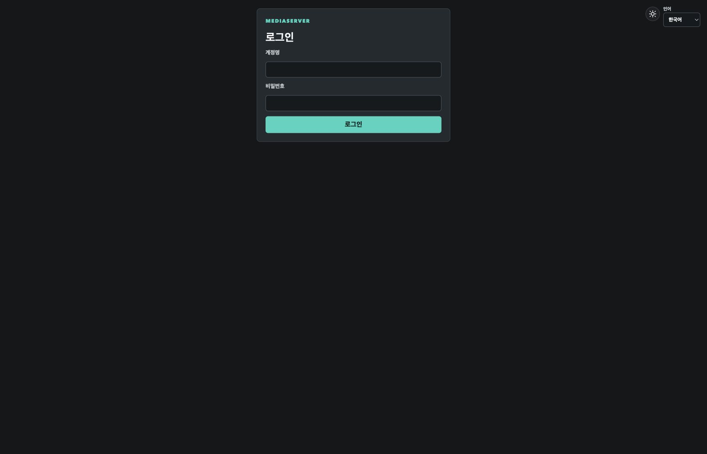
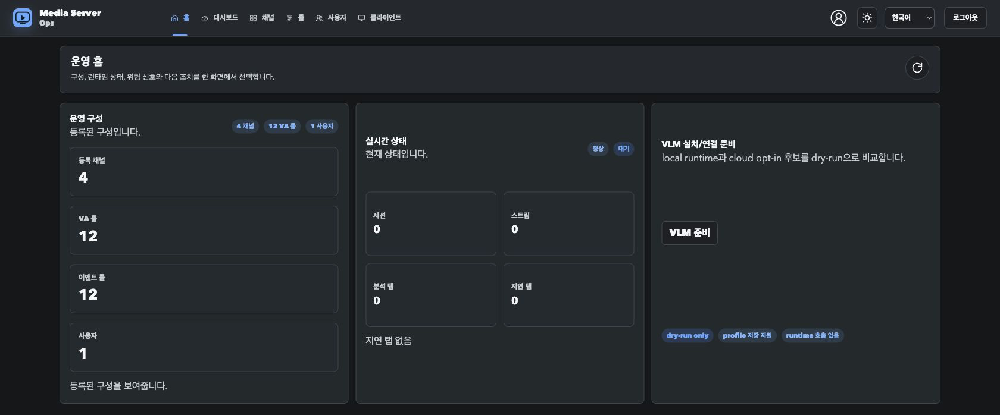
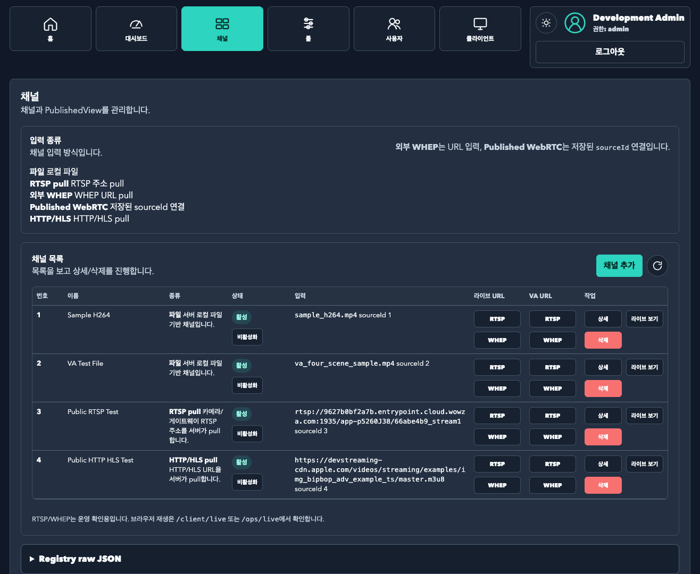
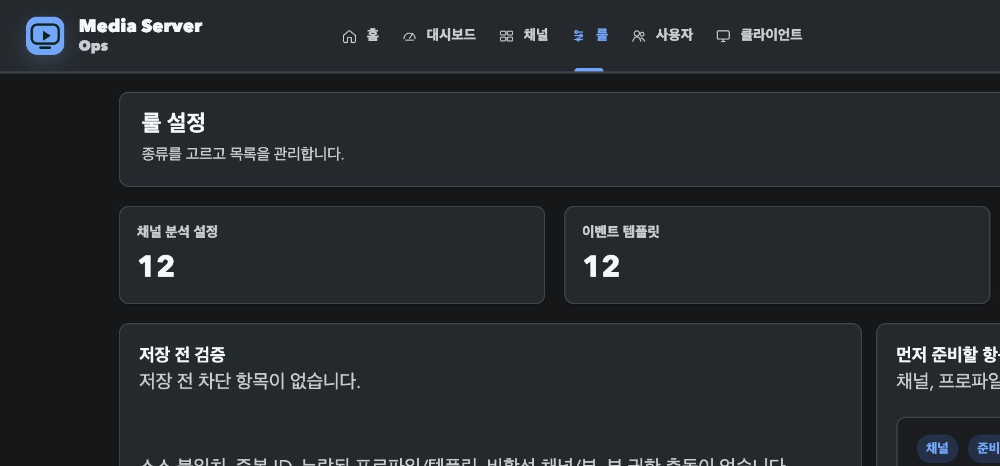
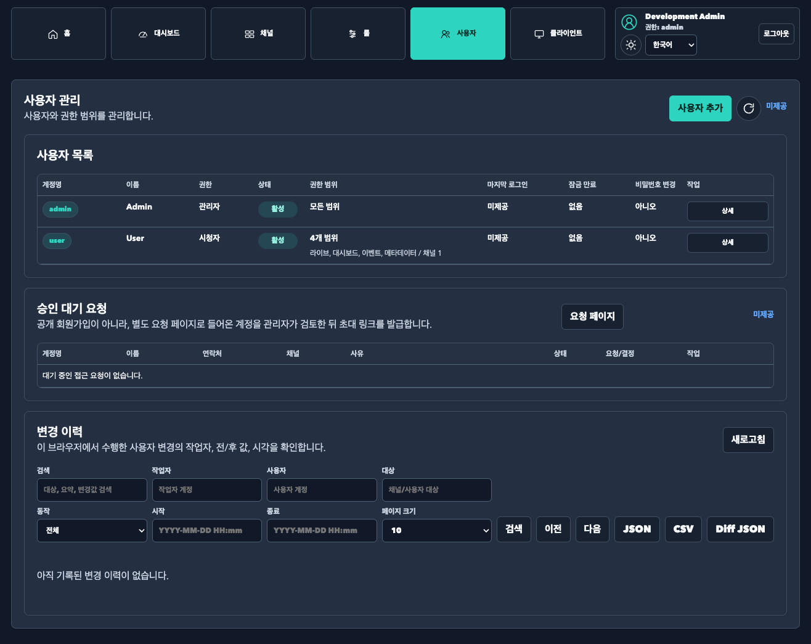
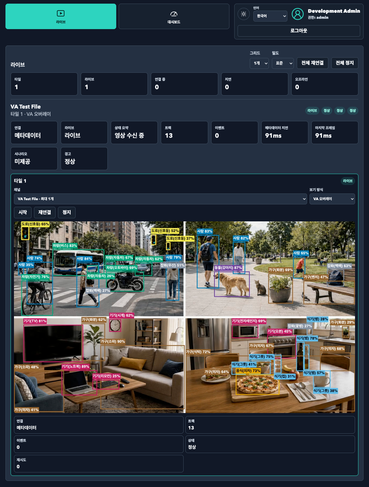
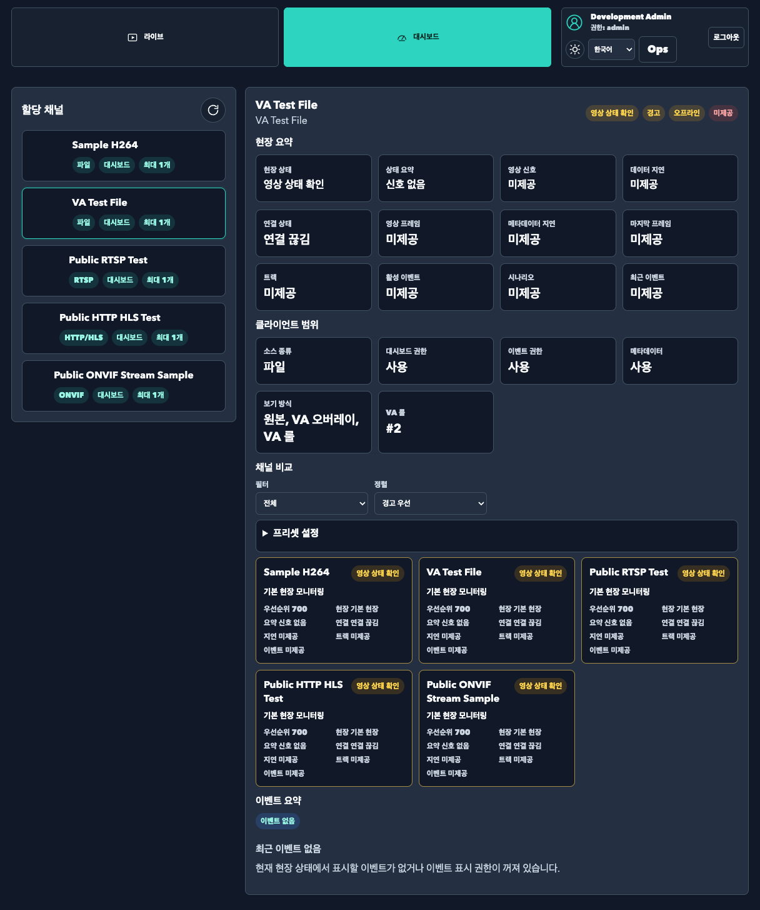

# UI Guide

이 문서는 Auth, Ops, Client, Lab UI의 현재 shell 구조와 MVP 범위를 설명합니다. 서버 실행/검증 명령은 [development-guide.md](./development-guide.md), VA 내부 구조는 [video-analysis.md](./video-analysis.md)를 봅니다.

## 1. UI 개요

| 화면 | URL | 용도 |
| --- | --- | --- |
| Root entry | `http://127.0.0.1:8080/` | auth mode와 role에 따른 진입점 |
| 최초 관리자 설정 | `http://127.0.0.1:8080/setup` | setup required 상태에서 admin password bootstrap |
| 로그인 | `http://127.0.0.1:8080/login` | session mode에서 계정 로그인과 role별 landing 이동 |
| 운영 콘솔 | `http://127.0.0.1:8080/ops` 또는 `/ops/home` | admin/operator용 운영 shell과 운영 홈 summary MVP |
| 운영 Dashboard | `http://127.0.0.1:8080/ops/dashboard` | runtime status를 card/detail UI로 표시 |
| 운영 Events 직접 route | `http://127.0.0.1:8080/ops/events` | primary nav에서 숨긴 후속/진단 route |
| 채널 관리 | `http://127.0.0.1:8080/ops/sources` | admin/operator용 숫자 채널 목록과 SourceRegistry/PublishedView 연결 관리 |
| 계정 관리 | `http://127.0.0.1:8080/ops/users` | admin 전용 사용자 생성/수정/비활성화와 scope 관리 |
| 클라이언트 포털 | `http://127.0.0.1:8080/client` 또는 `/client/live` | viewer/operator/admin용 client shell과 2x2 live monitor MVP |
| 클라이언트 Dashboard | `http://127.0.0.1:8080/client/dashboard` | scoped PublishedView 상태 요약 MVP |
| 접근 요청 | `http://127.0.0.1:8080/client/request-access` | pending client access request 제출 |
| 통합 Lab | `http://127.0.0.1:8080/lab` | 스트림 재생, VA 분석, 영상 분석 설정, 실험실 도구를 한 화면에서 확인 |
| 영상 분석 관리 | `http://127.0.0.1:8080/lab/rules` | 영상 분석 설정/보기/Runtime Dashboard 3탭 관리 |
| 런타임 상태 API | `http://127.0.0.1:8080/lab/runtime/status` | session, stream, analysis tap 상태 JSON API |

실제 host/port는 `./server.sh status` 또는 `./server.sh urls` 출력값을 우선합니다.

UI는 light/dark theme-aware design token을 사용하며, card/button/form/table/badge/debug 영역은 같은 semantic color 규칙을 공유합니다. 기본 화면은 요약과 주요 액션을 먼저 보이게 합니다. 운영자용 raw JSON/debugCounters/Developer URL 같은 세부 정보는 낮은 visual weight의 접힘 영역에만 두고, client/viewer shell에는 raw JSON, debug, developer/source URL을 노출하지 않습니다.

액션 계층은 다음 기준을 따릅니다.

- 저장, 검색, 보기 시작 같은 primary action은 fill 버튼으로 표시합니다.
- 목록으로, 재시작, 좌표 초기화, 복사 같은 보조 작업은 weak/ghost 버튼으로 표시합니다.
- 삭제, 중단처럼 되돌리기 어렵거나 위험한 작업에만 danger 버튼을 사용합니다.
- status badge는 `success`, `warning`, `danger`, `info`, `neutral` 의미를 구분하고 한 줄에 과도하게 늘어놓지 않습니다.

내장 HTTP UI는 아직 C++ 문자열 렌더링 기반이지만, 제품 shell 쪽은 다음 공통 helper를 기준으로 유지합니다.

- `include/ingress/product_ui_assets.h`, `src/ingress/product_ui_assets.cpp`: theme toggle button, nav/account SVG asset처럼 route data에 의존하지 않는 product UI asset을 보관합니다.
- `include/ingress/product_ui_css.h`, `src/ingress/product_ui_css.cpp`: Auth/Ops/Client와 `/lab/rules`가 공유하는 design token, 제품 shell CSS, client shell 전용 CSS를 보관합니다.
- `include/ingress/product_ui_js.h`, `src/ingress/product_ui_js.cpp`: theme boot/apply script와 product route 공통 JS helper를 보관합니다.
- `include/ingress/product_ui_page_scripts.h`, `src/ingress/product_ui_page_scripts.cpp`: `/client`, `/client/request-access`, `/ops` shell overview pages, `/ops/sources`, `/ops/users`의 route별 page script를 보관합니다.
- `ProductDesignTokensCss()`: Auth/Ops/Client와 `/lab/rules`가 공유하는 light/dark semantic token 원천입니다.
- `ProductUiCss()`: 제품 shell 공통 card/button/form/table/badge/debug 스타일입니다.
- `ProductSharedUiScript()`: product route에서 공유하는 `escapeHtml`, `requestJson`, selector, form-data, feedback, badge/raw JSON 렌더링, select/table DOM helper, role/scope visibility helper입니다.
- `ClientShellCss()`: client shell 전용 CSS를 `ClientShellPageHtml()` 밖에서 관리합니다.
- `AppendOpsShellStart/End`, `AppendAuthShellStart/End`: 운영 shell과 setup/login auth shell의 공통 document/header/footer를 렌더링합니다.
- `AppendProductAccountMenu()`: theme toggle, user role, logout 영역을 Ops/Client에서 동일하게 렌더링합니다.
- `AppendRawJsonDetails()`: 운영자용 raw/debug JSON을 낮은 visual weight의 접힘 영역으로 렌더링합니다.
- `AppendOpsHomePage()`, `AppendOpsDashboardPage()`, `AppendOpsRulesPage()`, `AppendOpsEventsPage()`: `/ops` shell 내부 page markup을 route별 helper로 분리합니다.
- `AppendClientShellScript()`, `AppendOpsShellScript()`, `AppendOpsSourcesPageScript()`, `AppendOpsUsersPageScript()`: page markup과 route별 JS 동작을 물리적으로 분리합니다. API schema와 payload는 기존 endpoint 계약을 그대로 사용합니다.
- `HtmlPageResponse()`: browser page route의 `text/html`/`no-store` 응답 포장을 공통화합니다.
- `IsOpsOverviewShellRoute()`, `IsClientShellRoute()`: route handler의 shell path 판별을 한 곳에서 관리합니다.

UI ownership은 다음 표를 기준으로 봅니다.

| 영역 | 파일/함수 | 책임 | 변경 주의점 |
| --- | --- | --- | --- |
| Product assets | `product_ui_assets.*` | theme toggle button, nav/account SVG | route data나 API fetch를 넣지 않습니다. |
| Product CSS | `product_ui_css.*` | design token, product shell CSS, client shell CSS | 색상/spacing/radius는 semantic token 우선으로 유지합니다. |
| Product JS | `product_ui_js.*` | `MediaServerUi` helper, theme persistence, iframe theme sync | API schema나 route별 payload를 넣지 않습니다. |
| Product page scripts | `product_ui_page_scripts.*` | route별 Ops/Client form/table/live monitor script | backend payload 계약과 selector를 유지합니다. |
| Auth shell | `AppendAuthShellStart/End` | `/setup`, `/login`, `/password/change`, invite/request shell | password policy와 session 동작은 auth backend 계약을 따릅니다. |
| Ops shell | `AppendOpsShellStart/End`, `AppendOps*Page*`, `AppendOpsShellScript` | admin/operator navigation, page markup, overview script | raw/debug JSON은 접힘 영역에만 둡니다. |
| Client shell | `ClientShellPageHtml`, `AppendClientShellScript` | scoped viewer live/dashboard UI | source URL, debugCounters, Developer URL, rule/profile editor를 노출하지 않습니다. |
| Smoke | `verify_ops_client_ui_smoke.mjs`, `verify_auth_ui_smoke.mjs`, `verify_auth_workflow.sh`, `rule_ui_smoke_check.mjs` | selector, screenshot, auth UI, `/lab/rules` 회귀 확인 | visual text보다 stable selector와 금지 항목 중심으로 유지합니다. |

`/lab/rules`는 기존 smoke selector와 3탭 회귀 위험이 높으므로, 대규모 DOM 구조 변경 없이 token과 selector 호환을 우선합니다.

`/lab/rules`는 세 탭으로 나뉩니다.

- 영상 분석 설정: 저장된 영상 분석 룰 목록과 룰 편집 화면
- 영상 분석 보기: 실시간 스트리밍, VA 오버레이, VA 룰 미리보기
- Runtime Dashboard: active analysis tap의 runtime metadata, backpressure, scenario/event/debug 상태


대표 제품 shell 스크린샷:















## 2. Login / Session

기본 `MEDIA_SERVER_AUTH_MODE=auto`에서는 최초 users file/admin password 상태를 먼저 확인합니다. users file이 없거나 `admin.passwordHash`가 없으면 `/setup`에서 기본 username `admin`의 비밀번호를 처음 설정합니다. admin 기본 비밀번호는 없으며, passwordless admin login은 허용하지 않습니다. setup 완료 후 `/setup`은 `/login`으로 돌아가고, 이후에는 `/login`에서 계정으로 로그인해 role/scope snapshot을 담은 HttpOnly session cookie를 받습니다.

로컬 QA와 수동 smoke에서는 테스트 계정을 만들거나 초기화할 때 비밀번호를 `qweasd0-`로 통일합니다. 이는 검증 중 계정 상태를 일관되게 맞추기 위한 테스트 규칙이며, 운영 배포나 제품 기본 비밀번호로 사용하지 않습니다.

Password policy 기본값은 `kr-privacy`입니다. `/setup`과 `/password/change`는 동일한 정책을 적용하며 3종류 조합 최소 8자, 2종류 조합 최소 10자, username 포함 금지, 반복 문자/연속 숫자/키보드 배열/흔한 비밀번호/history 재사용 금지를 안내합니다. 로그인 실패가 반복되면 계정별 lockout 메시지를 표시하고, `mustChangePassword=true` 계정은 로그인 후 `/password/change`로 이동합니다.

`MEDIA_SERVER_AUTH_MODE=off`는 기존 Lab 검증과 개발 자동화를 위한 명시 모드입니다. 이 모드에서만 `/lab`와 `/lab/rules`에 바로 접근합니다.

Role별 이동:

- `admin`, `operator`: `/ops/home`
- `viewer`: `/client/live`
- `integrator`: UI landing 없이 `/client/api/views/{viewId}/events`와 `/client/api/views/{viewId}/metadata` 연동용 token/session 사용을 우선합니다.

Login page는 username/password 입력, 실패/lockout 메시지, 로그인 후 현재 사용자/role 표시, logout 버튼만 제공하는 MVP입니다. `/`는 setup required 상태에서 `/setup`, auth off에서 `MEDIA_SERVER_UI_DEFAULT_HOME`에 따라 `/lab`, `/ops/home`, `/client/live`, auth on에서 admin/operator를 `/ops/home`, viewer를 `/client/live`, 미인증 요청을 `/login`으로 보냅니다. 비밀번호 변경 성공 시 기존 session은 폐기되고 `/login`에서 다시 로그인합니다.

클라이언트 계정의 1차 정책은 admin 수동 생성/승인입니다. admin은 `/ops/users`에서 username, role, viewId 또는 직접 scopes, 초기 비밀번호를 입력해 계정을 생성하거나 pending access request를 승인/거절합니다. Invite/setup API와 CLI는 검증 및 운영 보조 흐름으로 유지합니다. Self-signup 자동 승인은 제공하지 않습니다. `/client/request-access`는 pending request만 저장하며, public API는 body/field 길이, viewId 안전 문자, 중복 pending, peer rate-limit을 통과한 요청만 저장합니다. Admin 승인 후에도 password setup invite가 수락되기 전에는 계정 생성, session login, view 접근이 허용되지 않습니다. PublishedView 단위 접근은 `view:read:{viewId}`, `event:read:{viewId}`, `metadata:read:{viewId}`, `dashboard:read:{viewId}` scope로 제한합니다.

Route 역할:

- `/ops`: admin/operator 전용 운영 shell이며 `ops:read` scope가 필요합니다. 채널/PublishedView 변경 API는 `source:write` scope를 추가로 요구합니다. Primary nav는 홈, 대시보드, 채널, 룰, 사용자(admin), 클라이언트 미리보기 순서입니다. `/ops/home`은 운영 overview이고 `/ops/live`는 후속 Operator Live Monitor 안내 route입니다. `/ops/dashboard`는 `/ops/api/runtime/status`로 운영 카드/상태를 표시하고, `/ops/rules`는 `/ops/api/rules/catalog`로 VA 룰, 이벤트 룰, 분석 프로파일 카탈로그를 표시합니다. 두 화면은 Lab iframe 또는 `/lab/rules?embed=1`에 의존하지 않습니다. `/ops/events`는 primary nav에서 숨긴 후속/진단 route이며 독립 제품 탭으로 취급하지 않습니다. raw JSON은 접힘 debug 영역에만 둡니다.
- `/client`: viewer/operator/admin 접근 shell입니다. `/client/api/views` 기준으로 할당된 PublishedView만 표시하며 원본 source URL, debug/developer URL은 노출하지 않습니다. Integrator는 shell/live/dashboard UI가 아니라 scoped events/metadata API만 접근합니다.
- `/lab`: admin/operator 또는 `lab:read` scope용 개발/검증 shell입니다. viewer/client 기본 계정은 접근할 수 없고, rule/profile/vaRule 변경 API는 `rule:write` scope를 추가로 요구합니다. 기존 `/lab/rules`와 자동화 bookmark 호환은 auth off 검증 모드에서 유지합니다.

Shell navigation은 server-side principal로 1차 렌더링하고 `/auth/whoami` 응답으로 admin-only menu를 다시 숨김 처리합니다. Client shell의 primary nav는 viewer용 라이브/대시보드만 유지합니다. admin/operator가 client 화면을 열면 메뉴 아래에 `Ops로 돌아가기`를 표시하고, viewer에게는 Ops/Lab nav와 debug/developer URL을 숨깁니다. Guard 실패 시 browser shell route는 login 또는 forbidden page를 보여주고, API route는 JSON `401`/`403`을 반환합니다.

Auth UI/route 회귀는 `./server.sh verify-auth-bootstrap`, `./server.sh verify-auth-users`, `./server.sh verify-auth-routes`로 확인합니다. 이 smoke는 `/setup`, `/login`, `/password/change`, `/invite/setup`, `/client/request-access`의 auth shell과 핵심 form selector를 함께 검사합니다. Auth shell screenshot smoke가 필요하면 `MEDIA_SERVER_VERIFY_AUTH_VISUAL=1 MEDIA_SERVER_VERIFY_AUTH_SCREENSHOTS=1`을 붙여 같은 명령을 실행합니다. Ops/Client shell selector와 client debug/source 비노출은 `./server.sh verify-ops-client-ui`로 확인합니다. 이 smoke는 `/ops/dashboard`와 `/ops/rules`의 Lab iframe 비의존, `/ops/api/runtime/status`, `/ops/api/rules/catalog`, `/ops/api/events/status` 계약, `/client/api/views`, 단일 view, dashboard, events, metadata 응답의 민감 key를 검사합니다. 화면 회귀 확인이 필요하면 `./server.sh verify-ops-client-ui --screenshots`로 주요 Ops/Client 화면을 headless Chrome에서 열어 overflow와 screenshot을 함께 남깁니다. 기존 Lab 자동화는 명시적인 auth off 검증 모드에서 계속 `/lab/rules` 3탭 구조와 공유 design token 계산값을 기준으로 동작합니다.

## 3. Admin User Management

`/ops/users`는 admin 전용 계정 관리 MVP 화면입니다. 공통 Ops shell 안에서 먼저 사용자 목록 table과 접근 요청 table을 보여주고, 사용자 추가 버튼으로 접힌 editor를 여는 방식입니다. User list는 계정명, 표시 이름, 권한, 상태, 권한 범위 수, 마지막 로그인, 잠금 만료, 비밀번호 변경 여부, 작업을 표시하며 `passwordHash`, `passwordHistory`, `tokenHash`, invite `tokenHash`는 UI/API 응답에 노출하지 않습니다.

지원 동작:

- 계정 생성: admin이 username, displayName, role, viewId 또는 직접 scopes와 초기 비밀번호를 입력해 사용자를 생성합니다. 새 계정은 기본 활성화 상태이며 `mustChangePassword`를 켤 수 있습니다.
- 계정 수정: displayName, role, scopes, enabled, mustChangePassword를 변경합니다.
- 비밀번호 초기화: API/CLI smoke 경로에서 reset-password를 지원합니다. Ops UI 기본 화면은 사용자 생성/수정/활성화 관리에 집중합니다.
- enable/disable: hard delete 대신 disable을 사용합니다. 마지막 활성 admin 계정은 비활성화하거나 다른 role로 변경할 수 없습니다.
- viewer UX: `role=viewer` 또는 `integrator` 선택 시 view/scope assignment 영역을 보여줍니다. PublishedView가 아직 연결되지 않은 환경에서는 `viewId` 또는 `view:read:{viewId}` 같은 문자열 scope를 직접 입력합니다. viewer에는 debug/lab/ops/source/rule 관리 scope를 부여하지 않습니다.
- invite: admin API/CLI가 setup invite token을 발급하면 원문 token은 생성 응답에서 한 번만 표시됩니다. 저장소에는 `tokenHash`, 만료 시각, 사용 여부와 수락 시 적용할 role/scope snapshot만 남습니다. 기존 enabled user에 대한 invite도 수락 전에는 현재 role/scope/session을 바꾸지 않고, `/invite/setup`에서 비밀번호 설정이 끝나면 token hash와 이전 session을 폐기합니다.
- request: `/client/request-access` 또는 `POST /client/api/access-requests`로 들어온 요청은 `pending`으로 저장됩니다. `/ops/users`의 접근 요청 table에서 admin이 승인하면 password setup invite를 발급하고, token/setup URL은 승인 응답에서 한 번만 표시합니다. user row는 invite 수락 시점에 만들거나 갱신합니다. 거절은 request 상태만 `rejected`로 바꾸며 user/session/view scope를 만들지 않습니다.

Role별 scope template:

- `admin`: `*`
- `operator`: `ops:read`, `rule:write`, `source:write`, `dashboard:read:*`, `event:read:*`
- `viewer`: `view:read:{viewId}`, `dashboard:read:{viewId}`, `event:read:{viewId}`, `metadata:read:{viewId}`. viewId가 비어 있으면 실제 view 권한을 주지 않는 `__unassigned__` placeholder scope를 사용합니다.
- `integrator`: `metadata:read:{viewId}`, `event:read:{viewId}`. UI shell은 열지 않고 scoped API만 사용합니다.

CLI도 같은 C++ password hash/password policy 경로를 사용합니다. Password는 기본적으로 prompt로 입력하고, 자동 smoke에서는 `--password-stdin`을 사용할 수 있습니다.

```bash
./server.sh auth-user list
./server.sh auth-user add --username client-a --role viewer --view-id lobby-live
./server.sh auth-user reset-password --username client-a
./server.sh auth-user disable --username client-a
```

## 4. SourceRegistry / PublishedView

`/ops/sources`는 운영자가 실제 source를 한 번 등록하고, 클라이언트에는 PublishedView 단위로 공개하기 위한 MVP 화면입니다. 제품 UI에서는 SourceRegistry/PublishedView를 따로 노출하지 않고 `채널` 개념으로 묶어 보여줍니다. 먼저 숫자 채널 목록 table을 표시하고, 채널 추가/보기/수정/복제/비활성화/삭제 흐름은 룰 목록과 같은 패턴을 따릅니다. 기본 registry가 비어 있으면 `sample_h264.mp4`, VA test file, 검증된 공개 RTSP/HLS URL을 숫자 채널로 seed합니다. 기존 registry 파일에 malformed record나 깨진 PublishedView source 참조가 있으면 운영 화면/API는 조용히 누락하거나 seed로 덮지 않고 오류를 반환합니다. 내부적으로 `kind=webrtc`와 `webrtcSourceId`는 남아 있지만 외부 WebRTC/WHEP URL pull이 아니라 이 서버의 `/whip/publish` endpoint로 먼저 등록된 sourceId를 소비하는 경로이므로 product UI 선택지는 임시로 숨깁니다. 외부 WebRTC/WHEP URL source pull은 후속 최우선 기능입니다. 같은 RTSP/HTTP URL은 query 순서가 달라도 canonical key 기준으로 중복 등록이 거부됩니다.

채널 테이블은 라이브 URL과 VA URL을 분리해 표시하고, 각 영역에서 RTSP와 WebRTC 복사 버튼을 세로로 배치합니다. 복사한 RTSP URL은 일반 RTSP player에서 원본 또는 VA overlay stream을 확인하는 용도이고, WebRTC 버튼은 이 서버의 WHEP endpoint URL을 복사합니다. 이 WHEP URL은 auth on에서 admin/operator `ops:read` 또는 `lab:read` 권한이 있는 운영/검증 클라이언트용이며, 외부 viewer 공유 URL이 아닙니다. PublishedView의 `viewId`, `sourceId`, `defaultRuleId`, `allowedRuleIds`, overlay mode, dashboard/event/metadata 노출 여부는 내부 API schema로 유지합니다. Client Live에서 `va-rule` mode를 사용할 때 `allowedRuleIds`는 PublishedView source와 같은 source를 가진 rule에만 유효합니다. `/client/api/views`는 로그인 principal의 `view:read:{viewId}` scope가 있는 view만 반환하며, 원본 source URL이나 file locator는 클라이언트 응답에 포함하지 않습니다. 운영자용 registry raw JSON은 `/ops/sources`의 접힘 debug 영역에서만 확인합니다.

### 4.1 Client scoped dashboard

`/client/dashboard`는 viewer가 접근 가능한 PublishedView의 상태 요약만 보여주는 client dashboard MVP입니다. view 목록은 `/client/api/views`의 scoped 결과를 사용하고, 선택된 view의 상세 상태는 `/client/api/views/{viewId}/dashboard`에서 가져옵니다. `/client/events`는 primary nav에서 제거했으며, 이벤트 요약은 client dashboard 안에서 sanitized summary로만 표시합니다. Integrator 연동은 `/client/api/views/{viewId}/events?limit=...`와 `/client/api/views/{viewId}/metadata`를 사용하며 각각 `event:read:{viewId}`, `metadata:read:{viewId}`가 필요합니다.

표시 범위:

- view health: view name, live/offline, connection status, video frame status, metadata status, stale 여부
- analysis summary: track count, active event count, scenario count, latest event time
- event summary: 최근 event, event type별 count, warning badge
- connection: WebRTC connected/disconnected, stale metadata age, last frame age

값이 없거나 아직 수집되지 않은 항목은 UI에서 `미제공`으로 표시합니다. Client dashboard, `/client/api/views/{viewId}/events?limit=...`, `/client/api/views/{viewId}/metadata`는 source 원본 URL, Developer URL, raw JSON, `debugCounters`, `analysisTapId`, internal session id, rule/profile editor, Event POST 설정, SSE/WS 전체 endpoint를 노출하지 않습니다. 운영자용 세부 runtime/debug 확인은 `/lab/rules` Runtime Dashboard 또는 `/lab/runtime/status`에서만 수행합니다.

### 4.2 Client Live Monitor

`/client/live`는 viewer가 접근 가능한 PublishedView만 2x2 grid에 배치하는 live monitor MVP입니다. Tile은 최대 4개이며, 각 tile은 `/client/api/views/{viewId}/webrtc/session` wrapper로 WebRTC session을 생성합니다. Browser PeerConnection은 `/webrtc/config`의 `peerConnectionConfig`를 사용해 운영 STUN/TURN과 relay-only 설정을 그대로 따릅니다. 생성 응답은 client session alias만 반환하고, answer/ICE/delete는 `/client/api/views/{viewId}/webrtc/session/{clientSessionId}` 아래에서만 이어집니다. Client route는 viewId만 받으며 source 원본 URL, file/url/source override, 내부 generic session id/token, Developer URL, BBox diagnostics, raw JSON, `debugCounters`, rule/profile 수정 UI는 노출하지 않습니다. `va-rule` mode는 PublishedView의 `allowedRuleIds`와 rule source 일치 검증을 모두 통과해야 합니다. Viewer/client 계정은 직접 `/webrtc/session`, `/whep`, `/whip/publish` 생성 route를 호출할 수 없습니다.

Tile별 기능:

- assigned view 선택
- PublishedView의 `allowedOverlayModes` 안에서 `raw`, `va-overlay`, `va-rule` 선택
- tile start / tile stop / all stop
- live/offline, stale, track count, event count, connection status 표시
- 선택된 tile만 dashboard/detail을 갱신

Hidden tab, route leave, tile stop 시 PeerConnection, DataChannel, server WebRTC session을 정리합니다. 모든 tile에 BBox diagnostics를 켜는 동작은 제공하지 않습니다.

## 5. 영상 분석 룰 목록

룰 목록은 저장된 `vaRule` 설정을 관리하는 첫 화면입니다. `vaRule`은 숫자 ID이며, 영상 source, 분석 profile, event/scenario, 영역/라인, event action을 하나로 묶습니다.

목록에서 확인하는 정보:

- 전체 룰 수
- 적용 중 룰 수
- 시나리오 룰 수
- 다음 자동 번호
- 각 룰의 ID, 이름, source, event 방식, 적용 상태

주요 동작:

- 룰 추가: 목록 상단의 단일 버튼으로 제공하며, 기본값이 채워진 새 룰 편집 화면으로 이동합니다.
- 룰 수정: 각 룰 행의 수정 버튼으로 저장 데이터를 편집 화면에 불러옵니다.
- 룰 삭제: 각 룰 행의 삭제 버튼을 누른 뒤 룰 ID와 이름을 확인하는 dialog 후 삭제합니다.
- 룰 보기/테스트: 영상 분석 보기 탭에서 해당 룰을 선택해 확인합니다.
- 적용 상태: 목록에서 적용/비활성 상태를 확인하고 토글할 수 있습니다.
- 룰 복제: 각 룰 행의 복제 버튼을 사용합니다. 새 숫자 ID를 사용하며, 복제 룰은 실수 적용을 막기 위해 비활성 상태를 기본으로 둡니다.

목록은 다중 선택 기반 toolbar를 사용하지 않습니다. 보기/수정/복제/삭제는 각 룰 행의 작업 버튼에만 노출하고, 필터 결과 수는 `표시 중` 요약 배지로 작게 표시합니다.

사용자가 rule number를 직접 입력하지 않습니다. 서버/UI가 빈 숫자 ID를 자동 배정하고, URL에서는 `vaRule=<숫자>`만 사용합니다.

## 6. 룰 편집 흐름

룰 추가 또는 수정 시 편집 화면으로 전환됩니다. 저장 완료 후에는 목록으로 돌아가는 흐름을 기본으로 합니다.


편집 화면은 8개 섹션입니다.

| 섹션 | 설명 |
| --- | --- |
| 기본 정보 | Rule ID, Rule 이름, 적용 상태 |
| 영상 소스 | 대상 source, 송출 경로, 현재 연결된 source 요약 |
| 분석 Profile | 사용할 profile 선택, profile 요약, 고급 Profile 설정 |
| 이벤트 방식 | 기본 이벤트 또는 시나리오 선택 |
| 대상 객체 | 객체 category, 최소 신뢰도, 최소 지속 시간, 불안정 track 제외 옵션 |
| 영역/라인 설정 | 영상 프레임 보기, polygon/line 캔버스, 영역 이름 |
| 이벤트 동작 | overlay blink, blink 시간, POST URL, payload preview |
| 저장 전 검토 | 현재 설정 요약, validation 결과, 저장 버튼 |

편집 화면 상단의 룰 이름, 저장 상태, 저장/목록 버튼, 섹션 이동 영역은 스크롤 중에도 따라다닙니다. 일반 폭에서는 섹션 이동을 버튼 탭으로 표시하고, 버튼 텍스트를 읽기 어려운 매우 좁은 폭에서는 드롭다운으로 전환합니다.

저장하지 않은 변경사항이 있으면 목록 이동, 다른 룰 수정, 영상 분석 보기 이동 전에 확인 경고가 뜹니다. 저장/삭제 성공 또는 실패는 feedback으로 표시됩니다.

## 7. 분석 Profile

룰 편집 화면의 profile 흐름:

- 먼저 profile 선택과 요약을 보여줍니다.
- 새 profile이 필요할 때만 `새 Profile 설정`을 시작합니다.
- 세부 설정은 `고급 Profile 설정` 접힘 영역에서 다룹니다.
- 룰 작성 흐름에서는 `Profile 저장`과 `닫기`만 노출합니다.
- 기존 profile 삭제 같은 관리 동작은 기본 작성 흐름에 노출하지 않습니다.

Profile 항목:

- Detector: `YOLO/ONNX` 또는 `개발용 더미(검증용)`
- FPS: 분석 sampling FPS
- Queue: detector 앞 queue 크기
- Confidence: detection confidence threshold
- NMS: non-maximum suppression threshold
- Input size: model input width/height
- Tracking category: track ID와 event 판단에 사용할 category

`YOLO/ONNX`는 실제 객체 검출입니다. `개발용 더미`는 모델 없이 pipeline과 UI를 확인하기 위한 검증용 옵션이며 운영 설정에는 보통 사용하지 않습니다.

Tracking category가 비어 있으면 profile 저장을 막습니다. 전체 추적이 필요하면 UI의 전체 선택 또는 API의 `*` 토큰을 사용합니다.

## 8. 기본 이벤트

기본 이벤트는 기존 rule event engine을 사용하며, 외부 event JSON/API/POST 형식을 유지합니다.

지원 이벤트:

| 이벤트 | 의미 |
| --- | --- |
| `presence` | 영역 안에 대상 객체가 감지됨 |
| `enter` | 대상 객체가 영역 밖에서 안으로 진입 |
| `exit` | 대상 객체가 영역 안에서 밖으로 이탈 |
| `line-crossing` | 대상 객체가 line을 통과 |

`line-crossing`은 방향을 선택할 수 있습니다.

- `any`: 양방향
- `forward`: 선분 시작점에서 끝점으로 향하는 기준의 정방향
- `reverse`: 반대 방향

라인 모드에서는 영역/라인 캔버스의 선 중앙에 현재 설정 방향을 나타내는 작은 화살표를 표시합니다. `any`는 양방향, `forward`/`reverse`는 선택한 한 방향만 표시합니다.

## 9. 시나리오 이벤트

Scenario는 여러 frame에 걸친 시간 조건과 상태 전이를 판단하는 이벤트입니다. 기존 기본 이벤트를 끄거나 바꾸지 않고 별도 scenario event로 동작합니다.


현재 상태:

| 시나리오 | 엔진/검증 상태 | UI 템플릿 상태 |
| --- | --- | --- |
| Intrusion Dwell | 구현됨 | 룰 편집 UI에서 선택 가능 |
| ReEntry | 구현됨 | 룰 편집 UI에서 선택 가능 |
| WrongDirection | 구현됨 | 룰 편집 UI에서 선택 가능 |
| IntrusionAfterLineCrossing | 구현됨 | 룰 편집 UI에서 선택 가능 |
| Loitering | 구현됨 | 전용 UI 템플릿은 다음 작업 |
| ZoneOccupancyScenario | 다음 작업 | 신규 scenario/UI 구현 예정 |

현재 UI가 제공하는 시나리오 템플릿:

| 템플릿 | 설정 항목 | event |
| --- | --- | --- |
| Intrusion Dwell · 제한구역 체류 | zone, 후보 시간, 체류 시간, cooldown | scenario event |
| ReEntry · 이탈 후 재진입 | polygon zone, 재진입 window, 재진입 zone, cooldown | `re-entry` |
| WrongDirection · 금지 방향 통과 | line 2점 geometry, 허용 방향, cooldown | `wrong-direction` |
| IntrusionAfterLineCrossing · line 후 zone 침입 | trigger line, crossing direction, target zone, zone entry timeout, dwell, cooldown | `intrusion-after-line-crossing` |

ReEntry UI 정책:

- 같은 track이 polygon zone을 이탈한 뒤 `reEntryWindowMs` 안에 같은 zone으로 다시 들어오면 `re-entry` scenario event를 1회 발생시킵니다.
- `같은 zone`은 현재 그린 polygon 또는 `targetZoneIds`로 저장된 zone을 그대로 사용합니다.
- `지정 zone`은 `targetZoneIds`/`reEntryZoneIds`에 대상 zone 목록을 명시합니다. 현재 1차 UI는 같은-zone 재진입을 명시하는 용도이며, cross-zone A→B 재진입 판단은 후속 ScenarioEngine 확장 범위입니다.
- Event POST payload schema, WebRTC/SSE/WS metadata schema, ScenarioEngine 판단 로직은 변경하지 않습니다.

WrongDirection UI 정책:

- 허용 방향은 `forward` 또는 `reverse`를 사용합니다.
- `any`는 위반 방향을 정의할 수 없으므로 WrongDirection 템플릿에서 사용하지 않습니다.
- 기존 `line-crossing` 기본 이벤트는 유지합니다.
- WrongDirection은 별도 `wrong-direction` scenario event로 발생합니다.
- Event POST payload schema, WebRTC/SSE/WS metadata schema, ScenarioEngine 판단 로직은 변경하지 않습니다.

IntrusionAfterLineCrossing UI 정책:

- 기존 `line-crossing` 기본 이벤트와 별도 `intrusion-after-line-crossing` scenario event로 발생합니다.
- target zone은 영역/라인 캔버스의 polygon으로 저장하고, trigger line은 전용 설정 영역의 line id/direction/정규화 좌표로 저장합니다.
- `any`, `forward`, `reverse` crossing direction을 모두 사용할 수 있습니다. `any`는 WrongDirection과 달리 정상 trigger 방향입니다.
- UI의 `zoneEntryTimeout(ms)`는 저장 payload의 `maxDelayAfterCrossingMs`로 runtime에 전달합니다.
- Event POST payload schema, WebRTC/SSE/WS metadata schema, ScenarioEngine 판단 로직은 변경하지 않습니다.

Intrusion Dwell UI 항목:

- 후보 판단 시간(ms)
- 체류 확정 시간(ms)
- 재알림 대기 시간(ms)
- 제한구역 이름
- 대상 객체
- 불안정 track 제외
- 상태 흐름 미리보기

ReEntry UI 항목:

- 재진입 window(ms)
- 재알림 대기 시간(ms)
- 재진입 zone: 같은 zone 또는 지정 zone
- 대상 객체
- 불안정 track 제외
- Inside → Exited → ReEntryCandidate → Confirmed → Cooldown → Ended 상태 흐름 미리보기

IntrusionAfterLineCrossing UI 항목:

- trigger line 이름과 x1/y1 → x2/y2 좌표
- crossing direction: any, forward, reverse
- target zone polygon과 zone 이름
- zoneEntryTimeout(ms) / dwell 또는 observe time(ms)
- 재알림 대기 시간(ms)
- 대상 객체와 불안정 track 제외
- Idle → LineCrossed → ZoneEntered → Observing → Confirmed → Cooldown → Ended 상태 흐름 미리보기

실제 scenario engine 활성화와 기본값은 서버 설정과 함께 동작합니다. 환경변수는 [config-reference.md](./config-reference.md)를 봅니다.

## 10. 영역/라인 캔버스

영역/라인 설정 섹션에서 영상 프레임을 보면서 polygon 또는 line을 지정합니다.


캔버스 규칙:

- polygon은 최소 3점이 필요합니다.
- line-crossing은 2점짜리 line이 필요합니다.
- 최대 polygon 점 수는 현재 UI 기준 12개입니다.
- 기존 점 근처를 드래그하면 새 점을 만들지 않고 점 위치를 이동합니다.
- 마지막 점 삭제, 전체 영역 초기화, 되돌리기 버튼을 제공합니다.
- 점 번호는 캔버스 안에 표시됩니다.
- 좌표 목록은 접힘 영역에서 확인합니다.
- 저장 전 검토에 영역 저장 가능 여부가 반영됩니다.
- 저장 가능 여부는 `저장 가능: polygon 4개 점`, `저장 불가: line은 점 2개 필요`처럼 현재 geometry 조건을 직접 설명합니다.

좌표는 기존 payload 구조와 같이 normalized 0~1 비율로 저장됩니다. 캔버스 크기가 바뀌어도 저장 좌표 비율은 유지됩니다.

## 11. 이벤트 발생 시 동작

이벤트 동작 섹션에서 event 발생 시 후처리를 정합니다.

지원 UI:

- overlay blink: 이벤트 객체를 overlay에서 깜빡임으로 강조
- 깜빡임 시간(ms)
- POST URL
- payload preview 접힘 영역

POST URL은 형식 검증을 거칩니다. 실제 외부 전송은 서버가 `MEDIA_SERVER_ANALYSIS_EVENT_POST_ENABLED=1`로 실행된 경우에만 수행됩니다.

EventRecord/snapshot/clip hook:

- EventRecord 저장은 서버 설정으로 켜는 기능이며, 룰 편집 UI의 기본 입력 항목은 아닙니다.
- snapshot/clip hook은 현재 marker/hook 중심이며 실제 frame/clip recorder는 후속 작업입니다.
- 상태 확인은 `/lab/analysis/event-storage/status` API와 관련 metrics를 사용합니다.

## 12. 영상 분석 보기 탭

보기 탭은 설정을 검증하는 테스트/미리보기 화면입니다.


보기 모드:

| 모드 | 설명 |
| --- | --- |
| 실시간 스트리밍 | 선택한 영상의 원본 프레임만 확인 |
| 영상 + VA 오버레이 | 선택한 영상에 기본 `va=1` 객체 검출 overlay 적용 |
| 영상 + VA 룰 | 저장된 `vaRule` ID를 선택하고, 해당 룰에 묶인 source/profile/rule을 사용 |
| WebRTC 메타데이터 | WebRTC simple signaling 영상과 `vaMetadata=1` DataChannel 수신 JSON을 확인 |

`영상 + VA 룰` 모드에서는 source를 따로 선택하지 않습니다. 선택한 rule ID에 저장된 source가 자동으로 고정됩니다.

영상 영역 아래에는 두 줄의 보조 정보를 표시합니다.

| Row | 내용 | 표시 정책 |
| --- | --- | --- |
| compact status row | 재생/연결 상태 | 짧은 상태 문구 중심 |
| 영상 spec row | source, codec, resolution, fps | 고정 값과 갱신 값을 분리 |

source/codec은 왼쪽 그룹에 두고, 재생 중 갱신될 수 있는 resolution/fps는 오른쪽 그룹에 둡니다. FPS는 반올림한 정수만 표시하며, 일시적으로 새 값이 없을 때는 마지막 유효 FPS를 유지합니다.

`WebRTC 메타데이터` 모드는 WebRTC video와 `vaMetadata=1` DataChannel을 함께 점검하는 화면입니다.

한눈에 보는 구성:

| 영역 | 확인하는 것 | 해석 |
| --- | --- | --- |
| DataChannel 상태 | `va-metadata` 연결과 수신 상태 | metadata 경로가 열렸는지 확인 |
| Latest JSON | 마지막 metadata payload | schema, track/event/scenario count 확인 |
| Client overlay | 브라우저 canvas bbox/label | WebRTC 전용 client-side overlay 확인 |
| BBox 진단 | DataChannel, detector, tracker bbox 비교 | 좌표 문제와 tracker ID 문제를 분리 |
| 상태 패널 | buffer/drop/frame matching/stale 값 | 수신과 실제 draw가 분리되어 동작하는지 확인 |

DataChannel 상태:

| 상태 | 의미 |
| --- | --- |
| `비활성` | metadata channel을 요청하지 않음 |
| `연결 중` | WebRTC session 또는 channel 연결 대기 |
| `열림` | channel은 열렸지만 아직 metadata 수신 전 |
| `수신 중` | metadata JSON을 정상 수신 중 |
| `지연` | 수신 age가 커져 overlay stale 가능성이 있음 |
| `닫힘` | session 종료 또는 channel close |
| `오류` | channel 생성, 수신, JSON parse 중 오류 |

영상 재생과 metadata channel은 별도 상태로 봅니다. DataChannel이 열리지 않거나 JSON parse에 실패해도 video track 재생 자체가 곧바로 실패로 전파되면 안 됩니다.

Overlay 정책:

| 항목 | 정책 |
| --- | --- |
| 적용 범위 | WebRTC browser viewer 전용. RTSP 일반 viewer에는 적용되지 않음 |
| 영상 입력 | 서버가 bbox를 합성하지 않은 원본 video track |
| 그리기 방식 | 브라우저 canvas가 현재 관측 중인 track만 그림 |
| 표시 옵션 | 박스, 라벨, Track ID, 시나리오, 이벤트 highlight, TrackHealth, 현재 Zone, 체류 시간 |
| stale 처리 | metadata가 일정 시간 갱신되지 않으면 stale 표시와 흐린 overlay 적용 |
| video stall | video frame callback이 멈추면 DataChannel이 열려 있어도 overlay를 갱신하지 않음 |

Frame sync 정책:

| 상황 | 동작 |
| --- | --- |
| metadata 수신 | 즉시 그리지 않고 현재 video frame에 가장 가까운 metadata를 선택 |
| frame에 맞는 metadata 없음 | `프레임 매칭 실패`로 분리 표시 |
| 짧은 mismatch | grace window 동안 마지막 overlay를 유지해 깜빡임 완화 |
| `fallback-latest` payload | 기본 overlay에서는 `missing`으로 처리 |
| fallback 확인 필요 | `fallback metadata 표시(opt-in)`을 켜서 별도 확인 |
| 파일 loop timestamp 되감김 | overlay buffer와 PTS 보정을 초기화 |
| 파일 loop 경계 | tap의 tracker/track-state도 새 playback cycle로 정리 |

`fallback-latest`를 기본 표시하지 않는 이유는 오래된 bbox가 새 loop의 실제 객체와 다른 위치에 그려지는 일을 막기 위해서입니다.

`BBox 진단 갱신`은 자동 polling 없이 한 번만 조회합니다.

- 기존 tap을 찾은 뒤 `/lab/analysis/taps/<tapId>/bbox-diagnostics?ptsMs=...`를 호출합니다.
- WebRTC DataChannel track bbox와 near-PTS detector/tracker bbox를 비교합니다.
- `Detector 원본 bbox`를 켜면 tracker smoothing 전 box를 점선으로 겹쳐 봅니다.

진단 table 읽는 법:

| 열 | 의미 |
| --- | --- |
| `DC selected` | DataChannel overlay가 선택한 bbox |
| `detector raw` | detector 원본 bbox |
| `track` | tracker 보정 bbox |
| `det↔DC`, `track↔DC` | IoU와 center distance 비교 |
| `continuity` | center jump와 같은 class 근접 후보 확인 |
| `TrackHealth` | association confidence, overlapRisk, missed/lost/reacquired 확인 |
| `close-object guard` | 가까운 같은 class 객체 구간의 association 진단 |

`close-object guard` 해석:

| 값 | 해석 |
| --- | --- |
| `guard off` | 기본 정책. 기존 tracking 동작 유지 |
| `diagnostic-only` | score 변경 없이 후보 진단만 수집 |
| `enforce` | 실험적 opt-in score 보정 skeleton 적용 가능 |
| `closeObjectGuardApplied=false` | `enforce`여도 해당 row ranking score는 보정되지 않음 |
| `미제공` | direct tap/source tap 또는 실제 tracker 진단 없음 |

진단값은 `closeObjectRisk`, `nearestSameClassTrackId`, best/second score, `scoreMargin`, `centerJump`, direction conflict, would-penalize/hold-reacquire, `guardMode`, `guardDecision`을 포함할 수 있습니다. default on 전환은 보류 상태입니다.

문제 판단 팁:

| 증상 | 먼저 볼 후보 |
| --- | --- |
| overlay가 초 단위로 늦게 따라옴 | metadata selector 또는 PTS sync |
| bbox는 맞는데 ID만 흔들림 | tracker association 또는 ID continuity |
| `det↔DC`, `track↔DC`가 높음 | 좌표 변환보다 tracker continuity 쪽 |
| `detector raw`부터 어긋남 | detector 후처리, model box format, coordinate transform |
| DataChannel은 수신 중인데 화면이 멈춤 | video frame callback stall 또는 stale clear |

상태 패널에서는 `Metadata 수신`, `Metadata buffer`, `Metadata drop`, `프레임 매칭 실패`, `표시 video frame`, `Overlay draw`, `마지막 video frame`, `마지막 metadata`, `영상 멈춤` 값을 함께 봅니다.

WebRTC 메타데이터 뷰어 사용 순서:

1. `영상 분석 보기` 탭에서 `WebRTC 메타데이터` 모드를 선택합니다.
2. 서버 파일, URL source, 또는 저장 rule 기반 source를 선택합니다.
3. `보기 시작`을 누르면 `/webrtc/session?...&vaMetadata=1` 세션을 생성합니다.
4. 영상은 WebRTC video track으로 재생되고 metadata는 `va-metadata` DataChannel로 수신됩니다.
5. JSON preview와 Track/이벤트/시나리오 count를 확인합니다.
6. client-side overlay toggle로 박스/라벨/Track ID/시나리오/이벤트/TrackHealth 표시를 조정합니다.
7. bbox 위치가 의심되면 `BBox 진단 갱신`을 눌러 DataChannel/detector/track box의 IoU와 판단 문구를 확인합니다.
8. `보기 중지`를 누르면 WebRTC session과 metadata channel이 닫히고 overlay canvas가 정리됩니다.

연결 상태:

- 대기
- 연결 중
- 재생 중
- 중지됨
- 오류

요청 URL은 일반 화면에 크게 노출하지 않고 `개발자 요청 URL` 접힘 영역에 둡니다. 이 패널은 기본적으로 접혀 있으며, 일반 확인용 URL과 custom client용 side-channel URL을 분리해 보여줍니다.


URL 규칙:

- 실시간 스트리밍: source query만 사용
- 영상 + VA 오버레이: `va=1` 추가
- 영상 + VA 룰: `vaRule=<숫자>`만 사용
- WebRTC 메타데이터: WebRTC simple signaling URL에 `vaMetadata=1`을 명시적으로 추가
- `vaRule` 요청에는 `file/url/source` override를 함께 쓰지 않음

출력 방식 정책:

| 출력 방식 | 용도 | 주의 |
| --- | --- | --- |
| WebRTC 메타데이터 뷰어 | WebRTC video와 DataChannel metadata를 브라우저가 받아 client-side overlay 표시 | RTSP client에서는 동작하지 않음 |
| RTSP 서버 오버레이 | VLC/ffplay/IINA 같은 일반 RTSP client에서 VA overlay 영상 확인 | 서버가 영상 위에 직접 bbox/label을 그린 결과 |
| RTSP 원본 스트림 | overlay 없는 원본 RTSP 출력 | metadata UI 없음 |
| 커스텀 메타데이터 사이드채널 | custom client가 RTSP video와 별도 SSE metadata stream을 함께 처리 | 일반 VLC/ffplay는 side-channel metadata를 표시하지 못함 |

개발자 요청 URL 패널은 두 그룹으로 나뉩니다.

- 일반 확인용: WebRTC metadata viewer, RTSP server overlay처럼 브라우저 또는 일반 RTSP viewer에서 바로 확인하는 URL
- Custom client용: RTSP raw stream, SSE metadata stream, WS metadata stream처럼 custom client가 영상과 metadata를 직접 조합할 때 쓰는 URL

Custom client 영역은 custom client가 같이 사용해야 하는 값을 한 번에 보여줍니다.

- RTSP 원본 스트림: custom client가 재생할 overlay 없는 영상
- SSE 메타데이터 스트림: 같은 source 또는 `vaRule`에 대한 runtime metadata JSON
- RTSP 서버 오버레이: 일반 RTSP viewer에서 바로 확인할 때 쓰는 대체 URL

현재 Lab에서 바로 복사 가능한 custom side-channel URL은 SSE endpoint입니다.

- 기존 active tap: `/lab/analysis/taps/{tapId}/metadata/stream`
- rule 기반 임시 tap: `/lab/analysis/metadata/stream?vaRule=<id>`

Side-channel endpoint 구분:

| Endpoint | 주 용도 | 비고 |
| --- | --- | --- |
| SSE metadata | Lab URL 패널에서 기본 표시 | custom client/dashboard 연동 |
| WebSocket metadata | 직접 URL로 사용 | `/ws/va-metadata?tapId=<id>` 또는 `?vaRule=<id>` |
| 일반 RTSP viewer | side-channel 미지원 | VLC/ffplay/IINA가 자동 overlay하지 않음 |

`/ws/va-metadata`는 `/lab` prefix가 없지만 Lab/custom-client 권한 경계를 따릅니다. Auth on에서는 admin/operator 또는 `lab:read` scope가 필요하고, viewer/client 제품 계정은 `/client` wrapper와 WebRTC DataChannel 흐름을 사용합니다.

SSE 수신만 확인하는 최소 custom client 예제는 `scripts/examples/va_metadata_sse_client.py`입니다.

| 확인 항목 | 설명 |
| --- | --- |
| metadata event | `event: metadata` 수신 |
| schema | `media-server.va.runtime-metadata.v1` 확인 |
| context | `streamId/channelId` 출력 |
| count | `tracks/events/scenarios` count 출력 |
| freshness | latest timestamp와 message count 출력 |
| 제외 범위 | RTSP player와 overlay renderer는 포함하지 않음 |

```bash
python3 scripts/examples/va_metadata_sse_client.py \
  --url 'http://127.0.0.1:8080/lab/analysis/metadata/stream?vaRule=1&intervalMs=500&maxMessageBytes=65536' \
  --max-messages 5 \
  --timeout-seconds 15
```

payload 본문까지 확인하려면 `--print-json`을 추가합니다. RTSP 영상은 별도 player로 확인합니다.

```bash
ffplay -rtsp_transport tcp 'rtsp://127.0.0.1:8554/dhseo?file=sample_h264.mp4'
```

RTSP 원본 스트림과 SSE metadata를 직접 조합하려면 optional OpenCV 예제 `scripts/examples/va_rtsp_sse_overlay_client.py`를 사용합니다.

| 입력 | 역할 |
| --- | --- |
| `--rtsp-url` | Developer URL panel의 `RTSP 원본 스트림` |
| `--metadata-url` | Developer URL panel의 `SSE 메타데이터 스트림` |
| OpenCV window/headless | bbox, trackId, className client-side draw 또는 smoke 확인 |

```bash
python3 scripts/examples/va_rtsp_sse_overlay_client.py \
  --rtsp-url 'rtsp://127.0.0.1:8554/dhseo?file=sample_h264.mp4' \
  --metadata-url 'http://127.0.0.1:8080/lab/analysis/metadata/stream?file=sample_h264.mp4&va=1&intervalMs=500&maxMessageBytes=65536' \
  --max-seconds 15 \
  --headless
```

RTSP overlay 방식 차이:

| 방식 | 일반 RTSP viewer 표시 | 설명 |
| --- | --- | --- |
| RTSP 서버 오버레이 | 가능 | 서버가 bbox/label을 영상에 합성 |
| Custom client overlay | 불가 | client가 RTSP raw frame과 SSE JSON을 직접 조합 |

OpenCV dependency는 예제 실행 전 `python3 -c "import cv2; print(cv2.__version__)"`로 확인합니다. 로컬 서버가 `8081/8555`처럼 보정 포트로 떠 있으면 Developer URL panel에 표시된 RTSP/SSE URL을 그대로 CLI에 넣습니다.

현재 상태:

- 구현 완료: WebRTC 메타데이터 뷰어, DataChannel 수신 상태 표시, latest JSON preview, client-side overlay canvas/toggle
- 구현 완료: 런타임 대시보드의 metrics/state dump/tracking issue report 표시
- 구현 완료: SSE metadata side-channel과 Lab의 custom pairing URL 표시
- 구현 완료: WebSocket metadata side-channel 최소 subscribe/stream endpoint
- 구현 완료: SSE metadata side-channel 수신 중심 custom client 예제
- 구현 완료: OpenCV 기반 Custom RTSP + SSE metadata overlay renderer 예제
- 예정: WebSocket command/filter/subscribe-unsubscribe 제어, WS 기반 custom overlay renderer 확장

검증용 smoke:

```bash
./server.sh verify-webrtc-va-metadata --http-base http://127.0.0.1:8080
./server.sh verify-sse-metadata --http-base http://127.0.0.1:8080
./server.sh verify-ws-metadata --http-base http://127.0.0.1:8080
```

## 13. VA 런타임 대시보드

VA 런타임 대시보드는 현재 분석 서버 상태를 한 화면에서 보는 운영용 탭입니다.

| 상태 | 화면 동작 |
| --- | --- |
| active tap 있음 | Health Summary부터 Debug까지 현재 runtime 상태 표시 |
| active tap 없음 | 본문을 낮은 visual weight로 표시하고 보기 시작 안내 |
| Dashboard tab 닫힘 | polling 중지 |
| 자동 갱신 사용 | 최소 2초 이상 간격으로 제한 |

문서용 screenshot은 긴 dashboard 전체를 한 장으로 축소하지 않고, active analysis tap 데이터가 들어간 상태에서 구간별로 나눠 캡처합니다. 각 이미지는 바로 위의 확인 포인트와 함께 읽습니다.

| Screenshot | 확인 포인트 |
| --- | --- |
| Health Summary / Controls | active stream/tap, rule, refresh, stale, cleanup, guard 상태 요약 |
| Warnings / Trend detail | 최근 sample 수, delta/min/max, warning badge |
| Metadata / Backpressure | WebRTC/SSE/WS metadata, payload, DataChannel buffer |
| Runtime Detail / vaRule Debug | 선택 tap/rule/source/profile/event/scenario runtime 관계 |
| Tracks | track lifecycle, zone/dwell, TrackHealth |
| Scenarios / Events | scenario phase/timeline, recent event buffer |
| Event Records | 자동 polling 없는 수동 검색 UI와 active JSON Lines 조회 범위 |
| Tracking Issues | tracking issue report와 close-object diagnostics |

### 10.1. Health Summary / Controls

대시보드 제목, tap/rule 선택, refresh 정책, Health Summary를 함께 봅니다. source는 문서용으로 상대 표시하며 개인 절대경로를 노출하지 않습니다.


### 10.2. Warnings / Trend detail

최근 60개 client-side sample 기준의 delta/min/max와 warning badge를 확인합니다. Runtime Dashboard는 live observation 보조 화면이며 longrun report를 대체하지 않습니다.


### 10.3. Metadata / Backpressure

WebRTC DataChannel, SSE/WS side-channel, payload size, queue/drop/fail counter를 확인합니다. 값이 endpoint에서 제공되지 않으면 `미제공`으로 표시합니다.


### 10.4. Runtime Detail / vaRule Debug

선택 rule과 active tap의 source/profile/event/scenario/region 관계를 읽기 전용으로 표시합니다. Event POST payload, metadata schema, ScenarioEngine 판단 로직은 변경하지 않습니다.


### 10.5. Tracks

trackId, class, lifecycle, currentZone, dwellTimeMs, TrackHealth를 state-dump 기반으로 확인합니다.


### 10.6. Scenarios / Events

scenario phase, timeline, recent event buffer를 한 구간에서 확인합니다. 이벤트가 없으면 빈 상태 이유를 짧게 표시합니다.


### 10.7. Event Records

Event Records는 자동 polling하지 않습니다. 검색 버튼을 눌렀을 때 active JSON Lines의 metadata만 조회하며 rotated archive는 별도 archive query 후속 범위입니다.


### 10.8. Tracking Issues

tracking issue report와 close-object diagnostics를 분리해 봅니다. 아래 캡처는 table 하단과 diagnostics 접힘 영역이 잘리지 않도록 section 단위로 캡처한 예입니다.


표시 항목:

- Health Summary: sessions, streams, analysis taps, SSE/WS clients, RTSP consumers, cleanup warning, metadata stale, guard mode
- Warnings: dashboard sample, runtime delta, cleanup watch, stale metadata/backpressure를 badge 중심으로 표시
- Metadata / Backpressure: WebRTC sent/drop/fail, SSE/WS client/message, metadata JSON build/payload size, DataChannel bufferedAmount
- Tracking / Scenario: Tracks, Tracking Issues, Scenarios, Scenario Timeline
- Event Records: 자동 polling 없이 검색 버튼으로만 조회하는 저장 event metadata table
- Debug: vaRule Runtime Debug, raw JSON, debugCounters, tracking issue detail

선택 UI:

- 분석 Tap: 현재 활성 tap 중 하나를 선택합니다.
- 룰: 저장된 rule ID를 기준으로 관련 tap을 우선 선택할 때 사용합니다.
- 갱신 주기: 수동, 2초, 5초, 10초 중 선택합니다.

drill-down 사용법:

| 영역 | 주요 확인 항목 | 주의 |
| --- | --- | --- |
| Overview | session/stream/tap 수, FPS, queue, inference latency, event POST/storage | 빠른 상태 요약 |
| vaRule Runtime Debug | 선택 rule과 active tap 관계, source/profile/event/scenario/region, recent event | `rule mismatch`는 실제 ruleId가 다를 때만 표시 |
| Tracks | trackId, class, lifecycle, currentZone, dwellTimeMs, TrackHealth | state-dump debug track 기반 |
| Scenarios | scenarioName, phase, zone, line, elapsed, cooldown | 값이 없으면 짧은 empty reason 표시 |
| Scenario Timeline | phase chip, event emitted, dedup count, recent event 연결 | 판단 로직 변경 없이 읽기 전용 |
| Events | 선택 tap의 `/events` buffer | 선택 rule이 있으면 해당 rule recent event만 반영 |
| Event Records | EventRecord 수동 검색과 detail JSON | 영상 재생, snapshot 추출, clip recorder 없음 |
| Metadata / Backpressure | DataChannel, SSE/WS client, queue, payload size, RTSP lifecycle | 불균형, cleanup 잔여, failure는 warning badge |
| Trend / Stale / Cleanup | 최근 60개 dashboard sample의 count/age/delta/min/max/잔류 상태 | 새 backend endpoint 없이 client buffer만 사용 |
| RSS 표시 | live 보조 관찰 | longrun report를 대체하지 않음 |

Trend / Stale / Cleanup 1차 기준:

| 범주 | 표시 대상 | warning 기준 |
| --- | --- | --- |
| Runtime trend | activeSessions, activeStreams, activeAnalysisTaps, SSE/WS clients, RTSP consumers | 최근 60개 sample window에서 증가/감소/유지, min/max 표시 |
| Metadata trend | WebRTC sent/drop/fail, metadataJsonBuildCount, payload avg/max, DataChannel bufferedAmount | drop/fail 증가, bufferedAmount가 session limit의 80% 초과 |
| Analysis/Event trend | tracking issue count, close-object risk count, events emitted/deduped, Event POST/EventRecord sent/stored/fail/drop | issue/risk 양수, Event POST/EventRecord fail/drop 관찰 |
| Stale | metadata receive age, last video frame age, overlay draw age, tap metrics progress | DataChannel open 상태에서 metadata 미수신/3초 초과, video/draw 3초 초과, tap metrics가 3개 이상 sample과 10초 이상 정체 |
| Cleanup | 보기 중지 또는 dashboard 비활성 후 active session/stream/tap/SSE/WS/RTSP 잔류 | 10초 grace 이후 잔류가 있으면 badge 표시 |

Trend detail은 기본 접힘 영역입니다. 값이 endpoint에 없으면 `미제공`으로 표시하며, Runtime Dashboard polling interval, WebRTC DataChannel/SSE/WS metadata schema, Event POST payload schema는 변경하지 않습니다.

Event Records 검색 filter:

- `eventType`, `streamId`, `channelId`, `trackId`
- `scenarioName`, `status`
- `startTimeMs`, `endTimeMs`, `limit`

Event Records 결과 table은 eventId, eventType, startTime/status, stream/channel, track/class, zone/line, scenario/phase, snapshot/clip 저장 문자열을 보여줍니다.

Runtime Dashboard의 RSS 표시는 장시간 검증 결과나 longrun report를 대체하지 않습니다. Runtime Console은 stable 승격 가능 상태로 정리하되 active 구간 high-water 관찰 메모는 유지합니다.

vaRule Runtime Debug와 Scenario Timeline은 새 backend API 없이 기존 metrics/state-dump/event buffer를 사용합니다. phase entered time 같은 세부 시각 값은 현재 state-dump에 노출된 값이 있을 때만 표시합니다. 원본 JSON은 `상태 덤프 / tracking issue report` 접힘 영역에서 확인할 수 있습니다.

VA 런타임 대시보드 사용 순서:

1. 서버 실행 후 `/lab/rules`의 `영상 분석 보기` 탭을 엽니다.
2. preview 또는 metadata viewer로 analysis tap을 만들거나 저장 rule을 선택합니다.
3. VA 런타임 대시보드 영역에서 tap/rule을 선택합니다.
4. 갱신 주기를 선택하면 `/lab/runtime/status`, `/metrics`, `/state-dump`, `/events`를 polling합니다.
5. dashboard를 접거나 refresh를 끄면 polling을 중단합니다.

재사용 endpoint:

```bash
curl -fsS 'http://127.0.0.1:8080/lab/runtime/status'
curl -fsS 'http://127.0.0.1:8080/lab/analysis/taps'
curl -fsS 'http://127.0.0.1:8080/lab/analysis/taps/{tapId}/metrics'
curl -fsS 'http://127.0.0.1:8080/lab/analysis/taps/{tapId}/state-dump'
curl -fsS 'http://127.0.0.1:8080/lab/analysis/taps/{tapId}/events'
curl -fsS 'http://127.0.0.1:8080/lab/analysis/event-post/status'
curl -fsS 'http://127.0.0.1:8080/lab/analysis/events/records?limit=100'
curl -fsS 'http://127.0.0.1:8080/lab/analysis/event-storage/status'
```

장시간 검증:

```bash
./server.sh verify-va-runtime-console-longrun \
  --duration-minutes 30 \
  --clients 1 \
  --include-sidechannel \
  --include-dashboard \
  --include-rtsp
```

이 검증은 선택 longrun입니다. 기본 `./server.sh test`에는 포함하지 않습니다.

## 14. 자주 발생하는 오류

| 오류 | 원인 | 처리 |
| --- | --- | --- |
| polygon 점 부족 | polygon 이벤트인데 점이 3개 미만 | 캔버스에서 최소 3점을 추가 |
| line 좌표 부족 | line-crossing인데 line 점이 2개가 아님 | line 모드에서 2점을 지정 |
| category 미선택 | 분석 대상 객체 category가 비어 있음 | 기본 또는 전체 선택으로 category 지정 |
| Profile tracking category 미선택 | profile의 tracking category가 비어 있음 | profile 고급 설정에서 category 선택 |
| POST URL 오류 | POST URL 형식이 올바르지 않음 | `http://` 또는 `https://` URL 입력 |
| `vaRule`과 source override 충돌 | `vaRule=<id>`에 `file`, `url`, `source`를 함께 붙임 | 저장된 rule source만 쓰도록 `vaRule=<id>`만 사용 |
| 영상 프레임 로딩 실패 | 파일 없음, source 접근 실패, 서버 상태 오류 | `./server.sh status`, source token, `/lab/files` 목록 확인 |

## Screenshot 자산

Screenshot 관리 정책:

| 항목 | 정책 |
| --- | --- |
| 보관 위치 | `docs/assets/ui/` |
| 파일명 | 역할 기반 이름 사용 |
| 기본 theme | dark mode 대표 화면 |
| 링크 정책 | 새 이미지가 없으면 broken link 대신 “이미지 추가 예정” 문구 사용 |
| 현재 대표 이미지 | 2026-05-03 light/dark theme-aware design system 정리 후 재캡처 |

문서용 screenshot 촬영 기준:

- 버튼, 입력, 카드 제목, table row가 화면 경계에서 반쯤 잘리지 않게 자릅니다.
- section 경계 또는 대표 상태가 온전히 보이는 지점을 사용합니다.
- 영상 화면은 실제 객체가 보이는 `va_four_scene_sample.mp4` 기준으로 캡처합니다.
- 영상 프레임 하단이 온전히 보이도록 합니다.
- 긴 화면은 한 장에 모두 넣지 않고 핵심 section 대표 screenshot을 우선합니다.
