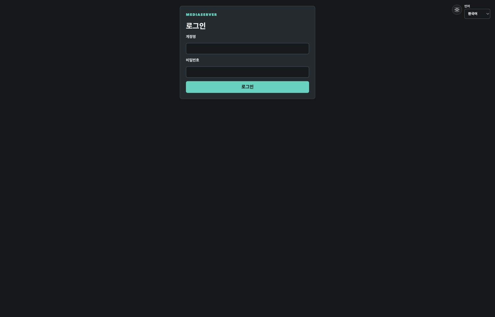
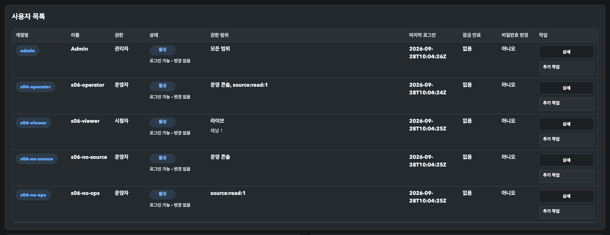
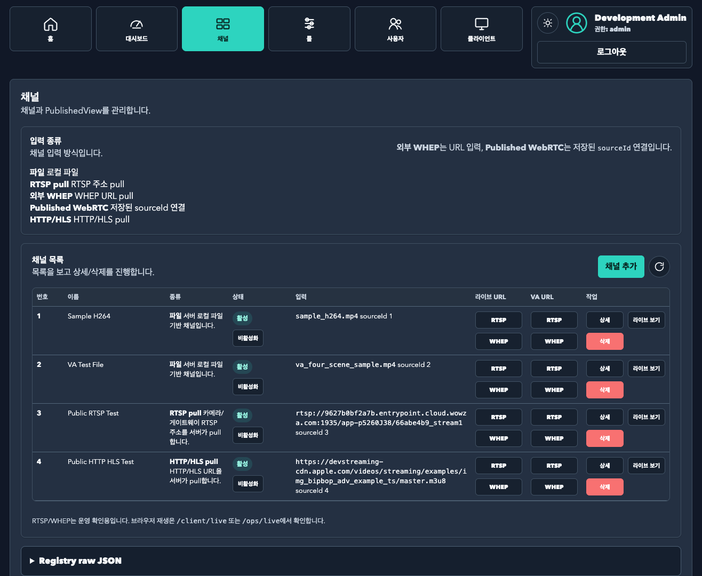
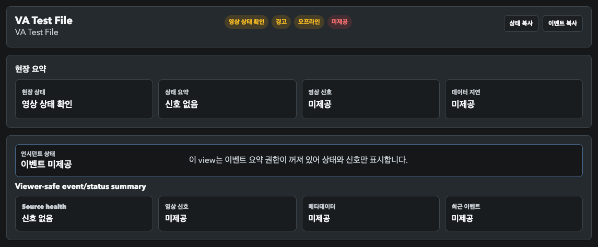
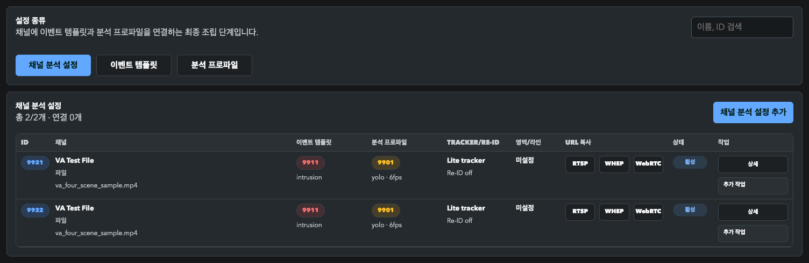
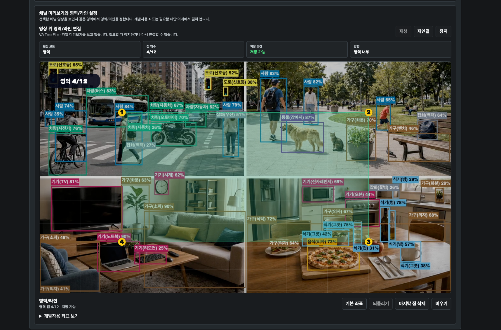
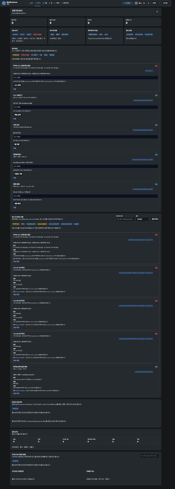

# UI 사용 가이드

운영자는 Ops에서 채널·분석 룰·계정·녹화를 관리하고, 사용자는 Client에서 할당된
채널의 라이브 영상과 상태를 확인합니다. 이 문서는 현재 소스의 화면 사용법이며
배포·공개 완료나 실제 UI 테스트 PASS를 뜻하지 않습니다.

서버 설치·실행은 [개발 가이드](./development-guide.md), 환경변수와 API 계약은
[설정 참조](./config-reference.md), 분석 판단 기준은 [VA 가이드](./video-analysis.md)를
봅니다. 버전·공개 상태는 [릴리즈 정책](./release-policy.md)에서 별도로 확인합니다.

## 목적별 찾기

| 하고 싶은 일 | 안내 |
| --- | --- |
| 처음 접속하고 로그인하기 | [화면과 권한](#1-화면과-권한), [로그인과 계정 접근](#2-로그인과-계정-접근) |
| 사용자를 만들고 채널을 할당하기 | [사용자 관리](#3-사용자-관리) |
| 영상 소스를 등록하고 녹화하기 | [채널 관리](#4-채널-관리), [녹화 설정·조회·재생](#녹화-설정조회재생) |
| 라이브를 보거나 채널 상태 비교하기 | [Client 라이브](#42-client-라이브), [Client 대시보드](#41-client-대시보드) |
| 이벤트 판단 조건을 설정하기 | [룰 목록](#5-룰-관리-목록), [설정 순서](#6-채널-분석-설정-흐름), [프로파일](#7-분석-프로파일) |
| 영역·라인·시나리오를 조정하기 | [기본 이벤트](#8-기본-이벤트), [시나리오](#9-시나리오-이벤트), [캔버스](#10-영역라인-캔버스) |
| 이벤트 전송과 증거를 확인하기 | [이벤트 동작](#11-이벤트-발생-시-동작), [운영 진단·이벤트 검토](#13-운영-진단과-이벤트-검토) |
| 미리보기와 오류 원인을 확인하기 | [미리보기](#12-미리보기와-개발-진단-경계), [오류 처리](#14-자주-발생하는-오류) |
| UI를 수정하거나 문서 이미지를 관리하기 | [유지보수 안내](#유지보수-안내), [스크린샷 자산](#스크린샷-자산) |

## 1. 화면과 권한

아래는 서버 기준 상대 경로입니다. 실제 주소와 포트는 `./server.sh status` 또는
`./server.sh urls` 출력값을 사용합니다.

| 화면 | 경로 | 사용 대상과 목적 |
| --- | --- | --- |
| 진입점 | `/` | 설정 상태와 역할에 따라 이동 |
| 최초 관리자 설정 / 로그인 | `/setup`, `/login` | 최초 비밀번호 설정과 로그인 |
| 운영 홈 / 대시보드 | `/ops/home`, `/ops/dashboard` | admin/operator의 운영 요약과 진단 |
| 채널 / 룰 | `/ops/sources`, `/ops/rules` | source·PublishedView 연결과 분석 설정 |
| 사용자 | `/ops/users` | admin의 계정·접근 요청 관리 |
| 이벤트·녹화 | `/ops/events` | Ops 권한의 직접 진입 경로; 이벤트 검토와 녹화 타임라인 |
| VLM 보조 설정 | `/ops/vlm` | 설치·연결 후보 검토, 프로파일 저장과 상태 확인 |
| Client 라이브 / 대시보드 | `/client/live`, `/client/dashboard` | 할당된 PublishedView의 시청과 상태 요약 |
| 접근 요청 | `/client/request-access` | 관리자 승인을 위한 pending 요청 제출 |

Ops의 주요 메뉴는 홈·대시보드·채널·룰·사용자(admin)·클라이언트입니다.
`/ops/events`와 `/ops/vlm`은 주요 메뉴에 추가하지 않은 보조 경로입니다.
Client의 주요 메뉴는 라이브·대시보드이며 admin/operator의 미리보기와 일반 viewer
이용을 구분합니다. viewer에게 Ops/Lab 메뉴를 보이지 않습니다.

역할만으로 모든 API 접근이 허용되는 것은 아닙니다. Ops는 admin/operator와 `ops:read`,
채널 변경은 `source:write`, 룰 변경은 `rule:write`를 요구합니다.
녹화 조회는 추가로 채널별 `source:read:<channelId>`가 필요합니다.
admin의 전체 권한과 제한된 operator의 권한은 같지 않습니다.

Client에는 원본 source URL·ONVIF endpoint·Developer URL·raw diagnostic JSON·
debug counter·BBox 진단·rule/profile editor·내부 session/token/hash를 노출하지 않습니다.
`integrator`는 Client shell이 아니라 허용된 events/metadata API를 사용합니다.
페이지 접근 거부는 로그인 또는 forbidden 화면으로, API 거부는 `401`/`403`으로 나타납니다.

화면은 light/dark 테마와 공통 버튼·표·상세 패널을 사용합니다.
주요 작업은 저장·조회·보기 시작, 보조 작업은 닫기·복사·재연결로 구분하고
위험한 삭제·중단은 별도 확인과 상태 메시지를 살펴봅니다.


## 2. 로그인과 계정 접근

기본 인증 모드는 `MEDIA_SERVER_AUTH_MODE=auto`입니다. users 파일이 없거나
`admin.passwordHash`가 없으면 `/setup`에서 기본 username `admin`의 비밀번호를
설정합니다. 기본 비밀번호나 passwordless admin login은 없습니다.
설정 후에는 `/login`에서 로그인하며 HttpOnly session cookie를 사용합니다.



기본 비밀번호 정책은 `kr-privacy`이며 최초 설정과 변경에 동일하게 적용합니다.

- 문자 종류 3종 조합은 최소 8자, 2종 조합은 최소 10자입니다.
- username 포함, 반복 문자·연속 숫자·키보드 배열, 흔한 비밀번호를 허용하지 않습니다.
- 비밀번호 history 재사용을 금지합니다.

반복 로그인 실패는 계정 lockout을 일으킵니다. `mustChangePassword=true`이면
`/password/change`로 이동하며 변경 성공 시 기존 session이 폐기되어 다시 로그인해야 합니다.
운영 계정의 비밀번호는 사용자가 관리합니다. 자동 검증의 임시 인증자료와 격리·정리 기준은
[검증 정책](./stream-verification.md#검증-정책)을 따르며 운영 비밀번호를 테스트 값으로
재사용하거나 원문을 로그·명령행·Git에 남기지 않습니다.

| 접속 상태 | `/` 또는 로그인 후 이동 |
| --- | --- |
| 최초 관리자 설정 필요 | `/setup` |
| 미인증 | `/login` |
| admin/operator | `/ops/home` |
| viewer | `/client/live` |
| 명시적 auth off | `MEDIA_SERVER_UI_DEFAULT_HOME`에 따른 Ops 또는 Client |

`MEDIA_SERVER_AUTH_MODE=off`는 명시적인 개발·검증용이며 일반 운영 설정이 아닙니다.
제품 UI의 역할·scope 검증을 auth off 화면 확인으로 대신하지 않습니다.

사용자에게 채널이 없으면 관리자에게 할당을 요청하거나 `/client/request-access`를 사용합니다.
접근 요청은 `pending`으로만 저장되며 자동 가입·승인은 제공하지 않습니다.
관리자가 승인하면 password setup invite가 발급되고, 초대를 수락해 비밀번호 설정이
끝나기 전에는 새 계정·session·view 접근이 생기지 않습니다.
거절은 요청 상태만 바꾸며 계정이나 권한을 만들지 않습니다.

PublishedView별 권한은 `view:read:{viewId}`, `dashboard:read:{viewId}`,
`event:read:{viewId}`, `metadata:read:{viewId}`로 나뉩니다.
공개 요청 API의 길이·숫자 viewId·중복 pending·rate-limit과 Auth 설정의 상세 계약은
[HTTP 인증 설정](./config-reference.md#http-auth)을 따릅니다.

## 3. 사용자 관리



`/ops/users`는 admin 전용 계정 관리 화면입니다.
공통 Ops shell 안에서 사용자 목록 table과 접근 요청 table을 먼저 보여주고,
필요한 계정을 상세 패널로 열어 확인하거나 수정합니다.
상단의 계정 라이프사이클 정책 영역은 초대 기본 만료 24시간,
비밀번호 초기화 후 다음 로그인 변경, disable/restore 절차,
사용자 감사 JSON/CSV/Diff JSON export를 같은 운영 절차로 묶어 보여줍니다.
`passwordHash`, `passwordHistory`, `tokenHash`, invite `tokenHash`는
UI/API 응답에 노출하지 않습니다.

지원 동작:

- 계정 생성:
  admin이 username, displayName, role, viewId 또는 직접 scopes와
  초기 비밀번호를 입력해 사용자를 생성합니다.
  권한 템플릿 버튼으로 role/viewId 기준 scope를 적용할 수 있습니다.
  새 계정은 기본 활성화 상태이며 `mustChangePassword`를 켤 수 있습니다.
- 계정 수정: displayName, role, scopes, enabled, mustChangePassword를 변경합니다.
- 비밀번호 초기화: 상세 패널의 비밀번호 초기화 영역에서 임시 비밀번호를 설정합니다.
  성공 시 기존 세션은 회수되고 `mustChangePassword=true`로 저장되어 다음 로그인에서
  비밀번호 변경이 필요합니다. 원문 비밀번호는 감사 로그에 남기지 않습니다.
- enable/disable: hard delete 대신 disable을 사용합니다. 비활성화는 확인 dialog를 거치며
  기존 세션을 회수합니다. restore는 로그인 실패 횟수와 lockout 상태를 초기화합니다.
  마지막 활성 admin 계정은 비활성화하거나 다른 role로 변경할 수 없습니다.
- viewer UX:
  `role=viewer` 또는 `integrator` 선택 시 view/scope assignment 영역을 보여줍니다.
  `채널 범위 적용`은 PublishedView별 scope 묶음을 생성합니다.
  PublishedView가 아직 연결되지 않은 환경에서는 `viewId` 또는
  `view:read:{viewId}` 같은 문자열 scope를 직접 입력할 수 있습니다.
  viewer에는 debug/lab/ops/source/rule 관리 scope를 부여하지 않습니다.
- invite:
  admin API/CLI가 setup invite token을 발급하면 원문 token은
  생성 응답에서 한 번만 표시됩니다.
  저장소에는 `tokenHash`, 만료 시각, 사용 여부,
  수락 시 적용할 role/scope snapshot만 남습니다.
  초대 링크는 기본 24시간 동안만 유효하며, 만료 후에는 새 초대를 발급합니다.
  기존 enabled user invite는 수락 전 현재 role/scope/session을 바꾸지 않습니다.
  `/invite/setup`에서 비밀번호 설정이 끝나면 token hash와 이전 session을 폐기합니다.
- request:
  `/client/request-access` 또는 `POST /client/api/access-requests` 요청은
  `pending`으로 저장됩니다.
  `/ops/users` 접근 요청 table에서 admin이 승인하면 password setup invite를 발급합니다.
  token/setup URL은 승인 응답에서 한 번만 표시합니다.
  user row는 invite 수락 시점에 만들거나 갱신합니다.
  거절은 request 상태만 `rejected`로 바꾸며 user/session/view scope를 만들지 않습니다.
- audit:
  `/ops/sources`, `/ops/rules`, `/ops/users` 변경은 서버 감사 로그
  `/ops/api/audit`, `.media_server.ops_audit.jsonl`에 영속 저장합니다.
  하단 변경 이력 패널에도 표시합니다.
  `/ops/sources#auditPreset=source-health-state-change`처럼 hash filter를
  붙이면 채널 변경 이력의 source health 상태 변경 preset으로 바로 열립니다.
  작업자 정보는 `/auth/whoami`/서버 principal 기준입니다.
  비밀번호/token/hash/credential reference/capability 필드는 저장 전과
  조회/export 응답에서 전/후 값을 다시 마스킹합니다.
  서버 저장에 실패하면 브라우저 캐시 기록으로 후퇴합니다.
  변경 이력 패널은 검색, 작업자/사용자/대상/action/기간 필터,
  offset 기반 이전/다음 페이지, JSON/CSV export, Diff JSON export,
  전/후 diff 상세 모달을 공통으로 제공합니다.
  룰 감사 항목은 Tracker/Re-ID
  전/후 설정과 model/fallback status-only 값을 review chip으로 표시합니다.
  model/source material, source URL/URI/file, model path/checksum/provenance,
  raw media/crop/embedding은 서버 조회와 JSON/CSV/Diff JSON export, 브라우저
  fallback cache에서 `[redacted]`로 유지합니다.
  이 경계는 `verify-ops-audit-trail`, `verify-ops-audit-persistence`,
  `verify-reid-advanced-tracking`으로 확인합니다.
  auth/session/password/token/hash/secret/credential/capability 자료도 마스킹 대상입니다.
  채널/사용자 변경 이력 필터는 작은 화면에서 table/action 영역을
  침범하지 않는 별도 responsive contract입니다. 320/390px 기준으로
  시작/종료 input은 `min-width: 0` 흐름 안에서 한 줄 또는 다음 줄로
  내려가야 하며, 필터 grid가 viewport보다 넓은 고정폭을 만들면
  regression으로 봅니다.
  서버는 `MEDIA_SERVER_OPS_AUDIT_RETENTION_DAYS` 기준으로 오래된
  `.media_server.ops_audit.jsonl` 항목을 조회/저장 시 정리합니다.
  응답에는 case-insensitive search index metadata, `receivedAtMs` date range field,
  interactive limit cap, `exportLimitMax`가 포함됩니다.

Role별 scope template:

- `admin`: `*`
- `operator`: `ops:read`, `rule:write`, `source:write`, `dashboard:read:*`, `event:read:*`
- `viewer`: `view:read:{viewId}`, `dashboard:read:{viewId}`,
  `event:read:{viewId}`, `metadata:read:{viewId}`.
  viewId가 비어 있으면 실제 view 권한을 주지 않는
  `__unassigned__` placeholder scope를 사용합니다.
- `integrator`: `metadata:read:{viewId}`, `event:read:{viewId}`. UI shell은 열지 않고 scoped API만 사용합니다.

CLI도 같은 C++ password hash/password policy 경로를 사용합니다.
Password는 기본적으로 prompt로 입력하고, 자동 smoke에서는 `--password-stdin`을 사용할 수 있습니다.

```bash
./server.sh auth-user list
./server.sh auth-user add --username client-a --role viewer --view-id 1
./server.sh auth-user reset-password --username client-a
./server.sh auth-user disable --username client-a
```

## 4. 채널 관리



`/ops/sources`는 운영자가 실제 source를 등록하고,
클라이언트에는 PublishedView 단위로 공개하기 위한 운영 화면입니다.
제품 UI에서는 SourceRegistry/PublishedView를 따로 노출하지 않고
`채널` 개념으로 묶어 보여줍니다.

화면 구성:

- 숫자 ID 기반 채널 목록:
  저장 상태와 PublishedView 연결 상태를 함께 표시합니다.
- 채널 추가/상세 패널:
  입력 형식은 추가 또는 수정 화면 안에서만 선택합니다.

채널 액션:

- 목록 상단: `채널 추가`
- 행 액션: `상세`, `라이브 보기`, `삭제`
- 상세 패널 읽기 상태: `수정`, `닫기`
- 상세 패널 편집 상태: `저장`, `닫기`

먼저 채널을 추가하고, 상세에서 저장 상태와 공개 view 연결·허용 보기 모드를 확인합니다.
사용자 시청 권한은 사용자 화면의 채널 할당과 함께 확인합니다.

기본 registry가 비어 있으면 `sample_h264.mp4`,
VA test file, 공개 RTSP/HLS 예시 URL을 숫자 채널로 seed합니다.
예시 등록은 현재 연결 성공을 보장하지 않으므로 사용할 source의 접근 상태를 확인합니다.
기존 registry 파일에 malformed record나 깨진 PublishedView source 참조가 있으면
운영 화면/API는 조용히 누락하거나 seed로 덮지 않고 오류를 반환합니다.

추가/수정 화면의 입력 종류 차이:

- `kind=whep`, `whepUrl`:
  외부 WHEP playback endpoint를 서버 pull source로 등록
- `kind=webrtc`, `webrtcSourceId`:
  외부 URL이 아니라 `/whip/publish`로 먼저 등록된 sourceId를 연결
- `ONVIF 카메라`:
  ONVIF 프로파일에서 선택한 라이브 URI를 연결하며 별도 import 패널로 분리하지 않음

채널 테이블은 라이브 URL과 VA URL을 분리해 표시하고,
각 영역에서 RTSP/WHEP 복사 버튼을 제공합니다.
ONVIF 채널에는 `ONVIF RTSP`, `ONVIF WHEP` 버튼을 표시합니다.
브라우저 재생은 `/client/live`에서 확인합니다.
원본·ONVIF 접속 주소를 사용자에게 전달하는 대신 PublishedView와 계정 scope를 설정합니다.
채널의 활성 상태, Live URL 연결, 분석 룰 연결, 녹화 상태는 별개로 확인합니다.

Live Source Reliability Workspace 사용 흐름은
[Operator Runbook and Reliability Handoff](./live-source-health.md#operator-runbook-and-reliability-handoff)를 따릅니다.
UI guide는 화면 위치와 조작 순서만 설명하고 runbook source-of-truth는 live-source-health.md에 둡니다.

운영자용 registry 원문은 제품 화면에 노출하지 않고 `/ops/api/sources`, `/ops/api/views` 같은 API 응답과 검증 명령에서 확인합니다.

<a id="녹화-조회와-재생-v410-s06"></a>
<a id="녹화-설정조회재생"></a>

### 녹화 설정·조회·재생

녹화는 라이브 시청과 별개입니다. viewer용 Client에는 녹화 재생 화면이 없으며,
Ops 접근 권한과 해당 채널의 `source:read:<channelId>` scope로 조회합니다.
사용자 화면의 기본 operator 템플릿에는 이 scope가 포함되지 않으므로
관리자가 필요한 채널 범위를 추가해야 합니다.

1. 서버 운영자가 [전역 녹화 설정](./config-reference.md#recording-env)의 저장 root와
   용량·보존 정책을 정하고 `MEDIA_SERVER_RECORDING_ENABLED=1`로 실행합니다.
   녹화 off라도 시작 복구는 수행되므로 운영 저장소를 시험 실행에 재사용하지 않습니다.
2. `/ops/sources`에서 사용할 채널을 활성화하고 추가/수정 화면의 `상시녹화 사용`을 켭니다.
   녹화 용량(byte), 보존 일수, 저장 하위경로를 확인한 뒤 저장합니다.
   이 폼은 상시녹화 한도를 편집하며 이미 설정된 이벤트 한도는 보존합니다.
   이벤트 한도의 별도 설정은 [녹화 정책](./config-reference.md#recording-env)을 따릅니다.
3. `/ops/events`의 `녹화 타임라인`에서 전역 활성 여부, catalog 복구·저하 상태,
   채널별 녹화 중/중 아님, 저장 공간 차단, 상시·이벤트 사용량과 한도를 확인합니다.
   설정을 켰다는 사실만으로 파일 저장 성공을 판정하지 않습니다.
4. 허용 채널과 시작·종료 시간을 선택하고 `조회`를 누릅니다.
   초기 입력은 최근 1시간이며 브라우저 현지 시간을 UTC epoch 밀리초로 바꾸어 요청합니다.
   종료는 시작보다 뒤여야 합니다. `새로고침`은 상태와 목록을 다시 조회합니다.
5. 시간 확인 목록에서 구간을 선택하고 영상의 재생·일시정지·탐색 컨트롤을 사용합니다.
   시간 귀속 미확인 목록은 채널 전체의 미확인 자료로, 조회 범위 안에 있다는 뜻이 아닙니다.
   미확인 항목은 사용자가 직접 선택해야 합니다.
6. `이전`/`다음`은 100개 단위 offset을 바꾸어 시간 확인·미확인 목록을 함께 조회합니다.
   각 목록의 개수는 별도입니다. 같은 파일의 여러 표시 구간도 서로 다른 항목입니다.

이벤트 우선 표시는 같은 원본의 입증된 중첩에만 적용합니다.
완전히 충족된 상시녹화 원본은 기본 목록에서 숨기고
`이벤트와 겹치는 상시녹화 원본 보기`를 켜면 표시합니다.
부분 중첩 원본은 남기며, 다른 페이지의 이벤트와 중첩되어도 같은 기준을 적용합니다.

| 표시 | 해석 |
| --- | --- |
| 작업 완료 / 일부 구간 | 작업 종료와 요청 구간 전체 확보는 별개입니다. |
| 등록됨 / 파일 제공 가능 | catalog 등록, 실제 파일 제공, 브라우저 디코딩 성공은 별개입니다. |
| 시간 미확인 | `null` 시각을 날짜로 바꾸지 않습니다. 유효 UTC `0`은 1970년 날짜입니다. |
| 추정 시각 / 불확실성 | 확정된 촬영 시각이라고 해석하지 않습니다. |
| 빈 결과 / 조회 오류 | 자료 없음과 권한·서버 오류를 구분합니다. |
| 파일 제공 불가 | 삭제·미완성·손상·누락 등으로 재생할 수 없는 상태입니다. |

영상은 파일 시작부터 재생합니다. 표시 구간과 원본 미디어 중첩 ns는 파일 내 탐색 위치를
보장하지 않으며 UTC 차이를 이용한 자동 탐색이나 다음 파일 자동 재생은 하지 않습니다.
원본 미디어 시각 요청을 날짜처럼 표시하지 않습니다. 브라우저의 codec/container 지원이
필요하며 형식 지원 감지나 메타데이터 로드는 실제 디코딩 성공이 아닙니다.

### 영상 유사도 검색 (v4.3.0 개발)

`/ops/events`의 **영상 유사도 검색**에서 허용된 카메라와 한국어·영어 장면 설명을 입력합니다.
`장면 검색`을 누르면 녹화 대표 프레임과 원본 연결을 확인한 이벤트 스냅샷을 유사도 순서로 표시합니다.
결과 수와 최소 유사도를 조절할 수 있고, 시간 범위를 사용하려면 시작·종료를 모두 입력합니다.
시간을 지정하면 시각 미확인 프레임은 제외됩니다. 점수는 사건 발생이나 확실한 일치의 증거가
아니므로 결과의 실제 영상을 확인해야 합니다.

색인 상태에는 추출/재확인 주기와 허용 카메라별 색인 frame·최근 스캔·미지원 파일/스냅샷 수가 보입니다.
비활성·준비 중·준비 실패는 검색 결과0건과 다릅니다. `색인 상태 새로고침`으로 다시 확인합니다.
추출 간격 사이의 장면, 지원하지 않는 파일과 원본 연결 증거가 없는 기존 이벤트 스냅샷은
검색되지 않을 수 있습니다. 이 기능은 Ops 전용이며 Client navigation에는 추가하지 않습니다.

결과를 선택하면 현재 원본과 정확한 파일 재생 위치를 다시 확인합니다. 삭제·손상·권한 변경으로
재생할 수 없으면 다시 검색하라는 안내를 표시합니다. 조건 또는 선택을 바꾸면 이전 응답과
미디어 이벤트는 무효화됩니다. 실제 영상 데이터와 탐색 완료를 확인한 뒤 이동 성공을 표시합니다.
기존 구조화 검색과 별도로 사용하며 검색 점수를 기존 이벤트/행동 판정으로 바꾸지 않습니다.

### 녹화 구조화 검색 (v4.2.0)

같은 `/ops/events`의 `녹화 구조화 검색`에서 카메라 1~32개와 최대 31일의 시간 범위를
선택합니다. 객체·Track·이벤트·영역·규칙·행동 조건을 추가하고 `검색`을 누릅니다.
같은 조건의 쉼표 목록은 OR, 서로 다른 조건은 AND입니다. 행동은 저장된
`event:Intrusion`, `event:LineCrossing`, `scenario:loitering` 등의 정확한 이름을 사용합니다.
분석이 없는 녹화에 객체나 행동을 추정해서 채우지 않습니다.

메타데이터 조건이 없으면 녹화 구간, 있으면 개별 분석 관측을 표시합니다.
`시간 미확인 자료 포함`은 조회 시간에 속하는지 알 수 없는 자료를 별도 건수로 포함합니다.
`다음 페이지`는 같은 검색 snapshot을 이어갑니다. 조건을 바꾸면 이전 결과와 영상 선택이
해제되며 다시 검색해야 합니다. snapshot은 5분 또는 서버 용량에 따른 축출 시 만료됩니다.

행동 근거 부족 안내는 일치 결과가 없다는 뜻이 아닙니다. 필요한 EventRecord를 확인하지
못해 결과를 판정하지 못한 상태이며 잠시 후 다시 검색할 수 있습니다.

결과를 선택하면 현재 파일을 다시 확인하고 입증된 검색 위치로 이동합니다.
`탐색 중`은 위치 이동 요청 상태이며, 현재 선택의 실제 탐색과 데이터 준비를 확인한 뒤
완료를 표시합니다. 다른 결과나 검색 조건을 선택하면 이전 탐색은 무효화됩니다.
같은 원본 범위를 포함하는 건강한 이벤트 영상이 우선이며 없으면 원본을 사용합니다.
위치를 입증하지 못하면 파일 시작 재생 안내를 표시합니다. 삭제·손상·권한 변경으로
재생할 수 없으면 다시 검색하세요. 브라우저 형식 지원은 별도로 필요합니다.
기존 녹화 타임라인의 원본 보기와 파일 시작 재생은 그대로 사용할 수 있습니다.

상시녹화는 H.264/MP4와 VP8/WebM 영상, 현재 이벤트 파생 영상은 H.264 원본의
video-only fMP4 경로입니다. 이벤트 연결은 별도 설정과 같은 입력의 시간·원본 증거가
필요합니다. 자연어·벡터로 녹화 영상을 찾아 재생하는 기능이나 완성형 VMS/NVR을
뜻하지 않습니다. 기존 Snapshot/Clip frame bundle과도 구분합니다.

정확한 입력·권한·Range와 파일 보호는
[녹화 API](./config-reference.md#녹화-조회재생-api-v410-s06),
원본 대기·부분 결과는 [이벤트 녹화](./config-reference.md#이벤트-녹화-연결),
보존·복구 한계는 [백업 안내](./ops-backup-recovery.md#관리-녹화-자료의-보존과-복구-한계)를 따릅니다.
후속 검색 방향은 [녹화·검색 로드맵](./v410-v49-recording-search-roadmap.md)과 구분합니다.

### 4.1 Client 대시보드

`/client/dashboard`는 viewer가 접근 가능한 PublishedView의 상태 요약만
보여주는 client dashboard입니다.
view 목록은 `/client/api/views`의 scoped 결과를 사용하고,
선택된 view의 상세 상태와 접근 가능한 view들의 비교 요약은
`/client/api/views/{viewId}/dashboard`에서 가져옵니다. 화면은 현장 상태,
영상 신호, 데이터 지연, 이벤트 확인 필요 여부를 viewer 문구로 표시합니다.



채널 비교는 전체/확인 필요/이벤트 있음/라이브 필터와
경고 우선/이벤트 많은 순/이름순 정렬을 제공하며,
각 카드에 source tag, owner group, 채널명, 최근 event type에서 추론한
현장 preset 문구와 우선순위 점수를 함께 표시합니다.
프리셋 설정은 이 브라우저의 채널 비교 표시를 위한 장소·이벤트·태그 매칭과
우선순위 weight를 조정합니다. 설정 JSON은 서버의 raw 진단 응답이나 룰 편집기가 아니며,
`mediaServerClientDashboardPresetConfig.v1` localStorage에 저장되어 기본 preset보다
먼저 적용됩니다. 이 설정으로 서버의 분석 판단이나 계정 권한이 바뀌지는 않습니다.
`/client/events`는 primary nav에서 제거했고,
이벤트 요약은 dashboard 안에서 sanitized summary로만 표시합니다.
`상태 복사`와 `이벤트 복사`는 viewer에게 허용된 상태/이벤트 요약만
clipboard에 복사하며 source locator, Developer URL, raw diagnostic JSON,
internal session id는 포함하지 않습니다.
Integrator 연동은
`/client/api/views/{viewId}/events?limit=...`,
`/client/api/views/{viewId}/metadata`를 사용하며
각각 `event:read:{viewId}`, `metadata:read:{viewId}`가 필요합니다.

표시 범위:

- view health: view name, live/offline, connection status, video frame status, metadata status, stale 여부
- analysis summary: track count, active event count, scenario count, latest event time
- event summary: 최근 event, event type별 count, warning badge
- connection: WebRTC connected/disconnected, stale metadata age, last frame age

값이 없거나 아직 수집되지 않은 항목은 UI에서 `미제공`으로 표시합니다.
Client dashboard,
`/client/api/views/{viewId}/events?limit=...`,
`/client/api/views/{viewId}/metadata`는
source 원본 URL, Developer URL, 내부 진단 응답,
`analysisTapId`, internal session id, rule/profile editor,
Event POST 설정, SSE/WS 전체 endpoint를 노출하지 않습니다.
운영자용 세부 runtime/debug 확인은
`/ops/dashboard` 요약과 `/lab/runtime/status` API에서 수행합니다.

### 4.2 Client 라이브


`/client/live`는 viewer가 접근 가능한 PublishedView만
source tree와 live workspace tile에 배치합니다.
Tile은 viewer 기본 최대 4개, Ops preview 최대 9개이며,
표준/고밀도 density와 live/connecting/stale/offline summary,
타일별 시작/정지/재연결, source 재배정, 정보 overlay, dock 좌/우 전환,
workspace 작업 메뉴 안의 layout 저장/복원과 전체 연결 해제를 제공합니다.
PublishedView가 없으면 viewer에게 `/client/request-access` 접근 요청 CTA를,
admin preview에게 `/ops/sources` 채널 관리 CTA를 보여줍니다.

각 PublishedView의 `maxTiles`는
UI의 채널 배정/시작 버튼과
`/client/api/views/{viewId}/webrtc/session` wrapper에서
같은 principal+view의 동시 client session 상한으로 강제합니다.
Browser PeerConnection은 `/webrtc/config`의 `peerConnectionConfig`를 사용합니다.
생성 응답은 client session alias만 반환하고,
answer/ICE/delete는
`/client/api/views/{viewId}/webrtc/session/{clientSessionId}` 아래에서만 이어집니다.

Client route는 viewId만 받습니다.
source 원본 URL, file/url/source override,
내부 generic session id/token, Developer URL, BBox diagnostics,
내부 진단 응답, rule/profile 수정 UI는 노출하지 않습니다.
`va-rule` mode는 PublishedView의 `allowedRuleIds`와
rule source 일치 검증을 모두 통과해야 합니다.
검증은 새 client session 생성 시점에 수행하며, 이미 생성된 client session은
이후 `allowedRuleIds`가 변경되어도 자신의 session alias로 ICE/DELETE를
마칠 수 있습니다. 같은 rule을 새로 적용하는 요청은 변경된 `allowedRuleIds`를
다시 검사합니다.
viewer/client 계정은 직접 `/webrtc/session`, `/whep`, `/whip/publish`
생성 route를 호출할 수 없습니다.

Tile별 기능:

- assigned view 선택
- PublishedView의 `allowedOverlayModes` 안에서 `raw`, `va-overlay`, `va-rule` 선택
- source tree 선택 또는 drag/drop으로 tile에 PublishedView 배정
- tile start / tile stop / tile restart / workspace-level all stop
- workspace 작업 메뉴의 layout 저장 / 저장 복원 / 권한 기본 preset 적용
- PublishedView `maxTiles` 초과 시 tile 선택/시작을 막고 wrapper API는 `409`를 반환
- live/offline, stale, track count, event count, connection status 표시
- 선택 tile의 sanitized 상태/이벤트 요약 복사
- 선택된 tile만 dashboard/detail을 갱신
- tile keyboard selection: Enter/Space로 현재 tile 선택, Arrow/Home/End로 tile 간 이동
- 반복되는 select/button accessible name에는 tile 번호 포함
- tile 숨김 상태 요약은 현재 UI 언어로 바로 갱신하며, track/event 미수집 값은 `미제공`으로 읽음
- 560px 이하 모바일 폭에서는 tile control이 한 열로 정리되고 start/reconnect/stop touch target은 44px 이상 유지
- 320px 모바일 폭에서도 workspace 작업 메뉴의 layout 저장/복원/전체 연결 해제 항목은 viewport 안에 열려야 함

Hidden tab, route leave, tile stop 시
PeerConnection, DataChannel, server WebRTC session을 정리합니다.
모든 tile에 BBox diagnostics를 켜는 동작은 제공하지 않습니다.

## 5. 룰 관리 목록



이 장부터는 `/ops/rules` 기준 설명입니다.

룰 관리는 세 가지 목록을 같은 운영 화면에서 관리합니다.

- 채널 분석 설정: 실제 채널에 적용되는 `vaRule`
- 이벤트 템플릿: 채널 분석 설정을 만들기 위한 선수 항목
- 분석 프로파일: 채널 분석 설정을 만들기 위한 선수 항목

`vaRule`은 숫자 ID이며, 사용자가 직접 ID를 입력하지 않습니다.

목록에서 확인하는 정보:

- 채널 분석 설정 수
- 이벤트 템플릿 수
- 분석 프로파일 수
- 다음 자동 번호
- 각 항목의 ID, 적용 채널/종류/프로파일, 영역/라인, 출력 URL, 상태

주요 동작:

- 이벤트 템플릿 추가: 기본 이벤트 또는 시나리오 종류와 판단 조건을 저장합니다.
- 분석 프로파일 추가: detector, fps, queue, 입력 해상도 같은 분석 실행 값을 저장합니다.
- 채널 분석 설정 추가: 채널, 이벤트 템플릿, 분석 프로파일을 고르고 영역/라인을 지정합니다.
- 상세/수정/삭제: 각 행의 작업 버튼에서만 제공합니다.
- 적용 상태: 채널 분석 설정에만 존재하며 이벤트 템플릿과 분석 프로파일에는 활성/비활성이 없습니다.

목록은 다중 선택 기반 toolbar를 사용하지 않습니다.
보기/수정/삭제는 각 행의 작업 버튼에만 노출합니다.
필터 결과 수는 요약 배지로 작게 표시합니다.

사용자가 rule number를 직접 입력하지 않습니다. 서버/UI가 빈 숫자 ID를 자동 배정하고, URL에서는 `vaRule=<숫자>`만 사용합니다.

## 6. 채널 분석 설정 흐름



채널 분석 설정 추가 또는 수정 시 같은 페이지 안의 편집 panel을 사용합니다.
저장 완료 후에는 상세 상태로 돌아가는 흐름을 기본으로 합니다.

편집 화면은 5개 섹션입니다.

| 섹션 | 설명 |
| --- | --- |
| 기본 정보 | 이름, 적용 상태 |
| 채널/템플릿/Profile | 채널, 이벤트 템플릿, 분석 프로파일 선택 |
| 채널 미리보기와 영역/라인 | 선택 채널 영상 위에 polygon/line 지정 |
| 출력 | 테이블에서 RTSP/WHEP 라이브와 VA URL 복사 |
| 저장 전 검토 | 현재 설정 요약과 validation 결과 |

편집 화면 상단의 룰 이름, 저장 상태, 저장/목록 버튼,
섹션 이동 영역은 스크롤 중에도 따라다닙니다.
일반 폭에서는 섹션 이동을 버튼 탭으로 표시합니다.
버튼 텍스트를 읽기 어려운 매우 좁은 폭에서는 드롭다운으로 전환합니다.

저장하지 않은 변경사항이 있더라도 탭 이동은 막지 않습니다.
채널/사용자 탭과 동일하게 편집 panel은 닫기 동작으로 정리됩니다.
저장/삭제 성공 또는 실패는 feedback으로 표시됩니다.

저장 전 검증은 다음 항목을 차단합니다.

- 중복 ID
- 누락/비활성 이벤트 템플릿/Profile
- source mismatch
- 비활성 채널/PublishedView 연결
- Client 노출 권한이 없는 PublishedView
- `va-rule` 모드가 허용되지 않은 PublishedView
- 허용 룰 목록에 없는 기존 연결
- 같은 채널/priority의 룰 충돌
- 이벤트 템플릿과 룰/Profile 대상 클래스 충돌

PublishedView가 raw/overlay 전용이면 채널 탭에서
보기 방식과 허용 룰 목록을 먼저 정리한 뒤 룰을 저장합니다.

Rule validation matrix는 duplicate id, missing reference, inactive profile/template, priority conflict,
unauthorized view, VA class mismatch, source mismatch를 fixture 기준으로 고정합니다.
UI 저장 전 차단과 서버 저장 API 차단 메시지가 따로 흔들리지 않도록
`verify-ops-rule-validation-matrix`에서 검증합니다.

저장 전 Rule/Scenario 검토 영역은 draft의 예상 event type, 충돌, 누락 참조,
시나리오 preset 영향과 `/ops/events` EventRecord 연결을 요약합니다.
미리보기는 선택 PublishedView의 `va-overlay`를 우선 사용하며 재생·재연결·정지로
확인합니다. 개발 editor를 iframe으로 붙이지 않고 제품 화면 안에서 편집합니다.

## 7. 분석 프로파일

룰 편집 화면의 profile 흐름:

- 먼저 profile 선택과 요약을 보여줍니다.
- 새 profile이 필요할 때만 `새 Profile 설정`을 시작합니다.
- 세부 설정은 `고급 Profile 설정` 접힘 영역에서 다룹니다.
- 룰 작성 흐름에서는 `Profile 저장`과 `닫기`만 노출합니다.
- 기존 profile 삭제 같은 관리 동작은 기본 작성 흐름에 노출하지 않습니다.

Profile 항목:

- Detector: `YOLO/ONNX` 또는 `개발용 더미(검증용)`
- FPS: 분석 sampling FPS
- Queue: detector 앞 queue 크기
- Confidence: detection confidence threshold
- NMS: non-maximum suppression threshold
- Input size: model input width/height
- Tracking category: track ID와 event 판단에 사용할 category

`YOLO/ONNX`는 실제 객체 검출입니다.
`개발용 더미`는 모델 없이 pipeline과 UI를 확인하기 위한 검증용 옵션입니다.
운영 설정에는 보통 사용하지 않습니다.

Tracking category가 비어 있으면 profile 저장을 막습니다. 전체 추적이 필요하면 UI의 전체 선택 또는 API의 `*` 토큰을 사용합니다.

## 8. 기본 이벤트

기본 이벤트는 기존 rule event engine을 사용하며, 외부 event JSON/API/POST 형식을 유지합니다.

지원 이벤트:

| 이벤트 | 의미 |
| --- | --- |
| `presence` | 영역 안에 대상 객체가 감지됨 |
| `enter` | 대상 객체가 영역 밖에서 안으로 진입 |
| `exit` | 대상 객체가 영역 안에서 밖으로 이탈 |
| `line-crossing` | 대상 객체가 line을 통과 |

`line-crossing`은 방향을 선택할 수 있습니다.

- `any`: 양방향
- `forward`: 시작점→끝점으로 정의한 선의 음수 측에서 양수 측으로 통과
- `reverse`: 양수 측에서 음수 측으로 통과

선을 따라 시작점에서 끝점으로 이동한다는 뜻이 아닙니다. 캔버스에서 선을 가로지르는
방향 화살표를 확인하고 현장 객체의 실제 이동으로 검토합니다.

라인 모드에서는 영역/라인 캔버스의 선 중앙에
현재 설정 방향을 나타내는 작은 화살표를 표시합니다.
`any`는 양방향, `forward`/`reverse`는 선택한 한 방향만 표시합니다.
현장 preset은 line-crossing 기본 이벤트에서도 선택할 수 있지만,
scenario label을 새로 저장하지 않고 최소 신뢰도 시작값만 채웁니다.
방향과 2점 line geometry는 현장 영상에서 확인해야 합니다.

## 9. 시나리오 이벤트

Scenario는 여러 frame에 걸친 시간 조건과 상태 전이를 판단하는 이벤트입니다.
기존 기본 이벤트를 끄거나 바꾸지 않고 별도 scenario event로 동작합니다.

현재 엔진과 룰 편집 UI가 제공하는 시나리오 템플릿입니다.
현장 튜닝이나 이번 실행의 검증 PASS를 뜻하지는 않습니다.

| 템플릿 | 설정 항목 | event |
| --- | --- | --- |
| Intrusion Dwell · 제한구역 체류 | zone, 후보 시간, 체류 시간, cooldown | scenario event |
| ReEntry · 이탈 후 재진입 | polygon zone, 재진입 window, 재진입 zone, cooldown | `re-entry` |
| WrongDirection · 금지 방향 통과 | line 2점 geometry, 허용 방향, cooldown | `wrong-direction` |
| IntrusionAfterLineCrossing · line 후 zone 침입 | trigger line, crossing direction, target zone, zone entry timeout, dwell, cooldown | `intrusion-after-line-crossing` |
| Loitering · 배회 감지 | target zone, 현장 프리셋, minimum dwell, movement radius, trajectory points, cooldown | `loitering` |
| Zone Occupancy · 구역 점유 수 | target zone, occupancy threshold, minimum dwell, cooldown | `zone-occupancy` |

ReEntry UI 정책:

- 같은 track이 polygon zone을 이탈한 뒤 `reEntryWindowMs` 안에 같은 zone으로 다시 들어오면 `re-entry` scenario event를 1회 발생시킵니다.
- `같은 zone`은 현재 그린 polygon 또는 `targetZoneIds`로 저장된 zone을 그대로 사용합니다.
- `지정 zone`은 `targetZoneIds`를 source zone, `reEntryZoneIds`를 destination zone으로 명시합니다.
  `configured-zones` 기준은 A→B 재진입 후보를 만들되 event type은 기존 `re-entry`를 그대로 사용합니다.
- Event POST payload schema, WebRTC/SSE/WS metadata schema는 변경하지 않습니다.

WrongDirection UI 정책:

- 허용 방향은 `forward` 또는 `reverse`를 사용합니다.
- `any`는 위반 방향을 정의할 수 없으므로 WrongDirection 템플릿에서 사용하지 않습니다.
- 기존 `line-crossing` 기본 이벤트는 유지합니다.
- WrongDirection은 별도 `wrong-direction` scenario event로 발생합니다.
- Event POST payload schema, WebRTC/SSE/WS metadata schema, ScenarioEngine 판단 로직은 변경하지 않습니다.

IntrusionAfterLineCrossing UI 정책:

- 기존 `line-crossing` 기본 이벤트와 별도 `intrusion-after-line-crossing` scenario event로 발생합니다.
- target zone은 영역/라인 캔버스의 polygon으로 저장하고, trigger line은 전용 설정 영역의 line id/direction/정규화 좌표로 저장합니다.
- `any`, `forward`, `reverse` crossing direction을 모두 사용할 수 있습니다. `any`는 WrongDirection과 달리 정상 trigger 방향입니다.
- UI의 `zoneEntryTimeout(ms)`는 저장 payload의 `maxDelayAfterCrossingMs`로 runtime에 전달합니다.
- Event POST payload schema, WebRTC/SSE/WS metadata schema, ScenarioEngine 판단 로직은 변경하지 않습니다.

Loitering UI 정책:

- target zone은 영역/라인 캔버스의 polygon으로 저장하고, zone 이름은 `targetZoneIds`에 저장합니다.
- `최소 체류 시간(ms)`은 저장 payload의 `minDwellTimeMs`로 runtime에 전달합니다.
- `최대 이동 반경`과 `최소 trajectory point`는 각각 `maxMovementRadius`, `minTrajectoryPoints`로 저장합니다.
- optional ground-plane 이동 반경 사용 여부는 `useGroundPlaneMovementRadius`로 저장합니다.
- 현장 시작 threshold는
  [Analysis Threshold Baselines](analysis-threshold-baselines.md)의
  retail/lobby/platform/doorway/parking 기준값에서 고릅니다.
  preset은 dwell/radius/trajectory뿐 아니라 cooldown 시작값도 함께 채웁니다.
- warning copy는 preset을 확정값이 아니라 field sample replay 기준 시작값으로
  표시하고, TrackHealth가 불안정하면 dwell부터 늘리도록 안내합니다.
- Event POST payload schema, WebRTC/SSE/WS metadata schema, ScenarioEngine 판단 로직은 변경하지 않습니다.

Intrusion Dwell UI 항목:

- 후보 판단 시간(ms)
- 체류 확정 시간(ms)
- 재알림 대기 시간(ms)
- 제한구역 이름
- 대상 객체
- 불안정 track 제외
- 상태 흐름 미리보기

ReEntry UI 항목:

- 재진입 window(ms)
- 재알림 대기 시간(ms)
- 재진입 zone: 같은 zone 또는 지정 zone
- 대상 객체
- 불안정 track 제외
- Inside → Exited → ReEntryCandidate → Confirmed → Cooldown → Ended 상태 흐름 미리보기

IntrusionAfterLineCrossing UI 항목:

- trigger line 이름과 x1/y1 → x2/y2 좌표
- crossing direction: any, forward, reverse
- target zone polygon과 zone 이름
- zoneEntryTimeout(ms) / dwell 또는 observe time(ms)
- 재알림 대기 시간(ms)
- 대상 객체와 불안정 track 제외
- Idle → LineCrossed → ZoneEntered → Observing → Confirmed → Cooldown → Ended 상태 흐름 미리보기

Loitering UI 항목:

- target zone polygon과 zone 이름
- 최소 체류 시간(ms)
- 최대 이동 반경
- 최소 trajectory point
- ground-plane 이동 반경 사용 여부
- 재알림 대기 시간(ms)
- 대상 객체와 불안정 track 제외
- Idle → InsideZone → TrajectoryStable → DwellSatisfied → Confirmed → Cooldown → Ended 상태 흐름 미리보기

실제 scenario engine 활성화와 기본값은 서버 설정과 함께 동작합니다. 환경변수는 [config-reference.md](./config-reference.md)를 봅니다.
ZoneOccupancy 현장 시작 threshold도 [Analysis Threshold Baselines](analysis-threshold-baselines.md)에 정리되어 있습니다.
대기열/로비/승강장/출입구/승강기 홀 tuning preset을 제공하며,
점유 preset warning copy는 polygon이 병목 구간만 포함한다는 전제와 정상 피크 반복 시
threshold를 먼저 올리는 조정 순서를 함께 표시합니다.

## 10. 영역/라인 캔버스

영역/라인 설정 섹션에서 영상 프레임을 보면서 polygon 또는 line을 지정합니다.

캔버스 규칙:

- polygon은 최소 3점이 필요합니다.
- line-crossing은 2점짜리 line이 필요합니다.
- 최대 polygon 점 수는 현재 UI 기준 12개입니다.
- 기존 점 근처를 드래그하면 새 점을 만들지 않고 점 위치를 이동합니다.
- 마지막 점 삭제, 전체 영역 초기화, 되돌리기 버튼을 제공합니다.
- 점 번호는 캔버스 안에 표시됩니다.
- 좌표 목록은 접힘 영역에서 확인합니다.
- 저장 전 검토에 영역 저장 가능 여부가 반영됩니다.
- 저장 가능 여부는 `저장 가능: polygon 4개 점`, `저장 불가: line은 점 2개 필요`처럼 현재 geometry 조건을 직접 설명합니다.

좌표는 기존 payload 구조와 같이 normalized 0~1 비율로 저장됩니다. 캔버스 크기가 바뀌어도 저장 좌표 비율은 유지됩니다.

## 11. 이벤트 발생 시 동작

이벤트 동작 섹션에서 event 발생 시 후처리를 정합니다.

지원 UI:

- overlay blink: 이벤트 객체를 overlay에서 깜빡임으로 강조
- 깜빡임 시간(ms)
- POST URL
- payload preview 접힘 영역

POST URL은 형식 검증을 거칩니다. 실제 외부 전송은 서버가 `MEDIA_SERVER_ANALYSIS_EVENT_POST_ENABLED=1`로 실행된 경우에만 수행됩니다.

EventRecord/snapshot/clip hook:

- EventRecord 저장은 서버 설정으로 켜는 기능이며, 룰 편집 UI의 기본 입력 항목은 아닙니다.
- snapshot/clip hook은 이벤트 시점 snapshot media와 짧은 pre/post frame bundle manifest를 EventRecord의 `snapshotPath`/`clipPath`에 연결합니다.
- clip bundle은 운영 evidence용 frame 묶음이며 장기 녹화/MP4 플레이어 기능은 아닙니다.
- 상태 확인은 `/lab/analysis/event-storage/status` API와 관련 metrics를 사용합니다.

## 12. 미리보기와 개발 진단 경계

운영자는 `/ops/rules`의 채널 미리보기에서 저장할 영역·라인과 영상을 확인하고,
`/client/live`에서 공개 view의 실제 보기 권한과 연결 상태를 확인합니다.

| 보기 | 의미 |
| --- | --- |
| `raw` | 원본 영상 |
| `va-overlay` | 분석 overlay 영상 |
| `va-rule` | 허용된 저장 룰의 source/profile/rule을 적용한 영상 |

Client는 PublishedView가 허용한 보기 모드와 룰만 선택할 수 있습니다.
`va-rule` 요청은 저장된 룰 source를 사용하며 `file/url/source` override를 섞지 않습니다.
룰 화면의 RTSP/WHEP URL 복사는 운영자 작업입니다. 사용자 시청에는
`/client/api/views/{viewId}/webrtc/session` wrapper를 사용합니다.

영상 연결과 metadata 수신은 별도 상태입니다. metadata 지연·parse 오류만으로
미디어 자체가 실패했다고 판정하지 않습니다. 영상이 멈추면 먼저 source 연결과 프레임
상태를 확인하고, 분석 결과가 늦으면 분석 FPS·queue·source/rule 연결을 확인합니다.

개발·연동 점검은 제품 사용자 화면 밖에서 수행합니다.

| 목적 | 기준과 예제 |
| --- | --- |
| WebRTC DataChannel `va-metadata`와 `vaMetadata=1` 소비 | [WebRTC metadata client](./webrtc-metadata-client.md), [독립 브라우저 예제](../scripts/examples/webrtc_va_metadata_client.html) |
| PTS 동기화, `fallback-latest`, 좌표·track 진단 | [VA metadata·overlay 기준](./video-analysis.md) |
| SSE/WS 필터·구독 command와 custom RTSP overlay | [VA side-channel 안내](./video-analysis.md), [공개 연동 계약](./live-event-metadata-contracts.md) |
| close-object guard와 tracker 선택 | [Tracking 설정](./config-reference.md#tracking-env) |
| runtime/state dump와 검증 명령 | [검증 안내](./stream-verification.md) |

독립 예제의 영상·JSON 수신과 제품 Client의 사용자 화면을 혼동하지 않습니다.
예전 Lab의 Latest JSON, BBox 진단 갱신, fallback 표시, custom URL 패널을
현재 Ops/Client의 조작 메뉴로 찾지 않습니다. custom overlay의 frame matching·stale 처리는
해당 소비자가 구현·검증할 기술 기준이며, 문서만으로 내장 canvas 기능을 주장하지 않습니다.

`/lab/analysis/*`, `/lab/runtime/status`, `/ws/va-metadata`는 개발·운영자 권한 경계입니다.
기본 viewer 계정은 직접 접근하지 않습니다. generic 미디어 생성은 operator와 `ops:read`
또는 `lab:read` 경로를 요구하며 Client wrapper와 권한을 공유하는 우회 경로가 아닙니다.
세부 endpoint·payload·scope 계약은 위 연동 문서와 설정 참조를 따릅니다.

## 13. 운영 진단과 이벤트 검토

### 13.1 대시보드

`/ops/dashboard`에서 새로고침해 활성 session/stream/tap, 분석 재사용, metadata 전송,
정리 상태를 확인합니다. `문제 원인`은 source lifecycle·지연·재연결·권한/설정 단서와
다음 조치를 묶습니다. `최근 인시던트 흐름`은 EventRecord, source health,
rule warning과 로그 단서를 시간순으로 보여 줍니다.



1. 경고 카드에서 대상 채널과 상태를 확인합니다.
2. 인시던트 검색·출처 필터로 필요한 단서를 좁힙니다.
   필터는 `incidentQ`/`incidentSource` hash에 저장됩니다.
3. `링크 복사`로 현재 필터를 공유합니다. Clipboard가 막히면 주소창의 링크를 복사합니다.
4. source 재검증, registry diff, Event/evidence, auth/config, log correlation 등
   해당 조치로 이동합니다. 조치의 실행 조건과 권한은 화면 안내를 확인합니다.

VA 품질 영역은 현재 대상 tap의 state-dump/metrics를 읽어 Scenario Timeline과
TrackHealth issue grouping을 표시합니다. URL hash의 `tap`이 유효하면 우선하며,
그 외에는 저장 룰이 선택된 tap, 첫 활성 tap 순으로 정합니다.
scenario/rule/track/phase/issue 필터와 retained/total·rate-limited 상태를 함께 봅니다.
tap 없음과 진단 조회 실패는 서로 다른 상태입니다.

phase elapsed·cooldown·emitted/dedupe·association/overlap/missed/direction은
운영 진단 정보입니다. Client에 원문을 공개하거나 Event POST/WebRTC/SSE/WS payload를
확장하는 기능이 아닙니다. TrackHealth 경고는 사용자 opt-in 튜닝 참고이며
기본 정책을 자동 변경하거나 default-on 근거가 되지 않습니다.
source frame continuity와 FPS·lost-buffer, 룰별 Tracker/Re-ID·geometry를 함께 검토합니다.

런타임 추세는 현재 페이지에서 수집한 sample의 보조 관찰입니다.
RSS·메타데이터 counter·화면 추세로 30분/120분 검증이나 누수 없음 PASS를 대체하지 않습니다.
이전 Lab의 tap/rule 선택 탭·고정 자동 polling UI와 현재 Ops 새로고침 동작은 구분합니다.

### 13.2 이벤트와 짧은 증거

`/ops/events`는 주요 메뉴에 없는 운영자 직접 경로입니다.
위쪽의 저장소·Event POST·증거 정책·보존 상태를 먼저 확인하고,
녹화 파일은 [녹화 타임라인](#녹화-설정조회재생)에서 별도로 조회합니다.

- `최근 이벤트 기록`에서 증거 있음/없음, snapshot/clip, `archive 포함`을 고르고
  이전/다음으로 탐색합니다. 필터 변경과 새로고침 시 목록을 다시 조회합니다.
- `Rule Event Review Inbox`에서 review 상태, 분류, incident/action 상태와 메모를 다룹니다.
  review state와 감사 이력은 원본 EventRecord와 Event POST payload와 분리됩니다.
- snapshot·clip manifest/frame은 안전한 preview/download 경로를 사용합니다.
  evidence bundle 다운로드는 signed token의 `expiresAtMs`와 24시간 만료 경계를 따르며
  Ops 감사의 `export-bundle`로 기록됩니다. token 만료는 서버 파일 삭제와 다릅니다.
- evidence 원본 파일의 직접 DELETE는 허용하지 않습니다. EventRecord compaction은
  원본을 바꾸지 않는 JSON Lines 사본이며 `keepNewest` 정리는 compacted snapshot만
  대상으로 합니다. 이는 API·관리 기능이지 현재 화면에 별도 compaction 버튼이 있다는 뜻은 아닙니다.

Incident Memory Search와 Feature/Search Evidence Detail은 EventRecord·review·로컬
검색용 자료를 조회하는 운영 보조 화면입니다. 키워드/조건 검색, evidence 연결,
feature reasons, retry·pin·retention 상태를 녹화 영상 전체에 대한 자연어·벡터 검색
구현으로 확대 해석하지 않습니다. retry·pin 등 표시된 상태가 곧 작업 실행 완료도 아닙니다.

보관·rotation·archive·compaction과 frame bundle의 기술 기준은
[EventStorage 설정](./config-reference.md#eventstorage-env),
실제 정리 절차는 [백업·정리 안내](./ops-backup-recovery.md)를 따릅니다.
관리 녹화 root에 EventRecord evidence 정리 도구를 적용하지 않습니다.

### 13.3 VLM 보조 설정

`/ops/vlm`은 Ops 홈의 보조 경로이며 기본 비활성·privacy 경계를 유지합니다.

1. PC 등급, local runtime 준비 상태, privacy mode와 cloud opt-in 조건을 선택합니다.
2. 설치/연결 dry-run 후보와 resource estimate, evaluation 결과·provenance·선택 상태를 검토합니다.
3. 허용된 후보를 프로파일 draft에 반영하고 저장합니다. 저장된 프로파일 조회·삭제도 제공합니다.
4. Cloud 후보는 외부 전송 경고와 provider logging/retention 검토를 끝내야 저장할 수 있습니다.
   서버가 평가·승격 조건을 다시 확인하므로 화면에서 선택했다는 사실만으로 활성화가 확정되지 않습니다.

dry-run과 프로파일 저장은 실제 모델 설치·credential 저장·VLM runtime 호출·sidecar 저장이
아닙니다. runtime status의 provider·연결·마지막 평가·실패 사유도 실제 실행 결과와 구분합니다.
`privacyGuard`에는 전송 검토 상태를 남기되 credential, prompt, raw response,
source URL, raw frame bytes를 저장하거나 viewer/client에 노출하지 않습니다.
세부 기준은 [VLM 프로파일](./vlm-profile-storage.md)과
[평가 결과 흐름](./vlm-evaluation-result-workflow.md)을 따릅니다.

## 14. 자주 발생하는 오류

| 오류 | 원인 | 처리 |
| --- | --- | --- |
| polygon 점 부족 | polygon 이벤트인데 점이 3개 미만 | 캔버스에서 최소 3점을 추가 |
| line 좌표 부족 | line-crossing인데 line 점이 2개가 아님 | line 모드에서 2점을 지정 |
| category 미선택 | 분석 대상 객체 category가 비어 있음 | 기본 또는 전체 선택으로 category 지정 |
| Profile tracking category 미선택 | profile의 tracking category가 비어 있음 | profile 고급 설정에서 category 선택 |
| POST URL 오류 | POST URL 형식이 올바르지 않음 | `http://` 또는 `https://` URL 입력 |
| `vaRule`과 source override 충돌 | `vaRule=<id>`에 `file`, `url`, `source`를 함께 붙임 | 저장된 rule source만 쓰도록 `vaRule=<id>`만 사용 |
| 영상 프레임 로딩 실패 | 파일 없음, source 접근 실패, 서버 상태 오류 | 운영자가 채널·서버 상태를 확인. viewer는 관리자에게 대상 채널과 표시 상태를 전달 |
| 조회 가능한 녹화 채널 없음 | 채널별 source read 권한 또는 등록 채널 없음 | 관리자에게 `source:read:<channelId>`와 채널 등록을 확인 요청 |
| 녹화 중 아님 / 저장 공간 차단 | 전역·채널 비활성, source 상태, 보호 중인 자료 또는 여유 공간 부족 | 설정·상태·한도를 확인하고 보호 파일을 임의 삭제하지 않음 |
| 녹화 목록은 있으나 재생 실패 | 미완성·삭제·파일 누락 또는 브라우저 형식 문제 | 파일 제공 상태와 브라우저 오류를 따로 확인; metadata 로드만으로 성공 판정하지 않음 |

## 유지보수 안내

사용자 조작 안내와 UI 구현·검증을 구분합니다. 상세 합격 기준, 실행 승인,
격리 fixture와 정리는 [검증 정책](./stream-verification.md#검증-정책)과
[실제 UI 테스트 기준](./manual-ui-fulltest.md)을 따릅니다.
정적 검사·스크린샷·fixture 통과는 실제 UI 전수 테스트나 장시간 PASS가 아닙니다.

### 공통 화면과 구현 위치

새 색상·spacing·radius·shadow는 light/dark semantic token으로 정의하고
기존 card/button/form/table/badge·detail panel을 재사용합니다.
`ProductDesignTokensCss()` 밖에 임의 색상을 추가하지 않습니다.
320/390px에서 입력·행 action·감사 필터가 viewport를 침범하지 않아야 하며,
영상·overlay·control·상태를 잘라서 맞추지 않습니다.

| 소유 영역 | 실제 소스와 책임 |
| --- | --- |
| 공통 자산·테마 | `product_ui_assets.*`, `product_ui_css.*`, `product_ui_client_css.cpp` |
| 공통 JS | `product_ui_js.*`의 `ProductSharedUiScript()`, 테마·언어·표·상세 helper |
| Auth 화면 | `product_ui_auth_pages.*`; 비밀번호·session 정책은 Auth backend 계약 |
| Ops 화면 | `product_ui_server_pages.*`와 `product_ui_page_scripts.*`; 채널·사용자는 `product_ui_ops_sources_script.cpp`, `product_ui_ops_users_script.cpp` |
| Client | `product_ui_client_scripts.cpp`와 Client shell; scope·비노출·session 정리 유지 |

경로는 `src/ingress/`와 `include/ingress/` 기준입니다.
markup과 JS의 selector, backend payload, role/scope 경계를 함께 검토합니다.
구체적인 class/helper 예시는 [제품 shell 예제](./product-shell-component-examples.md),
정적 확인은 `./server.sh verify-product-shell-examples`와
`./server.sh verify-product-ui-token-drift`를 사용합니다.

Auth·Ops·Client의 영향 검사는 `verify-auth-bootstrap`, `verify-auth-users`,
`verify-auth-routes`, `verify-ops-client-ui`, `verify-ops-click-e2e`,
`verify-ops-tables-layout`, `verify-rule-ui`, `verify-ops-rule-validation-matrix`에서 선택합니다.
이 목록 자체는 실행 승인이나 전체 통과 선언이 아닙니다.

### 시각 비교 자료와 기록 수명

실제 브라우저 사용·증거 적격성은 위 UI 테스트 기준을 따릅니다.
Auth screenshot 옵션은 `MEDIA_SERVER_VERIFY_AUTH_VISUAL=1 MEDIA_SERVER_VERIFY_AUTH_SCREENSHOTS=1`,
Ops/Client 옵션은 `./server.sh verify-ops-client-ui --screenshots --output-dir <artifact-dir>`입니다.
기본 폭은 320/390/760/1180px이며 `visual-regression-manifest.json`과 `index.md`를
함께 생성합니다. manifest schema는 `media-server.ui-visual-artifact-index.v1`입니다.

| 작업 | 명령 / 출력 |
| --- | --- |
| baseline 비교 | `./server.sh compare-ui-visual-baseline --baseline-dir <baseline-artifact-dir> --candidate-dir <candidate-artifact-dir>` → `visual-baseline-diff.json`, `visual-baseline-diff.md` |
| PR용 비교 본문 | `./server.sh write-ui-visual-baseline-comment --diff-report <visual-baseline-diff.json> --output <comment.md>` → `UI Visual Baseline Diff` 요약 |
| QA 링크 묶음 | `./server.sh write-ui-visual-qa-issue-links --artifact-dir <artifact-dir> --output <artifact-dir>/ui-visual-qa-issue-links.md` |
| 보관·정리 예측 | `./server.sh ui-visual-artifact-maintenance --artifact-root <artifact-root> --archive-dir <archive-dir> --report <report.json>` |

비교 출력 schema는 `media-server.ui-visual-baseline-diff.v1`,
candidate 정책은 `media-server.ui-visual-baseline-candidate-policy.v1`입니다.
`decision=pass|review|fail`, `reviewRequired`, `extraAllowed`를 구분합니다.
candidate에만 있는 이미지는 기본 실패이며 `--allow-extra`는 의도된 신규 화면을
review 상태로 허용할 뿐입니다. `--fail-on-review`는 review도 실패로 처리합니다.

보관 metadata는 `media-server.ui-visual-artifact-retention.v1`이며 PR 자료는 14 days,
release baseline 자료는 45 days 기준입니다. 기간이 지났다는 이유만으로 삭제 승인이나
역사 증거 보존이 성립하지 않습니다. [AGENTS 기록 수명](../AGENTS.md#6-기록-수명과-정리)을
먼저 적용하고 원본 보존·대상 소유권·비노출을 확인합니다.
유지보수 명령은 기본 dry-run이며 `--apply`는 승인된 정확한 대상에만 사용합니다.
`--archive-dir` 없이 apply하면 별도 복사 없이 정리할 수 있으므로 특히 주의합니다.
화면 자료용 정리 도구이지 운영 녹화·고객 자료 정리 도구가 아닙니다.

정리 report는 `media-server.ui-visual-artifact-maintenance.v1`과 `PR Summary`를 사용합니다.
archive 생성 시 `media-server.ui-visual-artifact-archive-index.v1`의
`ui-visual-artifact-archive-index.json`/Markdown에 `history`, `duplicatePolicy`,
`archiveSequence`, `duplicateOf`를 기록합니다. 같은 이름의 archive는 suffix로 구분합니다.

Release baseline은 승인된 비교 기준(approved comparator)이지 공개 asset이나 새 candidate의
PASS 증거가 아닙니다. 채택·교체는 [승인 양식](./ui-visual-release-baseline-approval-template.md)의
accepted baseline run, 교체 이유, 비교 결과, 비노출 직접 검토와 미실행 항목을 남깁니다.
`./server.sh verify-ui-release-baseline-approval-log`는 양식·연결 검사일 뿐 실제 승인을 대신하지 않습니다.

preflight CI의 `media-server-ui-visual-baseline-diff`는 정적 fixture 기반
`visual-baseline-diff.json`/Markdown과 `visual-baseline-comment.md` 출력 형식을 검사합니다.
`GITHUB_STEP_SUMMARY`에는 artifact download 링크를 제공하며,
`media-server-ui-visual-maintenance-dry-run`은 정리 예측만 남깁니다.
어느 것도 이번 제품 화면을 직접 확인했다는 증거가 아닙니다.
Release / Visual Baseline Readiness의 전체 연결은 [검증 안내](./stream-verification.md#ui-visual-release-artifact-commands)를 봅니다.

## 스크린샷 자산

이 가이드의 이미지는 대표 제품 화면 설명용이며 현재 사용 환경의 상태나 UI 풀테스트
PASS를 증명하지 않습니다. 긴 페이지 전체 대신 완결된 목록·설정·영상 작업 영역을 사용합니다.
촬영일·검토일·교체 이력은 [자산 안내](./assets/ui/README.md)에만 기록합니다.

- 관리 목록·capture task·최소 크기·직접 검토 항목은 `config/docs_ui_assets.json`을 따릅니다.
- 실제 관리 파일은 `docs/assets/ui/`에 역할 기반 이름으로 보관합니다.
- 버튼·입력·표·카드·영상 viewport·timeline·status·overlay를 반쯤 자르지 않습니다.
- 가능하면 `va_four_scene_sample.mp4` 4신 영상과 VA overlay를 사용하고 불가능하면 한계를 남깁니다.
- 모바일/데스크톱 가독성과 비밀·viewer 정보 비노출은 직접 검토합니다.
- 정적 연결·자산 검사는 `./server.sh verify-docs-ui-assets`로 수행하며 시각 검토를 대체하지 않습니다.
