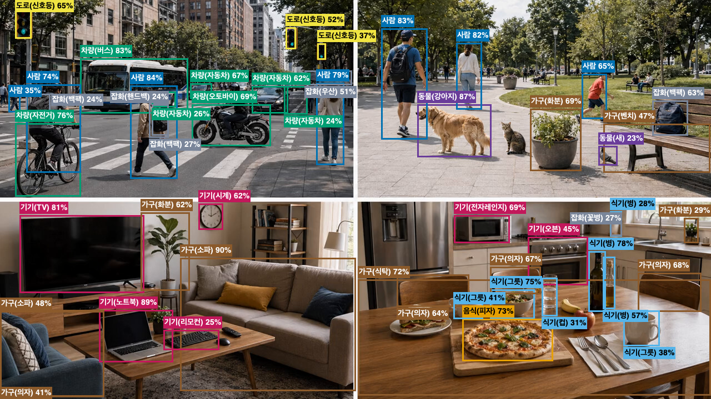

# Video Analysis / VA Guide

이 문서는 MediaServer의 영상 분석(VA) 엔진, Rule/Scenario 구조,
API, event payload를 설명합니다.
UI 화면 사용법은 [ui-guide.md](./ui-guide.md),
환경변수 전체 목록은 [config-reference.md](./config-reference.md),
검증 이력은 [history/verification-history.md](./history/verification-history.md)를 봅니다.
Event POST, WebRTC DataChannel, SSE, WebSocket live metadata contract의
기준 schema와 변경 금지 기준은
[live-event-metadata-contracts.md](./live-event-metadata-contracts.md)에
분리해 관리합니다. 이 문서는 VA pipeline과 payload 예시를 설명하되,
contract 변경 판단의 기준 문서는 아닙니다.

## 1. VA 개요

VA는 기존 RTSP/WebRTC relay path를 대체하지 않고, 같은 source stream에 선택적으로 붙는 분석 계층입니다.

지원 입력:

- file source
- RTSP pull source
- 외부 WHEP playback URL pull source
- WebRTC publish source의 소비 경로
- HTTP/HLS URI source
- 정적 이미지 분석 API

지원 출력:

- RTSP/WebRTC 영상 overlay
- analysis metadata JSON
- snapshot JPEG / overlay JPEG
- 기본 rule event JSON
- scenario event JSON
- opt-in Event POST
- opt-in EventRecord JSON Lines 저장
- opt-in WebRTC DataChannel metadata

일반 overlay는 `va=1`로 켭니다.
저장된 영상 분석 설정은 `vaRule=<숫자>`로 호출합니다.
`vaRule` 요청은 저장된 source/profile/rule/scenario/geometry를 사용하므로
`file`, `url`, `source` override와 함께 쓰지 않습니다.

문서용 VA overlay 예시:



정적 이미지 분석 API 검증 기본 입력은 `docs/assets/va-four-scene-sample.png`입니다.

외부 이벤트 JSON/API/POST 형식은 기존 호환성을 유지합니다.
TrackState, Scenario, TrackHealth, EventRecord는 내부 상태와 선택 저장 구조를
확장하는 용도이며 기존 Intrusion/LineCrossing event type을 바꾸지 않습니다.

### 현장형 Scenario Preset

Ops 룰 UI의 이벤트 템플릿은 `default`, `road`, `park`, `indoor`,
`retail`, `lobby`, `platform`, `entrance`, `doorway`, `parking`,
`elevator`, `custom` preset을 저장할 수 있습니다.
Preset은 `scenario.presetId`로 남기고,
실제 판단에는 저장된 threshold 숫자값을 사용합니다.
`line-crossing`은 기본 이벤트이므로 preset label을 별도 payload field로 저장하지
않고 `event.minConfidence`, line geometry, direction만 저장합니다.

| Preset | 주 대상 | 기본 튜닝 방향 |
| --- | --- | --- |
| `road` | 도로, 차로, 교차부 | line crossing과 wrong-direction은 짧은 지속 시간, occupancy/loitering은 높은 임계값 |
| `park` | 공원, 외부 체류 공간 | loitering dwell을 길게 잡고 재알림 간격을 넓힘 |
| `indoor` | 실내 구역 | 이동 반경과 dwell을 낮춰 짧은 동선을 빨리 판정 |
| `retail` | 매장 통로, 계산대 주변 | 짧은 체류와 대기열을 빠르게 잡는 시작값 |
| `lobby` | 로비, 공용 대기 공간 | occupancy와 re-entry 기준을 중간값으로 유지 |
| `platform` | 승강장, 대기열 구간 | line-crossing 지연을 짧게, occupancy threshold를 높게 유지 |
| `entrance` | 출입구 | intrusion dwell과 re-entry window를 짧게 유지 |
| `doorway` | 문 앞 정체 | 짧은 dwell과 낮은 occupancy threshold로 병목을 빨리 표시 |
| `parking` | 주차장 가장자리 | 보행/차량 혼재 구간에서 loitering dwell과 반경을 보수적으로 유지 |
| `elevator` | 승강기 홀 | 대기 오탐을 줄이기 위해 occupancy dwell을 중간값으로 유지 |

LineCrossing preset 주의:

- preset은 최소 신뢰도 시작값만 채웁니다.
- 방향(`any`/`forward`/`reverse`)과 2점 line geometry는 운영자가 현장 영상에서 확인합니다.
- Event POST payload schema, WebRTC/SSE/WS metadata schema, ScenarioEngine 판단 로직은 변경하지 않습니다.

## 2. VA Pipeline

```text
Source Stream
  -> Raw Video Decode
  -> YOLO/ONNX Detection
  -> Direction-Based Tracker
  -> TrackedObjectMetadata Adapter
  -> TrackStateManager
  -> SceneContextBuilder
  -> RuleEventEngine
  -> ScenarioEngine
  -> EventManager
  -> VaRuntimeMetadataBuilder
  -> Overlay / Runtime Metadata / Event POST / EventRecord / WebRTC DataChannel / SSE-WS Side-Channel
```

### YOLO/ONNX Detection

기본 detector는 YOLO/ONNX Runtime 경로입니다.
기본 모델은 `models/yolo11n.onnx`,
label은 `models/coco.names` 기준입니다.
모델과 label 파일은 repo에 커밋하지 않고 로컬 `models/` 아래에 둡니다.

YOLO parser는 `YOLOv8/YOLO11` 계열의 `[1, 84, N]` 또는 `[1, N, 84]` 출력과, `YOLOv5` 계열의 objectness 포함 `[1, N, 85]` 출력을 대상으로 합니다.

지원 parser 옵션:

- `outputLayout=auto|channels-first|channels-last`
- `boxFormat=cxcywh|xyxy`
- `scoreMode=auto|class-only|objectness-class|score-class|class-score`

### Tracking

기본 tracker는 direction-based/lightweight tracker입니다. Kalman-lite와
ByteTrack 계열 tracker는 v1.4.0 rule-level opt-in tracker로 제공하며,
BoT-SORT/DeepSORT와 실제 Re-ID 모델은 기본 tracking id 생성에 사용하지 않습니다.

v1.4.0부터 rule/vaRule은 `analysis.trackingPolicy`로 tracker/Re-ID 선택 계약을
가질 수 있습니다. 기존 저장 rule에 이 필드가 없으면 자동 migration 없이
`tracker=lite`, `reid=off`로 해석합니다.

허용값:

- `tracker`: `none`, `lite`, `kalman-lite`, `bytetrack`
- `reid`: `off`, `assist`

`tracker=none`은 runtime tracking을 끄며 Re-ID는 `off`여야 합니다.
`kalman-lite`는 Re-ID/model dependency 없이 motion prediction과 bbox smoothing을
적용하는 opt-in runtime tracker입니다. `bytetrack`은 YOLO detection 결과를
high/low confidence association으로 나누는 opt-in runtime tracker입니다.
low-confidence detection은 기존 track continuity를 내부적으로 보강할 수 있지만
새 public track을 만들거나 event/zone/line 판단용 track metadata로 승격하지
않습니다. ByteTrack은 짧은 detection gap을 흡수하는 bounded lost buffer floor도
내부 continuity에만 사용하며 제품 기본 tracker로 승격하지 않습니다. ByteTrack
상태는 내부 runtime status의 `effectiveTracker=bytetrack`으로
확인하며 Event POST/WebRTC DataChannel/SSE/WS metadata schema에는 새 필드를
추가하지 않습니다.
OC-SORT는 v1.4.0 runtime tracker 허용값이 아닙니다. 후속 benchmark가 열리더라도
Kalman-lite/ByteTrack 이후 별도 report에서 Re-ID 없이 motion/observation 중심으로
비교하며, Event POST/WebRTC DataChannel/SSE/WS metadata schema에는 새 필드를
추가하지 않습니다.
BoT-SORT/DeepSORT도 v1.4.0 runtime tracker 허용값이 아닙니다. 이 계열은
appearance/Re-ID model, embedding/crop, camera motion compensation,
dataset provenance, runtime/model bundle, retention/redaction policy 검토가
필요하므로 별도 research boundary와 privacy/dependency review가 열릴 때만
다룹니다. 이 research note는 Event POST/WebRTC DataChannel/SSE/WS metadata schema
또는 RTSP/WebRTC media path 변경 근거가 아닙니다.
외부 payload의 `source.profileKey` 문자열에도 policy token을 추가하지 않습니다.
Re-ID `assist`도 외부 metadata에 embedding, crop, model path, checksum,
appearance profile을 노출하지 않는 opt-in 정책값입니다.
Re-ID assist는 독립 tracker가 아니라 selected tracker의 association 보조 hook으로만
해석합니다. `tracker=none`에서는 `reid=assist` 조합을 저장하지 않으며,
검증 하네스는 `--reid-policy assist`로 임시 vaRule을 만들어 runtime 적용 여부를
확인할 수 있습니다.

matching score는 다음 요소를 조합합니다.

- IoU score
- center distance score
- trail direction score
- class consistency score

unmatched track은 제한된 lost buffer에 남고, 짧은 누락 뒤 같은 class/object가 다시 matching되면 `reacquired` 상태로 관측됩니다.

같은 class 객체가 가까워지거나 bbox가 겹치는 구간에서는 현재 direction-based/lightweight tracker의 ID continuity가 불안정할 수 있습니다.

| 관찰 증상 | 해석 |
| --- | --- |
| bbox 좌표는 맞음 | detector보다 tracker association 후보 |
| association score 저하 | trackId 흔들림 가능 |
| lost/reacquired 증가 | 짧은 누락 뒤 재연결된 상태 |
| detector 후처리 변경 필요 | tracker opt-in 범위 밖 |
| BoT-SORT/DeepSORT/Re-ID 도입 | Kalman-lite/ByteTrack opt-in 범위 밖 |

Close-object association guard는 이 한계를 관찰하기 위한 opt-in 진단/보정 skeleton입니다.

| 모드 | 동작 | 변경 없음 |
| --- | --- | --- |
| `off` | 기본 정책 | 기존 scoring과 판단 유지 |
| `diagnostic` | 후보와 risk만 기록 | tracking 결과 변경 없음 |
| `enforce` | 제한적 score penalty/boost 후보 적용 | 실험적 opt-in |

Event POST payload, WebRTC DataChannel schema, SSE/WS metadata schema,
Scenario 판단 로직은 바꾸지 않습니다.
default-off, diagnostic, enforce opt-in 검증은 replay/event/metadata 경로를 통과했습니다.
다만 현재 샘플에서 ID continuity 개선 근거는 제한적이므로
default on 전환은 보류합니다.

### TrackStateManager

`TrackStateManager`는 stream/channel별 track map을 분리해서 관리합니다.

저장하는 상태:

- firstSeenTime
- lastSeenTime
- lostSince
- Active / Lost / Reacquired / Terminated lifecycle
- 최근 bbox, center, confidence, class, direction
- 최근 observation ring buffer
- downsampled trajectory
- TrackHealth
- optional AppearanceProfile

frame 원본은 장기 저장하지 않습니다. cleanup은 active track을 삭제하지 않고 Lost/Terminated/stale 상태만 대상으로 합니다.

### SceneContextBuilder

`SceneContextBuilder`는 TrackRuntimeState와 기존 rule/vaRule의 polygon/line region을 사용해 context만 계산합니다. 이벤트를 직접 발생시키지 않습니다.

계산 항목:

- ZoneState: currentZone, previousZone, enteredAt, exitedAt, dwellTimeMs, restricted zone 여부
- LineCrossState: previousSide, currentSide, crossed, rawDirection, allowedDirection, lastCrossTime
- optional ground point / ground trajectory

### RuleEventEngine

기존 기본 이벤트 owner입니다. presence, enter, exit, line-crossing을 평가하고 기존 event JSON/API/POST 형식을 유지합니다.

trackId가 있으면 TrackState/SceneContext를 사용하고, tracker가 꺼져 있거나 trackId가 없는 경우 기존 detection fallback을 사용합니다.

### ScenarioEngine

상태 머신 기반 상황 이벤트를 담당합니다. 기존 RuleEventEngine과 별도 계층이며, `IScenario` 구현체를 등록해 확장합니다.

저장된 `vaRule`에 `scenario` payload가 있으면
runtime은 해당 rule의 scenario 설정을 우선 적용합니다.

Rule별 ScenarioEngine option으로 변환되는 값:

- `candidateTimeMs`
- `dwellTimeMs`
- `cooldownMs`
- target class
- target zone/line
- WrongDirection 허용 방향
- stable track 요구 조건

값이 없거나 유효하지 않으면 기존 env default를 fallback으로 사용합니다.

내부 lifecycle/dedupe key는 rule별 scenario key로 분리하지만 외부 event type, Event POST payload schema, WebRTC/SSE/WS metadata schema는 변경하지 않습니다.

대표 phase:

- Idle
- LineCrossed
- ZoneEntered
- Candidate
- Observing
- Confirmed
- Cooldown
- Ended

### EventManager

`EventManager`는 rule/scenario event lifecycle, dedupe, cooldown, cleanup을 담당합니다.

lifecycle key는 stream/channel, rule/scenario, zone/line, trackId를 기준으로 분리합니다.
같은 track/zone/scenario의 중복 이벤트를 억제하되,
기존 rule event의 외부 출력 형식은 유지합니다.

## 3. 분석 Profile

Profile은 detector와 분석 품질/성능 설정입니다.

주요 필드:

- detector: `yolo` 또는 검증용 `dummy`
- model path
- labels path
- FPS
- queue size
- confidence threshold
- NMS threshold
- input width/height
- tracking enabled
- tracking category/class list
- adaptive tuner 옵션

긴 환경변수와 기본값은 [config-reference.md](./config-reference.md)에 둡니다.

## 4. Rule 구조

저장된 `vaRule`은 source, profile, event/scenario, region, outputs를 하나의 숫자 ID로 묶습니다.

기본 구조:

```json
{
  "id": "1",
  "name": "lobby sample",
  "enabled": true,
  "source": {
    "kind": "file",
    "file": "sample_h264.mp4"
  },
  "analysis": {
    "profileId": "1",
    "classes": ["person", "vehicle"],
    "trackingPolicy": {
      "tracker": "lite",
      "reid": "off"
    }
  },
  "event": {
    "type": "presence",
    "region": {
      "type": "polygon",
      "points": [
        { "x": 0.2, "y": 0.2 },
        { "x": 0.8, "y": 0.2 },
        { "x": 0.8, "y": 0.8 }
      ]
    },
    "minConfidence": 0.25,
    "minDurationMs": 0
  },
  "outputs": {
    "overlay": true,
    "metadata": true,
    "events": true
  }
}
```

Rule 구성 요소:

- source: file, RTSP URL, WHEP URL, WebRTC publish source id, HTTP/HLS URI source
- profile: detector/FPS/threshold/tracking 설정
- event: 기본 이벤트 또는 scenario event 설정
- region: polygon 또는 line
- outputs: overlay, metadata, events, POST action

polygon 좌표는 normalized 0~1 비율입니다. line-crossing은 2점짜리 line과 방향(`any`, `forward`, `reverse`)을 사용합니다.

## 5. 기본 이벤트

기본 이벤트는 기존 rule event engine에서 평가합니다.

| 이벤트 | 설명 |
| --- | --- |
| `presence` | 대상 객체가 영역 안에서 감지됨 |
| `enter` | 대상 객체가 영역 밖에서 안으로 진입 |
| `exit` | 대상 객체가 영역 안에서 밖으로 이탈 |
| `line-crossing` | 대상 객체가 line을 통과 |

`line-crossing` 방향:

- `any`: 양방향
- `forward`: line 시작점에서 끝점 기준의 정방향
- `reverse`: 반대 방향

기본 이벤트는 기존 Intrusion/LineCrossing event type, JSON/API/POST field를 변경하지 않습니다.

## 6. 상황 기반 시나리오

Scenario는 여러 frame에 걸친 상태 전이와 시간 조건을 평가합니다. 기존 기본 이벤트와 별도 event type을 사용합니다.

저장 rule의 scenario 설정은 env default보다 우선합니다.
env 설정은 다음 경우에만 사용합니다.

- 저장 payload에 빠진 값의 fallback
- 저장 scenario rule 없이 env scenario만 켠 검증 모드

| 시나리오 | 상태 | 이벤트 타입 |
| --- | --- | --- |
| IntrusionDwell | 구현됨, UI 템플릿 제공 | `intrusion-dwell` |
| ReEntry | 구현됨, 룰 편집 UI에서 선택 가능 | `re-entry` |
| WrongDirection | 구현됨, UI 템플릿 제공 | `wrong-direction` |
| IntrusionAfterLineCrossing | 구현됨, 룰 편집 UI에서 선택 가능 | `intrusion-after-line-crossing` |
| Loitering | 구현됨, 룰 편집 UI에서 선택 가능. 현장 샘플 프리셋 제공 | `loitering` |
| ZoneOccupancyScenario | 구현됨, 룰 편집 UI에서 선택 가능. 현장 tuning preset 제공 | `zone-occupancy` |

### IntrusionDwell

restricted zone에 들어온 person track이 일정 시간 이상 머무르면 1회 확정 이벤트를 발생시킵니다.

흐름:

```text
Idle -> Candidate -> Observing -> Confirmed -> Cooldown -> Ended
```

기본 개념:

- restricted zone 진입: Candidate
- 후보 시간 이상 유지: Observing
- dwell time 이상 체류: Confirmed
- 같은 track이 계속 zone 안에 있어도 중복 emit 없음
- zone 이탈 시 Ended

### ReEntry

같은 track이 target zone을 이탈한 뒤 설정 window 안에 같은 zone으로 재진입하면 `re-entry` 이벤트를 1회 발생시킵니다.

흐름:

```text
Inside -> Exited -> ReEntryCandidate -> Confirmed -> Cooldown -> Ended
```

룰 편집 UI 설정 항목:

| 항목 | 설명 |
| --- | --- |
| target | class/category |
| geometry | polygon zone |
| reEntryWindowMs | 이탈 후 재진입으로 볼 시간 window |
| re-entry zone | 같은 zone 또는 지정 zone 목록 |
| cooldown | same track/zone 중복 억제 |
| unstable track exclude | 불안정 track 후보 제외 |

`지정 zone`은 저장 payload의 `targetZoneIds`/`reEntryZoneIds`에
대상 zone 목록을 명시합니다.
현재 1차 UI는 같은-zone 재진입 대상을 명시하는 범위입니다.
cross-zone A→B 재진입 판단은 후속 ScenarioEngine 확장입니다.
기존 Event POST payload schema, WebRTC/SSE/WS metadata schema,
scenario event type은 변경하지 않습니다.

### WrongDirection

line별 허용 방향과 실제 crossing 방향이 다르면 `wrong-direction` 이벤트를 발생시킵니다. 기존 `line-crossing` 이벤트는 그대로 유지합니다.

룰 편집 UI 설정 항목:

| 항목 | 설명 |
| --- | --- |
| target | class/category |
| geometry | line 2점 |
| 허용 방향 | `forward` 또는 `reverse` |
| cooldown | same track/line 중복 억제 |
| 미사용 방향 | `any`, 위반 방향을 정의할 수 없음 |

저장 전 검토와 Payload preview는 `wrong-direction` scenario payload, line geometry, 허용 방향, cooldown 중복 억제를 보여줍니다.

이 UI는 기존 rule/event payload 구조의 `event.region.direction`을 재사용합니다.
ScenarioEngine 판단 로직, Event POST payload schema,
WebRTC/SSE/WS metadata schema는 변경하지 않습니다.

### IntrusionAfterLineCrossing

line crossing 이후 target zone에 진입하고 일정 시간 머무는 조합 상황을 평가합니다.

흐름:

```text
Idle -> LineCrossed -> ZoneEntered -> Observing -> Confirmed -> Cooldown -> Ended
```

룰 편집 UI 설정 항목:

| 항목 | 설명 |
| --- | --- |
| target | class/category |
| trigger line | line id, x1/y1 → x2/y2 정규화 좌표 |
| crossing direction | `any`, `forward`, `reverse` |
| target zone | polygon zone, targetZoneIds |
| zoneEntryTimeout(ms) | 저장 payload의 `maxDelayAfterCrossingMs`로 runtime에 전달 |
| dwell/observe | `dwellTimeMs` |
| cooldown | same track/line/zone 중복 억제 |
| unstable track exclude | 불안정 track 후보 제외 |

이 UI는 기존 `line-crossing` 기본 이벤트를 끄거나 대체하지 않습니다.
IntrusionAfterLineCrossing은 trigger line crossing 기록과 target zone dwell 조건이
모두 충족될 때 별도 `intrusion-after-line-crossing` scenario event를 발생시킵니다.
Event POST payload schema, WebRTC/SSE/WS metadata schema,
ScenarioEngine 판단 로직은 변경하지 않습니다.

### Loitering

target zone 내부 dwell time과 downsampled trajectory movement radius를 조합해
배회 상황을 판단합니다.
복잡한 행동 인식 모델 없이 trajectory 기반 최소 구현입니다.

룰 편집 UI 설정 항목:

| 항목 | 설명 |
| --- | --- |
| target | class/category |
| target zone | polygon zone, targetZoneIds |
| minimum dwell | 저장 payload의 `minDwellTimeMs`로 runtime에 전달 |
| movement radius | 저장 payload의 `maxMovementRadius`로 runtime에 전달 |
| trajectory points | 저장 payload의 `minTrajectoryPoints`로 runtime에 전달 |
| cooldown | same track/zone 중복 억제 |
| ground-plane radius | optional `useGroundPlaneMovementRadius` |
| unstable track exclude | 불안정 track 후보 제외 |

현재 UI 템플릿은 rule payload preview, 저장 전 validation,
standalone rule 저장 round-trip을 검증합니다.
현장 시작 threshold는 [Analysis Threshold Baselines](analysis-threshold-baselines.md)에 정리합니다.
Preset은 dwell/radius/trajectory point와 함께 cooldown 시작값도 채웁니다.
UI warning copy는 preset을 확정값이 아닌 field sample replay 시작값으로 설명하고,
TrackHealth가 불안정한 경우 dwell부터 늘리도록 안내합니다.
Event POST payload, WebRTC/SSE/WS metadata schema,
기존 Scenario 판단 로직 변경으로 표현하지 않습니다.

### ZoneOccupancyScenario

특정 zone 내부 동시 track 수가 threshold 이상이고,
각 track의 zone dwell이 최소 조건을 만족할 때
`zone-occupancy` scenario event를 1회 발생시킵니다.
per-track ScenarioEngine 구조 위에서 같은 zone의 대표 track만 event를 emit해
중복을 억제합니다.

룰 편집 UI는 대기열, 로비 혼잡, 승강장 혼잡,
출입구 정체, 승강기 홀 preset을 제공합니다.
Preset은 `occupancyThreshold`, `minDwellTimeMs`, `cooldownMs` 시작값만 채웁니다.
저장 payload에는 `scenario.presetId`와 실제 숫자 조건이 함께 남습니다.
UI warning copy는 polygon이 병목 구간만 포함한다는 전제를 먼저 확인하고,
정상 피크에서 confirmed가 반복되면 threshold를 올리도록 안내합니다.
현장별 시작값과 조정 순서는
[Analysis Threshold Baselines](analysis-threshold-baselines.md)를 기준으로 삼습니다.

저장 payload 주요 필드:

- `occupancyThreshold`: 같은 target zone에서 동시에 조건을 만족해야 하는 대상 수
- `minDwellTimeMs`: 각 대상 track이 zone 안에서 머문 최소 시간
- `targetZoneIds`, `targetClasses`, `cooldownMs`, `trackHealth.requireStableTrack`

## 7. TrackState / TrackHealth

TrackState는 track별 runtime 상태이고, TrackHealth는 direction-based tracking id 안정성 진단 metadata입니다.

TrackState 주요 값:

- streamId/channelId
- trackId
- lifecycle state
- firstSeenTime / lastSeenTime / lostSince
- bbox / center / confidence / class
- direction
- recent observations
- trajectory
- optional groundPoint
- optional AppearanceProfile

TrackHealth 주요 값:

- associationConfidence
- missedFrameCount
- overlapRisk
- directionChangeCount
- lastStableTime
- isUnstable
- lost/reacquired count

TrackingIssueReport는 stream/channel별로 다음 issue를 제한 수집합니다.

- `unstable-track`
- `overlap-risk`
- `missed-frame-spike`
- `direction-change-spike`
- `low-association-confidence`
- `lost`
- `reacquired`

이 기능은 진단용이며 tracking id 생성 결과를 변경하지 않습니다.
issue `message`는 raw counter 나열이 아니라 운영자가 다음 확인 지점을 고를 수 있는
문장과 핵심 metric 요약을 함께 제공합니다.

Close-object association 문제를 볼 때 함께 보는 값:

| 범주 | 값 |
| --- | --- |
| TrackHealth | status, overlapRisk, associationConfidence |
| frame 누락 | missedFrameCount, missed-frame-spike |
| lifecycle | lost/reacquired count |
| 방향 변화 | direction-change-spike |

`overlapRisk`가 높고 `associationConfidence`가 낮아지는 동안 같은 class trackId만 흔들리면 detector보다 tracker association 한계 후보로 분리합니다.

Close-object diagnostic 값:

| 값 | 의미 |
| --- | --- |
| `closeObjectRisk` | 가까운 같은 class 객체 위험 |
| `nearestSameClassTrackId` / `nearestSameClassDistance` | 가장 가까운 같은 class track |
| `candidateScore`, `bestScore`, `secondScore`, `scoreMargin` | association 후보 점수 요약 |
| `centerJump`, `directionConflict` | 연속성/방향 충돌 진단 |
| `wouldPenalize`, `wouldHoldReacquire` | enforce 후보 판단 |
| `guardDecision` | `observe` 또는 `enforce-penalize` 등 |

이 값은 candidate matrix 전체 저장이 아니라 matched/rejected 주요 후보 요약입니다.
Runtime Dashboard와 WebRTC BBox 진단에서 사람에게 필요한 수준으로만 표시합니다.

Close-object guard의 기본값은 `off`입니다.
`compare-close-object-tracker` 리포트는 같은 sample에서
`off`, `diagnostic`, `enforce`를 비교합니다.
`--fixture-matrix`를 쓰면 내장 close-object/control sample 목록을 순차 비교합니다.
정기/CI용 전체 matrix는 `verify-close-object-fixture-matrix`로 실행합니다.
이 gate는 default-off와 diagnostic 관찰 경계를 확인하기 위해 `off,diagnostic`
mode만 비교합니다. `enforce` mode는 opt-in 실험 비교로만 다루며, default-on
또는 안정 완료 근거로 사용하지 않습니다.
목적은 threshold tuning과 default-on 검토 근거를 모으는 것입니다.
`field-new-york-driving`은 실차량 주행 구간을 모사한 vehicle-heavy 샘플로,
synthetic control 샘플 외부에서 실제 환경 흔들림 성격을 확인하기 위한 항목입니다.
이 fixture는 baseline 자체의 높은 fragmentation/id-switch risk를 허용하는
fixture 전용 tracker-stability 상한을 사용합니다. 이 상한은 mode 실행
성공 여부를 분리하기 위한 것이며, close-object guard의 default-on 후보 판정은
hard risk tolerance와 event/scenario stable delta 기준을 따릅니다.
기본 실행은 mode별 격리 서버를 사용해 guard mode가 실제 서버에 적용됐는지
확인합니다.
`verify-close-object-fixture-matrix`는 fixture 누락뿐 아니라
`judgement=hold`도 실패로 처리합니다. `hold`는 event/scenario stable delta나
주요 association risk 증가가 있어 default-on 검토를 중단해야 하는 상태입니다.
관찰 목적의 hold/warning report 수집은 `compare-close-object-tracker --fixture-matrix`로
수행합니다.
Matrix gate는 다음처럼 해석합니다.

| 상태 | 의미 |
| --- | --- |
| `fail` | mode 실행이나 fixture 준비가 실패했으므로 제품 판단 중단 |
| `hold` | event/scenario stable delta 또는 hard risk 증가로 default-on 검토 중단 |
| `warning` | observed risk/counter 변동 또는 반복 검증 필요. 안정 판정이 아니며 default-on 근거로 사용 금지 |
| `pass` + `defaultOnCandidate=false` | hard gate는 통과했지만 해당 fixture는 후보 근거 부족 |
| `pass` + `defaultOnCandidate=true` | 해당 fixture 단독 후보일 뿐 제품 default-on 완료 아님 |

`matrix-ok`는 명령/gate 결과이며 제품 default-on 승인 값이 아닙니다.
matrix 출력의 `[matrix-default-on-decision]`과 `[matrix-product-default-on]`를
함께 확인해 후보 상태와 제품 기본값 전환 여부를 분리합니다.

Fixture별 후보 표는 [Re-ID Fixture Default-on Candidates](reid-fixture-default-on-candidates.md)에
분리합니다.

동일 테스트를 `--use-existing-server`로 돌릴 경우 `MEDIA_SERVER_AUTH_MODE`가
`off`이거나 `/lab` API를 호출 가능한 인증 상태여야 하며, 인증이 걸려 있으면
`/lab/analysis/taps` 응답이 비정상(리다이렉트/빈 본문)으로 와 파싱이 실패할 수 있습니다.
event/scenario stable 상태가 달라지면 default on 전환 근거로 사용할 수 없습니다.
live polling 과정의 emit/dedupe/cleanup counter 차이는 observed delta로 남기되
단독 default-on 차단 사유로 보지 않습니다.
`idSwitchRiskScore`는 stale PTS/PTS regression 성분을 포함하므로
close-object guard 비교에서는 tracker association risk와 observed risk를 분리해 봅니다.
단일 비교는 `strict` quality preset을 기본으로 사용하고,
fixture matrix는 sample 성격에 맞춰 `close-object-live`, `control-live`, 또는
`field-driving-live` quality preset을 적용합니다. `field-driving-live`는
vehicle-heavy field-like sample의 높은 baseline counter 흔들림을 분리하기 위한
observed risk 허용치와 작은 hard risk jitter 허용치이며, event/scenario stable
delta 기준은 완화하지 않습니다. preset은 live polling 흔들림을 분리하는
용도이며, event/scenario stable delta가 있으면 여전히 default-on 근거로
사용할 수 없습니다.
fixture `classWhitelist`는 fragmentation 계산과 observed issue/diagnostic
counter 집계에 모두 적용합니다. `trackingIssueCounts`는 polling 반복 관측
합계가 아니라 `type/class/trackId` 기준 고유 이슈 수이며, raw 반복 관측 수는
`trackingIssueObservationCounts`로 분리합니다.
`warning` fixture가 남아 있으면 안정적이라고 닫지 않고 반복 실행 또는
field/model review 대상으로 남깁니다.
matrix report에 `--history-dir`를 지정하면 회차별 index를 남겨 품질 추세를 비교할 수 있습니다.
history index는 `defaultOnDecision`, `productDefaultOn`, `candidateCount`,
`defaultOnReason`도 함께 보존해 `matrix-ok`와 제품 기본 활성화 판단을 분리합니다.
단일 close-object 비교에서도 `--history-dir`를 지정하면 summary/report 사본과
`close-object-tracker-comparison-history` index를 남깁니다. 이 index는
`judgement`, warning reason count, recommendation, `defaultOnCandidate`를
회차별로 보존해 `--tracker-policy bytetrack --reid-policy assist` 같은 opt-in
조합의 counter drift 추세를 추적합니다. 단일 비교 history도 관찰 evidence일 뿐
Re-ID assist 또는 close-object guard default-on 완료 근거로 사용하지 않습니다.
반복 실행에서는 `Repeat Metric Stats`의 mean/stdev/variance로 observed risk 변동성을 확인합니다.

## 8. Appearance / Re-ID Hook

AppearanceProfile과 IAppearanceExtractor는 향후 Re-ID/attribute 분석을 연결하기 위한 hook입니다.

현재 상태:

- 기본값은 비활성
- 기본 extractor는 `NoOpAppearanceExtractor`
- 실험용 ONNX Re-ID extractor hook은 모델 파일, SHA-256 checksum, provenance가 모두 있을 때만 사용
- 모델 파일이 없거나 checksum/provenance gate가 비어 있거나 불일치하거나 ONNX Runtime 빌드가 아니면 NoOp으로 fallback
- everyNSeconds, onTrackLost, onReacquireCandidate, onLowConfidenceAssociation 같은 policy trigger에서만 실행 후보 생성
- rule/vaRule의 `analysis.trackingPolicy.reid=assist`가 선택된 tracker와 함께 적용된
  경우에만 association 보조 hook으로 사용
- async queue, per-stream rate limit, global queue 상한, stale job drop으로 media pipeline blocking 방지
- embedding/crop/model path 같은 Re-ID identity material은 WebRTC/SSE/WS/Event/debug 외부 metadata payload에 직렬화하지 않습니다.
- `./server.sh verify-reid-advanced-tracking`은 default-off, privacy review, close-object benchmark command boundary를 정적 검증합니다.
- v1.3.0 연구 지속 기준은 [Re-ID Default-off Research Continuation](reid-default-off-research-continuation.md)에
  분리하며, 제품 default-on 결정이나 대형 tracker 교체로 해석하지 않습니다.
- privacy threat model에서는 embedding vector, bbox crop, track-linked
  appearance profile, Re-ID model path/checksum, field sample provenance를
  identity material로 취급합니다. redaction/privacy review 전에는 client/viewer,
  외부 metadata, screenshot artifact, release asset에 남기지 않습니다.

Re-ID/attribute 분석은 매 frame 실행 구조가 아닙니다.

## 9. Homography / Ground-Plane

Homography는 camera별 image point를 ground-plane point로 변환하는 optional 구조입니다.

현재 사용 방식:

- bbox bottom center를 image foot point로 사용
- stream/channel별 homography matrix 설정 가능
- 변환 실패 또는 미설정 시 image 좌표 fallback
- 기존 polygon/line event 판단은 즉시 ground-plane 좌표로 전면 교체하지 않음
- speed와 movement radius 계산에서 ground-plane 사용 옵션 제공
- Loitering movement radius는 ground trajectory가 있으면 우선 사용할 수 있음

단위와 matrix 설정은 [config-reference.md](./config-reference.md)에 정리합니다.

## 10. Event Payload

기존 외부 event POST payload는 `media-server.va.event.v1`입니다.

```json
{
  "schema": "media-server.va.event.v1",
  "eventId": "evt_1710000000000_1",
  "timestamp": "2026-04-30T00:00:00Z",
  "timestampMs": 1710000000000,
  "source": {
    "key": "file:sample_h264.mp4",
    "profileKey": "1",
    "sourceKind": "file",
    "route": "dhseo",
    "clientId": "",
    "pts": 123456789
  },
  "rule": {
    "id": "1",
    "type": "presence"
  },
  "object": {
    "trackId": 7,
    "classId": 0,
    "class": "person",
    "confidence": 0.92,
    "bbox": {
      "x": 0.25,
      "y": 0.2,
      "width": 0.1,
      "height": 0.3
    }
  },
  "action": {
    "highlight": {
      "enabled": true,
      "mode": "blink",
      "color": "#ff0000",
      "durationMs": 1500
    },
    "post": {
      "enabled": true,
      "method": "POST",
      "payloadFormat": "media-server.va.event.v1"
    }
  }
}
```

Replay output의 `events[]`도 같은 핵심 구조를 유지합니다.
내부 TrackHealth snapshot은 `metadata_json` 안에
`media-server.va.event-track-health.v1` wrapper로 붙을 수 있습니다.
외부 event field 이름은 유지합니다.

## 11. EventRecord / Snapshot / Clip Hook

EventRecord는 운영 조회와 snapshot/clip evidence 연결을 위한
내부 metadata 저장 구조입니다.
기본값은 비활성입니다.
이 기능은 짧은 이벤트 근거 frame 저장용이며,
장기 영상 녹화나 VMS/NVR은 아닙니다.
Event POST payload, WebRTC DataChannel metadata,
SSE/WS metadata schema와 별도로 동작합니다.

현재 1차 구현 범위:

- EventRecord file storage
- active/archive records 조회 API
- Runtime Dashboard 수동 검색 UI
- 비파괴 compaction snapshot 생성/목록/다운로드/삭제
- JSON Lines rotation/retention/recovery summary

`media-server.va.event-record.v1` 필드:

- eventId
- eventType
- streamId/channelId
- trackId
- classId/className
- startTime / updateTime / endTime
- status
- zoneId / lineId
- scenarioName / scenarioPhase
- confidence
- snapshotPath
- clipPath
- preEventMs / postEventMs
- metadata

저장은 active JSON Lines 파일 append 방식이며 DB 의존성은 없습니다.
저장 실패는 counter와 로그에 남기고 streaming/event 출력은 계속 진행합니다.

저장 파일 운영 정책:

- `MEDIA_SERVER_ANALYSIS_EVENT_STORAGE_MAX_FILE_BYTES`가 0보다 크면 active JSON Lines 파일 size 기준으로 rotation합니다.
- rotated archive 이름은 같은 디렉터리의 `<active-stem>.<timestamp-ms>.<sequence><ext>` 형식입니다.
- `MEDIA_SERVER_ANALYSIS_EVENT_STORAGE_MAX_ARCHIVES`와
  `MEDIA_SERVER_ANALYSIS_EVENT_STORAGE_MAX_TOTAL_BYTES`는
  rotated archive만 oldest-first로 삭제합니다.
  active 파일은 retention 대상에서 제외합니다.
- corrupt JSON line, 지나치게 긴 line, partial final line은 records API 전체 실패로 만들지 않고 skip/count 처리합니다.
- recovery summary는 `/lab/analysis/event-storage/status`와 records API에서 확인합니다.
  주요 field는 `skippedCorruptLines`, `partialLineCount`,
  `lastRecoveryTime`, `lastRecoveryStatus`입니다.
- records API는 기본 active file을 조회하며 `includeArchives=1`을 주면 rotated archive도 최신순으로 포함합니다.

Snapshot/clip hook 상태:

- 기본 NoOp
- 활성화 시 분석 raw frame rolling buffer에서 snapshot media file과 pre/post frame bundle을 생성
- snapshot은 JPEG를 우선 사용하고 encoder 사용 불가 시 PPM/PGM evidence file로 fallback
- clip은 MP4가 아니라 frame bundle directory와 `manifest.json` 구조
- pre/post buffer는 config와 내부 stream/frame 상한으로 제한
- `/lab/analysis/event-storage/status`와 `/ops/api/events/status`의
  `evidencePolicy`는 제품 범위를 명시합니다.
  - `scope=event-short-evidence`
  - `longRecording=false`
  - `videoArchive=false`
  - `clipFormat=frame-bundle`
  - `compactionDestructive=false`

상태 API:

```bash
curl -fsS 'http://127.0.0.1:8080/lab/analysis/event-storage/status'
```

조회 API:

```bash
curl -fsS 'http://127.0.0.1:8080/lab/analysis/events/records?eventType=presence&limit=100'
```

`/lab/analysis/events/records` 조회 API:

| 항목 | 설명 |
| --- | --- |
| 응답 schema | `media-server.va.event-record-list.v1` |
| 읽기 범위 | 기본 active EventRecord JSON Lines 파일, `includeArchives=1`일 때 rotated archive 포함 |
| storage 비활성/파일 없음 | `records: []`와 storage 상태 반환 |
| corrupt/partial line | 전체 API 실패 대신 skip/count 처리 |
| recovery count | `skippedCorruptLines`, `partialLineCount` |
| rotation 상태 | `activeFileSizeBytes`, `archivedFileCount`, `totalArchiveBytes` |
| retention/write 상태 | `rotatedCount`, `retentionDeletedCount`, `writeFailedCount` |
| archive scan | `archiveFilesScanned`, `archiveRecordsScanned` |

지원 filter:

- `eventId`, `eventType`, `streamId`, `channelId`, `trackId`, `status`
- `zoneId`, `lineId`, `scenarioName`, `scenarioPhase`
- `evidence=snapshot|clip|any|both|missing`
- `startTimeMs`, `endTimeMs`, `offset`, `limit`
- `includeArchives=1`

Compaction snapshot API:

```bash
curl -fsS -X POST 'http://127.0.0.1:8080/lab/analysis/events/records/compact?includeArchives=1'
curl -fsS 'http://127.0.0.1:8080/lab/analysis/events/records/compactions'
curl -fsS -X POST 'http://127.0.0.1:8080/lab/analysis/events/records/compactions/cleanup?keepNewest=10'
curl -fsS 'http://127.0.0.1:8080/lab/analysis/events/records/compactions/{fileName}'
curl -fsS -X DELETE 'http://127.0.0.1:8080/lab/analysis/events/records/compactions/{fileName}'
```

이 API는 matching record를 새 compacted JSON Lines 파일로 쓰는 비파괴 snapshot입니다. 기존 active/archive 파일을 삭제하거나 rewrite하지 않습니다.
`compactions` API는 active storage 파일과 같은 디렉터리의
compacted snapshot 파일만 대상으로 목록/다운로드/삭제를 허용합니다.
rotated archive 조회 대상에는 compacted snapshot을 포함하지 않습니다.

개발/검증 API와 운영 대시보드 세부 확인 흐름은 이 API를 수동 검색 UI 또는 custom client에서 사용할 수 있게 노출합니다.

- 사용자가 검색 버튼을 누를 때만 API를 호출합니다.
- `offset`과 `limit`으로 active/archive 합산 결과를 페이지 단위로 넘길 수 있고, UI는 이전/다음 페이지 버튼으로 이 값을 사용합니다.
- `snapshotPath`와 `clipPath`는 table badge, detail evidence summary, 원본 JSON, preview route에서 확인합니다.
- evidence filter는 snapshot만 있는 record, clip manifest가 있는 record,
  둘 다 있는 record, 둘 다 없는 record를
  active/archive/compaction query에서 같은 조건으로 거릅니다.
  Runtime Dashboard detail은 snapshot/clip preview 상태를 별도 문구로 표시하고,
  clip frame preview link를 파일명 기준으로 정렬된 일부 샘플로 보여줍니다.
- `/ops/events` 직접/진단 route는 evidence policy, evidence filter, archive 포함, offset paging을 표시하되 독립 제품 탭으로 승격하지 않습니다.
- `/ops/events`의 evidence column은 다음 다운로드를 제공합니다.
  - `/lab/analysis/events/evidence?download=1` 개별 다운로드
  - `/lab/analysis/events/evidence/bundle-token`에서 발급한
    signed token 기반 zip bundle 다운로드
- Bundle 내용:
  - `manifest.json`
  - 선택 snapshot
  - clip manifest
  - clip frame 파일
- Export는 Ops audit trail에 `export-bundle`로 남깁니다.
- Bundle 링크는 `signed-token-expiresAtMs` 기반 24시간 만료 정책을 사용합니다.
- 만료/변조된 token은 서버가 거절합니다.
- 만료 bundle은 서버에 별도 파일을 남기지 않습니다.
  cleanup 대상은 원본 evidence retention과 compaction snapshot cleanup에 한정됩니다.
- evidence 원본 파일 삭제는 모든 role에서 차단합니다.
- 삭제 가능한 대상은 비파괴 compaction snapshot 파일로 제한합니다.
- 이 bundle은 짧은 이벤트 증거 묶음이며 장기 영상 archive가 아닙니다.
- compaction snapshot cleanup은 `keepNewest=N` 기준으로 오래된 compacted snapshot만 삭제하며 active file과 rotated archive는 건드리지 않습니다.
- preview route는 configured snapshot/clip 디렉터리 아래의
  `.jpg/.jpeg/.ppm/.pgm/.json` evidence만 허용합니다.
  snapshot은 inline image preview, clip은 manifest JSON과 frame file link를 제공합니다.
- 영상 검색/재생, 장기 녹화, MP4 muxing은 포함하지 않습니다. snapshot/clip hook은 EventRecord용 짧은 frame evidence만 저장합니다.

Evidence retention cleanup job:

```bash
./server.sh ops-evidence-cleanup \
  --http-base http://127.0.0.1:8080 \
  --max-age-days 30 \
  --keep-compactions 10 \
  --report-file /tmp/media_server_evidence_cleanup.json
```

기본은 dry-run이며, 실제 삭제는 `--apply`를 붙인 경우에만 수행합니다.
Job은 snapshot directory의 `.jpg/.jpeg/.ppm/.pgm`, clip directory의
`manifest.json`을 가진 frame bundle directory, compaction snapshot cleanup을
대상으로 합니다. UI/API의 evidence 원본 DELETE 차단 정책은 유지하고,
운영 job만 만료 evidence를 정리합니다. `--apply`와 `--http-base`를 함께 쓰면
Ops audit에 `retention-cleanup` action을 남기며, HTTP audit이 어려운 환경은
`--audit-file`로 같은 payload를 파일에 저장합니다. Bundle export는 서버 파일을
만들지 않는 signed token 방식이므로 만료 bundle cleanup은 계속
`token-expiry-no-server-file` 정책입니다.

전용 검증:

```bash
./server.sh verify-ops-evidence-retention-cleanup
```

## 12. VA Runtime Metadata

`VaRuntimeMetadataBuilder`는 WebRTC DataChannel, runtime dashboard, SSE/WebSocket side-channel이 공통으로 쓸 내부 frame 구조를 만듭니다.

현재 구현 상태:

- 구현 완료: 내부 `VaRuntimeMetadataFrame` 구조와 builder
- 구현 완료: WebRTC DataChannel 호환 serializer
- 구현 완료: SSE/WebSocket side-channel용 runtime metadata JSON 직렬화
- 구현 완료: runtime dashboard의 Overview/Tracks/Scenarios/Scenario Timeline/Events/Metadata/Tracking Issues drill-down 1차 표시
- 구현 완료: Runtime Dashboard 내부 vaRule Runtime Debug 1차 패널
- 구현 완료: SSE metadata side-channel 수신 중심 custom client 예제
- 구현 완료: OpenCV 기반 Custom RTSP + SSE metadata overlay renderer 예제
- 구현 완료: WebSocket command/filter/subscribe-unsubscribe control
- 구현 완료: state-dump/runtime debug 계층의 `scenarioTimeline[]`
  phase entered/elapsed, cooldown remaining, event emitted/dedupe count 1차 표시
- 구현 완료: `/ops/dashboard` Live VA Event Quality 패널의 Scenario Timeline과
  TrackHealth issue grouping/focus summary/filter
- 구현 완료: WebSocket 기반 Custom RTSP + WS metadata overlay renderer 예제

내부 schema:

- `media-server.va.runtime-metadata.v1`

내부 frame 구조:

- `schema`
- `streamId` / `channelId`
- `frameId`
- `pts` / `timestampMs`
- `videoFramePtsMs` / `analysisPtsMs` / `syncDeltaMs`
- `syncStatus` / `syncToleranceMs`
- `metadataSequence` / `sentAtMs`
- `frameWidth` / `frameHeight` / `coordinateSpace`
- `source`
- `tracks[]`
- `events[]`
- `scenarios[]`
- `metrics`
- `trackingIssueReport`

`tracks[]` 포함 값:

- trackId
- className
- confidence
- bbox
- currentZone
- dwellTimeMs
- scenarioPhase
- TrackHealth

`events[]` 포함 값:

- eventId
- eventType
- status
- zoneId
- lineId
- scenarioName
- scenarioPhase

Runtime dashboard는 이 값과 `/metrics`, `/state-dump`, `/events`를 재사용해
drill-down UI를 구성합니다.

기존 외부 event JSON/API/POST 형식은
이 내부 frame이나 dashboard/debug UI 때문에 바뀌지 않습니다.
Event POST와 `/lab/analysis/taps/{tapId}/events`는 기존 payload 호환성을 유지합니다.

WebRTC DataChannel은 기존 외부 schema인
`media-server.webrtc.va-metadata.v1`을 유지합니다.

정책:

- 내부 builder가 만든 frame을 WebRTC 호환 serializer로 투영합니다.
- `source`, `scenarios`, `metrics`, `trackingIssueReport` 같은
  dashboard 전용 필드는 DataChannel 기존 schema에 추가하지 않습니다.
- WebRTC metadata viewer URL도 SSE/WS와 같은
  `eventType`, `scenarioName`, `trackId`, `zoneId` filter를 받을 수 있습니다.
- 필터는 schema 변경 없이 `tracks`/`events` 배열 범위에만 적용됩니다.
- Custom client는 filter/include 조합을 preset으로 저장해
  같은 query를 WebRTC metadata viewer, SSE, WS URL에 다시 적용할 수 있습니다.

message size 보호는 두 단계로 둡니다.

- builder: track/event count budget을 적용할 수 있는 구조
- publisher: `vaMetadataMaxMessageBytes`, `vaMetadataMaxBufferedBytes`, `vaMetadataIntervalMs`로 최종 전송 제한
- SSE/WebSocket side-channel:
  `intervalMs`, `maxMessageBytes`, `maxTracks`, `maxEvents` query로 전송량 제한.
  `eventType`, `scenarioName`, `trackId`, `zoneId`, `lineId`,
  `classId`, `className`, `ruleId`, `status` 구독 필터를 지원합니다.
  `includeSource`, `includeScenarios`, `includeMetrics`,
  `includeTrackingIssueReport` include flag도 지원합니다.

WebRTC DataChannel 송신 backpressure 정책:

- DataChannel이 아직 열리지 않았거나 닫힌 상태이면 WebRTC metadata JSON을 만들지 않고 전송도 시도하지 않는다.
- `vaMetadataIntervalMs`보다 짧은 간격의 송신 요청은 throttle되어 skip/drop counter에 기록된다.
- message가 `vaMetadataMaxMessageBytes`를 넘으면 전송하지 않고 drop한다.
- GStreamer DataChannel의 `buffered-amount`가 `vaMetadataMaxBufferedBytes`를 넘으면 전송하지 않고 drop한다.
- DataChannel send 실패는 metadata 실패로만 기록하고 WebRTC video/audio session 실패로 전파하지 않는다.
- `/lab/runtime/status`의 `webrtcHttp.metadataDataChannel`에서
  `sentCount`, `droppedCount`, `skippedCount`, `intervalSkippedCount`,
  `oversizedDropCount`, `bufferedDropCount`, `sendFailureCount`,
  `maxBufferedAmount`를 확인할 수 있다.

WebRTC metadata interval 튜닝 기준:

- 서버 기본 interval은 현재 기본값을 유지한다.
  interval을 낮추는 것은 client-side overlay 갱신 빈도를 늘리는 것이며,
  video frame과 analysis result의 PTS sync 문제를 대신 해결하지 않는다.
- 테스트 query:
  `vaMetadataIntervalMs=100`, `vaMetadataIntervalMs=200`,
  `vaMetadataIntervalMs=500`
- `vaMetadataMaxBufferedBytes`를 낮추거나 interval을 과도하게 줄였을 때
  DataChannel buffered amount가 증가하면 interval을 더 낮추지 않는다.
- publisher drop은 `metadataSequence` gap으로 추정할 수 있다.
  다만 이 값은 interval gate에 의한 정상 suppression과
  buffered/full drop을 구분하지 않는다.
  정확한 server-side `sent/dropped/failures` 집계는
  `MEDIA_SERVER_WEBRTC_TRACE=1`의 `[webrtc-metadata] close` 로그 또는
  longrun summary에서 확인한다.

2026-04-30 로컬 단일 WebRTC viewer 측정:

- 파일: `imports/va_tracking_event_1280x720_30fps_h264.mp4`
- 유지 시간: 8초

| `vaMetadataIntervalMs` | 수신 메시지 | 평균 수신 간격 | sequence gap 추정 | 평균 `abs(syncDeltaMs)` | 최대 `abs(syncDeltaMs)` | client `bufferedAmount` max |
| --- | ---: | ---: | ---: | ---: | ---: | ---: |
| 100 | 71 | 117.03ms | 179 | 173.83ms | 266ms | 0 |
| 200 | 38 | 219.54ms | 210 | 174.21ms | 266ms | 0 |
| 500 | 16 | 516.07ms | 225 | 174.56ms | 266ms | 0 |

추가 공격 조건:

- `vaMetadataIntervalMs=0`
- `vaMetadataMaxBufferedBytes=1024`
- 같은 환경에서 8초 실행

관찰 결과:

- 수신 메시지 250개
- 평균 수신 간격 32.86ms
- sequence gap 추정 0
- client `bufferedAmount` max 0
- 이 로컬 조건에서는 max buffered bytes 초과 drop이 재현되지 않음

권장값:

- 다채널/운영 기본: 현재 기본값 `500ms` 유지.
- Lab 단일 viewer에서 더 부드러운 client-side overlay가 필요할 때: `200ms`부터 테스트.
- 단일 스트림 sync 진단/데모: `100ms` 사용 가능. 단, `bufferedAmount`, sequence gap, CPU/네트워크 사용량을 함께 확인한다.
- `100ms`에서도 sync delta가 줄지 않으면 interval보다 analysis latency, PTS 기준, frame sampling, inference cadence를 먼저 본다.

## 13. WebRTC VA Metadata DataChannel

WebRTC VA metadata DataChannel은 기본 off입니다. `vaMetadata=1` query 또는 관련 env로 명시적으로 켭니다.
custom browser client용 schema/example는
[webrtc-metadata-client.md](./webrtc-metadata-client.md)에 분리했습니다.

메시지 schema:

```json
{
  "schema": "media-server.webrtc.va-metadata.v1",
  "streamId": "file:sample_h264.mp4",
  "channelId": "client-1",
  "profileKey": "1",
  "frameId": 123,
  "pts": 123456789,
  "timestampMs": 123456,
  "videoFramePtsMs": 123456,
  "analysisPtsMs": 123456,
  "syncDeltaMs": 0,
  "syncStatus": "exact",
  "syncToleranceMs": 200,
  "metadataSequence": 42,
  "sentAtMs": 1760000000000,
  "frameWidth": 1280,
  "frameHeight": 720,
  "coordinateSpace": "normalized-frame",
  "tracks": [
    {
      "trackId": 7,
      "bbox": { "x": 0.25, "y": 0.2, "width": 0.1, "height": 0.3 },
      "classId": 0,
      "className": "person",
      "confidence": 0.92,
      "currentZone": "restricted-zone",
      "previousZone": "",
      "dwellTimeMs": 3200,
      "insideRestrictedZone": true,
      "scenarioName": "intrusion-dwell",
      "scenarioPhase": "Observing",
      "lineState": { "lineId": "", "side": 0, "direction": "none" },
      "trackHealth": {
        "status": "stable",
        "stable": true,
        "associationConfidence": 0.91,
        "missedFrameCount": 0,
        "overlapRisk": 0,
        "directionChangeCount": 0
      }
    }
  ],
  "events": [
    {
      "eventId": "evt_1",
      "eventType": "intrusion-dwell",
      "status": "confirmed",
      "ruleId": "1",
      "trackId": 7,
      "classId": 0,
      "className": "person",
      "confidence": 0.92,
      "zoneId": "restricted-zone",
      "lineId": "",
      "scenarioName": "intrusion-dwell",
      "scenarioPhase": "Confirmed"
    }
  ]
}
```

전송 주기와 message/buffer 상한은 config/query로 제한합니다. DataChannel 생성/전송 실패가 audio/video streaming 실패로 이어지면 안 됩니다.

Lab의 WebRTC 메타데이터 뷰어는 이 메시지를 수신해
browser client-side canvas overlay를 그릴 수 있습니다.
`bbox`는 원본 frame 기준 normalized `[0, 1]` 좌표입니다.
viewer는 `video.videoWidth/videoHeight`와
현재 표시 영역의 letterbox offset을 사용해 화면 좌표로 변환합니다.
`frameWidth/frameHeight`는 metadata가 계산된 원본 frame 크기 진단값이며, `coordinateSpace`는 현재 `normalized-frame`입니다.
WebRTC 메타데이터 뷰어는 영상 위에 server-side bbox를 합성하지 않습니다.
DataChannel metadata를 받은 브라우저 canvas가 현재 관측 중인 track만 그립니다.
`missedFrameCount > 0` 또는 lost/terminated track은 상태/진단용으로는 유지할 수 있지만
viewer overlay 대상에서는 제외합니다.
client-side overlay는 WebRTC browser viewer 전용입니다.
RTSP 일반 viewer는 metadata DataChannel을 이해하지 못하므로
기존 server-side overlay를 사용합니다.

Fallback 정책:

- RTSP/server-side overlay는 가까운 PTS 분석 결과가 없을 때 기존처럼 latest result fallback을 사용할 수 있습니다.
- WebRTC DataChannel payload는 fallback 사용 여부를 `syncStatus=fallback-latest`로 명시합니다.
- WebRTC client-side overlay는 기본적으로 `fallback-latest` metadata를 그리지 않습니다.
  현재 표시 중인 video frame과 bbox가 어긋나는 것을 피하기 위한 정책입니다.
- Lab viewer에서 `fallback metadata 표시(opt-in)`을 켜거나
  URL에 `clientOverlayFallback=1` 또는 `vaMetadataDrawFallback=1`을 전달한 경우에만
  fallback metadata를 흐리게 표시합니다.
- fallback metadata가 숨겨진 횟수는 WebRTC 메타데이터 뷰어의 `Fallback 숨김` 지표로 확인합니다.
- fallback을 숨겨도 WebRTC video/audio stream과 DataChannel 수신은 계속 유지됩니다.

Sync 진단 필드:

- `videoFramePtsMs`: WebRTC video overlay probe가 현재 처리 중인 video frame PTS를 ms로 환산한 값입니다.
- `analysisPtsMs`: DataChannel payload에 사용된 분석 결과 PTS입니다.
- `syncDeltaMs`: `analysisPtsMs - videoFramePtsMs`입니다. 양수면 분석 결과가 video frame보다 뒤쪽 PTS입니다.
- `syncStatus`: `exact`, `near`, `fallback-latest`, `missing`, `stale` 중 하나입니다.
- `exact/near`: `WaitAnalysisResultNearPts(...)`가 허용 오차 내 분석 결과를 찾은 경우입니다.
- `fallback-latest`: 허용 오차 내 결과가 없어 기존 latest result fallback을 사용한 경우입니다.
- `missing/stale`: 전송할 분석 결과가 없거나 너무 오래된 것으로 판단되는 경우의 진단 상태입니다.
- `metadataSequence`: WebRTC metadata publisher 기준 단조 증가 sequence입니다.
- `sentAtMs`: metadata message를 생성한 server wall-clock timestamp입니다.

이 필드는 client-side overlay와 video presentation frame의 싱크 문제를 진단하기 위한
top-level 확장입니다.
기존 `tracks[]`, `events[]`, WebRTC audio/video 흐름,
RTSP server-side overlay fallback, Event POST/API payload 형식은 바꾸지 않습니다.

Client-side overlay draw / memory guard:

- DataChannel message 수신 시점에는 overlay를 즉시 그리지 않고 bounded metadata buffer에 저장합니다.
- overlay draw는 `requestVideoFrameCallback`의 현재 video presentation frame 기준으로 수행합니다.
  지원하지 않는 브라우저는 `requestAnimationFrame + video.currentTime` fallback을 사용하되,
  video time이 전진한 경우에만 다시 그립니다.
- browser `video.currentTime`과 backend PTS가 같은 기준이라고 가정하지 않습니다.
  수신된 exact/near metadata로 offset을 보정한 뒤 가장 가까운 metadata를 선택합니다.
- metadata buffer는 entry 수, 보관 시간, metadata age 기준으로 제한합니다.
  초과분은 오래된 항목부터 drop합니다.
  검증 UI/custom client에서는 `Metadata buffer`, `Metadata drop`,
  `표시 video frame`, `Overlay draw`, `영상 멈춤` 지표로 상태를 확인합니다.
- 일정 시간 video frame callback이 없으면 `videoStalled=true`로 표시하고
  overlay를 stale clear합니다.
  이 상태에서도 DataChannel 수신은 유지하지만 bbox overlay는 새 metadata 기준으로 움직이지 않습니다.
- 검증용 query(`verify-webrtc-va-metadata`)에서만 synthetic metadata를 주입해
  buffer 상한과 drop counter를 자동 확인합니다.
  일반 viewer 동작에는 노출하지 않습니다.

검증:

```bash
./server.sh verify-webrtc-va-metadata --http-base http://127.0.0.1:8080
```

이 검증은 browser `RTCPeerConnection`으로 다음 항목을 확인합니다.

- video track
- ICE connected
- `va-metadata` DataChannel open
- 최소 1개 metadata message 수신

`verify-webrtc-va-metadata`는 WebRTC metadata viewer를 열고 다음 항목을 검증합니다.

- requestVideoFrameCallback frame 증가
- fallback-latest 기본 숨김
- metadata buffer 상한
- stale clear
- video stall 중 overlay draw 중단

## 14. SSE Metadata Side-Channel

RTSP 일반 client는 DataChannel을 이해하지 못합니다.
custom RTSP client나 외부 dashboard가 실시간 VA metadata를 받으려면
RTSP video와 별도의 SSE endpoint를 함께 소비합니다.

Endpoint:

```bash
curl -N 'http://127.0.0.1:8080/lab/analysis/taps/{tapId}/metadata/stream'
curl -N 'http://127.0.0.1:8080/lab/analysis/metadata/stream?vaRule=1'
```

정책:

- message event payload는 `media-server.va.runtime-metadata.v1` 구조를 사용합니다.
- `WebRTC DataChannel` 기존 외부 schema인 `media-server.webrtc.va-metadata.v1`은 변경하지 않습니다.
- `intervalMs`로 최소 전송 간격을 제한합니다.
- `maxMessageBytes`, `maxTracks`, `maxEvents`로 message 크기를 제한합니다.
- 같은 frame의 metadata는 반복 전송하지 않고 heartbeat/stale comment로만 연결 상태를 유지합니다.
- `/lab/analysis/metadata/stream?vaRule=<id>`는 연결 수명 동안 임시 analysis tap을 만들고, client disconnect 후 tap/runtime을 정리합니다.
- `/lab/analysis/taps/{tapId}/metadata/stream`은 기존 active tap을 재사용합니다.
- SSE 연결 실패나 client disconnect는 RTSP/WebRTC media pipeline 실패로 전파되지 않습니다.

Custom client 예:

```text
RTSP video: rtsp://127.0.0.1:8554/dhseo?vaRule=1
Metadata : http://127.0.0.1:8080/lab/analysis/metadata/stream?vaRule=1
```

VLC/ffplay/IINA 같은 일반 RTSP viewer는 SSE metadata를 표시하지 않습니다.
Lab의 개발자 요청 URL 패널은 RTSP 원본 스트림과 SSE metadata stream을
`커스텀 RTSP + 메타데이터 연결 정보`로 함께 보여줍니다.
SSE stream 자체는
`./server.sh verify-sse-metadata --http-base http://127.0.0.1:8080`로
smoke 검증할 수 있습니다.

SSE 수신만 확인하는 최소 custom client 예제:

```bash
python3 scripts/examples/va_metadata_sse_client.py \
  --url 'http://127.0.0.1:8080/lab/analysis/metadata/stream?vaRule=1&intervalMs=500&maxMessageBytes=65536' \
  --max-messages 5 \
  --timeout-seconds 15
```

SSE metadata client 예제의 역할:

| 항목 | 설명 |
| --- | --- |
| 포함 | metadata 수신, JSON parse, runtime metadata schema 확인 |
| 출력 | `streamId/channelId`, track/event/scenario count, latest timestamp, message count |
| 선택 | `--print-json`으로 payload 본문 출력 |
| 제외 | RTSP video player와 overlay renderer |
| 주의 | 일반 VLC/ffplay/IINA는 SSE/WS metadata를 자동 overlay하지 않음 |

Custom RTSP + SSE metadata overlay renderer는 optional client example입니다.

| 항목 | 설명 |
| --- | --- |
| 파일 | `scripts/examples/va_rtsp_sse_overlay_client.py` |
| 영상 입력 | RTSP raw stream |
| metadata 입력 | SSE latest runtime metadata |
| 표시 | bbox, trackId, className을 client-side로 그림 |
| 범위 | 서버 core 기능 아님 |
| 변경 없음 | RTSP server-side overlay 정책, WebRTC DataChannel schema, SSE/WS metadata schema, Event POST payload |

```bash
python3 -c "import cv2; print(cv2.__version__)"
python3 scripts/examples/va_rtsp_sse_overlay_client.py \
  --rtsp-url 'rtsp://127.0.0.1:8554/dhseo?file=sample_h264.mp4' \
  --metadata-url 'http://127.0.0.1:8080/lab/analysis/metadata/stream?file=sample_h264.mp4&va=1&intervalMs=500&maxMessageBytes=65536' \
  --max-seconds 15 \
  --headless
```

OpenCV가 없는 환경에서는 예제가 설치 안내와 함께 종료해야 합니다.
로컬 foreground 서버가 `8081/8555` 같은 보정 포트로 떠 있으면
`--rtsp-url`과 `--metadata-url`의 base만 맞춰 짧은 headless smoke를 실행합니다.

명시적 side-channel 검증:

```bash
./server.sh verify-va-metadata-sidechannel --http-base http://127.0.0.1:8080
```

## 15. WebSocket Metadata Side-Channel

WebSocket side-channel은 SSE와 같은 runtime metadata payload를 text frame으로 전달합니다.
query filter/include flag를 초기 구독값으로 적용합니다.
연결 중에는 client text frame command로
subscribe/unsubscribe/resume/reset을 제어할 수 있습니다.

Endpoint:

```text
WS /ws/va-metadata?tapId=<id>
WS /ws/va-metadata?vaRule=<id>
WS /ws/va-metadata?file=sample_h264.mp4
```

Auth on에서는 `/ws/va-metadata`가 Lab/custom-client side-channel로 취급됩니다.
admin/operator 또는 `lab:read` scope가 필요합니다.
Auth off 개발/검증 모드에서는 기존 자동화 호환을 위해 직접 연결을 허용합니다.

정책:

- message text frame payload는 `media-server.va.runtime-metadata.v1` JSON입니다.
- `intervalMs`, `maxMessageBytes`, `maxTracks`, `maxEvents`, `maxMessages`, `streamMaxDurationMs` query를 지원합니다.
- client text frame command 예:
  `{"type":"subscribe","eventType":"loitering","includeMetrics":false}`
- `subscribe`는 filter/include/limit를 갱신하고
  즉시 `media-server.va.metadata-control.v1` ack를 돌려줍니다.
- Ack 포함 값:
  `intervalMs`, `staleAfterMs`, `maxMessages`, `streamMaxDurationMs`,
  `maxMessageBytes`, `maxTracks`, `maxEvents`, include flag, filter snapshot
- `unsubscribe`/`pause`는 연결은 유지하되 metadata publish를 멈춥니다.
- `resume`은 기존 filter로 재개합니다.
- `status`는 현재 subscribed/filter/include 상태를 조회합니다.
- `reset`은 최초 query 구독값으로 되돌립니다.
- `maxClients` query를 통해 동시 metadata WebSocket client 수를 제한합니다. 기본값은 16입니다.
- `tapId=<id>`는 기존 active tap을 재사용합니다.
- `vaRule=<id>` 또는 source query는 연결 수명 동안 임시 analysis tap을 만들고 disconnect 후 cleanup합니다.
- WebSocket handshake/stream 실패는 RTSP/WebRTC media pipeline 실패로 전파되지 않습니다.
- 기존 WebRTC DataChannel schema와 Event POST/API payload는 변경하지 않습니다.

Smoke:

```bash
./server.sh verify-ws-metadata --http-base http://127.0.0.1:8080
./server.sh verify-va-metadata-sidechannel --http-base http://127.0.0.1:8080 \
  --metadata-event-type loitering \
  --metadata-scenario-name loitering \
  --omit-metrics
```

Custom RTSP + WebSocket metadata overlay renderer는 optional client example입니다.

| 항목 | 설명 |
| --- | --- |
| 파일 | `scripts/examples/va_rtsp_ws_overlay_client.py` |
| 영상 입력 | RTSP raw stream |
| metadata 입력 | WebSocket runtime metadata |
| 표시 | bbox, trackId, className을 client-side로 그림 |
| 제어 | `--subscribe-json`으로 WebSocket subscribe command 전송 가능 |
| 범위 | 서버 core 기능 아님 |
| 변경 없음 | RTSP server-side overlay 정책, WebRTC DataChannel schema, SSE/WS metadata schema, Event POST payload |

```bash
python3 scripts/examples/va_rtsp_ws_overlay_client.py \
  --rtsp-url 'rtsp://127.0.0.1:8554/dhseo?file=sample_h264.mp4' \
  --metadata-url 'ws://127.0.0.1:8080/ws/va-metadata?file=sample_h264.mp4&va=1&intervalMs=500&maxMessageBytes=65536' \
  --max-seconds 15 \
  --headless
```

## 16. Client-side Overlay / Server-side Overlay 정책

VA overlay는 출력 방식에 따라 역할이 다릅니다.

| 방식 | 현재 상태 | 설명 |
| --- | --- | --- |
| RTSP 서버 오버레이 | 구현 완료 | 일반 RTSP player가 볼 수 있도록 서버가 bbox/label을 영상 위에 직접 합성 |
| WebRTC Server-side Overlay | 구현 완료 | `va=1`/`vaRule=<id>` 요청에서 서버 합성 영상 출력 |
| WebRTC Client-side Overlay | 구현 완료 | `vaMetadata=1` DataChannel metadata를 브라우저 canvas가 그리는 Lab viewer 전용 표시 |
| Custom SSE Metadata Client | 구현 완료 | `scripts/examples/va_metadata_sse_client.py`가 side-channel metadata 수신과 schema/count/timestamp 확인을 담당 |
| Custom RTSP + SSE Side-channel Overlay | 구현 완료 | RTSP raw video와 SSE runtime metadata를 받아 client-side bbox/trackId/className 표시 |

RTSP 일반 viewer(VLC/ffplay/IINA)는 WebRTC DataChannel을 이해하지 못합니다.
RTSP에서 metadata UI가 필요하면 server-side overlay를 사용하거나,
custom client가 RTSP raw stream과 SSE/WS side-channel을 별도로 조합해야 합니다.

Runtime Console 장시간 검증:

```bash
./server.sh verify-va-runtime-console-longrun \
  --duration-minutes 30 \
  --clients 1 \
  --include-sidechannel \
  --include-dashboard \
  --include-rtsp
```

이 명령은 다음 항목을 함께 유지합니다.

- WebRTC DataChannel 수신
- dashboard polling
- SSE side-channel
- 선택 RTSP server-side overlay consumer

RSS/CPU/session/tap/metadata client cleanup은
summary JSON과 Markdown report로 남깁니다.

## 17. Debug Overlay / State Dump

Debug overlay는 기본 off입니다. 특정 tap 또는 overlay 요청에서만 `debugOverlay=1`, `debugState=1`, `vaDebug=1` 중 하나를 지정해 켭니다.

표시/출력 항목:

- trackId
- className/confidence
- currentZone / previousZone
- dwellTimeMs
- line side / crossing direction
- scenarioName / scenarioPhase
- TrackHealth stable/unstable
- optional groundPoint
- speed value/units

API:

```bash
curl -fsS 'http://127.0.0.1:8080/lab/analysis/taps/{tapId}/state-dump'
curl -fsS 'http://127.0.0.1:8080/lab/analysis/taps/{tapId}/metrics'
curl -fsS 'http://127.0.0.1:8080/lab/analysis/taps/{tapId}/overlay.jpg?debugOverlay=1&drawLabels=1' -o va-debug-overlay.jpg
```

Debug 출력은 내부 상태 확인용이며 기존 event JSON/API/POST 형식을 바꾸지 않습니다.

현재 제품 화면에서는 `/ops/dashboard`가 `/ops/api/runtime/status`를 운영 카드로 요약합니다.
세부 분석 상태는 개발/검증용으로 직접 조회합니다.

직접 조회 API:

- `/lab/runtime/status`
- event POST/storage status
- tap/state-dump API

화면에 노출하는 값은 다음 성격으로 구분합니다.

- Overview
- vaRule runtime 상태
- Tracks
- Scenarios
- Scenario Timeline
- Events
- Metadata
- Tracking Issues
대시보드가 열려 있지 않을 때는 polling하지 않으며, 자동 갱신은 최소 2초 이상 간격으로 제한합니다.

Scenario Timeline은 읽기 전용 debug UI입니다.

| 항목 | 설명 |
| --- | --- |
| 입력 | `state-dump`의 `scenarioName`, `scenarioPhase`, zone/line 상태 |
| 보조 입력 | `/events` buffer |
| 표시 | active scenario instance의 시간 흐름 |
| phase chip | Candidate, Observing, Confirmed, Cooldown, Ended |
| filter | scenario/rule/track/phase/issue 키워드 |
| event 표시 | emitted/dedup, recent eventId/eventType/status |
| 변경 없음 | scenario 판단 로직, event JSON/API/POST 형식 |

event emit/cooldown 판단 자체는 ScenarioEngine과 EventManager의 기존 로직을 따릅니다.

현재 vaRule Runtime Debug와 Scenarios/Scenario Timeline table은
state-dump/metrics에 이미 노출된 값과
`analyticsState.debugState.scenarioTimeline[]`을 사용합니다.
phase entered time, elapsed time, cooldown remaining, event emitted/dedupe count는
debug/state-dump 계층에서만 표시합니다.
정밀 timeline/debug 필드 초안은
[scenario-timeline-debug.md](./scenario-timeline-debug.md)에 분리해 관리합니다.

## 18. Replay 검증

`replay-va-metadata`는 실제 RTSP/WebRTC pipeline 없이 detection/tracking metadata를 replay하는 도구입니다.

실행 예:

```bash
./server.sh replay-va-metadata \
  --input test/fixtures/va_replay/intrusion_dwell_metadata.json \
  --expect test/fixtures/va_replay/intrusion_dwell_expected.json \
  --timestamp-tolerance-ms 250

./server.sh verify-va-replay
```

입력 필드:

- streamId/channelId
- frameId
- timestampMs
- trackId
- classId/className
- confidence
- bbox
- center
- direction

도구가 호출하는 계층:

- TrackStateManager
- SceneContextBuilder
- RuleEventEngine
- ScenarioEngine
- EventManager

출력 schema는 `media-server.va.metadata-replay.v1`입니다.
baseline 비교 기준:

- event type
- streamId
- channelId
- trackId
- zoneId
- lineId
- timestamp tolerance

현재 replay baseline 범위:

- Intrusion / presence
- LineCrossing
- IntrusionDwell
- IntrusionDwell per-rule dwell/zone override
- ReEntry
- WrongDirection
- IntrusionAfterLineCrossing
- Loitering
- Loitering under-threshold no-event
- ZoneOccupancyScenario
- ZoneOccupancy delayed-trigger boundary
- cleanup
- lost/reacquired
- 동일 trackId 다채널 분리

현재 검증 명령과 기준은 [stream-verification.md](./stream-verification.md)에 둡니다.
과거 날짜별 이력은
[history/verification-history.md](./history/verification-history.md)를 봅니다.

## 19. 제한사항

- 기본 tracker는 여전히 direction-based/lightweight tracker입니다. Kalman-lite와
  ByteTrack은 rule-level opt-in이며, OC-SORT/BoT-SORT/DeepSORT 계열은 도입하지
  않았습니다.
- 실제 Re-ID/attribute 분석은 기본 비활성입니다.
  실험용 ONNX Re-ID extractor hook은 있지만,
  운영 feature/default-on으로 보려면 모델, 성능, 개인정보 정책 재검토가 별도 review로 필요합니다.
- EventRecord 저장은 기본 비활성입니다.
- snapshot/clip hook은 짧은 EventRecord evidence frame 저장용입니다. 장기 녹화, MP4 muxing, VMS/NVR 기능은 포함하지 않습니다.
- Homography는 optional입니다. 설정이 없거나 실패하면 image 좌표 fallback을 사용합니다.
- ScenarioEngine은 기존 RuleEventEngine과 별도입니다. 기존 Intrusion/LineCrossing event를 끄거나 바꾸지 않습니다.
- UI 상세 사용법은 [ui-guide.md](./ui-guide.md)에 있습니다. 이 문서는 UI 조작법을 길게 다루지 않습니다.
- 긴 환경변수 표는 [config-reference.md](./config-reference.md)에 있습니다.
- 긴 검증 이력은 [history/verification-history.md](./history/verification-history.md)에 있습니다.
